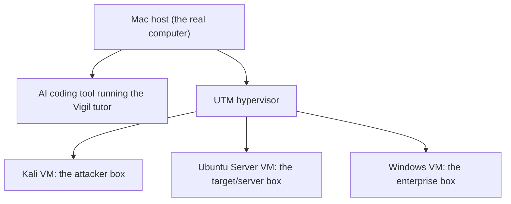

# Month 0: Setup and Home Lab Foundations

**Pattern family:** Setup
**Time budget:** 8 hours
**AI guidance:** AI-free zone. This month is configuration, not curriculum. Do the setup yourself so you understand the machine you will live inside for a year.
**Prerequisites:** A Mac, an internet connection, and having read `SAFETY.md` and `AI-ETHICS.md`.

## Why this month exists

Every hour you spend fighting a broken setup in Month 4 is an hour you are not learning packet analysis. Month 0 removes that risk up front. It kills, in advance, every excuse the next twelve months could offer: the VM that will not boot, the tool that was never installed, the Git identity that was never set, the AI agent that never loaded the tutor.

This is also the month you build the habit that defines the course. You write down what you did and why. The goal is not "a working home lab." The goal is a written record of a working home lab that someone else could rebuild.

## The home lab you are about to build

Here is the whole system in one picture. Your Mac is the **host**: the real computer that runs everything else. On top of it you run a **hypervisor** (software that runs a whole computer inside your computer). Inside the hypervisor live three **virtual machines** (VMs): fake computers you can break and reset at will. Your AI coding tool runs on the host too, and it loads the Vigil tutor from this repository.

*Notice: the three VMs sit inside the hypervisor, not on the bare Mac. That is why you can snapshot one, break it, and roll it back without touching your real machine.*

## Warm-Up: Retrieve Before You Begin

This is your first month, so there is no prior course material to recall. Instead, answer these from everyday experience, in writing, before you read on. They wake up what you already half-know.

1. You have probably "saved a game" before a hard boss fight, then reloaded after dying. How is that like or unlike making a backup of a whole computer?
2. When you delete a file on your laptop, it usually goes to the Trash and you can get it back. Do you think every system works that way? Why might some not?
3. You have an account on some website. What is the difference between information you would post publicly and information you would only keep in your private account settings?
4. If you let a friend borrow your phone to "just check one thing," what is the most damage they could do, and what would stop them?

Check your thinking

1. A snapshot is the computer version of a save point. You capture a known-good state, then return to it later. You will build this snapshot habit on every VM this month.
2. No. The Trash is a convenience the operating system adds. Many command-line tools delete for good, with no undo. Knowing where the safety net does and does not exist is a core security instinct.
3. Public information is anything you are willing for strangers to read. Private information stays where only you can see it. This month you will split your work into a private repository and decide, deliberately, what becomes public later.
4. The damage depends on what your account can do. A guest with limited power can do less than an owner. This is the idea of privilege, and it is why you keep AI agents and risky tools fenced into VMs you control.

## Learning objectives

By the end of this month, you can:

- **Stand up and snapshot** a virtual machine, and **explain** what a snapshot captures and what it does not.
- **Describe** your host's role and each VM's role in the home lab.
- **Use** Git and GitHub for your own work: init, commit, push, and **reason** about what belongs in a private versus a public repository.
- **Verify** that the Vigil tutor is active in your chosen AI coding tool, and **explain** the difference between full enforcement and advisory mode.
- **State**, from memory, what counts as a legal target for the course's labs and what does not.

## Recognition cue

When a later lab fails and you cannot tell whether the bug is in the lab instructions, your VM, or your host, a well-documented Month 0 is what lets you split the problem apart. If you ever cannot answer "what is the known-good state of this VM," come back here and build the snapshot discipline you skipped.

## Core concepts to internalize

Read these to understand the setup, not to memorize them. Each chunk is one idea. The hands-on, command-by-command steps live in `getting-started.md`; these are the ideas behind those steps.

### Host versus guest

Your Mac is the **host**: the physical computer you sit at. A **virtual machine** (VM), also called a **guest**, is a complete computer simulated in software and running on top of the host. The guest thinks it is a real machine. It has its own disk, memory, and operating system. But it is really a set of files on your Mac. That is the magic: you can copy it, reset it, or delete it without harming the host.

> **Common misconception.** "A virtual machine is just another app window, like a browser tab."
> **Reality.** A VM is a whole operating system, not an app. It boots, it has its own kernel, and it can be attacked and infected on its own. That isolation is the point: you run dangerous tools and malware samples inside the guest precisely so they cannot reach your host.

### The hypervisor

A **hypervisor** is the software that creates and runs VMs. There are two kinds. A **Type 1** hypervisor runs directly on the hardware, the way a data center runs servers. A **Type 2** hypervisor runs as an app on top of your normal operating system. Your home lab uses a Type 2 hypervisor: **UTM** on Apple Silicon, or an alternative if you are on Intel. You will meet this Type 1 versus Type 2 split again, in depth, in Month 1.

### Snapshots

> **Heavy concept ahead.** Slow down here; this is the load-bearing idea of the month.

A **snapshot** saves the exact state of a VM's disk at a moment in time, so you can return to it later. Think of it as a save point in a game. You take one right after a clean install, before you change anything. Then, when a lab leaves a VM broken or infected, you roll back to the snapshot and the VM is clean again in seconds.

There is one trap. A normal snapshot saves the **disk**, the data that survives a power-off. It does not, by default, save **RAM**, the fast memory that holds whatever the machine is doing right now. So if you snapshot a VM while it is running, the saved disk may not include work that was still in memory and not yet written out. The safe habit: shut the VM down cleanly first, then snapshot, so the disk is consistent.

> **Common misconception.** "A snapshot is a full backup of everything the machine was doing."
> **Reality.** A standard snapshot is a disk-state save, not a memory save. If the VM was running, anything still in RAM may be lost on rollback. This is exactly why investigators capture memory separately, a point you will return to in Month 1 and again in the forensics months.

### Where your work lives (private versus public)

You will keep two separate repositories, and they have two different jobs. A **repository** (repo) is just a folder whose history Git tracks.

- The **Vigil course repository** is this repo: the tutor and the curriculum. You never modify the shipped course files. The one place you write inside it is your **notebook entries**, under `.tutor/notebook/` (for example `.tutor/notebook/month-00.md`, this month's entry).
- Your **`my-vigil-work` repository** is a new, private repo you create for everything else you produce: your **deliverables** (such as this month's `home-lab/` directory), your **scripts and write-ups**, and your **lab scratch artifacts** (the working files a lab has you create).

The short rule: **notebook entries go in the course repo under `.tutor/notebook/`; everything else you make goes in `my-vigil-work`.** Keep `my-vigil-work` private. You will make individual pieces public later, on purpose, when they are ready, starting with the Month 1 write-up. `getting-started.md` states this same model in full.

### Full enforcement versus advisory mode

The Vigil tutor behaves differently depending on the AI tool you run it in. In **full enforcement** mode, the tool can read the locked rule files and is held to them tightly. In **advisory** mode, the tool follows the same rules by instruction, but with weaker technical guarantees. Neither mode will write a graded lab for you. Knowing which mode you are in tells you how much the tooling enforces, versus how much rests on your own honesty. `getting-started.md` shows the two checks that confirm the tutor is active in your chosen tool.

### Legal targets

You attack only systems you are allowed to attack. For this course that means: your own VMs, your own machine, and the deliberately vulnerable practice ranges you sign up for (picoCTF, TryHackMe, HackTheBox). It never means a machine you do not own and were not given written permission to test. Running a scan or an exploit against someone else's system can be a crime, even "just to see if it works." This rule is not course paperwork. It is the line between a security professional and a defendant, and you will restate it in your own words in this month's notebook entry.

> **Common misconception.** "If a system is reachable from the internet, it is fair game to poke at."
> **Reality.** Reachable does not mean authorized. Permission, not access, is what makes a target legal. The whole point of the home lab is to give you systems you are unquestionably allowed to attack, so you never have to guess.

## What to do

The detailed, command-by-command setup lives in `getting-started.md` at the repo root. Work through it end to end. This section is the checklist; that page is the manual.

1. **Host tooling.** Install Homebrew, a terminal you like, Git, and the GitHub CLI. Install `python3` (the Python interpreter) and confirm `python3 --version` prints a 3.x; Lab 1.1 uses it. Make sure you can create and save a file in one text editor (`nano`, preinstalled, or VS Code). Pick and install a password manager. Choose your working programming language now and commit to it: Python is the course default, and Bash is required no matter what else you pick.
2. **The Python primer.** Begin a self-paced, AI-free Python primer (the official Python tutorial at docs.python.org/3/tutorial, or "Automate the Boring Stuff with Python"). You start it now and work it on the side through Months 1 to 4, because the early months teach Bash, not Python, and Month 5 assumes the basics. Cover variables, control flow, functions, data structures, and reading a file line by line. The Python primer section of `getting-started.md` has the full bar.
3. **Version control.** Authenticate `gh`, set your Git identity, and create a private `my-vigil-work` repository for your own work. This is separate from the Vigil course repo. See "Where your work lives" below for what goes where.
4. **The hypervisor.** Install UTM (the Apple Silicon default) or an alternative.
5. **The VMs.** Provision Kali Linux, Ubuntu Server, and a Windows evaluation guest. You do not need all three at once. At a minimum, get Ubuntu Server installed and snapshotted this month, and confirm you can install the other two when their months arrive. Snapshot every VM right after a clean install. For Ubuntu Server, enable OpenSSH during the install, then practice the three skills Month 1 needs: log in at the console, confirm a shell prompt, and copy a file in with `scp`. `getting-started.md` walks all three.
6. **The AI coding tool.** Install one of the six supported agents (Claude Code, Codex CLI, Gemini CLI, OpenCode, Pi Coding Agent, or GitHub Copilot). Open this repository in it and verify the tutor activates, using the two checks in `getting-started.md`: it identifies itself, and it refuses to write a lab for you.
7. **A local AI model.** Install Ollama and pull one small model (`ollama pull llama3.2`). You will not use it until Month 11's AI-security labs, but it is asserted as set up by then, and it is the tool for any private or offline AI work. `getting-started.md` Step 5 has the commands.
8. **Accounts.** Create free accounts on picoCTF, TryHackMe, and HackTheBox.
9. **Read the scaffolding.** Read `SAFETY.md` and `AI-ETHICS.md` end to end. You will re-read both before Month 10.

## No labs this month

Month 0 has no labs and no hint ladder. It is the only month built this way. The work is configuration, and the verification is the deliverable. Because there are no labs, there is no worked-example staging here; the closest thing to a worked example is `getting-started.md`, which walks each setup step in order.

## A note on the rhythm

This is the first month, so there is no prior-month skill to warm-start from. Starting in Month 2, each month opens by re-running or extending something you built the month before, which keeps old skills alive. For now, the Warm-Up above does that job from everyday knowledge, and the snapshot you take this month becomes the very first artifact a later month will pull forward (Month 1 asks you to recall what your snapshot captured).

## Notebook entry requirements

Even with no labs, you commit one notebook entry this month, at `.tutor/notebook/month-00.md`. It is your setup record and the first artifact in your notebook habit. Required sections:

- **Host configuration.** Mac model, chip, RAM, macOS version, and the tools you installed with their versions.
- **VM inventory.** For each VM you provisioned: the guest OS and version, the resources you gave it (CPU, RAM, disk), the snapshot name and date, and one sentence on what you will use it for.
- **Decisions and friction.** Which AI agent you chose and why. Which alternatives you rejected. Every place the setup did not go smoothly: the symptom, and how you fixed it. This section is the most valuable. The friction you hit is the friction the next learner will hit.
- **Legal-target restatement.** In your own words, three sentences: what is a legal target for this course, what is never a legal target, and why the distinction matters to you personally.

No AI Provenance section yet; Month 0 is in the AI-free zone.

## Reflect

Spend ten minutes on these in your notebook (writing, not just thinking):

- **Explain it back:** in two or three sentences, explain to a friend what a snapshot saves and what it does not save if the VM is running when you take it.
- **Connect:** the home-lab diagram shows your AI tool on the host and the three VMs inside the hypervisor. Why does it matter, for safety, that the risky work happens inside the VMs and not on the host?
- **Monitor:** which setup idea is still fuzzy? Name it exactly (host versus guest, snapshots, private versus public repos, enforcement modes, or legal targets), and write the one question that would clear it up.

## End-of-month deliverable

A `home-lab/` directory in your `my-vigil-work` repository, documenting host configuration, VM inventory, and proof of a working snapshot for each VM you have provisioned so far. Full specification in `deliverable.md`.

## Cold revisit

None. Cold revisits begin in Month 2 and pull from Month 1.

## Knowledge Check

Answer from memory first, then check. This is the first month, so there are no earlier course months to call back to yet. Starting in Month 1, this section mixes the current month with spaced callbacks marked ⟲ to earlier months. Every question here is from this month.

1. What is the difference between the host and a guest, and why can you safely break a guest?
2. What does a standard snapshot save, and what does it not save if you take it while the VM is running?
3. What is the safe habit for taking a snapshot, and why does it produce a cleaner result?
4. Name the three VMs in the home lab and give a one-line role for each.
5. Is UTM a Type 1 or a Type 2 hypervisor, and what is the difference between the two?
6. Why do you keep `my-vigil-work` private, and what is the difference between it and the Vigil course repo?
7. What are the two checks that confirm the Vigil tutor is active in your AI tool?
8. What is the difference between full enforcement mode and advisory mode?
9. Give one example of a legal target for this course and one example of a target that is never legal, and state the rule that separates them.
10. Why is "the system is reachable from the internet" not enough to make it a legal target?

Answer key

1. The host is your real Mac; a guest is a whole operating system simulated in software on top of it. You can break a guest because it is just files on the host, isolated from it, and you can roll it back to a snapshot.
2. A standard snapshot saves the VM's disk state. It does not, by default, save RAM, so work still in memory at the moment of the snapshot can be lost on rollback.
3. Shut the VM down cleanly first, then snapshot. The disk is then consistent, with nothing left unwritten in memory.
4. Kali Linux (the attacker box), Ubuntu Server (the target or server box), and Windows (the enterprise box).
5. UTM is a Type 2 hypervisor: it runs as an app on top of macOS. A Type 1 hypervisor runs directly on the hardware, as in a data center.
6. You keep `my-vigil-work` private because it can hold details about your personal machine and unfinished work. The Vigil course repo holds the shared tutor and curriculum; `my-vigil-work` holds your own artifacts.
7. The tutor identifies itself when asked what it is, and it refuses to write a graded lab for you.
8. Full enforcement means the tool can read the locked rules and is held to them with stronger technical guarantees. Advisory mode follows the same rules by instruction but with weaker guarantees. Neither will write a lab for you.
9. Legal: your own Ubuntu VM, or a HackTheBox machine you signed up for. Never legal: a stranger's server you do not own and were not given written permission to test. The rule: permission, not access, makes a target legal.
10. Reachable does not mean authorized. Anyone can reach a public server, but only the owner's written permission makes testing it lawful.

## How to know you are done with this month

- `getting-started.md` worked through end to end.
- Host tooling installed and checked: `python3 --version` prints a 3.x, and you can create and save a file in one editor.
- At least Ubuntu Server installed and snapshotted; Kali and Windows either provisioned or confirmed-provisionable.
- You can log in to the Ubuntu Server VM, reach a shell prompt, and copy a file into it with `scp`.
- Ollama installed and one small model pulled (you confirm it runs; you do not use it until Month 11).
- The Python primer started, with a plan to finish it by the end of Month 4.
- The tutor verified active in your chosen agent (both checks pass).
- The `home-lab/` deliverable committed to your `my-vigil-work` repo.
- The `month-00.md` notebook entry committed to `.tutor/notebook/`, including the friction log and the legal-target restatement.

If any of the above is missing, the month is not done. The tutor will not advance you to Month 1 until the notebook entry and the `home-lab/` deliverable are present.

## Resources

The command-by-command manual for this month is `getting-started.md` at the repo root. The two rule files you must read in full are `SAFETY.md` and `AI-ETHICS.md`, also at the repo root.
