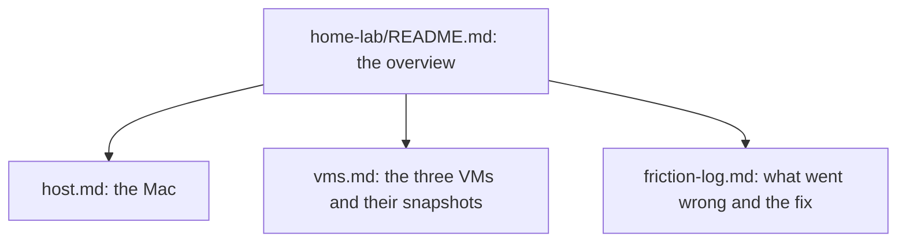

# Month 0 Deliverable: The Documented Home Lab

**Recall first, from memory:** before you read on, picture the home-lab diagram from the month README. What sits on the host, and what sits inside the hypervisor? This deliverable is the written version of that picture.

## What you produce

A `home-lab/` directory in your `my-vigil-work` repository. It is the reproducible record of your lab environment. Here is the standard you are aiming for: a competent stranger could read this directory and rebuild your lab without asking you a single question.

## Required contents

```
home-lab/
├── README.md            # Overview: host, hypervisor, the three VMs, how they connect
├── host.md              # Your Mac: model, chip, RAM, macOS version, installed tools + versions
├── vms.md               # Per-VM inventory: OS, version, resources, snapshot name + date, purpose
└── friction-log.md      # Every setup problem you hit and how you resolved it
```

That structure maps onto the system you built this month:


*Notice: the README is the front door. Each other file documents one layer of the lab, so a reader can drill into the part they care about.*

## Acceptance criteria

- **`README.md`** describes the lab in plain language: what the host is, which hypervisor you chose and why, which VMs exist, and a one-line statement of each VM's role. If you have sketched the network layout (you will formalize it in Month 3), include it. A hand-drawn photo committed to the repo is fine at this stage.
- **`host.md`** lists the host hardware and every tool you installed, with its version, captured from the real command output (for example, `brew list --versions` for Homebrew packages). Versions matter. When a lab breaks in Month 7, the first question is "what version are you running."
- **`vms.md`** has one section per VM. Each section names the guest OS and version, the CPU, RAM, and disk you gave it, the exact snapshot name and the date you took it, and one sentence on the VM's purpose. At a minimum, Ubuntu Server must be fully provisioned and snapshotted. For Kali and Windows, either provision them now or write a one-paragraph plan for provisioning them when their months arrive, including the Apple Silicon Windows Server caveat from `getting-started.md` if it applies to you.
- **`friction-log.md`** documents every place setup did not go smoothly. For each: the symptom, what you tried, and what fixed it. An empty friction log means either a suspiciously perfect setup or an incomplete record, and the tutor will ask about it.

## Verification

The tutor checks that the files are present, then asks you to expand one section from memory. For example: "explain what your Ubuntu Server snapshot captures, and what it does not capture if the VM is running when you take it." If you cannot answer, the snapshot discipline is not yet real for you, and the deliverable returns.

## What this deliverable is teaching

Not "how to install a VM." It is teaching documentation-as-you-go, the habit that separates a practitioner whose work can be trusted from one whose results cannot be reproduced. Every deliverable in this course is, at bottom, a test of whether you can make your work clear to someone else. Start here, where the stakes are low.

## A note on what stays private

The `home-lab/` directory can hold details about your personal machine. Keep `my-vigil-work` private for now. Nothing in Month 0 needs to be public. The first artifact you will choose to make public is the Month 1 boot-process write-up, and only when you decide it is ready.
