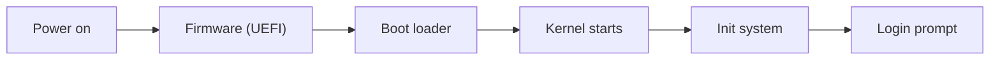

# Month 1: IT Foundations and Hardware

**Pattern family:** Foundational · **Time budget:** 40 hours · **AI guidance:** AI-free zone. No AI on any lab this month. · **Prerequisites:** Month 0 done (VMs working, tutor active, notebook started).

## Overview

Security work assumes you know how a computer actually works. Not in a hand-wavy way, but concretely: what happens between pressing the power button and seeing a login screen, what the kernel is, why running as an administrator is risky, and how a virtual machine differs from a normal program. Most people can use a computer well but cannot answer any of those. This month fixes that. Everything in Months 2 through 12 sits on top of it.

Here is the chain you will come to understand this month. It is the path your computer walks every time it turns on:

*Notice: control is handed from one stage to the next, like a relay race. Each stage trusts the next one to be genuine. That chain of trust is where a whole class of attacks lives.*

## Warm-Up: Retrieve Before You Begin

This is your first month, so there is no prior course material to recall. Instead, answer these from everyday experience, in writing, before you read on. They wake up what you already half-know.

1. When you press the power button, what is the very first thing you think the computer does?
2. Your computer has memory (RAM) and a disk. What is the difference, in your own words? Which one forgets everything when the power goes off?
3. When an app "asks the operating system" to save a file, why can the app not just write to the disk itself?

Check your thinking

1. The hardware powers up and runs firmware (a small program stored on the motherboard) before any operating system exists. You will meet this as UEFI in Lab 1.2.
2. RAM is fast, temporary working memory; it is wiped when power is lost. The disk is slower but keeps data without power. "Volatile" versus "persistent."
3. The disk is a shared resource, and letting every app write to it directly would be chaos and a security hole. The operating system's kernel guards it; apps must ask. You will meet this as the kernel-versus-userspace boundary below.

## Learning objectives

By the end of this month you can:

- **Explain**, in writing for a smart non-engineer, what happens at boot from power-on to login.
- **Identify** the main hardware parts of your own machine and say what each does.
- **Distinguish** kernel space from user space, and explain why the line matters for security.
- **Describe** the difference between BIOS and UEFI, and why it matters.
- **Distinguish** a Type 1 from a Type 2 hypervisor and say when each is used.
- **Read** the output of `system_profiler`, `lscpu`, `lsblk`, and similar tools without help.

## Recognition cue

When a later month asks "why does this attack work," and you are not sure whether the attack hits the kernel, the firmware, the user-space program, or the network, that uncertainty traces back to a gap in this month. Come back here.

## Core concepts to internalize

Read these to understand the labs, not to memorize them. Each chunk is one idea.

### Computer architecture

A computer is a processor (**CPU**, the part that does the work), **RAM** (fast temporary memory), **storage** (a slower disk that keeps data without power), and **buses** (the wiring that moves data between them). The CPU fetches instructions and data from memory and runs them. That is the whole loop, repeated billions of times a second.

> **Common misconception.** "RAM and storage are basically the same, just different sizes."
> **Reality.** They are different in kind, not size. RAM is wiped the instant power is lost; storage keeps data. This is why unsaved work disappears in a crash, and it is why "what was in memory" and "what was on disk" are two separate questions in a security investigation.

### Boot process

When you press power, the hardware runs a self-test, then hands control to **firmware** (UEFI on modern machines), which finds and runs a **boot loader**, which loads the **kernel** (the core of the operating system), which starts the **init system** (the first program, which starts everything else), which finally shows you a login prompt. You traced this chain in the Overview diagram and you will see it live in Lab 1.2.

### Kernel versus user space

> **Heavy concept ahead.** Slow down here; this is the load-bearing idea of the month.

The **kernel** is the part of the operating system with full control of the hardware. Your apps run in **user space**, with limited power. When an app needs something only the kernel can do (read a file, open a network connection), it makes a **system call**, a controlled request across the boundary. This split exists so that a buggy or malicious app cannot directly trash the disk, the memory of other programs, or the network. "Running as root" means running with kernel-level power, which is why doing it casually is dangerous: a mistake or an exploit then has no guard rail.

> **Common misconception.** "Administrator and a normal user are just different menus and permissions in the settings app."
> **Reality.** The difference is enforced by the CPU and the kernel, far below the settings app. An administrator (root) can cross boundaries a normal user cannot, which is exactly why attackers work so hard to "escalate privileges" to root.

### Filesystems, interrupts, and virtualization

A **filesystem** is just an agreed way to organize bytes on a disk (APFS on Macs, NTFS on Windows, ext4 on Linux). An **interrupt** is a signal that makes the CPU stop and handle something now (a key was pressed; a program made a system call); interrupt handling is a security boundary because it is a controlled doorway into the kernel. **Virtualization** runs a whole computer inside another: a **Type 1** hypervisor runs on bare metal (data-center style), a **Type 2** hypervisor runs as an app on your desktop (UTM, VMware Fusion, VirtualBox; this is your home lab).

## Labs

Three labs, done in order. Each has its own folder under `labs/` with a full spec.

| Lab | Folder | Time | What you build |
| --- | ------ | ---- | -------------- |
| 1.1 Hardware Inventory | `labs/lab-01-hardware-inventory/` | 8 to 10 h | A Bash script that inventories any Mac |
| 1.2 EFI Shell and the Boot Process | `labs/lab-02-efi-shell-boot/` | 10 to 12 h | A correct mental model of the boot chain |
| 1.3 picoCTF General Skills | `labs/lab-03-picoctf-general-skills/` | 10 to 12 h | Shell fluency and the no-flag habit |

## A note on the rhythm

This is the first month, so there is no prior-month skill to warm-start from. Starting in Month 2, each month opens by re-running or extending something you built the month before, which keeps old skills alive. For now, the Warm-Up above does that job from everyday knowledge.

## Notebook entry requirements

Each lab gets a notebook entry at `.tutor/notebook/lab-NN-<slug>.md` with:

- **Pre-flight check** (for any new tool): what it does, what traces it leaves, what could go wrong, and the authorization scope.
- **Concept naming:** name what the lab taught, in your own words.
- **Evidence:** command output, screenshots, file references; enough that someone else could confirm you did the work.
- **Five-question debrief:**
  1. What did this lab teach? Name the concept or technique.
  2. What input shape or system behavior tells you to reach for it?
  3. What artifact did you produce, and what would dominate at scale?
  4. What edge case or failure would have broken your first attempt?
  5. What would you do differently in three weeks when you redo it cold?

No AI Provenance section yet; Month 1 is in the AI-free zone.

## Reflect

Spend ten minutes on these in your notebook (writing, not just thinking):

- **Explain it back:** in two or three sentences, explain the kernel-versus-user-space boundary to a friend who has never thought about it.
- **Connect:** how does the boot chain in the Overview relate to the snapshot you took in Month 0? What does a snapshot capture about that chain?
- **Monitor:** which idea this month is still fuzzy? Name it exactly, and write the one question that would clear it up.

## End-of-month deliverable

A `month-01-foundations.md` writeup explaining what happens between pressing power and seeing a login prompt, written for a smart non-engineer, 800 to 1500 words. Full spec in `deliverable.md`. This is the first piece in your public portfolio.

## Cold revisit

None this month. The first cold revisit is on the third Friday of Month 2 and pulls from Month 1.

## Common pitfalls

- **Googling command output instead of reading `man`.** The skill is reading the manual, not collecting answers. Resist the search bar.
- **Treating `set -euo pipefail` as noise and deleting it.** It surfaces real bugs in your script. Keep it and fix what it finds.
- **Skipping the by-hand inventory and going straight to the script.** You cannot script what you have not done by hand once.
- **Confusing "free" memory with "available" memory.** `vm_stat` reports several states; read what each means before you report a number.

## Knowledge Check

Answer from memory first, then check. Items marked ⟲ are callbacks to Month 0 and are supposed to feel like a small stretch.

1. Put these in boot order: kernel, firmware, login prompt, boot loader, init system.
2. Your script must stop the moment a command fails. What line makes that happen, and what does each letter in it do?
3. What is the difference between RAM and storage, and why does it matter in a security investigation?
4. ⟲ What does a VM snapshot capture, and what does it miss if the VM is running when you take it?
5. ⟲ Why did Month 0 have you keep your `home-lab/` notes in a private repo rather than a public one?

Answer key

1. firmware, boot loader, kernel, init system, login prompt.
2. `set -euo pipefail`: `-e` exits on a failed command, `-u` errors on an unset variable, `-o pipefail` makes a pipeline fail if any stage fails.
3. RAM is volatile (lost on power off), storage is persistent. An investigator must capture volatile memory separately and quickly, because it vanishes; disk evidence survives.
4. It captures disk state. If the VM is running, RAM and in-flight state may not be fully captured unless you take a memory snapshot too.
5. It can contain details about your personal machine and is not yet a polished portfolio piece; you make work public deliberately, when it is ready.

## How to know you are done

- Three lab notebook entries committed (`lab-01-...`, `lab-02-...`, `lab-03-...`).
- The boot-process writeup committed.
- `.tutor/lab-log.md` shows all three labs logged.
- `.tutor/progress.md` updated to "Month 1 complete; ready for Month 2."

If any of these is missing, the month is not done. The tutor will not advance you until all four are present.

## Resources

Curated free resources, primary sources first, in `reading.md`.
