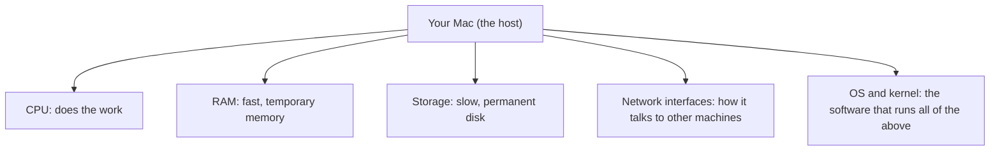

# Lab 1.1: Hardware Inventory

**Month:** 1 (IT Foundations and Hardware) · **Pattern family:** Foundational · **Time budget:** 8 to 10 hours (across several sessions; do not do it in one) · **Lab attempt floor:** 60 minutes · **AI guidance:** AI-free zone. No AI on this lab. · **Builds on:** Month 0 setup. You can run a single command in a terminal. You do not need to know how to write a script yet; you will learn that here.

## Why this lab exists

You do not really know what is inside your computer. You know it has some memory and a disk, but you probably cannot say what kind of processor it has, how fast the memory is, what file system the disk uses, or which network connections are active. That is normal. It is also a gap, because the rest of this course assumes you can answer those questions about any machine you sit down at, in about five minutes, using only the tools already on it.

This lab closes that gap and builds a habit. You will inventory your own Mac by hand first, then write a small program that does it for you. By the end you will own a tool you wrote and understand, and you will trust your own inspection of a machine over what a spec sheet claims.

**Recall first, from memory, before you read on:** in Month 0 you took a snapshot of a VM. What does a snapshot save, and what does it not save if the machine is running when you take it? (Hold your answer in your head; this lab is about inspecting a live machine's real state, which is exactly the part a running snapshot can miss.)

## Learning objectives

By the end of this lab you can:

- **Find and explain** the processor, memory, storage, and network details of any Mac using only built-in commands.
- **Write** a Bash script that runs commands and prints a clean, organized report.
- **Read** the output of `system_profiler`, `sysctl`, `ifconfig`, and `df` and say what each field means.
- **Decide** a hardware question (for example, "does this Mac have enough memory for X") by inspecting the machine, not by trusting a marketing page.

## Recognition cue

When a future lab or a future job asks "what are the resources on this host," you should reach for an inventory script. This lab is where you build that script and that reflex.

## The shape of the machine

Here is the mental model you are filling in. A computer is a few kinds of parts, and your job is to read each one.


*Notice: every machine you ever inspect has these same five areas. The commands change between Mac, Linux, and Windows, but the questions do not.*

## Tasks

Do these in order. Do not skip ahead. Each task says exactly what "done" looks like.

### Task 1: Inventory by hand (90 minutes)

First, make a folder for this lab inside your `my-vigil-work` tree, and work from inside it. Every file this lab creates, and the self-verify one-liner at the end, assume you are sitting in this folder:

```zsh
mkdir -p ~/my-vigil-work/month-01/lab-01-hardware-inventory
cd ~/my-vigil-work/month-01/lab-01-hardware-inventory
```

(Adjust the path if you cloned `my-vigil-work` somewhere other than your home directory.) When a task below says "in this lab's folder," it means this folder, not the shipped course repo. The reminder of where files live is in `getting-started.md` under "Where your work lives."

Now open Terminal. Without writing any script, run commands one at a time and write down, in plain words, the following about your Mac:

- The processor: model, number of cores, and base speed.
- The memory: total amount, how much is free right now, and how much swap is in use. (Swap is disk space the operating system uses as overflow when RAM is full.)
- The storage: each internal disk's model, size, file system, and free space.
- The network interfaces: each one's name, hardware (MAC) address, IPv4 address, and link speed.
- The system: macOS version, kernel name and version, and whether the chip is `arm64` or `x86_64`.

Commands to start from (you will need to read their output carefully, and you may need others):

```zsh
system_profiler SPHardwareDataType
sysctl -a | grep -i cpu
sysctl hw.memsize
vm_stat
df -h
ifconfig
sw_vers
uname -a
```

New here: in `sysctl -a | grep -i cpu`, the `|` (pipe) sends one command's output into another, `grep` keeps only the lines that match a word, and `-i` makes that match ignore upper- and lower-case. You will use pipes and `grep` constantly from Month 2 on; this is your first taste.

**Checkpoint:** you have a file `inventory-manual.md` in this lab's folder with every field above filled in, in your own words, plus one short note per field saying which command gave you the answer.
**If not:** if a command printed a wall of text you could not read, that is expected; pipe it through `less` (a scrollable pager you exit with `q`), for example `sysctl -a | less`, search inside with `/`, and quit with `q`. Do not paste the raw wall into your file; write the one value you were looking for.

### Task 2: Understand two things you wrote down (30 minutes)

Pick at least two fields from Task 1 and explain them in a paragraph each, using only what you can confirm from `man` pages and official documentation. Good candidates: what an "L1 cache" is and why it might matter for security; what "page size" means; what an interface "MTU" is and why it has the value it does; the difference between physical and logical cores. The tutor will not explain these for you. Reading the manual yourself is the skill.

**Checkpoint:** two paragraphs added to `inventory-manual.md` under a heading "What I now understand that I did not before."
**If not:** if you cannot find an answer in `man`, widen your source to the official Apple or Intel documentation, and cite the page. If you still cannot, write the precise question you are stuck on; that question is useful by itself.

### Task 3: Write the inventory script

This is the new skill of the lab: turning commands you ran by hand into a script that runs them for you and prints a tidy report. You will learn it in three stages. Type everything yourself.

#### Stage 1 - Worked example (I do)

Run this exact tiny script and study it. It is not the lab's deliverable; it is a worked example that shows the technique on just two fields (the macOS version and the chip). Create `demo.sh` in this lab's folder, type this in, and run it with `bash demo.sh`:

```zsh
#!/bin/bash
set -euo pipefail

echo "=== System ==="
echo "macOS version: $(sw_vers -productVersion)"
echo "Architecture:  $(uname -m)"
```

Line by line: `#!/bin/bash` tells the system which program runs the file. `set -euo pipefail` makes the script stop on errors instead of limping on (you will be grateful for this). `echo` prints a line. The `$( ... )` runs a command and drops its output right into the text. That is the whole trick: run a command, capture its output, label it, print it.

**Checkpoint:** running `bash demo.sh` prints two lines with your real macOS version and `arm64` (or `x86_64`).
**If not:** if you see "permission denied," you ran `./demo.sh` without making it executable; for now just run `bash demo.sh`. If it complains about `set -euo pipefail`, you typed a smart quote instead of a straight quote; retype the line.

#### Stage 2 - Faded practice (we do)

Now extend the example yourself. Copy `demo.sh` to `inventory.sh` and add a `=== CPU ===` section that prints the processor model and the core count, following the exact pattern from Stage 1. The skeleton and the goals are below; you fill in the two blanks.

```zsh
#!/bin/bash
set -euo pipefail

echo "=== System ==="
echo "macOS version: $(sw_vers -productVersion)"
echo "Architecture:  $(uname -m)"

echo "=== CPU ==="
echo "Model: $( ___ )"          # TODO: the command that prints the CPU model (you used it in Task 1)
echo "Cores: $( ___ )"          # TODO: the command that prints the core count
```

You already ran the commands that produce these values in Task 1. Your job is to drop them into the `$( )` slots and confirm the output looks right.

**Checkpoint:** `bash inventory.sh` prints a System section and a CPU section with your real chip model and a sensible core count.
**If not:** if a section prints a blank value, run the command alone on the prompt first and confirm it prints what you expect; then put exactly that command inside the `$( )`. If the script stops early with no clear error, one of your commands failed and `set -e` halted it; run them one by one to find which.

#### Stage 3 - Independent (you do)

No scaffolding now. Finish `inventory.sh` so it reports everything you gathered by hand in Task 1: System, CPU, Memory, Storage, and Network, each as its own labeled section. Then add a `--json` option: when the script is run as `bash inventory.sh --json`, it prints the same information as valid JSON instead of the plain-text report. Work out each section yourself, the way you did the CPU section, before you run it.

The `--json` part is the hardest piece, and it is meant to be. Producing JSON from Bash by hand is fiddly. That fiddliness is a lesson you will cash in during Month 5, when you meet a language that makes it easy.

**Checkpoint:** `bash inventory.sh` prints all five sections; `bash inventory.sh --json | python3 -m json.tool` prints without error (that command fails loudly if your JSON is malformed).
**If not:** if the JSON check errors, the most common cause is a missing comma between fields or a stray trailing comma; build the JSON one field at a time and re-run the check after each.

### Task 4: Try it on Linux and read the failures (60 minutes)

Copy `inventory.sh` to your Ubuntu Server VM from Month 0 and run it there. It will mostly fail, because Linux uses different commands than macOS. Do not fix it. Instead, write a file `linux-port-notes.md` listing: which commands failed and why, what the Linux equivalent would be for each, and a rough estimate of how much work a cross-platform version would be.

**Checkpoint:** `linux-port-notes.md` exists with those three sections, based on what actually happened when you ran it, not on what you guessed would happen.
**If not:** if the script will not even start on Ubuntu, check the very first failure (often `system_profiler: command not found`, since that command is macOS-only); that first failure is your first note.

### Task 5: Notebook entry (60 minutes)

Write the lab notebook entry at `.tutor/notebook/lab-01-hardware-inventory.md`. Required sections:

- **Pre-flight check.** For `system_profiler`, `sysctl`, `vm_stat`, `ifconfig`, and your own script: what each does, what traces it leaves on the system, what could go wrong, and the authorization scope (this is your own machine, so you are trivially authorized; say so explicitly anyway, because stating scope is a habit you build now).
- **Concept naming.** What did this lab teach? Hint: it is not "I learned shell scripting."
- **Evidence.** Key parts of `inventory-manual.md`, the finished script, and a sample of both outputs.
- **Five-question debrief.** All five questions, answered with substance, not one-liners.

**Checkpoint:** the entry is committed and contains all four sections.
**If not:** if you are unsure what the five debrief questions are, they are listed in the month README and in `tutor-reference.md`; the tutor will reject an entry that is missing any of them.

## Definition of Done

You are done when all of these are true:

- `inventory-manual.md` is complete, in your own words.
- `inventory.sh` runs with no errors, prints all five sections, and produces valid JSON with `--json`.
- `linux-port-notes.md` honestly records what failed on Ubuntu.
- The notebook entry is committed with all sections.
- Your Git log shows a commit for each artifact.

Self-verify with this one-liner from the lab folder; it should print `OK`:

```zsh
bash inventory.sh >/dev/null && bash inventory.sh --json | python3 -m json.tool >/dev/null && echo OK
```

**Self-explain:** in one sentence, why does `set -euo pipefail` make a script safer to trust than one without it?

## Stretch goals

1. Add a `--section cpu` option that prints only the section you name.
2. Make the script detect whether it is on macOS or Linux and pick the right command for one field (just one; this is a taste of Task 4's "real work").
3. Color the section headers using terminal escape codes, then add a `--no-color` flag for when the output is piped to a file.

## Troubleshooting

- **`permission denied: ./inventory.sh`** - the file is not marked executable. Either run it as `bash inventory.sh`, or run `chmod +x inventory.sh` once and then `./inventory.sh`.
- **The script stops with no obvious error** - `set -e` halts on the first failed command. Run your commands one at a time on the prompt to find the one that failed.
- **`system_profiler` is slow** - it is; it gathers a lot. Call it once, save its output to a variable or a temp file, and read fields from that instead of calling it repeatedly.
- **Smart quotes break the script** - if you pasted from a document, curly quotes may have replaced straight quotes. Retype the line in your editor.

## Time budget breakdown

- Task 1: 90 minutes
- Task 2: 30 minutes
- Task 3: 90 to 150 minutes (most learners overrun the `--json` part; budget two sessions)
- Task 4: 60 minutes
- Task 5: 60 minutes
- Buffer for things going wrong: 60 to 120 minutes

Total: 6 to 9 hours, plus float. If you pass 12 hours, stop and read `tutor-reference.md` on what to do when truly stuck.

## Resources

- `man system_profiler`, `man sysctl`, and `man bash` (read the `set` section) in your terminal.
- `system_profiler -listDataTypes` to see every category you can query.
- No outside links. Everything you need for this lab is already on your machine.
