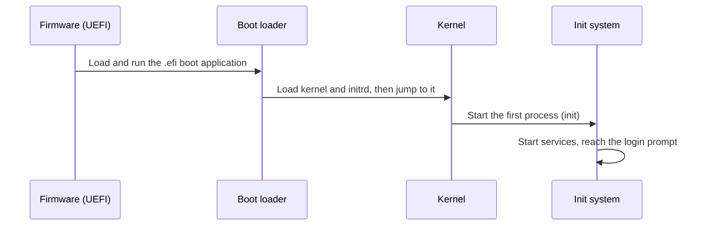

# Lab 1.2: EFI Shell and the Boot Process

**Month:** 1 (IT Foundations and Hardware) · **Pattern family:** Foundational · **Time budget:** 10 to 12 hours (across several sessions) · **Lab attempt floor:** 60 minutes · **AI guidance:** AI-free zone. No AI on this lab. · **Builds on:** Lab 1.1 done. You have an Ubuntu Server VM from Month 0 with a snapshot you can roll back to.

## Why this lab exists

In Lab 1.1 you learned what is inside the machine. This lab is about what the machine does in the first few seconds after you press power, before any operating system you would recognize is running.

That early window is the handoff from firmware to boot loader to kernel. A whole class of attacks lives there. Bootkits, evil-maid attacks, and Secure Boot bypasses all target this window. So does a whole class of recovery work: a server that will not boot is a server you fix from the firmware up. You cannot reason about either if "it just boots" is the limit of your model.

You will interrupt the boot of a VM on purpose. You will look at the firmware layer directly, find the boot loader, and trace the handoff from firmware to kernel. You will break nothing on your host. That is why you built VMs.

**Recall first, from memory, before you read on:** in Lab 1.1 you named the five areas of any machine (CPU, RAM, storage, network, OS and kernel). Which one holds the kernel before the kernel is running, and which one runs the kernel once it is loaded? (Hold your answer in your head. This lab watches the kernel travel from storage into memory and start running, which is the gap your inventory script never showed you.)

## Learning objectives

By the end of this lab you can:

- **Explain** the UEFI boot sequence from power-on to kernel handoff, naming each stage and what hands control to the next.
- **Locate** and read the contents of an EFI System Partition (ESP), and **explain** what a `.efi` boot application is.
- **Identify** the boot loader your Ubuntu VM uses and explain its role between firmware and kernel.
- **Analyze** the output of `efibootmgr` and explain how UEFI boot entries are stored.
- **Defend**, in security terms, why the firmware-to-kernel handoff is a trust boundary and what Secure Boot protects.

## Recognition cue

When a machine will not boot, or when you read about a firmware-level attack, you reach for a mental model of the boot chain: which stage runs, what it trusts, and what it hands off. This lab builds that model on a machine you can safely break.

## The handoff, stage by stage

Here is the chain you are tracing. Each stage loads the next and then steps aside.


*Notice: each arrow is a one-way handoff. Once firmware runs the boot loader, firmware is done. Once the boot loader jumps to the kernel, the boot loader is done. Each stage trusts the next to be genuine, which is exactly where Secure Boot tries to add a check.*

## Tasks

Do these in order. **Snapshot your VM before Task 1** so you can roll back. Each task says exactly what "done" looks like.

### Task 1: Map the boot sequence from observation (60 minutes)

Before you touch the firmware, write down what you already believe happens between pressing power and the login prompt. Then boot your Ubuntu Server VM and watch closely. Pause the VM, or use your hypervisor's boot-menu key, to slow the sequence down.

Write down, in order, the stages you can observe or infer. The chain runs: firmware starts up, firmware hands off to a boot loader, the boot loader shows (or skips) a menu, the kernel loads, the init system starts, and the login prompt appears. For each stage, write one sentence on what it is doing.

**Checkpoint:** you have a file `boot-sequence.md` in this lab's folder with an ordered list of boot stages, one sentence each, written before you looked anything up. Mark clearly which stages you saw directly and which you inferred.
**If not:** if the boot is too fast to see anything, that is normal. Note what scrolled past too quickly to read, and infer the rest from the diagram above. You will correct this document in Task 4, so an honest rough draft now is the right move.

### Task 2: Reach the firmware and the boot manager (90 minutes)

Restart the VM and interrupt the boot to enter the UEFI firmware setup or boot manager. The exact key (often Esc, F2, F12, or Delete) depends on your hypervisor's firmware. Check your hypervisor's documentation. In UTM and most QEMU-based setups, the guest uses EDK2/OVMF firmware. That firmware shows a boot manager and, on many builds, an "EFI Internal Shell."

Explore what the firmware exposes: the boot order, the boot entries, and the firmware settings. If an EFI shell is available, enter it and run `map` to list the filesystems it recognizes, then `ls` the EFI System Partition.

If your firmware has no built-in EFI shell, do not fight it. Note that fact and use the Task 3 fallback, which reaches the same information from inside the booted OS. Reaching the concept is what matters. The specific tool does not.

**Checkpoint:** you have a file `firmware-notes.md` recording what your firmware exposed: the boot entries you saw, the boot order, and (if you reached an EFI shell) the output of `map`. You committed screenshots of the firmware screens to this folder, each with a one-line caption.
**If not:** if you cannot interrupt the boot, the window is short. Press the menu key repeatedly the instant the VM powers on, before the loading bar. If there is no EFI shell at all, write that down and move to Task 3; you lose nothing pedagogically.

### Task 3: Read the EFI System Partition and find the boot loader

This is the new skill of the lab: reading boot configuration and saying what it means. You will learn it in three stages. The first two use sample output that is not from your machine, so you can study the technique. The third has you read your own VM.

#### Stage 1 - Worked example (I do)

Study this sample. It is invented for teaching, not from your VM. It is what `efibootmgr -v` might print on a typical Ubuntu machine. Read the annotations; do not run anything yet.

```text
BootCurrent: 0001
BootOrder: 0001,0000
Boot0000* UiApp     FvVol(...)/FvFile(...)
Boot0001* ubuntu    HD(1,GPT,...)/File(\EFI\ubuntu\shimx64.efi)
```

Line by line. `BootCurrent: 0001` means the machine booted using entry `0001` this time. `BootOrder: 0001,0000` is the list the firmware tries in order: entry `0001` first, then `0000`. `Boot0001* ubuntu` is a named entry; the `*` means it is active (the firmware will use it). The path `\EFI\ubuntu\shimx64.efi` is the `.efi` file the firmware runs for that entry. A **`.efi` file** is a small program the firmware can run on its own, before any operating system exists. `shimx64.efi` is the first link Ubuntu uses, and it is signed so Secure Boot will trust it.

So the whole entry says: "to boot Ubuntu, the firmware runs the program at `\EFI\ubuntu\shimx64.efi` on the EFI partition." That is the firmware-to-boot-loader handoff, written in one line.

**Checkpoint:** you can point at the sample and say, in your own words, which entry booted, what order the firmware tries entries in, and which file the firmware runs for Ubuntu.
**If not:** if `BootCurrent`, `BootOrder`, and the `Boot####` entries blur together, slow down. `BootCurrent` is "what happened," `BootOrder` is "the plan," and each `Boot####` is "one option, and the file it points to."

#### Stage 2 - Faded practice (we do)

Here is a second invented sample. This one has a fallback entry. Answer the two questions in the comments before you read on.

```text
BootCurrent: 0002
BootOrder: 0002,0003
Boot0002* ubuntu    HD(1,GPT,...)/File(\EFI\ubuntu\shimx64.efi)
Boot0003* UEFI OS   HD(1,GPT,...)/File(\EFI\BOOT\BOOTX64.EFI)
# TODO 1: which entry booted this time, and which file did it run?
# TODO 2: \EFI\BOOT\BOOTX64.EFI is the "fallback" path. What do you think
#         the firmware uses it for, given it is second in BootOrder?
```

For TODO 1, read `BootCurrent` and match it to the `Boot####` line. For TODO 2, recall from Stage 1 that the firmware tries entries in `BootOrder` from left to right; the second one is what it falls back to if the first is missing or fails. `\EFI\BOOT\BOOTX64.EFI` is the standard removable-media fallback every UEFI machine knows to try.

**Checkpoint:** you wrote that entry `0002` booted and ran `shimx64.efi`, and that `BOOTX64.EFI` is the default fallback the firmware uses when the named entry is gone.
**If not:** if you matched the wrong entry, check that the number after `BootCurrent:` matches the number in `Boot####` exactly. `0002` matches `Boot0002`, not `Boot0003`.

#### Stage 3 - Independent (you do)

No scaffolding now. Boot Ubuntu normally, log in, and read your own real boot configuration:

```bash
mount | grep boot
ls -R /boot/efi
efibootmgr -v
```

From your own output, identify: where the ESP is mounted, what `.efi` files live on it, which boot loader Ubuntu installed (look under `/boot/efi/EFI/`), and what `efibootmgr -v` reports as the boot entries and their order. Then find the boot loader's configuration under `/boot/grub/` and read it. Do not edit anything. Read it.

**Checkpoint:** you added a section to `firmware-notes.md` titled "From inside the OS" with: the ESP mount point, a listing of the `.efi` applications you found, the name of your boot loader, and key excerpts of its configuration, with your own notes on what two or three entries do.
**If not:** if `/boot/efi` is empty or missing, the ESP may not be mounted; check `mount | grep boot` for where it actually lives. If `efibootmgr` says "EFI variables are not supported," your VM may have booted in legacy BIOS mode, not UEFI; note that and use what `ls -R /boot/efi` and the grub config still show you.

### Task 4: Reason about the handoff and correct your model (60 minutes)

Return to `boot-sequence.md`. Correct every stage you got wrong in Task 1. Put the corrections under a new heading titled "Corrected model" so the original and the correction both survive. Then answer, in writing:

- When the firmware hands control to the boot loader, what exactly is it transferring, and how does the firmware know which file to run?
- When the boot loader hands control to the kernel, what does it pass along? (Think kernel image, parameters, and the initial RAM disk.)
- If you typed `exit` in the EFI shell, or chose "continue boot" in the boot manager, what would happen next, and why?
- Where in this chain does Secure Boot add a check, and what is it checking? You may read the Ubuntu and UEFI documentation for this. Cite what you read.

**Checkpoint:** `boot-sequence.md` now has a "Corrected model" section plus answers to all four questions, and the Secure Boot answer cites a primary source (the UEFI specification overview or official Ubuntu documentation), not a blog.
**If not:** if you cannot answer the Secure Boot question from a primary source, name the precise thing you could not find. A sharp unanswered question is worth more here than a vague answer from a blog.

### Task 5: Notebook entry (60 minutes)

Write the lab notebook entry at `.tutor/notebook/lab-02-efi-shell-boot.md`. Required sections:

- **Pre-flight check.** For `efibootmgr` (the one tool here that can change boot order): what it does, what it reads and can write, what could go wrong if you used its write flags carelessly, and the authorization scope (your own VM, so you are trivially authorized; note anyway that on a real machine this tool changes whether the machine boots).
- **Concept naming.** What did this lab teach? It is not "how to use the EFI shell."
- **Evidence.** Key excerpts from `boot-sequence.md` and `firmware-notes.md`, plus your firmware screenshots.
- **Five-question debrief.** All five questions, with substance.

**Checkpoint:** the entry is committed and contains all four sections.
**If not:** if you are unsure what the five debrief questions are, they are listed in the month README and in `tutor-reference.md`. The tutor will reject an entry that is missing any of them.

## Definition of Done

You are done when all of these are true:

- `boot-sequence.md` shows both your original model and your corrected model.
- `firmware-notes.md` records both the firmware-level view and the from-inside-the-OS view, with screenshots.
- The four reasoning questions in Task 4 are answered, with the Secure Boot answer citing a primary source.
- The notebook entry is committed with all sections.

Self-verify with this one-liner from the lab folder; it should print `OK`:

```bash
test -f boot-sequence.md && test -f firmware-notes.md && grep -qi "corrected model" boot-sequence.md && echo OK
```

**Self-explain:** in one sentence, why is the firmware-to-boot-loader handoff a trust boundary worth protecting?

## Stretch goals

1. Run `efibootmgr` with no flags and compare it to `efibootmgr -v`. Write one sentence on what `-v` adds and why you would want it.
2. Find the kernel command line your VM booted with (`cat /proc/cmdline`) and explain two of the parameters you see.
3. Read about the difference between `shimx64.efi`, `grubx64.efi`, and the kernel. Draw your own three-box diagram of which one runs which, and check it against your `/boot/efi/EFI/` listing.
4. Look up one real bootkit by name (read only; do not run anything). Write two sentences on which stage of your diagram it attacks and why that stage is a good target.

## Troubleshooting

- **Cannot interrupt the boot to reach firmware.** The window is short. Press the menu key (Esc, F2, F12, or Delete) repeatedly the instant the VM powers on. If you miss it, restart and try again.
- **No EFI shell in the firmware.** Many builds do not ship one. Do not fight it. Use the Task 3 fallback from inside the booted OS; you reach the same information.
- **`efibootmgr` says "EFI variables are not supported."** The VM likely booted in legacy BIOS mode, not UEFI. Note it, and rely on `ls -R /boot/efi` and the grub config for the rest.
- **The VM will not boot at all after you poked around.** This is what your pre-Task-1 snapshot is for. Roll back, then note in your friction log what caused it. A VM you can safely break and restore is one of the most valuable things in your home lab.
- **You feel the urge to use `efibootmgr -o`, `-b`, or `-B`.** Do not. This lab is read-only. Those flags change real boot behavior, and the pre-flight check exists so you respect that line.

## Time budget breakdown

- Task 1: 60 minutes
- Task 2: 90 minutes
- Task 3: 90 to 120 minutes (Stage 1 and 2 are quick; Stage 3 on your own VM takes the most time)
- Task 4: 60 minutes
- Task 5: 60 minutes
- Buffer for firmware fiddliness and a possible VM restore: 90 to 180 minutes

Total: 8 to 11 hours, plus float.

## Resources

- `man efibootmgr` in your Ubuntu VM.
- Your hypervisor's documentation for entering firmware setup (UTM, VMware Fusion, or VirtualBox).
- The UEFI Forum's specification overview, for the boot-manager and Secure Boot concepts (primary source).
- Ubuntu's official documentation on UEFI and Secure Boot.

No walkthrough links. The point is that you reach the firmware yourself and read the partition yourself.
