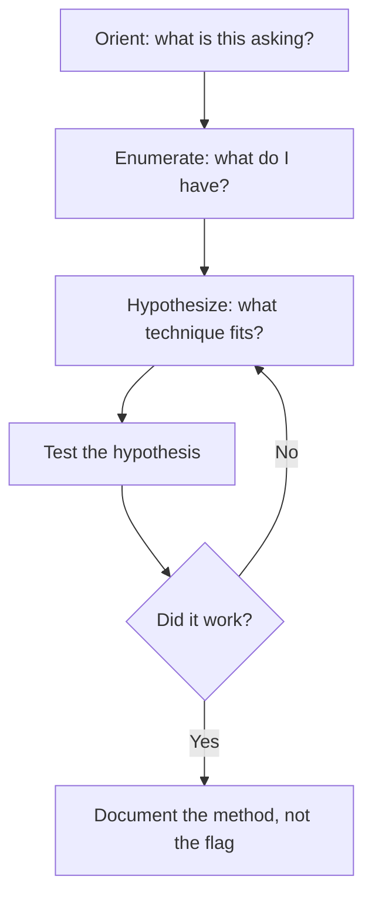

# Lab 1.3: picoCTF General Skills

**Month:** 1 (IT Foundations and Hardware) · **Pattern family:** Foundational · **Time budget:** 10 to 12 hours (across several sessions) · **Lab attempt floor:** 45 minutes per challenge you get stuck on · **AI guidance:** AI-free zone. No AI on this lab. No external writeups during the floor. · **Builds on:** Labs 1.1 and 1.2 done. A free picoCTF account from Month 0.

## Why this lab exists

picoCTF's "General Skills" track drills the bare-hands fluency the rest of the course assumes. Moving around a shell. Working with files. Recognizing and converting encodings. Reading output you did not expect. Writing a two-line script to do something tedious. These are not glamorous skills. They are the skills that, when missing, make every later month slower.

This is also your first contact with the capture-the-flag (CTF) format, and with the course's most-tested rule: **the tutor never confirms a flag.** You submit on the platform; the platform tells you if you are right. That rule is not arbitrary. It is the same rule that protects the integrity of every assessment you will ever face. Build the habit here, where the stakes are a practice puzzle.

**Recall first, from memory, before you read on:** in Lab 1.2 you traced the boot chain and built a loop for understanding an unfamiliar system: observe, form a model, test it, correct the model. This lab runs that same loop on puzzles. What was the value of writing your first guess down *before* you looked anything up? (Hold your answer. The same honesty about your starting guess is what turns a lucky solve into an understood one here.)

## Learning objectives

By the end of this lab you can:

- **Navigate** a remote shell and work with files using only the command line.
- **Recognize** common encodings (base64, hex, ROT, URL encoding) by sight and **convert** between them and plain text.
- **Analyze** unfamiliar command output and form a hypothesis about what it means before looking anything up.
- **Produce** a solving methodology that another person could follow to reach the same result, without that document containing the answer.
- **Defend** the no-flag-confirmation rule as a habit, not a rule you have to be reminded of.

## Recognition cue

When a later lab or a real engagement drops you into a shell with a vague objective, the General Skills habits keep you from freezing: orient, enumerate, form a hypothesis, test it, document. This lab builds that loop on low-stakes puzzles.

## The solving loop

Every General Skills challenge fits this loop. When you are stuck, you have skipped a step. Find which one.


*Notice: the loop is the same one you used on the boot chain in Lab 1.2. You are not memorizing puzzles; you are practicing one repeatable method.*

## Tasks

### Task 1: Learn the method on practice strings (gradual release)

The new skill here is not "solve picoCTF." It is running the orient-enumerate-hypothesize-test-document loop until it is automatic. You will learn it in three stages. The first two use invented strings, not real picoCTF challenges, so you can focus on the method. The third is the real platform.

#### Stage 1 - Worked example (I do)

Watch the loop run end to end on an invented string. This is not a picoCTF challenge. Suppose you are handed this text and told "decode it":

```
SGVsbG8gd29ybGQ=
```

1. **Orient.** The task is "decode," so this is an encoding, not a cipher with a key.
2. **Enumerate.** Look at the shape. It uses letters, digits, and ends in `=`. That trailing `=` is padding.
3. **Hypothesize.** Padding with `=` and that character set is the classic sign of **base64**, an encoding that packs bytes into printable text.
4. **Test.** Run a one-liner and read the result:

```bash
echo "SGVsbG8gd29ybGQ=" | base64 -d
```

It prints `Hello world`. The hypothesis held.

5. **Document.** You would write: "Recognized base64 by the `=` padding and the character set; decoded with `base64 -d`; got readable English." Notice you wrote down the *method*, not just the answer.

**Checkpoint:** you ran the command, saw `Hello world`, and can state the five steps of the loop from memory.
**If not:** if `base64 -d` printed garbage, you may have included a newline or a stray space; retype the string exactly. If you cannot recall the five steps, write them as a list in your notebook before moving on. You will use them on every challenge.

#### Stage 2 - Faded practice (we do)

Now you drive the loop on a different invented string. This is still not a picoCTF challenge. You are handed this and told "decode it":

```
48 65 6c 6c 6f
```

```bash
# TODO 1 (orient + enumerate): what shape is this? Pairs of characters,
#         each 0-9 or a-f, separated by spaces. What encoding uses that alphabet?
# TODO 2 (hypothesize + test): fill in the one-liner that decodes hex to text.
#         Hint: xxd has a reverse mode, and it can take plain hex.
echo "48 65 6c 6c 6f" | xxd -r -p
# TODO 3 (document): write one sentence naming how you recognized it and what you ran.
```

The shape (pairs from `0-9` and `a-f`) is **hexadecimal**, base-16, where each pair is one byte. The command above turns it back into text.

**Checkpoint:** the command prints `Hello`, and you wrote one sentence naming hex as the encoding and `xxd -r -p` as the tool.
**If not:** if you got an error, check that you used both `-r` (reverse) and `-p` (plain hex). Without `-p`, `xxd` expects its own formatted layout, not bare hex pairs.

#### Stage 3 - Independent (you do)

No scaffolding now, and no more invented strings. Go to the picoCTF platform and work through 8 to 12 real "General Skills" challenges, starting from the easiest. Solve them yourself with the loop. The floor applies per challenge: when you get stuck on one, sit with it for 45 minutes before consulting anything external, and never read a writeup that gives the answer.

For each challenge, before you start, write down in your own words what it appears to be asking and what skill it seems to test. That is the orient step, on paper.

**Checkpoint:** at least 8 challenges are solved and submitted on the platform (the platform's own progress page is your evidence; a screenshot of your solved count is enough).
**If not:** if you are stuck past the 45-minute floor on one challenge, move to another and come back. Do not search the title; the titles are designed to be searchable, and the first result will be a writeup that hands you the answer and teaches you nothing.

Do not paste any flag anywhere in your repo or to the tutor.

### Task 2: Write methodology notes, not solutions (90 minutes)

For five of the challenges you solved, write a methodology note. Each note describes how you approached the problem, what you observed, what you tried that did not work, and what category of technique resolved it. It does **not** contain the flag, and it does not contain the exact input that would let someone skip the thinking. Write it as if for a teammate who will face a similar but different challenge next week.

A good methodology note for an encoding challenge reads like: "The string was all uppercase A to Z with no spaces and a length divisible by 8; that shape suggested a base conversion. I tested base32 because of the alphabet, confirmed by decoding the first few characters by hand, then decoded the whole thing." It does not read: "the answer is X."

**Checkpoint:** a file `methodology-notes.md` in this lab's folder has five notes, each following the pattern above.
**If not:** if a note names the answer or the exact challenge input, rewrite it to describe the *recognition cue and the technique* instead. The test is whether it would help with a different puzzle of the same type.

### Task 3: Build an encoding cheat sheet from memory (60 minutes)

After solving the encoding challenges, close everything and write, from memory, a one-page reference of the encodings you met: how to recognize each by sight, and the command-line one-liner to encode and decode each. Then verify your one-liners actually work, and fix any that did not.

**Checkpoint:** a file `encoding-cheatsheet.md` has at least four encodings, each with a recognition cue and a verified encode/decode command.
**If not:** if a one-liner fails when you test it, that is the point of the test; fix the command and note what was wrong. A cheat sheet you have not run is one that will fail you when you need it.

### Task 4: Notebook entry (60 minutes)

Write the lab notebook entry at `.tutor/notebook/lab-03-picoctf-general-skills.md`. Required sections:

- **Pre-flight check.** For any new command-line tool you reached for (for example `base64`, `xxd`, `nc`): what it does, what it leaves behind, what could go wrong, and the authorization scope (picoCTF authorizes this activity through its terms of use; that is your legal basis, and you should be able to state it).
- **Concept naming.** What did this lab teach? Name the loop, not the puzzles.
- **Evidence.** Your solved-count screenshot, and links to `methodology-notes.md` and `encoding-cheatsheet.md`. No flags.
- **Five-question debrief.** All five questions, with substance. The fifth (what you would do differently cold) should name a specific challenge you struggled with.

**Checkpoint:** the entry is committed, contains all four sections, and has no flags anywhere in it.
**If not:** if you are unsure what the five debrief questions are, they are listed in the month README and in `tutor-reference.md`. The tutor will reject an entry missing any of them, and will reject any entry containing a flag.

## Definition of Done

You are done when all of these are true:

- At least 8 General Skills challenges are solved on the platform.
- `methodology-notes.md` has five answer-free method notes.
- `encoding-cheatsheet.md` has at least four verified encodings.
- The notebook entry is committed with all sections and no flags.

Self-verify with this one-liner from the lab folder; it should print `OK`:

```bash
test -f methodology-notes.md && test -f encoding-cheatsheet.md && ! grep -rqi "picoCTF{" . && echo OK
```

**Self-explain:** in one sentence, why does writing the *method* instead of the flag make your notes useful on a challenge you have never seen?

## The no-flag rule, stated once more

Do not paste a flag to the tutor and ask if it is correct. The tutor will refuse, every time, and point you to the platform. If your flag is wrong and you are stuck, that is what the hint ladder is for. This is the single most-tested discipline in the course, because it is the single most common shortcut learners reach for. Build the habit now.

## Stretch goals

1. Take one of your verified one-liners and wrap it in a two-line shell script that reads a string and prints the decoded result. You now have a tiny tool you wrote.
2. Find one encoding you did *not* meet in the challenges (for example base85 or URL encoding) and add it to your cheat sheet with a recognition cue and a verified command.
3. Write a short "decision tree" for encodings: given a mystery string, what do you check first, second, third? Make it small enough to fit on one screen.
4. Re-solve one challenge you found easy, but time yourself and try to do it in under two minutes using only your cheat sheet. Speed on the basics is a real skill.

## Troubleshooting

- **A decode command prints garbage.** You probably guessed the wrong encoding, or the string has stray whitespace. Re-orient: look at the character set and any padding before you pick a tool.
- **`base64 -d` complains about invalid input.** A newline or space sneaked in. Pipe through `tr -d '[:space:]'` first, or retype the string exactly.
- **`xxd -r` produces nothing useful.** You likely forgot `-p`. Bare hex pairs need `xxd -r -p`.
- **You are stuck and the writeup is one search away.** That pull is exactly what the floor defends against. Sit the 45 minutes, move to another challenge, and come back. Solving by searching teaches you nothing.
- **You solved it but cannot say why.** That is a signal, not a win. Writing the methodology note in Task 2 is how you turn a lucky solve into an understood one.

## Time budget breakdown

- Task 1: 6 to 8 hours (Stages 1 and 2 are quick; Stage 3 on the real platform varies widely with your starting fluency)
- Task 2: 90 minutes
- Task 3: 60 minutes
- Task 4: 60 minutes

Total: 9 to 11 hours.

## Resources

- The picoCTF platform itself, including its own "learning resources" pages (these teach technique, not challenge answers; using them is in bounds).
- `man` pages for any command-line tool you reach for.
- Your Lab 1.1 and 1.2 notebook entries, for command-line fluency you already built.

No challenge writeups. The platform is the judge of your flags, and you are the source of your methods.
