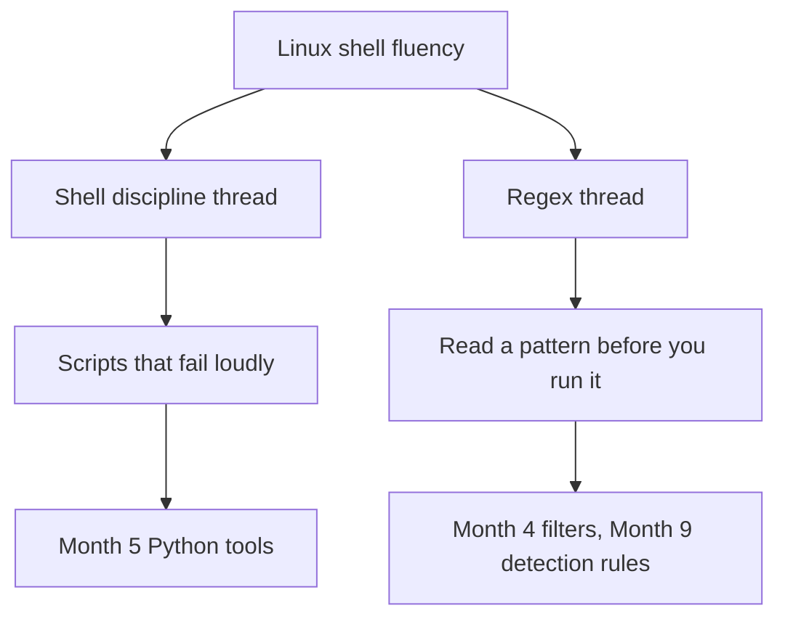

# Month 2: Linux CLI Mastery and Regex

**Pattern family:** Linux CLI Mastery (and Regex) · **Time budget:** 50 hours · **AI guidance:** AI-free zone. No AI on any lab this month. The tutor refuses to help with the lab work itself, the same as Months 0, 1, 3, and 4. · **Prerequisites:** Month 1 complete (you can read hardware introspection output, you understand kernel versus userspace, and you have written at least one Bash script). Month 0 home lab working, including your Ubuntu Server VM, where most of this month happens.

## Overview

The rest of this course assumes you own the Linux shell. Not "can find your way around with a cheat sheet open," but own it. You can move through a filesystem you have never seen. You can read and reason about permissions. You can find the one line that matters in a million-line log. You can write a script that does real work and fails loudly when something breaks. You can read a regular expression and say what it will match before you run it.

Every month after this one leans on these skills. Month 3 has you reading routing tables at the command line. Month 4 pipes packet-capture output through `grep`. Month 5 rebuilds your Bash scripts in Python and reuses your regex. Months 9 and 10 are mostly Linux, mostly at the shell, mostly under time pressure. If the shell is friction for you, all of that is friction. This month removes the friction.

Two threads start here and never stop. Here is the shape of the month, and how those two threads feed everything you build:

*Notice: the two threads (discipline and regex) start here and reach into later months. Nothing later replaces them; everything later assumes them.*

The first thread is **shell discipline**: the habit of writing scripts that break visibly instead of failing silently. The tools are `set -euo pipefail`, exit codes, and careful quoting. The second thread is **regex** (short for **regular expression**, a small language for describing text patterns). You build both here, by hand, with no AI doing the work. You cannot judge a tool's output on these fundamentals later if you never built the fundamentals yourself.

## Warm-Up: Retrieve Before You Begin

Before reading on, answer these from memory. No peeking at Month 1. This pulls forward the prior skills this month builds on.

1. From Month 1: what does `set -euo pipefail` do, and what does each of the three flags catch on its own?
2. From Month 1: what is the difference between kernel space and user space, and why does that line matter for security?
3. From Month 1: what command did you use to find your Mac's architecture (`arm64` or `x86_64`)?
4. From Month 0: you have an Ubuntu Server VM. What does a VM snapshot save, and what would you do if you broke the VM with a bad command?

Check your recall

1. `set -euo pipefail` makes a Bash script fail fast: `-e` exits on a failed command, `-u` errors on an unset variable, and `-o pipefail` makes a pipeline fail if any stage fails. You first met this in Month 1's `inventory.sh`.
2. The kernel has full control of the hardware; user-space programs have limited power and must ask the kernel through system calls. The line matters because "running as root" means running with kernel-level power, so a mistake or an exploit then has no guard rail. From Month 1's kernel-versus-user-space concept.
3. `uname -m`. You used it in Lab 1.1.
4. A snapshot saves the disk state of the VM. If you break the VM, you restore the snapshot rather than working around the damage. From Month 0 setup.

## Learning objectives

By the end of this month you can:

- **Navigate and describe** the Linux filesystem hierarchy (`/etc`, `/var`, `/proc`, `/usr`, `/home`, and the rest), and explain what lives where and why.
- **Read and set** Unix permissions and ownership in both symbolic and octal form, and explain what the setuid, setgid, and sticky bits do.
- **Inspect and manage** processes and signals: list processes, read their state, send the right signal, and explain the difference between `SIGTERM` and `SIGKILL`.
- **Build** text-processing pipelines with `grep`, `sed`, `awk`, `cut`, `sort`, and `uniq` that extract a specific pattern from a real log file.
- **Write** a Bash script with `set -euo pipefail`, conditionals, loops, functions, and exit codes that automates a task you actually do.
- **Analyze** a regular expression and predict, before running it, which inputs it matches and which it rejects.
- **Reconcile** the differences between BRE, ERE, and PCRE: explain why a pattern that works in `grep -E` fails in plain `grep`, and why `grep -P` accepts constructs neither of the others does.
- **Defend** a `linux-survival.md` cheat sheet you wrote from memory by reproducing any section of it on demand, without notes.

## Recognition cue

When a later month drops you on an unfamiliar Linux host and asks "what is running, who can do what, and what does this log say," you reach for the shell without hesitation and without a cheat sheet open in another window. When a Month 4 packet filter, a Month 5 `re.compile`, or a Month 9 detection rule contains a regex, you read it on sight instead of guessing. That fluency traces back to this month. If it is missing later, come back here.

## Core concepts to internalize

Read these to understand the labs, not to memorize them. Each chunk is one idea. Each new term is bold and defined the first time you meet it.

### Filesystem layout

Linux organizes everything into one tree starting at `/` (the root). The **Filesystem Hierarchy Standard** is the agreed map of what goes where: `/etc` holds configuration, `/var` holds data that changes (logs live in `/var/log`), `/usr` holds installed programs, `/home` holds user files, and `/tmp` holds scratch data. A **path** is an address in that tree; an absolute path starts at `/`, a relative path starts from where you are. A **symbolic link** is a pointer to another path, like a shortcut; a **hard link** is a second name for the same data on disk.

> **Common misconception.** "`/proc` is just another folder of files on the disk."
> **Reality.** `/proc` is not on the disk at all. It is a live view of the running kernel and its processes, built fresh in memory. Reading `/proc/cpuinfo` asks the kernel a question; it does not read a saved file. This is tempting to get wrong because `/proc` looks and acts like a directory.

### Permissions, users, and groups

Every file has **permissions**: read, write, and execute, each set separately for the owner, the group, and everyone else. You can write them as symbols (`rwxr-xr-x`) or as three octal digits (`755`). You change them with `chmod`, and you change ownership with `chown`. Three special bits matter for security. The **setuid bit** makes a program run as its owner (often root) no matter who starts it. The **setgid bit** does the same for the group. The **sticky bit** on a shared directory stops users from deleting each other's files. A setuid binary is a security-relevant fact, because it runs with power the person who launched it does not have.

> **Common misconception.** "Octal `640` and `460` are basically the same permission, just written in a different order."
> **Reality.** Order is everything. The three digits are owner, group, other, in that order. `640` is owner read-write, group read, other nothing. `460` is owner read, group read-write, other nothing, a very different and unusual setting. Reversing the digits is the single most common permission mistake, and you will do it once. Doing the conversion by hand until you stop reversing it is the skill.

### Processes and signals

A **process** is a running program. Each has a **process ID** (PID), a parent that started it, and a state (running, sleeping, stopped). You list them with `ps` or `top`, find one by name with `pgrep`, and stop one by sending it a **signal** with `kill`. The two signals you must not confuse are `SIGTERM` and `SIGKILL`. **`SIGTERM`** politely asks a process to shut down, so it can save its work and clean up. **`SIGKILL`** forces it to stop at once, with no chance to clean up. Sending `SIGKILL` first is bad form because it can leave files half-written and locks held.

### Text processing

A small set of tools, joined by pipes, can answer almost any question about text. `grep` selects lines that match a pattern. `sed` edits a stream of text. `awk` works on fields (columns). `cut` pulls out columns by position. `sort` orders lines, and `uniq` collapses or counts repeats. A **pipe** (`|`) sends the output of one tool straight into the next. The three **standard streams** are stdin (input), stdout (normal output), and stderr (error output); you redirect them with `>`, `>>`, `2>`, and `2>&1`. The reason this toolkit beats one giant tool is that each piece does one job, so you can chain them in ways the toolmakers never planned.

### Environment and shell behavior

A **shell variable** lives only in your current shell. An **environment variable** is passed down to programs the shell starts; you make one with `export`. The most important environment variable is **`PATH`**, the list of directories the shell searches to find a command. `PATH` order is a security concern: if an attacker-controlled directory comes first, a fake `ls` could run instead of the real one. **Quoting** controls how the shell expands what you type. Single quotes turn off all expansion, double quotes allow variable expansion but block word splitting, and no quotes allow both. Unquoted variables are the source of most shell bugs.

### Bash scripting

A script is a file of shell commands. It starts with a **shebang** line (`#!/usr/bin/env bash`) that names the program to run it. You store values in variables, capture command output with `$( )`, branch with `if` and `[[ ]]`, repeat with `for` and `while`, and group logic into functions. Every command returns an **exit code**: `0` means success, anything else means failure, and you read the last one with `$?`. A script that ignores a failed command is worse than no script, because it lets you believe work happened that did not.

### systemd and package management

**systemd** is the system that starts and supervises services on modern Linux. You check a service with `systemctl status`, start or stop it with `systemctl start` or `stop`, and read its recent logs with `journalctl`. **Package management** is how software is installed: on Ubuntu you use `apt` to install, remove, and update packages, and `dpkg -L` to list the files a package put on the system. The difference between `apt update` (refresh the list of available packages) and `apt upgrade` (actually install newer versions) trips up beginners; learn it once.

### Regex, the primary thread

> **Heavy concept ahead.** Slow down here. This is the load-bearing idea of the month, and the most reused skill in the whole course.

A **regular expression** (regex) is a small language for describing text patterns. **Literal characters** match themselves; **metacharacters** have special meaning. A **character class** matches one of a set (`[abc]`, `[^abc]` for "not these," ranges like `[a-z]`, and POSIX classes like `[[:digit:]]`). **Anchors** match a position, not a character (`^` for start of line, `$` for end). **Quantifiers** say how many (`*` zero or more, `+` one or more, `?` zero or one, `{n,m}` a range). A **greedy** quantifier grabs as much as it can; a **lazy** one grabs as little as it can, and they can produce different matches on the same string. **Grouping** with `( )` and **alternation** with `|` build bigger patterns, and a **backreference** matches the same text a group already captured.

Now the distinction that trips up everyone: there is not one regex language, there are three dialects.

> **Common misconception.** "A regex is a regex. If it works in one tool, it works in all of them."
> **Reality.** The same pattern can behave differently in `grep`, `grep -E`, and `grep -P`. **Basic Regular Expressions** (BRE, used by plain `grep` and `sed`) require a backslash before `+`, `?`, `{`, `(`, and `|`. **Extended Regular Expressions** (ERE, used by `grep -E` and `awk`) do not. **Perl Compatible Regular Expressions** (PCRE, used by `grep -P` and close to Python's `re` module) add lookahead, lookbehind, lazy quantifiers, and named groups that the POSIX dialects lack. A pattern copied from a Perl tutorial into plain `grep` will often silently match the wrong thing. Knowing which dialect you are speaking is half of getting a regex right.

## Labs

This month has five labs, done in order. Each builds on the fluency the previous one established. Each has its own folder under `labs/` with a full specification.

| Lab | Folder | Time | What you build |
| --- | ------ | ---- | -------------- |
| 2.1 Linux Fundamentals | `labs/lab-01-linux-fundamentals/` | 8 to 10 h | Shell, permissions, process, and package fluency on your own VM |
| 2.2 Five Shell Scripts | `labs/lab-02-five-shell-scripts/` | 12 to 14 h | Five real scripts with `set -euo pipefail` and real error handling |
| 2.3 Regex Drills | `labs/lab-03-regex-drills/` | 8 to 10 h | Hand-written regex fluency across BRE, ERE, and PCRE |
| 2.4 Log Parsing Pipelines | `labs/lab-04-log-parsing-pipelines/` | 10 to 12 h | Ten pipelines that extract patterns from real log formats |
| 2.5 GTFOBins Exploration | `labs/lab-05-gtfobins-exploration/` | 6 to 8 h | A written account of why five ordinary binaries become dangerous |

Honor the no-flag-confirmation rule in Lab 2.1: do not paste room answers or flags to the tutor. The room checks them; the tutor never does.

## Weekly rhythm and the warm-start

Weeks 1 to 3 build the five labs in order; Week 4 is lighter on building and heavier on retrieval and the deliverable. **Week 1 opens with a warm-start that keeps a prior skill alive:** before new Linux work, re-run your Month 1 `inventory.sh` on your Mac, then open your Lab 1.1 `linux-port-notes.md` and pick one command you said would fail on Linux. Confirm on your VM whether your guess was right. This pulls Month 1 forward and points straight at Lab 2.2's system-information script, which is the Linux cousin of that Month 1 tool.

## Notebook entry requirements

Each lab gets a notebook entry at `.tutor/notebook/lab-NN-<slug>.md` with:

- **Pre-flight check** (for any new tool you run): what the tool does at a filesystem or process level, what traces it leaves, what could go wrong, and the authorization scope. For this month the scope is almost always "my own VM, trivially authorized," but you state it anyway. The habit is the point, and Lab 2.5 makes the habit matter.
- **Concept naming:** name what the lab taught, in your own words.
- **Evidence:** command output, script source, sample inputs and outputs, file references. Enough that someone else could confirm you did the work.
- **Five-question debrief:**
  1. What did this lab teach? Name the concept or technique.
  2. What input shape or system behavior tells you to reach for it?
  3. What artifact did you produce, and what would dominate at scale?
  4. What edge case or failure would have broken your first attempt?
  5. What would you do differently in three weeks when you redo it cold?

No AI Provenance section this month. Month 2 is in the AI-free zone, so there is nothing to log. AI Provenance becomes mandatory only from Month 5, when AI unlocks.

## Reflect

Spend ten minutes on these in your notebook (writing, not just thinking):

- **Explain it back:** in two or three sentences, explain the BRE-versus-ERE-versus-PCRE distinction to a peer who finished Month 1, as if teaching it.
- **Connect:** how does the shell discipline you build this month (`set -euo pipefail`, quoting, exit codes) change the way you would rewrite your Month 1 `inventory.sh`?
- **Monitor:** which concept this month is still fuzzy? Name it exactly, and write the one question that would clear it up.

## End-of-month deliverable

Two artifacts, specified in full in `deliverable.md`:

1. A `linux-survival.md` cheat sheet, **written from memory at the end of the month, with no copy-paste from the web**. The constraint is the point. A cheat sheet you pasted together teaches you nothing and you cannot defend it. One you wrote from memory is a map of what you actually retained, and its gaps tell you exactly what to revisit.
2. The **five working shell scripts** from Lab 2.2, in a public repository, each with a header comment explaining what it does and any scope or safety note it needs.

The tutor verifies the cheat sheet the way Month 1 verified the boot writeup: it picks one section at random and asks you to reproduce or expand it from memory.

## Cold revisit

The first cold revisit of the entire course happens on the **third Friday of this month**, and it pulls from Month 1. The tutor reads `lab-log.md`, picks a Month 1 sub-task, and asks you to do it blind: with no notes and no AI, re-enumerate a piece of your Mac's hardware, or re-explain a stage of the boot process in more depth than your writeup went. Then it debriefs. The standard lab attempt floor applies during the revisit.

Treat this as the design, not a test you can fail. The original Month 1 labs taught the material; this revisit is what makes it stick. If a Month 1 sub-task is shaky when pulled cold, that is useful signal, not a verdict.

## Common pitfalls

- **Clicking through the TryHackMe rooms for completion and skipping the `man` pages.** The rooms let you. The cold revisit will not. A clicked-through room leaves nothing to draw on.
- **Deleting `set -euo pipefail` the first time it stops your script.** A `grep` that finds no matches returns non-zero, and `set -e` halts on it. The fix is to handle that case, not to remove the line that surfaced it.
- **Reversing octal digits.** Confusing `640` and `460`, or `755` and `557`. Do the conversions by hand until the reversal stops.
- **Forgetting that `kill` sends `SIGTERM`, not `SIGKILL`.** Learners who assume `kill` means "force kill" are surprised when a hung process ignores it.
- **Copying a PCRE pattern into plain `grep`.** Plain `grep` is BRE and does not understand `\d`, lookahead, or lazy quantifiers, so it silently matches the wrong thing.
- **Forgetting `sort` before `uniq -c`.** `uniq` only collapses adjacent lines, so counts are wrong unless you sort first.

## Knowledge Check

Answer from memory first, then check. Items marked ⟲ are spaced callbacks to earlier months and are supposed to feel like a small stretch.

1. State the symbolic form of octal `640`, then of `755`.
2. What is the difference between `SIGTERM` and `SIGKILL`, and why is sending `SIGKILL` first bad form?
3. Predict the output: you run `grep -c "fail" auth.log` and it prints `0`. In a script with `set -e`, what happens to the line after it, and why?
4. You need the ten source addresses that appear most often in a log, with counts, most frequent first. Name the pipeline shape.
5. Why does the pattern `colou?r` match both `color` and `colour` in `grep -E` but match a literal `?` in plain `grep`?
6. What does `/proc/cpuinfo` actually read, and why is `/proc` not a normal disk directory?
7. Which is safer in a script: `rm $file` or `rm "$file"`, and what bug does the safe one prevent?
8. ⟲ From Month 1: put these in boot order: kernel, firmware, login prompt, boot loader, init system.
9. ⟲ From Month 1: what is the difference between RAM and storage, and why does it matter in a security investigation?
10. ⟲ From Month 0: you are about to test a destructive command on your Ubuntu VM. What do you do first, and what do you do if it goes wrong?

Answer key

1. `640` is `rw-r-----`. `755` is `rwxr-xr-x`.
2. `SIGTERM` asks a process to shut down so it can save and clean up; `SIGKILL` forces it to stop at once with no cleanup. Sending `SIGKILL` first is bad form because it can leave files half-written and locks held; you try `SIGTERM` first.
3. `set -e` makes the script exit on the `grep` line, because `grep` returns a non-zero exit code when it finds no matches, and `-e` treats any non-zero exit as a failure. The line after it never runs. The fix is to handle the no-match case explicitly (for example, `grep -c "fail" auth.log || true`).
4. `... | sort | uniq -c | sort -rn | head`. You sort to group identical lines, count them with `uniq -c`, sort again numerically in reverse to rank, and take the top with `head`.
5. In ERE (`grep -E`), `?` is a metacharacter meaning "zero or one of the preceding," so `colou?r` makes the `u` optional. In BRE (plain `grep`), `?` is a literal character; to make it a quantifier in BRE you would write `\?`.
6. `/proc/cpuinfo` reads a live view of the kernel's CPU information, built in memory on demand. `/proc` is not on the disk; it is a window into the running kernel and its processes, which is why its contents change as the system runs.
7. `rm "$file"` is safer. If `$file` is empty or contains spaces or glob characters, the unquoted version can expand into the wrong arguments (deleting the wrong files or everything in the directory). Quoting passes the value as a single, literal argument.
8. firmware, boot loader, kernel, init system, login prompt.
9. RAM is volatile (lost on power off); storage is persistent. In an investigation you must capture volatile memory separately and quickly because it vanishes, while disk evidence survives.
10. Take or confirm a VM snapshot first, so you can roll back. If the command damages the VM, restore the snapshot rather than working around the damage.

## How to know you are done with this month

- Five lab notebook entries committed (`lab-01-linux-fundamentals.md`, `lab-02-five-shell-scripts.md`, `lab-03-regex-drills.md`, `lab-04-log-parsing-pipelines.md`, `lab-05-gtfobins-exploration.md`).
- The `linux-survival.md` cheat sheet committed, demonstrably written from memory.
- The five shell scripts in a public repository, each with a header comment and a passing manual run.
- The Month 1 cold revisit completed and logged.
- `.tutor/lab-log.md` shows all five Month 2 labs logged.
- `.tutor/progress.md` updated to "Month 2 complete; ready for Month 3."

If any of the above is missing, the month is not done. The tutor will not advance you to Month 3 until all of it is present.

## Resources

Curated free resources, primary sources first, in `reading.md`. The discipline of reading `man` pages and specifications rather than watching someone narrate them is itself part of this month, the same as in Month 1.
