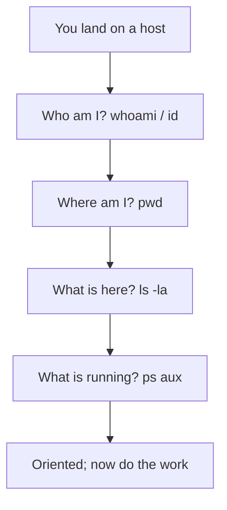

# Lab 2.1: Linux Fundamentals

**Month:** 2 (Linux CLI Mastery and Regex) · **Pattern family:** Linux CLI Mastery (and Regex) · **Time budget:** 8 to 10 hours (across several sessions) · **Lab attempt floor:** 45 minutes per stuck task. This is the easiest lab of the month: the TryHackMe rooms are guided, so the floor is short. Sit with a stuck step for 45 minutes (man page, in-room hints, your own experimentation on the VM) before asking the tutor for a hint. · **AI guidance:** AI-free zone. No AI on this lab. If you ask the tutor for help with the lab work, it refuses and points you at the man pages and your own experimentation. · **Builds on:** Month 1 (you can read a terminal and run a command) and Month 0 (your Ubuntu Server VM runs).

**Recall first, from memory, before you read on:** in Month 1 you wrote `inventory.sh` to report your Mac's hardware. What command printed the architecture, and what does `set -euo pipefail` do? Hold the answer in your head; this lab moves the same kind of inspection from your Mac to Linux.

## Why this lab exists

You cannot do security work on Linux if the shell is a place you visit with a cheat sheet open. You need it to be a place you live. This lab is the on-ramp: a guided tour through the parts of Linux you will touch every day, set up so you build habits rather than collect trivia.

The TryHackMe "Linux Fundamentals" rooms are well made and free, and they hand-hold you through the first commands. That hand-holding helps on a first pass and hurts if it is your only pass, because a guided room lets you succeed by matching the prompt without understanding the system underneath. So this lab has two halves: work the rooms, then prove the same fluency unaided on your own VM, where nothing tells you the answer. The second half is where the learning is.

## Learning objectives

By the end of this lab you can:

- **Navigate** the Linux filesystem from the command line and **explain** what `/etc`, `/var`, `/home`, `/tmp`, `/proc`, and `/usr` are for.
- **Read** a long-format directory listing and decode every field: permission bits, owner, group, size, and modification time.
- **Set** permissions and ownership in both symbolic and octal form, and **explain** the effect of each change before you make it.
- **Inspect** running processes, identify a process by name, and send it an appropriate signal.
- **Install, remove, and locate** the files of a package with `apt` and `dpkg` on your Ubuntu VM.
- **Find** a file by name and find a line inside files by content, using `find` and `grep`.

## Recognition cue

When you connect to a host you have never seen and need to orient yourself in the first sixty seconds (who am I, where am I, what is here, what is running), these are the commands your hands reach for without thinking. This lab is where that reflex starts.

## The orient-yourself reflex

Here is the small sequence of questions you answer every time you land on an unfamiliar Linux host. The commands are the answers.


*Notice: orientation is a fixed routine, not improvisation. The same four questions, in the same order, every time.*

## Tasks

Do these in order. The first task is the guided rooms; the rest prove the fluency without a guide.

### Task 1: Work the three rooms (3 to 4 hours)

Complete TryHackMe "Linux Fundamentals Part 1," "Part 2," and "Part 3." Follow the rooms as written. Where a room introduces a command, run it, read its `man` page, and note in your own words what it does before moving on. Do not rush to the next answer box.

The no-flag rule applies. These rooms have answer fields and some have flags. The room checks your answers; the tutor never does. Do not paste a room answer or flag to the tutor and ask if it is right. If an answer is rejected, that is the room teaching you, which is the design.

**Checkpoint:** all three rooms show complete on your TryHackMe profile, and `rooms-notes.md` in this lab's folder lists every command the rooms introduced that was new to you, each with a one-line description in your own words.
**If not:** if your notes are copied from the room text, redo them from memory after closing the room. The list is your evidence that you read rather than clicked.

### Task 2: Filesystem tour on your own VM (60 minutes)

On your Ubuntu VM, with no room guiding you, explore the filesystem and answer these in writing:

- What is in `/etc`, and why is it owned and writable the way it is?
- What is in `/var/log`, and what is the most recently modified file there right now?
- What does `/proc/cpuinfo` show, and why is `/proc` not a normal disk directory? (You met `/proc` in Month 1; confirm it here.)
- What is the difference between `/bin` and `/usr/bin` on this system, and are they the same thing? (Modern Ubuntu has a wrinkle here; find it.)

Orienting commands you already know from Month 1 and the rooms: `ls`, `cd`, `pwd`, `cat`, `less`, `file`, `stat`, `mount`. You will need others; find them.

**Checkpoint:** a section "Filesystem tour" in `rooms-notes.md` answers all four questions from what you observed on your VM, and each answer names the command you ran to find out.
**If not:** if you answered from a web search instead of your VM, redo it on the VM. The point is to read your own machine, not to recite a blog. If `/proc/cpuinfo` confuses you, recall from Month 1 that the kernel builds `/proc` in memory; it is not a saved file.

### Task 3: Permissions, by hand

This is the new mechanical skill of the lab: converting a permission between symbolic form (`rw-r-----`) and octal form (`640`), and predicting the effect of a `chmod` before you run it. You will learn it in three stages on a throwaway file, then apply it to the graded work. Create a scratch directory in your home folder first and work inside it. Type everything yourself.

#### Stage 1 - Worked example (I do)

Run this exact sequence on a throwaway file and study it. It is not the graded task; it models the conversion technique on one file so you can focus on the method.

```bash
cd ~
mkdir -p scratch && cd scratch
touch demo.txt
chmod 644 demo.txt
ls -l demo.txt
stat -c '%a %A' demo.txt
```

Read the result line by line. `chmod 644` sets the octal permission. `ls -l` shows it in symbolic form: `-rw-r--r--`. The `stat -c '%a %A'` line prints both forms side by side: `644 -rw-r--r--`. Here is how to read `644` into symbols. Each octal digit is a sum: read is 4, write is 2, execute is 1. So `6` is `4+2` (read-write, `rw-`), `4` is read only (`r--`), and the three digits are owner, group, other in that order. `644` therefore means owner read-write, group read, other read.

**Checkpoint:** `stat -c '%a %A' demo.txt` prints `644 -rw-r--r--`.
**If not:** if `stat` complains about `-c`, you may be on macOS, not the VM (macOS `stat` uses different flags); run this on your Ubuntu VM. If the permission is not `644`, re-run the `chmod 644 demo.txt` line and check for a typo.

#### Stage 2 - Faded practice (we do)

Now you supply the conversions. For each octal below, predict the symbolic form on paper first, then set it and confirm with `stat`. The pattern from Stage 1 is your guide: split each digit into 4 (read), 2 (write), 1 (execute).

```bash
# Still in ~/scratch, on the VM.
chmod 600 demo.txt     # TODO: predict the symbolic form BEFORE running, then check
stat -c '%a %A' demo.txt
chmod 750 demo.txt     # TODO: predict the symbolic form BEFORE running, then check
stat -c '%a %A' demo.txt
# TODO: now go the other way. You want owner read-write, group read, other none.
#       Work out the octal yourself, set it, and confirm it reads rw-r-----.
```

The skill is the prediction, not the command. Write each symbolic form down before you press Enter, then let `stat` grade you.

**Checkpoint:** you predicted `600 -> -rw-------` and `750 -> -rwxr-x---` correctly before running, and you set the last one to `640` and confirmed `640 -rw-r-----`.
**If not:** if your prediction missed, you likely added the digits in the wrong order or split a digit wrong. Redo that one digit by hand: which of 4, 2, 1 add up to it, and which position (owner, group, other) is it. The point of getting this wrong now is to stop getting it wrong later.

#### Stage 3 - Independent (you do)

No scaffolding now. In your scratch directory, do the following and record the result in `rooms-notes.md`:

- Read three different `ls -l` lines (pick files from `/etc` and `/usr/bin`) and state, in octal, the permission of each. Verify each with `stat`.
- Create a file, remove your own write permission from it with `chmod`, and try to edit it. Note the exact error the editor or shell gives. Then restore the permission.
- Find every setuid binary on the system (a `find` over the filesystem for the setuid bit), pick one, and write a one-line guess about why it needs that bit. (This is the on-ramp to Lab 2.5; just observe and guess. Do not look up the GTFOBins answer; the guess is the point.)

**Checkpoint:** a section "Permissions" in `rooms-notes.md` has three worked octal-to-symbolic conversions you did by hand and verified, the exact error text from the write-permission experiment, and the list of setuid binaries you found with a one-line guess for each.
**If not:** if your `find` for setuid binaries returns nothing, your search expression is wrong; check `man find` for the test that matches a permission bit (the special-bit syntax is the part to read carefully). If the write experiment gave no error, you may still own the file as a different effective user; confirm with `whoami` and `ls -l`.

### Task 4: Processes and signals (60 minutes)

On the VM:

- List all running processes and find one long-running service (for example, the SSH daemon). Note its PID, its parent PID, and its state.
- Start a harmless long-running process of your own in the background (a `sleep` of several minutes will do), find it by name, and stop it with the appropriate signal. Then start another and stop it with a different signal. Describe the difference in behavior you observed.
- Explain, in writing, the difference between `SIGTERM` and `SIGKILL` and when you would reach for each. Why is sending `SIGKILL` first considered bad form?

Orienting commands: `ps`, `top` or `htop`, `pgrep`, `kill`, `pkill`, `jobs`. The signal list is in `man 7 signal`.

**Checkpoint:** a section "Processes and signals" in `rooms-notes.md` records the PID, PPID, and state of the service you inspected, an account of the two signals you sent and how the process responded to each, and your written `SIGTERM` versus `SIGKILL` explanation.
**If not:** if your background process ignored the first signal, you probably sent `SIGTERM` to something that traps it; that is itself worth noting, and `SIGKILL` (signal 9) will stop it. Recall that `kill` with no signal sends `SIGTERM`, not `SIGKILL`.

### Task 5: Packages and search (45 minutes)

On the VM:

- Update the package index, then install a small package you do not already have (`tree`, `jq`, or `ripgrep` are good choices). Confirm it installed.
- Use `dpkg -L` to list every file that package put on the system. Note where the binary went and where its `man` page went.
- Remove the package. Confirm the binary is gone.
- Separately, use `find` to locate a file by name somewhere under `/etc`, and use `grep -r` to find which file under `/etc` contains a specific string (your hostname is a good target). Note the difference between searching by name and searching by content.

**Checkpoint:** a section "Packages and search" in `rooms-notes.md` records the package you installed, two or three paths from its `dpkg -L` output with what each is, and the two search commands you ran with what they returned.
**If not:** if `apt install` fails with a permission error, you need `sudo`; if it fails to find the package, run the index update first (`apt update`). Recall the difference: `update` refreshes the list, `upgrade` installs newer versions, and neither is `install`.

### Task 6: Notebook entry (60 minutes)

Write the lab notebook entry at `.tutor/notebook/lab-01-linux-fundamentals.md`. Required sections:

- **Pre-flight check.** For the tools new to you this lab (`find`, `grep`, `apt`, `dpkg`, `kill`, `stat`, and any others), document what each does at a filesystem or process level, what traces it leaves (for example, `apt` writes to `/var/log/apt/` and changes the package database), what could go wrong (removing the wrong package; killing the wrong PID), and the authorization scope (your own VM, trivially authorized).
- **Concept naming.** What did this lab actually teach? It is not "a list of commands." Name the underlying thing.
- **Evidence.** Link to `rooms-notes.md` and quote the key findings: one octal conversion, the signal experiment result, one `dpkg -L` path.
- **Five-question debrief.** All five questions answered with substance.

No AI Provenance section. Month 2 is in the AI-free zone.

**Checkpoint:** a committed notebook entry with all four sections.
**If not:** if you are unsure what the five debrief questions are, they are listed in the month README; the tutor will reject an entry missing any of them, and it may spot-check by asking you to expand one sentence from memory.

## Definition of Done

You are done when all of these are true:

- All three TryHackMe rooms show complete.
- `rooms-notes.md` is present with all five content sections, written in your own words.
- The notebook entry is committed with all required sections.
- You can, on request, decode an `ls -l` line and convert a permission between octal and symbolic without notes.

Self-verify with this one-liner from the lab folder on your VM; it should print `OK`:

```bash
test -s rooms-notes.md && grep -qi "setuid" rooms-notes.md && echo OK
```

**Self-explain:** in one sentence, why does octal `640` mean owner read-write, group read, and other nothing (and not some other combination)?

## Stretch goals

1. Write a tiny shell function that, given an octal like `640`, prints its symbolic form, then check it against `stat` on a file you `chmod` to that value.
2. Compare `find` and `locate` for finding a file by name; explain why their answers can differ (one reads a database, the other walks the disk).
3. Read `man 7 signal` and list three signals other than `SIGTERM` and `SIGKILL`, with one sentence on when each is used.

## Troubleshooting

- **`stat: invalid option -- 'c'`** - you are on macOS, not the VM. macOS `stat` uses `-f` with a different format string. Run this lab's `stat` examples on your Ubuntu VM.
- **`find` for setuid binaries returns nothing** - your permission test is wrong. Read the special-bit section of `man find` carefully; the syntax for "has the setuid bit" is specific.
- **`apt install` says permission denied** - prefix with `sudo`. If it cannot find the package, run the index update first.
- **A background process ignores `kill`** - by default `kill` sends `SIGTERM`, which a process can trap or ignore. `SIGKILL` (signal 9) cannot be trapped; note the difference rather than reaching for it first.
- **You damaged the VM with a destructive command** - this is why you snapshotted it in Month 0. Restore the snapshot; do not work around the damage.

## Time budget breakdown

- Task 1: 3 to 4 hours
- Task 2: 60 minutes
- Task 3: 90 minutes
- Task 4: 60 minutes
- Task 5: 45 minutes
- Task 6: 60 minutes
- Buffer for things going wrong: 60 minutes

Total: 8 to 10 hours.

## Resources

Primary sources, all free. Read the man pages on your own VM before reaching for anything else.

- `man hier` on your VM: the manual page for the filesystem hierarchy itself. Start here.
- `man ls`, `man chmod`, `man chown`, `man stat`, `man ps`, `man kill`, `man find`, `man grep`, `man apt`, `man dpkg`.
- `man 7 signal`: the full list of signals and their default actions.
- The Filesystem Hierarchy Standard (the official specification, free online) for `/etc`, `/var`, and the rest.
- TryHackMe "Linux Fundamentals" Parts 1, 2, and 3 (free rooms).
- Your own Month 1 notebook entry on kernel versus userspace, for the `/proc` question.
