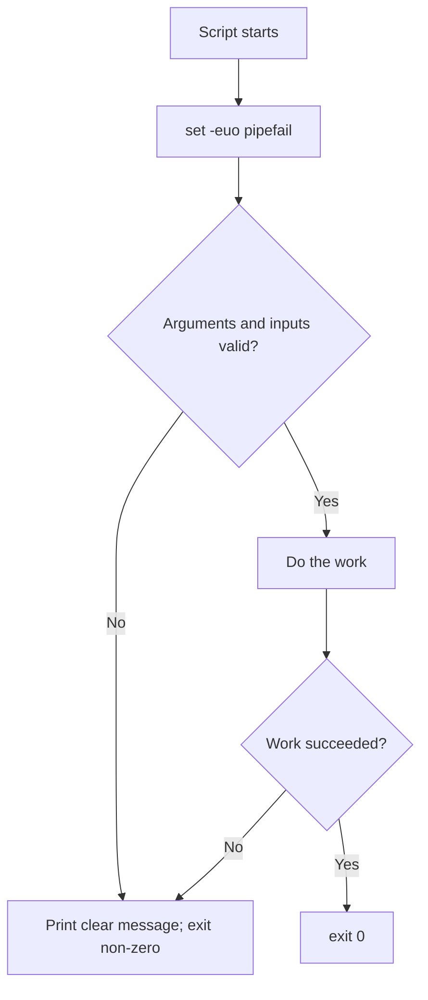

# Lab 2.2: Five Shell Scripts

**Month:** 2 (Linux CLI Mastery and Regex) · **Pattern family:** Linux CLI Mastery (and Regex) · **Time budget:** 12 to 14 hours (across several sessions; do not attempt in one) · **Lab attempt floor:** 90 minutes per script when stuck. This is the hardest lab of the month and the one that carries your deliverable. Each script is its own design problem; sit with a stuck script for 90 minutes (man pages, your Lab 2.1 fluency, your own experimentation) before asking the tutor for a hint. · **AI guidance:** AI-free zone. No AI on this lab, and this is the lab where the temptation will be strongest. The tutor refuses to draft, debug, or review your scripts. Writing them yourself is the entire point: Month 5 rebuilds these in Python, and you cannot judge that Python (or the AI you will be allowed to use on it) if Bash was never in your hands. · **Builds on:** Lab 2.1 (you can navigate, read permissions, and inspect processes on your VM).

**Recall first, from memory:** in Lab 2.1 you found the architecture and processes on your VM by hand. Which command listed running processes, and which listed listening network ports? You will fold both into your first script here.

## Why this lab exists

A cheat sheet of commands is inert knowledge. A script is knowledge that does work while you sleep. There is a jump from "I can run these commands" to "I can compose them into something reliable that handles its own errors." That is the jump from someone who uses Linux to someone who automates it, and every later month assumes you have made it.

This lab introduces the **shell-discipline thread** that runs through the rest of the course. A script that fails silently is worse than no script. It lets you believe a backup ran when it did not, or a service is healthy when it is down. **`set -euo pipefail`**, meaningful exit codes, quoted variables, and explicit error handling are how you write scripts that fail loudly instead. You build that discipline here, on five small scripts, so it is automatic by the time the stakes are higher.

The five scripts are not random. They are five shapes of automation you will reach for again and again: gather state, filter a stream, preserve data on a schedule, watch for a pattern and react, and check that something is alive. Learn the shapes here.

## The scope and safety rule

These scripts run on systems you own: your Ubuntu VM and, where you choose, your own Mac. Two of the five touch security-adjacent territory and deserve a note before you build them:

- The **fail2ban-style watcher** reads authentication logs and finds sources that keep failing to log in. Build and test it only against your own VM's logs, or against sample logs you generate yourself. Do not point it at, or design it to act on, any system you do not own. It detects and reports; if you later add a blocking action, that action runs only on your own host, and you state the authorization in your notebook. This is the `SAFETY.md` rule (own or explicitly authorized systems only) applied to a script that could otherwise reach beyond your machine.
- The **backup script** moves and deletes files. Test it against a scratch directory of throwaway data first. A backup script with a quoting bug can delete the wrong thing; that is one of the failure modes this lab exists to teach, and it is best learned on data you do not care about.

## Learning objectives

By the end of this lab you can:

- **Write** a Bash script with a correct shebang, `set -euo pipefail`, and an exit code that reflects whether the script succeeded.
- **Build** scripts using variables, command substitution, conditionals, loops, and at least one function, with variables quoted correctly.
- **Handle** the predictable error cases (a missing file, a missing argument, a command that fails) explicitly, rather than letting the script crash or, worse, continue as if nothing happened.
- **Explain** what each of `-e`, `-u`, and `-o pipefail` does on its own and what bug each one catches.
- **Defend** any line of any script three weeks later, because it is structured and commented for a reader, not just for the moment you wrote it.

## Recognition cue

When you find yourself running the same sequence of commands by hand more than twice, or when a task needs to run on a schedule or react to something while you are not watching, you reach for a script. When that script touches anything that matters (data, a remote host, a privileged action), you reach for the discipline first: `set -euo pipefail`, quoted variables, explicit error handling, a meaningful exit code. This lab is where that reflex is built.

## The discipline, as a flow

Every script you write this month follows the same control flow at its core: validate, then do the work, then exit with a code that tells the truth.


*Notice: there are two ways out, and the failure exit is non-zero on purpose. Other automation reads that exit code to know whether to trust the result.*

## Learning the discipline (gradual release)

The new skill of this lab is not "write a backup script." It is **writing a script that validates its inputs, quotes its variables, and fails loudly with a meaningful exit code.** You will learn that discipline in three stages. You practice it on a throwaway teaching script that is not one of your five deliverables. Then you apply it to the five. Type everything yourself.

### Stage 1 - Worked example (I do)

Study this complete, annotated example. It is a tiny script that greets a user named on the command line. It has nothing to do with the five scripts; it exists so you can see the discipline with no other complexity in the way. Create `demo.sh` in a scratch directory and run it as `bash demo.sh world`, then as `bash demo.sh` with no argument.

```bash
#!/usr/bin/env bash
set -euo pipefail

# Greets the name passed as the first argument. Teaching example only.

if [[ $# -lt 1 ]]; then
    echo "usage: $0 <name>" >&2
    exit 2
fi

name="$1"
echo "Hello, ${name}."
exit 0
```

Read it line by line. The shebang names the interpreter. `set -euo pipefail` turns on the three safety flags. `[[ $# -lt 1 ]]` checks whether fewer than one argument was given; `$#` is the argument count. If so, it prints a usage line to stderr (`>&2`) and exits with code `2` (a non-zero code means failure). `name="$1"` captures the first argument, and `"${name}"` is quoted so a name with a space stays one value. The final `exit 0` says "I succeeded."

**Checkpoint:** `bash demo.sh world` prints `Hello, world.` and `echo $?` after it prints `0`. `bash demo.sh` with no argument prints the usage line and `echo $?` prints `2`.
**If not:** if the no-argument case did not exit, check the `if` test and that you wrote `exit 2` inside it. If the script complained about `set -euo pipefail`, you may have typed a curly quote instead of a straight quote; retype the line.

### Stage 2 - Faded practice (we do)

Now extend the teaching script yourself, still in `demo.sh`, before you touch any of the five. Add input validation that checks a file exists and is readable, following the exact pattern from Stage 1. The skeleton and the goals are below; you fill in the two blanks.

```bash
#!/usr/bin/env bash
set -euo pipefail

# Teaching example: print the first line of a file named as the first argument.

if [[ $# -lt 1 ]]; then
    echo "usage: $0 <file>" >&2
    exit 2
fi

file="$1"

# TODO: if "$file" does not exist OR is not readable, print a clear message
#       to stderr and exit non-zero. (Look up the test flags for "file exists"
#       and "file is readable" in the conditional-expressions section of man bash.)
if [[ ___ ]]; then
    echo "___" >&2
    exit ___
fi

# TODO: print just the first line of the file. (head is one way.)
___ "$file"
exit 0
```

You already know the shape from Stage 1. Your job is to find the file-test flags in `man bash` and drop them in, then choose a command that prints the first line. Test it against a file that exists, a path that does not, and (with `chmod`) a file you cannot read.

**Checkpoint:** the script prints the first line for a readable file, and for a missing or unreadable path it prints your message and exits non-zero (`echo $?` shows a non-zero number).
**If not:** if a missing file still reached the `head` line, your test flag or its logic is wrong; confirm the "file exists" and "is readable" flags in the conditional-expressions section of `man bash`, and remember `!` negates a test. If `set -e` exited the script before your message printed, you let a command fail before your own check ran; do your validation first.

### Stage 3 - Independent (you do)

No scaffolding now. Write the five deliverable scripts below. Every script starts from this skeleton, and this skeleton is the only code this lab hands you. Everything below the header is yours to design, build, and debug without AI, applying the discipline you just practiced in Stages 1 and 2.

```bash
#!/usr/bin/env bash
set -euo pipefail
# <one-line description of what this script does>
# Scope/safety note if the script touches anything beyond ordinary local files.
```

The five scripts live in a directory that becomes your public deliverable repo (see `../../deliverable.md` for the repo structure). Each gets the same header discipline and the same error-handling bar. You design the logic; the tasks below specify what each must accomplish and the bar for "done," not how to write it.

#### Task A: System information dump (2 hours)

Write a script that produces a structured report of the VM's current state: hostname and OS version, kernel and architecture, uptime, CPU and memory summary, disk usage per mounted filesystem, the count of running processes, and the listening network ports. This is the Linux cousin of your Month 1 macOS inventory script; reuse the habit, not the commands, because the commands differ (you noted this in Lab 1.1's `linux-port-notes.md`).

**Checkpoint:** running the script on your VM prints a clearly sectioned, human-readable report covering every field above; it exits `0` on success; if a command it depends on is missing, it reports which one and exits non-zero rather than printing a half-empty report. A sample run is captured to a file in the repo.
**If not:** if the script stops partway with no message, `set -e` halted it on a failed command; run the commands one at a time to find which, then handle that case. If a field is blank, run its command alone first and confirm what it prints before putting it in the script.

#### Task B: Log tail with grep filters (2 hours)

Write a script that tails a log file and filters it: given a log path and one or more patterns, it shows matching lines, optionally following the file as new lines arrive. It should let the caller include lines matching a pattern and exclude lines matching another, and behave sensibly when the log file does not exist or is not readable.

**Checkpoint:** the script accepts a log path and at least one filter pattern as arguments, validates that the file exists and is readable (reporting and exiting non-zero if not), and prints only lines that match the include filter and not the exclude filter. A usage message appears when arguments are missing. You demonstrate it against a log on your VM and a sample log file.
**If not:** if the script crashes when `grep` finds no matches, recall that `grep` returns non-zero on no-match and `set -e` halts on it; handle the no-match case explicitly. If your include and exclude get crossed, test each filter alone before combining.

#### Task C: Scheduled backup (3 hours)

Write a script that backs up a directory you specify to a destination you specify, with a timestamped archive name, and that keeps only the most recent N backups, deleting older ones. Then schedule it: install a cron entry (or a systemd timer; your choice, justified in your notebook) so it runs on a schedule, and confirm it actually ran by checking the destination after the schedule fires.

**Checkpoint:** the script creates a timestamped archive of the source in the destination, refuses to run (with a clear message and non-zero exit) if the source does not exist or the destination is not writable, and prunes backups beyond the retention count; the schedule is installed and you have evidence it fired (a backup that appeared on schedule, plus `crontab -l` or `systemctl list-timers` output). You tested the prune logic against throwaway data first.
**If not:** if the script works by hand but not under cron, cron runs with a minimal `PATH`; use absolute paths or set `PATH` in the script. If the prune deleted the wrong backup, your sort order is reversed; test prune logic on throwaway data until it deletes the oldest, never the newest.

#### Task D: fail2ban-style log watcher (3 hours)

Write a script that reads an authentication log, finds source addresses that have failed authentication more than a threshold number of times, and reports them. Read the scope rule above first: this script detects and reports against your own logs, and any action stays on your own host. Real `fail2ban` is a daemon with persistence and firewall integration. Yours is a focused, readable approximation that finds the pattern and surfaces it. The regex thread shows up here. Pulling an IP and a failure indicator from a log line is a pattern-matching problem you will reuse heavily in Lab 2.4.

**Checkpoint:** given an auth log (your VM's, or a sample with synthetic addresses), the script reports each source address that exceeded the threshold and how many times it failed, worst offenders first; the threshold is configurable; it skips a log line that does not match its expected shape rather than crashing; no real action is taken against any remote host. A sample run against synthetic data is in the repo.
**If not:** if your counts are wrong, recall that `uniq -c` needs a `sort` before it; you cannot count repeats that are not adjacent. If the script dies on an odd log line, your field extraction assumed a shape that line did not have; skip non-matching lines explicitly.

#### Task E: Service health checker (2 hours)

Write a script that checks whether one or more services are healthy and reports a clear status. "Healthy" can mean a systemd unit is active, a process is running, a port is listening, or an HTTP endpoint returns a success code; pick a definition appropriate to the service and state it. The script's exit code reflects overall health, so other automation can use it.

**Checkpoint:** the script checks at least two services on your VM by a definition you state, prints a clear per-service status, and exits `0` only if all checks pass (non-zero otherwise, so the exit code is usable in a pipeline or monitoring hook); it reports "does not exist" distinctly from "exists but is down."
**If not:** if a passing check still gives a non-zero exit, your exit logic is collapsing the per-service results wrong; track an overall status variable and exit on it at the end. If `set -e` exits before you can report a down service, the check command's non-zero result is tripping it; capture the result instead of letting it halt the script.

### Task F: Harden all five (90 minutes)

Go back through all five scripts with a focus on the discipline, not the features:

- Every variable that could contain a space, a glob character, or be empty is quoted.
- Every script handles its missing-argument and missing-file cases explicitly.
- Every script's exit code is meaningful.
- Each script has a header comment a stranger could read to understand what it does and how to call it.
- Deliberately break each script once (rename a file it needs, pass a bad argument, point it at an unreadable path) and confirm it fails loudly with a non-zero exit, rather than silently doing the wrong thing. Note one bug that `set -euo pipefail` surfaced that you would otherwise have missed.

**Checkpoint:** a section "Hardening pass" in your notebook lists, per script, the one most important robustness fix you made, plus at least one concrete example of `set -euo pipefail` catching a bug.
**If not:** if you cannot find a single bug it caught, you may not have broken the scripts hard enough; pass an empty argument or an unreadable path and watch what happens.

### Task G: Notebook entry (90 minutes)

Write the lab notebook entry at `.tutor/notebook/lab-02-five-shell-scripts.md`. Required sections:

- **Pre-flight check.** For any tool or mechanism new to you (`cron` or systemd timers, `tar` or your archive tool, `systemctl`, `ss` or `netstat`), document what it does, what traces it leaves (a cron entry persists; a backup archive consumes disk; a timer is a unit on the system), what could go wrong (a backup that deletes the wrong directory; a watcher misreading a log), and the authorization scope. State explicitly that the watcher operates only on your own logs.
- **Concept naming.** Name what this lab taught beyond "I wrote five scripts." Shell discipline is part of the answer; so is the idea that automation that fails silently is a liability.
- **Evidence.** Reference each script by path, include a sample run of at least two of them, and quote the `set -euo pipefail` bug you caught in Task F.
- **Five-question debrief.** All five questions, with substance. Question 3 (what dominates at scale) and question 4 (the edge case that broke your first attempt) are especially rich here.

No AI Provenance section. Month 2 is in the AI-free zone.

**Checkpoint:** a committed notebook entry with all sections.
**If not:** the tutor will not advance you until it is present and complete, and it may pick one script and ask you to explain a specific line from memory.

## Definition of Done

You are done when all of these are true:

- All five scripts exist, run on your VM, and meet their per-task checkpoints.
- Every script starts with the shebang and `set -euo pipefail`, quotes its variables, handles its error cases, and exits with a meaningful code.
- The backup script's schedule is installed and demonstrably fired once.
- The watcher operates only against your own or synthetic logs, with the scope stated in its header and your notebook.
- The notebook entry is committed with all required sections.

Self-verify with this one-liner from your scripts folder; it should print `OK` (it confirms every script carries the safety line):

```bash
for f in *.sh; do grep -q "set -euo pipefail" "$f" || { echo "MISSING in $f"; exit 1; }; done && echo OK
```

**Self-explain:** in one sentence, why does a script that fails loudly with a non-zero exit code do less damage than one that fails silently and keeps going?

## Stretch goals

1. Add a `--dry-run` flag to the backup script that prints what it would archive and prune, but changes nothing.
2. Run ShellCheck (a free static analyzer; this is a linter, not AI) over all five scripts and fix every warning, making sure you understand each one before you apply its fix.
3. Make the health checker emit one line of machine-readable output (for example, `service=ssh status=up`) in addition to the human-readable status, so it could feed a monitoring tool.

## Troubleshooting

- **`set -e` exits on a `grep` that found nothing** - `grep` returns non-zero on no-match. Handle it explicitly (for example, `grep "x" file || true`) rather than deleting the safety line.
- **A script works by hand but fails under cron** - cron has a minimal `PATH` and environment. Use absolute paths or set `PATH` at the top of the script.
- **An unquoted variable broke on a path with a space** - quote it: `"$file"`, not `$file`. This is the single most common Bash bug.
- **The backup prune deleted the newest archive** - your sort order is reversed. Test prune logic on throwaway data until it removes the oldest, never the newest.
- **Smart quotes break a line** - if you pasted from a document, curly quotes may have replaced straight quotes. Retype the line.

## Time budget breakdown

- Stages 1 and 2 (the teaching script): 45 minutes
- Task A: 2 hours
- Task B: 2 hours
- Task C: 3 hours
- Task D: 3 hours
- Task E: 2 hours
- Task F: 90 minutes
- Task G: 90 minutes

Total: 13 to 15 hours. Most learners overrun the backup and watcher; budget extra sessions for those two.

## Resources

Primary sources, all free.

- `man bash`, specifically the sections on `set`, parameter expansion, and conditional expressions (`[[ ]]`).
- The GNU Bash Reference Manual (the official manual, free online): the authoritative reference for shell behavior.
- The Bash manual's section on quoting and word splitting; this is where the unquoted-variable bug is explained from first principles.
- `man crontab` and `man 5 crontab` for cron; `man systemd.timer` if you choose timers.
- `man tar`, `man ss`, `man systemctl`, `man journalctl`.
- Your Month 1 `linux-port-notes.md`, where you already worked out the Linux equivalents of your macOS inventory commands.
- ShellCheck (free, runs locally or in a browser): a static analyzer for shell scripts. Using it to find your own bugs is fair game and is not AI assistance; it is a linter, like a compiler warning. Understand every warning it raises rather than blindly applying its fix.
