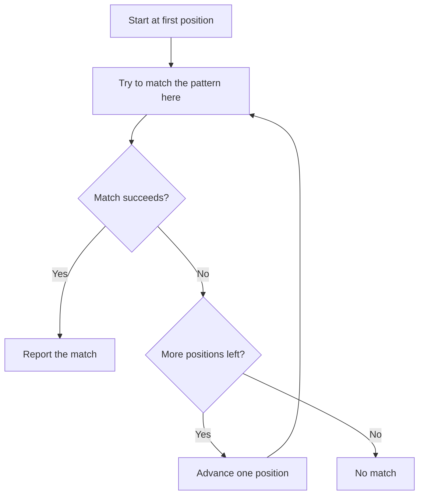

# Lab 2.3: Regex Drills

**Month:** 2 (Linux CLI Mastery and Regex) · **Pattern family:** Linux CLI Mastery (and Regex) · **Time budget:** 8 to 10 hours (across several sessions; regex is best learned in shorter, frequent sittings) · **Lab attempt floor:** 90 minutes per puzzle you are stuck on. Regex rewards sitting with a problem: the floor is long on purpose, because the moment you ask for the answer instead of reasoning it out, the puzzle stops teaching. Sit with a stuck puzzle for 90 minutes (the engine's documentation, your own test strings, paper) before any hint. · **AI guidance:** AI-free zone. No AI on this lab, and regex is the single most tempting place to cheat because AI is good at it. That is exactly why you may not use it here. A regex you cannot read is a regex you cannot trust, and a future month will hand you regexes you must read on sight. Build the reading muscle now, by hand. · **Builds on:** Lab 2.1 (you have used `grep` to match a line). This lab makes the pattern language itself the object of study.

**Recall first, from memory:** in Lab 2.2 your log-watcher script pulled an IP address out of a log line. That pulling was a pattern-match. What characters in a regex match "one or more digits," and does plain `grep` write `+` the same way `grep -E` does? Hold your answer; this lab is where that question gets a precise answer.

## Why this lab exists

Regular expressions are the most reused skill in this entire course. They appear in `grep`, `sed`, and `awk` this month; in packet filters in Month 4; in the Python `re` module in Month 5; in SQL pattern operators in Month 7; and in detection logic (Sigma, SPL, KQL) in Month 9. A practitioner who reads regex fluently moves through all of that quickly. One who guesses at it is slow everywhere and wrong sometimes, and "wrong sometimes" in a detection rule means a missed alert.

The skill is not "can write a regex that works after ten tries." It is "can predict, before running it, exactly which inputs a pattern matches and which it rejects." That predictive reading is what this lab drills. Thirty puzzles of rising difficulty, hand-written, with a running log of your reasoning, build it.

There is also a trap this lab inoculates you against: the belief that regex is one language. It is not. The same pattern behaves differently in `grep`, `grep -E`, and `grep -P`, and a regex copied from a Perl tutorial into plain `grep` will often silently match the wrong thing. Knowing which dialect you are in (BRE, ERE, or PCRE) is half of getting a regex right, and tracking the dialect is built into this lab's checkpoints.

## Learning objectives

By the end of this lab you can:

- **Analyze** a regular expression and state, before running it, which of a set of test strings it matches and which it rejects.
- **Build** patterns using character classes (including POSIX classes), anchors, quantifiers (greedy and lazy), grouping, alternation, and backreferences.
- **Explain** lookahead and lookbehind in a PCRE engine, and why the POSIX dialects do not have them.
- **Reconcile** BRE, ERE, and PCRE: state which metacharacters need escaping in BRE but not ERE, which constructs exist only in PCRE, and predict how the same pattern behaves across `grep`, `grep -E`, and `grep -P`.
- **Explain** the difference between greedy and lazy quantifiers by showing a string on which they produce different matches.
- **Analyze** why a pattern matched more or fewer characters than you intended.

## Recognition cue

When you see a regular expression in a `grep` command, a Month 4 packet filter, a Month 5 `re` call, or a Month 9 detection rule, you read it on sight and predict what it matches instead of pasting it and hoping. When you need to pull a structured value out of messy text, a pattern is the tool your mind reaches for, and the first question you ask is "which dialect am I in." This lab builds both reflexes, and they are reused more than any other skill in the course.

## How a regex engine reads a string

A regex engine does not match by magic. It walks the input left to right, trying to satisfy the pattern, and it backtracks when a greedy part grabbed too much.


*Notice: the engine tries every starting position. This is why an unanchored pattern can match in the middle of a line, and why a greedy quantifier may have to back off and retry.*

## Tasks

Work the puzzle sets, keep the dialect log, then prove the reading skill cold. This lab does not contain the answer patterns: writing them is the entire exercise, and the puzzle platforms grade your patterns for you. Before the puzzles, study the worked example below so you know what "predict, then check" looks like.

### Task 0: Learn predictive reading (gradual release)

The new skill is reading a pattern and predicting its match set before you run it. You will learn it in three stages on teaching patterns that are not puzzle answers, then carry it into every task below.

#### Stage 1 - Worked example (I do)

Study this fully worked prediction. The pattern is `^a.c$` in ERE (`grep -E`). The `^` anchors to the start of the line, `a` matches a literal `a`, `.` matches any single character, `c` matches a literal `c`, and `$` anchors to the end. So the pattern matches a line that is exactly three characters: `a`, then anything, then `c`.

Test strings and the prediction:

- `abc` -> match (a, b, c; three characters)
- `axc` -> match (a, anything, c)
- `ac` -> no match (only two characters; the `.` needs one in the middle)
- `abbc` -> no match (four characters; `.` matches exactly one)
- `xabc` -> no match (`^` requires `a` at the very start)

Now confirm it. Put the five strings in a file and run the pattern:

```bash
printf '%s\n' abc axc ac abbc xabc > t.txt
grep -E '^a.c$' t.txt
```

**Checkpoint:** `grep -E '^a.c$' t.txt` prints exactly `abc` and `axc`, matching your prediction.
**If not:** if it printed more, you may have left off an anchor; `^...$` is what forces the whole-line, exactly-three-characters reading. If `grep` errored, check the quotes are straight single quotes.

#### Stage 2 - Faded practice (we do)

Now you predict before you check. Here is a new teaching pattern in ERE: `^[0-9]{3}-[0-9]{4}$`. Read each piece, then fill in the predictions for the test strings before running anything.

```text
Pattern (ERE): ^[0-9]{3}-[0-9]{4}$
Read it: start, three digits, a literal dash, four digits, end.

Predict match (yes/no) BEFORE running:
  123-4567  -> ___
  12-4567   -> ___
  123-456   -> ___
  abc-4567  -> ___
  123-45678 -> ___
```

Then confirm with the same technique as Stage 1 (write the strings to a file, run `grep -E '^[0-9]{3}-[0-9]{4}$'`). Score your predictions.

**Checkpoint:** your predictions were yes, no, no, no, no, and `grep -E` matches only `123-4567`.
**If not:** if `12-4567` surprised you, recall `{3}` means exactly three, so two digits fail. If `abc-4567` surprised you, `[0-9]` matches only digits, so letters fail. Re-read the piece you misjudged before moving on.

#### Stage 3 - Independent (you do)

No scaffolding. Pick any five-line set of test strings of your own, write one ERE pattern that should match exactly two of them and reject the other three, predict the result in writing, then run it and confirm. If your prediction and the result disagree, the gap is the lesson; write down which feature you misread. This is the exact loop you now run on every puzzle below.

**Checkpoint:** you have, in `regex-log.md`, one pattern you wrote, your five predictions, the actual matches, and a one-line note on any miss.
**If not:** if you cannot make the pattern match exactly two strings, your pattern is probably unanchored and matching as a substring; add `^` and `$` and predict again.

### Task 1: RegexOne, all lessons (2 to 3 hours)

Work through every interactive lesson on RegexOne, in order. RegexOne uses a PCRE-style engine. For each lesson, before you submit a pattern, write it on paper or in a notes file and predict which of the lesson's strings it will match. Then submit and see if your prediction held. The prediction is the learning; the green checkmark is just confirmation.

**Checkpoint:** all RegexOne lessons complete, and `regex-log.md` has a numbered list of the lessons with, for each, the one regex concept it introduced or reinforced, in your own words. Where a prediction was wrong before you submitted, you noted what you misunderstood.
**If not:** if you breezed through without predicting, those lessons did not build the skill; redo a few, writing the prediction first. Wrong-prediction notes are the most valuable entries, so do not hide them.

### Task 2: Regex Crossword, through the intermediate puzzles (2 to 3 hours)

Work Regex Crossword from the beginning through at least the intermediate set. Regex Crossword forces you to read patterns rather than only write them, because you are solving for the string that satisfies two patterns at once. This is predictive reading in its purest form.

**Checkpoint:** a completion record of the puzzles you solved in `regex-log.md`, plus three short notes on puzzles where reading the pattern (not guessing letters) was what cracked it. You describe the reasoning, not the answer.
**If not:** if you solved puzzles by brute-forcing letters, you taught yourself nothing; a brute-forced puzzle has no reasoning to write down. Redo one by reading the patterns and predicting the satisfying string.

### Task 3: The BRE versus ERE versus PCRE drill (90 minutes)

This is the dialect-reconciliation task and the heart of the lab. On your VM, create a small text file with lines you control (a mix of words, numbers, dates, IP-like strings, and a few near-misses). Then, for each construct below, find out by experiment how it behaves in each dialect and record the result:

- Alternation between two words. Make it work in plain `grep` (BRE), in `grep -E` (ERE), and in `grep -P` (PCRE). Note exactly what differs in the pattern you had to write for each.
- A quantifier meaning "one or more." Same three engines. Note what BRE requires that ERE does not.
- A bounded quantifier meaning "between two and four of these." Same three engines.
- A grouped, captured subexpression. Same three engines.
- A backreference to a captured group. Find which of the three engines support it and in what syntax.
- A lookahead (match X only when followed by Y). Find which engine supports it at all.

You are not solving a puzzle here; you are building a comparison table from your own experiments. The orienting tools are `grep`, `grep -E`, `grep -P`, and the engines' documentation. (`sed` defaults to BRE and `sed -E` to ERE; `awk` uses ERE; note these too if you have time.)

**Checkpoint:** a table in `regex-log.md` with one row per construct and one column per dialect, each cell showing the pattern that worked in that dialect (or "not supported" where that is the answer), plus a short paragraph stating the rule you extracted: which metacharacters BRE makes you escape that ERE does not, and which constructs are PCRE-only.
**If not:** if your "one or more" pattern in plain `grep` matched a literal `+`, that is the lesson: BRE needs `\+` for the quantifier, while ERE uses a bare `+`. Record exactly that. If `grep -P` is unavailable on your VM, install it or use a PCRE-capable tester for the PCRE column, and note the substitution.

### Task 4: Greedy versus lazy (45 minutes)

In a PCRE engine (`grep -P`, or a regex tester that supports PCRE), construct a single input string on which a greedy quantifier and its lazy counterpart produce visibly different matches. Show both matches. Explain, in two or three sentences, why the difference arises in terms of how the engine backtracks (the diagram above is your reference).

**Checkpoint:** a section "Greedy versus lazy" in `regex-log.md` with the input string, the two patterns, the two different matches they produce, and your explanation.
**If not:** if both patterns produce the same match, your input is too simple to show the difference; use a string with two possible end points (a line with two `>` characters and a pattern like `<.*>` versus `<.*?>` is a classic). POSIX BRE and ERE have no lazy quantifiers; that is itself worth a sentence.

### Task 5: Cold reading test (60 minutes)

Now prove the predictive-reading skill without writing any patterns. Get five regexes you have not seen (from a study partner, from the engine documentation's examples, or write five for yourself one day and test yourself the next so they are not fresh). For each, before running it, write down which of a set of test strings it will match and which it will reject. Then run it and score yourself.

**Checkpoint:** a section "Cold reading test" in `regex-log.md` with the five patterns, your predictions, the actual results, and your score. If you scored below four of five, the section also notes which regex feature your wrong predictions clustered around; that is your revisit target.
**If not:** if you scored low, do not move on without naming the feature you keep misreading. The cold revisit later will test exactly that feature, so naming it now is the useful move.

### Task 6: Notebook entry (60 minutes)

Write the lab notebook entry at `.tutor/notebook/lab-03-regex-drills.md`. Required sections:

- **Pre-flight check.** Regex itself is the "tool" here. Document what a regex engine does conceptually (it walks the input trying to satisfy the pattern, with backtracking), what could go wrong (a pattern that matches more than intended; catastrophic backtracking on a pathological pattern, which you will meet again in Month 5), and note that the BRE/ERE/PCRE distinction is the artifact most likely to trip you. Authorization scope is trivial (you are matching text you control), but state it for the habit.
- **Concept naming.** Name the skill. It is not "regex syntax." It is closer to "predicting a pattern's match set before running it" and "knowing which dialect you are speaking."
- **Evidence.** Reference `regex-log.md`, paste your BRE/ERE/PCRE comparison table, and quote your greedy-versus-lazy example.
- **Five-question debrief.** All five, with substance. Question 5 (what you would do differently cold) should name the regex feature you are least confident on, because the cold revisit will test exactly that.

No AI Provenance section. Month 2 is in the AI-free zone, and regex is the place where that rule matters most.

**Checkpoint:** a committed notebook entry with all sections.
**If not:** the tutor may spot-check by handing you a short regex and asking what it matches; if you wrote the log yourself, this is easy.

## Definition of Done

You are done when all of these are true:

- RegexOne is complete and Regex Crossword is complete through the intermediate set.
- `regex-log.md` contains all content sections, including the BRE/ERE/PCRE comparison table built from your own experiments.
- You scored at least four of five on the cold reading test (or documented your revisit target if not).
- The notebook entry is committed.
- You can, on request, read a short regex aloud and state what it matches without running it.

Self-verify with this one-liner from the lab folder; it should print `OK` (it confirms your log captured the dialect work):

```bash
grep -qiE 'BRE|ERE|PCRE' regex-log.md && grep -qi 'greedy' regex-log.md && echo OK
```

**Self-explain:** in one sentence, why does the same "one or more" pattern need a backslash in plain `grep` but not in `grep -E`?

## Stretch goals

1. Take one pattern from your cold-reading test and rewrite it in all three dialects (BRE, ERE, PCRE), noting every character that had to change.
2. Build a pattern that matches a valid-looking IPv4 address, then find an invalid address it wrongly accepts (for example, `999.999.999.999`); explain why catching that needs more than a simple pattern.
3. Read about catastrophic backtracking and construct a small pattern and input that is noticeably slow in a PCRE engine; note why this matters for any tool that accepts user-supplied patterns (you meet this again in Month 5).

## Troubleshooting

- **A PCRE pattern (`\d`, lookahead, lazy `*?`) silently matches the wrong thing in plain `grep`** - plain `grep` is BRE and does not understand those constructs. Use `grep -P`, or rewrite the pattern in BRE. This is the dialect trap.
- **Your "one or more" matched a literal `+`** - in BRE, `+` is literal; the quantifier is `\+`. In ERE (`grep -E`), `+` is the quantifier. Know which engine you are in.
- **A pattern matched more than you expected** - it is probably unanchored or greedy. Add `^` and `$` to pin it to the whole line, or switch a greedy quantifier to lazy in PCRE.
- **`grep -P` is not available** - some builds lack PCRE support. Install a `grep` with `-P`, or use a free PCRE-capable tester for the PCRE-only constructs, and note the substitution in your log.
- **Regex Crossword feels solvable by guessing letters** - resist; the value is in reading the patterns. A brute-forced puzzle taught you nothing.

## Time budget breakdown

- Task 0 (the teaching example): 45 minutes
- Task 1: 2 to 3 hours
- Task 2: 2 to 3 hours
- Task 3: 90 minutes
- Task 4: 45 minutes
- Task 5: 60 minutes
- Task 6: 60 minutes

Total: 8 to 10 hours. Spread it across several short sittings rather than one long one; regex retention is much better with spacing.

## Resources

Primary sources, all free.

- `man 7 regex` on your VM: the POSIX regular-expression manual page, covering BRE and ERE precisely.
- `man grep`, especially the sections distinguishing `grep` (BRE), `grep -E` (ERE), and `grep -P` (PCRE).
- The PCRE documentation (`pcre2pattern`, free online): the authoritative reference for the Perl-compatible features (lookaround, lazy quantifiers, named groups).
- RegexOne (free interactive lessons).
- Regex Crossword (free puzzles).
- A regex tester that shows match groups and supports multiple engines (regex101 and similar are free; use them to inspect your own patterns, not to have a pattern generated for you). Choosing the right engine flavor in the tester is part of the dialect discipline.
- The POSIX specification's chapter on regular expressions, for the exact definition of the character classes (`[[:digit:]]`, `[[:alpha:]]`, and the rest).
