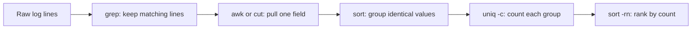

# Lab 2.4: Log Parsing Pipelines

**Month:** 2 (Linux CLI Mastery and Regex) · **Pattern family:** Linux CLI Mastery (and Regex) · **Time budget:** 10 to 12 hours (across several sessions) · **Lab attempt floor:** 90 minutes per pipeline you are stuck on. Each pipeline is a small reasoning problem: what is the shape of this log line, which field do I want, how do I isolate it. Sit with a stuck pipeline for 90 minutes (the tool man pages, your Lab 2.3 regex, sample lines on paper) before any hint. The floor is long because the temptation to look up a one-liner is high, and looking it up skips the learning. · **AI guidance:** AI-free zone. No AI on this lab. The tutor will not write or debug a pipeline for you. Building these by hand is how reading logs becomes fast; in Months 4, 9, and 12 you will read logs under time pressure, and the speed you build here is the difference between finding the indicator and missing it. · **Builds on:** Lab 2.1 (navigate and `grep`), Lab 2.2 (you wrote a log-tail script), and Lab 2.3 (you can read a regex). This lab is where those three meet.

**Recall first, from memory:** in Lab 2.3 you learned that `uniq` only collapses adjacent lines. So if you want to count how many times each value appears, what must you do before `uniq -c`? Hold the answer; that exact idiom is the backbone of half this lab.

## Why this lab exists

A security career is, in large part, reading logs. The breach is in the logs. The misconfiguration is in the logs. The thing the client is paying you to find is, more often than not, a pattern in a log file too large to read by eye. The practitioner who can isolate that pattern with a short pipeline in thirty seconds is worth far more than one who exports the log to a spreadsheet and scrolls.

`grep`, `sed`, `awk`, `cut`, `sort`, and `uniq`, joined by pipes, are the tools for this, and the composition is the skill. Any one of them is simple. Chaining them so the output of one feeds exactly the right input to the next, and the whole pipeline answers a real question, is what this lab drills. Ten questions, three real log formats, ten pipelines you build yourself.

This lab is also where the Month 2 regex thread does paid work. Several of these questions are pattern-extraction problems, and the pattern is a regex. Months 4, 5, and 9 reuse both halves: the pipeline-composition habit and the regex inside it.

## The data rule

Use **sample log files only**. Three good sources, all consistent with `SAFETY.md` and the course's data-handling discipline:

- Synthetic logs you generate yourself (your Lab 2.2 scripts can produce some; you can also hand-write log lines in the real formats).
- Your own VM's logs (`/var/log/auth.log`, `/var/log/syslog`, and a web server's access log if you install one on the VM). These are yours; trivially authorized.
- Published sample log datasets that are explicitly provided for learning (see Resources). These ship synthetic or anonymized data for exactly this purpose.

Do **not** use logs from any system you do not own, and do not paste real production logs (including your home network's) anywhere. When your deliverable repo or notebook shows pipeline output, that output comes from synthetic or your-own-VM data, with no real third-party addresses, credentials, or hostnames. This is the same data-handling rule the Month 5 deliverable enforces, applied early.

## Learning objectives

By the end of this lab you can:

- **Analyze** a log-analysis question by decomposing it into a pipeline of single-purpose tools, and predict the shape of the output at each stage.
- **Build** pipelines that use `grep` to select lines, `cut` and `awk` to extract fields, `sed` to transform text, and `sort | uniq -c | sort -rn` to rank by frequency.
- **Defend** a choice between `cut`, `awk`, and `sed` for a given field-extraction problem.
- **Read** the Apache combined log format, the nginx default format, and a syslog line, and name each field.
- **Produce** a pipeline that answers a question you are handed, and **verify** on a small sample that it answers exactly that question and not a slightly different one.

## Recognition cue

When you are handed a log file too large to read by eye and a question about what is in it (which address hit us most, what failed, when did this start), you decompose the question into a short pipeline of single-purpose tools instead of opening a spreadsheet. In Months 4, 9, and 12 you will do exactly this under time pressure on real investigation data. The speed and accuracy you build here are the difference between finding the indicator and missing it.

## A pipeline is an assembly line

Each tool in a pipeline does one job and hands its output to the next. Reading right is reading the stream as it narrows.


*Notice: `sort` comes before `uniq -c` on purpose. `uniq` only collapses adjacent lines, so counting without sorting first gives wrong numbers.*

## Tasks

Build ten pipelines. Each task below states the question a pipeline must answer and the bar for "done." It does not give you the pipeline; composing it is the exercise, and a small sample of input lets you verify your own work. Keep all ten, with one sample input line and the output, in a working file `pipelines.md` in this lab's directory. Study Task 0 first so the build-and-verify loop is clear.

Before the ten questions, anchor the formats. Read one line of each format and label every field in `pipelines.md`: an Apache combined line (client, identity, user, timestamp, request, status, bytes, referer, user agent), an nginx default line (similar, with its own ordering), and a syslog line (timestamp, host, process and PID, message). You cannot extract a field you cannot name.

A note on what "a pipeline" means here: a single command line composing tools with pipes. One per question. If a question genuinely needs two passes, that is fine; say so. The discipline is composition, not cramming everything into one unreadable line.

### Task 0: Learn pipeline composition (gradual release)

The new skill is decomposing a question into a chain of single-purpose tools and verifying the chain answers exactly that question. You will learn it in three stages on a tiny made-up dataset that is not one of the ten graded questions. Then you apply the loop to all ten.

#### Stage 1 - Worked example (I do)

Suppose you have a file of fruit orders, one per line, in the form `name,fruit`, and the question is: which fruit was ordered most, with counts? Build the sample and the pipeline:

```bash
printf '%s\n' 'ann,apple' 'bob,pear' 'cy,apple' 'di,apple' 'ed,pear' > orders.csv
cut -d, -f2 orders.csv | sort | uniq -c | sort -rn
```

Read it stage by stage. `cut -d, -f2` splits each line on a comma and keeps field 2 (the fruit). `sort` groups the identical fruit names so repeats are adjacent. `uniq -c` collapses each group and prints its count. `sort -rn` sorts numerically, largest first, so the most-ordered fruit is on top. The answer is `3 apple`, then `2 pear`.

**Checkpoint:** the pipeline prints `3 apple` on the first line and `2 pear` on the second.
**If not:** if the counts look wrong (for example, `apple` appears twice with separate counts), you dropped the `sort` before `uniq -c`; `uniq` needs the duplicates adjacent. If you got whole lines instead of just the fruit, check `-f2` (field 2) and `-d,` (comma delimiter).

#### Stage 2 - Faded practice (we do)

Same dataset, new question: how many distinct people ordered (count the unique names)? The shape is close to Stage 1 but not identical. Fill in the two blanks, predicting the answer first.

```bash
# orders.csv from Stage 1.
# Goal: print the number of DISTINCT names that appear.
___ -d, -f1 orders.csv | sort | uniq | ___
#   ^ pull field 1 (the name)        ^ count the lines that survive uniq
```

Predict the number before you run it (look at the five rows). Then run it and confirm. The hint: the last tool counts lines, and `uniq` (without `-c`) removes adjacent duplicates.

**Checkpoint:** the pipeline prints `5` (all five names are distinct), and you predicted `5` before running.
**If not:** if you got a count other than 5, check that field 1 is the name and that your line-count tool counts lines (one common choice counts words or characters with the wrong flag). If you used `uniq -c` here, you printed counts per name instead of one total; this question wants a single number.

#### Stage 3 - Independent (you do)

No scaffolding. Add a third column to your sample (`name,fruit,price`), then write one pipeline that answers a frequency or ranking question of your own about the new column, predict the output, run it, and confirm. Record the question, the pipeline, and the verified output in `pipelines.md`. This is the exact build-predict-verify loop you now run on all ten graded questions.

**Checkpoint:** `pipelines.md` has your question, your pipeline, your predicted output, and the actual output, and they agree.
**If not:** if the actual output disagrees with your prediction, do not just patch the pipeline until it looks right; figure out which stage produced the surprise by running the pipeline one tool at a time (cut, then add sort, then add uniq -c). Reading the stream as it narrows is the skill.

### Group A: Apache and nginx access logs (questions 1 to 6, about 4 hours; budget roughly 40 minutes per question)

1. **Top client addresses by request count.** Produce the ten source addresses that made the most requests, with their counts, most frequent first. **Checkpoint:** output is exactly two columns (count and address) for the top ten, sorted descending by count, verified against a sample where you can confirm the ranking by hand. **If not:** if counts are wrong, you skipped the `sort` before `uniq -c`; if you got more than ten rows, add a tool to take the top ten.

2. **All requests that returned a 500-class status.** Isolate every line whose HTTP status is in the 5xx range. **Checkpoint:** every line in the output has a 5xx status and no 2xx, 3xx, or 4xx line appears; you confirm on a sample with a mix. **If not:** if 4xx lines leak in, your pattern is matching the status loosely; anchor it to the status field's position rather than matching `5` anywhere in the line.

3. **Count of requests per HTTP status code.** Produce each distinct status code and how many times it occurred. **Checkpoint:** the output lists each status code present with an accurate count, and the counts sum to the total request count. **If not:** if the sum is off, you are extracting the wrong field or splitting on the wrong delimiter; label the field first.

4. **Requests to a specific path.** Given a URL path, show every request to it (and only it, not paths that merely contain it as a substring). **Checkpoint:** the output contains requests to the exact path and excludes near-misses; you demonstrate the near-miss exclusion on a sample. **If not:** if `/login` also matched `/login-page`, your pattern is unanchored; pin it to the path boundary (this is the Lab 2.3 anchoring lesson).

5. **Unique user agents, ranked.** Produce the distinct user-agent strings and how often each appears, most common first. **Checkpoint:** identical user-agent strings are grouped into one count (not split by minor formatting), and the output is ranked. **If not:** if one agent appears as several near-identical rows, your field extraction is splitting inside the quoted agent string; `cut` on spaces breaks here, which is a hint about which tool to use.

6. **Requests in a given time window.** Show only the requests whose timestamp falls within a one-hour window you choose. **Checkpoint:** every line in the output is within the window and lines just outside it are excluded; you verify on a sample straddling the boundary. **If not:** if boundary lines leak in or out, text-based timestamp filtering is fiddly; that fiddliness is the lesson, and it previews why Month 5 reaches for real date parsing.

### Group B: syslog and auth.log (questions 7 to 10, about 4 hours; budget roughly 60 minutes per question)

7. **Failed SSH login attempts by source address.** From an auth log, count failed login attempts per source address, worst offenders first. **Checkpoint:** the output ranks source addresses by failed-attempt count; you have effectively rebuilt the core of your Lab 2.2 watcher as a pipeline, and you note in `pipelines.md` how the pipeline and the script compare. **If not:** if you catch successful logins too, your line-selection pattern is too broad; select only the failure lines first, then extract the address.

8. **Messages from a specific process.** From syslog, show only the lines emitted by one named process (for example, the cron daemon). **Checkpoint:** every output line is from the named process and lines from other processes are excluded, including processes with similar names. **If not:** if a similarly named process leaks in, match the process field precisely rather than matching the name anywhere in the line.

9. **Extract and count a value embedded in the message text.** Pick a value inside the free-text message field (a username, a PID, a port number, your choice) and produce a frequency count of it. **Checkpoint:** the value is correctly extracted from the message text (a regex or field-extraction problem inside an already-selected set of lines) and counted; you show one sample line and the value your pipeline pulled from it. **If not:** if you pull the wrong token, the message field has no fixed columns; a regex that targets the value's context is more reliable than a fixed field number.

10. **Reconstruct a timeline for one entity.** Given one source address or username, produce every log line mentioning it, in chronological order, across the auth log. **Checkpoint:** the output is every relevant line and only relevant lines, in time order; you confirm the ordering and completeness on a sample. **If not:** if lines are out of order, recall that lexical sort is not always chronological across format quirks; note where it breaks, because that is exactly why Month 5 introduces real date handling.

### Task 11: The composition write-up (60 minutes)

For three of your ten pipelines (your choice, but include at least one from each group), write a short explanation in `pipelines.md` of why you composed it the way you did: which tool does which job, why you chose `awk` over `cut` (or the reverse) for the field extraction, and what the output looked like at each stage of the pipe. This is the task that converts ten working one-liners into transferable understanding.

**Checkpoint:** three composition write-ups in `pipelines.md`, each naming the role of each tool in the pipeline and the reason for the tool choice.
**If not:** if a write-up just restates the command, push it to explain the choice: why this tool and not the obvious alternative, and what each stage's output looked like.

### Task 12: Notebook entry (60 minutes)

Write the lab notebook entry at `.tutor/notebook/lab-04-log-parsing-pipelines.md`. Required sections:

- **Pre-flight check.** For the tools (`grep`, `sed`, `awk`, `cut`, `sort`, `uniq`), document what each does to a stream, what traces they leave (none persistent; they read and write streams, which is itself worth stating), what could go wrong (a pipeline that answers a subtly different question than the one asked; a pattern that matches a substring you did not intend), and the data scope (synthetic or your-own-VM logs only, per the data rule).
- **Concept naming.** Name the skill: decomposing a question into a pipeline, and verifying the pipeline answers exactly that question.
- **Evidence.** Reference `pipelines.md`, and paste two complete pipelines with their sample input and output.
- **Five-question debrief.** All five, with substance. Question 4 (the edge case that broke your first attempt) is rich here: substring-versus-exact matches, identical values split by formatting, and timestamp-boundary errors are all common first-attempt failures.

No AI Provenance section. Month 2 is in the AI-free zone.

**Checkpoint:** a committed notebook entry with all sections.
**If not:** the tutor may spot-check by handing you a log line and a question and asking which tools you would chain; if you built these yourself, you can answer.

## Definition of Done

You are done when all of these are true:

- All ten pipelines exist in `pipelines.md`, each with a sample input line and its output, and each meets its checkpoint.
- The three log formats are labeled field-by-field.
- Three composition write-ups explain the tool choices.
- All input data is synthetic or from your own VM; no real third-party data appears.
- The notebook entry is committed.

Self-verify with this one-liner from the lab folder; it should print `OK` (it confirms your file has the field labels and several pipelines):

```bash
grep -qi 'user agent' pipelines.md && [ "$(grep -c '|' pipelines.md)" -ge 5 ] && echo OK
```

**Self-explain:** in one sentence, why must `sort` come before `uniq -c` when you are counting how often each value appears?

## Stretch goals

1. Rewrite one Group A pipeline using `awk` alone (field selection, the match, and the count in one `awk` program) and compare its readability to your piped version.
2. Take question 4 (exact path) and deliberately write the wrong, unanchored version; show on a sample exactly which near-miss lines it wrongly includes, then fix it. Keep both as a before-and-after.
3. Build a pipeline that answers a question none of the ten asked (for example, the busiest single minute by request count) and add it to `pipelines.md` with its verification.

## Troubleshooting

- **The pipeline answers a slightly different question** - "Requests to `/login`" that also matches `/login-page` is the classic. Verify on a small sample where you know the right answer by hand, every time.
- **`cut` falls apart on a field with spaces** - `cut` splits on a single delimiter, so a quoted user-agent string with spaces breaks it. This is where `awk` (which can treat quoted fields more carefully, or split on a different separator) is the right tool.
- **`uniq -c` gives wrong counts** - it only collapses adjacent duplicates. Always `sort` before `uniq -c`.
- **Timestamp filtering misbehaves at the boundary** - lexical (text) order is not always chronological order across format quirks. Note it; this is precisely why Month 5 introduces real date handling.
- **A pipeline tuned for Apache pulls the wrong field from nginx** - the formats look similar but field positions differ. This is why labeling the fields comes first.

## Time budget breakdown

- Format labeling and Task 0 (the teaching example): 60 minutes
- Group A (questions 1 to 6): 4 hours
- Group B (questions 7 to 10): 4 hours
- Task 11: 60 minutes
- Task 12: 60 minutes
- Buffer: 60 minutes

Total: 10 to 12 hours.

## Resources

Primary sources, all free.

- `man grep`, `man sed`, `man awk`, `man cut`, `man sort`, `man uniq` on your VM. The `awk` manual (`man awk`, and the GNU `gawk` manual online) is the deepest of these; you do not need all of `awk`, only field-oriented processing.
- The GNU Coreutils manual (free online) for `cut`, `sort`, and `uniq`.
- The Apache HTTP Server documentation on log formats (the combined and common log format definitions; primary source).
- The nginx documentation on the `log_format` directive and its default `combined` format (primary source).
- The `rsyslog` or systemd `journald` documentation for the syslog line structure.
- A published, learning-oriented sample log dataset (for example, the Apache access logs distributed for log-analysis practice, or the logs bundled with public log-parsing tutorials). Confirm any dataset is synthetic or anonymized before use.
- Your own Lab 2.3 `regex-log.md`, especially the BRE/ERE/PCRE table, since these pipelines live in `grep` (BRE or ERE) and `awk` (ERE).
