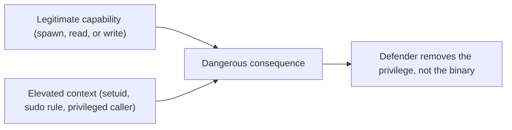

# Lab 2.5: GTFOBins Exploration

**Month:** 2 (Linux CLI Mastery and Regex) · **Pattern family:** Linux CLI Mastery (and Regex) · **Time budget:** 6 to 8 hours (across several sessions) · **Lab attempt floor:** 45 minutes per binary you are reasoning about. This is a reading-and-writing lab, not an exploitation lab, so the floor is short: sit with the mechanism of a binary for 45 minutes (the binary's man page, the GTFOBins entry, your permission knowledge from Lab 2.1) before asking the tutor to help you reason about why it is dangerous. The tutor will help you reason; it will not hand you an exploitation recipe, because there is none to hand. · **AI guidance:** AI-free zone. No AI on this lab. The understanding it builds (why an ordinary tool becomes a privilege boundary problem) is exactly the fundamental you must hold yourself, because later months let you use AI on offensive and defensive labs, and you cannot evaluate AI's claims about privilege escalation if you never built the mental model by hand. · **Builds on:** Lab 2.1, especially the permissions and setuid work. You understand what the setuid bit does and you found the setuid binaries on your VM. This lab explains why some of them are a problem.

**Recall first, from memory:** in Lab 2.1 you found the setuid binaries on your VM and guessed why each needs that bit. What does the setuid bit actually do when a program runs? Hold the answer; this lab turns that guess into a rigorous account of when setuid becomes dangerous.

## Why this lab exists

In Lab 2.1 you found the setuid binaries on your VM and guessed why each needs that bit. This lab makes the guess rigorous and adds the security insight. Some perfectly ordinary, useful binaries become dangerous the moment they run with privileges they did not earn. They can be persuaded to do something their author never intended: spawn a shell, read a file you should not be able to read, or write a file you should not be able to write.

**GTFOBins** is a curated catalog of exactly these binaries. They are Unix programs with a legitimate purpose. But when one is misconfigured to run with elevated privilege (a setuid bit, a `sudo` rule that lets you run it as root, or a privileged service that invokes it), it hands an attacker a way to escalate. Understanding why is foundational blue-team and red-team knowledge. A defender hardens a system by removing these footguns; an attacker on a box looks for them first. Both start from the same understanding, and that understanding is the deliverable of this lab.

This is a **conceptual** lab. You document the mechanism by which each binary becomes dangerous. You do not exploit a real target, you do not run a privilege-escalation chain against anything, and you do not write an exploitation recipe. The skill is explaining the why, not performing the how.

## The scope rule, first, because it is not optional

Read this before anything else in the lab.

You study these binaries **only** on systems you own: your own Ubuntu VM, running on your own host, where you are the administrator. The `SAFETY.md` rule is absolute and applies here with no exceptions: you may only interact with systems you demonstrably own or have explicit written authorization to test. There is no "I am just curious about a shared box," no "the lab said to try it on a real target," no employer system, no school system, no machine on a network you do not control.

What this lab actually asks you to do stays well inside that line, because the lab is about explanation, not exploitation:

- You **read** documentation: the GTFOBins entries and the binaries' own man pages.
- You **inspect** binaries on your own VM (which are setuid; which a `sudo` rule would let you run as root in a hypothetical misconfiguration).
- You **write**, in your own words, the mechanism that makes each one a privilege boundary problem.

If at any point you find yourself wanting to run a privilege-escalation chain to "see if it works," that impulse is the one `SAFETY.md` exists to govern. On your own VM, where you are already root via `sudo`, demonstrating a privesc proves nothing (you already have the privilege); off your own VM, it is the exact activity that becomes a federal matter. So the lab does not ask for it. Document the mechanism; do not run the chain.

## Learning objectives

By the end of this lab you can:

- **Explain** what makes a binary a candidate for unintended privileged use: the combination of a legitimate capability (spawning a process, reading a file, writing a file) with an elevated context (setuid, a permissive `sudo` rule, a privileged caller).
- **Describe**, for five specific binaries, the exact mechanism by which each can be turned to a privileged operation it was not meant to grant.
- **Categorize** the mechanisms: which binaries are dangerous because they spawn a shell, which because they read arbitrary files, which because they write arbitrary files, and which fit more than one category.
- **Defend**, from the defender's side, how each footgun is removed (drop the setuid bit, tighten or eliminate the `sudo` rule, avoid invoking the binary from a privileged context).
- **Connect** this to the setuid concept from Lab 2.1 and to the principle of least privilege.

## Recognition cue

When you see an ordinary binary running with privilege it does not obviously need (a setuid bit, a permissive `sudo` rule, a privileged service shelling out to a helper), a question should fire: what could this tool be persuaded to do that its author never intended? Defenders ask it to harden a host; the same question, asked from the other side, is the first move in privilege escalation. This lab builds the question and the mental model behind it, conceptually and on your own VM only.

## The mechanism, as a picture

Every entry in the catalog is the same idea: a capability the binary always had, plus a privilege it was wrongly granted, equals a consequence the author never intended.


*Notice: the binary is never the bug. The vulnerability is the decision to run it with privilege it does not need. That is the whole insight.*

## Tasks

Pick five binaries, study each, and write the mechanism. This lab produces a written analysis, not commands, so there is no solution to withhold; the work is the explanation, and the explanation is yours to construct. Study Task 0 first, so the level you are writing at (mechanism, never recipe) is clear.

### Task 0: Learn the mechanism write-up (gradual release)

The new skill is writing a binary's danger at the level of mechanism, never as a runnable recipe. You will learn it in three stages on a made-up illustrative tool, so no real exploitation appears anywhere, then apply it to your five.

#### Stage 1 - Worked example (I do)

Study this complete mechanism write-up for an imaginary teaching tool. Suppose a fictional binary `readfast` exists whose only legitimate job is to print a file to the screen quickly. Here is the four-part account, at the level this lab wants:

- **Capability.** `readfast` can open and print the contents of any file it is given a path to. That is its entire purpose and it is not a flaw.
- **Elevated context.** Imagine `readfast` is installed setuid root, so it runs as root no matter who launches it (perhaps someone thought that made it "faster" for everyone).
- **Consequence.** A low-privileged user can now point `readfast` at a file only root should read (a protected credentials file) and see its contents, because the program does the reading as root. The user has read a file the system meant to deny them.
- **Why the author did not consider this a bug.** `readfast` is doing exactly what it was built to do: print a file. The vulnerability is the setuid-root decision, not the program.

Notice what the write-up does not contain: no command line, no flags, no step-by-step. It names the capability, the context, the consequence, and the design insight. That is the target level for all five of your real binaries.

**Checkpoint:** you can state, in one breath, the four parts of the framework: capability, elevated context, consequence, and why it is not the author's bug.
**If not:** re-read the `readfast` example and write the four headers in your notes with one sentence each, in your own words, before moving on.

#### Stage 2 - Faded practice (we do)

Now you complete a mechanism write-up for a second imaginary tool. Suppose a fictional binary `writeout` exists whose legitimate job is to save text it is given into a file at a path you choose. Fill in the four parts. The capability is given; you supply the rest at the mechanism level, with no commands.

```text
Imaginary binary: writeout (legitimately: saves provided text to a chosen file path)

- Capability: it can write content to any file path it is given.
- Elevated context: ___   (name a plausible misconfiguration that makes it run as root)
- Consequence: ___        (state, at the level of consequence, what a low-privileged
                           user gains; think about what writing one privileged file as
                           root would let them change)
- Why not the author's bug: ___
```

Keep every blank at the level of consequence and mechanism. If a sentence starts to read like instructions someone could follow, rewrite it as "the user gains the ability to ..." instead.

**Checkpoint:** your four-part write-up for `writeout` names a plausible elevated context, states the consequence as a capability gained (not a recipe), and ends with the "the configuration is the bug, not the binary" insight.
**If not:** if your consequence drifted into steps, pull it back up a level. Replace any "run X then Y" with a capability gained, such as "the user can now cause root to write a file of their choosing." The consequence is what matters; the keystrokes are not the lab.

#### Stage 3 - Independent (you do)

No scaffolding. Now do the real, graded work on five actual binaries from the GTFOBins catalog, in Tasks 1 through 4 below, writing each at the mechanism level you just practiced. The `readfast` and `writeout` examples were imaginary on purpose; your five are real binaries, but your write-ups stay at exactly the same level: capability, context, consequence, design insight, and never a runnable recipe.

### Task 1: Choose your five (30 minutes)

From the GTFOBins catalog, choose five binaries to study in depth. Choose for variety of mechanism, not for fame. A good set covers more than one category: at least one whose danger is that it can spawn a shell, at least one whose danger is arbitrary file read, and at least one whose danger is arbitrary file write. Good candidates to consider (you are not limited to these): a pager, a text editor, an interpreter, a file-transfer or archiving tool, a "find files" tool. Prefer binaries actually present on your VM so you can inspect them.

**Checkpoint:** a working file `gtfobins-analysis.md` in this lab's directory lists your five chosen binaries and, in one sentence each, your first-glance guess at why each is dangerous.
**If not:** if your five all share one mechanism (five shells, say), swap some out; the lab is richer if your five span shell-spawn, file-read, and file-write.

### Task 2: Read the legitimate purpose (60 minutes)

For each of your five binaries, read its `man` page on your VM and write, in one or two sentences, what the binary is actually for: the legitimate job its author built it to do. You cannot explain why a capability is dangerous in the wrong context until you can state the capability in its right context.

**Checkpoint:** a "legitimate purpose" line for each of the five binaries in `gtfobins-analysis.md`, drawn from the man page, in your own words.
**If not:** if you cannot find the purpose in the man page, widen to the official documentation for that tool; do not guess. The legitimate purpose is the anchor for the whole analysis.

### Task 3: Explain the mechanism (3 hours)

This is the core of the lab. For each binary, write a paragraph explaining the mechanism by which it becomes a privilege escalation problem when it runs with elevated privilege, using the four-part framework from Task 0. Your paragraph must answer:

- **What capability** does the binary legitimately have that becomes dangerous? (It can launch a subprocess; it can read any file it is pointed at; it can write to any path; it can execute code supplied to it.)
- **What elevated context** turns that capability into a problem? (It is setuid root, so it runs as root no matter who invokes it; or a `sudo` rule lets a low-privileged user run it as root; or a privileged service invokes it on attacker-influenced input.)
- **What is the result** of combining the two? State it at the level of consequence ("the user obtains a shell running as root," "the user reads a protected credentials file they should not be able to read," "the user writes a file as root, which lets them alter a privileged configuration"). State the consequence; do not write the command sequence that produces it.
- **Why the author did not consider this a bug.** The binary is doing exactly what it was designed to do. The vulnerability is in the configuration that granted it privilege, not in the binary.

**Checkpoint:** five mechanism paragraphs in `gtfobins-analysis.md`, each answering all four questions, describing consequences and mechanisms rather than exploitation steps.
**If not:** if a paragraph reads like a recipe someone could paste into a terminal, rewrite it at the level of mechanism; that rewrite is part of the skill, and Task 0's examples are your model for the right altitude.

### Task 4: Categorize and connect to defense (90 minutes)

Now step up a level:

- Build a small table classifying your five binaries by mechanism: shell-spawn, file-read, file-write, code-execution (a binary can fall into more than one). The point is to see that a handful of underlying capabilities account for most of the catalog.
- For each binary, write one sentence on how a defender removes the footgun. The fix is almost never "patch the binary"; it is "do not grant it privilege it does not need." Connect this explicitly to the principle of least privilege.
- Write one short paragraph answering: given what you now know, what would you check first if you were hardening a Linux host against this whole class of problem? (Hint: it relates to what you enumerated in Lab 2.1 Task 3.)

**Checkpoint:** the classification table, five one-sentence defensive fixes, and the hardening paragraph, all in `gtfobins-analysis.md`.
**If not:** if every defensive fix says "patch the binary," reread the insight: the binary is not the bug. The fix is to remove the unnecessary privilege (drop the setuid bit, tighten the `sudo` rule).

### Task 5: Notebook entry (60 minutes)

Write the lab notebook entry at `.tutor/notebook/lab-05-gtfobins-exploration.md`. Required sections:

- **Pre-flight check.** The "tools" here are the binaries you studied. For each, you already wrote what it does (Task 2) and what could go wrong (Task 3); summarize that, and state the authorization scope explicitly and prominently: you studied these on your own VM only, you ran no exploitation chain against any system, and the `SAFETY.md` rule (own or authorized systems only) governs any future use of this knowledge. This pre-flight is where the scope discipline becomes a written habit, which is the point of putting a security-adjacent lab in this otherwise foundational month.
- **Concept naming.** Name the concept. It is not "a list of dangerous binaries." It is closer to this: privilege is a property of the execution context, not the binary. Ordinary capabilities become dangerous when they are granted privilege they do not need.
- **Evidence.** Reference `gtfobins-analysis.md` and paste one full mechanism paragraph and your classification table.
- **Five-question debrief.** All five, with substance. Question 2 (the input shape or system behavior that triggers reaching for this) maps to "what does a privesc-hunting checklist look like"; question 3 (what dominates at scale) invites the least-privilege generalization.

No AI Provenance section. Month 2 is in the AI-free zone.

**Checkpoint:** a committed notebook entry with all sections, and a clearly stated authorization scope.
**If not:** the tutor will spot-check by asking you to explain one binary's mechanism from memory and may ask you to state the defensive fix; if you wrote the analysis yourself, this is easy.

## Definition of Done

You are done when all of these are true:

- `gtfobins-analysis.md` contains, for five binaries: a legitimate-purpose line, a four-part mechanism paragraph, a mechanism category, and a defensive fix.
- The classification table and hardening paragraph are present.
- Nothing in your artifacts is an exploitation recipe; everything is mechanism and consequence.
- The notebook entry is committed with the authorization scope stated prominently.
- You can explain, on request and from memory, why one of your five binaries is dangerous and how a defender removes the danger.

Self-verify with this one-liner from the lab folder; it should print `OK` (it confirms the analysis covers the three core mechanisms):

```bash
grep -qiE 'spawn|shell' gtfobins-analysis.md && grep -qi 'least privilege' gtfobins-analysis.md && echo OK
```

**Self-explain:** in one sentence, why is the vulnerability in the configuration that granted the privilege, and not in the binary itself?

## Stretch goals

1. Take one binary you classified as shell-spawn and explain, at the mechanism level, why an interpreter (one that can run code) is almost always also a shell-spawn risk.
2. Write a short "hardening checklist" a defender could run against a fresh host to find this whole class of problem (what to enumerate, in what order), connecting each step to least privilege. Keep it conceptual, not a runnable script.
3. Pick a real CVE or incident where a misconfigured `sudo` rule or setuid binary led to privilege escalation, and summarize the mechanism in the same four-part framework, citing the primary source.

## Troubleshooting

- **Your write-up is turning into a recipe** - pull it up a level. Replace any "run X with flag Y" with "the user gains the ability to ..." The consequence is the lab; the keystrokes are not.
- **You are tempted to "just try it" on your VM** - on your own VM you are already root via `sudo`, so a successful privesc proves nothing you did not already have. Off your own VM it is exactly what `SAFETY.md` forbids. Keep the lab conceptual.
- **You conflated "the binary is vulnerable" with "the configuration is vulnerable"** - the binary does its job; the vulnerability is the decision to run it with privilege. Getting this distinction exactly right is the central insight.
- **All five binaries share one mechanism** - swap some out so your set spans shell-spawn, file-read, and file-write; the small number of underlying capabilities is the thing to see.

## Time budget breakdown

- Task 0 (the teaching examples): 30 minutes
- Task 1: 30 minutes
- Task 2: 60 minutes
- Task 3: 3 hours
- Task 4: 90 minutes
- Task 5: 60 minutes
- Buffer: 30 minutes

Total: 6 to 8 hours.

## Resources

Primary sources, all free.

- The GTFOBins project (free, open catalog): read the entries for your five binaries. Read them for the mechanism, not as a list of commands to run.
- `man <binary>` on your VM for each binary you study: the authoritative statement of what the binary is for.
- The Linux `man 2 setuid` and `man 7 credentials` pages, and `man sudoers`, for how privilege is actually granted and how a permissive `sudo` rule creates the elevated context.
- `SAFETY.md` at the repo root: re-read the "fundamental rule" and "what counts as a legal target" sections before this lab. They are the reason this lab is conceptual.
- Your own Lab 2.1 `rooms-notes.md`, specifically the setuid binaries you enumerated and your first guesses about why each needs the bit.
- The principle of least privilege as described in any authoritative security reference (the NIST glossary defines it cleanly); you connect every defensive fix in Task 4 back to it.
