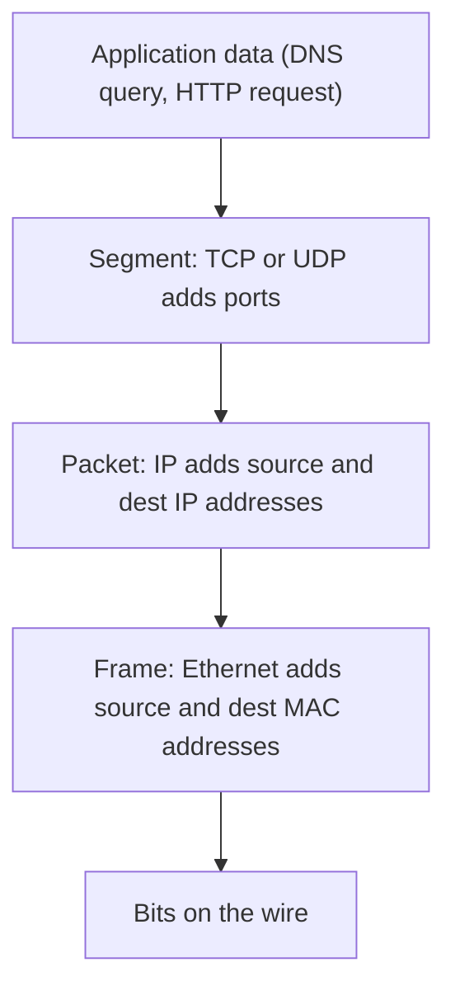

# Month 3: Networking Fundamentals

**Pattern family:** Networking Fundamentals
**Time budget:** 50 hours
**AI guidance:** AI-free zone. No AI on any lab this month. The tutor refuses lab help. On Lab 3.1 it also refuses subnet calculators. The discipline is yours to keep when the tutor cannot see your screen.
**Prerequisites:** Months 1 and 2 done. You can read a man page without flinching (Month 1). You own the Linux shell well enough to run `ip`, `ss`, and a pipeline of `grep` and `awk` without looking them up (Month 2). Your Month 0 VMs (Kali, Ubuntu Server, Windows 11) still boot and snapshot.

## Overview

Every attack and every defense you study for the next nine months crosses a network. So you have to know how a network works. Right now a packet capture is just noise to you. An nmap scan is a magic spell. A firewall rule is a guess. This month changes that.

A network moves data in nested envelopes. A small piece of data sits inside a bigger envelope, which sits inside a bigger one. Each layer adds its own wrapper. This is called **encapsulation**: each layer wraps the layer above it before sending. Here is the spine of the whole month:

*Notice: each layer wraps the one above it. When you capture traffic, you unwrap these layers in reverse, from the frame down to the data.*

You will subnet by hand until it is automatic. You will build a small network of your own with a router. You will capture your own traffic and read it packet by packet. The goal is not to memorize trivia. It is to make the network readable, so that when Month 4 hands you a hostile capture, you are reading, not guessing.

## Warm-Up: Retrieve Before You Begin

Answer these from memory, in writing, before you read on. No peeking at earlier months. This pulls forward the prior skills this month builds on.

1. From Month 1: when you do not know what a command does, what is the one tool that explains it without a web search?
2. From Month 2: write a one-line pipeline that lists open network sockets and keeps only the lines containing `LISTEN`. (Name the commands; exact flags can be fuzzy.)
3. From Month 0: you are about to change a VM's network settings in a way that might cut it off. What do you take first, so a mistake is a thirty-second recovery?

Check your recall

1. The `man` page. Run `man <command>` and read it. This is the Month 1 habit: read the manual, do not collect search results.
2. Something like `ss -tlnp | grep LISTEN` (or `ss -tuln | grep LISTEN`). The point is the pipe: one command produces lines, `grep` filters them. From Month 2 shell work.
3. A snapshot of the VM. A snapshot saves the disk state so you can roll back. From Month 0 lab setup.

## Learning objectives

By the end of this month, you can:

- **Subnet** any IPv4 network by hand, with no calculator: given an address and a prefix, produce the network address, broadcast address, usable host range, and host count, and split a block into smaller subnets.
- **Explain** the OSI model correctly, mapping each protocol you touch (Ethernet, IP, ICMP, ARP, TCP, UDP, DHCP, DNS) to the layer it actually works at, and naming where the model and the real TCP/IP stack disagree.
- **Build** a virtual network with two subnets and a router VM, and produce a routing table that explains how a packet gets from one subnet to the other and out to the internet.
- **Analyze** your own captured traffic in Wireshark: walk a DHCP lease, a DNS lookup, and a TCP three-way handshake field by field.
- **Produce** an annotated network diagram of your home lab that another engineer could read to trace your subnets, routing, DHCP scopes, and DNS resolvers.
- **Reconcile** what you predicted a protocol would do with what the capture actually shows, and explain every difference.

## Recognition cue

A later month will ask "how did this traffic reach that host," or "why did this scan report the port that way," or "which subnet is this address in." If you feel uncertain, that uncertainty traces back to a gap in this month. The reflex this month builds is simple: name the layer, name the addresses, trace the path. Return here when that reflex stalls.

## Core concepts to internalize

Read these to understand the labs, not to memorize them. Each chunk is one idea.

### The OSI model, used correctly

The **OSI model** is a seven-layer map of how network functions stack up. Treat it as a shared vocabulary, not a religion. You need to know where each protocol you touch lives. **Ethernet** (the local wiring protocol) and **MAC addressing** (hardware addresses) sit at Layer 2. **IP** (the internet addressing protocol) and **ICMP** sit at Layer 3. **TCP** and **UDP** sit at Layer 4. **DNS** and **DHCP** are Layer 7 services that ride on Layer 4.

> **Common misconception.** "The OSI model is how the internet is actually built, so every protocol has one exact layer."
> **Reality.** The internet runs on the four-layer TCP/IP model, not OSI. OSI is a teaching map. The real stack collapses some OSI layers together. Practitioners switch between both models, which is why some protocols seem to "not fit" cleanly. That is expected, not a mistake.

### Frames, ARP, and the local segment

A **frame** is the Layer 2 envelope. It carries a source MAC, a destination MAC, an EtherType (which says what is inside), and a payload. But a computer that wants to send to an IP address needs the matching MAC address on the local wire. **ARP** (Address Resolution Protocol) is the lookup that turns a Layer 3 IP address into a Layer 2 MAC address on the local segment. ARP has no real security check, which is why ARP spoofing (lying about which MAC owns an IP) is a classic local attack.

### IP addressing and subnetting

> **Heavy concept ahead.** Slow down here. This is the load-bearing idea of the month, and the one the tutor drills hardest.

An IPv4 address is **32 bits**, usually written as four numbers like `192.168.1.10`. Part of the address names the **network** and part names the **host** on that network. The **subnet mask** marks the split: the bits set to 1 are the network part, the bits set to 0 are the host part. **CIDR notation** writes the mask as a slash and a count, like `/24`, meaning the first 24 bits are network. **Subnetting** is the arithmetic of carving an address block into smaller networks. You will drill it until you can do it without thinking. This is the single most practiced skill of the month, and the tutor refuses calculators on the drills.

### ICMP, and what ping really sends

**ICMP** (Internet Control Message Protocol) is a Layer 3 diagnostic protocol. It is not a transport for your data. When you run `ping`, you send ICMP echo requests and read the echo replies. When you run `traceroute`, you send packets with rising time-to-live values and read the ICMP "time exceeded" messages each router sends back. ICMP reports on the network; it does not carry your files.

### TCP and UDP

**TCP** (Transmission Control Protocol) is the reliable, ordered Layer 4 protocol. It opens a connection with a **three-way handshake**: SYN, then SYN-ACK, then ACK. It tracks data with sequence and acknowledgment numbers and closes with an orderly four-way exchange. **UDP** (User Datagram Protocol) is the connectionless alternative: no handshake, no ordering, no delivery guarantee. You trade reliability for speed and simplicity.

> **Common misconception.** "A closed port and a filtered port are the same thing. Both mean I cannot connect."
> **Reality.** They are different answers. A **closed** port means the host replied and refused you. A **filtered** port means no reply came at all, usually a firewall silently dropping your probe. Telling them apart is the difference between "nothing is listening" and "something is blocking me," and it matters for every scan you read later.

### Sockets, ports, and NAT

A **socket** is one end of a connection, named by an (IP address, port) pair. **Ports** split into ranges: well-known (0 to 1023), registered, and ephemeral (the high range your client picks for outbound connections). **NAT** (Network Address Translation) rewrites addresses and ports so a whole private subnet can reach the internet through one public address. Your home router does this. So will the router VM you build in Lab 3.2.

### Routing

A **routing table** is a set of rules of the form "to reach this network, send to this next hop." The **default route** is the catch-all: "for anything I do not have a specific rule for, send it here," which is usually your gateway. A packet hops from network to network, each device reading its own table and forwarding to the next hop, until it arrives.

### DHCP and DNS

**DHCP** (Dynamic Host Configuration Protocol) hands a client its network settings automatically. The lease follows the **DORA** lifecycle: Discover, Offer, Request, Acknowledge. From it a client learns its address, mask, gateway, DNS servers, and lease time. **DNS** (Domain Name System) turns names into addresses. It is a hierarchy from the root, to the top-level domain (like `.com`), to the authoritative server for a domain. Resolution can be recursive or iterative, and the common record types are A, AAAA, CNAME, MX, NS, and PTR.

## Labs

Four labs, done in order. Each assumes the model the previous one built. Each has its own folder under `labs/` with a full spec.

| Lab | Folder | Time | What you build |
| --- | ------ | ---- | -------------- |
| 3.1 Subnetting Drills | `labs/lab-01-subnetting-drills/` | 10 to 12 h | Hand-solved subnetting to muscle memory; calculators refused |
| 3.2 Virtual Network Build | `labs/lab-02-virtual-network-build/` | 14 to 16 h | A two-subnet routed network and a documented routing table |
| 3.3 Protocol Captures | `labs/lab-03-protocol-captures/` | 10 to 12 h | Annotated DHCP, DNS, and TCP-handshake captures of your own traffic |
| 3.4 TryHackMe Networking | `labs/lab-04-tryhackme-networking/` | 10 to 12 h | A consolidated network model and the no-flag habit |

Labs 3.2 and 3.3 touch live network configuration and live traffic. You build and capture only on your own machines and your own lab network. Re-read each lab's scope section before you run anything.

## The rhythm and the Week-1 warm-start

This month opens with a warm-start that keeps a prior skill alive. **Before any new networking work in Week 1, re-run your Month 1 `inventory.sh` script** and read its network section. Then extend it: add a line that prints the default gateway and the primary DNS resolver your machine is using. You wrote the tool in Month 1; now you make it report two facts this month is about. Spend thirty minutes on this before you open Lab 3.1.

> **Pulse-check on the Python primer.** This month is still Bash and AI-free, but the Python primer you started in Month 0 runs quietly in the background, and Month 5 is now two months away. Take this as your mid-course checkpoint: by now you should be able to write a small Python script from scratch (read a file, loop over its lines, print something for each) without looking everything up. If you can, you are on track. If the primer has quietly lapsed, that is normal and fixable, but fix it now: budget time to catch up on the Month 0 primer (variables, control flow, functions, data structures, file I/O) over Months 3 and 4, because Month 5 opens with a self-check that gates its first lab and assumes that bar is met. The primer is the one prerequisite with no lab to enforce it, so it is the one you have to keep honest yourself.

## Notebook entry requirements

Each lab gets a notebook entry at `.tutor/notebook/lab-NN-<slug>.md` with:

- **Pre-flight check** (for any new tool, such as Wireshark, `ip`, `tcpdump`, or `dig`): what the tool does at the packet or kernel level, what traces it leaves on your system, what could go wrong, and the legal authorization scope (this month: your own machines and your own lab network only).
- **Concept naming:** name what the lab taught, in your own words.
- **Evidence:** command output, capture excerpts, diagrams, screenshots; enough that someone else could confirm you did the work.
- **Five-question debrief:**
  1. What did this lab teach? Name the concept or technique.
  2. What input shape or system behavior tells you to reach for it?
  3. What artifact did you produce, and what would dominate at scale?
  4. What edge case or failure would have broken your first attempt?
  5. What would you do differently in three weeks when you redo it cold?

No AI Provenance section this month. Month 3 is in the AI-free zone; AI Provenance begins in Month 5.

## Reflect

Spend ten minutes on these in your notebook (writing, not just thinking):

- **Explain it back:** in two or three sentences, explain encapsulation to a friend who finished last month. Use the nesting picture from the Overview.
- **Connect:** how does subnetting (this month) change the way you would read the network section of your Month 1 `inventory.sh` output?
- **Monitor:** which idea this month is still fuzzy? Name it exactly, and write the one question that would clear it up.

## End-of-month deliverable

A network diagram of your home lab, annotated with subnets, routing, DHCP scopes, and DNS resolvers, plus the three Wireshark captures from Lab 3.3 with your own annotations. This is the artifact that proves the model is in your head, not just in a textbook. Full spec in `deliverable.md`.

## The cold revisit (third Friday)

On the third Friday of this month, before any new content, the tutor pulls a prior lab and asks you to redo a sub-task blind. Expect a subnetting problem from Lab 3.1 done from memory, with no notes and no calculator. Expect a request to re-explain one stage of the boot chain (Month 1) or one Linux pipeline (Month 2). The original lab teaches; the cold revisit hardens. Do not skip it.

## Common pitfalls

- **Reaching for a subnet calculator "just to check."** That single check undoes Lab 3.1. The whole point is that you trust your own arithmetic. Re-derive by a second method instead.
- **Treating closed and filtered as the same result.** They are different answers from the host. Conflating them will mislead every scan you read in later months.
- **Confusing a capture filter with a display filter in Wireshark.** They use different grammars. Settle this early or you will lose a capture to a rejected filter.
- **Bridging a lab VM onto your real home network.** That is outside scope and not what any lab asks. Use internal or private virtual networks plus NAT.

## Knowledge Check

Answer from memory first, then check. Items marked ⟲ are spaced callbacks to earlier months and are supposed to feel like a stretch.

1. Put these in the order a piece of data is wrapped as it leaves your machine: frame, segment, packet, application data.
2. Given `192.168.10.0/26`, what is the broadcast address and how many usable hosts does the subnet hold?
3. What is the difference between a closed port and a filtered port, and what does each tell you about the host?
4. Name the four DHCP messages of the DORA lifecycle, in order, and say which one carries the gateway and DNS settings.
5. What does ARP do, and why is it a classic spoofing target on a local segment?
6. Your client can ping by IP but cannot resolve a hostname. Is that a routing bug or a resolver bug? How do you know?
7. What are the three packets of the TCP three-way handshake, and which side sends each?
8. ⟲ From Month 1: what does the kernel-versus-user-space boundary have to do with a tool like Wireshark needing extra permission to capture?
9. ⟲ From Month 2: you have a noisy command output and want only the lines that contain `tcp`. Which tool do you reach for, and how?
10. Why is the OSI model not a perfect description of the real internet stack, and what model do practitioners actually run on?

Answer key

1. application data, segment, packet, frame. (Each layer wraps the one above it, top to bottom.)
2. A `/26` has a block size of 64. The network is `192.168.10.0`, so the broadcast is `192.168.10.63`. Usable hosts: 64 minus 2, which is 62.
3. Closed: the host replied and refused the connection (nothing is listening). Filtered: no reply at all, usually a firewall dropping the probe (something is blocking you).
4. Discover, Offer, Request, Acknowledge. The Offer and the Acknowledge carry the address, mask, gateway, and DNS settings; the Acknowledge confirms the lease.
5. ARP maps a Layer 3 IP address to a Layer 2 MAC address on the local segment. It has no authentication, so a host can lie about which MAC owns an IP and intercept traffic.
6. A resolver (DNS) bug. Ping by IP working proves routing is fine; name resolution failing means DNS is the broken step. Keep the two diagnoses separate.
7. SYN (client to server), SYN-ACK (server to client), ACK (client to server).
8. Capturing packets means reading data the kernel controls, below normal user-space programs. That crosses the kernel boundary, so it needs elevated permission, the same boundary you met in Month 1.
9. `grep`. Pipe the output into it: `<command> | grep tcp`. From Month 2 shell work.
10. OSI is a seven-layer teaching map; the real internet runs on the four-layer TCP/IP model, which collapses several OSI layers. Practitioners use both and switch between them.

## How to know you are done with this month

- Four lab notebook entries committed (`lab-01-subnetting-drills.md`, `lab-02-virtual-network-build.md`, `lab-03-protocol-captures.md`, `lab-04-tryhackme-networking.md`).
- The annotated home-lab network diagram committed, with the three annotated captures.
- The subnetting method sheet written and survivable cold.
- `.tutor/lab-log.md` shows all four labs logged.
- `.tutor/progress.md` updated to "Month 3 complete; ready for Month 4."

If any of the above is missing, the month is not done. The tutor will not advance you to Month 4 until all of it is present.

## Resources

Curated free resources, primary sources first, in `reading.md`.
