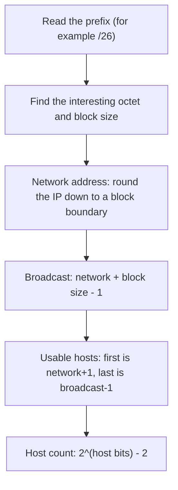

# Lab 3.1: Subnetting Drills

**Month:** 3 (Networking Fundamentals)
**Pattern family:** Networking Fundamentals
**Time budget:** 10 to 12 hours (across many short sessions; subnetting rewards spacing, not cramming)
**Lab attempt floor:** 90 minutes per drill set, with no answers or calculators during the floor
**AI guidance:** AI-free zone. No AI on this lab. The tutor also refuses to confirm your answers and refuses to hand you a subnet calculator. See "Why no calculator" below.
**Prerequisites:** Month 3 README read. You can convert an 8-bit number between binary and decimal by hand. If you cannot, that is the first thing to practice; it is the whole game.

**Recall first, from memory:** in the Month 3 README you met the subnet mask and CIDR notation. In one sentence, what does the `/24` in `192.168.1.0/24` actually tell you about the 32 bits of the address? (Hold your answer; this lab turns that one fact into speed.)

## Why this lab exists

Subnetting is the arithmetic of networks. Every firewall rule, every routing decision, every scan scope, and every network diagram depends on one skill: look at an address and a prefix, and instantly know which network it belongs to, where that network starts and ends, and how many hosts it holds.

People who can do this in their head move fast and make fewer mistakes. People who cannot reach for a calculator on every question. They slow down, and they lose the intuition that catches a bad netmask before it becomes an outage or an exposed host.

This lab drills subnetting until it is automatic. Fifty problems, hand-solved, rising from "fill in the mask" to "carve this block into the subnets I need." You will be slow at problem 5 and fast at problem 50. That gap is the lab.

## Why no calculator (and why the tutor refuses to confirm answers)

A subnet calculator gives you the answer without building the skill. It is the same as a solver handing you a CTF flag without the method. The point of this lab is the muscle, not the output.

So: no `ipcalc`, no `sipcalc`, no web calculator, no spreadsheet that does the mask math, and no asking the tutor "is this right." You check your own work by re-deriving it a second way (Task 4 below), which is itself a skill. If you ask the tutor to confirm an answer, it will decline and point you back to your own check. This is the no-flag rule, applied to arithmetic.

Pencil and paper, or a plain text file you type your working into, is the entire permitted toolset. You do the binary-to-decimal conversion yourself.

## Learning objectives

By the end of this lab, you can:

- **Convert** any IPv4 subnet mask between dotted-decimal, prefix (CIDR), and binary forms from memory.
- **Produce**, given an address and a prefix, the network address, the broadcast address, the usable host range, and the usable host count, by hand, in under a minute.
- **Decide** whether two addresses sit on the same subnet, given a mask, and defend the conclusion.
- **Split** a single address block into equal subnets, or into subnets of required sizes (variable-length subnet masking), with no overlap and no waste you cannot justify.
- **Explain**, not just compute: say why the broadcast address is what it is, and why a /31 and a /32 are special.

## Recognition cue

A later lab gives you a block like `10.10.0.0/22` and asks "is the target in scope." A firewall task asks "write one rule covering these four subnets as tightly as possible." You reach for subnetting arithmetic and do it without breaking stride. This lab forges that reflex.

## The method you are drilling

Every subnetting problem follows the same path. Hold this picture; you are about to walk it by hand many times.


*Notice: the same five steps solve every problem. Speed comes from doing these steps in this order until you stop thinking about them.*

## The new skill: the subnetting method (gradual release)

Subnetting is the new skill of this lab, so you will learn it in three stages before you drill it. First you watch one block fully worked (I do). Then you fill in the blanks on a second block (we do). Then you solve fifty on your own (you do). Type or write everything yourself.

### Stage 1 - Worked example (I do)

Study this fully worked block. It is a teaching example, not one of your fifty graded problems, so nothing here is your answer to copy. Walk every line and match it to the five steps in the diagram above.

**Problem:** for `172.16.20.0/22`, find the network address, the broadcast address, the usable host range, and the usable host count.

1. **Prefix to mask.** `/22` means 22 network bits. The mask is `255.255.252.0`. (The third octet is `11111100` in binary, which is 252.)
2. **Interesting octet and block size.** The prefix splits inside the third octet. The block size is 256 minus 252, which is 4. So networks of this size step by 4 in the third octet: `0, 4, 8, 12, 16, 20, 24, ...`.
3. **Network address.** The address is `172.16.20.0`. The largest multiple of 4 that is not above 20 is 20. So the network is `172.16.20.0`. (It already sits on a boundary.)
4. **Broadcast address.** Network plus block size minus one: the next boundary is `172.16.24.0`, so the broadcast is the address just below it, `172.16.23.255`.
5. **Usable host range.** First usable is network plus one: `172.16.20.1`. Last usable is broadcast minus one: `172.16.23.254`.
6. **Host count.** A `/22` leaves 10 host bits (32 minus 22). That is `2^10` minus 2, which is 1024 minus 2, which is 1022 usable hosts.

That is the whole technique: prefix, block size, network, broadcast, range, count, in that order.

**Checkpoint:** you can point to each of the six lines and say which of the five diagram steps it performs.
**If not:** if step 2 (block size) is unclear, that is the hinge of the whole method. Block size is `256 - (the mask value in the interesting octet)`. Re-read step 1 and step 2 together until the 252 and the 4 connect.

### Stage 2 - Faded practice (we do)

Now you fill in the blanks on a second block. The structure is given; you supply each value, then check it against your own re-derivation. Do not skip to the answer; the point is to run the steps.

**Problem:** for `192.168.1.0/26`, fill in each blank.

```text
Prefix /26  -> mask = 255.255.255.____      # TODO: the fourth octet value
Block size  = 256 - (that octet) = ____     # TODO
Network      = 192.168.1.____               # TODO: round .0 down to a block boundary
Broadcast    = 192.168.1.____               # TODO: network + block size - 1
First usable = 192.168.1.____               # TODO: network + 1
Last usable  = 192.168.1.____               # TODO: broadcast - 1
Host count   = 2^(____ host bits) - 2 = ____ # TODO: 32 - 26 host bits, then the count
```

Work each blank with the Stage 1 method. A `/26` is a common, friendly size; getting it cold here makes the awkward prefixes in Drill Set B easier.

**Checkpoint:** your block size is 64, your broadcast is `192.168.1.63`, and your host count is 62.
**If not:** if the block size is not 64, recompute the fourth-octet mask value for `/26` (it is `11000000`, which is 192) and take `256 - 192`. If the broadcast is off by one, remember it is the address just below the next block boundary (`192.168.1.64`), so `192.168.1.63`.

### Stage 3 - Independent (you do)

No scaffolding now. The fifty drills in Tasks 1 through 3 below are the independent stage. You apply the Stage 1 method to every one, with no worked answer and no calculator. The drills are graded; your job is to run the method until it is automatic.

## Tasks

Do these in order. The drill sets build; do not jump to Task 3 before Task 1 is fast and clean.

### Task 1: Drill Set A, the fundamentals (20 problems, 3 to 4 hours across sessions)

Hand-solve 20 problems covering the core mechanics. Compose your own, or draw from the practice generators in Resources. The requirement is 20 worked problems spanning every item below, not a specific worksheet.

Cover, across the 20:

- Mask conversion: given a prefix, write the dotted-decimal mask and the binary mask; given a dotted-decimal mask, write the prefix. Do this for at least eight prefixes spanning /8 through /30.
- Given an address and a prefix (mix of classful and classless), find: network address, broadcast address, first usable host, last usable host, number of usable hosts.
- Given two addresses and a mask, decide whether they share a subnet and state how you know.

For every problem, show the working, not just the answer. The block-size and bit-boundary reasoning you write down is the part that transfers. A bare answer teaches nothing and cannot be checked.

**Acceptance:** a file `drill-set-a.md` in this lab's directory with 20 numbered problems, each showing the problem, your working, and your answer. Every problem covers at least one bullet above, and all three bullets appear across the set.

### Task 2: Drill Set B, the awkward cases (15 problems, 3 to 4 hours across sessions)

Hand-solve 15 problems that target the boundaries where mistakes cluster:

- Prefixes that do not fall on an octet boundary (/12, /19, /23, /26, /29), where the interesting-octet reasoning matters.
- The edge prefixes: at least one /30, one /31, and one /32. For the /31 and /32, explain in a sentence why the usual "subtract two for network and broadcast" rule does not apply, and what those prefixes are used for.
- "Which subnet does this host fall into" problems, where the address is deep inside a large block and you must find the right boundary.
- At least three problems where you are given a host-count requirement ("I need at least 500 usable hosts") and must choose the smallest prefix that satisfies it, then state the resulting host capacity and the waste.

**Acceptance:** a file `drill-set-b.md` with 15 numbered problems, working shown, including the /30, /31, /32 explanations and at least three host-count-to-prefix problems.

### Task 3: Drill Set C, variable-length subnetting (15 problems, 3 to 4 hours across sessions)

Hand-solve 15 problems that carve a block into subnets. This is the skill you will use when you design the network in Lab 3.2.

- Given a block (for example a /24 or a /22), split it into a stated number of equal subnets. Lay out every resulting subnet's network address, broadcast, and usable range, with no overlap.
- Given a block and a list of different-sized host requirements (for example: one subnet of 100 hosts, one of 50, two of 10), do variable-length subnetting. Allocate largest-first, and produce a non-overlapping address plan with the prefix and range for each subnet, with the leftover space identified.
- For at least two problems, design a layout on purpose, then check it for overlap and for any subnet too small for its requirement.

**Acceptance:** a file `drill-set-c.md` with 15 numbered problems. At least five must be variable-length (different-sized subnets from one block), each with a complete, non-overlapping address plan and the leftover space called out.

### Task 4: Self-verification and the method sheet (90 minutes)

You cannot ask the tutor or a calculator whether your answers are right, so build the habit of checking your own work two ways. Pick ten problems spread across the three sets, and re-derive each answer by a second, independent method. For example: if you found the broadcast by adding the block size and subtracting one, re-derive it by setting all host bits to one in binary, and confirm the two agree. Where the two methods disagree, find your error and fix the original.

Then, from memory with everything closed, write a one-page method sheet: the mask-to-prefix table you have memorized, the steps you take for a "find network and broadcast" problem in order, how you find block size, and the two special-case prefixes. This sheet is your fast path back to fluency on cold-revisit days. The test of a good sheet is that three weeks from now it gets you back to speed in one read.

**Acceptance:** a section "Double-checked" in one of your drill files listing the ten re-derived problems and any errors you caught, plus a file `method-sheet.md` written from memory. Verify the sheet by using it (and nothing else) to solve two fresh problems correctly.

### Task 5: Notebook entry (60 minutes)

Write the lab notebook entry at `.tutor/notebook/lab-01-subnetting-drills.md`. Required sections:

- **Pre-flight check.** No new external tool runs here; the tool is your own head. Instead, document the one mental procedure you are running: the steps of your subnetting method, what inputs it takes, and the failure mode it is prone to (off-by-one on the broadcast, miscounting host bits). Note the authorization scope as "n/a, pure arithmetic on example addresses."
- **Concept naming.** What did this lab teach? It is not "math." Name the network-level concept the arithmetic encodes.
- **Evidence.** Reference your three drill files and the method sheet. Paste two representative worked problems (one from Set B, one variable-length from Set C) in full, working included.
- **Five-question debrief.** All five, with substance. The fifth (what you would do differently cold) should name the specific problem type that is still slow for you.

**Acceptance:** a committed notebook entry that passes the tutor's review. The tutor will not advance you to Lab 3.2 until this entry is present and complete.

## Verification

The lab is complete when:

- `drill-set-a.md`, `drill-set-b.md`, and `drill-set-c.md` together contain 50 worked problems with working shown, covering the required spread.
- The "Double-checked" section shows ten problems re-derived a second way, with any errors corrected.
- `method-sheet.md` exists, was written from memory, and has been proven by solving two fresh problems with it alone.
- `lab-01-subnetting-drills.md` is committed with all sections.

The tutor will spot-check by handing you one fresh address-and-prefix and asking you to produce the network, broadcast, host range, and count from memory, timed. If the muscle is built, this is under a minute and you can explain each step. If you reached for a calculator during the lab, this is where it shows.

**Self-explain:** in one sentence, why does the broadcast address always equal the network address plus the block size minus one?

## Stretch goals

1. Drill for raw speed: time yourself on ten fresh `/X` problems and try to bring your average under 45 seconds each, with working still shown.
2. Subnet a block in IPv6 once (a `/64` out of a `/48`) and write three sentences on what changes and what stays the same versus IPv4.
3. Build your own 8-bit binary-to-decimal flashcard set (the eight bit values 128 down to 1) and get to instant recall, since every subnetting error downstream starts here.
4. Take one Drill Set C plan and write the single tightest firewall-style rule (one CIDR block) that would cover all of its subnets, to feel how subnetting drives access control.

## Troubleshooting

- **You are tempted, around problem 8, to open a calculator "just to check."** That single check undoes the lab. The whole point is that you trust your own arithmetic. Re-derive by a second method instead.
- **The /31 and /32 cases come out wrong.** The "subtract two" reflex does not apply there. A /31 has two addresses and is used for point-to-point links; a /32 is a single host. That is why they are in Set B: get them wrong on paper now, not in a firewall rule later.
- **Variable-length plans overlap or leave gaps.** This usually means you allocated smallest-first. Allocate largest-first, and check that the boundaries of adjacent subnets meet with no overlap and no unaccounted gap.
- **Your answers look random rather than off-by-one.** That is a binary-to-decimal conversion error, not a subnetting error. Drill the 8-bit binary table first; everything downstream depends on it.

## Time budget breakdown

- Task 1 (Drill Set A): 3 to 4 hours
- Task 2 (Drill Set B): 3 to 4 hours
- Task 3 (Drill Set C): 3 to 4 hours
- Task 4 (verification and method sheet): 90 minutes
- Task 5 (notebook): 60 minutes

Total: 10 to 12 hours. Spread across at least five sessions; subnetting consolidates with sleep between sets far better than in one long grind.

## Resources

- _RFC_ RFC 950, *Internet Standard Subnetting Procedure* (the original definition of subnetting; primary source).
- _RFC_ RFC 4632, *Classless Inter-Domain Routing (CIDR)* (how prefixes replaced classful addressing; primary source).
- _RFC_ RFC 3021, *Using 31-Bit Prefixes on IPv4 Point-to-Point Links* (the /31 special case from Set B).
- _RFC_ RFC 1918, *Address Allocation for Private Internets* (the private ranges you will subnet in Lab 3.2).
- A practice-problem generator that gives problems without solving them for you. Use it for the questions only, and leave the answer reveal unclicked until you have solved by hand.

No subnet calculator. The calculator is the thing this lab exists to make unnecessary.
