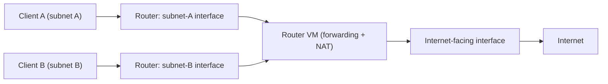

# Lab 3.2: Virtual Network Build

**Month:** 3 (Networking Fundamentals)
**Pattern family:** Networking Fundamentals
**Time budget:** 14 to 16 hours (across multiple sessions; this is the heaviest lab of the month)
**Lab attempt floor:** 90 minutes
**AI guidance:** AI-free zone. No AI on this lab, including no AI help configuring the router or reading the routing table.
**Prerequisites:** Lab 3.1 complete (you subnet by hand now). Your Month 0 VMs boot and snapshot. You can use your hypervisor's network settings (UTM or VirtualBox) at a basic level.

**Recall first, from memory:** in Lab 3.1 you split a block into subnets on paper. In one sentence, how do you tell whether two addresses sit on the same subnet, given a mask? (You will use this constantly here: a client and its gateway must share a subnet, or nothing routes.)

## Why this lab exists

In Lab 3.1 you subnetted on paper. This lab makes the paper real. You will build a small network with two subnets that cannot talk to each other by default. You will place a router VM between them and make traffic flow: subnet A to subnet B, and both out to the internet.

When it works, you understand routing not as a definition but as a thing you configured and watched succeed. When it does not work, the debugging is the lesson. A packet that does not arrive is asking you a question about addresses, masks, gateways, or forwarding. Learning to answer that question is most of network operations.

This lab also produces the backbone of your end-of-month deliverable. The network you build here is the network you will diagram and capture on. Build it deliberately; you will live in it for the rest of the month.

## Scope rule, first, because it is not optional

Everything in this lab happens on **your own machine**, inside your own hypervisor, on virtual networks you create. You configure VMs you own and the virtual switches between them. That is the entire scope. You do not reconfigure your home router, your ISP gateway, your roommate's network, or anything on a shared physical LAN. You do not bridge a lab subnet onto a network you do not own. `SAFETY.md` is explicit: you act only on systems you demonstrably own. A virtual lab on your own host is the cleanest possible example of that. If a step seems to require touching real network infrastructure you do not own, stop. It does not, and you have misread it.

Snapshot every VM before you change its network configuration. A misconfigured interface can cut a VM off. A snapshot makes that a thirty-second recovery instead of a rebuild.

## Learning objectives

By the end of this lab, you can:

- Design a two-subnet addressing plan by hand and justify the prefix choices.
- Configure static addressing on Linux VMs and bring up interfaces on the correct virtual networks.
- Configure a Linux VM as a router: enable IP forwarding, and configure NAT so the private subnets reach the internet through the host.
- Produce and read a routing table, explaining what each route means and which route a given packet would match.
- Prove connectivity at each layer and diagnose a failure to the layer responsible for it (Layer 2 reachability, Layer 3 routing, NAT, or DNS).
- Explain the path of a packet from a host in subnet A to a host on the internet and back, naming every hop and translation.

## Recognition cue

When a later lab or a real job drops you onto a network and asks "why can this host reach that one but not the other," or "where does traffic leave this segment," you reach for the routing table and the addressing plan and read the path. This lab is where building the network yourself turns those questions from intimidating into routine. When a connectivity problem stumps you later, the reflex this lab builds is: test each layer in order, gateway then subnet then internet, and let the failing layer name the bug.

## Topology you are building

You design the exact addresses (apply Lab 3.1), but the shape is fixed:

- **Subnet A:** an internal virtual network, no direct internet, with at least one client VM (your Ubuntu Server, or a second lightweight Linux VM).
- **Subnet B:** a second internal virtual network, separate from A, with at least one client VM.
- **Router VM:** a Linux VM with three interfaces: one on subnet A, one on subnet B, and one that can reach the internet through your host (your hypervisor's NAT or shared-network mode). This VM routes between A and B and NATs both out.


*Notice: the router is the only device on both subnets. Every packet between A and B, or out to the internet, passes through it. That is why forwarding and NAT live on the router and nowhere else.*

Use addresses from the RFC 1918 private ranges. Do not make every prefix a `/24` out of habit. Pick at least one subnet whose prefix you had to think about, so the plan exercises Lab 3.1 rather than muscle-memory defaults.

## The new skill: reading a routing table (gradual release)

The new skill of this lab is reading a routing table: looking at `ip route` output and saying, for any destination, which line a packet matches and where it goes next. You will learn it in three stages on a sample table first, then read your own real table in Task 4. The sample below is invented for teaching; your built network's table (the graded work) is Task 4.

### Stage 1 - Worked example (I do)

Here is a sample `ip route` output from a made-up client whose address is `10.0.1.20/24` with a gateway of `10.0.1.1`. Read each line with the annotation.

```text
default via 10.0.1.1 dev eth0          # catch-all: anything not matched below goes to 10.0.1.1
10.0.1.0/24 dev eth0 scope link        # the local subnet: reach these directly, no gateway needed
```

Now trace two packets by hand:

- A packet to `10.0.1.50`: it matches the local `10.0.1.0/24` line, because `10.0.1.50` is inside that subnet. The client sends it directly on `eth0`, no gateway.
- A packet to `8.8.8.8`: it does not match the local line, so it falls to `default`. The client sends it to the gateway `10.0.1.1`, which routes it onward.

That is the whole reading skill: check the specific routes first, fall to `default` last, and name the next hop.

**Checkpoint:** you can say, for the two packets above, which line each matched and what the next hop is.
**If not:** if both packets seem to match `default`, you skipped the local-subnet check. The most specific matching route wins, and `10.0.1.0/24` is more specific than `default`. Re-check whether the destination is inside `10.0.1.0/24` first.

### Stage 2 - Faded practice (we do)

Here is a second sample, this time the router VM's table. The router sits on two subnets, `10.0.1.0/24` and `10.0.2.0/24`, plus an internet-facing interface. Fill in the trace for each blank.

```text
default via 192.0.2.1 dev eth2         # to the internet, via the upstream gateway
10.0.1.0/24 dev eth0 scope link        # subnet A, reachable directly
10.0.2.0/24 dev eth1 scope link        # subnet B, reachable directly
```

```text
Packet to 10.0.2.30  -> matches the ____ line, leaves by interface ____   # TODO
Packet to 10.0.1.5   -> matches the ____ line, leaves by interface ____   # TODO
Packet to 1.1.1.1    -> matches the ____ line, leaves by interface ____   # TODO
```

Use the Stage 1 rule: most specific match first, `default` last.

**Checkpoint:** `10.0.2.30` leaves by `eth1`, `10.0.1.5` leaves by `eth0`, and `1.1.1.1` leaves by `eth2` (the default route).
**If not:** if `1.1.1.1` seemed to match a local subnet line, check the prefixes: `1.1.1.1` is not inside `10.0.1.0/24` or `10.0.2.0/24`, so only `default` is left. This is exactly how the router decides where to forward.

### Stage 3 - Independent (you do)

No scaffolding now. Task 4 below is the independent stage: you read the real routing tables from the network you actually built, annotate every entry, and trace a real packet end to end. The sample tables above are practice; Task 4 is the graded work.

## Tasks

Do these in order. Snapshot before Task 2.

### Task 1: Address plan on paper (90 minutes)

Before you touch the hypervisor, design the network on paper. Decide each subnet's network address, prefix, and usable range. Assign the router an interface address in each subnet. Assign each client a static address. Write down the default gateway each client will use, and the DNS resolver each will use. Then draw the topology as a sketch: two subnets, the router between them, and the path to the internet.

**Acceptance:** A file `address-plan.md` in this lab's directory with the two subnets fully specified (network, prefix, mask, usable range, broadcast), the router and client addresses assigned, the gateways and resolvers chosen, and a topology sketch (hand-drawn and photographed, or drawn in text). Every address must fall inside its subnet; you will check this against Lab 3.1 arithmetic.

### Task 2: Build the subnets and place the VMs (3 to 4 hours)

In your hypervisor, create the two internal/private virtual networks and the router's internet-facing connection. Attach each VM to the correct virtual networks per your plan. Configure static addressing on the client VMs and on the router's interfaces. Do not enable routing yet; the goal of this task is that each client can reach its own router interface and nothing beyond.

Consult your hypervisor's documentation for how it names network modes (UTM and VirtualBox use different terms for "internal," "host-only," "NAT," and "bridged"; you want the internal/private and NAT modes, never bridged onto a network you do not own).

**Acceptance:** A file `build-log.md` recording, per VM, which virtual networks its interfaces are on and the addresses configured. Evidence that each client can reach its local router interface (a successful ping to the gateway) and cannot yet reach the other subnet. Screenshots or pasted command output.

**Checkpoint:** each client pings its own gateway (the router's interface on that client's subnet) and gets replies, but a ping to the other subnet's client fails.
**If not:** if the gateway ping fails, the client and gateway are not on the same subnet, or the interface is on the wrong virtual network. Re-check the client's address and mask against your plan, and confirm the interface is attached to the right internal network. If the cross-subnet ping unexpectedly succeeds, you may have left forwarding on from a prior attempt; that comes in Task 3, not here.

### Task 3: Turn the middle VM into a router (3 to 4 hours)

Make the router route. Two things must be true. First, the router VM forwards packets between its interfaces (IP forwarding enabled in the kernel). Second, the two clients use the router as their gateway. Then add NAT, so the private subnets reach the internet through the router's internet-facing interface.

Here are orienting commands. You will need more, and you must understand each before you run it. Write the pre-flight entry first.

```
ip addr
ip route
sysctl net.ipv4.ip_forward
```

Read what these report before and after you change anything. The difference between the "before" and "after" routing tables and forwarding state is the heart of the lab.

**Acceptance:** Subnet A's client can ping subnet B's client, and both can reach an internet host by IP. The router's IP forwarding state and NAT configuration are recorded in `build-log.md`, each with a one-line explanation of what it does. You do not paste a turnkey script; you record what you set and why.

**Checkpoint:** from subnet A's client, a ping to subnet B's client succeeds, and a ping to a public IP (such as `1.1.1.1`) succeeds.
**If not:** if A reaches B but neither reaches the internet, NAT is missing or the router's default route is wrong. If A cannot reach B at all, IP forwarding is still off on the router, or a client's default route does not point at the router. Test in order: gateway reachable, other subnet reachable, internet reachable, and fix the first one that fails.

### Task 4: Read and explain the routing table (2 to 3 hours)

On each client and on the router, capture the routing table (`ip route`). For each entry, write what it means: which destination network it matches, what the next hop is, and which interface it leaves by. Then trace the full path of a packet from subnet A's client to a public IP and back. Name the routing decision each device makes. Mark where NAT rewrites the source address. Show how the reply finds its way home.

**Acceptance:** A file `routing-explained.md` containing each device's routing table with every entry annotated, plus the written packet trace from a subnet-A client to the internet and back, naming each hop and the NAT translation. This file feeds directly into the end-of-month diagram.

**Checkpoint:** for every line in every table, you can state which destinations it matches and the next hop, using the reading method you practiced on the sample tables above.
**If not:** if a line's meaning is unclear, map it back to the Stage 1 and Stage 2 samples: it is either a local-subnet line (`scope link`, reach directly), a `default` line (catch-all to a gateway), or a specific network route. If your packet trace cannot explain how the reply gets home, you have not accounted for NAT rewriting the source address on the way out; re-read where NAT sits in the topology diagram.

### Task 5: Break it on purpose, then fix it (90 minutes)

Pick one thing, break it on purpose, predict the symptom, observe, and fix. Choose one: remove a client's default route, disable IP forwarding on the router, or set a client's mask wrong so the router looks off-subnet. Before you break it, write down which connectivity test you expect to fail, and at which layer. Then break it, run the test, and reconcile what happened with your prediction.

**Acceptance:** A section "Failure injection" in `routing-explained.md`: what you broke, your predicted symptom and layer, the observed symptom, and the fix. The value is in predicting correctly before observing.

### Task 6: Notebook entry (60 minutes)

Write the lab notebook entry at `.tutor/notebook/lab-02-virtual-network-build.md`. Required sections:

- **Pre-flight check.** Cover the tools that change network state: `ip` (its `addr` and `route` subcommands), `sysctl` for forwarding, and whatever you use for NAT. For each, write what it does at the kernel and packet level, what it leaves behind (kernel routing and forwarding state, NAT translation tables), what could go wrong (cutting a VM off the network), and the authorization scope. Restate the scope rule in your own words: your own VMs only.
- **Concept naming.** What did this lab teach? It is not "how to use `ip route`."
- **Evidence.** Key excerpts from `address-plan.md`, `build-log.md`, and `routing-explained.md`, including the annotated routing tables and the packet trace.
- **Five-question debrief.** All five, with substance.

**Acceptance:** A committed notebook entry that passes review. The tutor will not advance you to Lab 3.3 until this entry is present and complete.

## Verification

The lab is complete when:

- `address-plan.md` shows a hand-designed, arithmetically correct two-subnet plan.
- The network is actually built: subnet A reaches subnet B, and both reach the internet, with evidence.
- `routing-explained.md` annotates every routing-table entry and contains the end-to-end packet trace and the failure-injection section.
- `lab-02-virtual-network-build.md` is committed with all sections.

The tutor will spot-check by pointing at one routing-table entry and asking you to explain, from memory, what it matches and why it is there, and by asking you to trace a packet from one subnet to the other. If you built and understood the network, this is straightforward.

**Self-explain:** in one sentence, why does subnet A's client need both a correct default route and IP forwarding on the router before it can reach subnet B?

## Stretch goals

1. Add a third subnet and a second router VM, then make the two routers exchange a static route so the new subnet is reachable from the first two.
2. Run `traceroute` from a client to a public IP and confirm the hops match the path you traced in Task 4. Explain any difference.
3. On the router, watch NAT in action: capture a packet leaving the internet-facing interface and confirm its source address is the router's public-facing address, not the client's private one.
4. Write a one-paragraph runbook for a teammate: the three things to check, in order, when a client on this network "cannot reach the internet."

## Troubleshooting

- **A fix to one thing does not restore full connectivity.** Routing needs three things, not one: forwarding on the router, a default route on each client pointing at the router, and NAT for internet access. Test each layer in order (local gateway reachable, other subnet reachable, internet reachable) and fix the first that fails.
- **The VM landed on your real home network.** You chose "bridged" mode. Bridged puts the VM on your physical LAN, which is outside scope and not what you want. Switch to internal or private networks, plus NAT for the internet leg.
- **A client can ping itself but nothing else.** Its subnet mask is wrong, so the gateway looks like it is on a different network and the client never sends to it. This is a Layer 3 addressing error. Re-check the mask against your plan; it is exactly what Lab 3.1 trains you to catch.
- **Ping by IP works but names do not resolve.** That is a resolver (DNS) bug, not a routing bug. Keep the two diagnoses separate. You will see this distinction again, sharply, in Lab 3.3.

## Time budget breakdown

- Task 1 (address plan): 90 minutes
- Task 2 (build subnets, place VMs): 3 to 4 hours
- Task 3 (router and NAT): 3 to 4 hours
- Task 4 (routing table and packet trace): 2 to 3 hours
- Task 5 (failure injection): 90 minutes
- Task 6 (notebook): 60 minutes
- Buffer for hypervisor fiddliness and a VM restore: 2 to 3 hours

Total: 14 to 16 hours, plus float. Expect the router/NAT task to overrun; budget two sessions for it.

## Resources

- _docs_ Your hypervisor's networking documentation (UTM or VirtualBox): the authoritative reference for how it names internal, host-only, NAT, and bridged modes.
- _man_ `man ip` and `man ip-route` (the Linux address and routing tooling; primary source).
- _man_ `man sysctl` (for the IP forwarding toggle).
- _RFC_ RFC 1918, *Address Allocation for Private Internets* (the ranges your subnets must use).
- _RFC_ RFC 2663, *IP Network Address Translator (NAT) Terminology and Considerations* (what NAT is doing on your router; primary source).
- Your own Lab 3.1 drill files and method sheet, for the addressing arithmetic.

No walkthrough videos. A configuration you copied from a video and did not understand will fail you in Task 4 and again under the tutor's spot-check.
