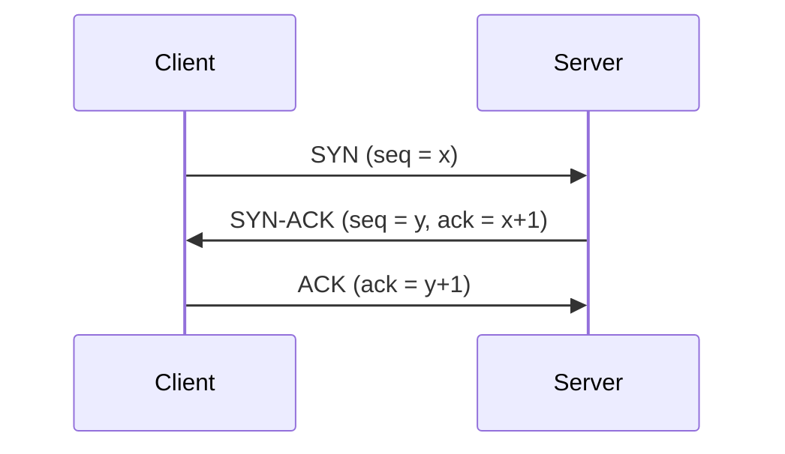

# Lab 3.3: Protocol Captures

**Month:** 3 (Networking Fundamentals)
**Pattern family:** Networking Fundamentals
**Time budget:** 10 to 12 hours (across multiple sessions)
**Lab attempt floor:** 90 minutes
**AI guidance:** AI-free zone. No AI on this lab, including no pasting of capture contents into an AI to "explain the packet." You read the packet yourself, against the RFC and the Wireshark docs.
**Prerequisites:** Lab 3.2 complete (you have a lab network to capture on). Wireshark installed (Month 0). You can name the OSI layer each of DHCP, DNS, and TCP rides on (Month 3 README).

**Recall first, from memory:** in Lab 3.2 you traced a packet from one subnet to the internet and back. In one sentence, where on that path does NAT rewrite the packet, and which field does it change? (You will now see real fields like this one in a live capture instead of on paper.)

## Why this lab exists

You have read what DHCP, DNS, and TCP do. This lab is where you watch them do it, byte by byte, in your own captures. Reading "the three-way handshake is SYN, SYN-ACK, ACK" is one thing. Pointing at the SYN packet in Wireshark, reading its sequence number, and seeing the matching acknowledgment number in the SYN-ACK is another. That is the difference between knowing the words and reading the wire.

Month 4 hands you hostile captures to analyze. You cannot find the one strange packet in a thousand if you have never dissected a normal one. This lab dissects three normal exchanges so the abnormal ones stand out later.

The annotated captures you produce here are half of your end-of-month deliverable. Treat them as portfolio artifacts, not throwaways.

## Scope rule, first, because it is not optional

You capture **only your own traffic on your own lab network.** Concretely: traffic you generate yourself, on the virtual network you built in Lab 3.2, or on your own machine's loopback and your own VMs. That is the entire scope.

You do **not** capture on a network you do not own. Not coffee-shop, office, or campus Wi-Fi. Not your home network if others share it. Not any shared or public LAN. Capturing on a network you do not control intercepts other people's traffic. That is a wiretap-style legal problem, separate from the CFAA, and `SAFETY.md`'s rule (own systems and authorized targets only) is absolute here. There is a second reason, from `AI-ETHICS.md`: real-network captures contain other people's data and must never be pasted into any AI service. You sidestep both problems by capturing only traffic you generated yourself, in your own lab. Generate the DHCP lease, the DNS query, and the TCP connection yourself, on purpose, and capture that.

If you are unsure whether a network is "yours" to capture on, it is not. Use your Lab 3.2 virtual network, where the answer is unambiguous.

## Learning objectives

By the end of this lab, you can:

- Capture traffic in Wireshark on a specific interface, using a capture or display filter to isolate one protocol exchange.
- Walk a DHCP lease (the DORA exchange) packet by packet and identify, in the Discover/Offer/Request/Acknowledge messages, the offered address, mask, gateway, DNS servers, and lease time.
- Walk a DNS resolution and identify the query, the question section, the response, the answer records, and the record types involved.
- Walk a TCP three-way handshake and read the flags, the sequence and acknowledgment numbers, and the negotiated options across SYN, SYN-ACK, and ACK.
- Annotate a single packet field by field, mapping each field to the OSI layer it belongs to and to the RFC that defines it.
- Reconcile a prediction (what you expected a field to contain) with the captured reality, and explain any surprise.

## Recognition cue

When a later month hands you a capture and asks "what is happening here" or "which packet is the anomaly," you reach for the field-by-field reading habit this lab builds: name the protocol, name the layer, read the fields against what a normal exchange looks like. You cannot spot the abnormal packet if you have never dissected a normal one. This lab is where dissecting the normal case becomes a reflex, so the hostile captures in Month 4 have a baseline to stand out against.

## The shape of the TCP handshake

One of your three captures is a TCP three-way handshake. Hold this picture before you capture it, so you know what you are looking for.


*Notice: each side's acknowledgment number is the other side's sequence number plus one. That plus-one relationship is the thing to verify in your capture, not just memorize.*

## The new skill: field-by-field annotation (gradual release)

The new skill of this lab is reading one packet field by field: naming each field, its value, its meaning, its OSI layer, and the RFC that defines it. You will learn it on a teaching packet first (an ICMP echo, the packet a `ping` sends), then do it yourself on the three graded protocols. ICMP is not one of your three graded captures, so nothing here is your answer to copy.

### Stage 1 - Worked example (I do)

Generate one ICMP packet on your own lab network: `ping -c 1 <your-router-IP>` from a lab client, while capturing. Click the echo request in Wireshark and expand its layers. Here is the same packet annotated the way your graded annotations must look.

| Field | Value (example) | Meaning | OSI layer | Defined by |
| --- | --- | --- | --- | --- |
| Destination MAC | `52:54:00:aa:bb:cc` | the next hop's hardware address on this segment | Layer 2 | Ethernet (RFC 894) |
| EtherType | `0x0800` | says the payload is IPv4 | Layer 2 | Ethernet (RFC 894) |
| Source IP | `10.0.1.20` | who sent the packet | Layer 3 | IP (RFC 791) |
| Protocol | `1` (ICMP) | what is inside the IP payload | Layer 3 | IP (RFC 791) |
| ICMP Type | `8` (echo request) | this is a ping request, not a reply | Layer 3 | ICMP (RFC 792) |

Read across one row: the field, what it holds, what it means, where it lives in the layer model, and the document that defines it. That is exactly the table you will build for one packet in each of your three graded captures.

**Checkpoint:** for the ICMP packet you captured, you can read at least one field from each of Layer 2 and Layer 3 and explain it in the five columns above.
**If not:** if you cannot find the layers, you are looking at the packet list, not the packet detail. Click the single packet, then expand the tree in the middle pane (Frame, Ethernet, Internet Protocol, ICMP). Each expandable section is one layer.

### Stage 2 - Faded practice (we do)

Now capture the ICMP echo *reply* (the second packet of the same ping) and fill in this skeleton yourself. The structure is given; you supply each value from your own capture.

```text
ICMP echo reply, field by field:
  Source IP    = ____   meaning: ____   layer: Layer 3   RFC 791   # TODO
  ICMP Type    = ____   meaning: ____   layer: Layer 3   RFC 792   # TODO (hint: a reply is not type 8)
  ICMP id/seq  = ____   meaning: matches the request, so you can pair them   # TODO
```

You are filling the same five-column thinking from Stage 1, now on a packet you read yourself.

**Checkpoint:** your echo reply shows ICMP Type `0`, and its id and sequence numbers match the request you captured in Stage 1.
**If not:** if the type is not `0`, you annotated the request again, not the reply. The reply travels from the router back to your client, so its source IP is the router's. If the id and sequence do not match, you captured two different pings; capture one `ping -c 1` cleanly and read both its packets.

### Stage 3 - Independent (you do)

No scaffolding now. Tasks 2, 3, and 4 below are the independent stage. For each of DHCP, DNS, and TCP, you capture your own exchange and build the same field-by-field annotation table you saw in Stage 1, with no worked answer. The ICMP example was practice; the three graded protocols are yours to read.

## Tasks

Do these in order. Write the Wireshark pre-flight entry before your first capture.

### Task 1: Wireshark orientation and a clean capture surface (90 minutes)

Before capturing anything meaningful, learn the tool on your own traffic. Identify which interface corresponds to your Lab 3.2 lab network (or loopback, for traffic you generate locally). Learn the difference between a capture filter (applied before capture, BPF syntax) and a display filter (applied after, Wireshark syntax), and practice narrowing a busy capture to a single protocol.

Orienting moves (understand each before using it):

```
# In Wireshark: Capture > Options, to choose the interface
# Display filter examples to read traffic by protocol:
#   dhcp
#   dns
#   tcp.flags.syn == 1
```

**Acceptance:** A file `capture-setup.md` in this lab's directory naming the interface you will capture on and why it is the correct one for your own lab traffic, and demonstrating (with a screenshot) that you can apply a display filter to isolate one protocol. State, in one line, the scope basis: this is your own lab traffic.

### Task 2: Capture and annotate a DHCP lease (2 to 3 hours)

Generate a DHCP lease on your own lab network and capture the full DORA exchange. The cleanest way is to release and renew a lease on one of your own VMs. You can also boot a VM set to DHCP on a lab subnet that has a DHCP server, while capturing on that subnet. Capture all four messages: Discover, Offer, Request, Acknowledge.

Then annotate **one** representative packet from this exchange, field by field. The Offer or the Acknowledge is richest. For each significant field, record five things: the field name, its value in your capture, what it means, the OSI layer it belongs to, and the RFC section that defines it. Predict each field's meaning before you read it, and note where you were surprised.

**Acceptance:** A saved capture file (`dhcp.pcapng`) limited to the DORA exchange, plus a file `dhcp-annotation.md` with the four messages identified in order and one packet annotated field by field as specified, including the address, mask, gateway, DNS servers, and lease time you can read from the exchange.

**Checkpoint:** your capture, filtered with `dhcp`, shows all four messages in order: Discover, Offer, Request, Acknowledge.
**If not:** if you are missing the Discover, you triggered the lease before the capture was running. Start the capture first, then release and renew. If you see no DHCP at all, your client is on a static address (no lease to capture); put it on DHCP for one subnet, or capture on the subnet whose server actually hands out leases.

### Task 3: Capture and annotate a DNS resolution (2 to 3 hours)

Generate a DNS query yourself (resolve a hostname from one of your lab VMs) and capture the query and its response. Identify the query packet and the response packet, the question section, the answer section, and the record types present.

Annotate **one** packet field by field, the same way as Task 2: field name, value, meaning, OSI layer, defining RFC section. The response is the richer packet to annotate. Then note which transport DNS used here (usually UDP), and what would change if the response were large enough to need TCP.

**Acceptance:** A saved capture (`dns.pcapng`) limited to your query and its response, plus a file `dns-annotation.md` with the query and response identified, the record type(s) named, and one packet annotated field by field. Include a sentence on the transport used and when DNS switches to TCP.

### Task 4: Capture and annotate a TCP three-way handshake (2 to 3 hours)

Generate a TCP connection yourself and capture the opening handshake. For example, connect from one lab VM to a service on another, or to a service you run locally. Isolate the three packets: SYN, SYN-ACK, ACK.

Annotate the handshake across the three packets. Read and explain the SYN, ACK, and other flags. Show how the acknowledgment number in the SYN-ACK relates to the SYN's sequence number (the plus-one relationship from the diagram above). Name at least two TCP options negotiated, such as MSS or window scaling. Then annotate **one** packet (the SYN or SYN-ACK) field by field, as in the prior tasks. Finally, in one sentence, describe how this connection would be closed (the orderly four-way close), even though you only capture the open.

**Acceptance:** A saved capture (`tcp-handshake.pcapng`) limited to the three handshake packets, plus a file `tcp-annotation.md` with the three packets identified, the flag/sequence/acknowledgment relationship explained, at least two options named, one packet annotated field by field, and a one-sentence description of the close.

**Checkpoint:** in your capture, the SYN-ACK's acknowledgment number equals the SYN's sequence number plus one, matching the diagram above.
**If not:** if the numbers do not line up, confirm you captured all three packets of one connection, not packets from two different connections. Wireshark shows relative sequence numbers by default (starting at 0), which is fine; the plus-one relationship still holds. If you see many SYNs, narrow the display filter to one source port.

### Task 5: Cross-protocol reconciliation (60 minutes)

Step back from the individual packets and connect them. In writing, answer:

- In your three captures, find places where the same information shows up at more than one layer. For example, a MAC address at Layer 2 and the device it belongs to, or a port number in TCP and the service it implies. Map two such cross-layer relationships.
- Your DHCP exchange told a client which DNS resolver to use. Did your DNS query in Task 3 go to that resolver? If not, explain why. This is a real and instructive difference on many setups.
- Pick one field, in any of the three captures, whose value surprised you, and explain what you learned by chasing down why it was what it was.

**Acceptance:** A file `reconciliation.md` answering the three prompts, with specific references to packets in your captures (frame numbers are fine).

### Task 6: Notebook entry (60 minutes)

Write the lab notebook entry at `.tutor/notebook/lab-03-protocol-captures.md`. Required sections:

- **Pre-flight check.** Cover Wireshark (and `tcpdump` if you used it). Write what packet capture does at the wire level: it puts the interface in a mode that copies frames to your analysis tool. Write what it leaves behind: the saved capture files on your disk, which may contain sensitive data. Write what could go wrong: capturing traffic that is not yours. Then restate the scope rule in your own words (your own lab traffic only) and say why your captures satisfy it.
- **Concept naming.** What did this lab teach? It is not "how to use Wireshark."
- **Evidence.** The three capture files referenced, and the key annotations pasted or excerpted.
- **Five-question debrief.** All five, with substance. The third question (what would dominate at scale) should grapple with reading one normal exchange versus finding one anomaly in a million packets.

**Acceptance:** A committed notebook entry that passes review. The tutor will not advance you to Lab 3.4 until this entry is present and complete.

## Verification

The lab is complete when:

- Three capture files exist (`dhcp.pcapng`, `dns.pcapng`, `tcp-handshake.pcapng`), each scoped to its exchange, captured from your own lab traffic.
- `dhcp-annotation.md`, `dns-annotation.md`, and `tcp-annotation.md` each identify the full exchange and annotate one packet field by field with field, value, meaning, OSI layer, and defining RFC.
- `reconciliation.md` answers the three cross-protocol prompts with specific packet references.
- `lab-03-protocol-captures.md` is committed with all sections.

The tutor will spot-check by pointing at one field in one of your annotations and asking you to explain it from memory, including which layer it belongs to and what would change if it held a different value. If you read the packet yourself, this is easy; if you pasted it into something that explained it for you, it is not.

**Self-explain:** in one sentence, why does annotating a normal exchange now make a hostile capture in Month 4 easier to read?

## Stretch goals

1. Capture the orderly four-way close of a TCP connection (FIN, ACK, FIN, ACK) and annotate it, to complete the picture the handshake started.
2. Force DNS over TCP (query a record large enough to exceed the UDP limit, or use `dig +tcp`) and capture it. Compare it to your UDP capture and explain what changed.
3. Capture an ARP request and reply on your lab segment, and annotate how the request asks "who has this IP" and the reply binds it to a MAC.
4. Open your DHCP capture's Acknowledge packet and read every option field, not just the five required values. Note one option you did not expect and look up what it configures.

## Troubleshooting

- **You capture on the wrong interface and see nothing, or a flood of unrelated traffic.** Confirm the interface against your Lab 3.2 topology, and use a display filter to isolate the protocol. Capturing the right exchange cleanly is itself a skill.
- **The DHCP exchange is missing packets.** It is brief and easy to miss. Start the capture first, then trigger the lease (release and renew, or boot the client). If you trigger first, you miss the Discover.
- **Your filter syntax is rejected.** You are mixing a capture filter and a display filter. They use different grammars (BPF for capture, Wireshark's own for display). Task 1 exists so this is settled before it costs you a capture.
- **You are tempted to paste a confusing packet into an AI to "just explain it."** That is the exact temptation this AI-free month exists to resist, and it is doubly forbidden here because real-traffic captures can contain other people's data. Read the field against the RFC and the Wireshark docs instead. That is the skill Month 4 will test.

## Time budget breakdown

- Task 1 (Wireshark orientation): 90 minutes
- Task 2 (DHCP capture and annotation): 2 to 3 hours
- Task 3 (DNS capture and annotation): 2 to 3 hours
- Task 4 (TCP handshake capture and annotation): 2 to 3 hours
- Task 5 (reconciliation): 60 minutes
- Task 6 (notebook): 60 minutes

Total: 10 to 12 hours.

## Resources

- _docs_ The Wireshark User's Guide, especially the chapters on capturing and on display filters (primary source).
- _RFC_ RFC 2131, *Dynamic Host Configuration Protocol* (the DORA exchange and the option fields; primary source for Task 2).
- _RFC_ RFC 1035, *Domain Names: Implementation and Specification* (the DNS message format and record types; primary source for Task 3).
- _RFC_ RFC 9293, *Transmission Control Protocol (TCP)* (the current TCP specification: flags, sequence numbers, the handshake and close; primary source for Task 4).
- _man_ `man tcpdump` and `man pcap-filter`, if you use tcpdump or want the BPF capture-filter grammar.
- Your own Lab 3.2 topology notes, so you capture on the correct lab interface.

No "Wireshark tutorial" videos that narrate someone else's capture. The point is that you generate and read your own.
