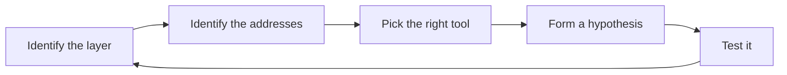

# Lab 3.4: TryHackMe Networking

**Month:** 3 (Networking Fundamentals)
**Pattern family:** Networking Fundamentals
**Time budget:** 10 to 12 hours (across multiple sessions)
**Lab attempt floor:** 45 minutes per task or room you get stuck on, no walkthroughs during the floor
**AI guidance:** AI-free zone. No AI on this lab. No external room walkthroughs during the floor.
**Prerequisites:** Labs 3.1, 3.2, and 3.3 complete. A TryHackMe account (free) from Month 0.

**Recall first, from memory:** in Lab 3.3 you read a packet field by field and named the OSI layer each field belongs to. As you start a new platform, hold that layer-naming habit; this path will ask you to place protocols at their layer, and your own captures are your ground truth.

## Why this lab exists

You have built the network model from first principles: subnetting by hand, a routed network of your own, your own packets dissected. This lab consolidates that model against a structured outside curriculum and a different teaching voice. TryHackMe's "Network Fundamentals" path walks the same ground you covered (the OSI and TCP/IP models, addressing, common protocols, basic network tooling) with interactive exercises and in-browser machines. Seeing the same concepts framed by someone else, with hands-on tasks attached, catches gaps your own study missed and turns recognition into recall.

This lab also reinforces the course's most-tested discipline on a new platform: the tutor never confirms answers or flags. TryHackMe tasks have answer fields. You fill them on the platform, not by asking the tutor.

## Scope rule

TryHackMe authorizes the activity inside its rooms through its terms of use. The in-browser or VPN-attached machines are the legal targets for those rooms. That is your authorization basis, and you should be able to state it; your notebook pre-flight asks for it. The scope is the room's own machines, reached the way the room intends. You do not point room tooling at anything outside the room. You do not bring techniques from a room against any system you do not own. `SAFETY.md`'s rule holds on every platform: own systems or explicitly authorized targets only. A TryHackMe room is authorized only for what the room itself sets up.

## Learning objectives

By the end of this lab, you can:

- Place each protocol and concept the path covers at its correct OSI and TCP/IP layer, and reconcile the path's framing with the model you built in Labs 3.1 to 3.3.
- Use the path's basic networking tools (the ping, traceroute, and similar utilities the rooms introduce) and explain what each sends on the wire.
- Complete interactive networking tasks by reasoning from the model, not by searching for the answer.
- Write a methodology note for a networking task that teaches the approach without leaking the answer.
- Apply the no-answer-confirmation discipline as a habit on a new platform.

## Recognition cue

When a later room or a real engagement drops you into a network you must map (what is the addressing, where is the gateway, which services are reachable), you reach for the orientation loop this path drills. This lab rehearses that loop on guided terrain before Month 4 makes it adversarial.


*Notice: it is a loop, not a checklist. A failed test sends you back to re-check the layer or the addresses, not to guess.*

## The new skill: the answer-free methodology note (gradual release)

The new skill of this lab is writing a methodology note that teaches a method without leaking an answer. It is a real professional habit: a teammate should learn your approach from the note, but should still have to do the thinking themselves. You will learn it on a generic sample task first, then write three for real in Task 3. The sample below is invented, not a room, so it leaks nothing.

### Stage 1 - Worked example (I do)

Suppose a generic task asks: "find which service is listening on an unusual port of a host you are authorized to probe." Here is a method note done two ways, so you can see the line.

**Leaky (do not write this):** "Run `nmap -p 31337 10.10.10.5`, see it is `Elasticsearch`, the answer is `elasticsearch`." This hands over the target, the port, and the answer. A reader learns nothing and skips the thinking.

**Answer-free (write this):** "When a port is open but the service is not obvious, I move from 'is it open' to 'what is it.' I reach for a service- and version-detection scan rather than a plain port check, because the banner or version string usually names the software. If that is inconclusive, I connect to the port directly and read the first response it sends. The category of technique is service identification, not just port discovery."

Notice the difference: the answer-free note names the reasoning and the category of technique. It does not name the host, the port, or the answer.

**Checkpoint:** you can state, in your own words, the one rule that separates the two notes above.
**If not:** the rule is this: a method note explains *how you think*, never *the specific answer or input*. If a teammate could submit a flag straight from your note without reasoning, it leaks. Re-read the two versions and find the exact words that gave the answer away.

### Stage 2 - Faded practice (we do)

Here is a second generic sample task: "a web page behaves differently when you change one value in the request." Fill in an answer-free method note by completing each line. Keep it about method, not answers.

```text
What I noticed:   ____   # TODO: the observation, stated generally (no specific value)
What that suggests: ____ # TODO: the category of behavior it hints at
What I tried first that did NOT work: ____   # TODO
The category of technique that resolved it: ____   # TODO: name the class, not the payload
```

A good fill names a class of technique (for example "input handling," "access control") without naming the exact input that wins.

**Checkpoint:** none of your four lines contains a specific answer, payload, or flag; each names reasoning or a category.
**If not:** if any line names the exact value that solves it, you crossed back into leaky territory. Replace that value with the category it belongs to (what *kind* of thing it was, and why you tried it).

### Stage 3 - Independent (you do)

No scaffolding now. Task 3 below is the independent stage: you write three answer-free method notes for three real reasoning tasks from the path. The samples above were practice; the three real notes are the graded work, and they must teach a method while leaking nothing.

## Tasks

Do these in order. The floor applies per task you get stuck on: sit with it for 45 minutes before consulting anything external, and never read a walkthrough that hands you the answer.

### Task 1: Complete the Network Fundamentals path (6 to 8 hours)

Work through TryHackMe's "Network Fundamentals" path end to end, completing the rooms and their interactive tasks. Before each room, write one line predicting what concept it will cover, and how it maps to what you built in Labs 3.1 to 3.3. After each room, write one line: did the prediction hold, and what did the room add or correct?

Solve the tasks yourself. When a room's in-browser machine or attached tooling is involved, reason about what it is doing rather than copying commands blindly. This is the pre-flight habit, applied room by room.

**Acceptance:** The path shows complete on the platform (the platform's own progress page is your evidence; a screenshot of the completed path suffices), plus a file `path-notes.md` in this lab's directory with your one-line before/after prediction for each room. Do not paste room answers or flags anywhere in your repo or to the tutor.

**Checkpoint:** the path's progress page shows every room complete, and `path-notes.md` has a before-and-after line for each room.
**If not:** if a room will not mark complete, you likely skipped one interactive task inside it; revisit the room and find the unanswered field. If your prediction notes feel empty, you clicked through without engaging; the prediction line is what converts clicking into learning, so write it before you open each room, not after.

### Task 2: Reconcile the path with your own build (90 minutes)

The path teaches the same model you built, but the framing will differ in places. It may assign a protocol to a different layer, introduce a different tool for a task, or explain addressing differently. Write a reconciliation. List three places where the path's framing matched your Lab 3.1 to 3.3 understanding and reinforced it. List at least two places where the path framed something differently than you had, and resolve each: who is right, and why? Use a primary source where the layer model is involved.

**Acceptance:** A file `reconciliation.md` with three reinforcements and at least two differences resolved. Each difference cites how you settled it (an RFC, the OSI model itself, or your own captures from Lab 3.3).

### Task 3: Methodology notes, not answers (90 minutes)

Pick three tasks in the path that required real reasoning or tool use, not the read-and-fill-in-a-word kind. For each, write a methodology note. The note describes how you approached the task, what you observed, what you tried that did not work, and which category of technique resolved it. It does **not** contain the answer, or the specific input that lets someone skip the thinking. Write each note as if for a teammate facing a similar-but-different task next week.

**Acceptance:** A file `methodology-notes.md` with three answer-free method notes. The tutor will check that these teach a method and do not leak an answer.

### Task 4: Notebook entry (60 minutes)

Write the lab notebook entry at `.tutor/notebook/lab-04-tryhackme-networking.md`. Required sections:

- **Pre-flight check.** Cover any new tool the path introduced, such as ping or traceroute. Write what it sends on the wire, what it leaves behind, and what could go wrong. State the authorization scope: TryHackMe's terms authorize this activity inside the room, so that is your legal basis.
- **Concept naming.** What did this lab teach? Frame it as consolidation: which part of your own-built model this path hardened, and which gap it exposed.
- **Evidence.** Your completed-path screenshot, and links to `path-notes.md`, `reconciliation.md`, and `methodology-notes.md`. No answers or flags.
- **Five-question debrief.** All five, with substance.

**Acceptance:** A committed notebook entry that passes review. No room answers or flags anywhere in it. This is the last lab of the month; this entry, plus the deliverable, gates advancement to Month 4.

## Verification

The lab is complete when:

- The Network Fundamentals path shows complete on TryHackMe.
- `path-notes.md` has a before/after prediction line per room.
- `reconciliation.md` resolves at least two framing differences against primary sources.
- `methodology-notes.md` has three answer-free method notes.
- `lab-04-tryhackme-networking.md` is committed with all sections and no answers or flags.

The tutor will spot-check by naming one concept from the path and asking you to place it at its correct layer and explain it from memory, then asking how it connected to your own Lab 3.3 captures. If you reasoned through the path rather than clicking through it, this is easy.

**Self-explain:** in one sentence, why does an answer-free method note help a teammate more than a note that just states the answer?

## Stretch goals

1. After the path, pick one concept it framed differently from your own build and write a short note settling it against the RFC, to extend the Task 2 habit.
2. Take one method note from Task 3 and rewrite it for a complete beginner, keeping it answer-free, to test whether your method survives a simpler audience.
3. Map the path's room order against the Month 3 README's Core Concepts list, and note any concept the path covered that the README did not, or vice versa.

## The no-flag rule, stated once more

Do not paste a room answer or a flag to the tutor and ask whether it is correct. The tutor will refuse, every time, and direct you to submit it on the platform. If an answer is wrong and you are stuck, that is what the hint ladder is for. This rule is identical to the one you met on picoCTF in Month 1; it applies on every platform, and TryHackMe is no exception.

## Troubleshooting

- **You finished a room but retained nothing.** The interactive tasks make it easy to click through and fill answer fields on autopilot. The before-and-after prediction in Task 1 and the method notes in Task 3 are what convert clicking into learning. If a room felt effortless, your prediction note should still show what it confirmed.
- **The path's layer assignment seems to contradict what you learned.** Do not resolve it by deciding the path "must be right." Some popular learning material simplifies the layer model. Settle it against the RFC or the OSI model itself; that is the point of Task 2.
- **A room's attached machine tempts you to run tooling with no pre-flight.** The room makes it convenient, but hold the pre-flight discipline anyway. It is the habit Month 4 onward depends on.

## Time budget breakdown

- Task 1 (complete the path): 6 to 8 hours
- Task 2 (reconciliation): 90 minutes
- Task 3 (methodology notes): 90 minutes
- Task 4 (notebook): 60 minutes

Total: 9 to 11 hours.

## Resources

- The TryHackMe "Network Fundamentals" path itself, including each room's own learning material (this teaches concepts and technique, not answers to skip; using it is in bounds).
- _RFC_ RFC 1122, *Requirements for Internet Hosts: Communication Layers* (the authoritative four-layer TCP/IP model, for settling layer-framing disputes in Task 2; primary source).
- Your own Lab 3.1 to 3.3 artifacts (drill files, routing notes, packet annotations), which are your ground truth for the reconciliation.

No room walkthroughs. The platform judges your answers; you supply the reasoning.
