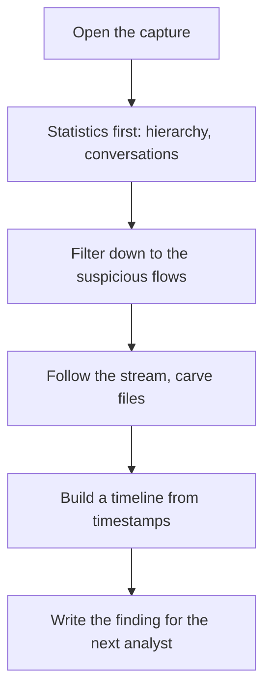

# Month 4: Network Tools and Packet Analysis

**Pattern family:** Network analysis and forensics · **Time budget:** 45 hours · **AI guidance:** AI-free zone. No AI on any lab this month. This is the **last** AI-free month; AI augmentation unlocks in Month 5. · **Prerequisites:** Month 3 done. You can read an IP header field by field, explain the three-way handshake, subnet without a calculator, and reason about ARP, ICMP, DNS, and DHCP. In Month 3 Lab 3.3 you already captured your own DHCP lease, DNS query, and TCP handshake in Wireshark.

## Overview

Month 3 taught you what the protocols are. This month teaches you to read traffic. That is a different skill. Knowing the shape of a TCP header does not mean you can look at four thousand packets and tell a story. The story sounds like this: "this host was scanned at 14:02, then it phoned home to an attacker's server every sixty seconds, then it leaked a file over DNS at 14:40." Reading that story out of raw packets is the daily job of a SOC analyst, an incident responder, and a network forensics examiner. You build the skill only one way. You read real traffic until the patterns jump out at you.

You also stop treating your tools as black boxes. In Month 3 you used Wireshark to look at single packets. This month you use it in depth. You will use display filters (which are regex, the same skill you built in Month 2), the Statistics menus, Follow Stream, and protocol decoders. You will learn **tcpdump** (a command-line capture tool) for the times you are on a remote machine with no screen. You will learn **nmap** (a scanner) well enough to explain what each scan type puts on the wire, and you run it only against your own lab. You will learn what **netcat** and **traceroute** actually send. By the end you can take a capture you have never seen and tell the next shift what happened in it.

This is the last AI-free month by design. The captures and logs are about to get large. Month 5 hands you Python to read them faster. But you automate from a position of strength: you spend this month reading by hand, so you know what the traffic means before you let a machine read it for you. That is the whole payoff of the AI-free zone. You will be able to tell when an automated tool, or an AI, is wrong about a packet, because you have read enough packets to know.

Here is the workflow this month installs. Memorize the shape, not the words. You will run this loop on every capture you ever open:

*Notice: you never start by scrolling the packet list top to bottom. You start with statistics, then narrow. Top-down, every time.*

## Warm-Up: Retrieve Before You Begin

Before reading on, answer these from memory. No peeking at earlier months. This pulls forward the prior skills this month builds on.

1. From Month 3: what are the three packets of the TCP three-way handshake, and which side sends each?
2. From Month 3: what is the difference between a TCP port being closed and a port being filtered by a firewall? What does the host send back in each case?
3. From Month 2: the Wireshark `matches` operator takes a regex. Write a regex that matches any string containing the word `login`.
4. From Month 3: in your own words, what is the job of DNS, and why is it interesting to an attacker who wants to hide?

Check your recall

1. SYN (client to server), SYN-ACK (server to client), ACK (client to server). You captured this yourself in Month 3 Lab 3.3.
2. Closed: the host replied and refused, usually with a TCP reset (RST). Filtered: no useful reply came back at all, usually a firewall silently dropping the probe. From Month 3 port states. You will see both on the wire in Lab 4.2.
3. Something like `login` on its own matches any string that contains it; `.*login.*` is the explicit version. Regex is your Month 2 skill, and display filters reuse it directly.
4. DNS turns names (like `example.com`) into IP addresses. It is interesting to an attacker because DNS traffic is everywhere and often unwatched, so it makes a quiet channel for phoning home or sneaking data out. From Month 3.

## Learning objectives

By the end of this month you can:

- **Analyze** an unfamiliar packet capture and **produce** a written timeline of what happened, addressed to the next analyst on shift.
- **Build** Wireshark display filters, including regex matches, that isolate one conversation, one protocol, or one indicator from a noisy capture.
- **Explain** what `nmap` puts on the wire for each major scan type (connect, SYN, UDP, service detection) at the packet level.
- **Reconcile** two scans of the same host run with different timing templates, citing what changed in your own captures.
- **Capture** and read traffic from the command line with `tcpdump` using BPF filters, and **explain** when you reach for it instead of Wireshark.
- **Explain** the mechanics of `traceroute` and `netcat` at the packet level: what each sends, what it expects back, and what it leaves on the target.
- **Identify** common malicious patterns in a capture: port scans, beaconing, credential theft over cleartext, suspicious DNS, and data exfiltration.
- **Defend** the scope rule for active scanning: you scan only your own lab, and you can say why in CFAA terms.

## Recognition cue

When a later month or a real shift hands you a `.pcap` file and asks "what happened here," you reach for the reading habit this month builds. Open it, get the high-level statistics first, filter down to the interesting conversations, follow the streams, and write the timeline. When a tool gives you a result you did not expect, you reach for a capture to see what actually went over the wire. That instinct, dropping to the packet level when something is unclear, is what this month installs.

## Core concepts to internalize

Read these to understand the labs, not to memorize them. Each chunk is one idea.

### Wireshark in depth

In Month 3 you used Wireshark to read one packet at a time. Now you read whole captures. The key split to learn first is **capture filters** versus **display filters**. A **capture filter** is applied before capture; it decides what gets recorded at all and uses BPF syntax (the same syntax as `tcpdump`). A **display filter** is applied after capture; it decides what you see out of what was already recorded, and it supports regex through the `matches` operator. You will lean hard on the Statistics menus: **Protocol Hierarchy** (what protocols are in the capture and in what proportion), **Conversations** (who talked to whom), **Endpoints** (every host present), and the **IO Graph** (traffic over time). **Follow Stream** rebuilds a whole TCP, UDP, or HTTP conversation into readable text. **Export Objects** carves files back out of the traffic. **Protocol decoders** are how Wireshark turns raw bytes into named fields; it guesses a protocol mainly from the port (traffic on port 80 is decoded as HTTP), and you can override that guess with "Decode As" when the guess is wrong. **Coloring rules** tint packets by type so problems (resets, retransmissions) catch your eye in a busy list.

> **Common misconception.** "A capture filter and a display filter are basically the same thing; the box is just in a different place."
> **Reality.** They run at different times and one is destructive. A capture filter throws packets away before they are ever saved, so a too-narrow capture filter loses evidence you can never get back. A display filter only hides packets you still have; clear it and they reappear. When in doubt, capture broadly and filter on display.

### Display filters as regex

A display filter is a small query language. You name a field, an operator, and a value. Fields look like `http.host`, `dns.qry.name`, `ip.addr`, and `tcp.flags`. The two operators that matter most this month are **`matches`** (the value is a regex) and **`contains`** (the value is a literal substring). The regex skills you built in Month 2 transfer straight across: `http.request.uri matches "admin|login"` finds either word in a URL. Treat a display filter like a query, because that is what it is.

> **Common misconception.** "The `==` operator and `matches` do the same job, so I can put a regex in either one."
> **Reality.** `==` is an exact match; it compares the field to a literal value. `matches` runs a regex. If you write `http.host == "ev.*"` expecting a wildcard, you get nothing, because there is no host literally named `ev.*`. This single mix-up is the most common filter bug in the course, and Month 2 is what prepared you to avoid it.

### tcpdump for the command line

**tcpdump** is a packet capture tool that runs in a terminal, with no graphical window. You reach for it when you are on a remote box over SSH and Wireshark is not an option. Its filter language is **BPF** (Berkeley Packet Filter): keywords like `host`, `port`, `net`, and `tcp[tcpflags]` select what to capture. You write a capture to a file with `-w` and read it back with `-r`. The **snap length** (`-s`) sets how many bytes of each packet to save; the default keeps the whole packet, but a small snap length saves only the headers when you do not need payloads. The normal workflow is capture to a file on the remote box, copy the file to your own machine, and open it in Wireshark to analyze. You capture at the terminal; you analyze in the GUI.

### nmap, and the three port states

> **Heavy concept ahead.** Slow down here. The difference between the three port states is the load-bearing idea of the whole month, and it returns in every lab.

**nmap** is the standard host-discovery and port-scanning tool. It works by sending packets to a target and reading what comes back (or what does not). For any single TCP port, a scan has three possible results, not two:

- **Open:** something is listening. The target completed (or would complete) the handshake.
- **Closed:** nothing is listening, but the host is up and replied, usually with a TCP reset (RST).
- **Filtered:** no useful reply came back at all. A firewall is probably dropping the probe silently.

"Closed" and "filtered" feel the same to a beginner because both mean "the port is not usable." They are not the same to an analyst. "Closed" is an answer; "filtered" is silence. nmap also has scan types (`-sT` connect, `-sS` SYN, `-sU` UDP), service and version detection (`-sV`, which reads banners to guess what software is running), and **timing templates** (`-T0` slowest through `-T5` fastest, which trade speed against how easy you are to detect). The **NSE** (Nmap Scripting Engine) runs prewritten scripts grouped into categories like `safe`, `default`, and `intrusive`; this month you learn what the categories are and which ones you would never run against a host you do not own, not how to write the scripts.

### netcat and traceroute

**netcat** is often called the "TCP/IP Swiss Army knife." It opens a raw connection, listens on a port, transfers data, or grabs a banner. It sends nothing but what you type into it, and it leaves an entry in the target's logs and an open socket while connected. **traceroute** maps the path to a host. It sends packets with a deliberately small **TTL** (time to live, the number of hops a packet may take), each router that drops an expired packet replies with an ICMP **Time Exceeded** message, and traceroute reads those replies to list the routers along the way. The UDP, ICMP, and TCP variants behave differently through firewalls because firewalls treat those protocols differently.

### Basic network forensics

The end product of all these tools is a **finding**: a timeline a colleague can act on. You build it from packet **timestamps** (every packet carries the time it was seen). You extract files and credentials that crossed the wire in the clear. You recognize a scan, a beacon, or an exfiltration by its **traffic shape** (the pattern of who talks to whom, how often, and how much). The chain runs from a raw capture to a sentence another analyst can pivot on. That chain is the month's deliverable.

## Labs

Three labs, done in order. Each has its own folder under `labs/` with a full spec.

| Lab | Folder | Time | What you build |
| --- | ------ | ---- | -------------- |
| 4.1 PCAP Analysis | `labs/lab-01-pcap-analysis/` | 20 to 24 h | The reading habit and five SOC-handoff reports |
| 4.2 Nmap Exploration | `labs/lab-02-nmap-exploration/` | 10 to 12 h | The ability to explain every scan at the packet level, own lab only |
| 4.3 Wireshark CTF | `labs/lab-03-wireshark-ctf/` | 10 to 12 h | Display-filter and Follow-Stream fluency under pressure |

Lab 4.2 carries a hard scope rule: you run `nmap` only against the VMs on your own host, never any other system. Re-read the scope section in that lab before you scan anything.

## Weekly rhythm and the warm-start

The work spreads across the month, with Lab 4.1 spanning most of it. **Week 1 opens with a warm-start that keeps a prior skill alive.** Before any new Month 4 work, re-open one of your own Month 3 captures (your DHCP lease, your DNS query, or your TCP handshake) and re-run the top-down loop on it: Protocol Hierarchy, then Conversations, then Follow one stream. Then write one display filter from memory using the `matches` operator (your Month 2 regex skill). This takes thirty minutes and it wakes up exactly the skills Lab 4.1 leans on. Starting next month, the warm-start re-runs a tool you built; this month it re-runs a capture you took.

## Notebook entry requirements

Each lab gets a notebook entry at `.tutor/notebook/lab-NN-<slug>.md` with:

- **Pre-flight check** (for each new tool: Wireshark, `tcpdump`, `nmap`, `netcat`, `traceroute`): what the tool does at the packet level, what artifacts it leaves on the target and on your own system, what could go wrong if used wrong, and the legal authorization scope. For passive analysis of a downloaded PCAP, the scope is trivial (you are reading a file). For `nmap`, the scope is your own lab only, and you state why.
- **Concept naming:** name what the lab taught, in your own words.
- **Evidence:** the display filters you used, your `tcpdump` invocations, screenshots of the relevant packets or Statistics views, and capture excerpts (packet numbers, timestamps, addresses). Enough that someone else could reproduce your analysis from the same capture.
- **Five-question debrief:**
  1. What did this lab teach? Name the concept or technique.
  2. What input shape or system behavior tells you to reach for it?
  3. What artifact did you produce, and what would dominate at scale?
  4. What edge case or failure would have broken your first attempt?
  5. What would you do differently in three weeks when you redo it cold?

No AI Provenance section this month. Month 4 is in the AI-free zone; the AI Provenance discipline begins in Month 5.

## Reflect

Spend ten minutes on these in your notebook (writing, not just thinking):

- **Explain it back:** in two or three sentences, explain the difference between a "closed" port and a "filtered" port to a peer who finished Month 3, including what the host sends back in each case.
- **Connect:** how does reading captures by hand this month change the way you will judge an automated tool, or an AI, when it tells you what a packet means in Month 5?
- **Monitor:** which idea this month is still fuzzy? Name it exactly, and write the one question that would clear it up.

## Cold revisit

The third Friday of this month pulls a sub-task from a Month 2 or Month 3 lab and asks you to redo it blind: write a regex from memory to match a log pattern (Month 2), solve a subnetting problem with no calculator (Month 3), or annotate a single packet from one of your Month 3 captures cold. The tutor selects; you do not get to choose the easy one. The standard attempt floor applies.

## End-of-month deliverable

Five PCAP analysis reports in your notebook, two to three pages each, each written as if for the SOC analyst coming on for the next shift. The voice matters: concrete, prioritized, and actionable, with the indicators a colleague can pivot on. Full spec in `deliverable.md`.

## Common pitfalls

- **Scrolling the packet list from the top.** A four-thousand-packet capture has no top-to-bottom story you can eyeball. Start with Statistics every time.
- **Putting a regex in `==` instead of `matches`.** `==` is a literal match. The filter returns nothing and you wrongly conclude the data is absent. Month 2 prepared you for this exact trap.
- **Trusting "closed" and "filtered" as the same.** They are different answers, and confusing them hides a firewall. Read the packets, not just the tool's summary.
- **Executing something you carved out of a capture.** Some captures carry live malware. Hash a carved file; never run it.
- **Reading a published writeup of the exact capture or CTF challenge you are working.** That one move resolves the puzzle and destroys the learning. Use the hint ladder instead.
- **Scanning anything you do not own.** `nmap` is active and loud. Your own VM is the only target in this course. If you cannot name your authorization, you do not have it.

## Knowledge Check

Answer from memory first, then check. Items marked ⟲ are spaced callbacks to earlier months and are supposed to feel like a small stretch.

1. You open a capture. What are the first two Wireshark views you look at, and what does each tell you?
2. Write a display filter that shows only DNS queries whose name contains `dropbox`. Which operator did you use and why?
3. A port reports "filtered." What did the host send back, and what does that most likely mean about the network?
4. Why do you capture broadly and filter on display, rather than writing a tight capture filter up front?
5. You are on a remote Linux box over SSH with no graphical window. Which tool do you reach for to capture traffic, and how do you get the capture onto your own machine to analyze it?
6. A host sends an HTTP POST to the same external address every sixty seconds. What traffic shape is that, and why is it worth flagging?
7. ⟲ From Month 3: name the three packets of the TCP handshake and which side sends each. How does seeing all three in a capture tell you a port is open?
8. ⟲ From Month 2: you want a display filter that matches either `admin` or `login` in a URL. Write the regex, and say why `==` would not work here.
9. ⟲ From Month 3: a `-sU` (UDP) scan is far slower than a TCP scan. Using what you know about ICMP, explain why.
10. For the active-scanning labs, what is the one question that must fire before you run any scan, and what is the only acceptable answer in this course?

Answer key

1. Protocol Hierarchy (what protocols are present and in what proportion) and Conversations (who talked to whom). Together they tell you the shape of the capture before you read a single packet.
2. `dns.qry.name contains "dropbox"` (or `matches "dropbox"`). `contains` is a literal substring search, which is enough here; `matches` would also work and lets you use regex if you need it.
3. The host sent back nothing useful (no reset, no reply). That most likely means a firewall is silently dropping the probe, so the port's true state is hidden.
4. A capture filter throws packets away before they are saved; if it is too narrow you lose evidence you can never recover. A display filter only hides packets you still have, so you can always widen it again.
5. `tcpdump`, writing to a file with `-w`. Copy the file to your own machine (for example with `scp`) and open it in Wireshark to analyze. Capture at the terminal, analyze in the GUI.
6. Beaconing (a regular check-in to a command-and-control server). The fixed interval and repeated external destination are the tell; malware phones home on a schedule.
7. SYN (client), SYN-ACK (server), ACK (client). Seeing the full exchange complete means a service accepted the connection, so the port is open.
8. `http.request.uri matches "admin|login"`. `==` compares the field to one literal string, so it can never match "either of two words"; `matches` runs a regex, and `|` means "or" in regex.
9. Closed UDP ports are inferred from ICMP "port unreachable" messages, and routers and hosts rate-limit how many of those they will send. So nmap must wait and retransmit, which makes the scan crawl.
10. "What is the target, and why am I authorized to scan it?" The only acceptable answer in this course is that it is a VM or host you own. If you cannot give that answer, you do not run the scan.

## How to know you are done

- Three lab notebook entries committed (`lab-01-pcap-analysis.md`, `lab-02-nmap-exploration.md`, `lab-03-wireshark-ctf.md`).
- Five PCAP analysis reports committed (these may live inside the Lab 4.1 notebook entry or in a `pcap-reports/` directory linked from it; see `deliverable.md`).
- `.tutor/lab-log.md` shows all three labs logged.
- The third-Friday cold revisit completed and logged.
- `.tutor/progress.md` updated to "Month 4 complete; ready for Month 5."

If any of the above is missing, the month is not done. The tutor will not advance you to Month 5, where AI unlocks, until the AI-free foundation this month builds is complete. The whole point of Month 5's discipline is that you can judge AI output; that judgment rests on the reading you did by hand here.

## Resources

Curated free resources, primary sources first, in `reading.md`. The PCAP sources and CTF platforms used this month, and the scope note that governs them, are listed in `ctf-set/README.md`.
