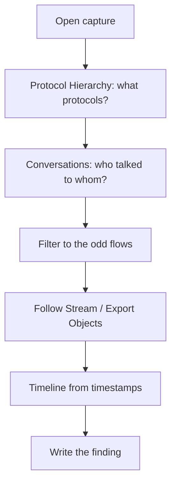

# Lab 4.1: PCAP Analysis

**Month:** 4 (Network Tools and Packet Analysis) · **Pattern family:** Network analysis and forensics · **Time budget:** 20 to 24 hours (across many sessions; this lab is the month's deliverable and the bulk of its hours) · **Lab attempt floor:** 90 minutes per capture before any hint (each of the five captures gets its own floor) · **AI guidance:** AI-free zone. No AI on this lab. Do not paste packets, hex, or capture contents into any AI service. Read the captures yourself; that reading is the entire point. · **Builds on:** Month 3, including Lab 3.3 (you captured your own DHCP, DNS, and TCP handshake). You can read an IP and a TCP header field by field.

## Why this lab exists

This is the lab that turns protocol knowledge into analysis skill. You can recite the TCP state machine. That is not the same as opening a capture you have never seen and saying what happened in it. Reading traffic is a pattern-recognition skill. Like every pattern-recognition skill, it is built by exposure: you read one capture, then another, then another, until the shapes (a scan, a beacon, a download, an exfiltration) jump out at you before you have consciously analyzed them.

The captures come from MalwareTrafficAnalysis.net and similar public training sources. These exist so analysts can practice on real malicious traffic without needing a real incident. The traffic is genuine: real malware families, real command-and-control patterns, real delivery chains. You will not understand all of it on the first capture, and you are not expected to. You are expected to extract what you can, write it up honestly, and get faster across the five.

The deliverable, five reports written for the next shift, is not busywork. Writing the finding is the job. An analyst who can see what happened but cannot hand it to a colleague in a form they can act on has done half the work. This lab makes you do both halves.

**Recall first, from memory, before you read on:** in Month 3 Lab 3.3 you captured your own TCP handshake. What are the three packets, and how would seeing all three complete in a capture tell you a port is open? (Hold the answer in your head. You will use it the moment a capture shows a connection and you have to decide whether it succeeded.)

## A note on the captures: provenance and handling

The captures are downloaded from public training sites whose terms of use authorize this exact activity (see `../../ctf-set/README.md` for the list and the scope note). Reading a capture file is passive analysis. You are opening a file on your own machine, not touching any network. There is no scanning and no active step in this lab, so the active-scanning scope rules do not apply here.

Two handling rules still matter. First, some captures contain live malware payloads (a malicious program carried over HTTP, for example). Treat extracted objects as hostile: do not execute anything you carve out of a capture, and do this work in a VM or a directory you are willing to wipe. Second, because Month 4 is in the AI-free zone, do not paste capture contents, packet bytes, or extracted strings into any AI service for analysis. Both rules are about discipline you will need later, with real client data, where the stakes are higher.

## Learning objectives

By the end of this lab you can:

- **Analyze** an unfamiliar packet capture top-down: protocol hierarchy and conversations first, then drill into the interesting flows.
- **Build** display filters, including regex matches with the `matches` operator, that isolate one conversation, one protocol, or one indicator from a noisy capture.
- **Reconstruct** a timeline from packet timestamps and explain a sequence of events in order.
- **Identify** and name common malicious traffic shapes: host discovery and port scans, periodic beaconing, credential theft over cleartext, suspicious DNS, and data exfiltration.
- **Extract** indicators a colleague can pivot on: IP addresses, domains, URLs, file hashes, user-agents, and the times they appeared.
- **Produce** a two-to-three-page analyst report that another analyst could act on without re-reading the capture from scratch.

## Recognition cue

When someone hands you a capture and asks "what happened here," this is the lab you draw on. The cue is the reflex to go top-down: statistics first (Protocol Hierarchy, Conversations), then drill into the flows that look wrong, then write the timeline. When you catch yourself scrolling a four-thousand-packet list from the top, that is the signal you have abandoned the method this lab installs. Stop and open the Statistics menu instead.

## The method you are installing

Here is the loop. It is the same loop the month README showed, now scoped to one capture. You will run it on every capture in Task 3.


*Notice: the first two steps are statistics, not packets. You decide where to look before you read a single byte of payload.*

## Tasks

Do these in order. Tasks 1 and 2 are done once. Task 3 is repeated for each of the five captures. Tasks 4 and 5 close the lab. The 90-minute floor applies per capture inside Task 3: work each capture for at least 90 minutes before you ask the tutor for a hint.

### Task 1: Tool pre-flight, before you open a capture (60 minutes)

Before you analyze anything, write the pre-flight understanding for Wireshark and `tcpdump` (you will use `tcpdump` for command-line confirmation in Task 3). For each tool, write what it does at the packet level, what it captures versus what it displays, what artifacts it leaves on your system, and the authorization scope (here, trivial: you are reading a file). Then, in Wireshark, locate and note where these live, because you will use all of them: the display filter bar, Statistics > Protocol Hierarchy, Statistics > Conversations, Statistics > Endpoints, and the Follow Stream option on a right-clicked packet.

Distinguish, in writing, a capture filter from a display filter: which is applied when, and which one supports regex. If you cannot say which supports regex, you have not read the Wireshark documentation in `../../reading.md` yet. Do that first.

**Checkpoint:** a `preflight.md` in this lab's directory covering both tools and the capture-versus-display-filter distinction, plus a one-line note of where each of the five Wireshark features above is found.
**If not:** if you cannot state which filter supports regex, re-read the Display Filter Reference; the answer is the display filter, through the `matches` operator (your Month 2 skill).

### Task 2: Learn the top-down method (gradual release)

The new skill of this lab is reading a capture top-down, statistics first. You will learn it in three stages. Stages 1 and 2 use a capture you already understand, one of **your own Month 3 captures** (your DHCP lease, your DNS query, or your TCP handshake). That is on purpose: you practice the method where you already know the answer, so the method, not the mystery, is what you are learning. Stage 3 is the graded work on captures you have never seen.

#### Stage 1 - Worked example (I do)

Open your own Month 3 TCP handshake capture (the one you took in Lab 3.3). Follow this exact sequence and watch what each step shows. You are not solving anything; you are watching the method work on traffic you already understand.

1. **Statistics > Protocol Hierarchy.** Read the tree. For your handshake capture you should see mostly TCP, perhaps under a thin layer of Ethernet and IP. This answers "what protocols are even here?" before you read a packet.
2. **Statistics > Conversations**, TCP tab. You should see one conversation: your machine and the server, with a packet count. This answers "who talked to whom?"
3. Right-click that conversation, choose **Follow > TCP Stream.** Wireshark rebuilds the whole exchange into readable text. For a plain web request you would see the request and response; for a bare handshake you may see little payload, which is itself the lesson (the interesting part was the setup, not the content).
4. Clear the Follow filter. In the display filter bar, type `tcp.flags.syn == 1` and press Enter. You isolated just the SYN packets: the start of the handshake. This is a field-and-value display filter, the building block of every filter you will write.

What you just did, in order, is the method: hierarchy, then conversations, then stream, then a targeted filter. You started wide and narrowed. You never scrolled the packet list looking for something interesting.

**Checkpoint:** on your own handshake capture, Protocol Hierarchy shows TCP, Conversations shows one TCP conversation, Follow TCP Stream opens a readable window, and `tcp.flags.syn == 1` isolates the SYN packet(s).
**If not:** if Conversations is empty, you may have a display filter still applied from an earlier step; clear the filter bar and reopen the window. If Follow Stream is greyed out, you right-clicked a non-TCP packet; right-click a TCP packet in the conversation.

#### Stage 2 - Faded practice (we do)

Now run the method yourself on a second known capture: your own Month 3 **DNS query** capture. The steps are given as goals with the mechanical parts left to you. Fill in the blanks, then write a three-sentence summary of what the capture shows.

```
1. Open Statistics > Protocol Hierarchy.
   TODO: which protocol dominates this capture, and what sits under it? (expect: DNS over UDP)
2. Open Statistics > Conversations, UDP tab.
   TODO: how many conversations, and between which two addresses? (your machine and your DNS server)
3. Write a display filter that shows only the DNS query for the name you looked up.
   TODO: fill the field and value -> dns.qry.name == "______"     # the exact name you queried in Month 3
4. Follow the UDP stream of that query/response pair.
   TODO: what name was asked, and what address came back?
5. Write a three-sentence summary: what does this capture show, start to finish?
```

You already know the answer to this capture; you took it yourself. The point is to run the loop without the step-by-step hand-holding of Stage 1, so the order becomes automatic.

**Checkpoint:** your filter `dns.qry.name == "<the name>"` shows the query, the stream shows the name asked and the address returned, and your three-sentence summary names the protocol, the parties, and the result.
**If not:** if `dns.qry.name == "..."` returns nothing, check the name is exact (no trailing dot mismatch, correct spelling); or widen to `dns.qry.name contains "..."` to confirm the packet is there, then tighten. If the UDP tab of Conversations is empty, your DNS may have used TCP (rare but possible); check the TCP tab.

#### Stage 3 - Independent (you do)

No scaffolding now, and now it is real. This is the core of the lab and the source of the deliverable. Download five captures from the sources in `../../ctf-set/README.md`. Choose a spread, not five of the same kind: aim for variety across the traffic shapes (something with a scan, something with a clear download chain, something with beaconing, something with suspicious DNS, something with cleartext credentials or exfiltration). The source sites label or describe many captures; use the labels to get variety, not to get the answer.

For each capture, run the same top-down method you just practiced, with no step list this time. At minimum, for each capture establish:

- The hosts involved and their roles (who is the victim, who is the server, who is internal versus external).
- A timeline of the significant events, with packet-derived timestamps.
- The protocols in play and which ones carry the interesting activity.
- The indicators: addresses, domains, URLs, user-agents, file names, and hashes where you can compute them.
- A plain-language statement of what you believe happened, and your confidence in it.

Then write the report. Each report is two to three pages, addressed to the SOC analyst coming on for the next shift. The full report specification is in `../../deliverable.md`; follow it. The reports are the deliverable, so write them as you go rather than leaving all five for the end.

**The 90-minute floor is per capture.** For each capture, analyze for at least 90 minutes on your own before requesting any hint. If you are stuck after the floor, the hint ladder applies; the tutor will not name the malware family or hand you the answer. It will point you at the next thing to look at. **Do not look up writeups of the specific capture you are analyzing.** Many of these captures have published walkthroughs. Reading one resolves the exercise and destroys the learning.

**Checkpoint:** five capture analyses, each with the five elements above worked out in your notes, and five corresponding reports that meet the `../../deliverable.md` specification. Note for each capture which source it came from and any label the source applied, so your work is reproducible.
**If not:** if you open a capture and freeze at four thousand packets, you skipped the method; go back to Protocol Hierarchy and Conversations and let the statistics tell you where to look. If a filter returns zero results, suspect the filter before the capture (the `==` versus `matches` trap from Month 2 is the usual cause).

### Task 4: Cross-capture pattern summary (60 minutes)

After all five, write a short synthesis: what was common across the captures and what was distinct. Which traffic shapes recurred? Which display filter or Wireshark view did the most work for you across the set? Which capture was hardest to read, and what specifically made it hard? This step is where the five separate exercises consolidate into a transferable method.

**Checkpoint:** a `patterns.md` of half a page to a page identifying at least three recurring traffic shapes you saw and the single technique (a filter, a Statistics view, a Follow Stream habit) that proved most useful across the five.
**If not:** if you cannot name three recurring shapes, re-read your five report timelines side by side; the repeats (a scan precedes a download, a download precedes a beacon) appear when the timelines are next to each other.

### Task 5: Notebook entry (60 minutes)

Write the lab notebook entry at `.tutor/notebook/lab-01-pcap-analysis.md`. Required sections:

- **Pre-flight check.** Pull from your Task 1 `preflight.md`: what Wireshark and `tcpdump` do at the packet level, what they leave behind, what could go wrong, and the authorization scope (passive file reading).
- **Concept naming.** What did this lab teach? Hint: it is not "I learned Wireshark." Name the analysis skill.
- **Evidence.** The display filters you relied on, key packet numbers and timestamps from each capture, screenshots of the Statistics views or the decisive packets, and links to your five reports.
- **Five-question debrief.** All five questions answered with substance. The third question (what would dominate at scale) should make you think about a two-gigabyte capture instead of a two-megabyte one, which is exactly what Month 5's Python tooling addresses.

No AI Provenance section. Month 4 is in the AI-free zone.

**Checkpoint:** a committed notebook entry with all required sections, linking to the five reports.
**If not:** if you are unsure of the five debrief questions, they are listed in the month README and `tutor-reference.md`; the tutor rejects an entry missing any of them.

## Definition of Done

The lab is complete when:

- `preflight.md`, `patterns.md`, and your Stage 2 summary are present in this lab's directory.
- Five reports exist, each meeting the `../../deliverable.md` specification (two to three pages, SOC-handoff voice, indicators a colleague can pivot on).
- `lab-01-pcap-analysis.md` is in the notebook with all required sections and links to the five reports.

The tutor will spot-check by picking one report and one claim in it (for example, "you wrote that this host beaconed every sixty seconds; show me the packets that establish the interval") and asking you to defend the claim from the capture. A report grounded in real analysis survives this; a report that hand-waved does not.

**Self-explain:** in one sentence, why does starting with Protocol Hierarchy and Conversations beat scrolling the packet list from the top?

## Stretch goals

1. Pick one capture and confirm one of your findings from the command line with `tcpdump -r <file>` and a BPF filter, proving you can read the same evidence without the GUI.
2. Carve one transferred file with Export Objects, compute its hash with `shasum`, and write the hash into your report's indicator list. Do not execute the file.
3. Build an IO Graph (Statistics > IO Graph) for a beaconing capture and use it to read the beacon interval straight off the graph, then confirm it against the packet timestamps.
4. Re-analyze your hardest capture a week later, cold, without your notes, and compare how much faster the method makes you the second time.

## Troubleshooting

- **Four thousand packets, no idea where to start.** This is normal and it is why the method exists. Protocol Hierarchy and Conversations first, every time. Never scroll the list top to bottom.
- **A filter returns zero results.** Suspect the filter, not the capture. The most common cause is a regex placed in `==` instead of `matches`, or `ip.addr == x` when you meant `ip.src == x`. Widen the filter to confirm the data is present, then tighten.
- **Follow Stream is greyed out.** You right-clicked a packet that is not part of a TCP/UDP/HTTP conversation. Right-click a packet that is.
- **You carved a file and want to run it.** Do not. Hash it, note the hash, look the hash up in your notes, and stop. Carved objects from malware captures are hostile.
- **Timestamps look wrong or shifted.** Check Wireshark's time display format (View > Time Display Format); set it to UTC or seconds-since-capture so your timeline is consistent across reports.

## Time budget breakdown

- Task 1: 60 minutes
- Task 2: 90 minutes (Stages 1 and 2 on your own known captures)
- Task 3: 3 to 4 hours per capture, five captures (the bulk of the lab)
- Task 4: 60 minutes
- Task 5: 60 minutes

Total: 20 to 24 hours. This lab spans most of the month; do not attempt it in a few sittings. One or two captures per study session is a realistic pace.

## Resources

- The Wireshark User's Guide and the Display Filter Reference (primary sources; both in `../../reading.md`).
- `man tcpdump` and `man pcap-filter` for BPF syntax.
- The MalwareTrafficAnalysis.net exercises and tutorials index (the source of the captures; see `../../ctf-set/README.md`).
- Your own Month 3 captures and notebook entries, for the Stage 1 and Stage 2 practice.
- The five-question debrief format in `.tutor/tutor-core.md`.

Do not consult published walkthroughs of any specific capture you are analyzing. Everything you need to read the traffic is in the Wireshark documentation and in the protocol knowledge you built in Month 3.
