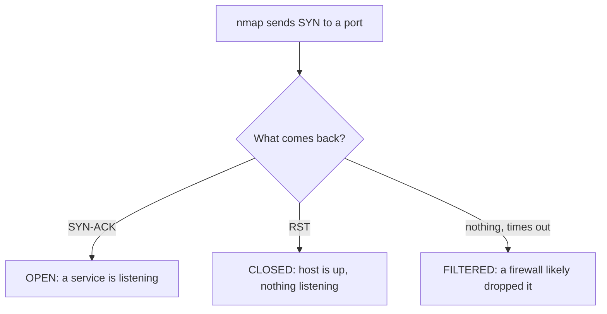

# Lab 4.2: Nmap Exploration

**Month:** 4 (Network Tools and Packet Analysis) · **Pattern family:** Network analysis and forensics · **Time budget:** 10 to 12 hours (across multiple sessions) · **Lab attempt floor:** 90 minutes (medium lab) · **AI guidance:** AI-free zone. No AI on this lab. Read the `nmap` documentation and the man page yourself; do not ask an AI to interpret your scan output for you. · **Builds on:** Month 3 (ports, the TCP handshake, ARP, ICMP). Lab 4.1 (you can read a capture, which you need to confirm what `nmap` puts on the wire). Your Month 0 lab VMs (Ubuntu Server at minimum) running on your own host.

## The scope rule, first, because it is not optional

You run `nmap` only against systems you own: your own VMs on your own host network, and `localhost`. Nothing else. Not your home router unless it is yours and you intend to test it (and even then, prefer the lab VMs). Not a public host "just to see what it returns." Not a friend's machine with verbal permission. Not a coffee-shop network. A port scan against a host you do not own and are not authorized to test can be a CFAA matter in the United States, and a crime under the equivalent statute in your jurisdiction. This is the exact line `SAFETY.md` draws, and the tutor enforces it without exception.

Before every scan in this lab you state, in your notebook, what the target is and why you are authorized to scan it. The honest answer in this lab is always "it is a VM I created on my own host." If you ever cannot give that answer, do not run the scan. The discipline of naming your authorization before you act is the habit that keeps working professionals out of court. Build it now, where the target is your own Ubuntu VM and the stakes are zero.

`nmap` is loud and it is active. Unlike Lab 4.1, where you read a file and touched no network, here you are sending packets to a target and changing its state (entries in its logs, open sockets, possibly tripping its own defenses). That is precisely why the scope rule leads this lab.

## Why this lab exists

In Lab 4.1 you read traffic someone else generated. Here you generate it, and you confirm with your own eyes that the tool does what it claims. `nmap` is the standard host-discovery and port-scanning tool, and most learners run it as a black box: they type `nmap -sV target`, read the output, and never ask what went over the wire. This lab forbids that. You will run each scan type while capturing it in Wireshark, and you will reconcile the packets you see with the result `nmap` reports. By the end, "open," "closed," and "filtered" are not labels you trust on faith; they are inferences you can derive from the packets yourself.

You will also feel the effect of timing. Re-running the same scan under different timing templates changes the packet rate, the parallelism, and how detectable the scan is. Watching that change in a capture turns the abstract `-T0` through `-T5` scale into a concrete trade-off: faster scans finish sooner and light up every intrusion-detection system; slower scans take hours and slip under thresholds.

Month 5's first lab has you build a port scanner from scratch in Python, with no `nmap`, and compare the two. This lab is where you earn the understanding that makes that comparison meaningful.

**Recall first, from memory, before you read on:** in Lab 4.1 you learned to confirm a claim by dropping to the packets. State the three port states (open, closed, filtered) and, for each, what the target does or does not send back. (You will spend this whole lab proving those three states from your own captures.)

## Learning objectives

By the end of this lab you can:

- **Explain** what `nmap` puts on the wire for host discovery (`-sn`), a TCP connect scan (`-sT`), a SYN scan (`-sS`), and a UDP scan (`-sU`), at the level of individual packets and flags.
- **Explain** how `nmap` infers each port state (open, closed, filtered) from what it does or does not receive back.
- **Analyze** a service and version detection scan (`-sV`) and explain how the version guess is made (banner grabbing and probe matching), and why it is sometimes wrong.
- **Reconcile** two scans of the same host run with different timing templates, citing the packet-rate and behavior differences you observed in your own captures.
- **Defend** the authorization scope for any scan, in CFAA terms.

## Recognition cue

When a result from any tool surprises you, the cue is to drop to the wire and confirm it against the packets, rather than trusting the tool's summary. When you read a port state and want to know why the tool decided that, you reach for the capture. And before any active scan, the cue that should fire automatically is "what is the target, and why am I authorized to scan it." If that question does not fire on its own, the discipline this lab builds has not landed yet.

## How nmap infers a port state

This is the mental model the whole lab confirms. For a TCP connect or SYN scan, nmap sends a probe and reads the reply:


*Notice: the difference between CLOSED and FILTERED is a reply versus silence. Your captures will show exactly which one happened, which is why you capture every scan.*

## Tasks

Do these in order. Each task has explicit acceptance criteria. Capture every scan in Wireshark (or with `tcpdump -w`); the captures are your evidence and the point of the lab. Before each scan, write the one-line authorization statement required by the scope rule above.

### Task 1: Pre-flight for nmap (45 minutes)

Write the pre-flight for `nmap`: what it does at the packet level (for the scan types you will run), what artifacts it leaves on the target (log entries, the fact of the connections) and on your own host, what could go wrong (scanning the wrong host, tripping a defense, a UDP scan that takes an hour), and the authorization scope (your own VM).

**Checkpoint:** a `preflight.md` for `nmap` covering all four points, with the authorization scope stated explicitly.
**If not:** if your "what could go wrong" is thin, the biggest item is scanning the wrong host; write the one-line authorization habit into the pre-flight so it fires before every scan.

### Task 2: Reconcile the tool with the wire (gradual release)

The new skill of this lab is not "run nmap." It is "prove what nmap claims by reading the packets it sent." You will learn that reconcile-against-the-wire loop in three stages. Every stage runs against **your own Ubuntu VM** (your only legal target), so the method, not the target, is what changes across the stages.

#### Stage 1 - Worked example (I do)

Run this exact sequence against your own Ubuntu VM and study how the capture confirms the output. Replace `VM_IP` with your VM's address. First, state your authorization in your notebook: "target is my own Ubuntu VM on my host network; I created it; I am authorized."

1. Start a Wireshark capture, filtered to your VM: in the capture filter box, `host VM_IP`.
2. In a terminal, run a small connect scan: `nmap -sT -p 20-30 VM_IP`.
3. Stop the capture.
4. Read the nmap output. Note which port(s) it called `open` and which it called `closed`.
5. In Wireshark, find an **open** port: filter `tcp.port == <an open port> && tcp.flags.syn == 1`. You should see your machine's SYN, the VM's SYN-ACK, and your ACK. The full handshake completed. That is why nmap said "open."
6. Now find a **closed** port: filter `tcp.port == <a closed port>`. You should see your SYN and the VM answering with a **RST** (reset). The host replied and refused. That is why nmap said "closed."

You just reconciled the tool with the wire. nmap's one-word verdict ("open" or "closed") is a summary of the packet exchange you just read with your own eyes. That is the entire skill of this lab.

**Checkpoint:** for one open port you see SYN, SYN-ACK, ACK; for one closed port you see SYN then RST; and you can say in one sentence why each maps to the label nmap printed.
**If not:** if every port looks closed, your VM may have no services on ports 20 to 30; widen to `-p 1-1000` or start a service (the VM's SSH server on port 22 is a reliable open port). If the capture is empty, your capture filter address is wrong, or you captured on the wrong interface; pick the interface that carries traffic to the VM.

#### Stage 2 - Faded practice (we do)

Now run the loop yourself for a **filtered** port, the third and subtlest state. The scaffold gives the goals; you supply the commands and the reading. Still your own VM, still with the authorization line written first.

```
1. On the VM, enable its firewall to DROP traffic to one port (for example, deny inbound to port 8080).
   TODO: run the VM's firewall command to drop that port (ufw on Ubuntu)
2. Start a capture filtered to the VM.
   TODO: capture filter -> host VM_IP
3. Scan that one port.
   TODO: nmap -sT -p 8080 VM_IP
4. Read the nmap result.
   TODO: nmap should report this port as ______   (predict before you look)
5. In the capture, look for the reply to your probe.
   TODO: what came back from the VM for port 8080? (compare to the RST you saw for a CLOSED port in Stage 1)
6. Write one sentence: why is FILTERED different from CLOSED, in terms of what the VM sent?
```

The lesson lands when you compare this capture to Stage 1's closed port. A closed port answered with a RST. A filtered port answered with nothing: the firewall swallowed your probe. Same nmap, different verdict, and the packets are the proof.

**Checkpoint:** nmap reports the firewalled port as `filtered`, and your capture shows your probe going out with no reply coming back (unlike the RST you saw for a closed port).
**If not:** if nmap still reports `closed`, the firewall rule did not take effect; confirm the rule is active (`sudo ufw status`) and that you dropped (not rejected) the port. A "reject" rule sends a reply and looks closed; a "drop" rule sends nothing and looks filtered. That difference is the whole point.

#### Stage 3 - Independent (you do)

No scaffolding now. All against your own VM, each scan captured, each with the authorization line written first. Work these on your own, reading the packets to support every claim:

- **Compare scan types.** Run `-sT` (connect), `-sS` (SYN), and `-sU` (UDP) against the same host, each captured. For the SYN scan, observe whether the handshake completes the way the connect scan's did, and write down what you see in the packets (do not look this difference up; derive it from your capture). For the UDP scan, observe why it behaves so differently and so much more slowly. Write `scan-types.md`.
- **Timing templates.** Run one scan type and one port range under at least three timing templates spread across the range (for example `-T1`, `-T3`, `-T5`), each captured and timed. Record wall-clock duration and a one-line observation about packet rate or parallelism per template (the IO Graph helps). End with a sentence on which scan a defender notices first and why. Write `timing.md`.
- **Service detection.** Run `-sV` against your VM. For at least two services it identifies, find in your capture the banner or probe response nmap used. Note one service where the version is confident and one where it is a guess or unavailable, and explain the difference. Write `service-detection.md`.
- **NSE orientation, no scripts written.** Read the NSE documentation. Run at most a single default-category script against your own VM (`-sC` or one safe script you choose). Document the main NSE categories (`safe`, `default`, `discovery`, `vuln`, `intrusive`, and others), what each is for, and which carry the most risk of crossing a scope or stability line. You are not writing NSE scripts (that is Lua, out of scope this month). Write `nse-notes.md`.

**Checkpoint:** `scan-types.md`, `timing.md`, `service-detection.md`, and `nse-notes.md` exist, each grounded in your own captures, and for each claim you can point to the packets that support it.
**If not:** if `-sS` fails or behaves oddly, a SYN scan crafts raw packets and needs elevated privileges; read the man page on why rather than skipping it. If your timing comparison shows no difference, your port range is too small for `-T1` to be meaningfully slower than `-T5`; widen the range, staying on your own VM.

### Task 3: Notebook entry (60 minutes)

Write the lab notebook entry at `.tutor/notebook/lab-02-nmap-exploration.md`. Required sections:

- **Pre-flight check.** From Task 1: what `nmap` does on the wire for each scan type, what it leaves on the target, what could go wrong, and the authorization scope (your own lab only). State the scope rule explicitly; the tutor checks for it in this lab.
- **Concept naming.** What did this lab teach? Name it precisely (inferring state from packet responses, and the cost of being loud).
- **Evidence.** Your captures and the specific packets that prove each claim: the open-versus-closed difference, the closed-versus-filtered difference, the SYN-versus-connect difference, the timing comparison, the version-detection banners.
- **Five-question debrief.** All five questions. The fourth (the edge case that would have broken your first attempt) should engage with filtered ports and the difference between "no response because closed" and "no response because filtered," which is the subtlety this whole lab turns on.

No AI Provenance section. Month 4 is in the AI-free zone.

**Checkpoint:** a committed notebook entry with all required sections, including the explicit scope statement.
**If not:** if the scope statement is missing, the tutor rejects the entry; this lab is the one where the scope rule is checked hardest.

## Definition of Done

The lab is complete when:

- `preflight.md`, `scan-types.md`, `timing.md`, `service-detection.md`, and `nse-notes.md` are present, each grounded in your own captures, plus your Stage 1 and Stage 2 notes.
- Every scan in the lab was run against a host you own, with the authorization statement recorded.
- `lab-02-nmap-exploration.md` is in the notebook with all required sections.

The tutor will spot-check by picking one claim and asking for the packet evidence (for example, "you say port 22 was open; show me the handshake in your capture"), and by asking you to state, from memory, why you were authorized to run every scan. If your evidence is a screenshot of `nmap` output rather than the underlying packets, the task returns; the point of the lab is the wire, not the tool's summary.

**Self-explain:** in one sentence, how does a capture let you tell a "closed" port from a "filtered" port when nmap's one-word verdict alone would not?

## Stretch goals

1. Run `-sn` (host discovery, no port scan) against your own subnet and read in the capture whether nmap used ARP, ICMP, or TCP probes to decide a host was up. Explain why it chose what it chose.
2. Run the same scan twice, once as a normal user and once with `sudo`, and explain from the captures why the SYN scan needs elevated privileges and the connect scan does not.
3. Capture a `-T0` (paranoid) scan of a few ports and measure how long nmap waits between probes; connect that delay to evading a rate-based detection rule.
4. Compare nmap's open/closed/filtered verdict on one port to what `netcat` tells you when you connect to the same port by hand, and reconcile the two.

## Troubleshooting

- **`-sS` (SYN scan) fails or needs a password.** A SYN scan crafts raw packets rather than using the OS connect path, so it needs elevated privileges. Run it with `sudo` and read the man page on why.
- **A UDP scan looks hung.** It is slow by nature. Closed UDP ports are inferred from ICMP "port unreachable" messages, which are rate-limited, so nmap must wait and retransmit. Let it run; understanding the slowness is part of the lab.
- **A port reports "filtered" and you do not understand why.** "Closed" means a reply said so (a RST); "filtered" means no useful reply came back at all (a firewall dropping the probe). Your capture shows the difference. That is why you capture every scan.
- **You want to scan something outside your own lab "for a better target."** Do not. Your Ubuntu VM is a real target and it is yours. Re-read the scope rule. The tutor will refuse to help with any scan of a host you do not own.
- **Timing comparison is noisy on a tiny range.** Use a large enough port range that `-T1` is clearly slower than `-T5`, while staying on your own VM.

## Time budget breakdown

- Task 1: 45 minutes
- Task 2: 7 to 8 hours (Stage 1 ~60 min, Stage 2 ~90 min, Stage 3 the rest, including a slow UDP scan)
- Task 3: 60 minutes
- Buffer for slow UDP scans and capture fiddliness: 60 to 90 minutes

Total: 10 to 12 hours.

## Resources

- `man nmap` (primary source; read the sections on scan types, port states, and timing).
- The official Nmap Reference Guide and the Nmap Scripting Engine documentation (both in `../../reading.md`).
- The Wireshark User's Guide for the IO Graph and Conversations views.
- `man tcpdump` and `man pcap-filter`, if you capture from the command line instead of in Wireshark.
- Your Month 3 notebook entry on the TCP three-way handshake.

Do not consult third-party blog posts that interpret scan output for you. The man page and your own captures are the authoritative pair: one says what the flag requests, the other shows what happened.
