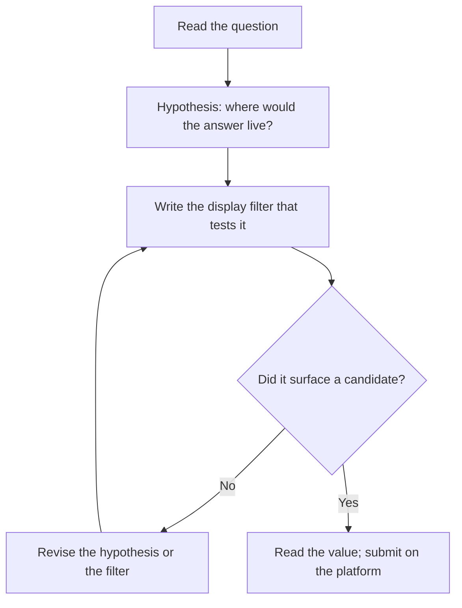

# Lab 4.3: Wireshark CTF

**Month:** 4 (Network Tools and Packet Analysis) · **Pattern family:** Network analysis and forensics · **Time budget:** 10 to 12 hours · **Lab attempt floor:** 45 minutes per stuck challenge (these are bite-sized puzzles; the floor is per puzzle, not for the whole room) · **AI guidance:** AI-free zone. No AI on this lab. Do not paste capture contents, hex, or strings into any AI service, and do not ask an AI to find the answer hidden in a capture. · **Builds on:** Lab 4.1 and Lab 4.2. You have read multiple captures top-down and you can build display filters and follow streams. A free TryHackMe account (set up in Month 0). Wireshark installed.

## Why this lab exists

Labs 4.1 and 4.2 built the analysis method. This lab drills it under a different pressure. Capture-the-flag challenges are designed to hide a specific answer inside a capture, and finding it forces you to be precise with display filters, Follow Stream, and the Wireshark feature set. Where the PCAP lab rewarded a broad timeline, this lab rewards surgical filtering: the answer is a string in one packet, or a value reconstructed from a stream, or a file carried across a conversation, and you have to filter the noise away to find it.

These challenges also rehearse a real analyst reflex: forming a hypothesis about where an answer would live ("if there were credentials, they would be in a cleartext POST; let me filter for that") and then writing the filter that tests it. That hypothesis-then-filter loop is exactly what you do in an investigation, compressed into a puzzle with a definite answer.

The TryHackMe "Wireshark CTFs" room (and the alternatives listed in `../../ctf-set/README.md`) authorizes this activity through its terms of use. You work inside the platform; the captures are provided; there is no scanning and no external target. The platform is the scope.

**Recall first, from memory, before you read on:** in Lab 4.1 you ran a top-down method, statistics first. In this lab the goal is narrower: one specific value, not a whole timeline. What is the first thing you should do before writing any filter? (Answer: form a hypothesis about where the value would live, then write the filter that tests it. Hunting by eye is the thing to avoid.)

## The no-flag-confirmation rule applies here

The tutor will not confirm a flag. Not at any rung of the hint ladder, not when you are sure you have it, not when you are frustrated. When you think you have an answer, you submit it on the platform; the platform tells you whether it is right. If it is wrong and you are stuck, you return to the hint ladder. Do not paste a flag or an answer string to the tutor expecting confirmation; the tutor never knows the flag, even when it could work it out. This is the same rule that governed picoCTF in Month 1, and it governs every CTF in the course.

## Learning objectives

By the end of this lab you can:

- **Form** a hypothesis about where an answer lives in a capture and **build** the display filter that tests it.
- **Use** the `matches` and `contains` operators to search packet fields with regex, reinforcing Month 2.
- **Reconstruct** values, credentials, or files from a TCP, UDP, or HTTP stream using Follow Stream and Export Objects.
- **Navigate** the Wireshark feature set under time pressure: filters, Statistics views, the packet bytes pane, and string search across a capture.
- **Recognize** when an answer is hidden in metadata (a user-agent, a hostname, a DNS query) rather than in obvious payload.

## Recognition cue

When you need a specific value out of a capture (a credential, a transferred file, a hostname), the cue is filter-first: state what you are looking for, form a hypothesis about where it would live, and write the display filter that tests the hypothesis. When you find yourself hunting by eye through the packet list, that is the signal to stop and write a filter instead. This is the same investigative reflex a real analyst uses, compressed into a puzzle with a definite answer.

## The loop this lab drills


*Notice: the filter comes from a hypothesis, not from guessing. When a filter returns nothing, you revise the idea or the syntax; you do not start scrolling.*

## Tasks

Do these in order. The 45-minute floor applies per challenge inside Task 3: work each challenge for at least 45 minutes on your own before asking the tutor for a hint, and never read a published solution for the specific challenge.

### Task 1: Pre-flight on the Wireshark features the room exercises (45 minutes)

The room will lean on Wireshark features beyond the Statistics views you used in Lab 4.1. Before you start, locate and write a one-line note on each of: the display filter `matches` operator (regex), the `contains` operator, Follow Stream (TCP, UDP, HTTP), Export Objects (HTTP and other supported protocols), the packet bytes pane, and Edit > Find Packet (string and hex search across a capture). For each, write what it does and one kind of question it helps answer.

This is a tooling pre-flight, not a new-tool pre-flight (you wrote the Wireshark pre-flight in Lab 4.1). The aim is to walk into the challenges knowing which feature to reach for, rather than discovering them mid-puzzle.

**Checkpoint:** a `feature-notes.md` listing each feature with its one-line purpose and an example question it answers (for example, "Export Objects: pulls files transferred over HTTP out of the capture; answers 'what file was downloaded'").
**If not:** if you cannot describe Find Packet, open Edit > Find Packet now and try a string search on any capture you have; the menu teaches itself in two minutes.

### Task 2: Learn hypothesis-then-filter (gradual release)

The new skill of this lab is the hypothesis-then-filter loop. You will learn it in two modeled stages on a **safe practice capture you already understand** (one of your own Month 3 captures, or the Wireshark project's published sample captures from `../../reading.md`), and then apply it in Stage 3 to the graded room. Stages 1 and 2 do not touch any graded challenge. That is deliberate: a CTF answer you are shown is an answer you did not find, so the modeling uses non-graded traffic only.

#### Stage 1 - Worked example (I do)

Take your own Month 3 DNS capture (or any sample HTTP capture). Pretend the "question" is: *what hostname did this machine look up?* Watch the loop work.

1. **Hypothesis:** a looked-up hostname lives in a DNS query, in the field `dns.qry.name`. That is where the answer would be, if it is here at all.
2. **Filter that tests it:** type `dns.qry.name` in the display filter bar and press Enter. Every DNS query packet appears, each showing the name asked.
3. **Read the value:** click a query packet, expand the DNS section, and read the `Name` field. There is your answer.

Notice the order. You did not scroll the packet list looking for something that looked like a hostname. You named where the value would live, wrote the filter for that field, and read it off. On a real CTF question you would then submit that value on the platform.

**Checkpoint:** the filter `dns.qry.name` shows only DNS query packets, and you can read the queried name out of the packet detail.
**If not:** if the filter shows nothing, this capture may have no DNS; try a capture you know contains a name lookup, or use `http.host` on an HTTP capture instead. The point is the loop, not this specific field.

#### Stage 2 - Faded practice (we do)

Now run the loop yourself on the same safe capture for a different "question": *was anything sent in cleartext that looks like a credential or a form field?* The scaffold gives the goals; you write the filters. This is still practice traffic, not a graded challenge.

```
1. Hypothesis: form data and credentials in cleartext HTTP ride in a POST body.
   TODO: in one sentence, why a POST and not a GET?
2. Filter to cleartext HTTP requests.
   TODO: write a filter that shows HTTP POST requests -> http.request.method == "______"
3. Narrow to a field that often carries a username, using a substring match.
   TODO: write a filter using contains -> http contains "______"   (try "user" or "pass" or "login")
4. Reconstruct the whole exchange to read it in order.
   TODO: right-click a matching packet and Follow > ______ Stream
5. One sentence: which feature (the filter or Follow Stream) actually surfaced the value, and why?
```

If your practice capture has no HTTP form, use one of the Wireshark sample captures that does (the project publishes several). The skill transfers regardless of the capture: hypothesis, filter, narrow, follow, read.

**Checkpoint:** `http.request.method == "POST"` shows POST requests, your `contains` filter narrows to a candidate, and Follow Stream shows the request body in readable order.
**If not:** if `contains` returns nothing, the substring may not be present in this capture; widen to plain `http` to confirm there is HTTP at all, then pick a substring you can see in the payload. If Follow Stream is greyed out, right-click an actual HTTP packet, not a TCP control packet.

#### Stage 3 - Independent (you do)

No scaffolding, and now it counts. Complete the TryHackMe "Wireshark CTFs" room (or the alternative in `../../ctf-set/README.md` if the room is unavailable). For each challenge, run the hypothesis-then-filter loop you just practiced: read the question, decide where the value would live, write the filter, and read or reconstruct the answer. Keep a running log: the question, your hypothesis about where the answer lives, the filter or feature you used, and (once the platform confirms it) a one-line note on what made it findable. **Do not record the flag itself in your notes; record the method.**

When you are stuck on a challenge past the 45-minute floor, use the hint ladder with the tutor, the Wireshark documentation, and your own experimentation. **Do not search for a writeup of the specific challenge**; that resolves the puzzle and removes the learning, the same way it would in the PCAP lab. The tutor never confirms a flag; the platform is the only authority on whether your answer is right.

**Checkpoint:** a `ctf-log.md` with one entry per challenge attempted: the question (paraphrased), your hypothesis, the filter or feature that cracked it, and the method note. The log records methods and filters, never flags. The platform's own completion tracking is the proof of which challenges you solved.
**If not:** if you are stuck scrolling the packet list, you skipped the hypothesis step; name what you are looking for and where it would live, then write the filter for that field. If a regex filter returns nothing, check you used `matches` and not `==` (the Month 2 trap).

### Task 3: Build a filter cheat sheet from what you used (60 minutes)

After the room, collect the display filters and features that did the most work into a short cheat sheet: the filter, what it matches, and when you would reach for it. This is the artifact you keep; it will be useful in Month 9 (blue team) and any time you open a capture again. Write it from your own `ctf-log.md`, not from a web search, so it reflects filters you actually understand.

**Checkpoint:** a `filter-cheatsheet.md` with at least ten display filters or feature recipes you used, each with what it matches and when to use it. At least two must use the regex `matches` operator, demonstrating the Month 2 reinforcement.
**If not:** if you have fewer than ten, you likely solved several challenges with the same one or two filters; add the Statistics views and Follow Stream habits you used as recipes, since those count as features.

### Task 4: Notebook entry (45 minutes)

Write the lab notebook entry at `.tutor/notebook/lab-03-wireshark-ctf.md`. Required sections:

- **Pre-flight check.** From Task 1: the Wireshark features the room exercised and what each does. No new tool is introduced, so note that this builds on the Lab 4.1 Wireshark pre-flight.
- **Concept naming.** What did this lab teach? Name the skill (hypothesis-driven filtering, and reconstruction from streams).
- **Evidence.** Your `ctf-log.md` and `filter-cheatsheet.md`, plus screenshots of two or three decisive filters or Follow Stream views. No flags in the evidence.
- **Five-question debrief.** All five questions. The second (the input shape that triggers reaching for this) should connect a kind of CTF question to the filter or feature that answers it.

No AI Provenance section. Month 4 is in the AI-free zone.

**Checkpoint:** a committed notebook entry with all required sections and no flags recorded anywhere in it.
**If not:** if you wrote a flag into the log or the entry, remove it; the log records the method that found the answer, never the answer itself.

## Definition of Done

The lab is complete when:

- `feature-notes.md`, `ctf-log.md`, and `filter-cheatsheet.md` are present in this lab's directory, plus your Stage 1 and Stage 2 practice notes.
- The TryHackMe room shows your completed challenges (the platform tracks this; the tutor does not confirm flags).
- `lab-03-wireshark-ctf.md` is in the notebook with all required sections and no flags recorded.

The tutor will spot-check by picking one entry from your `ctf-log.md` and asking you to explain the filter or feature you used and why it was the right reach for that question. It will not ask for, and you should not offer, the flag.

**Self-explain:** in one sentence, why does forming a hypothesis before writing a filter beat scrolling the packet list when you are hunting one specific value?

## Stretch goals

1. Take one challenge you solved and re-solve it a different way (a different filter, or Export Objects instead of Follow Stream), then write which path was faster and why.
2. Build a regex display filter with `matches` that would catch a class of answers (any email address, say, with a pattern like `[\w.]+@[\w.]+`), and test it on a sample capture.
3. Solve one challenge entirely from the command line where possible (`tcpdump -r` plus `strings` or `grep`) and compare the experience to the GUI.
4. Add a "metadata" section to your cheat sheet: filters for user-agent, hostname, and DNS name, since CTF answers often hide in metadata rather than payload.

## Troubleshooting

- **You are scrolling the packet list.** That is the signal to stop. Name what you are looking for, decide where it would live, and write the filter for that field. The hypothesis comes first.
- **A regex filter returns nothing.** You probably used `==` (a literal match) instead of `matches` (a regex). `==` cannot do wildcards or alternation. Month 2 prepared you for this exact mistake.
- **The platform rejects an answer you are sure is right.** Often a formatting issue: extra whitespace, wrong case, or a missing flag wrapper. Read the challenge's format hint. The content was right even when the submission was not, and the tutor still will not confirm it; the platform is the authority.
- **You are tempted to read a writeup "just for a nudge."** A CTF writeup resolves the puzzle; there is no nudge-sized dose. Use the hint ladder, which is built to nudge without resolving.
- **Follow Stream is greyed out.** Right-click a packet that is part of a stream (a TCP, UDP, or HTTP packet), not a control or ARP packet.

## Time budget breakdown

- Task 1 (feature pre-flight): 45 minutes
- Task 2 (Stages 1 and 2 on safe captures, then the room in Stage 3): 8 to 9 hours, the bulk of the lab
- Task 3 (cheat sheet): 60 minutes
- Task 4 (notebook): 45 minutes

Total: 10 to 12 hours.

## Resources

- The Wireshark Display Filter Reference and User's Guide (primary sources; in `../../reading.md`).
- The TryHackMe "Wireshark CTFs" room and its prerequisite Wireshark rooms (see `../../ctf-set/README.md`).
- Your own `filter-cheatsheet.md` as it grows, and your Lab 4.1 and 4.2 notes.
- The Month 2 regex material, for the `matches` operator.

Do not consult writeups of the specific challenges. The hint ladder and the Wireshark documentation are the only assistance this lab permits, and the tutor never confirms a flag.
