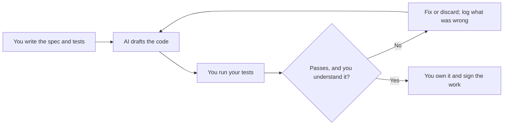

# Month 5: Python for Security (AI Augmentation Unlocks)

**Pattern family:** Tooling and automation · **Time budget:** 55 hours · **AI guidance:** AI unlocks this month, in the **drafting** pattern only. Read "AI augmentation this month" below before your first lab. The AI Provenance log is mandatory in every notebook entry from now on. · **Prerequisites:** Months 1 to 4 done. You can read a packet capture (Month 4), write a Bash script and a regex (Month 2), and reason about ports and protocols (Month 3). You have completed the Month 0 Python primer, the self-paced track you worked through Months 1 to 4, so you can already write basic Python (variables, control flow, functions, data structures, file I/O). The Week 0 self-check below confirms it before Lab 5.1.

## Overview

So far you have worked bare-handed and in Bash. Bash runs out of road fast: the moment you need structured data, a database, or an HTTP client that retries, you want a real language. Python is that language for security work. It is what your future tools are written in, and what you reach for when no existing tool fits.

This month is the hinge of the course. For four months AI was off-limits, so you would build the fundamentals you can now use to judge AI's output. Now AI unlocks, under discipline. You will use it the way a senior engineer uses a fast junior: to draft, never to decide. The loop you will run all month looks like this:

*Notice: your tests, not the AI, decide whether a draft is good. The loop exits only when you can defend every line yourself.*

## Warm-Up: Retrieve Before You Begin

Answer from memory, no peeking, before you read on. This pulls forward the prior-month skills this month leans on.

1. From Month 2: what does `set -euo pipefail` do, and why would you want it?
2. From Month 4: what are the three packets of the TCP handshake, and which side sends each?
3. From Month 3: what is the difference between a port being closed and a port being filtered by a firewall?

Check your recall

1. It makes a Bash script fail fast: exit on a failed command (`-e`), error on an unset variable (`-u`), and fail a pipeline if any stage fails (`-o pipefail`). From Month 2 shell discipline.
2. SYN (client to server), SYN-ACK (server to client), ACK (client to server). You watched this in Wireshark in Month 4 and you will rebuild it in Lab 5.1.
3. Closed: the host replied and refused the connection. Filtered: no reply at all, usually a firewall silently dropping the probe. Lab 5.1 makes your code tell these apart.

## Learning objectives

By the end of this month you can:

- **Build** a command-line security tool in Python that reads input, does real work, and prints text and JSON.
- **Use** the standard library (`socket`, `argparse`, `json`, `sqlite3`, `re`, `hashlib`) and `requests` without copying from memory.
- **Load** log data into SQLite and answer investigative questions with SQL.
- **Apply** the drafting pattern: spec and test first, AI drafts, you verify.
- **Produce** an honest AI Provenance log that lets you re-check AI-assisted work later.
- **Defend** any function in any tool you built, from memory, with your AI session closed.

## Recognition cue

When a task is too structured for Bash, will run more than once, or needs a database or an HTTP API, reach for Python. When AI hands you a fifty-line function, reach for the verification habit before you reach for copy-paste. This month builds both reflexes.

## Core concepts to internalize

### The standard library is your toolbox

`socket` opens raw network connections; `argparse` builds real command lines; `json` reads and writes structured data; `sqlite3` is a database in a single file; `re` is regex (your Month 2 skill, now in Python); `hashlib` hashes data. `requests` (one install away) handles HTTP: always set a timeout on every request, or your tool will hang forever on a slow server.

### Reading data at scale

A script that works on a 10-line sample can fall over on a 2 GB log. The fix is to **stream**: read the file line by line instead of loading it all into memory. You will feel the difference in Lab 5.2.

### The drafting discipline

> **Heavy concept ahead.** Slow down here; this is the load-bearing idea of the whole second half of the course.

The **drafting pattern**: you write the spec and the tests, AI drafts the code, and your tests decide whether the draft lives. AI is a fast **junior teammate**, right about ninety percent of the time and confidently wrong on the other ten, usually in ways that look correct. You are the senior reviewing the pull request. Your name is on the merge.

> **Common misconception.** "If AI writes the code, I do not really need to understand it; I just need it to work."
> **Reality.** You sign the work, in this course and in the job. The verification ritual (below) and every interview will ask you to explain a line you shipped. Code you cannot defend is a liability with your name on it.

> **Common misconception.** "If the code runs without an error, it is correct."
> **Reality.** Running and correct are different. AI drafts often run fine and are subtly wrong, like a scanner that labels a refused port and a firewalled port the same. Only tests you wrote, against cases you chose, can tell you it is actually right.

## AI augmentation this month: the drafting pattern

This is the only pattern unlocked in Month 5; later months add more. You design the tool and write the spec, the signatures, and the tests yourself. Then you may ask AI to draft the body of a function you have already defined. You refactor it into your style, test it against your cases, and confirm you understand every line.

What this is **not**: it is not "ask AI to build a port scanner." If you cannot write the spec and tests yourself, you are not ready to use AI on that task; build the understanding first. It is not pasting and moving on. Read `AI-ETHICS.md` before your first lab if you have not; the decision trees there are the operational version of this discipline.

## The AI Provenance log (mandatory from this month)

Every notebook entry from Month 5 on includes an "AI Provenance" section, or the notebook gate rejects it. It records: which AI tool (model and interface); what you asked (prompts, verbatim for anything substantive); what was generated; what verification you ran (the specific check, not "I checked it"); and what you discarded as wrong. This log is for you, a year from now, deciding whether to trust an AI-drafted detection rule at 2 AM.

## The verification ritual

For any tool over 20 lines listed in your provenance log, the tutor picks one function at random and asks you to explain it from memory, with your AI session closed. Shaky explanation, and the tool comes back. This is the in-course version of the interview question "walk me through why this line is here." Expect it.

## Week 0: Python self-check (gate before Lab 5.1)

This month builds security tools in Python; it does not teach Python from zero. That groundwork is the **Month 0 Python primer** you have been working since the start. Before Lab 5.1, prove to yourself that the primer took. Open an editor, and from scratch, with no AI and nothing to copy from, write small programs that do each of the following:

1. A **function** that takes a list of numbers and returns only the even ones, using a `for` loop and an `if`.
2. A short program with a `while` loop that counts down from 5 to 1 and prints each number.
3. A program that **reads a text file one line at a time** and prints the line number in front of each line.
4. A **dictionary** that maps three usernames to three roles, then a loop that prints each pair as `user: role`.

Each is a few lines. You are not graded on them and they are not a deliverable; they are a mirror. If you can write all four without looking anything up, you are ready for Lab 5.1. If any of them leaves you stuck on the language itself (not the security idea, the Python), stop here and go back to the primer (the Python primer section of `getting-started.md` names two free ones) until they come easily. Walking into the drafting pattern without the basics turns it into copy-paste, which is the one failure this month is built to prevent.

## Labs

Four labs, four tools, building toward your first public portfolio repository. Full specs in each folder.

| Lab | Folder | Time | Tool |
| --- | ------ | ---- | ---- |
| 5.1 Pure-Python Port Scanner | `labs/lab-01-python-port-scanner/` | 10 to 12 h | A concurrent TCP scanner (own hosts only) |
| 5.2 Log Parser with SQLite | `labs/lab-02-log-parser-sqlite/` | 12 to 14 h | A log-to-database pipeline and an incident summary |
| 5.3 Password Strength Tester | `labs/lab-03-password-strength-tester/` | 8 to 10 h | An entropy and k-anonymity breach scorer |
| 5.4 HTTP Fuzzer (lab only) | `labs/lab-04-http-fuzzer/` | 10 to 12 h | A fuzzer for your own DVWA only |

Labs 5.1 and 5.4 carry hard scope rules: run them only against hosts you own. Re-read each lab's scope section before you run anything.

## Weekly rhythm and the warm-start

Weeks 1 to 3 build the four tools. **Week 1 opens with a warm-start that keeps a prior skill alive:** before new Python work, re-run your Month 1 `inventory.sh` and your Month 4 nmap notes, and note one thing Python could do that Bash made hard. Week 4 is lighter on building and heavier on retrieval.

## The cold-revisit week

Week 4 is the course's spaced-repetition beat. The tutor pulls labs from Months 1 to 4 and asks you to redo specific sub-tasks blind: re-enumerate a host (Month 1) with your new Python tool instead of Bash; re-solve a subnetting problem (Month 3) from memory; re-read one of your Month 4 PCAPs and confirm your Python log parser would have caught the same indicators. The building teaches; the cold revisit hardens.

## Notebook entry requirements

Each lab gets a notebook entry at `.tutor/notebook/lab-NN-<slug>.md` with the usual sections (pre-flight check, concept naming, evidence, five-question debrief) **plus** a mandatory AI Provenance section. Missing or shallow provenance means the entry is rejected.

## Reflect

Ten minutes in your notebook, in writing:

- **Explain it back:** describe the drafting pattern to a peer who finished Month 4, in three sentences.
- **Connect:** how does building your own port scanner change how you read your Month 4 nmap output?
- **Monitor:** which Python idea is still fuzzy? Name it, and write the one question that would clear it up.

## End-of-month deliverable

A public `security-tools/` repository with all four tools (each with a README and tests), a repo-level `SAFETY.md`, and an AI-use disclosure. Full spec in `deliverable.md`. This is your first major public artifact.

## Common pitfalls

- **Letting AI pick the approach.** You decide the design; AI only drafts pieces you specified.
- **Skipping the spec-and-tests-first step.** Without your own tests, you cannot judge the draft, so you end up trusting it.
- **Shallow provenance logs.** "Used AI to help" teaches you nothing later. Record the prompt, the bug, and the fix.
- **Pasting real data into a public AI service.** Never. See `AI-ETHICS.md` rule 4 and Lab 5.2's data-handling rule.

## Knowledge Check

Answer from memory first. Items marked ⟲ are spaced callbacks to earlier months.

1. What are the five steps of the drafting loop?
2. Why must you set a timeout on every HTTP request?
3. In the k-anonymity breach check (Lab 5.3), what actually leaves your machine, and what never does?
4. ⟲ From Month 4: name two things `nmap` does that your own scanner does not, and why.
5. ⟲ From Month 2: why is a parameterized SQL query safer than building the query string by hand? (You will meet this in Lab 5.2 and again, by name, in Month 7.)

Answer key

1. Spec, write tests, get AI draft, verify against your tests, fix-or-own.
2. Without a timeout, a slow or hostile server can make your tool hang forever; a timeout bounds the wait and lets you handle the failure.
3. Only the first five characters of the password's SHA-1 hash leave the machine; the full password and full hash never do. That is the k-anonymity trick.
4. Examples: service and version detection, OS fingerprinting, SYN (half-open) scanning, NSE scripts. Yours does a full-connect scan and reports open/closed/filtered only.
5. A parameterized query keeps data separate from code, so a value can never be read as SQL. Hand-built query strings let attacker-controlled input become commands, which is SQL injection.

## How to know you are done

- Four notebook entries committed, each with a complete AI Provenance section.
- The public `security-tools/` repository exists, with four working tools, tests, a `SAFETY.md`, and the AI disclosure.
- The cold-revisit week's sub-tasks are completed and logged.
- You can pass the verification ritual on any function in any of the four tools.
- `.tutor/progress.md` updated to "Month 5 complete; ready for Month 6."

If any provenance section is missing or shallow, the month is not done. The discipline is the curriculum, not an extra.

## Resources

Curated free resources in `reading.md`.
