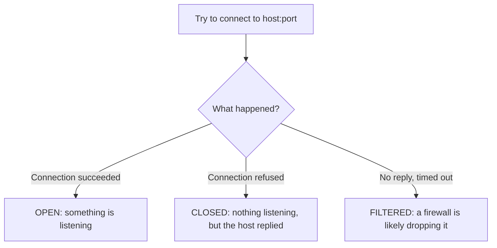

# Lab 5.1: Pure-Python Port Scanner

**Month:** 5 (Python for Security) · **Pattern family:** Tooling and automation · **Time budget:** 10 to 12 hours · **Lab attempt floor:** 90 minutes · **AI guidance:** Drafting pattern unlocked. You design and spec the tool; AI may draft individual functions you have already defined. AI Provenance log required. · **Builds on:** Month 3 (ports, the TCP handshake), Month 4 (you watched a handshake in Wireshark), and the Month 5 README.

## Why this lab exists

You used `nmap` in Month 4 and treated it as a black box. This lab opens the box. By building a TCP port scanner yourself, you learn what a port scan really is: your computer tries to start a connection to each port, and the result tells you whether something is listening. Once you have built the slow, obvious version and felt why it is slow, "make it concurrent" stops being a buzzword and becomes a thing you reach for on purpose.

This is also your first AI-assisted build. The goal is not to get a scanner; `nmap` already exists. The goal is to practice the **drafting pattern** (you spec, AI drafts, you verify) on a tool simple enough that you can check every line. Get the discipline solid here, before the tools get complicated.

**Recall first, from memory:** in Month 4 you watched a TCP three-way handshake in Wireshark. What are the three packets, and which side sends each? (You will use this directly: a port is "open" when that handshake can complete.)

## Read this first: scope

You scan only hosts you own: `127.0.0.1` (your own machine), your own VMs on your own network, or a target you have explicit written permission to test. Scanning anything else, even "just to see if it works," can be a crime under the CFAA. This whole lab runs against `localhost` and your own Ubuntu VM. Before you run the tool against anything, write one line in your notebook naming the target and why you are allowed to scan it. This habit is not paperwork; it is the difference between a security professional and a defendant.

## Learning objectives

By the end of this lab you can:

- **Explain** what "open," "closed," and "filtered" mean at the level of a connection attempt.
- **Build** a Python command-line tool that scans a host and a range of ports and reports results as text and JSON.
- **Explain** why a one-at-a-time scanner is slow, and **make** a concurrent version that is meaningfully faster.
- **Compare** your tool's results to `nmap`'s and explain every difference.
- **Apply and document** the drafting pattern: spec first, AI draft, then verify.

## The three outcomes

A scan of one port has three possible results, not two. Hold this picture:


*Notice: "refused" and "timed out" are different answers. The most common beginner bug, and the most common AI-draft bug, is treating them as the same thing.*

## AI guidance for this lab

This is the worked example of the drafting pattern. Follow it exactly; later months assume you have it.

- **Allowed:** after you have written a function's spec and its tests yourself, ask AI to draft that one function. Then refactor it into your style, run your tests, and confirm you understand every line.
- **Not allowed:** asking AI to design the tool, pick the concurrency approach, or write the whole thing. Pasting AI output you have not tested. Keeping AI code you cannot explain.
- **Logged:** every AI interaction goes in your AI Provenance section, including the times AI was wrong and you threw its answer out. Those are the most useful entries.

## Tasks

### Task 1: Spec and tests, before any AI (90 minutes)

With no AI, write a spec for your scanner: inputs (host, port range, timeout, output format), outputs, and behavior on edge cases (a closed port, a filtered port that times out, a bad host, a privileged port). Write the function signatures you intend to build. Then write your tests as plain "input, expected output" pairs.

**Checkpoint:** you have `SPEC.md` and a test file in `security-tools/port-scanner/`, both written before AI was involved.
**If not:** if you are tempted to ask AI to "help you spec it," stop; the floor applies to this task. Sit with the design for the full 90 minutes. A spec you wrote is the thing that lets you judge AI's draft later.

### Task 2: Learn the drafting pattern (gradual release)

The new skill this month is not "write a scanner." It is "use AI to draft code you can fully defend." You will learn that loop in three stages.

#### Stage 1 - Worked example (I do)

Study this complete worked example of the loop on a throwaway helper that has nothing to do with scanning, so you can focus on the method, not the topic. Suppose you need a function that turns a number of seconds into text like `1h 02m 03s`.

1. **You spec it:** "input: an integer `seconds` >= 0. Output: a string `Hh MMm SSs`, minutes and seconds zero-padded to two digits. `3723` becomes `1h 02m 03s`; `0` becomes `0h 00m 00s`."
2. **You write tests first:** `0 -> "0h 00m 00s"`, `61 -> "0h 01m 01s"`, `3723 -> "1h 02m 03s"`.
3. **You ask AI to draft it,** giving it your spec verbatim.
4. **You verify:** run your three tests. Suppose the draft returns `"1h 2m 3s"` for `3723`. That fails your zero-padding test. You found a real bug, because you wrote the test first.
5. **You fix and own it:** correct the formatting, re-run, all green. Now you can explain every line.

That five-step loop, spec, tests, draft, verify, own, is the entire skill. Notice you never trusted the draft; your own tests judged it.

**Checkpoint:** you can state the five steps of the loop from memory.
**If not:** re-read the example and write the five steps as a list in your notebook before moving on. You will use them in every AI month from here.

#### Stage 2 - Faded practice (we do)

Now run the loop yourself on the first real scanner function, `check_port(host, port, timeout)`, which returns `"open"`, `"closed"`, or `"filtered"`. The scaffold below is the spec and the test targets; you write the prompt, get the draft, and verify it. The function body is yours to obtain and own; this file will not hand it to you.

```
# check_port(host, port, timeout) -> "open" | "closed" | "filtered"
# Spec you are filling in:
#   - tries a TCP connection to host:port, giving up after `timeout` seconds
#   - connection succeeds            -> "open"
#   - connection actively refused    -> "closed"
#   - times out with no reply        -> "filtered"
# Tests to make pass (pick real ports on your own machine/VM):
#   - a port you know is open   -> "open"
#   - a port you know is closed -> "closed"
#   - a firewalled host/port    -> "filtered"
```

**Checkpoint:** your `check_port` returns the correct one of three values for an open, a closed, and a filtered case on your own hosts.
**If not:** if "closed" and "filtered" both come back the same, your code (or AI's draft) is catching every exception the same way. Look at which exception means "refused" versus which means "timed out"; they are different, and the diagram above is your guide.

#### Stage 3 - Independent (you do)

No scaffolding now. Using the drafting loop where it helps, build the rest of the tool yourself: the loop over a port range, a concurrent version (a thread pool or `asyncio`; you choose and justify it), an `argparse` command line (`host`, `--ports`, `--timeout`, `--json`), and the JSON output. Then run `nmap` against the same host and range, compare, and explain every difference in writing (for example, nmap's default scan type differs from your full-connect scan).

**Checkpoint:** `python port_scanner.py 127.0.0.1 --ports 1-1024` prints a readable table; `--json` produces output that `python -m json.tool` accepts; your concurrent version gives the same results as the serial one but faster; `nmap-comparison.md` explains each difference.
**If not:** if the concurrent version drops or duplicates results, that is a shared-state bug; the tests you wrote in Task 1 are what catch it. If your results disagree with nmap on many ports, check whether a host firewall is filtering, and whether you and nmap are scanning the same range.

### Task 3: Notebook entry with AI Provenance (60 minutes)

Write `.tutor/notebook/lab-01-python-port-scanner.md` with the standard sections plus AI Provenance:

- **Pre-flight check** for the scanner: what a connect scan does on the wire, what it leaves in the target's logs, what could go wrong (scanning the wrong host), and the authorization scope.
- **Concept naming.**
- **Evidence:** serial-versus-concurrent timing, the nmap comparison, key code references.
- **Five-question debrief.**
- **AI Provenance:** which AI tool, what you asked, what it generated, how you verified each piece, and what you discarded. Be specific. "Asked for `check_port`; the draft returned 'filtered' for a refused connection, which is wrong; I split the refused case (ConnectionRefusedError) from the timeout case" is a real entry. "Used AI for the scanner" is not.

**Checkpoint:** the entry is committed with all sections, including a substantive AI Provenance section.
**If not:** if your provenance section is one line, the tutor will reject it. The test is whether a reader could redo your AI conversation from your notes.

## Definition of Done

- `SPEC.md` and tests were written before AI involvement.
- `port_scanner.py` classifies open, closed, and filtered correctly on your own hosts; serial and concurrent agree; `--json` is valid; `nmap-comparison.md` explains the differences.
- The tool lives in `security-tools/port-scanner/` with a README that leads with the scope warning, and tests pass from one command.
- The notebook entry is committed with a real AI Provenance section.

Self-verify (run from the tool folder; should print `OK`):

```zsh
python port_scanner.py 127.0.0.1 --ports 1-1024 --json | python -m json.tool >/dev/null && echo OK
```

**Self-explain:** in one sentence, why are "closed" and "filtered" different answers, and what does each tell you about the host?

## Stretch goals

1. Add a `--top-ports N` option that scans only the N most common ports (find a public list of common ports; do not hardcode a guess).
2. Add a banner grab on open ports (read the first line the service sends) and note why that adds risk and noise.
3. Compare your thread-pool version to an `asyncio` version and measure which is faster for 1,000 ports, and explain the result.

## Troubleshooting

- **Every port reports "filtered."** Your code is timing out on everything, often because the host is down or a firewall blocks all probes. Confirm you can reach the host at all (`ping`, or a known-open port).
- **`closed` and `filtered` look identical.** You are treating all exceptions the same. Separate "connection refused" from "timed out." This is the lab's core lesson.
- **The concurrent version is slower, not faster.** Too many threads can thrash. Cap the pool size, and remember that for network-bound work, hundreds of threads rarely beats a sensible limit.
- **`--json` output is rejected by `json.tool`.** Usually a trailing comma or an unquoted value. Build the JSON with Python's `json` module rather than by gluing strings.

## Time budget breakdown

- Task 1: 90 minutes
- Task 2: 5 to 6 hours (Stage 1 ~30 min, Stage 2 ~90 min, Stage 3 the rest)
- Task 3: 60 minutes
- Buffer: 90 minutes

Total: 9 to 11 hours.

## Resources

- The Python `socket`, `argparse`, and `json` standard-library docs (primary source).
- The Python `concurrent.futures` or `asyncio` docs, depending on your choice.
- `man nmap`, the part that distinguishes a connect scan from a SYN scan.
- Your own Month 3 and Month 4 notebook entries on the TCP handshake.
