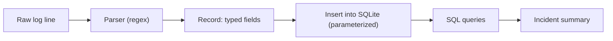

# Lab 5.2: Log Parser with SQLite Backend

**Month:** 5 (Python for Security) · **Pattern family:** Tooling and automation · **Time budget:** 12 to 14 hours · **Lab attempt floor:** 90 minutes · **AI guidance:** Drafting pattern (see Lab 5.1). AI may draft a function after you spec and test it. AI Provenance log required. Data-handling rule below. · **Builds on:** Lab 5.1 (the drafting loop), Month 2 (regex), Month 4 (you read logs as an analyst).

## Why this lab exists

Logs are the raw material of defensive work. There is always too much of them to read by eye. The skill that scales is turning a pile of messy log lines into a database you can query, then asking it questions.

This lab builds that pipeline. It also gives you your first real **SQL** (the language for asking a database questions), through Python's `sqlite3` module, before Month 7 teaches SQL head-on. By the end you will answer a real investigative question (which IP made the most failed requests, and when did its behavior change) with a query instead of a guess.

**Recall first, from memory:** in Lab 5.1 you used AI to draft `check_port`, and your own tests caught a bug before you trusted the draft. What were the five steps of the drafting loop? (You will run that same loop here, on a parser instead of a scanner.)

## The data-handling rule

Read this before you pick a log file. Use **sample logs**: a public dataset, or logs you make yourself against your own VM. You may use logs from your own server. But you never paste them into a public AI service (see `AI-ETHICS.md`, rule 4).

Why? Real logs hold IP addresses, user agents, and paths. That is sensitive, even on your own machine. The drafting pattern works on your **code**, not your **data**. You can get AI help with the parser without ever showing AI a single log line.

## Learning objectives

By the end of this lab you can:

- **Parse** a semi-structured log line into typed fields with a regex, streaming the file instead of loading it whole.
- **Design** a small SQLite schema and **load** records into it with parameterized inserts.
- **Answer** investigative questions with SQL: aggregation, filtering, ordering, and time bucketing.
- **Write** an incident summary from query results, aimed at the next analyst on shift.
- **Explain** why parameterized queries matter, in security terms, before Month 7 says "SQL injection."

## The pipeline

Here is the shape of what you build. Four stages, each feeding the next:


*Notice: the regex turns text into structured fields, and only then can SQL do the heavy lifting. A bad parser poisons everything downstream, so you test it first.*

## AI guidance for this lab

Same drafting pattern as Lab 5.1. You spec and test a function first; only then may AI draft its body.

- **Allowed:** after you write a function's spec and tests yourself, ask AI to draft that one function. Refactor it into your style, run your tests, confirm you understand every line.
- **Not allowed:** asking AI to design the schema, pick the regex, or write the pipeline. Pasting AI output you have not tested. Keeping code you cannot explain. Showing AI any log data.
- **Logged:** every AI interaction goes in your AI Provenance section, including the data-handling rule: state plainly that you never showed AI a log line, and how you still got drafting help.

## Tasks

### Task 1: Parse one line (gradual release)

The new skill this lab is **regex parsing**: turning one messy line of text into clean, named fields. You will learn it in three stages, then apply the drafting loop from Lab 5.1 to the real parser.

#### Stage 1 - Worked example (I do)

Study this complete example on a throwaway format that is *not* your log parser, so you can focus on the regex technique, not the topic. Suppose you have lines like:

```
user=alice action=login result=ok
user=bob action=delete result=denied
```

You want each line as a dictionary: `{"user": "alice", "action": "login", "result": "ok"}`. Here is the full worked solution:

```python
import re

# One named group per field. \w+ matches letters, digits, underscore.
LINE = re.compile(r"user=(?P<user>\w+) action=(?P<action>\w+) result=(?P<result>\w+)")

def parse_kv(line):
    m = LINE.match(line)
    if m is None:
        return None          # the line did not fit the format
    return m.groupdict()     # named groups become a dict

print(parse_kv("user=alice action=login result=ok"))
# {'user': 'alice', 'action': 'login', 'result': 'ok'}
print(parse_kv("garbage line"))
# None
```

Read every line. `(?P<user>\w+)` is a **named capture group**: it grabs text and labels it `user`. `match` returns `None` when the line does not fit, so you can count failures instead of crashing. `groupdict()` turns the named groups into a dictionary.

**Checkpoint:** you can point to the named group, the failure path (`None`), and the line that turns groups into a dict.
**If not:** re-read the Python `re` docs section on named groups, then change the format above (add a `time=` field) and adjust the regex until it parses. Practice on the throwaway, not on your real log.

#### Stage 2 - Faded practice (we do)

Now run the drafting loop on the *real* parser. The scaffold below is the spec and the test targets. You write the prompt, get the draft, and verify it. The function body is yours to obtain and own; this file will not hand it to you.

```python
# parse_log_line(line) -> dict | None
# Spec you are filling in (Apache combined OR nginx default; pick one):
#   - returns a dict with: ip, timestamp, method, path, status (int), size (int), user_agent
#   - status and size are integers, not strings
#   - a line that does not fit the format -> None (so the caller can count it)
# Tests to make pass (write these BEFORE you ask AI for the body):
#   - one normal line you copied from your sample log -> the dict you expect
#   - one line with a "-" size field            -> size handled (0 or None, your choice; document it)
#   - one deliberately malformed line           -> None
```

**Checkpoint:** your `parse_log_line` returns the right dict for a normal line, handles the `-` size, and returns `None` for the malformed one. Your hand-picked test lines, including the malformed one, are committed.
**If not:** if a real line returns `None`, your regex is too strict; compare it field by field against an actual line from your sample. The Apache and nginx format specs (in the reading) name every field in order. Treat AI's first regex as a draft your tests must approve, exactly as in Lab 5.1.

#### Stage 3 - Independent (you do)

No scaffolding now. Using the drafting loop where it helps, build the rest of the pipeline yourself:

- **Stream the file.** Read it line by line (`for line in f:`), not all at once. Skip and **count** lines you cannot parse, rather than crashing. A parser that hides its failures is worse than one that crashes loudly.
- **Design a schema and load it.** Create a SQLite table for your records. Insert with **parameterized** inserts (`cur.execute("INSERT ... VALUES (?, ?, ?)", row)`), never by gluing the values into the SQL string. Add an index on a column you query often.
- **Ask six questions.** Write at least six SQL queries, each with the plain-English question above it: top source IPs by request count, 4xx/5xx bursts, requests to suspicious paths, traffic in time buckets, the user agents of the noisiest IP, and one of your own.

**Checkpoint:** the pipeline runs end to end on your sample log, prints how many lines it could not parse, and your six queries return rows. The inserts are parameterized.
**If not:** if the load is slow or runs out of memory on a big file, you are not streaming; loop over the file object directly. If a query errors, run it in the `sqlite3` shell first to isolate the SQL from your Python.

### Task 2: Why parameterized queries (15 minutes, no code)

Stop and write, in your notebook, why you used `?` placeholders instead of building the SQL string by hand. You will meet this again in Month 7 under its real name. Here is the reason in advance:

> **Common misconception.** "Building the SQL string with an f-string is fine; it works on my test data."
> **Reality.** It works until a value contains SQL. A path like `/'; DROP TABLE logs;--` glued into your query becomes a command. A parameterized query keeps data and code separate, so a value can never be read as SQL. That gap is **SQL injection**, the bug Month 7 names.

**Checkpoint:** your notebook has two or three sentences in your own words on why `?` is safer than an f-string.
**If not:** re-read the misconception box above and the `sqlite3` docs on parameter substitution, then try again from memory.

### Task 3: The incident summary (2 hours)

Use your query results to write a one-page **incident summary**, as if for the analyst on the next shift. Cover: what you see in this log, what is probably benign, what needs a closer look, and what you would query next. This is a writing task as much as a technical one. The analyst reading it has two minutes.

**Checkpoint:** an `incident-summary.md` a peer could act on without re-running your queries.
**If not:** if your summary just lists query outputs, it is not a summary; it is a data dump. Lead with the finding ("one IP made 80% of the failed logins, starting at 02:14"), then the evidence.

### Task 4: Notebook entry with AI Provenance (90 minutes)

Write `.tutor/notebook/lab-02-log-parser-sqlite.md` with the standard sections plus AI Provenance:

- **Pre-flight check** for the pipeline: what the parser does, what data the log holds, what could go wrong (a regex that silently drops lines), and the data-handling rule.
- **Concept naming.**
- **Evidence:** the parse-failure count, your six queries and their results, key code references.
- **Five-question debrief.**
- **AI Provenance:** which AI tool, what you asked, what it generated, how you verified each piece, and what you discarded. Be explicit that you showed AI no log data, and how you still got drafting help on the parser. "Asked for `parse_log_line`; the draft made `status` a string, so my int test failed; I cast it" is a real entry. "Used AI for the parser" is not.

**Checkpoint:** the entry is committed with all sections, including a substantive AI Provenance section that addresses the data-handling rule directly.
**If not:** if your provenance is one line, the tutor will reject it. The test is whether a reader could redo your AI conversation, and confirm you kept your data private, from your notes.

## Definition of Done

- Your hand-picked test lines (including a malformed one) were committed, and the parser returns `None` on lines it cannot parse and counts them.
- The pipeline runs end to end on a sample log; inserts are parameterized; an index exists; the six labelled queries return results.
- `incident-summary.md` stands on its own.
- The tool lives in `security-tools/log-parser/` with a README, and tests pass from one command.
- The notebook entry is committed with a real AI Provenance section.

Self-verify (run from the tool folder after loading your sample; should print `OK`):

```zsh
python -c "import sqlite3; n=sqlite3.connect('logs.db').execute('SELECT count(*) FROM logs').fetchone()[0]; print('OK' if n>0 else 'EMPTY')"
```

**Self-explain:** in one sentence, why does a parameterized query stop a malicious value from being run as SQL?

## Stretch goals

1. Add a `--since` and `--until` filter so a query can scope to a time window, and explain how your timestamps are stored to make that comparison work.
2. Detect a "behavior change" automatically: bucket one IP's requests by hour and flag the bucket where its rate jumps.
3. Compare your streaming loader to one that reads the whole file with `f.read()`, on a log of at least 100 MB, and record the memory difference.
4. Add a second log format (if you did Apache, add nginx) behind the same schema, and note what changed in the parser and what did not.

## Troubleshooting

- **The regex matches most lines but silently drops some.** That is exactly why Task 1 counts failures. Print a few dropped lines and widen the regex one field at a time. A parser that hides its failures is worse than one that crashes.
- **AI drafted an insert with an f-string.** This is the SQL-injection anti-pattern Month 7 names. Catching it in your own tool is the lesson. Switch to `?` placeholders.
- **The loader is slow or runs out of memory.** You are loading the whole file. Loop over the file object line by line so only one line is in memory at a time.
- **A query returns nothing.** Run the same SQL in the `sqlite3` command-line shell against `logs.db` to separate a SQL mistake from a Python mistake.

## Time budget breakdown

- Task 1: 7 to 8 hours (Stage 1 ~30 min, Stage 2 ~2 h, Stage 3 the rest)
- Task 2: 15 minutes
- Task 3: 2 hours
- Task 4: 90 minutes
- Buffer: 1 hour

Total: 12 to 14 hours.

## Resources

- The Python `sqlite3` and `re` standard-library docs (primary source).
- The Apache combined log format and the nginx default log format specifications (primary sources).
- A public web-server log dataset, or logs you generate against your own VM.
- Your own Lab 5.1 notebook entry on the drafting loop.
