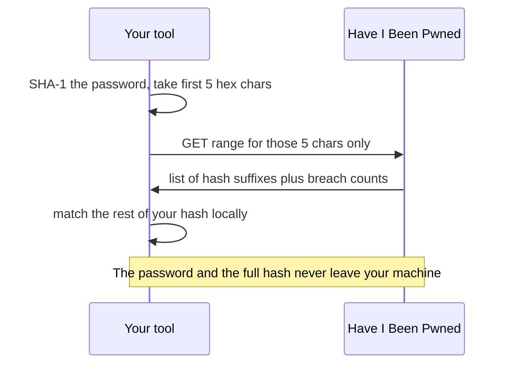

# Lab 5.3: Password Strength Tester

**Month:** 5 (Python for Security) · **Pattern family:** Tooling and automation · **Time budget:** 8 to 10 hours · **Lab attempt floor:** 90 minutes · **AI guidance:** Drafting pattern (see Lab 5.1). AI may draft a function after you spec and test it. AI Provenance log required. Data-handling rule below. · **Builds on:** Lab 5.1 (the drafting loop), and the Month 5 reading on `hashlib` and `requests`.

## Why this lab exists

"Strong password" is a phrase everyone uses and few can define. This lab makes you define it in code: length, character variety, entropy, whether it is a common password, and whether it has shown up in a known breach.

The breach check is the heart of the lab. It teaches you **k-anonymity**, one of the most elegant privacy designs in real use. And it teaches it by making you respect it: you will check a password against Have I Been Pwned (a public breach database) without ever sending the password, or even its full hash, anywhere.

**Recall first, from memory:** in Lab 5.1 your own tests caught an AI draft that labeled a refused port the same as a filtered one. What were the five steps of the drafting loop? (Here, AI tends to get the breach check subtly wrong in the same way: a draft that looks right but leaks the hash.)

## The data-handling rule

Read this before you write any test. Do not test real passwords you actually use. Never hardcode a real password into the tool or its tests. Use **synthetic** test passwords (ones you make up for testing).

The Have I Been Pwned range API is built so you never transmit a full password hash. You will build it that way and understand why. Sending a full password, or a full hash, to any service, even one you trust, is the exact habit this lab trains you out of.

## Learning objectives

By the end of this lab you can:

- **Compute** Shannon entropy for a string and **explain** what it does and does not tell you about strength.
- **Check** a password against a common-password list efficiently.
- **Implement** the Have I Been Pwned k-anonymity range check: hash with SHA-1, send only the first five hex characters, match the returned suffixes locally.
- **Explain** k-anonymity: why sending a hash prefix protects the password while still answering the question.
- **Produce** a tool that scores a password and explains the score, never just emitting a number.

## What crosses the network (and what never does)

This is the picture to hold while you build the breach check:


*Notice: only five characters cross to the server. The match happens on your machine. That is k-anonymity: the server answers "is it breached" without ever learning which password you asked about.*

## AI guidance for this lab

Same drafting pattern as Lab 5.1. You spec and test a function first; only then may AI draft its body.

- **Allowed:** after you write a function's spec and tests yourself, ask AI to draft that one function. Refactor it into your style, run your tests, confirm you understand every line.
- **Not allowed:** asking AI to design the scorer or pick the signals. Pasting AI output you have not tested. Keeping code you cannot explain.
- **Logged:** every AI interaction goes in your AI Provenance section. Watch the breach check especially: note whether AI's draft sent more than the five-character prefix. That is the line AI most often gets wrong.

## Tasks

### Task 1: Spec and entropy, before the API (2 hours)

With no AI, spec the tool and build the local-only checks: length, character-class variety, and **Shannon entropy** (a number measuring how unpredictable a string is). Write tests with synthetic passwords spanning weak to strong. Decide and document how you weight each signal. The floor applies to the spec.

**Checkpoint:** a spec and a local scorer with passing tests, all written before AI was involved.
**If not:** if you are tempted to ask AI to "help spec it," stop; the floor applies. A spec you wrote yourself is what lets you judge AI's draft later, exactly as in Lab 5.1.

### Task 2: Dictionary check (90 minutes)

Add a check against a list of common passwords (a public top-N list). Make the lookup fast: load the list into a **set** (instant membership test), not a list you scan linearly. Decide how a dictionary hit changes the score, and justify it.

**Checkpoint:** the check flags a common password and stays fast on a large list.
**If not:** if the check is slow, you are scanning a list. Build a `set` once at startup and test membership with `in`.

### Task 3: The k-anonymity breach check (gradual release)

This is the new skill of the lab. You will learn the matching idea on a throwaway example, then run the drafting loop on the real check.

#### Stage 1 - Worked example (I do)

Study this complete example. It is pure logic: no hashing, no network, so you can focus on the *match*, which is the part people get wrong. The real API returns lines like `0018A45C4D1DEF81644B54AB7F969B88D65:1` (a hash suffix, a colon, a breach count). Suppose you already have that list and a target suffix:

```python
def count_for_suffix(lines, target_suffix):
    """lines: list of 'SUFFIX:COUNT' strings. Return the count for target_suffix, or 0."""
    for line in lines:
        suffix, count = line.split(":")
        if suffix == target_suffix:      # exact match on the rest of the hash
            return int(count)
    return 0                             # not found means not in this breach set

sample = ["00FA1...:3", "0018A45C4D1DEF81644B54AB7F969B88D65:42"]
print(count_for_suffix(sample, "0018A45C4D1DEF81644B54AB7F969B88D65"))  # 42
print(count_for_suffix(sample, "DEADBEEF"))                              # 0
```

Read every line. The function never sees the password or the full hash; it only matches a **suffix** against a list. "Not found" means the password is not in that breach set. This is the local half of k-anonymity.

**Checkpoint:** you can explain why this function needs neither the password nor the full hash, only the suffix.
**If not:** re-read the sequence diagram above. The server sent suffixes; your job is to find yours among them. Practice on this throwaway list before touching the network.

#### Stage 2 - Faded practice (we do)

Now run the drafting loop on the *real* check. The scaffold is the spec and the test targets. You write the prompt, get the draft, and verify it. The body is yours to obtain and own; this file will not hand it to you.

```python
# breach_count(password) -> int  (how many breaches the password appears in; 0 if none)
# Spec you are filling in:
#   - SHA-1 the password, uppercase hex
#   - prefix = first 5 hex chars ; suffix = the rest
#   - GET the range for `prefix` ONLY (the full hash must never be sent)
#   - search the returned suffixes for `suffix`; return its count, else 0
#   - set a timeout on the request; if the API is unreachable, fail gracefully (your choice; document it)
# Tests to make pass (write these BEFORE you ask AI for the body):
#   - a synthetic password you know is breached    -> count > 0
#   - a long random synthetic password             -> 0
#   - (assert this yourself) the value sent over the network is exactly 5 characters
```

**Checkpoint:** the check reports a count for a known-breached synthetic password and 0 for a random one, and you have confirmed only the five-character prefix is sent.
**If not:** if your draft sends the full hash or the password, that defeats the whole mechanism, and it is the exact bug AI tends to introduce. Re-read your draft against the spec line by line: the request must carry the prefix only. Treat the draft as something your tests must approve.

#### Stage 3 - Independent (you do)

No scaffolding now. Combine the signals into a single score with a human-readable explanation, for example: `weak: 8 characters, found in the common-password list, and seen in 12,000 breaches`. The tool must always explain its score, never just print a number. Finalize tests and the README, including the data-handling rule.

**Checkpoint:** `python password_tester.py` (reading a synthetic password however your spec defined input) prints a score and a plain-English reason; tests pass; the README carries the rule about never testing real passwords.
**If not:** if entropy alone rates `P@ssw0rd1!` as strong, your signals are not combined. That string is in every dictionary; the dictionary and breach checks must be able to override a high entropy score. No single signal is enough, which is the point of the lab.

### Task 4: Notebook entry with AI Provenance (60 minutes)

Write `.tutor/notebook/lab-03-password-strength-tester.md` with the standard sections plus AI Provenance:

- **Pre-flight check:** what the breach check sends and what it does not, and why that preserves privacy.
- **Concept naming.**
- **Evidence:** the entropy of a few synthetic passwords, the breach-check results, key code references.
- **Five-question debrief.**
- **AI Provenance:** which AI tool, what you asked, what it generated, how you verified each piece, and what you discarded. Note specifically whether AI's draft of the k-anonymity check correctly avoided sending the full hash. This is the exact place AI gets it subtly wrong. "Asked for `breach_count`; the draft sent the whole hash; I changed it to send the five-char prefix and match the suffix locally" is a real entry.

**Checkpoint:** the entry is committed with all sections and a substantive AI Provenance section.
**If not:** if your provenance is one line, the tutor will reject it. The test is whether a reader could redo your AI conversation, and confirm your check never leaked the password, from your notes.

## Definition of Done

- A spec and the local scorer were written before AI involvement; tests pass.
- The dictionary check is fast (set-based) and flags common passwords.
- The breach check reports a count for a breached synthetic password and 0 for a random one, and provably sends only the five-character prefix.
- The tool scores and explains, never emitting a bare number.
- The tool lives in `security-tools/password-tester/` with a README carrying the data-handling rule, and tests pass from one command.
- The notebook entry is committed with a real AI Provenance section.

Self-verify (run from the tool folder; should print `OK` when the breach check returns a non-negative integer for a synthetic input):

```zsh
python -c "from password_tester import breach_count; print('OK' if breach_count('correcthorsebatterystaple') >= 0 else 'BAD')"
```

**Self-explain:** in one sentence, why does sending only a five-character hash prefix let the server answer "is it breached" without ever learning your password?

## Stretch goals

1. Add a strength estimate in time-to-crack terms (a rough guesses-per-second model) and explain why that number is an estimate, not a guarantee.
2. Cache the range responses you fetch, so re-checking the same prefix does not hit the network twice, and note the privacy tradeoff of caching.
3. Add a flag that scores a whole file of synthetic passwords and reports the weakest, while still never sending more than each prefix.
4. Compare Shannon entropy against a simple zxcvbn-style pattern check on the same passwords, and explain where they disagree.

## Troubleshooting

- **The breach check sends the full hash or the password.** This defeats k-anonymity and is the lab's core failure mode. The request must carry only the first five hex characters; the rest is matched locally.
- **Entropy rates an obvious password as strong.** Entropy measures unpredictability of characters, not whether the string is a known password. Combine it with the dictionary and breach checks; let them override.
- **The request hangs.** You did not set a timeout. Every network request gets a timeout, the same rule as the scanner in Lab 5.1.
- **The dictionary check is slow.** You are scanning a list. Load the list into a `set` once and test membership with `in`.

## Time budget breakdown

- Task 1: 2 hours
- Task 2: 90 minutes
- Task 3: 3 to 4 hours (Stage 1 ~30 min, Stage 2 ~90 min, Stage 3 the rest)
- Task 4: 60 minutes
- Buffer: 1 hour

Total: 8 to 10 hours.

## Resources

- The Python `hashlib` and `requests` documentation (primary source).
- The Have I Been Pwned range API documentation (primary source for the k-anonymity model). Read how the prefix mechanism works before you implement it.
- A public common-password list (a top-N list distributed for defensive use).
- Your own Lab 5.1 notebook entry on the drafting loop.
