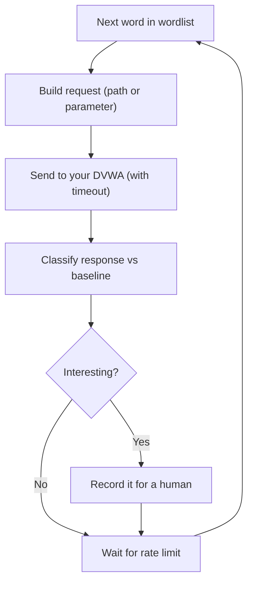

# Lab 5.4: HTTP Fuzzer (Lab Only)

**Month:** 5 (Python for Security) · **Pattern family:** Tooling and automation · **Time budget:** 10 to 12 hours · **Lab attempt floor:** 90 minutes · **AI guidance:** Drafting pattern (see Lab 5.1). AI may draft a function after you spec and test it. AI Provenance log required. · **Builds on:** Labs 5.1 to 5.3 (the drafting loop, `requests`), and a local DVWA install on a VM you own.

## Read this before anything else: scope

This tool sends many crafted HTTP requests to a target. Against a system you do not own, that is unauthorized access. The traffic can be a crime under the CFAA and laws like it.

You run this tool against **one target only: your own DVWA install, on your own VM.** Not a website you use. Not a "test" endpoint you found. Not a bug-bounty target (their scope rules are narrower than they look, and a fuzzer is exactly the tool that wanders out of scope by accident). Your own DVWA, on your own machine, full stop.

The tool you build is **dual-use**: the same code that exercises your DVWA would attack a stranger's site. That is precisely why the discipline matters. The tool's README, and the `SAFETY.md` in your `security-tools/` repo, both carry this warning, up front. A security professional who ships a fuzzer without that warning is shipping a liability. Packaging power responsibly is part of this lab.

**DVWA** is the Damn Vulnerable Web Application: a practice site, built to be attacked, that you run yourself. If you have not installed it, do that first (a local Docker container or a LAMP install on your Ubuntu VM). Confirm you can reach it at a localhost address before you build anything.

## Why this lab exists

**Fuzzing** means sending many systematic, often malformed, inputs to find where software misbehaves. It is foundational to both offense and defense. Building a small HTTP fuzzer teaches you how requests are built, how a response signals "interesting" (status codes, content-length changes, timing, error strings), and how to be systematic instead of random.

It also sets up Month 7, where you will use mature tools like Burp Suite against the same DVWA and recognize what they do under the hood.

**Recall first, from memory:** in Lab 5.1 you set a timeout on every connection so a slow host could not hang your scanner. Why will this fuzzer also need a timeout *and* a rate limit? (One bounds each request; the other bounds how fast you fire them, so you do not knock over your own VM.)

## Learning objectives

By the end of this lab you can:

- **Construct and send** HTTP requests programmatically with `requests`, controlling method, headers, parameters, and body.
- **Build** a directory fuzzer and a parameter fuzzer that work through a wordlist and flag responses worth a human's attention.
- **Define** "interesting response" operationally (status code, content-length change, timing, error signatures), not by eye.
- **Rate-limit and time-out** your own tool so it does not accidentally take down your own VM, and **explain** why that courtesy is also tradecraft.
- **Package** a dual-use tool with the scope warning a responsible author includes.

## The fuzzing loop

Here is the loop your fuzzer runs for every word in the wordlist:


*Notice: the rate-limit wait happens every iteration, interesting or not. That pause is what keeps your own VM alive and your tool polite.*

## AI guidance for this lab

Same drafting pattern as Lab 5.1. You spec and test a function first; only then may AI draft its body.

- **Allowed:** after you write a function's spec and tests yourself, ask AI to draft that one function. Refactor it into your style, run your tests, confirm you understand every line.
- **Not allowed:** asking AI to design the fuzzer or pick the "interesting" rules. Pasting AI output you have not tested. Keeping code you cannot explain.
- **Logged:** every AI interaction goes in your AI Provenance section. Note especially that AI tends to draft a fuzzer with no timeout and no rate limit, because the simplest version omits them. Adding them back is part of owning the tool.

## Tasks

### Task 1: Spec, wordlist, and the "interesting" definition (2 hours)

With no AI, spec the fuzzer and decide, in writing, what makes a response interesting. Choose or assemble a small wordlist for directory fuzzing. Define your rate limit and timeout. This design work is the floor task.

**Checkpoint:** a spec, a wordlist, and a written "interesting response" definition, all before AI was involved.
**If not:** if you cannot define "interesting" without AI, you are not ready to let AI draft it. Sit with the design for the full 90 minutes; a definition you wrote is what lets you judge the draft, exactly as in Lab 5.1.

### Task 2: Classify a response (gradual release)

The new skill of this lab is **classifying a response**: deciding, by rule, whether a reply is worth a human's attention. You will learn it on a throwaway example, then run the drafting loop on the real fuzzer.

#### Stage 1 - Worked example (I do)

Study this complete example. It does no network call: it classifies a response that is already in hand, so you focus on the *rule*, not on `requests`. Suppose a baseline 404 page is 512 bytes, and you represent each response as a small dictionary:

```python
def is_interesting(resp, baseline_len, baseline_status=404):
    """resp: dict with 'status' and 'length'. Return True if it deserves a human look."""
    if resp["status"] != baseline_status:        # a different status than the boring case
        return True
    if abs(resp["length"] - baseline_len) > 50:   # same status, but the body size moved
        return True
    return False

baseline = 512
print(is_interesting({"status": 200, "length": 1800}, baseline))  # True (status differs)
print(is_interesting({"status": 404, "length": 515},  baseline))  # False (within 50 bytes)
print(is_interesting({"status": 404, "length": 900},  baseline))  # True (body size jumped)
```

Read every line. "Interesting" is a **rule against a baseline**, not a guess. A 404 of the normal size is boring; a 404 whose body suddenly grew is worth a look. Defining this in code is what makes a fuzzer systematic instead of random.

**Checkpoint:** you can state, in one sentence, the two conditions that make a response interesting here.
**If not:** re-read your own Task 1 definition. If yours differs from this example, that is fine; the point is that it is a written rule, not an eyeball judgment.

#### Stage 2 - Faded practice (we do)

Now run the drafting loop on the *real* directory fuzzer. The scaffold is the spec and the test targets. You write the prompt, get the draft, and verify it. The body is yours to obtain and own; this file will not hand it to you.

```python
# fuzz_dir(base_url, wordlist, rate_limit, timeout) -> list of interesting findings
# Spec you are filling in:
#   - for each word, request base_url + "/" + word against YOUR DVWA only
#   - every request carries `timeout`; wait `rate_limit` seconds between requests
#   - classify each response against a baseline (reuse your is_interesting rule)
#   - return only the interesting ones (path, status, length)
# Tests to make pass (write these BEFORE you ask AI for the body):
#   - a wordlist with a path you KNOW exists on your DVWA  -> that path is returned
#   - a wordlist of nonsense words                         -> returns few or none (just 404s)
#   - (assert this yourself) there is a measurable delay between requests (rate limit works)
```

**Checkpoint:** run against your DVWA, the fuzzer surfaces a real path and separates it from 404s, and the rate-limit delay is observable.
**If not:** if everything is "interesting," your baseline is wrong; capture the 404 baseline first, then compare. If there is no delay, the draft dropped the rate limit, which is the exact omission AI makes. Add it back; you own the tool.

#### Stage 3 - Independent (you do)

No scaffolding now. Extend the tool to fuzz a **parameter** on a known endpoint of your DVWA: send a list of payloads and flag responses that differ meaningfully from the baseline. You are not exploiting anything yet; you are finding where input changes behavior. Month 7 turns these signals into findings. Report findings as a table and as JSON.

**Checkpoint:** the parameter fuzzer identifies at least one endpoint and parameter on your DVWA where specific inputs change the response, with the baseline-versus-anomaly comparison recorded; output is a readable table and valid JSON.
**If not:** if nothing differs, your baseline payload and your test payloads may be too similar; include an obviously odd input (a long string, a quote) so a difference is visible. If the JSON is rejected, build it with the `json` module, not by gluing strings, the same fix as Lab 5.1.

### Task 3: Packaging with the scope warning (90 minutes)

Finalize tests and the README. The README must **open** with the scope warning (own install only) before any usage instructions. Add or update the `SAFETY.md` in your `security-tools/` repo to cover this tool explicitly.

**Checkpoint:** a README that leads with scope, and a repo `SAFETY.md` that names this tool and its boundary.
**If not:** if usage instructions come before the scope warning, reorder them. For a dual-use tool, the warning leads; that is the packaging lesson.

### Task 4: Notebook entry with AI Provenance (90 minutes)

Write `.tutor/notebook/lab-04-http-fuzzer.md` with the standard sections plus AI Provenance. The pre-flight check matters most here:

- **Pre-flight check:** what this tool does at the HTTP level, what it leaves in the target's logs, what could go wrong (running it against the wrong host), and the authorization scope, in detail.
- **Concept naming.**
- **Evidence:** the directory findings, the parameter baseline-versus-anomaly comparison, key code references.
- **Five-question debrief.**
- **AI Provenance:** which AI tool, what you asked, what it generated, how you verified each piece, and what you discarded. "Asked for `fuzz_dir`; the draft had no rate limit or timeout; I added both and confirmed the delay" is a real entry.

**Checkpoint:** the entry is committed with all sections, a detailed pre-flight check, and a substantive AI Provenance section.
**If not:** if your provenance is one line, the tutor will reject it. The test is whether a reader could redo your AI conversation from your notes.

## Definition of Done

- A spec, a wordlist, and the "interesting response" definition were written before AI involvement.
- The directory fuzzer surfaces real paths against your DVWA, with a working rate limit and timeout.
- The parameter fuzzer flags at least one input that changes behavior, with the baseline comparison recorded; output is a table and valid JSON.
- The tool lives in `security-tools/http-fuzzer/` with a README that leads with the scope warning, and tests pass from one command.
- The repo `SAFETY.md` names this tool and its boundary.
- The notebook entry is committed with a detailed pre-flight check and a real AI Provenance section.

Self-verify (run from the tool folder; should print `OK` only when the JSON output is valid):

```zsh
python http_fuzzer.py http://127.0.0.1 --wordlist words.txt --json | python -m json.tool >/dev/null && echo OK
```

**Self-explain:** in one sentence, why does comparing each response to a baseline make a fuzzer systematic, rather than a pile of guesses?

## Stretch goals

1. Add response timing to your "interesting" rule (a payload that makes the server noticeably slower can hint at a backend problem), and explain why timing is a noisy signal.
2. Make the rate limit adaptive: slow down if the server starts returning 429 or 503, and explain why that is both polite and stealthier.
3. Add a recursive mode that fuzzes discovered directories one level deeper, and explain the blast-radius risk of recursion on your own VM.
4. Compare your fuzzer's directory results against `ffuf` or `gobuster` on the same DVWA, and explain each difference (as you compared your scanner to nmap in Lab 5.1).

## Troubleshooting

- **The fuzzer hammers your VM into unresponsiveness.** You have no rate limit, or it is too aggressive. Build the wait into every iteration; a noisy tool is bad engineering now and, later, gets an engagement caught.
- **AI's draft has no timeout and no rate limit.** The simplest version omits them. Adding them back is part of owning the tool, the same discipline as the scanner's timeout in Lab 5.1.
- **Everything looks "interesting."** Your baseline is wrong. Capture the normal 404 response first, then compare status and length against it.
- **The JSON output is rejected.** Build it with Python's `json` module, not by gluing strings, the same fix as Lab 5.1.
- **The urge to "just point it at a real site to see if it finds anything."** That is the exact temptation `SAFETY.md` is about. Your DVWA is a real site, with real vulnerabilities, and it is yours.

## Time budget breakdown

- Task 1: 2 hours
- Task 2: 6 hours (Stage 1 ~30 min, Stage 2 ~2.5 h, Stage 3 the rest)
- Task 3: 90 minutes
- Task 4: 90 minutes
- Buffer: 1 hour

Total: 10 to 12 hours.

## Resources

- The Python `requests` documentation (primary source).
- The DVWA project documentation for installing and configuring your local target.
- Your Month 4 notebook on reading HTTP at the wire level, and your Lab 5.1 notebook on the drafting loop.
