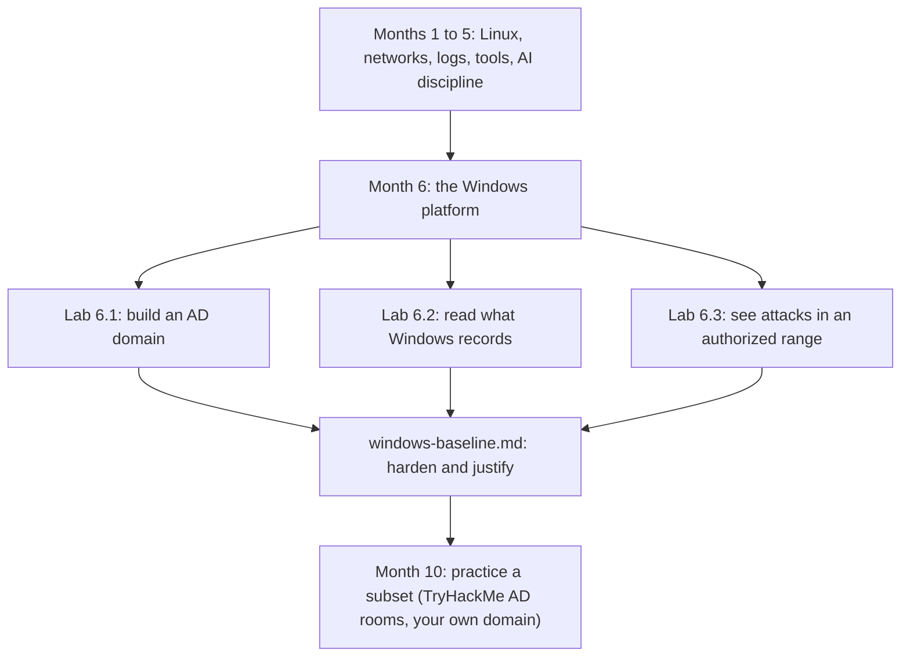

# Month 6: Windows Security

**Pattern family:** Platform security and host defense
**Time budget:** 50 hours
**AI guidance:** AI continues this month in the **concept orientation** pattern only. You may ask AI to explain unfamiliar Windows artifacts and vocabulary, then verify every claim against Microsoft documentation. You do not consult AI for security configuration decisions. Read the "AI augmentation this month" section below before your first lab. The AI Provenance log is mandatory in every notebook entry.
**Prerequisites:** Months 1 to 5 complete. You can read a process tree and reason about parent and child processes (Month 1), navigate a command line and read logs (Months 2 and 4), reason about hosts, ports, and a domain's network position (Month 3), and you have built tools and an AI Provenance habit (Month 5). Month 0's home lab is working, including the note about Windows Server on Apple Silicon.

## Overview

Most of the machines you will defend in a real job run Windows. Most of the breaches you will investigate happen on Windows in an Active Directory domain. The endpoints are Windows. The file servers are Windows. The thing the attacker wants most, the domain controller, is Windows. If your only fluency is Linux, you are fluent in the smaller half of the estate.

Windows is also a different security model from the Unix world you have lived in for five months. The registry is not `/etc`. Services are not quite daemons. Group Policy has no Linux equivalent at all. Authentication runs on Kerberos and NTLM, not on `sudo` and SSH keys. Logging lives in the Event Log, structured and verbose, not in flat text under `/var/log`. You cannot reuse your Linux instincts wholesale. You have to learn the platform on its own terms, which is what this month is for.

This month you stand up a small Active Directory domain, learn to read what Windows records about itself, generate suspicious activity with your own hands and find it in the logs, then write down the hardened baseline you arrived at. You build the defender's view first. The attacks against this environment (pass-the-hash, kerberoasting, golden ticket, lateral movement) you meet at the conceptual level here: what each does to the system and what each leaves behind. You get hands on a subset of them in Month 10, through that month's TryHackMe Active Directory rooms and, as guided practice, against the very domain you build this month. Month 10 is an introduction, not full red-team tradecraft, so the goal there is to have run an AD attack or two end to end and recognized your own footprints, not to master every technique.

Here is where this month sits and what feeds into it:

*Notice: you build the environment, then learn to watch it, then study the attacks against it. The baseline ties all three together, and Month 10 cashes in the conceptual groundwork you lay here when you practice a subset of these attacks on its AD rooms and on your own domain.*

## Warm-Up: Retrieve Before You Begin

Before reading on, answer these from memory. No peeking at earlier months. This pulls forward the prior skills this month builds on.

1. From Month 1: what is the difference between kernel mode and user mode, and why does the line matter for security?
2. From Month 1: what is a process tree, and what does a parent-child relationship between two processes tell you?
3. From Month 3: what is DNS, and what does it do for a host trying to reach another machine by name?
4. From Month 5: when you let AI draft something, what decides whether the draft is good enough to keep?
5. From Month 4: when you read a log during an incident, what makes one log line more useful than another?

Check your recall

1. The kernel has full control of the hardware; user-mode programs have limited power and must ask the kernel for privileged actions through system calls. The line matters because a mistake or an exploit in user space is contained, while one with kernel power is not. From Month 1, the kernel-versus-user-space concept.
2. A process tree shows which process started which. The parent-child link tells you the lineage of a program: who launched it. From Month 1. This month it becomes a detection signal, because a document launching a shell is suspicious lineage.
3. DNS turns a name (like `dc01.lab.local`) into an IP address so a host knows where to send packets. From Month 3. This month DNS is a hard dependency: Active Directory breaks if DNS is wrong.
4. Your tests, not the AI, decide. You keep a draft only when it passes the checks you wrote and you can defend every line. From Month 5, the drafting pattern. This month the check moves to Microsoft documentation.
5. A useful log line is specific: it names the actor, the action, the time, and enough context to confirm what happened. From Month 4. Sysmon, this month, adds far more of that context than the default log.

## A note on hardware, read this before Lab 6.1

Windows Server evaluation images are x86-64 only. On Apple Silicon, that means the fast native virtualization you used for ARM Linux guests does not apply to the domain controller. `getting-started.md`, Step 4, lays out three options in order of preference: emulate x86-64 under UTM (it works but is slow, so budget extra time and patience), stand up a short-lived Windows Server evaluation VM in a cloud free tier, or pair with someone who has an Intel or AMD host. Decide which path you are taking before Lab 6.1, because it changes how long setup will feel and, for the cloud path, how careful you must be to tear the VM down when you are not using it. The member workstation can be a Windows 11 ARM64 evaluation guest, which does run natively under UTM. Only the server side carries the x86-64 constraint.

The Windows evaluation editions are time-limited (180 days for Windows Server; rearm extends this) and free for evaluation use. Note the expiry in your notebook so a dead VM at the end of the month does not surprise you.

## Learning objectives

By the end of this month, you can:

- **Explain** the security-relevant core of the Windows NT architecture: the kernel and user mode split, the registry, services, scheduled tasks, and where each can be abused.
- **Build** a Windows Server domain controller, promote it, join a member workstation, and explain what changed on the network and in authentication when you did.
- **Explain** Active Directory's structure (domains, forests, organizational units) and how Kerberos authenticates a user to a service, at the ticket level.
- **Analyze** a Windows host with PowerShell: processes, services, scheduled tasks, event logs, and local policy.
- **Produce** Sysmon telemetry, generate specific suspicious behaviors yourself, and locate the resulting events by event ID and field.
- **Explain**, at a conceptual level, how pass-the-hash, kerberoasting, golden-ticket, and lateral-movement attacks work and what artifacts each leaves for a defender.
- **Defend** a `windows-baseline.md` that documents your hardened domain controller and member workstation, setting by setting, each choice traced to a primary source.

## Recognition cue

When an incident lands on a Windows host or inside an AD domain, you reach for the Event Log and Sysmon, you think in process trees and logon types, and you can place where the attacker is in the Kerberos flow. When you read a finding that says "kerberoasting observed," you know what was requested, why it is crackable offline, and which event recorded it, instead of nodding at a term you cannot unpack. This month builds that orientation.

## Core concepts to internalize

Read these to understand the labs, not to memorize them. Each chunk is one idea. Bolded terms are the vocabulary you will use all month.

### Windows NT architecture, the security-relevant parts

You met **kernel mode** and **user mode** in Month 1 as CPU rings. Windows uses the same split with its own names: the kernel has full hardware control, and your programs run with limited power in user mode. A **process** is a running program; a **thread** is a unit of work inside it. The parent-child relationship between processes (which process started which) makes process trees a detection signal, because some lineages are normal and some are not.

The **registry** is Windows's central configuration database, a tree of **hives** (top-level sections), **keys** (folders), and **values** (settings). Two parts matter most for security: **run keys** (registry locations that launch a program at startup or logon) and **service keys**. Attackers abuse both to survive a reboot, a trick called **persistence** (a foothold that outlives a restart). A **service** is a background program managed by the **Service Control Manager**; it is the rough Windows cousin of a Linux daemon. A **scheduled task** runs a program on a trigger (a time, a logon) and is a second common persistence surface.

> **Common misconception.** "The Windows registry is just a settings menu, like System Preferences with extra steps."
> **Reality.** The registry is a live database that the operating system and every application read constantly, and it controls what runs and when. That is exactly why attackers write to it: a single registry value can make a malicious program start every time the machine boots. It is a control surface, not a preferences screen.

### Active Directory

A **domain** is a group of Windows computers and users that share one directory and one authentication authority. A **domain controller** is the machine that holds the directory and answers "is this user who they say they are." A **forest** is one or more domains under a shared root of trust; a **tree** is a group of domains that share a name. An **organizational unit (OU)** is a container inside a domain used to organize objects and aim **Group Policy** (centralized settings pushed to many machines at once, something Linux has no direct equivalent for).

One distinction shapes the whole month: a **local account** lives only on one machine, stored in that machine's **SAM** (Security Account Manager) database. A **domain account** lives in the directory on the domain controller and works across every machine in the domain. Where a credential lives changes what an attacker who steals it can reach.

> **Common misconception.** "Joining a computer to a domain is basically just logging into a shared network folder."
> **Reality.** Joining creates a real two-way trust: a computer account is created in the directory, the machine gets a password of its own, and domain logons are now authenticated by the domain controller, not the local machine. The domain controller becomes the authority over that machine. That is why owning the domain controller means owning every machine in the domain.

### Authentication: Kerberos and NTLM

> **Heavy concept ahead.** Slow down here; this is the load-bearing idea of the month, and every common attack stands on it.

**Kerberos** is the main authentication protocol in Active Directory. It has three parties: the **client** (you), the **service** you want to reach (a file share, a database), and the **Key Distribution Center (KDC)**, which runs on the domain controller and acts as a trusted broker. The flow has three steps. First, the client proves who it is to the KDC and receives a **ticket-granting ticket (TGT)**, a sealed token that says "the KDC vouches for this user." Second, the client shows the TGT to the KDC and asks for a **service ticket** for a specific service. Third, the client hands the service ticket to the service, which trusts it because only the KDC could have made it.

Two facts from that flow power the common attacks. Any authenticated user can request a service ticket for any service. Part of that ticket is encrypted with the service account's password hash, which is why a stolen ticket can be cracked offline (this is kerberoasting). And the TGT itself is sealed with a single master key on the domain controller, the **krbtgt** key, so anyone who steals that key can forge a TGT for anyone (this is the golden ticket).

**NTLM** is the older challenge-response scheme Windows still supports. Its weakness is that the hash of a password can be replayed directly, without ever cracking it, which is pass-the-hash. You do not execute any of this against a live target this month; you build the mental model so the attacks are not magic later.

### PowerShell as a security tool

**PowerShell** is the Windows command shell and scripting language, and it is your primary inspection tool this month. Its big departure from Bash: commands (**cmdlets**, named verb-noun like `Get-Process`) output **objects**, not plain text. That means you can filter and sort on real fields (`Get-Process | Where-Object CPU -gt 10`) instead of parsing strings. You will use cmdlets to read processes, services, scheduled tasks, and the event log. PowerShell also logs its own activity (**script block logging** and **module logging**), which matters because attackers use PowerShell too, and that logging is how a defender catches them.

### Windows logging

The **Event Log** is Windows's structured logging system. Events arrive on **channels** (named streams, like Security or System), come from **providers** (the components that emit them), carry an **event ID** (a number identifying the kind of event), and hold **structured fields** (named data, not just a message). The **Security**, **System**, and **Application** logs are the classic three. One field you will use constantly is the **logon type**, a number that says how a logon happened (interactive at the keyboard, over the network, as a service, and so on).

**Sysmon** (System Monitor) is a free Microsoft Sysinternals tool that records far more than the default log: full process creation with command lines and hashes, network connections tied to processes, file and registry changes. With a good configuration, Sysmon turns a Windows host into a witness. Lab 6.2 is where you install it and learn to read it.

> **Common misconception.** "If something happened on Windows, it will be in the Security log."
> **Reality.** The default Security log records a thin slice: a logon happened, an account changed. It often does not record that a document spawned a shell or that a scheduled task was created. Sysmon writes to its own separate channel, not the Security log, which is why a learner's first instinct (look in Security) finds nothing. Knowing which channel holds which evidence is half the skill.

### Common Windows attacks, conceptual only this month

You study these to know what they do and what they leave, not to run them. **Pass-the-hash** reuses a stolen NTLM hash to authenticate without cracking the password. **Kerberoasting** requests service tickets and cracks them offline to recover a service account's password. **Golden ticket** forges a ticket-granting ticket using the domain's krbtgt key. **Lateral movement** is moving host to host with stolen credentials. You learn the artifact each leaves for a defender. You do not execute any of them against a live target this month. You get hands on a subset of them in Month 10, on that month's TryHackMe Active Directory rooms and, as guided practice, against the domain you build here; Month 10 is an introduction, so it runs an attack or two end to end rather than teaching the full tradecraft.

## AI augmentation this month: concept orientation

Month 5 unlocked the drafting pattern. This month unlocks **concept orientation**, and it is deliberately narrower, because the failure mode here is different.

**The concept orientation pattern.** Windows has a large, unfamiliar vocabulary: SID, GPO, krbtgt, LSASS, SPN, RID, NTDS.dit, SAM, plus dozens of event IDs. When you hit a term or an artifact you do not recognize, you may ask AI to explain it in plain language, the way you would ask a knowledgeable colleague "what is an SPN and why does it matter." You then verify the explanation against Microsoft's own documentation before you rely on it. AI is your orientation to unfamiliar terrain; Microsoft Learn is your map of record.

**What this is not, and the hard line for this month.** You do not ask AI for security configuration decisions. Not "how should I harden my domain controller," not "what Group Policy settings should I set," not "is this baseline good." You make those decisions yourself, from Microsoft's documentation, the Microsoft Security Baselines, and the CIS Benchmarks. The whole point of the deliverable is that you can defend each setting from a primary source, not because an AI suggested it. AI explains what a setting is; you decide whether and how to apply it, and you cite where the decision came from.

Why the line sits there: a wrong AI explanation of a term costs you a few minutes and is caught the moment you check the docs. A wrong AI configuration decision becomes a hardened-looking baseline that is quietly insecure, and you would carry it into your deliverable and your understanding without ever knowing it was wrong. Windows security configuration is also exactly the place where AI confidently invents plausible-sounding registry paths, Group Policy names, and event IDs that do not exist. The verification habit from Month 5 is your defense; this month it points at Microsoft Learn.

**The "AI as junior teammate" framing** still applies. The junior is good at "explain this jargon to me" and unreliable at "decide my security posture for me." Use it for the first and never the second.

Read `AI-ETHICS.md` at the repo root again if it has been a while. Decision tree question Q2 (could the output be wrong in a way you would not catch) is the one that draws this month's line.

## The AI Provenance log (mandatory)

Every lab notebook entry this month includes an "AI Provenance" section, the same gate as Month 5. Without it, the lab notebook gate rejects the entry. The section documents:

- **Which AI tool** you used (model and interface).
- **What you asked** (the prompts; verbatim for anything substantive).
- **What was generated** (the explanation, and its claims).
- **What verification you performed against Microsoft documentation** (the specific page or article, and the specific claim you confirmed or corrected, not "I checked it"). For this month, the verification source must be primary: Microsoft Learn, a Microsoft Security Baseline, an official protocol reference, or the CIS Benchmark. A blog does not count as verification.
- **What you discarded** as wrong, and why. AI explanations of Windows internals are frequently almost-right; the almost is where the learning is.

A representative entry for this month: "Asked Claude to explain what a Service Principal Name is and how it relates to kerberoasting. It said an SPN maps a service instance to a service account and that any domain user can request a service ticket for any SPN, which is the precondition for kerberoasting. Verified against Microsoft Learn's SPN documentation and the Kerberos service-ticket flow; the mapping claim is correct. It also claimed the resulting ticket is encrypted with the service account's NTLM hash in all cases; the Microsoft documentation distinguishes RC4 from AES service tickets, which changes what the offline crack targets, so I corrected that detail." The correction is the part that proves you verified.

## The verification ritual

For any artifact this month that you informed with AI orientation (a paragraph in your baseline explaining a setting, a description of an attack, a glossary of terms), the tutor selects one element and asks you to explain it from memory, with your AI session closed and the Microsoft documentation closed too. "Explain what a Kerberos ticket-granting ticket is and why a forged one is called a golden ticket" is a representative challenge. If the explanation is shaky, the artifact returns until you can give it cold. This is the interview question "walk me through how kerberoasting works," rehearsed before the interview.

## Labs

Three labs, building toward the hardened-baseline deliverable. Complete in order; each assumes the platform fluency the previous one built. Full specs in each lab's directory.

| Lab | Folder | Time | What you build |
| --- | ------ | ---- | -------------- |
| 6.1 Domain Controller Setup | `labs/lab-01-domain-controller-setup/` | 18 to 22 h | A working AD domain (one DC, one joined workstation) and a map of what promotion changed |
| 6.2 Sysmon and Suspicious Activity | `labs/lab-02-sysmon-suspicious-activity/` | 15 to 17 h | Sysmon telemetry, self-generated suspicious events, and the skill of finding them by event ID |
| 6.3 TryHackMe Windows Path | `labs/lab-03-tryhackme-windows-path/` | 12 to 14 h | Windows and AD fluency, and a conceptual grounding for the common attacks |

Lab 6.1 carries the Apple Silicon hardware constraint (Windows Server is x86-64 only); read the hardware note above and `getting-started.md` Step 4 before you start it. Lab 6.3 carries the no-flag-confirmation habit: do not paste room answers or flags to the tutor; the platform confirms them, the tutor never does. All three labs run only against your own VMs or platforms whose terms of use authorize the activity, per `SAFETY.md`.

## Weekly rhythm and the warm-start

Weeks 1 to 3 build the domain, the telemetry, and the room work. **Week 1 opens with a warm-start that keeps a prior skill alive:** before any Windows work, re-run your Month 1 `inventory.sh` on a Linux host and write one sentence on what a host inventory would need to look like on Windows instead (different commands, the registry, the Event Log). This bridges the platform gap on purpose: you already know the questions a host inventory answers, and this month you learn the Windows way to answer them. Week 4 is lighter on building and heavier on retrieval.

## The cold-revisit week

The third Friday of Month 6 pulls prior labs for blind redo, per the standard cadence. Expect the tutor to ask you to re-enumerate a host (Month 1) using PowerShell this time instead of Bash or `system_profiler`, to re-read one of your Month 4 PCAPs and identify which traffic would correspond to a logon or a Kerberos exchange, or to re-explain a Month 5 tool from memory. The building teaches; the cold revisit hardens.

## Notebook entry requirements

Each lab produces a notebook entry at `.tutor/notebook/lab-NN-<slug>.md` with the standard sections **plus** the AI Provenance section:

- **Pre-flight check** for any new tool or technique (Sysmon, the AD promotion, PowerShell inspection cmdlets): what it does at the level of the registry, a process, a log channel, or the directory; what artifacts it leaves; what could go wrong; the legal authorization scope (your own VMs, or a platform whose terms authorize the activity).
- **Concept naming.**
- **Evidence:** screenshots of settings and event records, command output, configuration references. Windows work is screenshot-heavy; the deliverable depends on it, so capture as you go.
- **Five-question debrief.**
- **AI Provenance** (see above). Mandatory. Missing or shallow means the entry is rejected.

## Reflect

Spend ten minutes on these in your notebook, in writing, not just thinking:

- **Explain it back:** in three or four sentences, explain the Kerberos three-party flow (client, KDC, service) to a peer who finished Month 5 but has never touched Windows.
- **Connect:** how does the process tree you learned in Month 1 change meaning on Windows this month? What lineage would now make you suspicious?
- **Monitor:** which concept this month is still fuzzy? Name it precisely (for example, "I cannot yet say why a golden ticket is hard to detect"), and write the one question that would clear it up.

## End-of-month deliverable

A `windows-baseline.md` describing the hardened configuration of your domain controller and member workstation, with screenshots of the relevant settings, every choice traceable to a primary source. Full specification in `deliverable.md`.

## Common pitfalls

- **Looking for Sysmon events in the Security log.** Sysmon writes to its own operational channel. Learners lose an hour here. Know which channel holds which evidence before you go looking.
- **Letting AI decide configuration.** AI orients you to vocabulary, full stop. Every hardening decision comes from a primary baseline, cited by name. An AI-suggested setting in your baseline fails the deliverable on its own terms.
- **Making your daily user a domain admin because it is convenient.** It is convenient, and it is the exact habit the deliverable marks down. Separate the accounts; the friction is the lesson.
- **Treating "an event was recorded" as "the attack is visible."** A logon line is not an attack story. The skill is finding the events that show what actually happened, which is why you generate the activity yourself first.
- **Trusting an AI-stated event ID.** AI swaps event IDs and invents fields with confidence. Every event ID and field you rely on gets checked against the Sysmon or Microsoft documentation.

## Knowledge Check

Answer from memory first, then check. Items marked ⟲ are spaced callbacks to earlier months and are supposed to feel like a small stretch.

1. Name the three parties in Kerberos and the token each step produces.
2. Where does a local account live, and where does a domain account live? Why does the difference matter to an attacker?
3. You generated a "Word spawns PowerShell" event but cannot find it in the Security log. What went wrong, and where should you look?
4. Why can a service ticket be cracked offline, and what is that attack called?
5. What is the difference, for a defender, between pass-the-hash and a golden ticket?
6. Why is the krbtgt key called the keys to the kingdom?
7. ⟲ From Month 1: what does a parent-child relationship between two processes tell you, and why does that matter more on Windows this month?
8. ⟲ From Month 3: why does Active Directory break if DNS is misconfigured, and why does a domain controller point at itself for DNS?
9. ⟲ From Month 5: this month you may use AI to explain a term but not to decide a setting. Which AI-ethics decision-tree question draws that line, and what does it ask?
10. PowerShell cmdlets output objects, not text. Name one concrete thing that lets you do that Bash makes harder.

Answer key

1. Client, service, and the Key Distribution Center (KDC). The client gets a ticket-granting ticket (TGT) from the KDC, then exchanges the TGT for a service ticket, then presents the service ticket to the service.
2. A local account lives in the machine's SAM database and works only on that machine. A domain account lives in the directory on the domain controller and works across the domain. A stolen domain credential reaches far more than a stolen local one.
3. Sysmon does not write to the Security log; it writes to its own operational channel (Microsoft-Windows-Sysmon/Operational). Look there for the process-creation event.
4. Part of a service ticket is encrypted with the service account's password hash, so an attacker who requests the ticket can try passwords against it offline, with no further contact with the domain. The attack is kerberoasting.
5. Pass-the-hash reuses one stolen NTLM hash to authenticate as that one user, without cracking it. A golden ticket forges a TGT with the domain's krbtgt key, letting the attacker impersonate anyone; it is far broader and far harder to detect.
6. The krbtgt key seals every ticket-granting ticket in the domain. Whoever holds it can forge a valid TGT for any account, so it grants domain-wide impersonation.
7. It tells you the lineage: which process started which. It matters more here because some Windows lineages are themselves the signal, for example a document application launching a shell, which is rarely legitimate. From Month 1.
8. Active Directory locates domain controllers and services through DNS records; if DNS is wrong, clients cannot find the domain controller and authentication fails. A domain controller points at itself for DNS because it hosts the AD-integrated DNS zone for the domain. From Month 3.
9. Decision-tree question Q2: could the output be wrong in a way you would not catch? Explaining a term fails safe (you check the docs and catch errors); deciding a setting fails silently (a wrong config looks fine and ships). From Month 5 and `AI-ETHICS.md`.
10. You can filter and sort on real named fields (for example `Get-Process | Where-Object CPU -gt 10`), or pass a whole object to another cmdlet, instead of parsing text out of a string. Bash makes you slice columns out of text.

## How to know you are done with this month

- Three lab notebook entries committed, each with a complete AI Provenance section verified against Microsoft documentation.
- `windows-baseline.md` committed, covering both the domain controller and the member workstation, with screenshots and per-setting justification.
- The TryHackMe rooms completed (Windows Fundamentals plus one Active Directory room), logged in your notebook, no flags pasted to the tutor.
- The cold-revisit week's sub-tasks completed and logged.
- You can pass the verification ritual on any term, setting, or attack concept from this month, cold.
- `.tutor/progress.md` updated to "Month 6 complete; ready for Month 7."

If any AI Provenance section is missing, or any baseline setting cannot be traced to a primary source, the month is not done. The discipline is the curriculum, not an extra.

## Resources

Curated free resources, Microsoft primary sources first, in `reading.md`.
