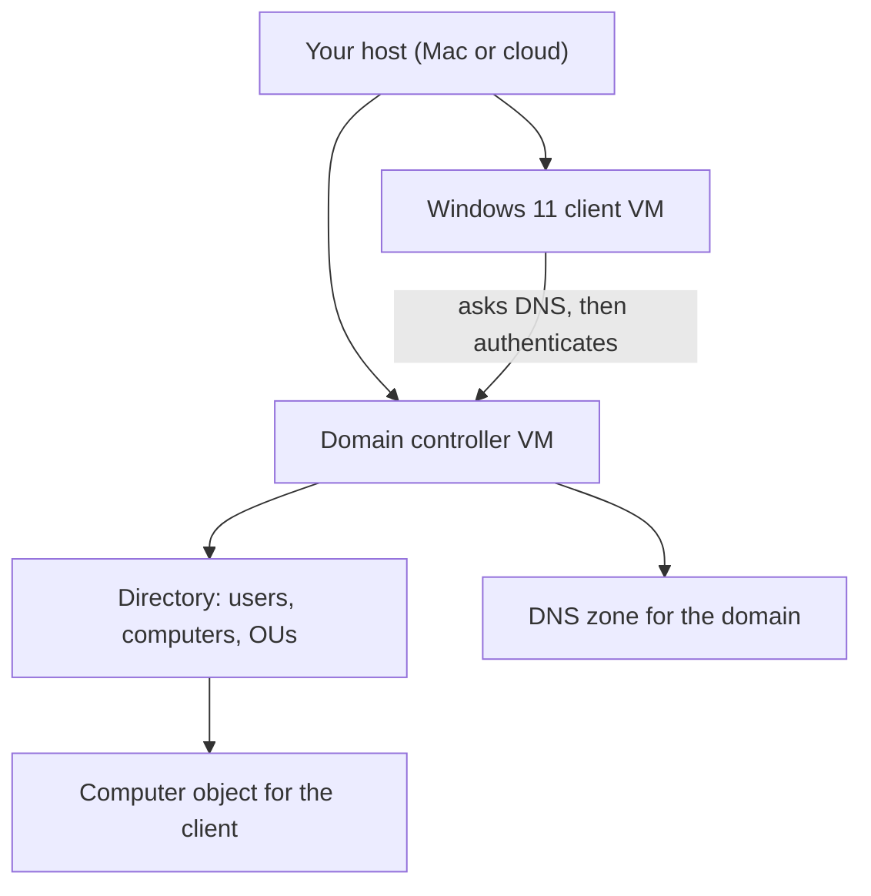

# Lab 6.1: Domain Controller Setup

**Month:** 6 (Windows Security)
**Pattern family:** Platform security and host defense
**Time budget:** 18 to 22 hours (across multiple sessions; the install and promotion alone span two or three sittings, more if you emulate x86-64)
**Lab attempt floor:** 90 minutes (this is a hard lab; sit with the concepts and the documentation before asking for a hint)
**AI guidance:** Concept orientation only. You may ask AI to explain unfamiliar Windows and Active Directory vocabulary, then verify against Microsoft documentation. You do not ask AI for configuration decisions. See "AI guidance for this lab." AI Provenance log mandatory.
**Prerequisites:** Month 6 README read in full, including the hardware note. `getting-started.md` Step 4 read for the Windows Server on Apple Silicon options. Month 3 (you can reason about a host's network position, DNS, and IP addressing) and Month 1 (you know what a service is and what the boot process does).

**Recall first, from memory, before you read on:** in Month 3 you learned what DNS does for a host trying to reach another machine by name. State it in one sentence. (Hold the answer in your head; this lab turns DNS into a hard dependency, and the most common way the lab breaks is a DNS mistake.)

## Why this lab exists

Active Directory is the spine of almost every corporate network you will defend or attack. A domain controller holds the directory, answers authentication, and serves the policy that configures every joined machine. You cannot reason about a Windows breach without a working mental model of what a domain is, and the only reliable way to build that model is to stand one up yourself: install the server, promote it, watch what changes, and join a client to it.

This lab is deliberately heavy on setup. That is not busywork. Promoting a domain controller forces you to confront DNS (the domain controller is also a DNS server, and AD will not work if DNS is wrong), the difference between a local and a domain account, what a forest and a domain functional level are, and why the first reboot after promotion takes so long. Every one of those is something you will need to know cold when an incident touches AD. You build the environment here that Lab 6.2 instruments and the deliverable hardens.

## The scope rule, first, because it is not optional

Everything in this lab runs on **your own machines**: VMs you provision on your own host, or a short-lived cloud VM you create under your own account and intend to use for this lab. You are standing up a domain, not touching anyone else's. Do not join your real machine, your employer's machine, or any device you do not own to this domain. Do not connect this lab domain to any production network. If you take the cloud path because of the Apple Silicon constraint, the VM is still yours and the same rule applies: lock its network exposure down (no open RDP to the world), and tear it down when you are not using it. `SAFETY.md` is the authority here: you interact only with systems you demonstrably own or are explicitly authorized to test, and this lab's targets are systems you own.

## Learning objectives

By the end of this lab, you can:

- **Install** a Windows Server evaluation edition in a VM and **explain** the difference between the Desktop Experience and Core installation options.
- **Explain** what promoting a server to a domain controller does: what role is installed, what the server becomes on the network, and why DNS is a hard dependency.
- **Build** a domain controller in a new forest, choosing and defending the domain name, the forest and domain functional levels, and the Directory Services Restore Mode password.
- **Build** a domain join: add a Windows client to the domain and **explain** what changed on the client and in the directory.
- **Distinguish** a local account, a domain user account, and a domain administrator, and **explain** where each is stored (SAM versus the directory).
- **Analyze** a Windows host with Server Manager and PowerShell to confirm the domain controller is healthy and the client is joined.

## Recognition cue

When an incident or a question lands on an Active Directory environment, you reach for a mental model of the domain: a domain controller holding the directory and answering authentication, DNS underneath it, computer and user objects inside it, and the local-versus-domain account distinction shaping where credentials live. When someone says "the DC is the crown jewel," you know exactly why. This lab is where you build that model by building the environment, so the rest of the month has something concrete to stand on, and so that the domain you build here is ready to serve as your own guided-practice target when Month 10 introduces a subset of the AD attacks you meet conceptually this month.

## What you are building

Here is the shape of the environment by the end of the lab. Hold this picture as you work.


*Notice: the client finds and trusts the domain controller through DNS first, then authenticates against it. If the DNS arrow breaks, nothing downstream works. That is why DNS is the dependency this lab keeps returning to.*

## AI guidance for this lab

This is the worked example of concept orientation. Follow it exactly, because the rest of the month assumes you have internalized the line.

**Allowed:** Asking AI to explain a term or an artifact you do not recognize, then verifying against Microsoft documentation. For example: "What is a forest functional level and what does raising it change?" or "What is the krbtgt account?" or "What does the Directory Services Restore Mode password protect?" You take the explanation as orientation, confirm it against Microsoft Learn, and write down what you confirmed and what you corrected.

**Not allowed:** Asking AI what domain name to use, what functional level to set, how to configure DNS, or whether your setup is secure. Those are configuration decisions, and this lab requires you to make them from Microsoft's documentation so you can defend them. Pasting AI output into a configuration step without understanding it. Asking AI to "walk me through setting up a domain controller" as a substitute for reading Microsoft's own walkthrough; the point is that you read the primary source.

**Logged:** Every AI interaction goes in your AI Provenance section (Task 6), including the ones where AI's explanation was wrong and the Microsoft documentation corrected it. Those corrections are the most valuable entries.

## Tasks

Do these in order. Each step says exactly what "done" looks like and what to do if it is wrong. Capture screenshots as you go; the deliverable depends on them and re-creating them later is painful.

### Task 1: Decide your hardware path and provision the server VM (2 to 4 hours)

Before anything, decide how you are running Windows Server given the x86-64 constraint on Apple Silicon (Month 6 README hardware note; `getting-started.md` Step 4). Write down in your notebook which path you chose (emulate under UTM, short-lived cloud VM, or x86 host) and the trade-off you accepted. Then obtain the Windows Server 2022 evaluation edition from Microsoft's official Evaluation Center and provision a VM for it. Give it a static-friendly network setup; you will set a fixed address in Task 2 because a domain controller must not move.

**Checkpoint:** a Windows Server 2022 evaluation VM boots to a desktop on the hardware path you documented, and your notebook records the path, the trade-off, and the evaluation expiry date. The installation media came from Microsoft's official source, not a third party.
**If not:** if the VM will not boot on Apple Silicon native virtualization, that is expected; Windows Server is x86-64 only, so you must emulate, use a cloud VM, or use an x86 host (see the hardware note). If install media fails to verify, you may have a non-Microsoft download; get it from the official Evaluation Center.

### Task 2: Configure the server's identity and network (90 minutes)

Before promotion, a domain controller needs a stable identity. Set the server's computer name to something you will recognize, and give its network interface a fixed IP configuration appropriate to your lab network, with the server pointing at itself for DNS (you will understand why after Task 3, but set it now and write the question down). Confirm the server can reach the network and resolve its own name.

**Checkpoint:** the server has a deliberate computer name and a fixed IP configuration (screenshot in your notebook), and you have written down, as a question to answer in Task 3, why a domain controller points at itself for DNS.
**If not:** if the server cannot reach the network, recheck the VM's network mode and the gateway in your fixed IP settings. If it cannot resolve its own name yet, that is fine at this stage; you have not promoted it, so the AD DNS zone does not exist. Note that and move on.

### Task 3: Promote to a domain controller (2 to 3 hours, plus a long reboot)

Install the Active Directory Domain Services role and promote the server to a domain controller in a **new forest**. You choose the domain name (a `.local` or other non-routable name suitable for a lab; understand from the documentation why you would not use a public domain you do not own), the forest and domain functional levels, and the Directory Services Restore Mode (DSRM) password. For each of those three choices, read Microsoft's documentation and write one sentence on why you chose what you chose. Let the promotion complete and the server reboot.

This is the heart of the lab. Do not rush it. When it finishes, answer the DNS question you wrote down in Task 2: why does the domain controller resolve DNS against itself, and what role does DNS play in AD?

**Checkpoint:** a promoted domain controller in a new forest; Server Manager reports AD DS and DNS as installed roles (screenshot). Your notebook records the domain name, the functional levels, and the DSRM password's purpose (not the password itself), each with a one-sentence justification drawn from Microsoft's documentation, plus your answer to the DNS question.
**If not:** if promotion fails partway, read the error; the most common causes are a name that does not meet AD's rules or a network the server cannot use. If the reboot seems to hang for a very long time on emulated x86-64, that is the hardware tax, not a failure; give it time before assuming the worst.

### Task 4: Create accounts and an organizational unit (90 minutes)

Using Active Directory Users and Computers (or the equivalent PowerShell cmdlets), create at least one organizational unit, one ordinary domain user account, and confirm where the built-in Domain Admins group sits. Do not make your everyday user a domain admin; note in your notebook why separating those matters. Explain, from the documentation, the difference between this domain user (stored in the directory) and a local account on the server (stored in the SAM).

**Checkpoint:** at least one OU and one non-administrative domain user exist (screenshot). Your notebook explains the local-versus-domain account distinction, where each is stored, and why you did not grant your ordinary user domain-admin rights.
**If not:** if you cannot find where to create objects, open Active Directory Users and Computers from Server Manager's Tools menu. If you are unsure whether your new user is an admin, check its group memberships; a plain user should not be in Domain Admins.

### Task 5: Join a member workstation (2 to 3 hours)

Provision a Windows 11 client VM (ARM64 evaluation runs natively under UTM on Apple Silicon; only the server carries the x86-64 constraint). Configure its DNS to resolve against your domain controller, then join it to the domain. Log in to the client as the domain user you created in Task 4. Confirm, on the domain controller, that the client now appears as a computer object in the directory.

When the join succeeds, write down what changed: on the client (its membership, what authenticates a domain logon now), and in the directory (a new computer object, a computer account password). This "what changed" answer is a core deliverable input.

**Checkpoint:** a Windows 11 client joined to your domain, a domain user logged in successfully, shown by screenshots on both sides (the client's domain membership and the computer object in Active Directory Users and Computers). Your notebook records what changed on the client and in the directory.
**If not:** if the join fails with "domain not found" or "cannot contact the domain," the client's DNS is almost certainly not pointing at the domain controller. This is the single most common failure in the lab. Set the client's DNS server to the domain controller's IP and retry. Do not ask AI to "fix" it; reason about what the client must resolve and where it must ask.

### Task 6: Learn to inspect the host with PowerShell (gradual release)

The new transferable skill of this lab is **reading a Windows host with PowerShell**, where commands return objects you can filter on real fields, not text you have to slice. You will need this for the health check below, and again in Lab 6.2 and the cold-revisit week. You will learn it in three stages on safe, read-only queries. Type everything yourself. None of these stages is the graded promotion; they teach the inspection technique you then apply to your own domain controller.

#### Stage 1 - Worked example (I do)

Run these exact lines on the domain controller and study them. They are read-only and harmless. The teaching case is the simplest possible: list running processes and the running services. Nothing here is the graded deliverable; it shows the technique.

```powershell
Get-Process | Sort-Object CPU -Descending | Select-Object -First 5
Get-Service | Where-Object Status -eq "Running" | Select-Object Name, DisplayName
```

Line by line: `Get-Process` returns one object per running process, and because they are objects, `Sort-Object CPU` sorts on the real CPU field (no text parsing), and `Select-Object -First 5` keeps the top five. The second line: `Get-Service` returns service objects, `Where-Object Status -eq "Running"` keeps only the running ones, and `Select-Object Name, DisplayName` shows just those two fields. That is the whole pattern: get objects, filter on a field, pick the fields you want.

**Checkpoint:** the first line prints five processes ordered by CPU; the second prints a list of running services with their names.
**If not:** if PowerShell complains about the `-eq` line, check you used straight quotes around `"Running"`, not curly quotes from a pasted document. If nothing prints, confirm you are in PowerShell (the prompt starts with `PS`), not the old `cmd` prompt.

#### Stage 2 - Faded practice (we do)

Now you supply the field. The skeleton below lists scheduled tasks and then asks you to filter them, following the exact pattern from Stage 1. Fill in the two TODOs.

```powershell
Get-ScheduledTask | Select-Object TaskName, State    # lists every scheduled task and its state
Get-ScheduledTask | Where-Object State -eq "___"     # TODO: keep only tasks whose State is "Ready"
Get-Service | Where-Object Status -eq "Running" | Measure-Object | Select-Object ___   # TODO: show just the Count
```

You already saw the filter pattern in Stage 1. For the first TODO, the value is the state name `Ready`. For the second, `Measure-Object` produces an object with a `Count` field; select that one field.

**Checkpoint:** the second line prints only tasks in the `Ready` state; the third line prints a single count of running services.
**If not:** if the second line is empty, check the exact spelling and capitalization of the state value and that it is in straight quotes. If the third line prints a whole object instead of just a number, you selected the wrong field name; the field is `Count`.

#### Stage 3 - Independent (you do)

No scaffolding now. This is the health check, and it is the graded part of this task. Using PowerShell on the domain controller, confirm the domain is healthy: verify that the core AD-related services are running, that the directory responds to a query for the user and OU you created in Task 4, and that the client computer object from Task 5 is present. You may also use Server Manager and the built-in AD diagnostic tooling. Work out each query yourself from the pattern in Stages 1 and 2; do not ask AI which commands to run, because choosing the inspection is part of the skill.

**Checkpoint:** you can show, from PowerShell output, that the AD services are running and that the directory returns your Task 4 user and your Task 5 computer object.
**If not:** if a directory query returns nothing, confirm the object actually exists in Active Directory Users and Computers first; an empty result usually means you queried the wrong name, not that the object is missing. If an AD cmdlet is not recognized, the Active Directory PowerShell module may need to be available; it ships with the AD DS role tools on the domain controller.

### Task 7: Notebook entry with AI Provenance (2 hours)

Write the lab notebook entry at `.tutor/notebook/lab-01-domain-controller-setup.md`. Required sections:

- **Pre-flight check** for the promotion itself and for any new tool: what promoting a server to a domain controller does (what role, what the machine becomes, what it now answers on the network), what artifacts it creates (the directory database `NTDS.dit`, SYSVOL, DNS zones), what could go wrong (DNS misconfiguration is the classic failure), and the authorization scope (your own VMs).
- **Concept naming.** Name what this lab taught. It is not "I installed Windows Server."
- **Evidence:** the screenshots from Tasks 2 through 5, key PowerShell output from the health check.
- **Five-question debrief.**
- **AI Provenance:** which AI tool, what terms you asked it to explain, what it said, the specific Microsoft documentation you verified each explanation against, and what you corrected. "Asked for the meaning of 'functional level'; AI said it gates which AD features are available and cannot be lowered once raised; verified against Microsoft Learn's functional-levels article, which confirmed the one-way nature and listed the feature gates" is a real entry. "Used AI to understand AD" is not.

**Checkpoint:** a committed entry with all sections, including a substantive AI Provenance section whose verification cites Microsoft documentation.
**If not:** if your provenance section is one line, the tutor will reject it, and Lab 6.2 does not open until it passes. The test is whether a reader could redo your AI conversation and your verification from your notes.

## Definition of Done

You are done when all of these are true:

- A promoted domain controller in a new forest, with AD DS and DNS installed (screenshot).
- A Windows 11 client joined to the domain, with a domain user logged in (screenshots on both sides).
- At least one OU and one non-administrative domain user created, and your daily user is not a domain admin.
- The PowerShell health check shows the AD services running and the directory returning your user and computer objects.
- The notebook entry is committed with all sections, including a substantive AI Provenance section verified against Microsoft documentation.

**Self-explain:** in one sentence, why does Active Directory stop working if the client's DNS does not point at the domain controller?

## Stretch goals

1. Install the Server Core edition in a second throwaway VM and inspect it with PowerShell only (no desktop). Note in one paragraph what changes when there is no GUI and why a smaller install is a smaller attack surface.
2. From the domain controller, use one PowerShell command to list every domain user, and a second to list every computer object. Compare the output to what Active Directory Users and Computers shows you.
3. Read Microsoft's documentation on read-only domain controllers (RODCs) and write three sentences on what an RODC is and one place you would deploy one.
4. Take a VM snapshot of the healthy domain controller and the joined client now, before Lab 6.2 changes anything. Note in your notebook what the snapshot captures and what it would miss if the VM were running (a callback to your Month 0 and Month 1 snapshot work).

## Troubleshooting

- **The client cannot find the domain.** Almost always the client's DNS is not pointing at the domain controller. Set the client's DNS server to the domain controller's IP and retry. This single mistake causes most failures in this lab.
- **An emulated x86-64 server is painfully slow.** Installation and the post-promotion reboot can take far longer than any tutorial's screenshots suggest. This is the hardware tax you read about, not a broken setup. Budget the time; slowness is not failure.
- **You are tempted to make your daily user a domain admin.** It is convenient, and it is exactly the habit the deliverable marks down. Separate the accounts now; the friction is the lesson.
- **A cloud server VM is exposed.** A cloud VM left running with open RDP is a real exposure. Restrict access to your own IP and shut it down when you are not using it. This is `SAFETY.md` applied to your own infrastructure.
- **An AD PowerShell cmdlet is not recognized.** The Active Directory module ships with the AD DS role tools; run AD cmdlets on the domain controller, or install the management tools where you need them.

## Time budget breakdown

- Task 1: 2 to 4 hours (longer on the emulation path)
- Task 2: 90 minutes
- Task 3: 2 to 3 hours plus a long reboot
- Task 4: 90 minutes
- Task 5: 2 to 3 hours
- Task 6: 90 minutes to 2 hours (the three stages plus the health check)
- Task 7: 2 hours
- Buffer for DNS debugging and emulation slowness: 3 to 5 hours

Total: 18 to 22 hours. If you exceed 26, stop and consult `tutor-reference.md` on what to do when truly stuck; the likely culprit is DNS or the emulation path, and both have known shapes.

## Resources

Primary sources, Microsoft first. Full annotated list in `../../reading.md`.

- Microsoft Learn: the Active Directory Domain Services overview and the "Install a new Windows Server forest" guidance (the official promotion walkthrough; read it rather than a blog).
- Microsoft Learn: DNS and Active Directory integration (why DNS is a hard dependency).
- Microsoft Learn: forest and domain functional levels (for your Task 3 justifications).
- Microsoft Learn: the PowerShell object pipeline and the cmdlets for processes, services, and scheduled tasks (for Task 6).
- Microsoft Evaluation Center: the Windows Server 2022 evaluation, with its licensing and rearm terms.
- `getting-started.md`, Step 4, for the Apple Silicon hardware options.
