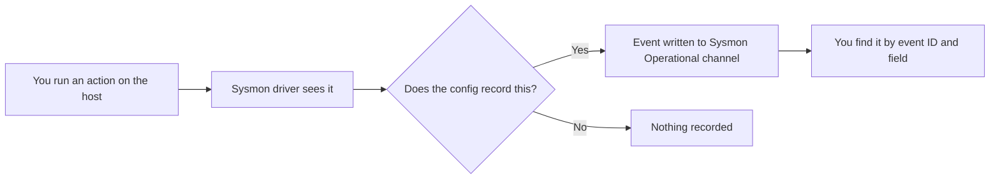

# Lab 6.2: Sysmon and Suspicious Activity

**Month:** 6 (Windows Security)
**Pattern family:** Platform security and host defense
**Time budget:** 15 to 17 hours (across multiple sessions)
**Lab attempt floor:** 90 minutes (medium-to-hard; the difficulty is in reading the logs, not in generating the activity)
**AI guidance:** Concept orientation only. You may ask AI to explain Sysmon event IDs, fields, and Windows logging vocabulary, then verify against Microsoft and Sysmon documentation. You do not ask AI which events are suspicious or how to tune the config. See "AI guidance for this lab." AI Provenance log mandatory.
**Prerequisites:** Lab 6.1 complete (you have a working domain controller and a joined Windows 11 workstation, and its notebook entry is committed). Month 4 (you have read logs as evidence and thought like a SOC analyst). Month 1 (process trees, parent and child processes).

**Recall first, from memory, before you read on:** in Lab 6.1 you joined a Windows 11 workstation to your domain. What is the difference between a local account on that machine and a domain account, and where is each stored? (This lab runs entirely on that workstation, generating events you then go find.)

## Why this lab exists

The default Windows Security log tells you a logon happened. It does not tell you that the logon was followed by Word launching PowerShell, which downloaded and ran something, which created a scheduled task to survive a reboot. The gap between "an event was recorded" and "an attack is visible" is exactly the gap a SOC analyst lives in, and on Windows the tool that closes most of it is Sysmon.

**Sysmon** (System Monitor) is a free Microsoft Sysinternals driver that records high-fidelity events the default log does not: full process creation with command lines and hashes, network connections tied to processes, file creation, registry changes, and more. With a good configuration it turns a Windows host into a witness. This lab teaches you to install it, to generate specific suspicious behaviors with your own hands so you know exactly what the ground truth is, then to go find that ground truth in the log. Generating the activity yourself is the point: when you know what you did, you can tell whether your detection actually saw it, which is the discipline that separates real detection engineering from copying alert rules off the internet.

The behaviors you generate (a PowerShell process spawned by Word, a scheduled task created from the command line) are textbook benign analogs of real attacker tradecraft. You run them on your own workstation, against nothing, purely so they appear in your own logs. They do no harm; their only effect is to leave the telemetry you then learn to read.

## The scope rule, first, because it is not optional

You generate this activity **only on your own VM**, the workstation you joined in Lab 6.1, against nothing and no one. You are not attacking anything; you are producing benign events on a machine you own so you can study its logs. Do not run these techniques against your domain controller in a way that affects its operation, against any machine you do not own, or against any network beyond your isolated lab. `SAFETY.md` governs: you act only on systems you demonstrably own, and this lab's only target is your own workstation's event log.

## Learning objectives

By the end of this lab, you can:

- **Explain** what Sysmon is at the driver level: how it hooks process creation and other events, and how its configuration file decides what to record.
- **Build** a working Sysmon install with a public reference configuration and confirm it is logging.
- **Configure** the built-in Windows process-creation auditing (Event ID 4688 with the command line) and PowerShell script-block logging (Event ID 4104), and explain why each is off by default and what turning it on records (the source Month 9 depends on).
- **Explain** the Windows event model well enough to navigate it: channels, providers, event IDs, and the structured fields inside an event.
- **Analyze** the log to locate a specific event by event ID and by the field that makes it stand out, after generating that event yourself.
- **Distinguish** a process-creation event (with its parent process, command line, and hashes) from a default Security-log logon event, and explain why the Sysmon version is higher fidelity.
- **Produce** a plain-language description of an attacker technique and the artifact it would leave, grounded in an event you actually generated.

## Recognition cue

When an alert says "suspicious process activity on a Windows host," you reach for the process tree and the Sysmon log: what spawned what, with which command line, from which parent. When you wonder whether your monitoring would actually catch a technique, you generate the technique yourself on a host you own and check the log against the ground truth you created. This lab builds the reflex of confirming detection against known activity rather than trusting a rule you never tested.

## Where the evidence lives

Before you hunt, hold this picture of where an event comes from and where it lands.


*Notice: the config decides what gets recorded, and the event lands in Sysmon's own channel, not the Security log. Those two facts are where beginners lose the most time.*

## AI guidance for this lab

Concept orientation, same line as Lab 6.1.

**Allowed:** Asking AI to explain a Sysmon event ID or a field ("what does Sysmon Event ID 1 record, and what is the ParentImage field?"), or a piece of Windows logging vocabulary ("what is a logon type, and what does type 3 mean?"). Then verify against the Sysmon documentation and Microsoft Learn before relying on it.

**Not allowed:** Asking AI which events in your log are suspicious, how to tune the Sysmon configuration, or to interpret your specific log for you. You generated the activity, so you already know the ground truth; the skill is to confirm the log matches it yourself. Letting AI tell you "this event is the attack" defeats the entire exercise. You also do not ask AI to write the suspicious commands for you; the techniques are described below and you assemble the benign versions yourself from primary documentation.

**Logged:** Every AI interaction goes in your AI Provenance section, especially the corrections. Sysmon event-ID meanings are a place AI is often confidently wrong (it swaps IDs, invents fields); catching that against the documentation is the skill.

## Tasks

Do these in order. Capture screenshots of each event you find; they are deliverable inputs and evidence.

### Task 1: Pre-flight Sysmon before you install it (90 minutes)

Before installing anything, do the pre-flight thinking. Read the Sysmon documentation and write down, in your own words: what Sysmon is (a driver plus a service), what it hooks, how its configuration file controls what is recorded, where its events land (its own operational log channel, not the Security log), and what it costs (log volume, a small performance overhead). This is the tool pre-flight check the tutor requires before any new tool runs.

**Checkpoint:** a pre-flight write-up in your notebook covering what Sysmon does at the driver and service level, where its events go, what artifacts it leaves, and what could go wrong (an over-broad config floods the log; a too-narrow one misses the attack). No installation yet.
**If not:** if you cannot yet say where Sysmon writes its events, read the Sysmon documentation's section on its operational channel before continuing; getting this wrong now causes the most common failure later (looking in the Security log).

### Task 2: Install Sysmon with the SwiftOnSecurity reference config (90 minutes)

Install Sysmon on your Windows 11 workstation using the well-known SwiftOnSecurity reference configuration as your starting point. Confirm it is running (the service and the driver) and that events are appearing in its operational log channel. Read enough of the configuration file to explain, in one paragraph, what kinds of events it chooses to record and what it deliberately filters out, and why a curated config exists rather than "log everything."

**Checkpoint:** Sysmon installed and logging on the workstation, confirmed by a screenshot of recent events in its operational channel. Your notebook explains, in your own words, the philosophy of the SwiftOnSecurity config (curated, noise-aware), sourced from the config's own documentation, not from AI.
**If not:** if no events appear, confirm both the Sysmon service and its driver are running, and that you pointed the install at the config file. If you are looking in the Security log and seeing nothing Sysmon-related, that is the expected mistake; Sysmon uses its own channel (Microsoft-Windows-Sysmon/Operational).

### Task 3: Turn on the built-in command-line and PowerShell auditing (90 minutes)

Sysmon is not the only source of process-creation events on Windows. The operating system has its own, the Security log's **Event ID 4688** (a process was created). You will lean on 4688 in Month 9, when you build detections in a SIEM, because it is the source you get without installing anything. There is a catch, and it is the reason this task exists: out of the box, 4688 records that a process started but not the **command line** it started with. The course's signature detection, "Office spawns PowerShell with an encoded command," lives entirely in that command line. If the field is not there, a rule that looks for it silently matches nothing, which is the exact "rule against a field your source does not emit" trap the course warns you about. So you turn the field on now, before you generate any activity, and you confirm it actually shows up.

Three settings carry the field, and you enable all three on the workstation. Read each one in Microsoft's documentation first, because the deliverable asks you to justify it from a primary source, and because this is concept orientation: you decide and cite, the tutor does not decide for you.

- **Audit Process Creation**, an **Advanced Audit Policy** subcategory (under Detailed Tracking). Turning it on is what makes 4688 fire at all for the processes you care about. (Advanced Audit Policy is the modern, fine-grained version of the old audit policy; you set it per subcategory rather than all-or-nothing.)
- **Include command line in process creation events**, a **Group Policy** setting (under Administrative Templates, System, Audit Process Creation). This is the switch that adds the **CommandLine** field to each 4688 event. Microsoft documents the small trade-off: command lines can contain secrets (a password typed on a command line lands in the log), so you turn it on deliberately and you know what you are now recording.
- **PowerShell Script Block Logging**, a Group Policy setting (under Administrative Templates, Windows Components, Windows PowerShell). It writes the actual PowerShell code that ran to **Event ID 4104**, which is how a defender reads a deobfuscated, decoded script block even when the attacker tried to hide it. Attackers use PowerShell precisely because it is everywhere and quiet; this logging is how you hear it.

After you set them, force a policy refresh (`gpupdate /force`) so the change takes effect this session rather than at the next reboot.

**Checkpoint:** your notebook records, for each of the three settings, what it does, where you set it (the exact policy path), the primary source you read (Microsoft Learn, a Microsoft Security Baseline, or the CIS Benchmark), and, for the command-line setting, the one trade-off you accepted. You do not verify the events yet; the next task generates the activity that proves the field is present.
**If not:** if you cannot find a setting where the documentation says it lives, confirm you are editing the right policy scope for a single workstation (the Local Group Policy Editor `gpedit.msc` is the simplest place on a standalone workstation; a domain GPO is the equivalent if you push it from the domain controller) and that you searched under the exact node named above. If you are unsure whether a setting took effect, do not guess; you will confirm it directly when you find a 4688 event with a CommandLine field in Task 4.

### Task 4: Learn to find a known event in the log (gradual release)

The new skill of this lab is **correlating a known action to its event by event ID and field**. You will learn it in three stages. The first two stages use a harmless teaching action (launching Notepad) so you can focus on the hunting method. The graded hunts come in Stage 3 and use the two suspicious analogs. Generate the activity yourself in every stage; never ask AI to find the event for you.

#### Stage 1 - Worked example (I do)

Follow this exact hunt and watch how it works. The teaching action is the most boring thing possible, opening Notepad, so the method is all that matters.

1. Note the time on the clock. Open Notepad on the workstation, then close it.
2. Open Event Viewer and go to the Sysmon operational channel (Applications and Services Logs > Microsoft > Windows > Sysmon > Operational), or query it in PowerShell.
3. Look for the process-creation event for Notepad near the time you noted. The process-creation event is **Event ID 1**. The field that names the program is **Image** (it ends in `notepad.exe`), and the field that names what launched it is **ParentImage**.

The method, stated plainly: you know the action and roughly when it happened, you go to the right channel, you filter to the right event ID, and you confirm the field values match what you did. That is the entire hunting loop.

**Checkpoint:** you found a Sysmon Event ID 1 whose Image field ends in `notepad.exe`, near the time you launched it, and you can read its ParentImage field.
**If not:** if you see no Event ID 1 for Notepad, confirm you are in the Sysmon Operational channel (not Security), and that Sysmon's config records process creation (the SwiftOnSecurity config does). If many events crowd the view, filter by Event ID 1 and sort by time to find yours.

#### Stage 2 - Faded practice (we do)

Now you drive the hunt, with the action chosen for you but the filter left to you. Generate a network connection from a known program and find the event.

```text
Action: from PowerShell, make one outbound connection to a host you own
  (for example, your domain controller's IP on an open port). You choose
  the exact command from the PowerShell or networking docs.

Then find it in Sysmon:
  - Channel: Microsoft-Windows-Sysmon/Operational
  - Event ID to filter on: ___   # TODO: the Sysmon ID for a network connection
  - Field that shows the destination: ___   # TODO: which field holds the destination IP/port
```

You found process creation in Stage 1 with the same loop. For the TODOs, recall (or check the Sysmon event reference) that network connection has its own event ID distinct from process creation, and the destination lives in a named field. Confirm the field values match the connection you made.

**Checkpoint:** you filtered to the correct network-connection event ID and found the event whose destination field matches the host and port you connected to.
**If not:** if you cannot find a network event, the SwiftOnSecurity config may filter common noisy connections; make the connection to a destination the config does not exclude, and confirm process-network logging is enabled. If you grabbed the wrong event ID, check the Sysmon documentation's event reference rather than guessing; mixing up IDs is the exact error this lab trains you to catch.

#### Stage 3 - Independent (you do)

No scaffolding now. These are the graded hunts. Generate each behavior yourself, then find its event by ID and field, with no skeleton handed to you.

**Behavior one, a PowerShell child of Word.** Produce the classic "Office spawns a shell" pattern on your own workstation: open Microsoft Word (or, if you do not have Office, another Office-family application available to you, and note the substitution) and cause it to launch PowerShell as a child process. Work the mechanism (a macro, or another supported way to make the application spawn a child) out from documentation; the goal is simply that, in the process tree, PowerShell's parent is the Office application, because that parent-child relationship is the signal. Have the spawned PowerShell do something trivial and harmless (print a string, query the time); the payload is irrelevant, the lineage is the point. Then find the Sysmon process-creation event and identify the field that shows the suspicious parentage.

**Behavior two, a scheduled task created from the command line.** Create a scheduled task from the command line or PowerShell on your workstation (a benign task: have it do nothing of consequence, or run a harmless command). Scheduled-task creation is a common persistence technique, so creating one leaves telemetry worth knowing. Find the event that recorded the task's creation. Note that this signal may live in more than one place (Sysmon, and a Windows Security or Task Scheduler operational event); find at least one and, for deliverable credit, note where else it appears.

**Checkpoint:** for behavior one, a Sysmon process-creation event where a PowerShell (or shell) process has an Office application as its parent (screenshot, relevant field highlighted), with the event ID and field named in your notebook and one sentence on why that lineage is suspicious. For behavior two, an event recording your scheduled task's creation (screenshot), with the event ID, the source channel, why this is a persistence signal, and one other place the same action is recorded.
**If not:** if the Office-spawns-shell event does not appear, the config may not record that path, or Defender or macro security may have blocked the launch (see Troubleshooting); confirm the child process actually started by checking the process tree as it ran. If you cannot find the scheduled-task event in Sysmon, look in the Task Scheduler operational channel and the Security log too; scheduled-task creation is one of the events that appears in more than one place.

### Task 5: Contrast Sysmon with the default log (90 minutes)

For one of the behaviors above, find how the **default** Windows Security log recorded it (the process-creation event, **4688**), and compare that to the Sysmon record. Because you enabled command-line auditing in Task 3, your 4688 should now carry a **CommandLine** field; open the event and confirm it is actually there, because that confirmation is the thing Month 9 depends on. Then compare: where does the Security log's 4688 match the Sysmon Event ID 1, and where does Sysmon still show more (hashes, the network connection tied to the process, a richer parent chain)? If your PowerShell behavior also produced a 4104 script-block event, note that too. The point is to feel the fidelity difference and to prove the field you will target later exists.

**Checkpoint:** a `sysmon-vs-default.md` (or a section in your notebook) comparing what the default Security log captured (including whether 4688 carried the CommandLine field) versus what Sysmon captured for the same action, naming at least one concrete thing Sysmon shows that the default log does not.
**If not:** if your 4688 events still have no CommandLine field, the Task 3 setting did not take effect; re-check the "Include command line in process creation events" policy and run `gpupdate /force` again, then generate the action once more. If the Security log shows no process-creation event at all for your action, confirm Audit Process Creation is enabled (Task 3); a missing 4688 almost always means that subcategory is still off.

### Task 6: Connect to the attack concepts (90 minutes)

This month you study the common Windows attacks conceptually. Tie this lab to them. Pick two of pass-the-hash, kerberoasting, golden ticket, and lateral movement, and for each write a short plain-language description of the technique and the artifact a defender would look for, drawing on Microsoft and reputable primary documentation, and orienting (not deciding) with AI as allowed. You are not executing these; you are connecting the telemetry skill you just built to the threats it exists to catch. Where you can, name the event or field that would surface each, even if you did not generate it here.

**Checkpoint:** two short technique write-ups (technique, what it does, what it leaves behind, where a defender would look), each traceable to a primary source, with any AI-assisted orientation logged in AI Provenance. No execution of the techniques against any target.
**If not:** if a write-up reads like a copied definition, push it one step further: name the specific log channel, event, or field a defender would actually check. The connection to detection is what makes this retention rather than a glossary.

### Task 7: Notebook entry with AI Provenance (90 minutes)

Write the lab notebook entry at `.tutor/notebook/lab-02-sysmon-suspicious-activity.md`. Required sections:

- **Pre-flight check** (from Task 1, expanded): Sysmon at the driver and service level, where its events go, artifacts, failure modes, authorization scope (your own workstation).
- **Concept naming.** It is not "I installed Sysmon"; it is closer to "ground truth and detection: I generated known activity and learned to confirm the log saw it."
- **Evidence:** the screenshots of each event found, the default-versus-Sysmon comparison.
- **Five-question debrief.**
- **AI Provenance:** which tool, what event IDs and terms you asked it to explain, what it said, the Sysmon or Microsoft documentation you verified against, and what you corrected. "Asked which event ID is process creation; AI said Event ID 1, ParentImage holds the parent path; verified against the Sysmon documentation's event reference; correct. AI then claimed Event ID 11 is network connection; the documentation says 11 is FileCreate and 3 is network connection, so I corrected it" is a real entry.

**Checkpoint:** a committed entry with all sections, including substantive AI Provenance verified against documentation.
**If not:** if any section is missing or the provenance is shallow, the tutor rejects the entry, and Lab 6.3 does not open until it passes. The provenance test is whether a reader could redo your AI conversation and your verification.

## Definition of Done

You are done when all of these are true:

- Sysmon is installed and logging on your workstation, confirmed by a screenshot of its operational channel.
- Process-creation command-line auditing (4688 with CommandLine) and PowerShell script-block logging (4104) are enabled, each setting documented with its primary source, and you have confirmed a real 4688 event now carries the CommandLine field.
- Both behaviors are generated and located: the Office-spawns-PowerShell event (with the parentage field) and the scheduled-task creation event, each by event ID and field, with screenshots.
- The default-versus-Sysmon comparison is written and names at least one thing Sysmon captured that the default log did not.
- Two attack concepts are connected to the telemetry, each traced to a primary source.
- The notebook entry is committed with all sections, including a substantive AI Provenance section verified against documentation.

**Self-explain:** in one sentence, why does generating the activity yourself first make it possible to trust that your detection actually works?

## Stretch goals

1. Find the Sysmon event for one more technique you generate safely on your own VM (for example, a registry run-key write that you create and then remove). Name its event ID and field.
2. Write a one-line filter (in Event Viewer's XML filter, or a PowerShell `Get-WinEvent` query) that returns only Event ID 1 where the ParentImage is an Office application. Explain why that single filter is the seed of a real detection rule.
3. Read one section of the SwiftOnSecurity config that filters out a noisy path, and write three sentences on what it excludes, why, and what a defender loses by excluding it.
4. Compare the command line Sysmon recorded for your spawned PowerShell to what you actually typed. Note any difference (encoding, flags) and why an attacker would care that the full command line is logged.

## Troubleshooting

- **Sysmon events are not in the Security log.** They never are. Sysmon writes to Microsoft-Windows-Sysmon/Operational. Knowing where to look is half the lab.
- **A behavior you generated does not appear.** The SwiftOnSecurity config filters aggressively; it may have chosen not to record that path. This is a feature to understand, not a bug to fight. Read the config, see why, and decide whether the gap matters. Do not ask AI to "fix" the config; reason about what it records.
- **You want to ask AI "is this event the attack?"** Resist. You generated the activity; you know the timestamp and the process. Find your own event. The skill is correlation against known ground truth, and AI doing it removes the skill.
- **The Office-spawns-shell behavior is blocked.** Generating it can trip Windows Defender or macro security on a hardened workstation. That is the operating system doing its job. Allow the specific benign action you intend on your own VM; do not disable protections wholesale, and note in your notebook what got in your way, because that friction is itself a defensive signal.

## Time budget breakdown

- Task 1: 90 minutes
- Task 2: 90 minutes
- Task 3: 90 minutes
- Task 4: 4 to 5 hours (Stage 1 ~30 min, Stage 2 ~60 min, Stage 3 the two graded hunts)
- Task 5: 90 minutes
- Task 6: 90 minutes
- Task 7: 90 minutes
- Buffer for log-spelunking and config quirks: 2 to 3 hours

Total: 15 to 17 hours.

## Resources

Primary sources, Microsoft and Sysinternals first. Full annotated list in `../../reading.md`.

- Microsoft Sysinternals: the Sysmon documentation and its event reference (the authoritative list of event IDs and fields).
- The SwiftOnSecurity sysmon-config repository and its README (the reference configuration and the reasoning behind its choices).
- Microsoft Learn: the Windows event-logging model and logon types (for the default-log comparison).
- Microsoft Learn: Audit Process Creation, the "Include command line in process creation events" policy, and PowerShell Script Block Logging (the primary sources for Task 3, and what 4688 and 4104 record once enabled).
- Microsoft Learn: the PowerShell `Get-WinEvent` cmdlet (for querying the event log from the command line).
- MITRE ATT&CK technique pages for scheduled-task persistence and for the attack concepts in Task 6 (primary reference for what each technique is and what it leaves; you use these to orient, not to execute).
