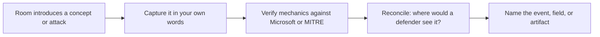

# Lab 6.3: TryHackMe Windows Path

**Month:** 6 (Windows Security)
**Pattern family:** Platform security and host defense
**Time budget:** 12 to 14 hours (across the Windows Fundamentals rooms plus one Active Directory room)
**Lab attempt floor:** 45 minutes per stuck task or question (these are guided rooms; the floor is per stuck point, not for the whole room)
**AI guidance:** Concept orientation only. You may ask AI to explain Windows or AD vocabulary a room introduces, then verify against Microsoft documentation. You do not ask AI for room answers, and you never paste a room answer or flag to the tutor. See "AI guidance for this lab." AI Provenance log mandatory.
**Prerequisites:** Labs 6.1 and 6.2 complete and their notebook entries committed (you have built a domain and read its logs; the rooms now reinforce that from the other side). TryHackMe free account (set up in Month 0).

**Recall first, from memory, before you read on:** in Lab 6.2 you generated a "Word spawns PowerShell" event and found it in Sysmon. Which event ID was the process creation, and which field showed you the parent? (You will reconcile this lab's attacks against that same detection skill.)

## Why this lab exists

Labs 6.1 and 6.2 built the platform and the defender's view. This lab fills in breadth and grounds the attack concepts. TryHackMe's Windows Fundamentals rooms walk you through the parts of Windows a quick build does not force you to touch (the registry in depth, the file system layout, the built-in tools, user and permission management), and an Active Directory room walks the domain concepts and at least one common attack in an environment that is explicitly authorized for the activity. Doing this on a platform whose terms of use permit it is the legal way to see an attack technique in motion, which reading alone cannot give you.

The rooms are guided, so the discipline here is different from the build labs. The temptation is to click through, paste an answer, and move on without retention. The floor and the notebook gate exist to stop exactly that. You treat each room as a source of concepts to capture, not a checklist of answers to submit.

## The scope rule and the flag rule, first

TryHackMe rooms are legal targets because the platform's terms of use authorize the activity inside the room's own deployed machines, and only those. You attack the room's target, nothing else. You do not point room techniques at any other host, your own lab included, unless that host is the room's intended target. `SAFETY.md` still governs everything outside the room.

And the flag rule, which is absolute: **the tutor never confirms a flag or a room answer.** Do not paste what you think the answer is and ask "is this right." The platform tells you if it is right; the tutor does not know and will not say. If you are stuck on a question, that is what the hint ladder is for (and the platform's own hints), not flag confirmation. This is the same discipline you built with picoCTF in Month 1, carried forward.

## Learning objectives

By the end of this lab, you can:

- **Analyze** core Windows internals a guided room surfaces: the registry's structure and key locations, the file system layout, built-in management tools, and user and group administration.
- **Explain** the Windows authentication and Active Directory concepts the AD room covers, in your own words, tied back to the domain you built in Lab 6.1.
- **Explain**, having seen it demonstrated in an authorized environment, at least one common AD attack (such as kerberoasting or another the room covers) at the level of what is requested, what is exploited, and what a defender would see.
- **Reconcile** each room's concepts with the telemetry you learned to read in Lab 6.2, so the attack and its detection sit together in your mind.
- **Defend** CTF discipline: the attempt floor per stuck point, the no-flag-confirmation habit, and a notebook entry that captures concepts rather than answers.

## Recognition cue

When you meet a Windows or Active Directory concept you only half-know, you reach for a guided, authorized environment that lets you see it in motion rather than only reading about it, and you capture the concept in your own words instead of clicking through for the answer. When an AD attack is described later, you can place it because you watched one demonstrated and reconciled it against the telemetry you built in Lab 6.2. This lab builds the habit of mining a guided room for durable concepts, not for flags.

## The loop this lab trains

Here is the loop you run for every room and every attack you see. It is what turns clicking through into retention.


*Notice: the loop never ends at "I got the flag." It ends at "I can say where this would show up in a log." That last step is the one the notebook gate checks.*

## AI guidance for this lab

Concept orientation, and unusually constrained because guided rooms make it easy to cross the line into having AI do the work.

**Allowed:** When a room introduces a term you do not know (an acronym, a tool, a protocol detail), you may ask AI to explain it in plain language, then verify against Microsoft documentation. "The room mentioned an SPN; what is it?" is a fair orientation question, verified afterward against Microsoft Learn.

**Not allowed:** Asking AI for the answer to a room question, asking it to walk you through a room, or pasting room content and asking AI to solve it. The rooms are guided learning; letting AI pre-chew them removes the learning. You also never ask the tutor to confirm an answer or flag.

**Logged:** AI orientation goes in your AI Provenance section as in every lab this month, with verification against Microsoft documentation. If you did not use AI on this lab (entirely possible, since the rooms explain their own terms), say so explicitly in the provenance section; "no AI used this lab" is a valid, and verifiable, entry.

## Tasks

### Task 1: Learn the concept-capture loop (gradual release)

The new skill of this lab is **mining a guided room for durable concepts and reconciling each attack with its detection**, not getting flags. You will learn that loop in three stages. The first two stages model the method on a worked teaching example so you can see the shape; they do not touch any room's graded content. Stage 3 is the rooms themselves.

#### Stage 1 - Worked example (I do)

Study this fully worked pass of the loop on a teaching concept you already met in Lab 6.2: a **registry run key used for persistence**. This is not a room question; it is here to model how you capture and reconcile a concept.

1. **Capture in your own words:** "A run key is a registry location that launches a program automatically at logon or boot. Malware writes itself there so it survives a reboot. That is persistence."
2. **Verify the mechanics:** check Microsoft's registry documentation that the run keys exist where you think and do what you said. Correct anything that was slightly off.
3. **Reconcile to detection:** ask where a defender would see a new run key appear. Sysmon records registry changes; a new value under a run key is the artifact.
4. **Name the artifact:** "A Sysmon registry-modification event showing a new value written under a Run key, with the process that wrote it."

That four-step pass is the whole method: capture, verify, reconcile, name the artifact. Notice the entry ends at the detectable artifact, not at "I read about run keys."

**Checkpoint:** you can state the four steps of the loop from memory and you understand why the final step names a specific artifact.
**If not:** re-read the worked pass and write the four steps as a list in your notebook before you start any room. You will run this loop for every concept the rooms surface.

#### Stage 2 - Faded practice (we do)

Now run the loop yourself on a second teaching concept, before any room. The concept is given; you fill in the steps. Use a concept you have not yet pinned down precisely, for example **a logon type** (you saw the field in Lab 6.2).

```text
Concept: the Windows logon type field (the number that says how a logon happened)

  1. Capture in your own words:  ______________________________________
  2. Verify against Microsoft Learn (logon types and their meanings): note what you confirmed or corrected
  3. Reconcile: ___   # TODO: which log and event would show a logon and its type?
  4. Name the artifact: ___   # TODO: the specific event and the field that holds the logon type
```

You ran this exact loop in Stage 1. For step 3, recall that logons are recorded in the default Security log (you compared it to Sysmon in Lab 6.2). For step 4, name the field that holds the type number.

**Checkpoint:** your four steps are filled in, step 2 cites a Microsoft Learn page, and step 4 names a concrete event and field rather than a vague "the logs."
**If not:** if step 4 is vague, you stopped at "I read about logon types." Push to the specific event and field; the Microsoft Learn logon-types page and your Lab 6.2 Security-log comparison are your sources.

#### Stage 3 - Independent (you do)

No scaffolding now, and this is the graded work. You will run the capture-verify-reconcile-name loop on the real rooms. The rooms below are your sources of concepts; this file does not, and will not, walk you through any room's tasks or answers. That is the CTF line: the method is modeled above on teaching concepts, and you apply it to the rooms yourself.

**Complete the Windows Fundamentals rooms.** Work through the TryHackMe Windows Fundamentals series (the rooms covering the desktop and core tools, the file system and registry, and Windows administration tooling). Treat them as a tour. As you go, run the loop and keep a running list of concepts that were new or that corrected a wrong assumption. Honor the floor per stuck question.

**Complete one Active Directory room.** Choose one that covers domain structure and at least one common attack (the platform's introductory AD rooms cover this; pick one appropriate to your level). As you work, capture how the room frames a domain (compare it to the one you built in Lab 6.1) and the mechanics of the attack it demonstrates: what is requested or stolen, what makes it work, and what a defender would observe. Honor the floor per stuck point; use the platform's hints and the tutor's hint ladder, not AI answers.

**Checkpoint:** the Windows Fundamentals rooms and one Active Directory room show as completed on your TryHackMe profile; your notebook holds at least eight concepts captured in your own words from the fundamentals rooms, and a written account, in your words, of the AD room's domain concepts and the attack it demonstrated, including what a defender would see. No flags or answers pasted to the tutor at any point.
**If not:** if you cannot write eight concepts in your own words, you clicked through rather than mining the room; go back and run the loop on the parts you skimmed. If an attack feels like magic, that is a hint-ladder question, not a reason to copy an explanation you do not follow.

### Task 2: Tie the fundamentals back to your own build (90 minutes)

For at least four of the concepts from the fundamentals rooms, connect them to what you saw in Labs 6.1 and 6.2. For example: the room covers the registry's run keys; you note where those sit and why they are a persistence surface you would now check, given the Sysmon registry events from Lab 6.2. This is the step that turns a click-through into retention.

**Checkpoint:** four written connections in your notebook, each linking a room concept to something concrete you built or observed in 6.1 or 6.2.
**If not:** if a connection is generic ("the room mentioned services, and services exist"), make it specific: name the service, the event, or the object you actually saw in your own build. The connection has to touch your environment, not the idea in general.

### Task 3: Reconcile the AD attack with the defender's view (90 minutes)

Take the attack the AD room demonstrated and reconcile it with Lab 6.2's telemetry skill. Where would this attack show up in the logs? Which event or field would surface it? If the room's attack is one of the month's four conceptual attacks (pass-the-hash, kerberoasting, golden ticket, lateral movement), connect it to the write-up you started in Lab 6.2 Task 6; if it is a different one, add it. Verify any attack mechanics you are unsure of against Microsoft or MITRE ATT&CK primary documentation.

**Checkpoint:** a written reconciliation: the attack from the room, mapped to where a defender using your Lab 6.2 telemetry would detect it, with the relevant event or artifact named and traced to a primary source.
**If not:** if you cannot name where the attack would surface, that gap is the point of the task; work it with MITRE ATT&CK's detection guidance for that technique and your Lab 6.2 channels, and write the question down precisely if you are still stuck.

### Task 4: Notebook entry with AI Provenance (60 minutes)

Write the lab notebook entry at `.tutor/notebook/lab-03-tryhackme-windows-path.md`. Required sections:

- **Pre-flight check** for any new tool a room had you run: what it does, what it leaves, what could go wrong, the authorization scope (the room's own target, authorized by the platform's terms).
- **Concept naming.** Name what this lab consolidated.
- **Evidence:** your concept lists, the connections to your own build, the attack-to-detection reconciliation. Screenshots of room completion are fine as evidence of work, but the substance is your written concept capture, not the answers.
- **Five-question debrief.**
- **AI Provenance:** which tool (or "no AI used this lab," if so), what terms you asked it to explain, what it said, the Microsoft or MITRE documentation you verified against, what you corrected.

**Checkpoint:** a committed entry with all sections, and no flags or room answers anywhere in it (capture concepts, not answers).
**If not:** if a section is missing, or the entry records answers instead of concepts, the tutor rejects it. The substance is your written concept capture and the attack-to-detection reconciliation, not the room's answers.

## Definition of Done

You are done when all of these are true:

- The Windows Fundamentals rooms and one Active Directory room show as completed on your TryHackMe profile.
- At least eight concepts are captured in your own words, four of them connected to your Lab 6.1 or 6.2 work.
- The AD room's attack is reconciled to where a defender would detect it, with the artifact named and traced to a primary source.
- The notebook entry is committed with all sections, including AI Provenance (or an honest "no AI used this lab"), and contains no flags or room answers.

**Self-explain:** in one sentence, why does ending each concept at "where would a defender see it" turn a guided room into something you will still know in three weeks?

## Stretch goals

1. Take a second AD attack the room mentions but does not fully demonstrate, and run the capture-verify-reconcile-name loop on it from MITRE ATT&CK alone. Name the detection artifact.
2. Compare how the room frames a domain to the domain you actually built in Lab 6.1. Write three sentences on one thing the room simplified or left out.
3. Pick one built-in Windows tool a fundamentals room introduced and find its PowerShell equivalent. Note which you would reach for during an incident and why.
4. For the AD attack you saw, write the one-line filter or query you would run against your own Lab 6.2 telemetry to hunt for it, and explain what it would and would not catch.

## Troubleshooting

- **You retain nothing after clicking through.** The notebook gate is the antidote: if you cannot write eight concepts in your own words, you watched the room rather than mining it. Slow down and run the four-step loop on each concept.
- **You want the tutor to confirm an answer.** It will refuse, every time, for every platform. The platform confirms answers; the tutor never does. Pushing on it only burns turns.
- **An AD room's attack feels like magic.** Do not let "the room did it for me" stand in for understanding. Use Task 3 to force the mechanics into words and tie them to detection; if you cannot, that is a hint-ladder question.
- **You catch yourself asking AI for room answers.** Stop; that is the line. The rooms explain their own terms. Reach for AI only when a term genuinely is not explained, and verify it against Microsoft documentation.

## Time budget breakdown

- Task 1: 9 to 11 hours (Stage 1 and Stage 2 modeling ~45 min total; Stage 3 is the Windows Fundamentals rooms at 5 to 6 hours and the AD room at 4 to 5 hours)
- Task 2: 90 minutes
- Task 3: 90 minutes
- Task 4: 60 minutes

Total: 12 to 14 hours.

## Resources

Primary sources first. Full annotated list in `../../reading.md`.

- TryHackMe: the Windows Fundamentals rooms and the introductory Active Directory rooms (the lab environments themselves, authorized for the activity by the platform's terms).
- Microsoft Learn: the Active Directory and Kerberos documentation, to verify any attack mechanics a room asserts.
- MITRE ATT&CK: the technique pages for the AD attack the room demonstrates (primary reference for what it is and what it leaves, including detection guidance; used to verify and connect to detection, not to execute elsewhere).
- Your own Lab 6.1 and 6.2 notebook entries, which are the ground truth you reconcile the rooms against.
