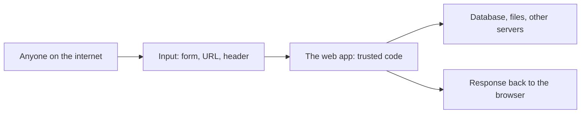

# Month 7: Web Application Security (and SQL)

**Pattern family:** Web and application security
**Time budget:** 55 hours
**AI guidance:** AI-augmented month, in the **brainstorming variations** pattern only. Week 1 (SQL fluency) is hand-written and AI-free; Weeks 2 to 4 unlock the brainstorming pattern under strict limits. Read the "AI augmentation this month" section below before your first lab. The AI Provenance log is mandatory in every notebook entry, including the SQL lab where it is a declared null.
**Prerequisites:** Months 1 to 6 complete. You can read HTTP at the protocol level conceptually (Months 3 and 4), write a Python tool and use SQLite from Python (Month 5), and reason about a host you own versus a host you do not (every prior month, and `SAFETY.md`). Burp Suite is new this month; you will pre-flight it before you run it.

## Why this month exists

Web applications are the single biggest source of breaches at small and mid-sized companies. The reason is structural. A web app is a program that takes input from anyone on the internet. It mixes that input with a database. Then it hands the result back. Every place where untrusted input meets a trusted system is a place an attacker probes. If you know where those seams are, and you can read an HTTP request the way you read a packet in Month 4, you can find and explain the flaws that show up in real assessments every week.

This month also gives you SQL. You have only touched it so far through `sqlite3` in Month 5. SQL is not optional background here. It is the language the database speaks. You cannot reason about SQL injection (the flaw, not the buzzword) until you can write the query the application was supposed to run. Only then can you see how attacker input rewrites that query. So Week 1 is pure SQL fluency, hand-written, before any web attack surface opens. The fluency you build in Week 1 is what makes Weeks 2 to 4 make sense instead of feeling like magic spells.

Here is the seam this whole month is about, and where each lab attacks it:

*Notice: the danger lives at the arrow from B into C. The app trusts its own code, but the input came from a stranger. Every flaw this month is the app treating that input as more trustworthy than it is.*

## The scope rule governs every lab this month, without exception

This is the most scope-sensitive month in the course so far, because the techniques are the same ones that put people in federal court when aimed at the wrong target. Read this now, and re-read it in every lab's scope section:

You run Burp Suite, and you send any crafted request, **only** against these four target classes:

- Your own DVWA install, running on your own host or VM.
- Your own OWASP Juice Shop install, running on your own host or VM.
- The PortSwigger Web Security Academy, which authorizes this activity in its terms of use for its own hosted labs only.
- Your own custom vulnerable app (Lab 7.5), running locally.

Anything else is out of scope. Not a website you happen to use. Not a public app "just to see if it has SQLi." Not a bug bounty target during this course. `SAFETY.md` is the contract; this paragraph is its application to web work. The tutor will refuse to assist with any request aimed outside these four classes, and so should you.

## Warm-Up: Retrieve Before You Begin

Answer these from memory, no peeking, before you read on. They pull forward the prior-month skills this month leans on.

1. From Month 5: why is a parameterized SQL query safer than building the query string by hand? (You met this by name and were told it would return in Month 7.)
2. From Month 4: what does an HTTP request line look like, and what are three things a request carries besides that line?
3. From Months 5 and on: in the drafting pattern, who decides whether AI's output is good enough, and how?
4. From every prior month and `SAFETY.md`: what makes a target legal for you to test?

Check your recall

1. A parameterized query sends the input to the database as a bound value, not as part of the query text, so the value can never be read as SQL. Hand-built query strings let attacker input become commands. That is SQL injection. From Month 5, Lab 5.2.
2. The request line is a method, a path, and a version, like `GET /search?q=cat HTTP/1.1`. Besides it, a request carries headers, cookies, and (for `POST` and similar) a body. From Months 3 and 4.
3. You decide, and your own tests decide, not the AI. The loop only exits when your tests pass and you can defend every line yourself. From the Month 5 drafting pattern.
4. You own it, or you have explicit written permission, or it is a platform that authorizes the activity in its own terms. Nothing else. From `SAFETY.md` and every prior month's scope rule.

## Learning objectives

By the end of this month, you can:

- Write SQL by hand against a multi-table schema: `SELECT`, `WHERE`, the `JOIN` family, `GROUP BY`, `HAVING`, and subqueries, and explain why a parameterized (prepared) statement closes the injection seam that string-built SQL opens.
- Explain an HTTP request and response at the wire level (method, path, headers, body, status, cookies) and explain how the same-origin policy and CORS decide what a browser will and will not let script do.
- Operate Burp Suite Community as a daily driver: intercept, modify, and replay requests against an authorized target, and read what comes back.
- Analyze a web application for the OWASP Top 10 (2025) categories, identifying which category a given flaw belongs to and why.
- Produce reproduction steps for a vulnerability that another person could follow to confirm it, written the way a finding in a real report is written.
- Defend, from memory and with your AI session closed, any payload you used and any query you wrote.

## Recognition cue

When you see a login form, a search box, a URL with an `id=` parameter, or a file upload, you should feel a specific itch: where does this input go, what system does it touch, and what happens if it is not what the developer expected. When AI hands you a list of payload variations, you reach for the verification habit before you reach for copy-paste. This month builds both reflexes.

## Core concepts to internalize

Read these to understand the labs, not to memorize them. Each chunk is one idea.

### SQL as a language, not a footnote

**SQL** (Structured Query Language) is how you talk to a relational database. A database holds **tables**, which are grids of rows and columns. A **primary key** is the column that uniquely names each row. A **foreign key** is a column in one table that points at a row in another. You ask for data with `SELECT`, you filter with `WHERE`, and you sort with `ORDER BY`. You combine tables with the **`JOIN` family** (inner, left, right, full), and each kind decides what happens to rows that have no match on the other side. You summarize many rows into one with `GROUP BY`, and you filter those summaries with `HAVING`. A **subquery** is a query nested inside another query. All of this is Week 1, and you write every bit of it by hand.

### Parameterized queries versus string-built queries

> **Heavy concept ahead.** Slow down here; this is the load-bearing idea of the month.

There are two ways an app can build a query from user input, and the difference is the whole month. A **string-built query** glues the input into the query text, like `"... WHERE name = '" + input + "'"`. The database then reads the combined text and cannot tell which part was code and which part was the stranger's input. A **parameterized query** (also called a prepared statement) sends the query and the input separately. The input arrives as a **bound value**, a piece of pure data that the database never reads as code. SQL injection is what happens when string-built input gets parsed as code. Parameterizing is the fix, because a bound value can never become a command.

> **Common misconception.** "SQL injection is some exotic hacker trick."
> **Reality.** It is a plain consequence of gluing strings together. If you can write the query the app meant to run, you can see the injection in seconds. That is exactly why Week 1 makes you write queries by hand before you attack anything.

### HTTP at the wire level

**HTTP** (HyperText Transfer Protocol) is how a browser and a server talk. A request has a **request line** (the method, the path, the version), then **headers** (extra facts like which host and what content type), then sometimes a **body** (the data being sent). The server replies with a **status code**: 200s mean success, 300s mean redirect, 400s mean you got it wrong, 500s mean the server got it wrong. A **`GET`** asks for data; a **`POST`** sends data to be acted on. A method is **idempotent** when doing it twice has the same effect as doing it once, which matters for a flaw class called CSRF.

### Sessions, cookies, and the same-origin policy

A **cookie** is a small piece of data the server sets in your browser with a `Set-Cookie` header, and your browser sends it back on every later request. A **session cookie** is how a site remembers you are logged in. Three cookie settings defend it: **`HttpOnly`** hides the cookie from page scripts, **`Secure`** sends it only over HTTPS, and **`SameSite`** controls whether other sites can trigger requests that carry it. The **same-origin policy** is a browser rule that stops a script on one site from reading another site's data. **CORS** (Cross-Origin Resource Sharing) is the controlled way a server relaxes that rule on purpose.

> **Common misconception.** "HTTPS means the site is secure, so there is nothing left to attack."
> **Reality.** **HTTPS** (HTTP secured with TLS) protects data while it travels between browser and server. It does nothing about a bug in the app's own logic. A site can have perfect HTTPS and still hand you another user's data through a broken query. TLS guards the wire, not the code above it.

### The OWASP Top 10 (2025) as a map

The **OWASP Top 10** is a widely used list of the most serious web flaw classes, published by the Open Worldwide Application Security Project. The **2025** edition names ten categories: broken access control, security misconfiguration, software supply chain failures, cryptographic failures, injection, insecure design, authentication failures, software or data integrity failures, security logging and alerting failures, and mishandling of exceptional conditions. You will meet most of these by hand. Read the official 2025 list (see `reading.md`); do not work from a half-remembered older edition, because the categories were renamed and reordered.

### The proxy as the central tool

**Burp Suite** is an **intercepting proxy**: a program that sits between your browser and the target so you can see, pause, and change every request before it goes out. That one idea is the foundation of the whole web half of the month. Everything else you use in Burp (Repeater to replay a request, the request history to review what happened) is built on top of it.

## AI augmentation this month: brainstorming variations

This month unlocks exactly one new pattern. It is narrow on purpose.

**The brainstorming-variations pattern.** You find the vulnerability. You craft the first working payload by hand, from your own understanding of the flaw. Only then may you ask AI for variations on that payload to test, for example different encodings, different injection contexts, or alternative syntaxes that might bypass a filter you have already characterized yourself. AI generates candidates; you reason about which to try, you run them against your authorized target, and you record what each one did.

**What this is not.** AI does not identify the vulnerability; you do. AI does not tell you where to look or which challenge to solve. AI does not write the seed payload (if you cannot write the first one yourself, you do not yet understand the flaw well enough to brainstorm variations of it). AI does not write your custom vulnerable app in Lab 7.5; that code is yours. AI never touches a target; you run every request yourself, against an authorized target only.

**Week 1 is AI-free.** The SQL fluency drills in Lab 7.1 are hand-written, with no AI assistance, the same way Months 1 to 4 were. You cannot brainstorm variations on a query you cannot write. The AI-free discipline of the SQL week is what earns you the brainstorming pattern in the web weeks.

**The "AI as junior teammate" framing** applies as always. AI is a fast junior who suggests ten payload variants, of which two are clever, six are noise, and two are subtly malformed in a way that will waste your afternoon if you paste them blind. You are the senior who decides which to run and who owns the result.

Read `AI-ETHICS.md` at the repo root before your first web lab if you have not already. The brainstorming pattern lives inside the same provenance and verification discipline as every other pattern in the course.

## The AI Provenance log (mandatory, including where it is null)

Every lab notebook entry this month includes an "AI Provenance" section. For Lab 7.1, which is AI-free, the section is a declared null: a sentence stating that no AI was used, because the SQL drills are hand-written per this lab's guidance. Writing "no AI used, and here is why" is itself the discipline; a missing section is rejected by the lab notebook gate the same way a missing debrief question is.

For Labs 7.2 to 7.5, the section documents:

- **Which AI tool** you used (model and interface).
- **What you asked** (your seed payload, and the request for variations; verbatim for anything substantive).
- **What was generated** (the variations, and how many).
- **What verification you performed** (which variants you ran against which authorized target and what each returned; not "I tried them").
- **What you discarded** as malformed, irrelevant, or out of scope, and why. The discards are the most useful entries.

## The verification ritual

For any payload you used or any non-trivial query you wrote that appears in your AI Provenance log, the tutor selects one element at random and asks you to explain it from memory, with your AI session closed: why this `JOIN` returns those rows, why this encoding bypasses that filter, why this request triggers the flaw. If the explanation is shaky, the artifact returns until you can defend it. This is the in-course version of the interview question "walk me through this finding." Expect it.

## Labs

Five labs. The first builds the SQL fluency the rest depend on; the next four are web security against authorized targets only. Complete in order; each assumes what the previous one built. Full specs in each lab's directory.

- **Lab 7.1: SQL Fluency** (`labs/lab-01-sql-fluency/`). Local PostgreSQL and MySQL, a sample schema (users, login attempts, sessions, audit logs), and a set of hand-written query drills covering the full SQL surface this month needs. AI-free.
- **Lab 7.2: PortSwigger Apprentice** (`labs/lab-02-portswigger-apprentice/`). Complete apprentice-level labs across SQL injection, XSS, CSRF, access control (IDOR), SSRF, file upload, and authentication, on PortSwigger's authorized platform.
- **Lab 7.3: OWASP Juice Shop** (`labs/lab-03-owasp-juice-shop/`). Stand up your own Juice Shop and document your first twenty solved challenges with reproduction steps.
- **Lab 7.4: DVWA Walkthrough** (`labs/lab-04-dvwa-walkthrough/`). Run Burp against your own DVWA and document one vulnerability mapped to each OWASP Top 10 (2025) category you can demonstrate there.
- **Lab 7.5: Custom Vulnerable App** (`labs/lab-05-custom-vulnerable-app/`). Build a small Flask or Express app with two deliberate, documented flaws. You write the code. Remove it from any public hosting after the lab.

## Weekly rhythm and the warm-start

Week 1 is SQL fluency (Lab 7.1, AI-free). Weeks 2 to 4 are the web labs (7.2 to 7.5) under the brainstorming-variations pattern. **Week 1 opens with a warm-start that keeps a prior skill alive:** before you write any new SQL, re-run your Month 5 log parser against one of its old sample logs and write down one question you would answer faster with SQL than with the Python you wrote then. That single line connects the database you used through `sqlite3` in Month 5 to the database language you are about to learn in full.

## The cold-revisit week

The third Friday of this month is a cold revisit, as always. The tutor pulls a prior lab and asks you to redo a sub-task blind: re-write a `JOIN` from Week 1 against the sample schema from memory, or re-explain one OWASP category and the flaw you mapped to it without your notebook open. Web knowledge decays fast because the payloads feel like trivia until you have re-derived them cold. The revisit is what converts trivia into recall.

## Notebook entry requirements

Each lab produces a notebook entry at `.tutor/notebook/lab-NN-<slug>.md` with the standard sections **plus** the AI Provenance section:

- **Pre-flight check** for any new tool. Burp Suite gets a real pre-flight in Lab 7.2: what it does at the proxy and HTTP level, what artifacts it leaves (its proxy CA in your browser's trust store, request history on disk), what could go wrong (intercepting traffic to a target you are not authorized to test), and the authorization scope.
- **Concept naming.**
- **Evidence:** screenshots of the request and response, reproduction steps, query output, file references. Enough that someone else could reproduce your result.
- **Five-question debrief.**
- **AI Provenance** (see above). Mandatory in every lab, declared null in Lab 7.1.

A note on flags and scoreboards: Juice Shop has a scoreboard and the PortSwigger labs report "solved." The tutor does not confirm any of these for you, the same way it never confirms a CTF flag. Solving is between you and the platform. Do not paste a flag, a solved-banner, or a scoreboard token to the tutor and ask whether it is right; submit it on the platform and read what the platform tells you.

## Reflect

Spend ten minutes on these in your notebook (writing, not just thinking):

- **Explain it back:** in two or three sentences, explain to a peer who just finished Month 6 why a string-built query is exploitable and a parameterized query is not.
- **Connect:** how does writing SQL by hand in Week 1 change the way you read a login form or an `id=` URL in Weeks 2 to 4?
- **Monitor:** which flaw class this month is still fuzzy? Name it exactly, and write the one question that would clear it up.

## End-of-month deliverable

A `web-security-portfolio.md` documenting your completed labs with screenshots, plus the custom vulnerable app's repository. Full specification in `deliverable.md`. The custom app's repo is public for review during the lab and then taken off any public hosting; the portfolio writeup is a lasting portfolio piece.

## Common pitfalls

- **Skipping SQL fluency to get to the "fun" attacks.** Week 1 feels slow, but every web week assumes it. If you cannot write the query, you cannot read the injection. Do Lab 7.1 in full.
- **Pasting AI payload variants without reasoning.** AI hands you ten variants; some are noise and some are malformed. Running them blind wastes your afternoon and teaches nothing. Reason about each, then run it.
- **Letting AI find the flaw.** The pattern is: you find it, you craft the seed payload, then AI suggests variations. If AI told you where to look, you skipped the only thing that builds the recognition cue.
- **Pointing Burp at a site outside the four target classes.** "Just to see if the technique transfers" is how people end up in court. Set Burp's scope and keep it there.
- **Leaving a deliberately vulnerable app reachable.** A broken app on the open internet is found by scanners within hours. Bind it to localhost, and tear down anything reachable when Lab 7.5 ends.
- **Forcing every OWASP category onto a DVWA module.** An honest "DVWA does not demonstrate this, and here is where it would show up" is a correct answer, not a gap.

## Knowledge Check

Answer from memory first, then check. Items marked ⟲ are spaced callbacks to earlier months and are supposed to feel like a small stretch.

1. In your own words, what makes a string-built query exploitable, and what does a parameterized query change?
2. Name three of the OWASP Top 10 (2025) categories and give a one-line example of each.
3. What does an intercepting proxy like Burp let you do that the browser alone does not?
4. A scan of one `id=` parameter returns another user's record when you change the number. Which OWASP category is this, and what is the common name for the flaw?
5. ⟲ Why is "closed" different from "filtered," and why does HTTPS not protect against a broken query?
6. What is the difference between `HAVING` and `WHERE`, and which one filters groups?
7. ⟲ From Month 5: what are the five steps of the drafting loop, and who decides if a draft is good?
8. ⟲ From Month 4: what are the three packets of the TCP handshake, and which side sends each?
9. ⟲ From `SAFETY.md` and every prior month: what are the only kinds of target you may test, and what makes the custom app in Lab 7.5 special when the lab ends?

Answer key

1. A string-built query glues input into the query text, so the database parses attacker input as code; that is SQL injection. A parameterized query sends the input as a bound value, pure data the database never reads as code, which closes the seam.
2. Any three, for example: broken access control (a user reaches data that is not theirs by changing an id); injection (input parsed as SQL or script); authentication failures (a login flow that can be skipped or brute-forced). Confirm the exact names against the official 2025 list.
3. It lets you see, pause, and modify every request before it goes out, then replay a modified request. The browser sends only what its forms allow; the proxy lets you change anything.
4. Broken access control, and the common name is IDOR (insecure direct object reference). The server trusted an identifier it should have checked against who is logged in.
5. ⟲ "Closed" means the host replied and refused; "filtered" means no reply, usually a firewall dropping it (Month 3, reinforced Month 4). HTTPS protects data in transit only; a broken query is a flaw in the app's logic above TLS, so encryption does nothing about it.
6. `WHERE` filters individual rows before grouping; `HAVING` filters the groups after `GROUP BY` has aggregated them. `HAVING` is the one that filters groups.
7. ⟲ Spec, write tests, get AI draft, verify against your tests, fix-or-own. You and your tests decide, never the AI. From Month 5.
8. ⟲ SYN (client to server), SYN-ACK (server to client), ACK (client to server). From Month 4.
9. ⟲ Only a host you own, a host you have explicit written permission to test, or a platform that authorizes the activity in its own terms. The Lab 7.5 app is intentionally vulnerable, so its running instance is removed from any reachable host when the lab ends; only the source repo stays.

## How to know you are done with this month

- Five lab notebook entries committed, each with a complete AI Provenance section (a declared null is complete for Lab 7.1).
- `web-security-portfolio.md` committed, documenting all five labs with screenshots and reproduction steps.
- The custom vulnerable app's repository exists, its README documents its two flaws, and it has been removed from any public hosting after the lab.
- The cold-revisit week's sub-task completed and logged.
- You can pass the verification ritual on any payload or query in your provenance logs.
- `.tutor/progress.md` updated to "Month 7 complete; ready for Month 8."

If any AI Provenance section is missing, or the custom app is still publicly hosted, the month is not done. The scope discipline and the provenance discipline are the curriculum, not extras.

## Resources

Curated free resources, primary sources first, in `reading.md`.
