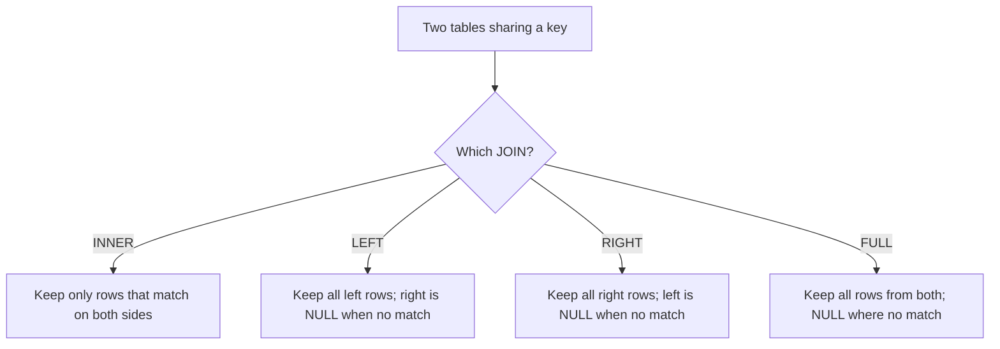

# Lab 7.1: SQL Fluency

**Month:** 7 (Web Application Security and SQL)
**Pattern family:** Web and application security
**Time budget:** 12 to 14 hours (across multiple sessions; do not attempt in one)
**Lab attempt floor:** 90 minutes
**AI guidance:** AI-free. The SQL drills are hand-written, the same discipline as Months 1 to 4. See "AI guidance for this lab" below; the notebook AI Provenance section is a declared null for this lab.
**Prerequisites:** Month 7 README read, including the scope rule and "AI augmentation this month." Month 5 (`sqlite3` from Python) gave you implicit SQL exposure; this lab makes SQL explicit. No prior SQL assumed beyond that.

**Recall first, from memory, before you read on:** in Month 5 you loaded log data into SQLite and queried it. You were told one idea would return by name in Month 7: why is a parameterized query safer than a query built by gluing strings together? (Hold your answer; this lab is where you earn the right to that answer by writing the queries themselves.)

## Why this lab exists

You cannot reason about SQL injection until you can write the query the application meant to run. SQL injection is not magic. It is what happens when attacker-controlled text gets glued into a query string and the database parses part of that text as code instead of data. To see that, you have to be fluent in the code. You have to know what the developer's `SELECT ... WHERE username = '<input>'` does, so you can see what changes when `<input>` is no longer a username.

This week is therefore pure SQL, hand-written, before any web attack surface opens. It is AI-free for the same reason Months 1 to 4 were: you are building the muscle that lets you judge AI's output later. When AI offers you five SQLi variations in Lab 7.2, the only reason you will tell the clever one from the malformed one is that you wrote the underlying queries yourself this week.

You also build fluency in two real databases, PostgreSQL and MySQL. Their dialects differ in small ways (string functions, `LIMIT` versus `TOP`, comment syntax), and those differences matter when you are reading an injection later and trying to fingerprint the backend.

## The scope rule

Everything in this lab runs on your own machine: a local PostgreSQL and a local MySQL instance, with a sample schema you load yourself. There is no remote target and no attack surface in this lab. The scope rule still gets stated in your notebook, because stating it is the habit, and the habit is what keeps you safe in the labs that do have a remote surface.

## Learning objectives

By the end of this lab, you can:

- Install and connect to a local PostgreSQL and a local MySQL instance and load a multi-table schema into each.
- Write `SELECT` queries with `WHERE`, `ORDER BY`, and `LIMIT` that return exactly the rows a question asks for.
- Write the `JOIN` family (inner, left, right, full) by hand and explain what each does to rows that have no match on the other side.
- Aggregate with `GROUP BY` and filter groups with `HAVING`, and explain why `HAVING` is not the same as `WHERE`.
- Write correlated and uncorrelated subqueries and explain when each is the right tool.
- Explain, in writing, the difference between a string-built query and a parameterized (prepared) statement, and why the second closes the injection seam the first opens.

## Recognition cue

When a later lab shows you a login form or a URL with an `id=` parameter, you will mentally reconstruct the `SELECT ... WHERE` behind it. That reconstruction is the skill this lab builds. If you cannot picture the query, you are not ready to attack it; you are back here.

## AI guidance for this lab

AI is **not permitted** for the SQL drills in this lab. You write every query by hand, from the documentation and your own reasoning. This is the Week 1 AI-free rule stated in the Month 7 README, and it is the foundation of the brainstorming-variations pattern you unlock next week: you cannot brainstorm variations on a query you cannot write.

AI is permitted, as always, for off-curriculum questions and for unrelated software. It is not permitted to write, complete, debug, or explain a drill query for you. The PostgreSQL and MySQL documentation (see Resources) is your source; reading it is part of the lab.

Your notebook entry's AI Provenance section for this lab is a **declared null**: a sentence stating that no AI was used, because the drills are hand-written per this lab's guidance. Write it anyway. The discipline of declaring the null is the same discipline that makes the real provenance logs honest later.

## Tasks

Do these in order. Each task has explicit acceptance criteria. The drills in Tasks 3 through 6 are stated as questions, not as queries; the query is yours to write.

### Task 1: Stand up two databases (90 minutes)

Install PostgreSQL and MySQL locally (or run each in a container; your choice, justify it in your notebook). Confirm you can connect to each from its command-line client (`psql` for PostgreSQL, `mysql` for MySQL) and run a trivial query such as `SELECT 1;`.

Orienting commands to start from (you will need others, and connection details depend on your install):

```
psql -h localhost -U postgres -d postgres
mysql -h 127.0.0.1 -u root -p
```

**Checkpoint:** `SELECT 1;` returns a single value `1` from both `psql` and `mysql`, and you have a note recording how you installed each database and the client command you use to connect.
**If not:** if the client cannot connect, the cause is almost always the service not running or wrong credentials; start the service (`brew services start postgresql`, for example) and confirm the user and password your install created. Do not proceed until both clients connect; connecting is the task.

### Task 2: Load the sample schema (60 minutes)

Create a schema in each database modeling a small application's data. Use these four tables, with at least these columns (add sensible types and keys yourself; deciding the types is part of the learning):

- **users**: a primary key id, a username, an email, a password hash, a role, a created timestamp.
- **login_attempts**: a primary key id, a foreign key to users, a source IP, a success boolean, an attempted timestamp.
- **sessions**: a primary key id, a foreign key to users, a session token, an issued timestamp, an expiry timestamp.
- **audit_logs**: a primary key id, a foreign key to users (nullable, since some events are anonymous), an action string, a detail string, an event timestamp.

Populate each table with enough synthetic rows to make the drills meaningful: on the order of twenty users, a few hundred login attempts (a realistic mix of successes and failures, some from the same IP), several sessions per active user (some expired), and a few hundred audit-log rows. Generate this data yourself (a short script is fine, and a script is not a drill answer); use only synthetic data, never real credentials or real personal data.

**Checkpoint:** a `schema.sql` (your `CREATE TABLE` statements) and a record of how you loaded the data, committed in this lab's directory, working in both PostgreSQL and MySQL, with the row counts above. The schema is the environment for the rest of the lab; writing it is allowed and expected.
**If not:** if the same `CREATE TABLE` fails in one database but not the other, you hit a dialect difference (auto-increment syntax and some type names differ between Postgres and MySQL); note the difference and the fix, because that exact kind of difference is what fingerprints a backend during an injection later.

### Task 3: SELECT, WHERE, ORDER BY drills (2 hours)

Answer each of these by writing a query by hand and running it against your schema. State the question and your query in your notes; confirm the result is what you expected.

1. List every user, most recently created first.
2. List the username and email of users whose role is administrator.
3. List users created before a date you choose, ordered by username.
4. List the ten most recent login attempts, showing the source IP and whether each succeeded.
5. List the distinct source IPs that have ever attempted a login.
6. List sessions that have already expired as of now.

**Checkpoint:** six questions, six queries you wrote, six results you can explain. For at least two, you wrote one sentence on why the `WHERE` clause selects exactly the rows it does.
**If not:** if a query returns rows in an order you did not expect, you left out `ORDER BY` (a database returns rows in no guaranteed order without it). The tutor will not check your queries against a key; it will ask you to explain one from memory, so the explanation is the deliverable, not a matching answer.

### Task 4: JOIN family drills (2.5 hours)

These are the heart of the lab, and joins are the part beginners get wrong most often. So you learn the technique in three stages first, on a tiny teaching schema that has nothing to do with the drills, then you do the real drills on your own.

A **join** combines rows from two tables by matching a value they share. The kind of join decides what happens to a row that has no match on the other side. Here is the picture to hold:


*Notice: the only question a join answers is "what do I do with rows that did not match." Inner drops them; the outer joins keep them and fill the missing side with NULL.*

#### Stage 1 - Worked example (I do)

Study this fully worked example. It uses a throwaway two-table schema, **not** the four-table schema your drills run against, so you can focus on the join itself. Make two tiny tables and three rows in your local PostgreSQL, then run each query and read the result.

```sql
CREATE TABLE authors (id INT PRIMARY KEY, name TEXT);
CREATE TABLE books   (id INT PRIMARY KEY, author_id INT, title TEXT);

INSERT INTO authors VALUES (1, 'Lee'), (2, 'Mara'), (3, 'Nadia');
INSERT INTO books   VALUES (10, 1, 'Tides'), (11, 1, 'Reef');
-- Note: Mara has no book; book 11 and 10 are both Lee's; Nadia has no book.

-- INNER JOIN: only authors who have at least one book.
SELECT authors.name, books.title
FROM authors
INNER JOIN books ON books.author_id = authors.id;

-- LEFT JOIN: every author, even ones with no book (title comes back NULL).
SELECT authors.name, books.title
FROM authors
LEFT JOIN books ON books.author_id = authors.id;
```

Read it line by line. `FROM authors` is the left table. `INNER JOIN books ON books.author_id = authors.id` matches each author to their books by the shared key. The inner join returns only Lee's two rows, because only Lee has matches. The left join returns Lee twice plus Mara and Nadia once each, with `title` showing NULL for the two authors who have no book. That single difference, dropping unmatched rows versus keeping them with NULL, is the whole idea.

**Checkpoint:** the inner join returns 2 rows (both Lee's), and the left join returns 4 rows (Lee twice, Mara with NULL, Nadia with NULL).
**If not:** if the left join also drops Mara and Nadia, you wrote `INNER` where you meant `LEFT`, or you put a condition on `books` in a `WHERE` clause (which silently turns a left join back into an inner one). Keep the match condition in the `ON`, not the `WHERE`.

#### Stage 2 - Faded practice (we do)

Stay on the same `authors` and `books` teaching tables. Fill in the two blanks. The goal and expected result are given; you supply the join type and the preserved side.

```sql
-- Goal: list EVERY author together with how many books they have,
-- including authors with zero books (they should show a count of 0).
SELECT authors.name, COUNT(books.id) AS book_count
FROM authors
____ JOIN books ON books.author_id = authors.id   -- TODO: which join keeps authors who have no book?
GROUP BY authors.name;

-- Goal: list only the books whose author row is missing from the authors table
-- (an orphan check). Insert a book with author_id = 99 first to create one.
SELECT books.title
FROM books
LEFT JOIN authors ON authors.id = books.author_id
WHERE ____ ;                                        -- TODO: what test finds the unmatched (NULL) side?
```

For the first blank, recall from Stage 1 which join keeps the rows that have no match. For the second, an unmatched left join fills the right side with NULL, so the orphan rows are exactly the ones where the joined `authors.id` is NULL.

**Checkpoint:** the first query lists all three authors, with Lee at 2 and Mara and Nadia at 0; the second query returns the title of the book whose `author_id` is 99.
**If not:** if authors with zero books vanish from the first query, you used `INNER`; switch to `LEFT`. If `COUNT(*)` gave a 1 instead of a 0 for Mara, count the right-side key (`COUNT(books.id)`) rather than `COUNT(*)`, because `COUNT(*)` counts the NULL row too.

#### Stage 3 - Independent (you do)

No scaffolding now, and back to your real four-table schema (users, login_attempts, sessions, audit_logs). For each drill, write the query, run it, and explain in one line what the join does to non-matching rows.

1. For every login attempt, show the username of the user it belongs to and whether it succeeded (an inner join).
2. List every user together with their count of login attempts, including users who have never attempted a login (think carefully about which join preserves the users with no attempts).
3. List audit-log events together with the username that performed them, including anonymous events where the user is null (which side must be preserved).
4. Find users who have a session but appear in no audit log (a join plus a test for absence; there is more than one correct shape, and a later subquery drill revisits this).
5. Show, for each user, their most recent successful login attempt (this one is genuinely harder; reason about it before you write it).

**Checkpoint:** five queries, run and explained. Drill 2 and drill 3 demonstrate that you know which side of an outer join is preserved and why the unmatched rows show NULL.
**If not:** if drill 2 loses the users who never logged in, you used an inner join where a left join was needed (the same mistake Stage 1 warned about); the user table is the side you must preserve. The "redo this cold" debrief question will pull one of these joins.

### Task 5: GROUP BY and HAVING drills (2 hours)

1. Count login attempts per source IP.
2. Count failed login attempts per source IP, and show only IPs with more than a threshold you choose (this is where `HAVING` earns its place; explain why `WHERE` cannot do this filter).
3. For each user, count their sessions and show the earliest and latest session issue time.
4. Count audit-log events per action, ordered from most frequent to least.
5. Find users whose count of failed logins exceeds their count of successful logins (you will need to aggregate conditionally; reason about how).

**Checkpoint:** five queries, run and explained, plus a written answer to "why is `HAVING` not the same as `WHERE`, and what is each filtering." Drill 2 is the canonical brute-force-detection query you will recognize again in Month 9; note that connection.
**If not:** if the database rejects your `WHERE COUNT(...) > 5`, that is the lesson: you cannot filter on an aggregate in `WHERE`, because `WHERE` runs before the grouping happens. Move that condition to `HAVING`, which runs after.

### Task 6: Subquery drills and the prepared-statement writeup (2 hours)

1. List users whose login-attempt count is above the average login-attempt count across all users (an uncorrelated subquery in the comparison).
2. For each user, list their login attempts that occurred after that same user's most recent successful login (a correlated subquery; explain what makes it correlated).
3. Re-solve drill 4 from Task 4 (users with a session but no audit log) using a subquery with `NOT EXISTS` or `NOT IN`, and compare it to your join-based answer. Which do you find more readable, and are they always equivalent (think about nulls and `NOT IN`)?

Then, in prose, write the lab's conceptual payoff:

4. Take the login query from Task 3 drill 4 and write down, in plain text, what the application's query string would look like if it built the query by concatenating a username the user typed: `... WHERE username = '` plus the input plus `'`. Now describe, in words, what an attacker could put in the username field to change what that query does. **Do not write a working injection payload here**; describe the mechanism in prose (for example, "input that closes the string literal and adds a boolean that is always true would make the `WHERE` clause match every row"). Then explain how a parameterized (prepared) statement, where the input is sent to the database as a bound value rather than as part of the query text, removes that possibility. Cite the PostgreSQL or MySQL documentation on prepared statements.

**Checkpoint:** three subquery drills run and explained, plus a prose writeup (roughly 200 to 400 words) on the injection mechanism and how parameterization closes it. The writeup contains no working payload; it explains the mechanism in words.
**If not:** if your `NOT IN` subquery returns zero rows when you expected several, a NULL slipped into the subquery's result, and `NOT IN` with a NULL returns nothing for every row (three-valued logic). Switch to `NOT EXISTS`, or exclude NULLs in the subquery, and note why. This writeup is what makes Week 2's SQL injection labs comprehensible rather than mysterious.

### Task 7: Notebook entry (60 minutes)

Write the lab notebook entry at `.tutor/notebook/lab-01-sql-fluency.md`. Required sections:

- **Pre-flight check** for the database clients (`psql`, `mysql`): what each does, what artifacts they leave (query history files, the loaded database on disk), what could go wrong (running a destructive statement against the wrong database), and the authorization scope (your own local databases; trivially authorized).
- **Concept naming.** Name what this lab taught. Hint: it is not "I learned SQL syntax."
- **Evidence.** Your `schema.sql`, a sample of your drill queries and their results, and the prepared-statement writeup.
- **Five-question debrief.** All five, with substance. The fifth (what would you do differently in three weeks when you redo this cold) matters; the cold revisit will pull a join or a subquery.
- **AI Provenance: declared null.** A sentence stating that no AI was used on this lab, because the drills are hand-written per this lab's guidance.

**Checkpoint:** a committed entry with all sections, including the declared-null provenance line.
**If not:** if you are unsure what the five debrief questions are, they are in the month README and in `tutor-reference.md`; the tutor rejects an entry missing any of them, and it will refuse to advance you to Lab 7.2 until this entry is present and complete.

## Definition of Done

The lab is complete when:

- Both databases are loaded with your schema and synthetic data.
- All six task groups of drills are written, run, and explained in your notes.
- The prepared-statement writeup is present and contains no working payload.
- The notebook entry is committed with all sections, including the declared-null provenance line.

The tutor runs the verification ritual: it picks one drill (likely a `JOIN` from Task 4 or a subquery from Task 6) and asks you to explain, from memory, why that query returns exactly the rows it does. If you wrote the query yourself, this is straightforward. If you did not, it is not, which is the point of the AI-free rule.

**Self-explain:** in one sentence, why does a left join keep rows that an inner join drops?

## Stretch goals

1. Write the most-recent-successful-login query (Task 4, drill 5) two ways: once with a correlated subquery and once with a window function (`ROW_NUMBER() OVER (...)`). Compare which is easier to read and why.
2. Add an index to a column you filter or join on often, then compare the query plan (`EXPLAIN`) before and after. Note what changed.
3. Find one place where PostgreSQL and MySQL return different results for the same query (string comparison case-sensitivity is a good place to look) and write down which behavior you would assume during an injection if you did not yet know the backend.
4. Re-run your Month 5 log parser's core question as a single SQL query against a table you load from the same log, and note how much shorter the SQL is than the Python.

## Troubleshooting

- **An outer join lost the rows you meant to preserve.** This is the most common SQL error there is. You either used `INNER` where you meant `LEFT`, or you put a condition on the optional table in `WHERE` (which quietly turns the outer join back into an inner one). Keep the match condition in `ON`; check the preserved side first.
- **`HAVING` and `WHERE` blur together.** They filter at different stages: `WHERE` filters rows before grouping, `HAVING` filters groups after. If the database rejects an aggregate in `WHERE`, that is why; move it to `HAVING`.
- **`NOT IN` with a subquery silently returns no rows.** A NULL slipped into the subquery's results, and `NOT IN` with a NULL matches nothing (three-valued logic). Use `NOT EXISTS`, or filter NULLs out of the subquery.
- **The same statement works in one database and fails in the other.** You hit a dialect difference (auto-increment, type names, string functions, comment syntax). Note it; this exact kind of difference is what fingerprints a backend during an injection in Lab 7.2.
- **You are tempted to ask AI "just to check" a query.** Do not. The whole value of this week is that you verified it yourself against the documentation and the actual result set.

## Time budget breakdown

- Task 1: 90 minutes
- Task 2: 60 minutes
- Task 3: 2 hours
- Task 4: 2.5 hours
- Task 5: 2 hours
- Task 6: 2 hours
- Task 7: 60 minutes
- Buffer for install friction and dialect differences: 60 to 120 minutes

Total: 12 to 14 hours.

## Resources

Primary sources only; reading them is part of the lab.

- The PostgreSQL documentation: the tutorial chapters on `SELECT`, joins, and aggregate functions, and the reference page for `PREPARE` (prepared statements).
- The MySQL reference manual: the chapters on `JOIN` syntax, `GROUP BY` and aggregate functions, and prepared statements (`PREPARE`/`EXECUTE`).
- The SQL standard's notion of `NULL` (three-valued logic), as explained in either database's documentation. This is what makes outer joins and `NOT IN` behave the way they do.
- Your own Month 5 notebook entry on `sqlite3`, for the bridge from the embedded database you already used to the full servers here.
