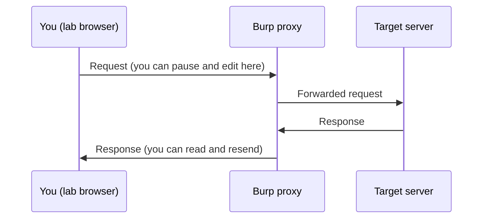

# Lab 7.2: PortSwigger Apprentice

**Month:** 7 (Web Application Security and SQL)
**Pattern family:** Web and application security
**Time budget:** 12 to 14 hours (across multiple sessions)
**Lab attempt floor:** 90 minutes per stuck lab
**AI guidance:** Brainstorming-variations pattern unlocked. You find the flaw and craft the seed payload by hand; only then may you ask AI for variations to test. AI Provenance log mandatory. See "AI guidance for this lab" below.
**Prerequisites:** Lab 7.1 complete (you can write the query behind a login form). Month 7 README read, including the scope rule and the brainstorming pattern. `AI-ETHICS.md` read. Burp Suite Community installed.

**Recall first, from memory:** in Lab 7.1 you wrote, by hand, the `SELECT ... WHERE username = '<input>'` behind a login form, and described in prose how attacker input could rewrite it. Hold that picture; this lab is where you watch a real request carry that input and you change it on the wire.

## Why this lab exists

This is where you become fluent with the tool you will use every day for the rest of the month and in much of web security work afterward: Burp Suite Community, the intercepting proxy. And it is where you meet the seven flaw classes that account for most web findings, one apprentice lab at a time, on a platform that is built and authorized for exactly this.

The PortSwigger Web Security Academy is the right place to start because each lab isolates a single concept. You are not hunting through a sprawling application; you are given a small app with one deliberate flaw and a clear success condition. That isolation is what lets you build the recognition cue cleanly: this is what a SQL injection point feels like, this is what reflected XSS feels like, this is what a broken access control looks like in a request. Lab 7.3 (Juice Shop) then throws all of them at you at once in a realistic app, which only works if you met them one at a time first.

## The scope rule, first, because it is not optional

You run Burp and send crafted requests in this lab **only** against the PortSwigger Web Security Academy's own hosted labs. PortSwigger authorizes this activity for its own lab instances in its terms of use; that authorization is what makes this legal, and it does not extend one inch beyond their lab domains. You do not point Burp at any other site while you have it configured for this work, not "to compare," not "to see if the technique transfers." The same Burp install that solves an Academy lab will happily attack a site you are not authorized to touch, and that is a CFAA matter. Configure Burp's scope to the Academy domain and keep it there. `SAFETY.md` is the contract.

## Learning objectives

By the end of this lab, you can:

- Operate Burp Suite Community: configure the proxy, install its CA in a browser you use only for lab work, intercept a request, send it to Repeater, modify it, and replay it.
- Explain, at the HTTP level, what a request to a vulnerable endpoint looks like and what the response reveals.
- Identify and exploit apprentice-level instances of SQL injection, cross-site scripting, CSRF, access control (IDOR), SSRF, file upload, and authentication flaws, on authorized targets.
- Apply the brainstorming-variations pattern: craft a seed payload yourself, then evaluate AI-suggested variants and run the ones worth running.
- Produce reproduction steps another person could follow to confirm each flaw.

## Recognition cue

When a request flows through Burp and you see a parameter that the server clearly trusts (an `id`, a search term, a redirect URL, a filename), you should feel the same itch the month's recognition cue describes: where does this input go, and what happens if it is not what the developer expected. In this lab that itch attaches to a specific tool. Intercepting a request and sending it to Repeater becomes the reflex you reach for the moment you want to ask "what if I change this." If you find yourself testing flaws only through the browser's own forms, you have not yet internalized the proxy; come back to Task 1.

## AI guidance for this lab

This is the worked example of the brainstorming-variations pattern. Follow it exactly; Labs 7.3 to 7.5 assume you have internalized it.

**Allowed:** After you have identified a flaw yourself and crafted a first working payload by hand (from your own understanding of the flaw and what you read in the PortSwigger materials), you may ask AI for variations on that payload to test, for example alternative encodings, a different injection context, or syntax that might bypass a filter you have already characterized. You then decide which variants are worth running, run them yourself against the authorized Academy lab, and record what each did.

**Not allowed:** Asking AI which lab to solve or how to solve it. Asking AI to identify the vulnerability for you. Asking AI for the seed payload (if you cannot write the first working payload yourself, you do not yet understand the flaw; return to the PortSwigger learning material for that flaw class and build the understanding). Pasting AI variants blind without reasoning about them. Pointing AI or any tool at the target; you run every request.

**Logged:** Every AI interaction goes in your AI Provenance section (Task 6), including the variants you discarded as malformed or out of scope. For a filter-bypass lab, "I crafted a working payload, asked AI for five encoding variants, three were redundant with what I had, one was malformed, one used a context I had not considered and it worked" is a real provenance entry. "Used AI for XSS" is not.

A reminder on the success banner: PortSwigger marks a lab "solved." The tutor does not confirm that for you, the same way it never confirms a CTF flag. Solving is between you and the platform.

## Tasks

### Task 1: Burp pre-flight and setup (90 minutes)

Before you intercept anything, write the Burp pre-flight in your notebook (the full text goes in Task 6; draft it now). Then install Burp Suite Community, configure the proxy, install Burp's CA certificate into a browser profile you use only for lab work, and confirm you can intercept and forward a request to a PortSwigger lab. Send one request to Repeater and resend it. Set Burp's target scope to the Academy domain.

The pre-flight must answer, before you run the tool:

- What Burp does at the proxy and HTTP level (it sits between your browser and the server, presenting its own CA so it can read and modify TLS-protected requests you route through it).
- What artifacts it leaves: its CA in your browser's trust store, request history and project files on your disk.
- What could go wrong: intercepting and replaying traffic to any target you are not authorized to test; leaving the CA installed in your daily browser.
- The authorization scope: the PortSwigger Academy labs only, by their terms.

**Checkpoint:** Burp intercepts and replays a request to a PortSwigger lab; the CA is installed in a dedicated lab browser profile (not your daily browser); target scope is set to the Academy domain; the pre-flight draft exists.
**If not:** if the browser shows certificate errors, the CA is not installed in the profile you are browsing with; re-install Burp's CA into the dedicated lab profile and restart it. Until Burp's proxy round-trips a request, this is the task. See Troubleshooting.

### Task 2: Learn the method on a target you own (gradual release)

The new skills this lab teaches are two: the **Burp reflex** (intercept a request, send it to Repeater, change it, replay it) and the **brainstorming-variations loop** (you craft a seed payload, AI suggests variants, you reason and run). You will learn both on a tiny target you build and own, so the worked example never touches a graded Academy lab. The graded labs come in Stage 3, unscaffolded.

Here is the request cycle Burp lets you control. Watch where you get to intervene:


*Notice: Burp sits in the middle. The browser only sends what its forms allow; in Burp you can change any byte before it reaches the server, then replay it as many times as you like in Repeater.*

#### Stage 1 - Worked example (I do)

This worked example uses a throwaway local endpoint you run, not any Academy lab, so you can focus on the method. Save this as `echo.py` and run it with `python3 echo.py`; it just reflects whatever you send in the `name` parameter.

```python
from flask import Flask, request
app = Flask(__name__)

@app.route("/hello")
def hello():
    name = request.args.get("name", "stranger")
    return f"<p>Hello, {name}</p>"   # reflects input straight back, on purpose

app.run(port=5000)
```

Now run the loop end to end, watching each move:

1. **Route it through Burp.** In your lab browser, visit `http://localhost:5000/hello?name=Lee`. The page says "Hello, Lee."
2. **Intercept and read.** Turn interception on, reload, and read the raw request line in Burp: `GET /hello?name=Lee HTTP/1.1`. This is the request you learned to picture in Month 4, now in front of you.
3. **Send to Repeater and change it.** Right-click the request, "Send to Repeater." In Repeater, change `name=Lee` to `name=<b>Lee</b>` and click Send. Read the response body: the server reflected your `<b>` tag unescaped. That reflection is the seed observation, the thing that tells you input reaches the page as code.
4. **Craft a seed payload by hand.** From that observation you reason: if a `<b>` tag survives, a `<script>` might too. You write one seed yourself, for example `name=<script>alert(1)</script>`, and send it in Repeater. You see it reflected.
5. **Then, and only then, brainstorm variations.** You ask AI: "I have a reflected-input point that does not escape HTML. Give me five payload variants that try different contexts or encodings." You read the five, reason about which make sense for a raw-HTML reflection, run those against your own `echo.py`, and record what each did.

That five-step loop, observe, reason, craft a seed, then brainstorm variants, is the method. Notice the order: you never asked AI where the flaw was or for the first payload. You found the reflection and wrote the seed; AI only widened a door you had already opened.

**Checkpoint:** on your own `echo.py`, you intercepted a request, sent it to Repeater, and confirmed by replay that an HTML tag in `name` is reflected unescaped; you can state the five steps of the loop from memory.
**If not:** if Repeater shows your tag escaped (as `&lt;b&gt;`), you are looking at a different response or a cached page; confirm you edited the right request and clicked Send in Repeater, not the browser. If you cannot state the five steps, write them down before moving on; every web lab from here uses them.

#### Stage 2 - Faded practice (we do)

Still on your own `echo.py`, run the loop yourself with less scaffolding. The goal and the checkpoints are given; the moves are yours.

```text
Goal: characterize the reflection, then brainstorm one useful variant.
TODO 1: In Repeater, send a request whose `name` value is a string you can
        spot in the response (your own marker). Confirm it appears verbatim.
TODO 2: Decide, in one sentence in your notes, what kind of flaw a raw,
        unescaped reflection like this is (name the OWASP class).
TODO 3: Craft ONE seed payload by hand that proves code (not just text)
        reaches the page. Run it in Repeater.
TODO 4: Ask AI for three variants of YOUR seed. Write down which one you
        would try first and why, then run it against echo.py only.
```

You already saw the technique in Stage 1; here you supply the marker, the flaw name, the seed, and the reasoning about variants.

**Checkpoint:** your notes name the flaw class, contain one seed payload you wrote, and record which AI variant you chose and why, all verified against your local `echo.py`.
**If not:** if you cannot decide the flaw class, return to the Month 7 README's OWASP map and your reading; naming the class is the reasoning the brainstorming pattern depends on. If AI's variants all look the same, your prompt was too vague; tell it the exact context (raw HTML body, no escaping) and ask again.

#### Stage 3 - Independent (you do)

Now stop the `echo.py` server and turn to the real graded work: the apprentice labs on the PortSwigger Academy, Tasks 3 through 5 below. You apply the same loop there with no scaffolding from this file. For each lab you must find the flaw yourself, craft the seed payload yourself, and only then brainstorm variations. This file does not walk through any Academy lab; the goal and the definition of done are all you get, which is the point.

### Task 3: SQL injection and XSS apprentice labs (3.5 hours)

Work the apprentice-level labs in the SQL injection topic and the cross-site scripting topic on the Academy. For each lab you complete: identify the flaw yourself, craft your seed payload by hand, and only then (optionally) brainstorm variations with AI per the pattern above. Record reproduction steps for each as you go.

This is where Lab 7.1 pays off: a SQL injection lab is comprehensible because you can picture the query behind the input. Reconstruct that query in your notes for at least one SQLi lab.

**Checkpoint:** the apprentice SQLi and XSS labs are marked solved by the platform; for each, your notes hold the flaw class, the triggering request at the HTTP level, your reproduction steps, and the provenance of any AI variants; for one SQLi lab, you reconstructed the query.
**If not:** if a SQLi lab makes no sense, you are not yet picturing the query behind the input; return to your Lab 7.1 prepared-statement writeup and reconstruct the `SELECT ... WHERE` before you attack it. Do not ask the tutor to confirm a solve.

### Task 4: CSRF, access control (IDOR), and authentication labs (3.5 hours)

Work the apprentice-level labs in the CSRF, access control, and authentication topics. These are less about crafted strings and more about logic: a request that should be rejected but is not, a parameter that should not be honored but is, a flow that can be skipped. Burp Repeater is your main tool here; you will be modifying and replaying requests, not typing payloads into fields.

**Checkpoint:** the apprentice CSRF, access-control, and authentication labs are solved; for each, your notes name the OWASP Top 10 (2025) category and contain reproduction steps, and for the access-control (IDOR) lab you can explain why swapping an identifier returned data that was not yours.
**If not:** if you cannot map CSRF to a category, reason from its mechanism (a state-changing request the site honors without proving you meant to send it) rather than guessing; access control and authentication map cleanly, CSRF takes a sentence of thought.

### Task 5: SSRF and file upload labs (2.5 hours)

Work the apprentice-level labs in the SSRF and file-upload topics. SSRF is the flaw where the server can be made to make requests on your behalf; file upload is where what you upload is treated as more than data. Both are higher-stakes flaw classes; understand the mechanism, not just the lab solution.

**Checkpoint:** the apprentice SSRF and file-upload labs are solved, with reproduction steps and the flaw mechanism in your notes for each, plus one sentence on why SSRF is dangerous in a real cloud environment (you meet it again in Month 11).
**If not:** if you solved the lab but cannot say why the class is dangerous beyond the lab, you have the solution but not the mechanism; that gap is what the verification ritual catches, so close it now by reading the PortSwigger topic page for that class.

### Task 6: Notebook entry with AI Provenance (90 minutes)

Write `.tutor/notebook/lab-02-portswigger-apprentice.md`. Required sections:

- **Pre-flight check** for Burp Suite (the full version of your Task 1 draft): proxy and HTTP-level behavior, artifacts, what could go wrong, authorization scope.
- **Concept naming.** Across all seven flaw classes, what is the common shape (untrusted input meeting a trusted system)?
- **Evidence.** Screenshots of representative requests and responses in Burp, and your reproduction steps for at least one lab in each of the seven topics.
- **Five-question debrief.**
- **AI Provenance.** Which AI tool, your seed payloads and your requests for variations, what was generated, which variants you ran and what each returned, and what you discarded. Be specific per the example above.

**Checkpoint:** a committed entry with all sections, including a substantive AI Provenance section, and reproduction steps for all seven flaw classes.
**If not:** if your provenance is one line like "used AI for XSS," the tutor rejects it; the test is whether a reader could redo your AI conversation from your notes, including the variants you discarded.

## Definition of Done

The lab is complete when the apprentice labs across all seven topics (SQL injection, XSS, CSRF, access control, SSRF, file upload, authentication) are solved on the platform and documented with reproduction steps, and the notebook entry is committed with a complete Burp pre-flight and AI Provenance section.

The tutor runs the verification ritual: it picks one payload or one request from your provenance log and asks you to explain, from memory and with your AI session closed, why it triggers the flaw. The XSS and SQLi labs are the likeliest targets, because that is where AI-suggested variants are easiest to paste without understanding. If you crafted the seed yourself, you can defend it.

**Self-explain:** in one sentence, why does sending a request to Repeater and replaying it let you test ideas the browser's own form will not?

## Stretch goals

1. For one XSS lab, document three contexts where the same input lands (inside an HTML body, inside an attribute, inside a script block) and note why one payload does not work in all three.
2. Turn one of your reproduction-step writeups into the format a real finding uses: title, severity, affected request, steps to reproduce, and remediation. You will reuse this format in Month 10.
3. Use Burp's request history to find a request you did not notice in the browser (an API call the page made in the background) and explain what it does.
4. Re-derive one SQLi lab's injection from your reconstructed query alone, without re-reading the PortSwigger hint, to prove the Lab 7.1 fluency is doing the work.

## Troubleshooting

- **Certificate errors in the lab browser.** Burp's CA is not installed in the profile you are browsing with, or you installed it in your daily browser by mistake. Re-install the CA into the dedicated lab profile, restart Burp, and reload. This is expected on first setup.
- **Tempted to ask AI for the whole solution when stuck.** That crosses the pattern's line and forfeits the learning. Use the tutor's hint ladder instead; the floor is 90 minutes per stuck lab.
- **AI variants are subtly malformed** (a wrong encoding, an unbalanced quote, a context that does not apply). Running them blind wastes time and teaches nothing. Reason about each before running it; that reasoning is the skill the pattern trains.
- **The urge to point Burp at a non-Academy site "to see if it transfers."** Do not. Re-read the scope rule. The Academy has hundreds of labs; stay in scope.

## Time budget breakdown

- Task 1: 90 minutes
- Task 2: 60 to 90 minutes (the worked method on your own `echo.py`)
- Task 3: 3.5 hours
- Task 4: 3.5 hours
- Task 5: 2.5 hours
- Task 6: 90 minutes
- Buffer for stuck labs and Burp setup friction: 60 to 120 minutes

Total: 12 to 14 hours.

## Resources

Primary sources only.

- The PortSwigger Web Security Academy learning materials for each topic (SQL injection, XSS, CSRF, access control, SSRF, file upload, authentication). These are written by the people who make Burp; they are the primary source.
- The PortSwigger Academy terms of use, so you understand exactly what authorization you have and where it stops.
- The Burp Suite Community documentation: proxy setup, installing the CA certificate, and Repeater.
- The OWASP Top 10 (2025) entries for each flaw class you meet, to anchor each lab to its category (see `reading.md`).
- Your Lab 7.1 prepared-statement writeup, for the SQL injection labs.
