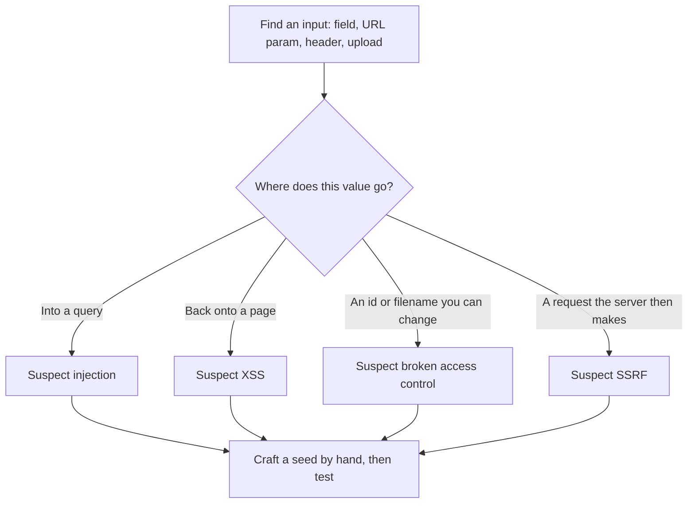

# Lab 7.3: OWASP Juice Shop

**Month:** 7 (Web Application Security and SQL)
**Pattern family:** Web and application security
**Time budget:** 9 to 11 hours (across multiple sessions)
**Lab attempt floor:** 90 minutes per stuck challenge
**AI guidance:** Brainstorming-variations pattern. You find each flaw and craft the seed payload yourself; AI is only for variations on a payload you already have. AI does not tell you which challenge to solve. See "AI guidance for this lab" below.
**Prerequisites:** Lab 7.2 complete (Burp is your daily driver; you have met the seven flaw classes in isolation). Month 7 README read, including the scope rule and the brainstorming pattern.

**Recall first, from memory:** in Lab 7.2 each lab told you the flaw class up front. Name the seven flaw classes you met there. (Hold them; this lab hands you none of them in advance, so your job is to recognize which one you are looking at.)

## Why this lab exists

Lab 7.2 gave you each flaw class on its own, isolated, with a clear success condition. Real applications do not work that way. OWASP Juice Shop is a deliberately vulnerable but realistic single-page application: a working store, with a cart, accounts, reviews, a feedback form, and a basket of flaws spanning the whole OWASP Top 10. The challenges are not labeled with the flaw class; part of the work is recognizing which class you are looking at, which is exactly the recognition cue this month exists to build.

Juice Shop also has a scoreboard, and the scoreboard is itself one of the first things you have to find. That design (the app does not hand you the task list) is intentional and it is good for you: it forces you to explore an application the way you would in a real assessment, rather than working down a numbered list someone handed you.

## The scope rule, first

You run Juice Shop **on your own machine**: a local container or a local Node install, served to your own browser. You do not test a Juice Shop instance hosted by someone else, and you do not point Burp at anything other than your own local instance while working this lab. The project publishes the app precisely so you can run your own copy and attack that; the authorization is to attack the copy you run, not any instance you find on the internet. Configure Burp's scope to your local Juice Shop and keep it there. `SAFETY.md` is the contract.

## Learning objectives

By the end of this lab, you can:

- Deploy OWASP Juice Shop locally and route its traffic through Burp.
- Recognize, in an unlabeled realistic application, which OWASP Top 10 flaw class a given behavior belongs to.
- Document a solved challenge with reproduction steps precise enough that another person could reproduce it.
- Apply the brainstorming-variations pattern in a realistic app where you must first locate the flaw yourself.
- Reflect on which flaw classes you found by recognition and which you found by luck, and what that says about where your recognition is weak.

## Recognition cue

When you open a realistic application and nothing is labeled, the cue is the absence of a map. You catch yourself asking, unprompted, which inputs reach the database, which get reflected back into a page, which identifiers you could swap, and which flows you could skip. That self-directed scanning of an unlabeled app, rather than working down a list someone handed you, is the recognition this lab is training. The moment you reach for a published solution list, you have stopped building the cue and started copying; the cue only forms when you find the flaws yourself.

## AI guidance for this lab

The brainstorming-variations pattern applies, and the "you find it" half is even more important here than in Lab 7.2, because the app does not tell you where the flaws are.

**Allowed:** Once you have located a flaw yourself and crafted a working seed payload, you may ask AI for variations to test against your local instance, exactly as in Lab 7.2.

**Not allowed:** Asking AI which Juice Shop challenge to attempt, where a flaw is, or how to solve a named challenge. Juice Shop solutions are widely published; do not look them up and do not ask AI to recall them. That converts the lab from "learn to recognize flaws" into "transcribe a walkthrough," which teaches nothing and which the verification ritual will expose immediately. If you are stuck past the floor, use the tutor's hint ladder, which gives you structural nudges without naming the technique until Rung 6.

**Logged:** Variations brainstormed, run, and discarded go in your AI Provenance section, per the pattern.

A reminder on the scoreboard: solving a challenge lights up the scoreboard. The tutor does not confirm a solve, a scoreboard state, or any flag-like token for you. Do not paste one to the tutor and ask if it is right. The scoreboard is between you and your own instance.

## Tasks

### Task 1: Deploy Juice Shop and wire up Burp (60 minutes)

Stand up Juice Shop locally (the project documents a container image and a from-source option; choose one and justify it in your notebook). Route the app's traffic through Burp, confirm you can intercept a request, and set Burp's scope to your local instance. Then find the scoreboard yourself (this is itself a challenge; it is not at an obvious URL).

**Checkpoint:** Juice Shop running locally, traffic routing through Burp, scope set to the local instance, and the scoreboard located, with a note on how you found it in your own words.
**If not:** if traffic does not appear in Burp, the browser is not using the proxy or scope is filtering it out; confirm the lab browser points at Burp's listener and that your local Juice Shop address is in scope. Do not paste a walkthrough for the scoreboard; finding it is the first challenge.

### Task 2: Learn the recognition method (gradual release)

In Lab 7.2 the platform told you each flaw class. Here it does not, and that is the whole point. The new skill is **recognition**: scanning an unlabeled app yourself and asking, at each input, which system it touches and what would happen if the input were not what the developer expected. You learn the method first on a small owned or conceptual example, then apply it unscaffolded to the real challenges.

Here is the recognition routine to run at every input you find:


*Notice: recognition is one repeated question (where does this value go) asked at every input. The flaw class is your answer to that question, not a label someone handed you.*

#### Stage 1 - Worked example (I do)

This worked example uses the throwaway `echo.py` you ran in Lab 7.2 (or any tiny app you own), not a Juice Shop challenge, so the method is the focus. Walk an unlabeled input the way you will walk the real app:

1. **Find an input.** `http://localhost:5000/hello?name=Lee` has one input: the `name` parameter.
2. **Ask where it goes.** You send `name=<b>x</b>` in Burp and see the `<b>` reflected unescaped onto the page. The value goes "back onto a page."
3. **Name the class from the answer.** Value reflected onto a page, unescaped: that is the XSS branch of the routine. You named the class yourself from behavior, with no label.
4. **Craft a seed and test.** You write one seed payload by hand and confirm it in Repeater, then (optionally) brainstorm variations per the pattern.
5. **Document the recognition honestly.** In your notes you write the cue that tipped you off: "an HTML tag in `name` came back unescaped." That sentence, the cue, is the field this lab grades hardest.

That is the method: find input, ask where it goes, let the answer name the class, craft a seed, and record the cue. You will run this same loop dozens of times on the real app.

**Checkpoint:** on your own toy app, you identified one input, determined where its value goes, named the flaw class from that behavior alone, and wrote down the recognition cue in one sentence.
**If not:** if you cannot tell where a value goes, send a unique marker string and search the response and (if you can) the app's behavior for it; the marker shows you whether it lands on a page, in a redirect, or nowhere visible.

#### Stage 2 - Faded practice (we do)

Still on a target you own (your `echo.py`, or extend it with a second route that takes an `id` parameter), run the recognition routine with less help.

```text
Goal: practice the recognition question on an input you have NOT yet classified.
TODO 1: Add or pick one input you have not tested.
TODO 2: Send a marker through it in Burp and observe where the marker lands.
TODO 3: Using the routine diagram above, name which flaw class to SUSPECT,
        and write the one-sentence cue that led you there.
TODO 4: Craft one seed payload by hand for that suspicion and test it locally.
```

You saw the full routine in Stage 1; here you supply the input, the observation, the suspected class, and the cue.

**Checkpoint:** your notes contain one newly classified input with its recognition cue and one hand-crafted seed, verified locally.
**If not:** if your cue is "it felt like XSS," that is not a cue; a cue is an observation ("the marker appeared inside an HTML attribute without quotes"). Rewrite it as something you saw, not something you felt.

#### Stage 3 - Independent (you do)

Now stop the toy app and turn to the real graded work: your local Juice Shop, in Task 3 below. You run the recognition routine on its real, unlabeled inputs, with no scaffolding from this file and no published solutions. This file does not walk through any Juice Shop challenge; recognizing each flaw yourself is the skill being graded.

### Task 3: Work and document twenty challenges (6 to 7 hours)

Solve your first twenty Juice Shop challenges. You choose which twenty; a natural path is to start with the lower-difficulty challenges and climb. For each one, as you solve it, write a documentation entry containing exactly these fields:

- **Challenge name** (as the scoreboard labels it) and its difficulty stars.
- **OWASP Top 10 (2025) category** you believe it belongs to, and one sentence on why.
- **How you recognized the flaw**: what in the application's behavior or in a Burp response told you what class of flaw this was. This field is the point of the lab; write it honestly, including "I found this one by accident" where that is true.
- **Reproduction steps**: numbered, specific enough that another person with a fresh Juice Shop instance could follow them and reproduce the result. Describe the requests at the HTTP level. (You may include your own payload here, in your own notebook; this is your work product, not a published walkthrough.)
- **AI variations** (if you used the brainstorming pattern on this challenge): the seed payload you crafted, what you asked AI, and which variants you ran.

Twenty entries. They do not need to be the twenty easiest; they need to be twenty you actually solved and can reproduce.

**Checkpoint:** twenty documented challenges, each with all five fields, in a `juice-shop-challenges.md` in this lab's directory, with the "how you recognized the flaw" field present and honest for all twenty.
**If not:** if an entry only says "solved it," it does not count; add the recognition cue and reproduction steps. If you cannot write the cue because you looked up the solution, that is the failure mode this lab is built to catch; re-solve it yourself.

### Task 4: Recognition retrospective (60 minutes)

Across your twenty challenges, write a short retrospective: which flaw classes did you recognize quickly, which did you stumble into, and which did you have to grind through the hint ladder to find. Map your twenty challenges to OWASP categories and note which categories you have now seen and which you have not. This tells you where to focus in Lab 7.4 (DVWA), which requires you to cover the categories deliberately.

**Checkpoint:** a retrospective (roughly 250 to 400 words) at the end of `juice-shop-challenges.md`, including a count of your challenges per OWASP category and a note on your weakest recognition area.
**If not:** if every category looks equally strong, you are probably not being honest about the ones you stumbled into; the weak-area note is the most useful line for planning Lab 7.4, so write it candidly.

### Task 5: Notebook entry with AI Provenance (60 minutes)

Write `.tutor/notebook/lab-03-owasp-juice-shop.md`. Required sections:

- **Pre-flight check.** Burp is already pre-flighted from Lab 7.2; here, pre-flight the act of running a deliberately vulnerable application on your own machine (what it is, what network exposure it has, why you bind it to localhost and not to a public interface, and the authorization scope of attacking your own copy).
- **Concept naming.** What does solving an unlabeled realistic app teach that the isolated PortSwigger labs did not?
- **Evidence.** A link to or excerpt from `juice-shop-challenges.md`, plus a screenshot or two of representative requests in Burp.
- **Five-question debrief.**
- **AI Provenance.** Per the pattern: seeds you crafted, variations you asked for, what you ran, what you discarded. If you used no AI on this lab, declare that null explicitly.

**Checkpoint:** a committed entry with all sections; reproduction steps live in `juice-shop-challenges.md`, and the notebook entry references it and adds the debrief and provenance.
**If not:** if your provenance section is empty because you used no AI, do not leave it blank; declare the null explicitly, the same discipline as Lab 7.1.

## Definition of Done

The lab is complete when twenty challenges are documented with all five fields, the recognition retrospective is written, and the notebook entry is committed with a complete provenance section.

The tutor runs the verification ritual: it picks one of your twenty challenges and asks you to explain, from memory and with your AI session closed, how you recognized the flaw and why your reproduction steps work. If you solved it yourself rather than transcribing a published solution, this is straightforward. If you transcribed, the recognition field and this ritual will both expose it.

**Self-explain:** in one sentence, why does an unlabeled app build the recognition cue that the labeled PortSwigger labs could not?

## Stretch goals

1. Pick two challenges you found by accident and re-derive them deliberately using the recognition routine, then rewrite their cues as real observations. Notice how much your recognition improved.
2. Find one challenge you cannot solve in the floor time, document the exact blocker (what you tried, what the response was, what you expected), and return to it after the next session. The written blocker is good interview material.
3. Group your twenty challenges by OWASP category and compare the spread to your Lab 7.2 coverage; note which categories you have now seen in both an isolated and a realistic setting.

## Troubleshooting

- **Looking up published solutions.** This is the biggest failure mode. It feels efficient and it destroys the lab; you will pass the scoreboard and fail the verification ritual. Solve them yourself and use the tutor's hint ladder when stuck.
- **Solving a challenge without knowing why it worked.** That is a signal, not a success. Note it in the recognition field and revisit the mechanism until you can explain it.
- **Spending the whole budget on three hard challenges.** Twenty across a range of difficulty is the target. If one challenge eats your session past the floor, document the blocker and move on, then return.
- **The urge to expose your instance beyond localhost** (to attack it from another device, say). Do not. A deliberately vulnerable app on a reachable network is a liability. Bind it to localhost only.

## Time budget breakdown

- Task 1: 60 minutes
- Task 2: 30 to 45 minutes (the recognition method on your own toy app)
- Task 3: 6 to 7 hours
- Task 4: 60 minutes
- Task 5: 60 minutes
- Buffer for stuck challenges: 45 minutes

Total: 9 to 11 hours.

## Resources

- The OWASP Juice Shop project documentation: deployment options and the project's description of its own purpose. (Use it for setup and for understanding the app; do not use its challenge-solution companion guide, which is a walkthrough.)
- The OWASP Top 10 (2025) list, to map each challenge to a category (see `reading.md`).
- The Burp Suite Community documentation you already used in Lab 7.2.
- Your own Lab 7.2 reproduction steps, as a template for the documentation format here.
