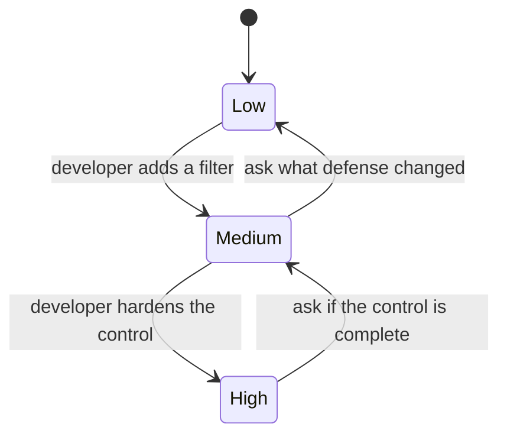

# Lab 7.4: DVWA Walkthrough

**Month:** 7 (Web Application Security and SQL)
**Pattern family:** Web and application security
**Time budget:** 9 to 11 hours (across multiple sessions)
**Lab attempt floor:** 90 minutes
**AI guidance:** Brainstorming-variations pattern. You find each flaw and craft the seed payload yourself; AI only suggests variations on a payload you already have. AI does not map flaws to categories for you. See "AI guidance for this lab" below.
**Prerequisites:** Labs 7.2 and 7.3 complete. You have a Burp pre-flight, you have met the seven flaw classes, and you have a recognition retrospective telling you which OWASP categories you are weak on. Month 7 README read.

**Recall first, from memory:** in Lab 7.3 you mapped your challenges to OWASP categories and named your weakest recognition area. Which category was weakest? (Hold it; this lab makes you cover the categories deliberately, so you spend your effort exactly there.)

## Why this lab exists

DVWA (Damn Vulnerable Web Application) is the oldest and most deliberate of the practice apps: a small PHP and MySQL application whose modules each isolate a classic web flaw, with a security-level switch (low, medium, high) that changes how hard each flaw is to exploit. That switch is the feature that makes this lab worth doing after Juice Shop. You will not just exploit a flaw; you will exploit it at "low," watch the same module at "high," and explain what the developer changed and why your low-level approach no longer works. That is the move from "I can run a payload" to "I understand the defense," which is the move that matters in interviews and in real defensive work.

This lab is also where you deliberately cover the OWASP Top 10 (2025) as a map. Juice Shop let you wander; here you work systematically, mapping one demonstrated vulnerability to each category you can show in DVWA, and being honest in writing about the categories DVWA cannot demonstrate.

## The scope rule, first

You run DVWA **on your own machine or VM**, served to your own browser, and you point Burp only at that local instance. DVWA is explicitly built to be attacked by the person running it; the authorization is to attack your own install, nothing else. DVWA is also genuinely dangerous to expose: it is, by design, trivially exploitable. Bind it to localhost or to a host-only VM network, never to a public interface, and never to a network a stranger could reach. `SAFETY.md` is the contract, and this app is the kind of thing it exists to keep off the open internet.

## Learning objectives

By the end of this lab, you can:

- Deploy DVWA locally at a chosen security level and route its traffic through Burp.
- Demonstrate one vulnerability mapped to each OWASP Top 10 (2025) category that DVWA can show, and explain in writing which categories it cannot show and why.
- Compare a flaw at DVWA's "low" and "high" security levels and explain the defensive change between them.
- Produce reproduction steps and a category mapping precise enough to drop into a real report.
- Apply the brainstorming-variations pattern, including using AI to brainstorm filter-bypass variants once you have characterized a filter yourself.

## Recognition cue

When an exploit that worked a moment ago suddenly stops working, the cue is to ask what defense was just added rather than to assume your payload was wrong. DVWA's security-level switch trains exactly that reflex: you watch the same flaw at "low" and "high" and learn to read the difference as a deliberate control (a prepared statement, an input filter, a token, an output encoding). In a real application there is no switch, but the same question (what is defending this, and is the defense complete) is the one a good assessor asks at every input. If you find yourself only ever working at "low," you are skipping the part of the lab that builds the cue.

## AI guidance for this lab

The brainstorming-variations pattern applies, and DVWA's security levels make it especially relevant: when you move from "low" to "medium" or "high," the app adds a filter, and brainstorming bypass variants for a filter you have already characterized is exactly the legitimate use of the pattern.

**Allowed:** After you have demonstrated a flaw at one level and characterized the filter the next level adds, you may ask AI for variations that might bypass that filter, then reason about and run them yourself against your local DVWA.

**Not allowed:** Asking AI to tell you which DVWA module demonstrates which OWASP category (mapping flaws to categories is the learning; do it yourself and defend it). Asking AI to solve a module or write the seed payload. Pasting variants blind. Pointing any tool at the target; you run every request.

**Logged:** Seeds, variants, runs, and discards go in your AI Provenance section.

## Tasks

### Task 1: Deploy DVWA and confirm the security-level switch (60 minutes)

Stand up DVWA locally (container or a from-source LAMP setup; choose and justify). Route it through Burp with scope set to the local instance. Confirm you can change the security level and that you are logged in. Note where the security level is set.

**Checkpoint:** DVWA running locally, bound to localhost or a host-only network, traffic through Burp, scope set, and you can toggle the security level, all recorded in your notes.
**If not:** if DVWA will not load, the most common causes are the database not initialized (use its setup page) or PHP not serving; check the project's setup docs. Confirm it is bound to localhost, never a public interface, before you go further.

### Task 2: Learn to read a defense (gradual release)

The new skill this lab teaches is **reading a defensive change**: when an exploit that worked stops working, you ask what defense was added and whether it is complete, rather than assuming your payload was wrong. DVWA's security-level switch is built to train exactly this. You learn the reasoning first on a filter you add to your own toy app, so the worked example never walks through a DVWA module. The graded low-versus-high work is Stage 3.

Here is the state machine the security switch puts a flaw through, and the question to ask at each step:


*Notice: moving up a level is the developer adding a control. Your job is not just to bypass it but to name it (a filter, a prepared statement, a token, output encoding) and judge whether it fully closes the seam. The reverse arrows are the questions you ask, not real transitions.*

#### Stage 1 - Worked example (I do)

Use your own `echo.py` from Lab 7.2. You will play both developer and assessor: add a naive defense, then reason about whether it is complete. This is the reasoning move, on a target you own, not a DVWA module.

1. **Start with the flaw.** `name=<b>x</b>` reflects unescaped. That is your "low" state.
2. **Add a naive filter (play developer).** Change the route to strip the string `<script`:
   ```python
   name = request.args.get("name", "stranger").replace("<script", "")
   return f"<p>Hello, {name}</p>"
   ```
   That is your "medium" state: a control was added.
3. **Name the control.** It is a blocklist filter on one exact string. Naming it is the key step; you cannot judge a defense you have not named.
4. **Judge completeness (play assessor).** Ask: does stripping `<script` close the XSS seam? No. It is case-sensitive and matches one tag only. An event-handler attribute or a mixed-case tag is not stripped. The control is incomplete, and you can say exactly why.
5. **Write the comparison.** In your notes: "Low: no filter. Medium: blocklist on the literal `<script`. The medium control is incomplete because it is case-sensitive and ignores non-`script` injection contexts." That written comparison, naming the control and judging it, is the highest-value output of this whole lab.

Notice you did not need a bypass payload to do the analysis; naming the control and reasoning about its gaps is the skill. A bypass is just the proof.

**Checkpoint:** on your own app, you added a control, named it precisely, and wrote one or two sentences judging whether it closes the seam and why.
**If not:** if you cannot name the control, you changed code without understanding it; the control here is "a blocklist filter on a literal string," and the gap is everything that literal does not cover. Reason in words before you reach for a bypass.

#### Stage 2 - Faded practice (we do)

Still on your own toy app, harden the filter once more and judge it yourself.

```text
Goal: move your toy app from "medium" to "high" and analyze the new control.
TODO 1: Change the filter to something stronger (for example, HTML-escape the
        output instead of blocklisting a string). This is your "high" state.
TODO 2: Name the control in one phrase (what kind of defense is it now?).
TODO 3: Judge completeness: does this control close the XSS seam for the
        HTML-body context? Write one or two sentences saying why or why not.
TODO 4: Note what context, if any, this control still would not cover.
```

You saw the full reasoning in Stage 1; here you supply the stronger control, its name, and the completeness judgment.

**Checkpoint:** your notes name the stronger control (output encoding) and judge that it closes the HTML-body XSS seam, while noting any context it does not cover.
**If not:** if you blocklisted more strings instead of encoding output, you hardened a weak approach rather than switching to a sound one; that itself is a finding ("the developer kept patching a blocklist instead of encoding"), so write it down as the analysis.

#### Stage 3 - Independent (you do)

Now turn to the graded work on your own DVWA: map the OWASP categories in Task 3 and do the low-versus-high comparisons in Task 4. You apply the same reasoning (name the control, judge completeness) to DVWA's real modules, reading its open PHP source. This file does not walk through any DVWA module; naming and judging each control yourself is the graded skill.

### Task 3: Map one vulnerability to each OWASP Top 10 (2025) category (5 to 6 hours)

The OWASP Top 10 (2025) categories are: Broken Access Control, Security Misconfiguration, Software Supply Chain Failures, Cryptographic Failures, Injection, Insecure Design, Authentication Failures, Software or Data Integrity Failures, Security Logging and Alerting Failures, and Mishandling of Exceptional Conditions.

For each category, do one of two things and write it up:

- **If DVWA has a module or behavior that demonstrates the category:** demonstrate it yourself at "low," document it, and write the category mapping with your justification.
- **If DVWA cannot demonstrate the category** (some 2025 categories, such as Software Supply Chain Failures, are not what DVWA was built to show): say so explicitly in writing, explain why the category is hard to demonstrate in this app, and describe where you would look for it in a real application instead.

Do not force a mapping. An honest "DVWA does not demonstrate this; here is why and here is where it would show up" is a correct and valuable entry. Deciding which categories DVWA genuinely covers is part of the work; do not ask AI to decide it for you.

For each demonstrated vulnerability, your write-up contains:

- **OWASP category** and your one-sentence justification for the mapping.
- **The DVWA module or behavior** you used.
- **Reproduction steps** at "low" security, described at the HTTP level, specific enough to reproduce. (Your payload may appear in your own notebook; this is your work product.)
- **AI variations** if you used the brainstorming pattern.

**Checkpoint:** a `dvwa-owasp-mapping.md` in this lab's directory with an entry for all ten categories: a demonstrated vulnerability with reproduction steps for those DVWA can show, and an honest written explanation for those it cannot, with the justification sentence present for every category.
**If not:** if you forced a weak mapping to fill a category, replace it with an honest "DVWA does not demonstrate this, and here is where it would show up." The 2025 list includes categories (supply chain, logging and alerting) DVWA was never built to show; saying so is the correct answer.

### Task 4: Low versus high on two flaws (2 hours)

Pick two flaws you demonstrated at "low." For each, switch DVWA to "high" and attempt the same approach. It will fail or get harder. Read DVWA's source for that module if you can (it is open and readable PHP) and explain, in writing, exactly what the developer changed between the levels and why your low-level approach no longer works. If you can defeat the "high" level using the brainstorming pattern (a bypass variant you reasoned about), document that too; if you cannot, document the blocker honestly.

**Checkpoint:** for two flaws, a written low-versus-high comparison naming the specific defensive change (a prepared statement, an input filter, a token, an encoding on output) and explaining why it works or how it is still bypassable.
**If not:** if you can see the exploit fails at "high" but cannot say what changed, read the module's PHP source for both levels and diff them in your head, exactly the naming-the-control move you practiced in Task 2; this comparison is the highest-value writing in the lab.

### Task 5: Notebook entry with AI Provenance (60 minutes)

Write `.tutor/notebook/lab-04-dvwa-walkthrough.md`. Required sections:

- **Pre-flight check.** Burp is pre-flighted already; here, pre-flight running DVWA specifically (its deliberate exploitability, why localhost-only, the authorization scope of attacking your own install).
- **Concept naming.** What does the low-versus-high comparison teach that exploitation alone does not?
- **Evidence.** A link to `dvwa-owasp-mapping.md`, the two low-versus-high comparisons, and representative Burp screenshots.
- **Five-question debrief.**
- **AI Provenance.** Per the pattern, or a declared null if you used no AI.

**Checkpoint:** a committed entry with all sections; the OWASP mapping and the low-versus-high comparisons are the evidence, and the notebook adds the debrief and provenance.
**If not:** if your provenance is a null because you used no AI, declare it explicitly rather than leaving the section blank, the same discipline as Lab 7.1.

## Definition of Done

The lab is complete when `dvwa-owasp-mapping.md` covers all ten 2025 categories (demonstrated or honestly explained as not demonstrable), the two low-versus-high comparisons are written, and the notebook entry is committed.

The tutor runs the verification ritual: it picks one of your category mappings or one of your low-versus-high comparisons and asks you to explain it from memory, with your AI session closed: why this flaw belongs to that category, or exactly what the "high" level changed. The low-versus-high comparisons are the likeliest target, because they are where real understanding shows.

**Self-explain:** in one sentence, why does naming the control at "high" teach you more than running the exploit at "low"?

## Stretch goals

1. For one flaw, find a bypass for the "medium" level but not "high," and write up precisely why the medium control was incomplete and the high one was not. This is exactly the analysis you practiced in Task 2.
2. Take one category DVWA cannot demonstrate (supply chain, say) and write a half-page on where it would show up in a real app and how you would test for it. That writing is strong portfolio material.
3. Compare a DVWA module's "high" source to the matching OWASP Cheat Sheet recommendation and note whether DVWA's fix is the recommended one or merely a partial mitigation.

## Troubleshooting

- **Forcing every category onto a module.** Resist. A bad mapping is worse than an honest "not demonstrable here." The 2025 list includes categories (supply chain, logging and alerting) DVWA was never built to show; say so.
- **The "high" level defeats your "low" approach and you want to look up the bypass.** Use the brainstorming pattern (variants on a payload you crafted) and the tutor's hint ladder instead. If you cannot bypass "high," documenting the blocker honestly is a complete outcome.
- **Leaving DVWA reachable.** Its defaults are insecure on purpose. Do not leave it running on a reachable network when you are not actively working it.
- **Letting the module labels do your thinking.** You move faster here than in Juice Shop because DVWA labels its modules, but the module name is not the OWASP category; reason about the mapping yourself.

## Time budget breakdown

- Task 1: 60 minutes
- Task 2: 30 to 45 minutes (the defense-reading method on your own toy app)
- Task 3: 5 to 6 hours
- Task 4: 2 hours
- Task 5: 60 minutes
- Buffer: 45 minutes

Total: 9 to 11 hours.

## Resources

- The DVWA project documentation: setup, the security-level switch, and the explicit warning about not exposing it. The module source code is open; read it for Task 4.
- The OWASP Top 10 (2025) list and the per-category pages (see `reading.md`), which you use to justify each mapping.
- The Burp Suite Community documentation from Lab 7.2.
- Your Lab 7.3 recognition retrospective, which told you which categories you are weak on; spend your effort there.
