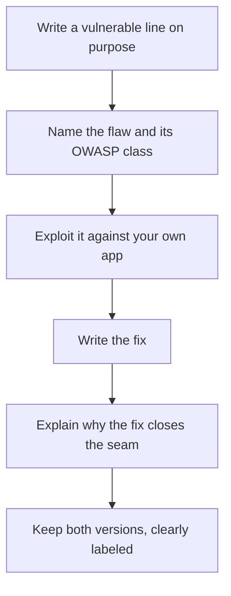

# Lab 7.5: Custom Vulnerable App

**Month:** 7 (Web Application Security and SQL)
**Pattern family:** Web and application security
**Time budget:** 8 to 10 hours (across multiple sessions)
**Lab attempt floor:** 90 minutes
**AI guidance:** Brainstorming-variations pattern, with a hard carve-out: **AI does not write your app.** You write the code, including the two deliberate flaws. AI may help brainstorm payload variations when you later attack your own app. See "AI guidance for this lab" below.
**Prerequisites:** Labs 7.1 to 7.4 complete. You have written SQL by hand, met the flaw classes, and documented vulnerabilities mapped to OWASP categories. Month 5 (you can build a small program in your chosen language) and Month 7 README read.

**Recall first, from memory:** in Lab 7.1 you wrote, in prose, how a parameterized query closes the seam a string-built query opens. In Lab 7.4 you named a control and judged whether it was complete. Hold both; this lab makes you write the broken version and the fix with your own hands.

## Why this lab exists

Up to now you have attacked applications other people built. This lab flips the chair around. You build a small web application, you put two specific, deliberate vulnerabilities into it, and you document both: what the flaw is, how to exploit it, and how you would fix it. Building the flaw yourself is the deepest way to understand it. When you have written the `WHERE` clause that concatenates user input, and then written the parameterized version that does not, the distinction between SQL injection and a safe query stops being something you read about and becomes something you have built with your own hands.

This is the capstone of the month and the second half of the month's deliverable. The custom app's repository sits alongside your `web-security-portfolio.md` as proof that you understand web flaws from both sides: as an attacker who can find them and as a developer who can introduce and remove them.

## The scope rule and the teardown rule, first, because both are not optional

**Scope.** You build and run this app **on your own machine**. You attack only your own running copy. This is the easiest scope situation in the month (you own everything), and it is still stated here because the habit of stating it is the habit that protects you.

**Teardown.** This app is, by design, deliberately vulnerable. A deliberately vulnerable app reachable on the public internet is a genuine danger: it can be found by automated scanners within hours, exploited, and turned into a foothold or a host for someone else's abuse. Therefore:

- While you develop and attack it, run it bound to localhost or a host-only network. Do not deploy it to a public host to "test it live."
- The source code may live in a **public repository** for portfolio review (the code is the artifact; reading it is safe).
- The **running application is removed from any public hosting the moment the lab is done.** If at any point you put a running instance on a reachable host (a cloud VM, a tunnel, a shared box), you take it down when you finish the lab. The repository's README must state, at the top, that the app is intentionally vulnerable and must never be run on a reachable network.

This teardown rule is part of the lab's acceptance criteria, not an afterthought. `SAFETY.md` governs; a deliberately broken app on the open internet is exactly the kind of liability it exists to prevent.

## Learning objectives

By the end of this lab, you can:

- Build a small web application in Flask or Express with routes, a database, and a basic templating layer.
- Introduce two deliberate, distinct vulnerabilities and explain each at the code level: where the flaw is, why it is exploitable, and what input triggers it.
- Demonstrate the exploit against your own running app and document reproduction steps.
- Produce the fix for each flaw and explain why the fix closes the seam, with a before-and-after diff.
- Defend, from memory, every line of the vulnerable code and every line of the fix.

## Recognition cue

When you write a line that places user input into a query, a page, or a file path, you should feel the flaw being born under your fingers, and you should be able to name it before you run it. That predictive sense, knowing a line is exploitable as you type it rather than discovering it later with a tool, is the cue this lab builds by having you introduce flaws on purpose. It is also the developer's-eye version of everything you practiced as an attacker in the earlier labs. If you can introduce a flaw deliberately and then close it deliberately, you recognize it from both chairs.

## AI guidance for this lab

This lab has the strictest AI carve-out in the month, and it is the carve-out the master curriculum names explicitly.

**Not allowed, full stop:** AI does not write your app. Not the routes, not the database layer, not the templates, not the vulnerable code, not the fix. The entire point of the lab is that you build it, including the flaws, from your own understanding. If you have AI generate the app, you forfeit the only thing this lab teaches, and the verification ritual (which will ask you to explain a line of your own code from memory) will expose it immediately. This is the same reason Lab 7.1 was hand-written: you cannot defend what you did not build.

**Allowed, narrowly:** Once your app exists and runs, and you are in the attacking phase, the brainstorming-variations pattern applies exactly as in the other web labs: you craft a seed payload against your own app by hand, then you may ask AI for variations to test. That is the only AI use in this lab, and it applies only to the attack payloads, never to the app's source.

**Logged:** The provenance section records the (narrow) AI use on attack payload variations, and explicitly states that the application code was written by you without AI. That explicit statement is part of the provenance discipline here.

## Tasks

### Learn the method: introduce a flaw, then close it (gradual release)

The new skill this lab teaches is the developer's-eye move: **write a line that is exploitable, name why, then write the fix and say exactly what changed.** You learn it first on a tiny throwaway snippet, then you apply it unscaffolded to your own app in Tasks 1 through 4. Here is the cycle you will run for each of your two flaws:


*Notice: the loop ends at "explain why," not at "the fix works." The point of this lab is that you can articulate the difference, not just toggle it.*

#### Stage 1 - Worked example (I do)

Study this complete worked example. It is a throwaway four-line snippet showing the vulnerable-to-fixed move on a SQL injection, the same flaw you wrote about in prose in Lab 7.1, now in code. **This demo does not count as one of your two graded flaws; your two must be your own code in your own app.** It exists only to show the method.

Vulnerable (the query is built by gluing strings):

```python
def find_user(db, name):
    # VULNERABLE: name is concatenated straight into the SQL text.
    return db.execute("SELECT * FROM users WHERE name = '" + name + "'").fetchall()
```

The flaw: `name` is attacker-controlled, and it becomes part of the query text, so the database parses it as code. That is injection (OWASP A05 in the 2025 list). You can point to the exact line: the `"... '" + name + "'"` concatenation.

Fixed (the value is bound, not glued):

```python
def find_user(db, name):
    # FIXED: name is sent as a bound parameter, pure data the engine never parses as SQL.
    return db.execute("SELECT * FROM users WHERE name = ?", (name,)).fetchall()
```

Why the fix closes the seam, in one breath: the `?` placeholder tells the database "a value goes here," and the value travels separately from the query text, so no input can ever be read as code. That is the prose payoff of Lab 7.1 made concrete in two lines of difference.

**Checkpoint:** you can state, for this snippet, the exact line that is exploitable, the flaw class, and the one-line reason the parameterized version is safe.
**If not:** if the difference is fuzzy, re-read your own Lab 7.1 prepared-statement writeup; this snippet is that writeup in code. You do not need to run it to understand it.

#### Stage 2 - Faded practice (we do)

On paper or in a scratch file (not yet your graded app), do the same move for a different flaw class: reflected output (XSS). Fill the blanks.

```text
TODO 1: Write one vulnerable line (any language) that puts user input straight
        onto an HTML page without encoding it. Mark which part is the flaw.
TODO 2: Name the flaw class and its OWASP 2025 category in one phrase.
TODO 3: Write the fixed line: encode the output (or use your framework's
        auto-escaping template) so the input renders as text, not markup.
TODO 4: Write the one-sentence reason the fix closes the seam.
```

You saw the full vulnerable-to-fixed move in Stage 1; here you supply the lines and the reason for a second flaw class.

**Checkpoint:** you have a vulnerable line, the named class, a fixed line, and a one-sentence reason, for an XSS-style flaw, written in a scratch file.
**If not:** if your "fix" still concatenates input into HTML, you mitigated nothing; the fix is to encode the output or let a template auto-escape it, so the browser treats the input as text. Name what your fix actually does before moving on.

#### Stage 3 - Independent (you do)

Now build the real graded work: your own app (Task 1), your own two deliberate flaws from two different OWASP categories (Task 2), your exploits (Task 3), and your fixes with explanations (Task 4). You apply the vulnerable-to-fixed method yourself, with no scaffolding from this file, and the two flaws must be your own code, not the demo snippets above.

### Task 1: Design and build the app, no AI (3 to 4 hours)

Choose Flask or Express (justify the choice in your notebook). Build a small but real application: at minimum, a login or registration flow backed by a database, one form that stores user input, and one page that displays stored input back to users. Keep it small; this is not a product. Write every line yourself.

**Checkpoint:** a running app in this lab's repository, served on localhost, with at least the routes above and a backing database (SQLite is fine), running from documented steps, written without AI.
**If not:** if you are tempted to have AI scaffold "just the boilerplate," stop; that crosses this lab's hard line and the verification ritual will expose it. Write it small and plain yourself, the way you built tools in Month 5.

### Task 2: Introduce two deliberate, distinct flaws (2 hours)

Introduce exactly two vulnerabilities, from two different OWASP Top 10 (2025) categories (for example one injection flaw and one cross-site scripting or access-control flaw; you choose, and the two must be genuinely different in mechanism). For each flaw, you must be able to point to the exact line or lines that make it exploitable and explain why. The flaws should be ones you met earlier this month, so that you understand them deeply enough to introduce them on purpose.

**Checkpoint:** two distinct flaws present in the code, each traceable to specific lines, each from a different OWASP category, with each flaw, its category, and the responsible line(s) named in your notes.
**If not:** if your two flaws turn out to be two flavors of the same mechanism (two kinds of injection, say), pick a second flaw whose fix is different in kind (an access-control check, an output encoding); the acceptance criterion is two genuinely different categories.

### Task 3: Exploit your own app and document it (90 minutes)

Attack your own running app and demonstrate each flaw. For each, craft the seed payload yourself; you may then brainstorm variations with AI per the pattern. Document reproduction steps another person could follow against a fresh copy of your app, described at the HTTP level (Burp is a natural tool here, as in the earlier labs).

**Checkpoint:** reproduction steps for both flaws, demonstrated against your own running instance, in the app's README or a `FLAWS.md` in the repo, each entry naming the flaw, the OWASP category, and the steps.
**If not:** if a flaw you introduced will not actually trigger, the vulnerable line may be guarded by something else in your code; trace the input from the form to the line and confirm nothing sanitizes it on the way, exactly the input-to-system tracing you practiced as an attacker.

### Task 4: Write and explain the fix for each flaw (90 minutes)

For each of the two flaws, write the fix in code (parameterize the query, encode the output, add the access-control check, whatever the flaw demands) and explain in prose why the fix closes the seam. Keep both the vulnerable version and the fixed version visible, for example on separate branches or clearly marked in the README with a before-and-after diff. The point is to show you can both introduce and remove the flaw and articulate the difference.

**Checkpoint:** a fix for each flaw, with a before-and-after diff and a prose explanation of why each fix works, in the repo; the vulnerable version remains visible but is clearly marked as the deliberately broken version.
**If not:** if you can write the fix but cannot explain why it works beyond "the docs said to," return to your Lab 7.1 writeup and the OWASP Cheat Sheet for that flaw; the explanation is the deliverable, the same gap Lab 7.1 existed to close.

### Task 5: Repository hygiene and the teardown (45 minutes)

Write the repository README: what the app is, that it is **intentionally vulnerable and must never be run on a reachable network**, how to run it locally, the two flaws and their fixes, and an AI disclosure line (per `AI-ETHICS.md`) noting that the app code was written by the author without AI and that AI was used only to brainstorm attack-payload variations during testing. Then, if you ever ran the app anywhere reachable, tear that instance down and confirm it is gone.

**Checkpoint:** a README leading with the "intentionally vulnerable, never expose" warning and containing the AI disclosure; any reachable instance that ever existed is confirmed torn down; no real credentials or secrets anywhere in the repo or its history, synthetic data only.
**If not:** if you ever pushed a secret or ran a reachable instance, the repo history and the running host both need attention; rotate any leaked value, scrub the history, and confirm the instance is down. A deliberately vulnerable app on a reachable network is exactly what `SAFETY.md` exists to prevent.

### Task 6: Notebook entry with AI Provenance (60 minutes)

Write `.tutor/notebook/lab-05-custom-vulnerable-app.md`. Required sections:

- **Pre-flight check.** Pre-flight the act of building and running a deliberately vulnerable app: what it is, its network exposure, why localhost-only, the teardown obligation, and the authorization scope (your own app, trivially authorized to attack, dangerous to expose).
- **Concept naming.** What does building a flaw teach that exploiting someone else's does not?
- **Evidence.** Repository link, the two flaws with their responsible lines, the reproduction steps, and the before-and-after fixes.
- **Five-question debrief.**
- **AI Provenance.** State explicitly that the app code was written without AI; document any AI-brainstormed payload variations used in Task 3, per the pattern.

**Checkpoint:** a committed entry with all sections, including the explicit "app code written without AI" statement in the provenance section.
**If not:** if you used AI only on payload variations, say exactly that and state plainly that the app code was yours; the explicit statement is part of the provenance discipline here, not an optional nicety.

## Definition of Done

The lab is complete when the app exists and runs locally, two distinct flaws from two OWASP categories are present and traceable to specific lines, both are demonstrated with reproduction steps, both have explained fixes with diffs, the repository README leads with the teardown warning and includes the AI disclosure, any reachable instance is torn down, and the notebook entry is committed.

The tutor runs the verification ritual: it picks one line of your application code (vulnerable or fixed) and asks you to explain, from memory and with your AI session closed, what it does and why it is or is not exploitable. Because you wrote the app yourself, this is straightforward. If AI wrote it, this ritual is where that becomes obvious.

**Self-explain:** in one sentence, why does building the flaw yourself teach you something attacking someone else's app did not?

## Stretch goals

1. Add a third flaw and its fix, then write which of the three was hardest to introduce convincingly and why. Introducing a realistic flaw is its own skill.
2. Write a short threat model for your tiny app: what an attacker wants, where they would enter, and which of your two flaws is the higher risk and why. This is the Month 6 mindset applied to your own code.
3. Add a minimal test that fails against the vulnerable version and passes against the fixed version, proving the fix in code the way you proved tools in Month 5.

## Troubleshooting

- **The urge to have AI scaffold the app "to save time."** That crosses the lab's hard line and forfeits the learning; the verification ritual will catch it. Write it yourself, small and plain.
- **Wanting to deploy a live instance to show it off.** The repository is the portfolio artifact, not a running instance. Keep the running app on localhost and tear down anything reachable when you finish.
- **The two flaws collapse into one mechanism** (two flavors of injection, say). The criterion is two genuinely different categories; choose flaws whose fixes differ in kind.
- **Writing a fix you cannot explain beyond "the docs said to."** That is the gap Lab 7.1 exists to close; return to that writeup and the documentation until the mechanism is clear.

## Time budget breakdown

- Learn the method (gradual release): 30 to 45 minutes
- Task 1: 3 to 4 hours
- Task 2: 90 minutes
- Task 3: 90 minutes
- Task 4: 90 minutes
- Task 5: 45 minutes
- Task 6: 60 minutes

Total: 8 to 10 hours.

## Resources

- The Flask documentation or the Express documentation, depending on your choice (primary source for the framework you build in).
- The OWASP Top 10 (2025) pages for the two categories you choose, and their corresponding prevention guidance.
- The PostgreSQL or MySQL documentation on prepared statements (if your injection flaw is SQL injection), reinforcing your Lab 7.1 writeup.
- The OWASP Cheat Sheet Series entries for the flaws you introduce (for the fix-side reasoning).
- `AI-ETHICS.md` on disclosure in a public repository.
