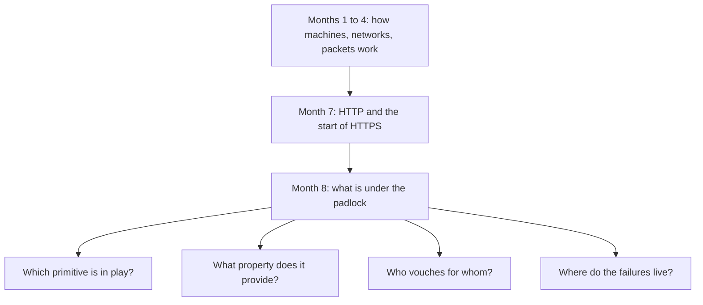

# Month 8: Cryptography and PKI

**Pattern family:** Cryptography and PKI · **Time budget:** 45 hours · **AI guidance:** Heavily restricted this month. AI may **only** explain crypto concepts in plain language. AI may **not** solve CryptoHack challenges or do any crypto math. Read "AI augmentation this month" below before your first lab. The AI Provenance log is still required in every notebook entry, even the entries where the honest answer is "AI was not used." · **Prerequisites:** Months 1 to 7 done. You can read a packet capture and follow a TCP handshake in Wireshark (Month 4). You reason about HTTP and the start of HTTPS (Month 7). You can write and run a small Python script (Month 5). You need no prior cryptography.

## Overview

You have used cryptography since Month 0 without being able to say what it does. Every `https://`, every SSH session, every signed package update has leaned on parts you treated as magic. This month removes the magic. Not by turning you into a cryptographer (that is a career, not a month), but by making you the practitioner who can read a certificate, explain a TLS handshake, spot a broken cipher mode on sight, and run a small certificate authority well enough to understand what the public ones do for you.

This is also the month where the course's AI discipline is tested hardest. Cryptography is the one domain where an AI model is most confidently, most plausibly wrong. It will invent a mode of operation. It will misstate which document says what. It will scramble the order of a handshake. It will produce math that looks like a proof and is not one. So the AI rule this month is the strictest in the course. You use AI to turn jargon into plain English, and for nothing else. Everything you claim about crypto, you check against a primary source.

A **primary source** here means a published standard, not a blog post and not an AI answer. Two kinds matter. An **RFC** (Request for Comments) is the document that defines an internet protocol; RFC 8446 defines TLS 1.3. A **NIST publication** (from the U.S. National Institute of Standards and Technology) defines a cryptographic standard; for example, the SHA-2 hash family. These documents do not hallucinate. Your reading list points you at the exact ones.

Here is where this month sits in the course, and the four-part question you will learn to ask about any piece of crypto you meet:

*Notice: this month does not add a new layer on top of the network. It opens up a layer you already relied on, and gives you four questions to ask every time you meet crypto again.*

## Warm-Up: Retrieve Before You Begin

Answer these from memory, in writing, before you read on. No peeking at earlier months. This pulls forward the prior skills this month builds on.

1. From Month 4: what are the three packets of the TCP handshake, and which side sends each?
2. From Month 7: what does HTTPS add on top of plain HTTP, in one sentence, even if you cannot yet say how?
3. From Month 5: what was the rule about AI-drafted code, and why did you have to be able to defend every line?
4. From Month 0: why do you keep key material and personal-machine details in a private repo, not a public one?

Check your recall

1. SYN (client to server), SYN-ACK (server to client), ACK (client to server). You watched this in Wireshark in Month 4. TLS rides on top of a completed TCP handshake, so you will see the SYN, SYN-ACK, ACK first, then the TLS messages.
2. HTTPS adds encryption and server identity: the traffic is scrambled so others cannot read it, and the server proves who it is. The "how" is this month's whole story. From Month 7.
3. You wrote the spec and tests; AI only drafted; your tests decided if the draft lived; your name was on the merge. From Month 5. The same "verify, do not trust" stance returns this month, even harder.
4. A private key or a personal detail in public history is a standing risk that anyone can find and copy. From Month 0. Lab 8.2 makes this rule concrete: your CA's keys live in a private repo, always.

## Learning objectives

By the end of this month you can:

- **Distinguish** symmetric from asymmetric cryptography, and explain with a concrete example each what problem it solves and what it costs.
- **Explain** what a hash, a MAC, an HMAC, and a digital signature each provide, and which security property (confidentiality, integrity, authenticity, non-repudiation) each delivers.
- **Read** every field of an X.509 certificate and explain what it asserts and who vouches for it.
- **Build** a certificate authority, issue a server certificate, serve HTTPS from it locally, and explain the chain of trust your browser walks to validate it.
- **Analyze** three deliberate certificate misconfigurations by the browser's reaction, and **reconcile** each reaction with the validation rule it broke.
- **Produce** a message-by-message annotation of a real TLS 1.3 handshake you captured, and contrast it with the TLS 1.2 handshake it replaced.
- **Defend** any claim you make about cryptography by citing the primary source, not the AI session that paraphrased it.

## Recognition cue

When you see a certificate warning, a cipher suite string, a `-----BEGIN CERTIFICATE-----` block, or a protocol that says it is "encrypted," you reach for the four questions in the Overview diagram: which primitive, what property, who vouches, where the failures live. When an AI tells you something about crypto with total confidence, you reach for the RFC before you reach for trust.

## Core concepts to internalize

Read these to understand the labs, not to memorize them. Each chunk is one idea. New terms are bold and defined the first time.

### Symmetric versus asymmetric

**Symmetric cryptography** uses one shared secret key to both lock and unlock data. AES is the common example. It is fast, but it has a hard problem: both sides must already share the key, and getting that key to the other side safely is not easy. This is the **key distribution problem**.

**Asymmetric cryptography** uses a pair of keys: a **public key** you can hand to anyone, and a **private key** you keep secret. RSA and elliptic-curve cryptography are the common examples. Data locked with the public key can only be unlocked with the matching private key. This solves key distribution, because the public key is safe to share. The cost is speed: asymmetric math is much slower than symmetric.

> **Common misconception.** "A real protocol picks one: either symmetric or asymmetric."
> **Reality.** Real protocols use both. They use slow asymmetric crypto once, just to agree on a shared symmetric key, and then use fast symmetric crypto for all the bulk data. TLS does exactly this. The misconception is tempting because each tool sounds complete on its own, but each one only fixes the other's weakness.

### Hashing

A **cryptographic hash function** takes any input and produces a fixed-length output called a **digest**. It has three properties: it is one-way (you cannot run it backward to recover the input), it is collision-resistant (it is hard to find two inputs with the same digest), and the output is always the same length. SHA-256, from the SHA-2 family, is the standard choice. MD5 and SHA-1 are broken for security use; do not trust them.

A hash is not a checksum and not a password hash. A **checksum** only catches accidents, like a flipped bit. A **password hash** (bcrypt, scrypt, Argon2) is built to be slow on purpose, so an attacker who steals the stored hashes cannot guess billions of passwords per second.

> **Common misconception.** "A hash encrypts the data, so I can decrypt it later."
> **Reality.** A hash has no key and no inverse. There is nothing to decrypt. It is a one-way fingerprint. This is exactly why it is the right tool for storing passwords (you compare fingerprints) and the wrong tool when you actually need the data back.

### MACs, HMACs, and digital signatures

A hash alone proves the data was not changed by accident. It does not prove who sent it. A **MAC** (message authentication code) fixes this: it mixes a shared secret key into the check, so only someone with the key could have produced a valid tag. **HMAC** is the standard, careful way to build a MAC out of a hash function. You do not invent your own MAC from a bare hash; the naive way is breakable, and HMAC exists because the obvious approach fails.

A **digital signature** goes one step further. You sign with your private key, and anyone can verify with your public key. It is the inverse of encryption's key usage. A signature proves something a MAC cannot: **non-repudiation**, meaning the signer cannot later deny it, because only they hold the private key. A MAC's shared key is held by both sides, so a MAC cannot single out one signer.

These map to four security properties you will name all month: **confidentiality** (others cannot read it), **integrity** (it was not changed), **authenticity** (it is from who it claims), and **non-repudiation** (the sender cannot deny sending it).

### PKI and the chain of trust

> **Heavy concept ahead.** Slow down here; this is the load-bearing idea of the month.

**PKI** (public key infrastructure) is the system that answers one question: when a server hands you a public key, why should you believe it belongs to that server and not an impostor? The answer is vouching. A **certificate authority** (CA) is an organization your computer already trusts. The CA checks who you are and then signs a document binding your identity to your public key. That signed document is an **X.509 certificate**.

Your computer ships with a **root store**: a built-in list of root CAs it trusts. A certificate you get from a website is usually signed not by a root directly, but by an **intermediate CA**, which is in turn signed by a root. So your browser walks a **chain of trust**: the website's certificate points to the intermediate that signed it, the intermediate points to the root that signed it, and the root is one your computer already trusts. If every link checks out, the browser trusts the site.

An X.509 certificate has fields you will learn to read: the **subject** (who it is for), the **issuer** (who signed it), the **validity** period (the dates it is good for), the **public key** itself, the **SAN** (subject alternative name, the list of hostnames it covers), the **key usage** (what the key is allowed to do), and **basic constraints** (which says whether this certificate is allowed to act as a CA). RFC 5280 defines all of these.

Trust can also be taken back. **Revocation** is how a CA says "stop trusting this certificate before it expires," using a **CRL** (certificate revocation list) or **OCSP** (online certificate status protocol). Revocation is the hard, half-solved part of PKI, and knowing why is part of understanding it.

> **Common misconception.** "A certificate is what encrypts my connection."
> **Reality.** A certificate carries a public key and an identity claim; it does not do the encrypting. It is an identity document, like a passport. The encryption is done by keys the two sides agree on during the handshake. The misconception is tempting because the certificate shows up right when the padlock does.

### TLS 1.2 versus TLS 1.3

**TLS** (transport layer security) is the protocol under the padlock. The **handshake** is the opening exchange where the two sides agree on how to talk securely. TLS 1.2 (RFC 5246) takes two round trips and sends the server's certificate in the clear. TLS 1.3 (RFC 8446) takes one round trip, encrypts the certificate, drops old insecure options, and makes **forward secrecy** mandatory. Forward secrecy means each session uses fresh, throwaway keys, so stealing the server's long-term key later does not unlock past recordings. Lab 8.3 has you watch a real 1.3 handshake and contrast it with 1.2.

### Common crypto failures, at the concept level

You do not need to break these yourself. You need to recognize them. **ECB mode** is a block cipher mode that encrypts each block independently, so identical input blocks make identical output blocks; the famous "ECB penguin" image is still recognizable after encryption, because the structure leaks. **IV reuse** breaks modes like CBC and CTR: the **IV** (initialization vector) must be unique per message, and reusing it leaks relationships between messages. A **padding oracle** is a flaw where an error message tells an attacker whether decryption padding was valid, and that one bit, repeated, becomes a full decryption tool. **Weak randomness** is the quiet killer: if the random number generator is predictable (the topic of NIST SP 800-90A), every key built on it is guessable, and nothing above it is safe.

## AI augmentation this month: the restricted pattern

Month 5 gave you the drafting pattern. Months 6 and 7 added concept orientation and brainstorming. This month claws most of that back, on purpose. Cryptography is where AI's confident wrongness is most dangerous, so the only allowed use is the narrowest one.

**Allowed.** Asking AI to explain a crypto concept in plain language. For example: "explain what a padding oracle is, as if to a smart non-engineer," or "what does the `keyUsage` extension on a certificate mean in everyday terms." Use it like a patient tutor who is good at analogies and whose every factual claim you will then check.

**Not allowed.** Asking AI to solve a CryptoHack challenge, hint toward one, or confirm a flag. Asking AI to do crypto math (modular arithmetic, key sizes, breaking a cipher, computing a signature). Asking AI which cipher suite to configure or whether a setup is secure. Pasting key material, private keys, or challenge inputs into any AI service.

**The reason, plainly.** You cannot judge AI's crypto output unless you already understand the crypto, and the point of the labs is to build that understanding by struggle. If you let AI do the math, you learn nothing and you cannot tell when it is wrong, which in crypto is often and invisible. Plain-language explanation is allowed because it is the one use where you can check the claim against an RFC or NIST source and throw it out if it is wrong.

**The verification reflex for this month.** Every factual claim AI gives you about cryptography is a guess until you confirm it against a primary source. If AI says "TLS 1.3 sends the certificate before the ServerHello," you do not believe it. You open RFC 8446 and check the order yourself. This reflex is the real deliverable of the month's AI discipline.

Re-read `AI-ETHICS.md` at the repo root before your first lab if you have not recently. Decision-tree question Q2 ("could the AI's output be wrong in a way you would not catch?") is the whole month in one line.

## The AI Provenance log (mandatory, even when AI was not used)

Every notebook entry this month still carries an "AI Provenance" section, with the same five elements the course has required since Month 5:

- **Which AI tool** (model and interface), or "none" if AI was not used.
- **What you asked** (the plain-language concept questions only; no challenge data, no key material, no capture, ever).
- **What was generated** (the explanation you got; in this restricted month the honest answer is usually "a plain-language explanation only, no code, no math, no solution," and often "nothing, AI was not used here").
- **What verification you performed** (the exact primary source you checked it against: the RFC section, the NIST publication, the tool's documentation).
- **What you discarded** as wrong (when AI's explanation contradicted the source, what you threw out and why; often "n/a, no AI output to discard").

For the CryptoHack lab, the honest entry will often read: "AI tool: none used on the challenges, per the month's restriction. Used [tool] once to explain [concept] in plain language; generated a plain-language explanation only; verified it against [RFC or NIST source]; discarded nothing; the challenge work was entirely my own." That is a complete, valid entry. An entry that hides AI use, claims AI use the rules forbid, or skips any of the five elements is rejected the same as a missing debrief question.

Writing "I did not use AI here, and here is the proof in my work" is itself a skill. Employers in 2026 screen for candidates who can say exactly where AI was and was not in their process. Practice it here, where the stakes are a practice flag.

## The verification ritual

When you submit any artifact this month (an annotated certificate, your CA configuration, the TLS annotation), the tutor picks one element and asks you to explain it from memory, with your AI session closed and your notes shut. This month the tutor is likely to point at a single X.509 extension, a single TLS handshake message, or a single line of your CA's configuration and ask "what does this do, and what breaks if it is wrong." If you generated the understanding rather than building it, this is where it shows. Expect it.

## Labs

Three labs, in order. Each has its own directory under `labs/` with a full spec. The first uses an external training platform. The second and third you build and capture on your own machine.

| Lab | Directory | Time | What you build |
| --- | --------- | ---- | -------------- |
| 8.1 CryptoHack Introduction and General | `labs/lab-01-cryptohack-intro/` | 14 to 16 h | Byte-level fluency with encodings, XOR, and the no-flag habit |
| 8.2 Build Your Own CA | `labs/lab-02-build-your-own-ca/` | 14 to 16 h | A working private CA, a served HTTPS site, three documented misconfigurations |
| 8.3 TLS Handshake Annotation | `labs/lab-03-tls-handshake-annotation/` | 10 to 12 h | A decrypted, message-by-message annotation of a real TLS 1.3 handshake |

Two flags before you start. First, the CryptoHack lab (8.1) relies on an external platform; see `ctf-set/README.md` for why that platform is an authorized target and nothing else is. Second, the CA lab (8.2) produces private keys, so its repository is **private** and key material never enters public history. Lab 8.3 produces the raw material for the month's deliverable (`deliverable.md`).

## A note on private repositories this month

Lab 8.2 generates private keys for your CA and your server certificate. Key material does not go in a public repository, ever, even for a throwaway lab CA. The Lab 8.2 work, and the working CA and certificates that go with the month's deliverable, live in a **private** repository. This is not bureaucratic caution. A private key committed to a public repo is the single most common way real organizations get breached. You build the habit of never doing it here, on a key that does not matter, so that you never do it on one that does. The deliverable spec spells out exactly what is public (the annotated writeup, with secrets redacted) and what stays private (the keys and certs).

## Weekly rhythm and the warm-start

Weeks 1 to 3 build the three artifacts. **Week 1 opens with a warm-start that keeps a prior skill alive:** before any new crypto work, re-open one of your Month 4 PCAPs and find where a TLS session begins (the ClientHello, right after the TCP handshake). You will not annotate it yet. The point is to wake up your Wireshark reading and connect it to where this month is heading. Note one thing about that ClientHello you cannot yet explain; you will be able to by Lab 8.3.

## The cold-revisit week

The third Friday of this month pulls prior labs cold, as every month does. Expect the tutor to ask you to re-read one of your Month 4 PCAPs and locate the start of a TLS session, to re-explain (from Month 7) what the same-origin policy protects, and to redo a CryptoHack General challenge you solved earlier in the month from scratch, with no notes. The building teaches; the cold revisit hardens.

## Notebook entry requirements

Each lab produces a notebook entry at `.tutor/notebook/lab-NN-<slug>.md` with all the standard sections **plus** the AI Provenance section:

- **Pre-flight check** for any new tool (OpenSSL, your local web server, Wireshark's TLS decryption): what it does, what artifacts it leaves, what could go wrong, and the legal authorization scope.
- **Concept naming.**
- **Evidence:** challenge progress, command output, certificate dumps, annotated capture excerpts, screenshots of browser warnings.
- **Five-question debrief.**
- **AI Provenance** (see above). Required. Missing it, or hiding disallowed AI use in it, means the entry is rejected.

## Reflect

Spend ten minutes on these in your notebook (writing, not just thinking):

- **Explain it back:** in two or three sentences, explain the chain of trust to a peer who finished Month 7. Use the word "vouch."
- **Connect:** how does knowing what a TLS handshake carries change how you read the Month 4 PCAP you re-opened in the warm-start?
- **Monitor:** which concept this month is still fuzzy? Name it exactly, and write the one question that would clear it up.

## End-of-month deliverable

A `tls-handshake-annotated.md` walkthrough of a real TLS 1.3 handshake you captured yourself, message by message, written so a peer one month behind you could follow it. The working CA and certificates from Lab 8.2 go with it in a **private** repository, with all key material kept out of any public history. Full spec in `deliverable.md`.

## Common pitfalls

- **Trusting an AI's crypto claim because it sounded sure.** Confidence is not correctness, and crypto is where AI is most confidently wrong. Check the RFC.
- **Putting a hostname only in the common-name field.** Modern browsers ignore the common name for hostname matching and require the SAN. You will hit this in Lab 8.2.
- **Committing a `.key` or `.pem` private key to make a repo "look complete."** Never. Your `.gitignore` is the guardrail; check `git status` before every commit.
- **Forgetting to remove your test CA from the trust store.** A trusted test root is a standing risk. Remove it when Lab 8.2 ends.
- **Looking for the certificate in the clear in a TLS 1.3 capture.** It is encrypted in 1.3. Its absence from the cleartext is itself something to notice.

## Knowledge Check

Answer from memory first, then check. Items marked ⟲ are spaced callbacks to earlier months and are supposed to feel like a stretch.

1. Why does every real protocol use both symmetric and asymmetric crypto, instead of just one?
2. You need to store user passwords. Which is the right tool: a fast hash like SHA-256, or a slow password hash like Argon2, and why?
3. What does a digital signature prove that a MAC does not, and why?
4. Name three fields of an X.509 certificate and say what each asserts.
5. A browser shows a certificate warning. Name two distinct validation rules that, when broken, cause a warning.
6. What is forward secrecy, and which TLS version makes it mandatory?
7. Why does the "ECB penguin" image stay recognizable after encryption?
8. ⟲ From Month 4: a TLS session rides on top of TCP. What three packets must complete before any TLS message is sent?
9. ⟲ From Month 5: why must you be able to defend code AI drafted for you, and how does that stance carry into this month's crypto claims?
10. ⟲ From Month 0: why does your Lab 8.2 CA work live in a private repo, not a public one?

Answer key

1. Symmetric is fast but cannot solve getting the shared key to the other side. Asymmetric solves key distribution but is slow. So protocols use asymmetric once to agree on a symmetric key, then symmetric for the bulk data.
2. A slow password hash like Argon2 (or bcrypt or scrypt). It is deliberately slow, so an attacker who steals the stored hashes cannot test billions of guesses per second. A fast hash makes guessing cheap.
3. Non-repudiation: the signer cannot later deny it, because only they hold the private key. A MAC uses a shared key both sides hold, so it cannot single out one signer.
4. Examples: subject (who the certificate is for), issuer (who signed it), validity (the dates it is good for), public key (the key being vouched for), SAN (the hostnames it covers), basic constraints (whether it may act as a CA).
5. Examples: hostname does not match the SAN; certificate is expired or not yet valid; the issuer is not in a trusted chain up to a trusted root; basic constraints do not permit the signer to be a CA.
6. Forward secrecy means each session uses fresh, throwaway keys, so stealing the server's long-term key later does not unlock past recordings. TLS 1.3 makes it mandatory.
7. ECB encrypts each block independently, so identical input blocks become identical output blocks. The image's large same-color regions map to repeating output, so the shape leaks through.
8. SYN (client to server), SYN-ACK (server to client), ACK (client to server). TLS messages come only after that TCP handshake completes.
9. You sign the work; your name is on it, in the course and the job. The same stance applies to crypto: a claim you cannot trace to a primary source is a liability with your name on it. Verify, do not trust.
10. It contains private keys. A private key in public history can be found and copied by anyone, which is the most common catastrophic mistake in this domain. Erring toward private with anything key-adjacent is the habit.

## How to know you are done with this month

- Three lab notebook entries committed, each with a complete and honest AI Provenance section.
- The CryptoHack Introduction course and a substantial share of the General category solved on the platform, visible on your CryptoHack profile.
- A working private repository with your CA, the issued server certificate, and the three documented misconfigurations.
- `tls-handshake-annotated.md` committed, annotating a real captured TLS 1.3 handshake message by message.
- The cold-revisit week's sub-tasks completed and logged.
- You can pass the verification ritual on any certificate field, TLS message, or CA configuration line you produced.
- `.tutor/progress.md` updated to "Month 8 complete; ready for Month 9."

If any notebook entry's AI Provenance section is missing or dishonest, the month is not done. In a month about trust, the provenance discipline is the curriculum, not an extra.

## Resources

Curated, primary-source-first, in `reading.md`. This month more than any other: read the RFC, not the blog summarizing the RFC.
