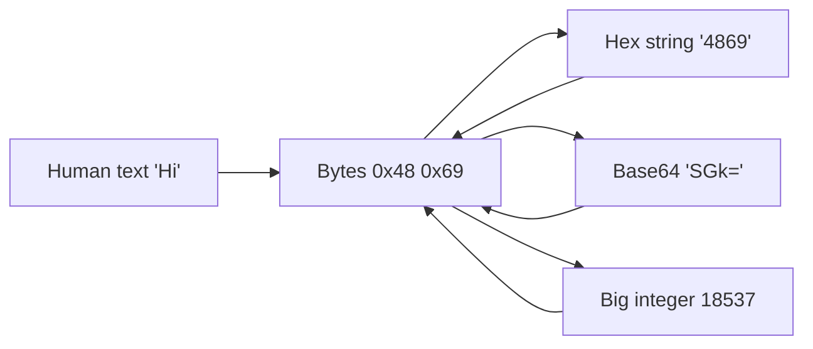

# Lab 8.1: CryptoHack Introduction and General

**Month:** 8 (Cryptography and PKI) · **Pattern family:** Cryptography and PKI · **Time budget:** 14 to 16 hours (across many short sessions; crypto rewards sleep between attempts) · **Lab attempt floor:** 90 minutes per stuck challenge · **AI guidance:** Restricted. AI may explain a crypto concept in plain language; AI may not solve a challenge, hint toward one, do the math, or confirm a flag. See "AI guidance for this lab" below. · **Builds on:** Month 8 README (read it, including "AI augmentation this month"), Month 5 (you can write a small Python script), and a free CryptoHack account.

## Why this lab exists

Every cipher, certificate, and protocol in the rest of this month is built on a few byte-level operations you have never had to look at directly: encoding data as **hex** or **Base64**, converting between bytes and big integers, and the **XOR** operation at the center of symmetric cryptography. CryptoHack's Introduction course and General category exist to make those operations concrete, in your hands, in a few lines of Python you write yourself.

This is also where you learn that cryptography is not something you intuit. It is something you work out. The challenges are small and self-contained, but each one makes you handle data at a level you have been shielded from. By the end you will read a `\x00\x01\x02` byte string the way you read a sentence, you will know why XOR is reversible, and you will have felt the texture of the field the rest of the month formalizes.

**Recall first, from memory, before you read on:** in Month 5 you wrote Python that read input and printed structured output. What does Python's `bytes` type hold, and how is it different from a `str`? (Hold your answer; this lab lives in exactly that gap, where text, bytes, and numbers are three different things that beginners blur together.)

## The scope rule, first, because it is not optional

CryptoHack is a free, public-purpose cryptography training platform, and its terms of use authorize you to solve the challenges it hosts. That authorization covers CryptoHack and nothing else. The encodings, XOR tricks, and byte manipulations you learn here are general skills. Pointing them at any system, file, or account you do not own is exactly the line `SAFETY.md` draws, and it is a CFAA matter on the wrong side of it. You practice on CryptoHack's challenges. You do not "try it on" any other target. See `../../ctf-set/README.md` for the full scope note.

## The no-flag rule, stated up front

The tutor does not confirm CryptoHack flags. Not at any rung of the hint ladder, not when you are sure you are right, not when you are stuck and frustrated. CryptoHack itself tells you whether a flag is correct the moment you submit it. That is the platform's job, and it is the only authority on the matter. Do not paste a flag to the tutor and ask "is this right." The answer will always be the same: submit it on the platform.

CryptoHack's own policy reinforces this. Their FAQ asks solvers not to publish solutions or writeups outside the platform, with a narrow exception for "Starter" challenges and challenges worth 25 points or less. Honor that. Your notebook documents your *understanding* and your *approach*, not the flags themselves, and anything you might later post publicly is limited to the starter-tier challenges the platform explicitly permits discussing.

## Learning objectives

By the end of this lab, you can:

- **Encode and decode** data between bytes, hexadecimal, Base64, and ASCII, in Python, and **explain** what each representation is for.
- **Explain** why XOR is the reversible operation at the center of symmetric cryptography, and **demonstrate** `a XOR b XOR b == a` in your own code.
- **Convert** between byte strings and large integers, and **explain** why cryptography on numbers (RSA, Diffie-Hellman) needs that bridge.
- **Produce** intended output from a small cryptographic challenge using only Python and primary-source documentation.
- **Produce** an honest AI Provenance entry for a lab where AI's role was near zero.

## Recognition cue

When a later challenge or a real protocol hands you data that "looks like garbage," you reach for the question this lab drills: what representation is this (hex, Base64, raw bytes, an integer), and have I decoded it as the thing it actually is. When you see an XOR in a cipher or a protocol, you recognize it as a reversible operation and you know what reversing it needs. This lab is where that byte-level reflex is built.

## How the byte-level picture fits together

Before the stages, hold this map. The same data wears different costumes, and your job is to know which costume you are looking at and how to change it.


*Notice: bytes are the hub. Hex, Base64, and the integer are all just other ways to write the same bytes. Most "garbage output" bugs are decoding one costume as if it were another.*

## AI guidance for this lab

This is the most restricted lab in the course, by design. Read this section twice.

**Allowed.** Asking AI to explain a concept in plain language, with no challenge data in the prompt: "explain what Base64 encoding is and why it exists," "what does it mean that XOR is its own inverse," "in plain terms, what is the difference between bytes and a bytearray in Python." Then you verify the explanation against the Python documentation or a primary source, and you do the challenge yourself.

**Not allowed.** Pasting a challenge prompt, challenge data, or a flag into any AI tool. Asking AI to "solve this," "give me a hint," "write the decode script," or "check my answer." Asking AI to do any arithmetic the challenge depends on. Using AI to identify which technique a challenge wants. All of these defeat the entire purpose of the lab, which is that *you* build the byte-level intuition by struggling with it.

**The test.** Before you send anything to an AI tool, ask: does this prompt contain any part of a challenge, or is it a general concept question I could find answered in the Python docs? If it contains challenge content, do not send it. If you are using AI to avoid the struggle rather than to understand a word, stop. The struggle is the lab.

**Logged.** Your AI Provenance section records the concept questions you asked (if any) and states plainly that the challenge work was your own. "AI not used on the challenges" is the expected and correct entry here.

## Tasks

Do these in order. The CryptoHack platform tracks your progress; your profile is your evidence.

### Task 1: Pre-flight and account setup (30 minutes)

Create or confirm your CryptoHack account. Read the platform's FAQ, specifically its policy on sharing solutions. Skim the "Introduction to CryptoHack" course landing page so you know its shape (it is roughly ten lessons covering encodings and the XOR starter).

Write the pre-flight entry in your notebook before you solve anything: what CryptoHack is, what the "tool" here is (your own Python plus the platform's submission mechanism), what artifacts it leaves (your solved-challenge history on your profile; nothing on any system you do not own), what could go wrong (the temptation to apply these skills off-platform; refuse it), and the authorization scope (CryptoHack's terms authorize the challenges; nothing else is in scope).

**Checkpoint:** your CryptoHack profile loads and shows your account, and your notebook has a pre-flight entry covering all four points above.
**If not:** if the account will not create, check you are on the real CryptoHack site and your email confirmation went through. If your pre-flight entry is one line, expand it; the notebook gate rejects a thin pre-flight the same as a missing one.

### Task 2: Learn byte-level decoding (gradual release)

The new skill of this lab is reading and changing data between its representations: bytes, hex, Base64, and integers. You will learn it in three stages on a plain teaching string first, then take it to the platform. Type everything yourself. The teaching string below is **not** a CryptoHack challenge; it exists so you can learn the moves before you face a graded one.

#### Stage 1 - Worked example (I do)

Open a Python shell (`python3`) and run these lines one at a time. Watch each result. You are inventing nothing yet; you are seeing the costumes change.

```python
text = "Hi"                      # a normal string of characters
b = text.encode()                # turn it into bytes: b'Hi'
b                                # -> b'Hi'
b.hex()                          # bytes as a hex string -> '4869'
bytes.fromhex("4869")            # hex string back to bytes -> b'Hi'

import base64
base64.b64encode(b)              # bytes as Base64 -> b'SGk='
base64.b64decode("SGk=")         # Base64 back to bytes -> b'Hi'

int.from_bytes(b, "big")         # bytes as one big integer -> 18537
(18537).to_bytes(2, "big")       # integer back to bytes -> b'Hi'
```

Line by line: `.encode()` turns text into bytes, because crypto operates on bytes, not characters. `.hex()` and `bytes.fromhex()` move between bytes and the hex spelling of those bytes. `base64.b64encode` and `b64decode` do the same for Base64, the format used to carry binary safely in text. `int.from_bytes(..., "big")` reads the bytes as a single number (big-endian, most significant byte first), and `.to_bytes()` reverses it. That is the whole toolkit: four costumes, and the function that changes each one.

**Checkpoint:** `b.hex()` prints `'4869'`, `base64.b64encode(b)` prints `b'SGk='`, and `int.from_bytes(b, "big")` prints `18537`.
**If not:** if `b.hex()` errors, you probably ran it on the string `text` instead of the bytes `b`; `.hex()` is a method on bytes. If Base64 errors, confirm you imported `base64` first.

#### Stage 2 - Faded practice (we do)

Now you supply the moves. Same teaching idea, a different short string. Predict each result before you press Enter, then check. Fill the blanks marked TODO. This is still a teaching string, not a challenge.

```python
msg = "byte"
mb = msg.encode()               # bytes for "byte"
mb.hex()                        # TODO: predict the hex, then run to check

# TODO: write the ONE call that turns mb into a Base64 bytes object
# (goal: get something like b'Ynl0ZQ==')

# TODO: write the ONE call that reads mb as a big-endian integer
# (goal: a single integer that represents all four bytes)

# Now reverse a costume you were handed:
bytes.fromhex("6f6b")           # TODO: predict the two characters this decodes to
```

You used every one of these calls in Stage 1. Your job is to drop the right call into each slot and confirm the output matches your prediction.

**Checkpoint:** your Base64 call returns `b'Ynl0ZQ=='`, your integer call returns a single number, and `bytes.fromhex("6f6b")` returns `b'ok'`.
**If not:** if a call returns the wrong type (a string where you expected bytes, or the reverse), check the direction: `.hex()` makes a string from bytes, `bytes.fromhex()` makes bytes from a string. Run the call alone and read its type with `type(...)` before moving on.

#### Stage 3 - Independent (you do)

No scaffolding now, and from here on you work the real platform. Apply the costume-changing skill to the actual challenges yourself; this file will not walk any challenge for you, and the tutor will not either. Complete the steps below on CryptoHack.

1. **Work the "Introduction to CryptoHack" course in order**, end to end. It covers ASCII, hex, Base64, bytes-to-integer conversion, and the XOR starter. Type the Python yourself for each lesson. When a lesson introduces an idea you have not met, look it up in the Python documentation, not in a walkthrough. For each lesson, before you move on, say in one sentence what operation it taught and why cryptography needs it.
2. **Then work the "General" category substantially**, especially the encoding and XOR sub-sections, which the rest of the month leans on. You are not required to clear every challenge, but make honest, substantial progress and do not skip the foundational encoding and XOR ones.

Apply the floor: ninety minutes of genuine effort on any challenge that stumps you before you ask the tutor for a hint, and even then the hint is a Socratic nudge, never a solution.

**Checkpoint:** the Introduction course shows as completed on your CryptoHack profile, and the encoding and XOR sub-sections of General show substantial solved progress. Your notebook has a one-sentence "what it taught" for each lesson and the technique behind each cluster of General challenges, in your own words. No flags in the notebook.
**If not:** if a challenge gives garbage output, you almost certainly decoded one costume as another; re-read the diagram above and confirm which representation the input actually is. If you are stuck past the floor, note the blocker and move to the next challenge; return later. Do not paste any challenge content into AI.

### Task 3: Write the XOR property in your own words (45 minutes)

XOR is the operation the whole "Symmetric Ciphers" world is built on, and the General category drills it hard. In your notebook, without AI, write a short explanation (a paragraph, plus a few lines of Python you wrote) demonstrating and explaining three facts: that `x ^ 0 == x`, that `x ^ x == 0`, and that `(a ^ b) ^ b == a`. Explain, in plain language, why the third fact is what makes a XOR-based stream cipher decryptable by the intended recipient and useless structure to everyone else (assuming the key is truly random and never reused, a caveat you will meet again under "IV reuse" later this month).

A tiny demonstration you write might look like this (write your own; do not copy this verbatim into the notebook as if it were yours):

```python
a = 0b1100
b = 0b1010
(a ^ b) ^ b == a    # -> True
```

**Checkpoint:** your notebook has a paragraph plus your own short Python demonstration of the three XOR identities, with the plain-language explanation of why reversibility matters for symmetric crypto.
**If not:** if `(a ^ b) ^ b` does not equal `a` in your test, you changed `b` between the two XORs, or applied a different value; the property only holds when the exact same `b` is XORed back. Reuse the same `b`.

### Task 4: Notebook entry with AI Provenance (45 minutes)

Write `.tutor/notebook/lab-01-cryptohack-intro.md`. Required sections:

- **Pre-flight check** (from Task 1).
- **Concept naming.** What did this lab actually teach? Hint: it is not "how to use CryptoHack." Name the byte-level and XOR concepts.
- **Evidence.** Your CryptoHack profile link or a screenshot of your solved-challenge progress, your per-lesson "what it taught" notes, and your Task 3 XOR writeup. No flags.
- **Five-question debrief.** All five, with substance. The fourth question (what edge case would have broken your first attempt) maps well onto the off-by-one and encoding-mismatch bugs these challenges surface.
- **AI Provenance.** All five standard elements: which AI tool (if any); what you asked (plain-language concept questions only, no challenge data); what was generated (an explanation only, or "nothing" if AI was unused); what verification you performed (the Python doc or primary source you checked it against); and what you discarded (often "n/a"). Plus the explicit statement that the challenge work was your own. The honest, expected entry is "AI not used on the challenges."

**Checkpoint:** the entry is committed with all sections, and the provenance section is honest about AI use.
**If not:** if your provenance is one line, the gate will reject it. The test is whether a reader could redo any AI conversation you had from your notes. If you used no AI, say that, and say the challenge work was your own.

## Definition of Done

You are done when all of these are true:

- A CryptoHack account showing the Introduction course completed and substantial, honest General-category progress (encoding and XOR sub-sections in particular).
- Notebook notes capturing the technique behind each lesson and each cluster of challenges, in your own words, with no flags.
- A Task 3 writeup demonstrating and explaining the three XOR identities.
- A committed notebook entry with all sections, including an honest AI Provenance section.
- Your Git log shows commits for the notebook work.

Self-verify the XOR property with this one-liner; it should print `OK`:

```zsh
python3 -c "a,b=0b1100,0b1010; print('OK' if (a^b)^b==a and a^0==a and a^a==0 else 'FAIL')"
```

**Self-explain:** in one sentence, why does `(a ^ b) ^ b == a` make a XOR stream cipher decryptable by the intended recipient but not by anyone without the key?

## Stretch goals

1. Write a small Python function that takes two equal-length byte strings and returns their XOR, then use it to confirm `cipher = plain XOR key` and `plain = cipher XOR key` on a teaching string of your own.
2. Take a short message and walk it through all four costumes in one script (text to bytes to hex to Base64 to integer and all the way back), asserting at each step that you got the original back.
3. Read RFC 4648 (the Base64 specification) far enough to explain why Base64 output sometimes ends in one or two `=` characters, and confirm your explanation against `base64.b64encode` output of strings of different lengths.
4. After the harder CryptoHack categories are unlocked to you, skim the RSA category landing page (do not solve it) and write one sentence on why bytes-to-integer conversion is the bridge that makes RSA possible. This is the natural next step after this month if you enjoy it.

## Troubleshooting

- **Garbage output from a decode.** You decoded one representation as another (hex read as ASCII, Base64 read as raw bytes). Re-check which costume the input is, using the diagram above. This is the single most common stumble in this lab, and recognizing it is half the point.
- **`.hex()` or `.fromhex()` raises an error.** `.hex()` is a method on a bytes object; `bytes.fromhex()` is a class method that takes a string. You likely called one on the wrong type. Check with `type(...)`.
- **Tempted to look up a writeup at minute eighty-nine.** Do not. The floor exists for exactly this moment. Sleep on it; crypto challenges very often resolve overnight.
- **Want the tutor to confirm a flag.** It will not, ever. Submit on the platform; the platform is the only authority on whether a flag is correct.
- **Off-by-one slicing bytes.** A hex string is two characters per byte; slicing it as if one character were one byte halves or doubles your data. Your own careful counting, not an AI, catches this.

## Time budget breakdown

- Task 1: 30 minutes
- Task 2: 9 to 11 hours (Stage 1 ~20 min, Stage 2 ~40 min, Stage 3 the bulk, spread across many sessions)
- Task 3: 45 minutes
- Task 4: 45 minutes
- Buffer for stuck challenges and overnight resets: 2 to 3 hours

Total: 14 to 16 hours. If a single challenge eats more than two sessions, note the blocker in your notebook and move to the next one; return to it later. Crypto fluency comes from breadth of exposure as much as from clearing every challenge.

## Resources

Primary sources and your own machine. No walkthroughs, no solution repositories.

- The CryptoHack platform itself, its Introduction course, and its FAQ (read the FAQ's policy on sharing solutions).
- The Python documentation for the `bytes` and `bytearray` types, the `int.to_bytes` and `int.from_bytes` methods, and the `base64` and `binascii` modules. These are the standard-library tools the challenges use.
- A reference on ASCII and on Base64 (RFC 4648 is the Base64 primary source) when you want to know exactly what a representation specifies.
- Your own Python interpreter, for experimenting with XOR and byte conversions until they are reflexive.
