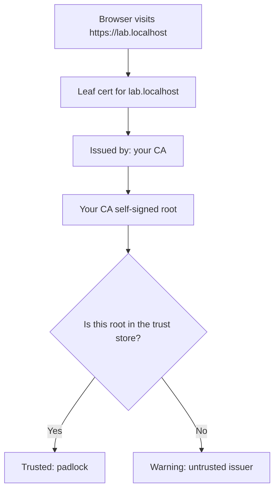

# Lab 8.2: Build Your Own CA

**Month:** 8 (Cryptography and PKI) · **Pattern family:** Cryptography and PKI · **Time budget:** 14 to 16 hours (across multiple sessions; do not attempt in one sitting) · **Lab attempt floor:** multi-hour (3 hours of genuine effort before any walkthrough-style hint) · **AI guidance:** Restricted. AI may explain a PKI concept in plain language; AI may not choose your configuration, tell you whether your setup is secure, or write your OpenSSL commands. See "AI guidance for this lab" below. · **Prerequisites:** Month 8 README read, including the private-repository note. Lab 8.1 complete. Comfort at the command line (Months 1 and 2). A browser you can inspect certificate warnings in. OpenSSL installed (confirm with `openssl version`).

## Why this lab exists

You have trusted certificate authorities your whole computing life without ever seeing what one does. Every padlock in your browser is the end of a chain that starts at a root CA your operating system trusts on your behalf. This lab puts you on the other side of that relationship. You become a tiny, local, private **certificate authority** (an organization, here just you, that signs certificates to vouch for identities). You issue a certificate. You watch your own browser decide whether to trust it. Doing this once, by hand, demystifies the entire public PKI. You will understand what a **root store** is, what a **chain of trust** is, what each field in an X.509 certificate asserts, and why the public CAs are built the way they are.

The second half of the lab is where the real learning lives. You will deliberately break your certificate three ways and watch the browser react. A working certificate teaches you the happy path. Three broken ones teach you the validation rules, because each browser error is the browser telling you exactly which rule you broke. Reconciling the error to the rule is the skill.

**Recall first, from memory, before you read on:** in Lab 8.1 you converted data between bytes, hex, and Base64. A certificate's `-----BEGIN CERTIFICATE-----` block is Base64 around binary. Given that, what do you predict OpenSSL must do to show you a certificate in plain English? (Hold your answer; you will run exactly that command in Task 2.)

## The scope rule and the private-repository rule, both first

**Scope.** Everything in this lab happens on hardware you own: your own machine, a local web server bound to `localhost` or a name you control in your own `hosts` file, and your own browser. You add your own test root CA only to your own machine's trust store, and you remove it when the lab is done. You do not install your CA on anyone else's machine, you do not serve this to the public internet, and you do not point any of this at a system you do not own. A private CA is a powerful trust anchor; treat it with the seriousness `SAFETY.md` demands.

**Private repository.** This lab generates private keys: the CA's private key and the server's private key. A **private key** is the secret half of a keypair; anyone who has it can impersonate its owner. Private keys never enter a public repository, ever, not even for a throwaway lab CA. All work for this lab lives in a **private** repository (or a private subdirectory you will never push public). Before you generate a single key, create a `.gitignore` that excludes `*.key`, private `*.pem` files, and any key material, and confirm it works. A private key in public git history is the single most common catastrophic mistake in this domain. You build the habit of never doing it here, on a key that does not matter.

## Learning objectives

By the end of this lab, you can:

- **Explain** the chain of trust from a leaf certificate up to a trusted root, and **identify** each link in a chain you are shown.
- **Generate** a root CA keypair and self-signed root certificate, and **explain** what "self-signed" means and why a root must be.
- **Produce** a certificate signing request (CSR) for a server, sign it with your CA, and **explain** what the CA is attesting to when it signs.
- **Read** every major field of an X.509 certificate (subject, issuer, validity, public key, SAN, key usage, basic constraints) and **explain** what each asserts.
- **Serve** HTTPS locally from your issued certificate, get your own browser to trust it, and **explain** the trust decision the browser made.
- **Analyze** three deliberate misconfigurations by the browser's reaction, and **reconcile** each reaction with the validation rule (RFC 5280) it broke.

## Recognition cue

When you next see a certificate warning, a chain in a browser's certificate viewer, or a `-----BEGIN CERTIFICATE-----` block in a config file, you reach for the model this lab builds: who issued this, who do they chain up to, is that root trusted, and does every field (hostname, validity, basic constraints) check out. When a future month, or a real job, asks "why is the browser refusing this site," you recognize that the answer is one of a small set of validation rules being broken, and you know how to find which one.

## The chain of trust, in a picture

Hold this before you build. Your browser walks from the site's certificate up to a root it already trusts. Every link must check out.


*Notice: the leaf points to its issuer, and the chain ends at a root. The whole trust decision hinges on whether that final root is one your machine already trusts. Adding your root to the trust store is what flips this from warning to padlock.*

## AI guidance for this lab

**Allowed.** Asking AI to explain a PKI concept in plain language with no specifics of your setup: "explain what a certificate signing request is, in plain terms," "what does the basicConstraints extension assert," "in everyday language, why does a browser distrust a self-signed certificate." You then verify the explanation against RFC 5280 or the OpenSSL documentation, and you make every configuration decision yourself.

**Not allowed.** Asking AI to write your OpenSSL commands or configuration file. Asking AI whether your CA setup is secure or correctly configured (it cannot reliably tell you, and a confidently wrong answer here teaches you the wrong thing). Pasting your private keys or your full configuration into any AI tool. Asking AI which extensions or key sizes to use; that decision, and understanding it, is the lab.

**The reason.** OpenSSL's command surface is exactly the kind of thing AI generates fluently and subtly wrong: a flag in the wrong place, an extension omitted, a deprecated option, a config stanza that "works" but is insecure. If AI writes the commands, you learn OpenSSL's syntax not at all and the trust model not much. The struggle with the man pages is where the understanding forms.

**Logged.** Your AI Provenance section records any plain-language concept questions, the primary source you checked each answer against, and the explicit statement that the configuration and commands were your own.

## Tasks

Do these in order. Tasks 1 through 3 build a working CA and served site; Task 4 deliberately breaks it three ways. Do not skip to Task 4; you cannot break a thing you have not built.

### Task 1: Pre-flight and the PKI mental model (90 minutes)

Before you run OpenSSL, write the model down. In your notebook, answer in your own words: what is a certificate authority; what is the difference between a root CA and an intermediate CA; what does it mean for a certificate to be "signed by" a CA; what is the chain of trust and where does it terminate; and what is in a root store. Read the relevant sections of RFC 5280 for the authoritative definitions of the fields you are about to generate.

Then write the pre-flight check for OpenSSL specifically: what `openssl` does (a toolkit that generates keys, creates and signs certificates, and inspects them), what artifacts it leaves on your system (private keys, certificates, a CA database and serial file if you use the `ca` workflow), what could go wrong (a leaked private key; a CA you forget to remove from your trust store), and the authorization scope (your own machine only).

**Checkpoint:** your notebook has the five PKI-model answers in your own words, each citing where in RFC 5280 (or another primary source) you confirmed it, plus the OpenSSL pre-flight check.
**If not:** if an answer is a definition you cannot trace to the RFC, you are paraphrasing from memory or AI; open RFC 5280 and find the section. The floor applies to this task: sit with the model for the full time before touching the tool.

### Task 2: Learn to generate and read a certificate (gradual release)

The new skill of this lab is producing a certificate with OpenSSL and reading every field of it. You will learn it in three stages. Stage 1 and Stage 2 use a **throwaway teaching certificate** that is not your CA, not your server certificate, and never gets served or broken. Stage 3 is the graded work: your actual root CA and server certificate, which this file deliberately does not hand you. Type everything yourself.

#### Stage 1 - Worked example (I do)

Make a scratch directory outside your repo (so nothing here is ever committed). Generate a throwaway keypair and a self-signed certificate for a made-up name `demo.example`, then read it. This certificate is purely for learning the moves.

```zsh
mkdir -p ~/scratch-cert && cd ~/scratch-cert

# 1. Generate a private key (RSA 2048 here, just for the demo).
openssl genpkey -algorithm RSA -pkeyopt rsa_keygen_bits:2048 -out demo.key

# 2. Make a self-signed certificate from that key, valid 1 day, for demo.example.
openssl req -x509 -new -key demo.key -days 1 -subj "/CN=demo.example" -out demo.crt

# 3. Read the certificate in human-readable text.
openssl x509 -in demo.crt -noout -text
```

Line by line: `genpkey` makes the private key. `req -x509` makes a certificate request and, because of `-x509`, immediately self-signs it into a finished certificate; `-subj "/CN=demo.example"` fills in the subject so the command does not stop to ask you; `-days 1` sets the validity. `x509 ... -text` decodes the Base64 certificate and prints every field in plain English. Read the output. Find the **subject** and the **issuer** and notice they are identical: that is what **self-signed** means, the certificate vouches for itself.

**Checkpoint:** the third command prints a certificate where Subject and Issuer both show `CN=demo.example`, with a Validity window starting today.
**If not:** if `req` complains it cannot find a config or prompts you for fields, your `-subj` string may be mistyped; it must start with `/` and use `/CN=name`. If `x509 -text` errors, confirm step 2 actually wrote `demo.crt` (run `ls`).

Now delete the scratch directory so it never leaks into anything: `cd ~ && rm -rf ~/scratch-cert`. You have the moves; the real CA is next.

#### Stage 2 - Faded practice (we do)

Still in a throwaway scratch directory, produce a self-signed certificate that actually **declares itself a CA**, which a real root must. This is one step closer to Task 3's real root, but it is still a teaching certificate you will delete. Fill the TODOs from the OpenSSL manual pages; the goals tell you what each blank must achieve.

```zsh
mkdir -p ~/scratch-ca && cd ~/scratch-ca

# Generate the key (you did this exact move in Stage 1):
openssl genpkey -algorithm RSA -pkeyopt rsa_keygen_bits:2048 -out testroot.key

# Self-sign a certificate that says "I am a CA".
# TODO: build an `openssl req -x509` command that:
#   - uses testroot.key
#   - sets a subject like "/CN=Scratch Test Root DO NOT TRUST"
#   - adds the basicConstraints extension with CA:TRUE  (read `man openssl-req`
#     and the docs on how to add an extension; the goal is a cert that is allowed
#     to act as a CA)
#   - writes testroot.crt

# Read it back and confirm:
openssl x509 -in testroot.crt -noout -text
```

The new piece versus Stage 1 is the `basicConstraints` extension with `CA:TRUE`. A leaf certificate must **not** have this; a CA certificate must. Find how to attach it from the manual page, not from a recipe site.

**Checkpoint:** `x509 -text` on `testroot.crt` shows a `Basic Constraints` extension with `CA:TRUE`.
**If not:** if `CA:TRUE` is missing, your extension was not attached; OpenSSL has more than one way to add extensions (an `-addext` option, or a config section referenced by `-extensions`). Read the `openssl-req` page for the one your version supports, and confirm with `x509 -text`. Delete this scratch directory when done: `cd ~ && rm -rf ~/scratch-ca`.

#### Stage 3 - Independent (you do)

No scaffolding now, and from here you work in your **private** lab repository, not a scratch directory. Build the real thing yourself, assembling each command from the OpenSSL manual pages.

1. **Generate your root CA:** a private key and a self-signed root certificate that declares itself a CA (`basicConstraints` `CA:TRUE`), with a clearly labelled subject like "Vigil Lab Test Root, DO NOT TRUST IN PRODUCTION." Inspect it with `x509 -text`. Confirm subject equals issuer and `CA:TRUE` is present.
2. **Issue a server certificate:** a separate private key for a local server name (for example `lab.localhost` or an entry in your own `hosts` file), a CSR for it, and a server certificate produced by signing that CSR with your CA from step 1. Two things you must get right, because Task 4 will break them on purpose: the certificate's **SAN** (subject alternative name) must include the exact hostname you will serve (modern browsers ignore the legacy common-name field for hostname matching and require the SAN), and the **validity period** must be current. Inspect the finished certificate: confirm the issuer is now your CA, not the server itself, and the SAN contains your hostname.

The man pages you need: `man openssl`, then `openssl-genpkey` (or `openssl-genrsa`), `openssl-req`, `openssl-x509` (or `openssl-ca`), and the docs for attaching a SAN extension. The reading is the work.

**Checkpoint:** in your private repo you have a root CA key and self-signed root certificate (subject equals issuer, `CA:TRUE`), and a server key, CSR, and signed server certificate whose issuer is your CA and whose SAN holds your serving hostname. Your notebook has the annotated `x509 -text` dumps of both, plus one sentence on what your CA attested to by signing the CSR.
**If not:** if signing the CSR produces a certificate whose issuer is still the server, you self-signed it instead of signing it with the CA; the signing command must reference the CA key and CA certificate. If the SAN is empty, the extension did not attach to the issued certificate (it must be present at signing time, not only in the CSR). Re-read the signing section of the man page.

### Task 3: Serve HTTPS and earn the browser's trust (2 hours)

Stand up a minimal local HTTPS server using your server certificate and key. You may use any local server you are comfortable with (Python's built-in HTTPS-capable server, a small Flask or Express app from Month 7, or OpenSSL's own `s_server` for a quick test). Bind it to localhost or your chosen local hostname.

Visit it in your browser. It will be distrusted at first, because your CA is not in any root store. Then add **your CA's root certificate** (not the server certificate) to your own machine's trust store, restart the browser, and visit again. It should now show a valid, trusted connection.

Inspect the certificate through the browser's certificate viewer (every browser has one behind the padlock or the warning). Confirm the chain the browser shows: your server certificate, issued by your root CA, which the browser now trusts.

**Checkpoint:** before adding the root, the browser warns; after adding your CA root and restarting, the browser shows a trusted padlock, and the certificate viewer shows the chain (leaf issued by your CA).
**If not:** if it still warns after adding the root, you may have added the server certificate instead of the CA root (add the CA root), or the browser caches trust and needs a full restart. If the page does not load at all, your server is not bound to the hostname in the SAN; serve on exactly the name in the certificate.

### Task 4: Break it three ways and observe (3 to 4 hours)

This is the core of the lab. You will deliberately misconfigure your certificate in three distinct ways, one at a time, and document exactly how the browser reacts to each. Restore the working configuration between each one so you test a single fault at a time. Keep your working files from Tasks 2 and 3 so you can revert cleanly.

The three misconfigurations to produce and observe:

1. **Hostname mismatch.** Issue (or re-issue) a server certificate whose SAN does not match the hostname you serve it on. Serve it, visit it, and capture the browser's reaction. Reconcile the exact error to the RFC 5280 rule it reflects.
2. **Expired certificate.** Produce a server certificate whose validity period is in the past (OpenSSL lets you set the not-before and not-after dates, or use a very short validity that you let lapse). Serve it, visit it, and capture the reaction.
3. **Untrusted or broken chain.** Serve the working server certificate but with your CA root **removed** from the trust store (the original "untrusted issuer" state), or serve a certificate signed by a CA whose `basicConstraints` does not permit it to act as a CA. Capture the reaction. Be explicit about which of these two you chose and why it breaks.

For each of the three, your notebook records: what exactly you changed, the precise browser error (text and, ideally, a screenshot), which validation rule was broken, and how a real attacker exploiting that exact gap (a wrong-host cert, an unexpired-looking but actually-expired cert, a self-issued cert with no real CA behind it) would be stopped by the browser doing its job.

**Checkpoint:** three documented misconfigurations, each with the change made, the browser's reaction (screenshot plus error text), the specific validation rule broken, and the security reasoning.
**If not:** if a browser shows the same generic error for two different faults, dig into the warning's detail (most browsers have an "advanced" or "details" expander naming the specific reason). If a fault does not trigger any warning, you likely did not actually change what you think; confirm the broken state with `openssl x509 -text` or `openssl verify` before blaming the browser.

### Task 5: Tear down and notebook entry with AI Provenance (90 minutes)

First, tear down safely: **remove your test CA root from your machine's trust store.** A test root left trusted is a real risk; if its key ever leaked, anything signed by it would be trusted by your machine. Confirm the removal. Stop your local server.

Then write `.tutor/notebook/lab-02-build-your-own-ca.md`. Required sections:

- **Pre-flight check** (from Task 1).
- **Concept naming.** What did this lab teach? Name the trust-model and X.509 concepts, not "how to use OpenSSL."
- **Evidence.** The annotated certificate dumps, the browser-trust screenshots, and the three misconfiguration writeups with their screenshots. Reference the private repository where the (keys-excluded) artifacts live; do not paste private keys anywhere.
- **Five-question debrief.** All five. The fourth (what failure mode would have broken your first attempt) is well served by the SAN-versus-common-name surprise.
- **AI Provenance.** All five standard elements: which AI tool (if any); what you asked (plain-language PKI concept questions only, no configuration, no keys); what was generated (an explanation only, or "nothing"); what verification you performed (the RFC 5280 section or OpenSSL doc you checked it against); and what you discarded (often "n/a"). Plus the explicit statement that all configuration and commands were your own.

**Checkpoint:** the entry is committed with all sections, it confirms the test CA was removed from the trust store, and your private repository holds the CA and certs with no private keys in any history.
**If not:** if `git status` (or a history scan) shows a `.key` or private `.pem` tracked, stop and fix it before committing; a leaked key fails the deliverable. If you forgot which command removes a trust-store root on your OS, check your OS keychain or trust-store documentation and verify the root is gone afterward.

## Definition of Done

You are done when all of these are true:

- A working CA-issued certificate served a trusted local HTTPS site (Tasks 2 and 3).
- The three misconfigurations are each documented with the browser reaction and the rule it broke (Task 4).
- The test CA has been removed from your trust store, and your local server is stopped (Task 5).
- The notebook entry is committed with all sections and an honest AI Provenance section.
- A private repository holds the CA, the server certificate, and the three misconfigurations, with no private key in any history, guarded by a `.gitignore`.

Self-verify your certificate's structure with this one-liner (run it on your server certificate; it should print the SAN you set, not nothing):

```zsh
openssl x509 -in server.crt -noout -ext subjectAltName
```

**Self-explain:** in one sentence, why does adding your CA's root certificate (not the server certificate) to the trust store flip the browser from warning to padlock?

## Stretch goals

1. Add an **intermediate CA**: have your root sign an intermediate, and have the intermediate sign the server certificate, so the chain is three deep. Serve the leaf with the intermediate, and explain why the server must send the intermediate but not the root.
2. Use `openssl verify -CAfile` to validate your server certificate against your CA from the command line, and compare what it reports to what the browser said.
3. Set up OCSP or a CRL conceptually: write a short note (no implementation) on how your CA would tell the world a certificate is revoked before it expires, and why revocation is the hard part of PKI (RFC 6960).
4. Re-issue the server certificate with an elliptic-curve key instead of RSA, inspect the difference in the `x509 -text` output, and note in one sentence why the key is so much shorter for similar security.

## Troubleshooting

- **Server certificate rejected for a SAN problem even though the name looks right.** You put the name only in the common-name field; modern browsers require the SAN. Re-issue with the SAN set. This is a feature of the lab; meet it in Task 2 so it does not surprise you in Task 4.
- **A `.pem` or `.key` shows up in `git status`.** Your `.gitignore` is not catching it, or you forced it in. Never commit private keys. Fix the ignore rule and confirm with `git status` before every commit.
- **OpenSSL error messages are terse.** Read the manual page for the exact subcommand rather than guessing or pasting the error into an AI tool. The man page almost always explains the option you got wrong.
- **Forgot to remove the test CA from the trust store.** Set a reminder now. A trusted test root is a standing risk; confirm it is gone at the end.
- **Two faults at once in Task 4.** An expired certificate that also has a SAN mismatch teaches you nothing clean. Change one fault at a time, or you cannot attribute the browser's reaction to a single rule.

## Time budget breakdown

- Task 1: 90 minutes
- Task 2: 4 to 5 hours (Stage 1 ~30 min, Stage 2 ~60 min, Stage 3 the rest)
- Task 3: 2 hours
- Task 4: 3 to 4 hours (the core; budget generously)
- Task 5: 90 minutes
- Buffer for OpenSSL syntax and trust-store friction: 1 to 2 hours

Total: 14 to 16 hours. OpenSSL friction is real; if you are stuck on a single command for more than thirty minutes, that is a signal to slow down and read the manual page line by line, not to reach for an AI shortcut that would skip the learning.

## Resources

Primary sources. OpenSSL's own documentation and the relevant RFC; no copy-paste recipe sites.

- `man openssl` and the per-subcommand manual pages: `openssl-genpkey` (or `openssl-genrsa`), `openssl-req`, `openssl-x509`, `openssl-ca`, `openssl-verify`, and `openssl-s_server`. These are the authoritative reference for every command you will run.
- The OpenSSL project documentation online, which mirrors and expands the manual pages, including how to attach extensions such as the subject alternative name.
- _RFC 5280_, "Internet X.509 Public Key Infrastructure Certificate and CRL Profile," the primary source for what each certificate field means and how chain validation works. Read at least the sections on certificate fields and on basic path validation.
- _RFC 6960_, "Online Certificate Status Protocol (OCSP)," for the revocation concepts referenced in the month's reading.
- Your browser's certificate-viewer documentation (each browser documents how to inspect a site's certificate and manage trusted roots).
