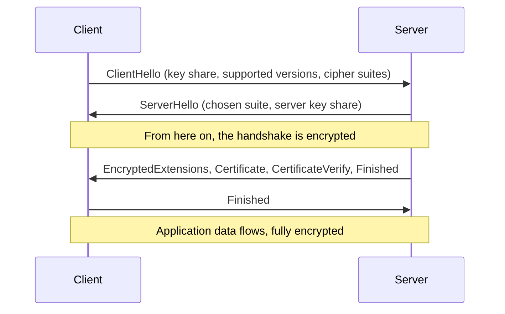

# Lab 8.3: TLS Handshake Annotation

**Month:** 8 (Cryptography and PKI) · **Pattern family:** Cryptography and PKI · **Time budget:** 10 to 12 hours (across multiple sessions) · **Lab attempt floor:** 90 minutes · **AI guidance:** Restricted. AI may explain a TLS concept in plain language; AI may not annotate your capture, identify the messages, or interpret the cryptographic exchange. See "AI guidance for this lab" below. · **Prerequisites:** Month 8 README read. Labs 8.1 and 8.2 complete. Wireshark installed, with a refresher (Month 4). The TCP three-way handshake is reflexive for you (Months 3 and 4). You have read, or are reading alongside this lab, RFC 8446's handshake section.

## Why this lab exists

This is the lab the whole month points at, and its output is the month's deliverable. You have built the pieces. You know symmetric and asymmetric crypto, hashing and signatures, certificates and chains of trust. **TLS** (transport layer security) is where all of them assemble into the protocol that secures the modern web. Annotating a real TLS 1.3 handshake, message by message, with the actual bytes in front of you in Wireshark, is what turns "I read about TLS" into "I can explain exactly what these two machines said to each other and why."

You will capture a genuine handshake from your own browser and decrypt it. TLS 1.3's forward secrecy means you cannot decrypt it with a server's private key, so you will use the **key log file** mechanism the TLS libraries provide for exactly this purpose: the library writes the per-session secrets to a file, and Wireshark reads that file to unlock the capture. Then you walk every message: what it is, what it carries, what cryptographic decision it represents, and how it differs from the older TLS 1.2 handshake it replaced. The contrast is not decoration. Understanding why TLS 1.3 collapsed two round trips into one, encrypted the certificate, and made forward secrecy mandatory is understanding the last decade of TLS security engineering.

**Recall first, from memory, before you read on:** in Month 4 you watched a TCP three-way handshake in Wireshark. TLS rides on top of TCP. So in your capture, before any TLS message appears, what three packets must you see first? (Hold your answer; finding the SYN, SYN-ACK, ACK and then the first TLS message is how you locate the start of the handshake.)

## The scope rule, first

You capture **your own** traffic, from **your own** browser, on **your own** machine, to servers you connect to as an ordinary client (visiting a normal public website over HTTPS, the way you would any day). That is your traffic on your hardware; capturing it for analysis is within scope. What is not in scope: capturing traffic that is not yours (anyone else's machine, a shared network's other users, a workplace network). And per `AI-ETHICS.md`, a capture of real traffic on a real network is exactly the kind of thing you do not paste into a public AI service, even your own; you analyze it locally. To keep the capture clean and uncontroversial, prefer a deliberate connection you start to a well-known public site, on a network that is yours, with nothing sensitive in flight.

## Learning objectives

By the end of this lab, you can:

- **Configure** a TLS key log file and use it to decrypt a TLS 1.3 session you captured, and **explain** why this is necessary when the older server-private-key method no longer works.
- **Identify and annotate** every message in a TLS 1.3 handshake (ClientHello, ServerHello, the encrypted extensions and certificate flight, Finished) and **explain** what each carries and decides.
- **Explain** the key exchange: what is agreed, by what mechanism (ephemeral Diffie-Hellman over a named group), and why it provides forward secrecy.
- **Contrast** the TLS 1.3 handshake with the TLS 1.2 handshake message for message, and **explain** the specific reasons for the major changes.
- **Produce** a written, message-by-message annotation of a real handshake that a peer one month behind you could follow: the month's deliverable.

## Recognition cue

When a later month shows you encrypted traffic, a cipher-suite string, or a packet capture that starts with a ClientHello, you reach for the map this lab builds: which message is this, what does it carry, what has been agreed so far, and from which point on is the conversation encrypted. When someone claims a connection is "secure," you recognize that the claim resolves to specific, checkable handshake decisions (the version, the key exchange, forward secrecy) rather than a vibe.

## The TLS 1.3 handshake, in a picture

This is the standard TLS 1.3 message sequence from RFC 8446. Hold it before you capture; you will match real packets against it. It is the public shape of the protocol, not your specific capture (which you read yourself).


*Notice: the certificate arrives after the encryption switch, so in TLS 1.3 it is encrypted. That is one of the main changes from 1.2, where the certificate is sent in the clear.*

## AI guidance for this lab

**Allowed.** Asking AI to explain a TLS concept in plain language with no capture data in the prompt: "explain what forward secrecy means in plain terms," "in everyday language, what is the ClientHello for," "what does it mean that TLS 1.3 has a one-round-trip handshake." You then verify every claim against RFC 8446 (for 1.3) or RFC 5246 (for 1.2) before you write it down, because the message order and contents are exactly what AI gets confidently wrong.

**Not allowed.** Pasting your capture, a packet hex dump, or your key log file into any AI tool. Asking AI to identify which message a packet is, to annotate the handshake, or to interpret the cryptographic exchange in your capture. Asking AI "is this the ServerHello" about a packet you are looking at. The annotation is the deliverable and it must be your own reading of the bytes against the RFC.

**The reason, specific to TLS.** The TLS handshake is a sequence with a precise order and precise contents, and it changed materially between 1.2 and 1.3. This is exactly the kind of structured, version-sensitive detail where AI scrambles the order, attributes a 1.2 message to 1.3, or invents an extension. The RFC is the ground truth. If you let AI annotate the capture, you will write down its errors as if they were your observations, and the verification ritual will find them.

**Logged.** Your AI Provenance section lists any plain-language concept questions, the RFC section you verified each against, and the explicit statement that the capture, decryption, and annotation were entirely your own.

## Tasks

Do these in order. Tasks 1 and 2 produce and decrypt the capture; Task 3 teaches the annotation method; Task 4 is the deliverable.

### Task 1: Pre-flight and the handshake on paper (2 hours)

Before you capture anything, learn the TLS 1.3 handshake from the primary source. Read RFC 8446's handshake protocol section. On paper (or in your notebook), draw the message sequence: client to server, then server to client, naming each message and what it carries. Do the same for TLS 1.2 from RFC 5246, so you have both sequences side by side before you see real bytes. Note that RFC 8446 obsoletes RFC 5246, but 5246 remains the definitive specification of the 1.2 handshake you contrast against.

Write the pre-flight check for Wireshark's TLS decryption: what the key log file mechanism does (the TLS library writes the per-session secrets to a file as it negotiates them, and Wireshark reads that file to decrypt the capture), what artifacts it leaves (a file containing session secrets; treat it as sensitive and delete it after), what could go wrong (capturing or analyzing traffic that is not yours; leaving a secrets file lying around), and the authorization scope (your own traffic on your own machine only).

**Checkpoint:** your notebook has two hand-drawn handshake diagrams (1.3 and 1.2), each message named from the RFC, plus the Wireshark TLS-decryption pre-flight check.
**If not:** if you cannot name a message from the RFC, you are working from memory or a summary; open RFC 8446 to the handshake section and read the message names there. The floor applies: do the reading and the diagrams before touching Wireshark.

### Task 2: Capture and decrypt a real TLS 1.3 handshake (3 hours)

These are mechanical setup steps; do them in order.

1. Set the `SSLKEYLOGFILE` environment variable to a path you control, then launch the client (browser or `curl`) from that same environment so its TLS library writes secrets there. The Wireshark TLS wiki documents which clients support this.
2. Start a Wireshark capture on the interface your traffic will use.
3. Make a single, clean HTTPS connection to a well-known public site you chose, on your own network.
4. Stop the capture. Save the pcap. You now have a capture and a key log file for the same session.
5. In Wireshark, point the TLS protocol preference at your key log file (Edit, then Preferences, then Protocols, then TLS, then the "(Pre)-Master-Secret log filename" setting) and reload the capture.
6. Confirm the negotiated version is TLS 1.3 (check the ServerHello's chosen version, or the connection's negotiated version). If you only got 1.2, adjust your client or target and recapture until you have a genuine 1.3 handshake. Keep any 1.2 capture; it is useful for the Task 4 contrast.

**Checkpoint:** a decrypted capture in Wireshark where the handshake messages are fully dissected, the negotiated version is confirmed as TLS 1.3, and the previously opaque application data is now readable. A screenshot of the decrypted handshake in the packet list.
**If not:** if the session stays opaque, the order was wrong (set `SSLKEYLOGFILE`, then launch the client, then capture) or Wireshark points at the wrong file path; fix the order or the path and reload. If only 1.2 negotiated, pick a target known to prefer 1.3 and recapture.

### Task 3: Learn to annotate a message (gradual release)

The new skill of this lab is reading one handshake message in Wireshark, matching its fields to the RFC, and writing a clear annotation. You will learn the method on **one message type, the ClientHello, treated generically against the RFC**, then fade, then annotate your own full capture independently. This file models the method, never your specific capture; your capture is yours to read.

#### Stage 1 - Worked example (I do)

Here is a complete, annotated model for one message, the **ClientHello**, written from RFC 8446 (not from any specific capture). Study how each claim ties to a field and to the RFC, and how it stays plain.

> **ClientHello.** This is the first handshake message; the client sends it to open the conversation. It carries: a list of **cipher suites** the client supports (the combinations of encryption and hashing it can use), a **supported_versions** extension listing the TLS versions it offers (this is how a client says "I can do 1.3"), a **supported_groups** extension naming the key-exchange groups it knows, and a **key_share** extension holding the client's ephemeral public key for one or more of those groups. The cryptographic decision it represents: the client is starting an ephemeral Diffie-Hellman key exchange and proposing the terms. Source: RFC 8446, the ClientHello definition and its extensions. In Wireshark, expand the ClientHello node and you will see each of these as a labelled sub-field.

Notice the shape of a good annotation: name the message and its job in one line, list what it carries (tied to named fields), state the cryptographic decision, and cite the RFC. That four-part shape is the method. You will reuse it for every message.

**Checkpoint:** in your own Wireshark capture, you can point at the real ClientHello and find each field the model names (cipher suites, supported_versions, supported_groups, key_share).
**If not:** if you cannot find `key_share` or `supported_versions`, you may be looking at a TLS 1.2 ClientHello (which lacks the 1.3 extensions) or a different packet; confirm you are on the ClientHello of your confirmed-1.3 session, and expand the Extensions node fully.

#### Stage 2 - Faded practice (we do)

Now you write the annotation for the **ServerHello** yourself, using the same four-part shape and the RFC. The skeleton below marks what each part must cover; you fill it in from RFC 8446 and what you see in Wireshark. This is still the method-practice message; Task 4 is where you annotate the whole capture as the deliverable.

```
ServerHello annotation (fill from RFC 8446 + your Wireshark dissection):
- What it is / its job:  TODO (one line: who sends it, when, why)
- What it carries:       TODO (name the fields: the chosen cipher suite,
                         the server's key_share, the selected version)
- Cryptographic decision it represents:
                         TODO (what has now been decided about the key exchange
                         and the cipher; and note the point after which the rest
                         of the handshake is encrypted)
- Source:                TODO (the RFC 8446 section you used)
```

You wrote nothing new about the *method* here; you applied the Stage 1 shape to a second message. That is the point.

**Checkpoint:** a four-part ServerHello annotation in your notebook, each part filled, the "encrypted from here" point noted, and a cited RFC section.
**If not:** if you cannot state the cryptographic decision, re-read what a `key_share` is: the ServerHello's key share is the server's half of the ephemeral Diffie-Hellman exchange, and combined with the client's half it lets both sides derive the same secret. If you wrote the certificate appears next in the clear, recall that in 1.3 it is encrypted; that is the defining change.

#### Stage 3 - Independent (you do)

No scaffolding now. Click through your decrypted capture and annotate **every** TLS 1.3 handshake message, in order, using the four-part shape, each claim tied to what you see and to the RFC. At minimum cover:

- The **ClientHello** (cipher suites, key_share, supported_groups, supported_versions).
- The **ServerHello** (chosen cipher suite, server key_share), and the point after which the handshake is encrypted.
- The **encrypted handshake flight**: EncryptedExtensions, the server's Certificate (now encrypted, unlike 1.2), CertificateVerify, and the server Finished.
- The client **Finished**.

Write the annotations into your notebook first; Task 4 turns them into the polished deliverable. No AI interpretation; your reading of the bytes against the RFC.

**Checkpoint:** notebook annotations for every message above, in your own words, each tied to what you actually see in the Wireshark dissection and cited to the RFC.
**If not:** if you cannot find the Certificate in the cleartext, that is expected in 1.3; it is inside the encrypted flight, visible only because your key log file decrypted it. If a message is missing entirely, your capture may be incomplete; recapture a clean single connection.

### Task 4: Write the deliverable annotation (3 hours)

Turn your Task 3 notes into `tls-handshake-annotated.md`, the month's deliverable: a clean, message-by-message walkthrough of your captured TLS 1.3 handshake, written so a peer one month behind you could follow it. For each message, state what it is, what it carries (with reference to the actual values you observed; redact nothing, because there is nothing sensitive in a handshake to a public site you chose), and what it accomplishes in the protocol. Include a section contrasting this with the TLS 1.2 handshake: which messages differ, why TLS 1.3 needs fewer round trips, why the certificate is now encrypted, and why forward secrecy is mandatory.

The full specification for this deliverable, including what may be shown publicly and what stays in the private repository, is in `../../deliverable.md`. Read it before you write.

**Checkpoint:** a complete `tls-handshake-annotated.md` meeting the deliverable specification: every TLS 1.3 handshake message annotated, the 1.2 contrast present, every claim traceable to the RFC or to what you observed in your own capture.
**If not:** if a claim is not traceable to your capture or the RFC, cut it; a confident wrong sentence is worse than a plain correct one in a crypto deliverable. If the 1.2 contrast is thin, use your Task 1 1.2 diagram and RFC 5246 to name the specific message differences.

### Task 5: Clean up and notebook entry with AI Provenance (60 minutes)

Delete the key log file (it contains session secrets). Then write `.tutor/notebook/lab-03-tls-handshake-annotation.md`. Required sections:

- **Pre-flight check** (from Task 1).
- **Concept naming.** Name the TLS and forward-secrecy concepts, not "how to use Wireshark."
- **Evidence.** The decrypted-capture screenshot, your per-message annotations, and a reference to the `tls-handshake-annotated.md` deliverable. Confirm the key log file was deleted.
- **Five-question debrief.** All five.
- **AI Provenance.** All five standard elements: which AI tool (if any); what you asked (plain-language TLS concept questions only, no capture, no key log, no packet data); what was generated (an explanation only, or "nothing"); what verification you performed (the RFC 8446 or RFC 5246 section you checked it against); and what you discarded (often "n/a"). Plus the explicit statement that the capture, decryption, and annotation were your own.

**Checkpoint:** the entry is committed with all sections, it confirms the key log file was deleted, and the `tls-handshake-annotated.md` deliverable is complete.
**If not:** if the key log file is still on disk, delete it now; it decrypts your capture and is sensitive. If a debrief answer is a one-liner, expand it; the gate rejects thin debriefs.

## Definition of Done

You are done when all of these are true:

- A decrypted TLS 1.3 capture in Wireshark, version confirmed, handshake fully dissected.
- Notebook annotations for every handshake message, in your own words, tied to the RFC and your capture.
- `tls-handshake-annotated.md` complete, with the TLS 1.2 contrast, every claim traceable.
- The key log file deleted.
- The notebook entry committed with all sections and an honest AI Provenance section.

Self-verify the capture has a TLS 1.3 handshake with this Wireshark display filter (it should isolate the ClientHello and ServerHello of your session):

```
tls.handshake.type == 1 || tls.handshake.type == 2
```

**Self-explain:** in one sentence, why can you not decrypt a TLS 1.3 session with the server's long-term private key, and what does that fact have to do with forward secrecy?

## Stretch goals

1. Capture a TLS 1.2 handshake on purpose (a client or site that prefers 1.2) and annotate it with the same four-part shape, so your contrast section is grounded in two real captures, not one real and one from the RFC.
2. In your 1.3 capture, find the cipher suite that was negotiated and look it up in RFC 8446's registry; write one sentence on what the suite name tells you (the encryption and the hash).
3. Use Wireshark's "Follow TLS Stream" on the decrypted session and confirm that the application data really is readable now, then explain in one sentence what the key log file gave you that the certificate alone could not.
4. Read the part of RFC 8446 on 0-RTT (early data) and write a short note on why it is faster and what security trade it makes, without capturing it.

## Troubleshooting

- **Session stays opaque after pointing Wireshark at the key log.** The order was wrong or the path is wrong. Set `SSLKEYLOGFILE`, then launch the client, then capture; confirm Wireshark's TLS preference points at that exact file, and reload.
- **Only TLS 1.2 negotiated.** Many clients and servers support both. Pick a target known to prefer 1.3, or adjust your client, and recapture. Confirm the version before annotating.
- **Tempted to paste a packet into AI and ask "what is this."** Do not; that is the annotation, and it must be yours. The RFC and the Wireshark dissection together give you everything you need.
- **Looking for the certificate in the clear.** In TLS 1.3 it is encrypted, inside the flight after the ServerHello. Its absence from the cleartext is itself something to annotate.
- **Key log file left on disk.** Delete it; it contains the session secrets that decrypt your capture.

## Time budget breakdown

- Task 1: 2 hours
- Task 2: 3 hours
- Task 3: 2 hours (Stage 1 ~20 min, Stage 2 ~40 min, Stage 3 the rest)
- Task 4: 3 hours
- Task 5: 60 minutes
- Buffer for recapturing to get a clean 1.3 handshake: 1 to 2 hours

Total: 10 to 12 hours.

## Resources

Primary sources first. The RFC is the ground truth for the handshake; Wireshark's own wiki is the ground truth for the decryption mechanism.

- _RFC 8446_, "The Transport Layer Security (TLS) Protocol Version 1.3," specifically the handshake protocol section. This is the authoritative description of every message you annotate.
- _RFC 5246_, "The Transport Layer Security (TLS) Protocol Version 1.2." Obsoleted by RFC 8446, but the definitive specification of the 1.2 handshake you contrast against.
- The Wireshark TLS wiki page, the authoritative reference for the `SSLKEYLOGFILE` mechanism, which clients support it, and how to configure the (Pre)-Master-Secret log filename in Wireshark preferences.
- The Wireshark user guide section on display filters (reinforcing Month 4) for isolating the TLS handshake in your capture.
- Your own Month 4 PCAP notebook entries and your Month 7 notes on the start of HTTPS, for continuity.
