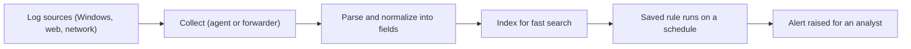

# Month 9: Defensive Operations (Blue Team)

**Pattern family:** Detection and response
**Time budget:** 55 hours
**AI guidance:** AI continues, in the **detection-rule drafting** pattern this month. You draft Sigma rules with AI. Then you validate them against real log sources and test them against negative cases yourself. Every AI-drafted rule carries a written analysis of what would make it fire when it should not. The AI Provenance log stays mandatory in every notebook entry, as it has been since Month 5.
**Prerequisites:** Months 1 to 8 complete. You can read logs and a packet capture (Months 2 and 4), build a small Python tool (Month 5), reason about Windows artifacts and Sysmon (Month 6), recognize web attacks (Month 7), and write basic SQL (Month 7, Week 1). That SQL matters more this month than you expect.

## Why this month exists

For eight months you have learned how systems work and how they break. This month you sit on the other side of the glass. You are the person watching the logs. You decide what is an attack and what is noise. You write the detections that decide what your future self even gets to see at 2 AM. This is what a **SOC analyst** (a Security Operations Center analyst, the person who watches alerts) and a **detection engineer** (the person who writes the rules that raise those alerts) do for a living. It is one of the most reliable ways into the field.

Two ideas anchor the month. The first: defense is built, not bought. A **SIEM** (Security Information and Event Management system, the tool that collects logs and runs searches on them) out of the box gives you a pile of logs and a search bar. The detections that catch a real intruder are the ones someone wrote, tuned, and tested. You will be that someone.

The second idea: the SIEM query languages you are about to learn are not new and strange. They are **SQL dialects** (the same query language from Month 7, with different syntax). If you can write a `SELECT ... WHERE ... GROUP BY` against the Month 7 sample data, you already understand the shape of a Splunk search and a KQL query. This month makes that link clear, then drills it until the three dialects feel like one language with three accents.

The work is unglamorous. It is also where breaches are caught or missed. A detection that fires fifty thousand times an hour is not a detection. It is an attack on the analyst's attention. A detection that never fires is worse, because it looks like coverage and is not. The craft sits in the middle: rules precise enough to trust, tough enough to survive real data volume, and documented well enough that the analyst at 2 AM knows what to do when one lights up.

Here is the pipeline at the center of the month. Every SIEM, free or paid, walks this path:


*Notice: the alert at the end is only as good as the rule at step E. The pipeline moves the data; you write the judgment.*

## Warm-Up: Retrieve Before You Begin

Answer from memory, no peeking, before you read on. This pulls forward the prior-month skills this month leans on.

1. From Month 7: write the shape of a SQL query that counts rows per group and keeps only groups above a threshold. Which clauses do the counting and the filtering?
2. From Month 6: what does Sysmon Event ID 1 record, and name two fields it gives you about a new process.
3. From Month 5: what is the drafting pattern, and who decides whether an AI draft is good enough to keep?
4. From Month 4: what does a packet capture show you that a text log does not?

<details><summary>Check your recall</summary>

1. `SELECT ... FROM ... WHERE ... GROUP BY ... HAVING ...`. `GROUP BY` with `COUNT(...)` does the counting; `HAVING` filters the groups. You will meet this exact shape again as `stats` and `summarize`. From Month 7, Week 1.
2. Process creation. Fields include the image (the program path), the command line, the parent image, and the user. You generated these in Month 6 with the SwiftOnSecurity config.
3. You write the spec and the tests, AI drafts, your tests decide. You decide, not the AI. Your name is on the work. From Month 5.
4. A capture shows the raw bytes on the wire: the handshake, the payload, the timing. A text log shows only what an application chose to write down. From Month 4.
</details>

## The two roles, and you build both

The field splits defensive work into two roles. The master curriculum requires you to inhabit each.

- **The detection engineer** writes rules. They think about log sources, field names, false-positive rates, and how an attack shows up in the data. Their product is a detection that survives contact with real data. Labs 9.1, 9.2, and 9.3 are detection-engineering work.
- **The alert consumer** (the SOC analyst, the triager) receives the alerts those rules raise. They decide, fast and under pressure, whether each one is a real incident. Their product is a verdict, and when the verdict is "incident," an investigation. Lab 9.4 is alert-consumer work, and the deliverable is the investigation writeup.

You will feel the difference by the end of the month. The engineer asks "what would make this fire when it should not?" The consumer asks "given that this fired, what happened?" The best defenders move between the two, because each role teaches you what the other one needs.

## Learning objectives

By the end of this month, you can:

- **Build** a working SIEM, route real log sources into it, and explain where each log is collected, parsed, and stored.
- **Distinguish** the log sources that carry detection value from the ones that are mostly volume, and defend the distinction.
- **Author** detection rules in Sigma, convert them to a running backend, and show they fire on the intended activity and stay quiet otherwise.
- **Explain** Splunk SPL and Microsoft KQL each as a dialect of the SQL you learned in Month 7, and read and write both.
- **Reconcile** a detection's behavior against real data volume: estimate its alert rate and tune it so it is usable, not just correct.
- **Analyze** an observed behavior with MITRE ATT&CK to name the techniques it might represent, and back.
- **Apply** the NIST SP 800-61 incident-response phases as a judgment framework, not a checklist, while investigating a simulated incident.
- **Produce** a professional incident-response report (executive summary, timeline, indicators of compromise, recommendations) that a manager and an engineer could both act on.
- **Defend**, for every AI-drafted detection rule, a written analysis of what would make it fire when it should not.

## Recognition cue

When you face a flood of events and need to ask a precise question of them, you reach for a SIEM query, and you write it the way you write SQL. When you notice an attacker behavior and want to know whether your environment would catch it, you reach for a detection rule and for ATT&CK to place the behavior. When an alert fires, you reach for the IR phases to structure your response instead of thrashing. This month builds all three reflexes.

## Core concepts to internalize

Read these to understand the labs, not to memorize them. Each chunk is one idea.

### What a SIEM actually is

A **SIEM** is a pipeline. It collects logs from many sources, parses them into fields, indexes them for fast search, and runs saved queries on a schedule to raise alerts. You saw the pipeline in the diagram above. Each stage is a real, running piece of software. The free SIEMs this month (Wazuh, Security Onion) let you point at each stage. Do not treat any stage as magic.

The hardest stage is **parsing and normalization**: turning raw log text into named fields. One source calls a field `src_ip`. Another calls the same thing `SourceAddress`. Making both searchable under one name is the central headache of the job, and it is why a rule can target a field your data does not actually have.

### Log sources that matter, and the ones that do not

> **Common misconception.** More logs mean better security, so collect everything you can.
> **Reality.** Collection is a budget, not a default. Every log you ingest costs storage and slows every search. Authentication logs, process-creation logs (Sysmon Event ID 1 from Month 6, Windows 4688), network connection logs, DNS query logs, and web or proxy logs carry most of the detection value. Verbose debug logs and high-volume telemetry with no security signal are cost without benefit. The skill is choosing what to collect, because you cannot afford everything and searching everything is slow.
>
> One caveat on Windows 4688: it carries the process command line only if you enabled command-line process auditing in Month 6. That field is off by default. Confirm your own 4688 events actually contain the command line before you build a rule that relies on it, or use Sysmon Event ID 1, which carries the command line once the SwiftOnSecurity config is in place.

### Building detections, not just reading alerts

A **detection** is a rule that encodes a hypothesis: "this specific pattern in these specific fields means this specific technique." Writing one forces you to know the technique, the data it leaves behind, and the benign activity that looks similar. This is the heart of the month, and it is the detection engineer's craft.

### Detection rules and production data volume

> **Heavy concept ahead.** Slow down here. This is the load-bearing idea of the month.

Every rule has a **false-positive rate**: how often it fires on activity that is not actually an attack. At real volume, a small rate is a large number. A rule that matches "PowerShell launched" fires constantly in a real network and is useless. A rule that matches "PowerShell launched as a child of Word, with an encoded command, by a non-administrative user" is a detection. Precision and the cost of an analyst's attention are design constraints, not afterthoughts. A rule is not finished when it fires on the attack. It is finished when you also know what else it fires on.

> **Common misconception.** A rule that fires on the attack is a working detection.
> **Reality.** A rule that fires on the attack and also on the nightly backup job, the vulnerability scanner, and every administrator is a pager everyone learns to ignore. The second question, "what legitimate activity also matches this?", is the senior judgment this month exists to build.

### IDS and IPS, in brief

An **IDS** (Intrusion Detection System) watches network traffic and raises an alert when a signature matches. An **IPS** (Intrusion Prevention System) does the same but sits inline and can block the traffic. The difference matters for where you place the sensor and what happens on a false positive: a bad IDS rule is noise, a bad IPS rule can break production. Snort and Suricata are the common tools. You will not become an expert this month; you will understand the model and read a rule. You meet this model again from the other chair in Month 10: when you scan and enumerate a target, you will ask whether your own traffic would trip a network sensor's rule like the one you write in this month's cold-revisit week.

### SIEM query languages are SQL dialects

**SPL** (Splunk's Search Processing Language) and **KQL** (Microsoft's Kusto Query Language) are query languages over event data. Both express the same relational operations you wrote in SQL. Filter is `WHERE`. Aggregating per group (`GROUP BY` with `COUNT`) becomes `stats` in SPL and `summarize` in KQL. Choosing columns (`SELECT`) becomes `fields` or `project`. The deep difference is direction: SQL is declarative, while SPL and KQL are pipelines that flow left to right through stages. Same algebra, different way of writing it down.

> **Common misconception.** SPL and KQL are two new languages you have to memorize from scratch.
> **Reality.** They are SQL dialects wearing pipeline syntax. If you translate from intent instead of memorizing incantations, the next SIEM you meet costs you a week of syntax, not a month of confusion. The SIEM you build in Lab 9.1 has its own dialect too, and which one depends on your choice: Wazuh runs an OpenSearch indexer (PPL for piped queries, Lucene or DQL in the search bar), while Security Onion runs Elasticsearch (ES|QL for piped queries, Kibana Query Language or Lucene in the search bar). Kibana Query Language is a Lucene-style filter syntax, not the Kusto KQL you just met for Sentinel; the two share an acronym and nothing else. Lab 9.3 has you express one detection in your own stack's language, not only in the two you did not deploy.

### MITRE ATT&CK as a map

**MITRE ATT&CK** is a structured catalog of attacker tactics (the "why," for example Persistence or Lateral Movement) and techniques (the "how," for example T1053 Scheduled Task). It is a map, not a score and not a checklist. You use it to go from "I saw this behavior" to "these are the techniques it might be, and here is what else that attacker would likely do." You also use it to label your detections so your coverage is legible.

### Incident response as judgment

The **NIST SP 800-61** phases give you a structure for thinking under pressure. Revision 2 names four phases: Preparation; Detection and Analysis; Containment, Eradication, and Recovery; and Post-Incident Activity. Revision 3 (2025) deliberately steps back from a rigid lifecycle and reframes incident response as part of risk management aligned to the CSF 2.0 functions. The tension between the two is the lesson. The phases are a framework for judgment, not a sequence to march through. Real incidents loop, skip ahead, and double back. You learn the structure so you can depart from it on purpose rather than flail.

### Preserving evidence when you choose to collect

When an incident is live you face a containment-timing call: isolate the host now, or observe and collect first. Lab 9.4 makes you reason through that tradeoff. But choosing "collect" only helps if you collect in a way the evidence survives later scrutiny. Three habits make collection defensible, and none of them is a full forensics course (this is not one).

- **Order of volatility.** Capture the most perishable evidence first. Memory and live network connections vanish the moment the machine is powered off or pulled from the network; disk contents last longer; logs that are already shipped to your SIEM last longest. Collect in that order, most volatile first, so you do not destroy the fragile evidence while saving the durable kind.
- **Hash every artifact you acquire.** The moment you copy a memory image, a disk file, or a log export, compute its hash and record it. This is the same habit you built in Month 4 ("hash a carved file; never run it," computed with `shasum`), now turned toward proving an artifact has not changed since you collected it. A hash recorded at collection time is what lets you show, later, that the evidence is the same evidence.
- **A simple chain-of-custody note.** For each item, write one line: what you collected, when, who collected it, and where it is stored. That note is what turns "a file on someone's laptop" into evidence a reviewer can trust.

You will state this collection discipline in the Month 9 deliverable whenever your containment call is "observe and collect," and Capstone B deepens it. The judgment the course already teaches (when to act) is only half the call; this is the other half (how to preserve what you collect).

## AI augmentation this month: the detection-rule drafting pattern

Month 5 unlocked the drafting pattern for code. This month extends it to detection rules, with one addition that is specific to defensive work and non-negotiable.

**The detection-rule drafting pattern.** You decide what to detect and why. You identify the log source and the fields it actually produces (from your own SIEM, not from the model's imagination). Then you may ask AI to draft a Sigma rule for the behavior you specified. You validate that draft against your actual log source, test it against negative cases (benign activity that resembles the attack), and tune it so it survives real volume. The AI drafts. You validate, test, tune, and sign.

**The addition: the false-positive analysis.** Every AI-drafted rule you keep carries a written analysis of what would make it fire when it should not. This is not optional and it is not a formality. AI is fluent at producing rules that look authoritative and match the attack perfectly in a vacuum. The same rule ignores the ordinary admin activity, backup jobs, vulnerability scanners, and software deployments that will set it off a thousand times a day in a real network. The model rarely volunteers this analysis. Producing it is the senior judgment the month teaches, and it is exactly the judgment an AI-drafted rule lacks.

**What this is not.** It is not "ask AI what to detect." If you cannot say why a behavior is worth detecting and what data it leaves, you are not ready to use AI on it. Build the understanding first. It is not pasting a rule into your SIEM because it parsed. A rule that parses is not a rule that works, and a rule that fires on the attack is not finished until you know what else it fires on.

The "AI as junior teammate" framing holds. AI is a fast junior who can write a perfect-looking Sigma rule in seconds and has no idea your environment runs a backup agent that looks exactly like the credential-dumping tool the rule is meant to catch. You are the senior who knows the environment. Re-read `AI-ETHICS.md` before your first lab if it is not fresh.

## The AI Provenance log (mandatory, as since Month 5)

Every lab notebook entry this month includes an "AI Provenance" section, or the notebook gate rejects it. For each AI-drafted rule the section records:

- **Which AI tool** you used (model and interface).
- **What you asked** (the behavior, the log source and fields you provided, the prompt; verbatim for anything substantive).
- **What was generated** (the rule and its size).
- **What verification you performed** (the specific check: which real log events you tested it against, which negative cases you ran, the alert-volume estimate you produced; not "I checked it").
- **What you discarded** as wrong, and why. For detection rules the discards are gold: the field the model invented that your source does not emit, the condition that would fire on every login, the regex that matched the attacker and also the help desk.

This log is for you, a year from now, deciding at 2 AM whether to trust an AI-drafted rule during a live incident. Build the habit where the stakes are a practice SIEM.

## The verification ritual

For any rule or query larger than a few lines listed in your AI Provenance log, the tutor picks one element at random and asks you to explain it from memory, with your AI session closed. Likely targets: a field name in a Sigma `detection` block (does that field exist in the source you targeted?), a `stats` clause in an SPL search, or the `condition` line that ties a rule's selections together. If you can explain why each part is there and what would make it misfire, you own the rule. If not, it returns until you do.

## Labs

Four labs, building from infrastructure to authored detections to a real investigation. Complete in order; each assumes the SIEM and the fluency the previous one built. Full specs in each lab's directory.

| Lab | Folder | Time | What you build |
| --- | ------ | ---- | -------------- |
| 9.1 SIEM Setup | `labs/lab-01-siem-setup/` | 12 to 14 h | A running SIEM ingesting your Month 6 and 7 logs |
| 9.2 Five Sigma Rules | `labs/lab-02-five-sigma-rules/` | 15 to 17 h | Five authored detections, two firing, each with a false-positive analysis and a response runbook |
| 9.3 SPL and KQL Drills | `labs/lab-03-spl-kql-drills/` | 10 to 12 h | Three detections in SPL and KQL, plus one in your own SIEM's language, as SQL dialects |
| 9.4 Investigation | `labs/lab-04-investigation/` | 12 to 14 h | A worked incident and the professional IR report (the deliverable) |

Labs 9.1, 9.2, and 9.3 are detection-engineer work. Lab 9.4 is alert-consumer work. A scope rule runs through the month: every log source you ingest comes from systems you own or from a training platform whose terms authorize the activity. Re-read each lab's scope section before you wire anything up.

## Weekly rhythm and the warm-start

Weeks 1 to 3 build the SIEM, the rules, and the dialect fluency. **Week 1 opens with a warm-start that keeps a prior skill alive.** Before any new SIEM work, re-run one of your Month 7 SQL queries against the Month 7 sample data, and re-trigger one of the suspicious Sysmon events from Month 6 so it is fresh. You will feed that exact event into your new SIEM in Lab 9.1, so the warm-start is also a head start. Week 4 is lighter on building and heavier on retrieval.

## The cold-revisit week

The fourth week leans on retrieval. The tutor pulls labs from earlier months and binds them to this month's lens. Re-read one of your Month 4 PCAPs, write the Suricata-style alert you would want to catch something in it, then run it. Do not stop at the YAML. Your own mantra this month is that a detection you have not watched fire is not a detection, and that applies to a network rule too. Run your rule against your own captured traffic in offline mode (no sensor, no promiscuous capture, no scope problem):

```zsh
suricata -r <your-month-4-pcap> -S your-rule.rules -l ./suricata-out
```

Then confirm the alert actually fired by reading `fast.log` (or `eve.json`) in the output directory. If it does not fire, the rule targets something your capture does not contain, exactly the network-side version of the field-mismatch trap from Lab 9.2. This is a checkpoint, not a walkthrough: write the rule yourself, run it yourself, and watch it match a packet you can point to. Re-trigger one of the suspicious Sysmon events from Month 6 and write the Sigma rule that detects it cold, with no notes. Re-run a Month 7 SQL query and then write its SPL equivalent from memory. The building teaches; the cold revisit hardens. Honor the no-flag-confirmation rule throughout: if a revisit touches a CTF or a training platform, the tutor never confirms a flag.

## Notebook entry requirements

Each lab produces a notebook entry at `.tutor/notebook/lab-NN-<slug>.md` with all the sections from earlier months plus the AI Provenance section:

- **Pre-flight check** for any new tool or technique (the SIEM agent, the Sigma converter, Suricata, the cloud SIEM trial).
- **Concept naming.**
- **Evidence:** rule files, query text, screenshots of the rule firing and staying quiet, alert-volume estimates.
- **Five-question debrief.**
- **AI Provenance**, including, for each AI-drafted rule, the false-positive analysis described above. Mandatory. Missing or shallow provenance means the entry is rejected.

## Reflect

Spend ten minutes on these in your notebook (writing, not just thinking):

- **Explain it back:** in three sentences, describe to a peer who finished Month 7 why a rule that fires on the attack is not yet a finished detection.
- **Connect:** how does writing your own Sigma rules change how you read the Sysmon events you generated in Month 6?
- **Monitor:** which idea this month is still fuzzy? Name it exactly, and write the one question that would clear it up.

## End-of-month deliverable

An incident-response report on one investigated case from Lab 9.4, formatted as a real IR report: a confidentiality notice, an executive summary, an overview with stated scope and limitations, a timeline, indicators of compromise, and recommendations. This is the portfolio artifact the month builds toward and the direct ancestor of the Capstone B report in Month 12. Full spec in `deliverable.md`.

## Knowledge Check

Answer from memory first, then check. Items marked ⟲ are spaced callbacks to earlier months and are supposed to feel like a stretch.

1. Name the five stages of the SIEM pipeline in order.
2. A rule fires on the attack you generated. Name the one more thing you must check before you trust it in production, and why.
3. Map each SQL clause to its SPL and KQL form: `WHERE`, `GROUP BY ... COUNT`, `SELECT`.
4. What is the difference between an IDS and an IPS, and why does a false positive matter more for one than the other?
5. Why can a Sigma rule parse cleanly, convert cleanly, and still never fire?
6. ⟲ From Month 7: why is a parameterized SQL query safer than building the query string by hand? (You meet the same separation of data and code again here.)
7. ⟲ From Month 6: what does Sysmon Event ID 1 record, and which two of its fields would you key a "Word spawned a shell" detection on?
8. ⟲ From Month 5: in the drafting pattern, what decides whether you keep an AI draft, and what does that map to for a detection rule this month?
9. Why are the NIST SP 800-61 phases a framework for judgment rather than a checklist?
10. What does a padded IOC list cost a responder who acts on it?
11. ⟲ From Month 8: a TLS certificate is valid only if it chains to a trusted authority, matches the host, and is inside its validity dates. Name two certificate conditions you could write a detection for in your own TLS or proxy logs, and say what each might indicate.

<details><summary>Answer key</summary>

1. Collect, parse and normalize, index, search, alert. (The rule runs at the search/alert stage.)
2. What else it fires on: the false-positive rate at production volume. A rule that also flags backups, scanners, and admins is unusable, even though it caught the attack.
3. `WHERE` -> SPL `where`/search terms, KQL `where`. `GROUP BY ... COUNT` -> SPL `stats count by`, KQL `summarize count() by`. `SELECT` -> SPL `fields`/`table`, KQL `project`.
4. An IDS alerts on matching traffic; an IPS sits inline and can block it. A false positive in an IDS is noise; in an IPS it can drop legitimate traffic and break production, so IPS rules demand more precision.
5. It targets a field name your log source does not actually emit. The query is valid; the field is absent, so nothing ever matches. This is why you confirm a true positive by eye.
6. A parameterized query keeps data separate from code, so a value can never be read as a command. Building the string by hand lets attacker input become SQL, which is SQL injection.
7. Process creation. Key on the parent image (for example `winword.exe`) and the child image (for example `powershell.exe`); the command line is a strong third field.
8. Your tests decide, not the AI. For a detection rule this month, the equivalent test is the true-positive and true-negative proof plus the false-positive analysis.
9. Real incidents loop and double back: a containment action reveals new analysis, recovery surfaces a missed persistence mechanism. The phases tell you where you are so you can move deliberately, not march in order.
10. A responder who blocks a padded list breaks production (blocking IPs and accounts that were never malicious) and learns to distrust your reports. An IOC is an indicator of this compromise, not an inventory of the environment.
11. Any two of: a self-signed certificate on traffic to or from a server (a sign of an interception tool, a rogue service, or a misconfiguration); a certificate past its validity dates (an expired cert still in use, or a clock-manipulation attempt); a certificate whose subject does not match the host being contacted (a possible man-in-the-middle, or a misrouted service). Each is a Month 8 certificate-validation check turned into a detection: the same chain-of-trust, hostname, and validity-window rules you learned to verify a certificate by, now written as a rule that fires when one of them fails.
</details>

## How to know you are done with this month

- A SIEM is running and ingesting at least two real log sources from your earlier labs.
- Four lab notebook entries committed, each with a complete AI Provenance section; the Lab 9.2 entry includes a false-positive analysis and a response runbook for every authored rule.
- Five Sigma rules authored, at least two converted and demonstrated firing and staying quiet; three detections expressed in both SPL and KQL.
- The IR report committed, in the required structure, defensible line by line.
- You can pass the verification ritual on any rule or query you submitted.
- `.tutor/progress.md` updated to "Month 9 complete; ready for Month 10."

If any AI Provenance section is missing its false-positive analysis, the month is not done. That analysis is the judgment the month exists to build.

## Resources

Curated free resources, primary sources first, in `reading.md`.
