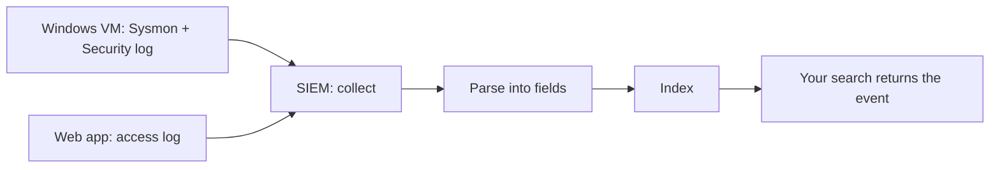

# Lab 9.1: SIEM Setup

**Month:** 9 (Defensive Operations)
**Pattern family:** Detection and response
**Time budget:** 12 to 14 hours (across multiple sessions; this is infrastructure work and it fights back)
**Lab attempt floor:** 90 minutes
**AI guidance:** Detection-rule drafting is the month's pattern, but it does not apply here; there are no detection rules yet. AI use this lab is limited to concept orientation for unfamiliar SIEM vocabulary, verified against the product documentation. See "AI guidance for this lab" below. AI Provenance log still mandatory.
**Prerequisites:** Month 9 README read, including "AI augmentation this month." Month 6 complete (you have a Windows VM with Sysmon and the SwiftOnSecurity config, generating logs). Month 7 complete (you have a small web app and have generated web traffic, benign and malicious). Month 0 virtualization stack working with room for one more VM.

## Why this lab exists

A **SIEM** (Security Information and Event Management system) is the defender's workbench. You cannot reason about detection until you have one in front of you with real logs flowing in. This lab is where the abstract pipeline (collect, parse, index, search, alert) becomes a set of running programs you can point at, break, and fix. By the end you can ask a precise question of data from your own machines and get an answer, which is the precondition for everything in Labs 9.2 through 9.4.

It is also where you confront the central, unglamorous truth of the job: most of the work is plumbing. Getting a Windows host to ship its Sysmon events to a collector that parses them into the right fields is half the battle of detection, and it is the half nobody writes blog posts about. Doing it once yourself means that for the rest of your career you will know what is happening when a log "just does not show up."

**Recall first, from memory, before you read on:** in Month 6 you ran Sysmon with the SwiftOnSecurity config. What does Sysmon Event ID 1 record, and name two fields it gives you about a new process. (You will route these exact events into your SIEM in Task 3, so the answer is also your test target.)

## The scope rule, first, because it is not optional

Every log source you ingest in this lab comes from a system you own: your Month 6 Windows VM, your Month 7 web app, the SIEM host itself, your own Linux VMs. You do not install a SIEM agent on, forward logs from, or point a network sensor at any machine you do not own or are not explicitly authorized to monitor. This is the `SAFETY.md` rule applied to defense: monitoring a network you do not own is not benign just because you are "only collecting logs." A network sensor in promiscuous mode on a network you do not control captures other people's traffic, which is exactly the kind of thing that turns a learning exercise into a legal problem. Build your SIEM on your own host network, ingesting your own systems, and nothing else. If you later do this for an employer, their security team and your written authorization govern it, not this course.

## Learning objectives

By the end of this lab, you can:

- **Explain** each stage of a SIEM pipeline (collection, parsing and normalization, indexing, search, alerting) by pointing at the running component that performs it.
- **Build** Wazuh or Security Onion as a working single-node SIEM on your own host network.
- **Produce** a working log path from a Windows host (Sysmon and Security channel) and a web application into the SIEM, with events parsed into queryable fields.
- **Analyze** the log sources you collect: distinguish, with reasons, the ones that carry detection value from the ones that are mostly volume.
- **Build** a basic search against ingested data and retrieve the specific events you expect.

## Recognition cue

When you have a question about what happened on a host and a pile of logs that might answer it, you reach for a SIEM and a query rather than grepping files by hand. When someone proposes collecting a new log source, you ask what detection value it carries per unit volume before you say yes. This lab is where you build the workbench and the instinct to budget your collection.

## The pipeline you are building

Here is what you are wiring together. Each arrow is a place a log can get lost, which is most of the debugging in this lab.


*Notice: a source can be "running" and still not show up, because the failure is usually on one of these arrows (transport, parsing, or indexing), not in the source itself.*

## AI guidance for this lab

This lab is configuration, not detection authoring, so the drafting pattern is not in play yet. It returns in full force in Lab 9.2.

**Allowed:** Concept orientation. You may ask AI to explain unfamiliar SIEM vocabulary and architecture in plain language (what a "decoder" is in Wazuh, what an "index" is, what the difference between a forwarder and an agent is, what Security Onion's component services do). You then verify every claim against the product's own documentation before you act on it, exactly as in Month 6's Windows concept-orientation pattern.

**Not allowed:** Asking AI to give you the install commands or the configuration files to paste in. SIEM setup is fiddly on purpose, and the fiddliness is where you learn the pipeline. Follow the official deployment documentation and your own reading, debug the failures yourself, and reach for AI only to understand a term, never to skip the work. Do not paste your configuration, your host details, or any log contents into a public AI service (see `AI-ETHICS.md`; your home-network logs are exactly the kind of data that rule covers).

**Logged:** Every AI interaction goes in your AI Provenance section, including which vocabulary you looked up and how you verified the explanation against the documentation.

## Tasks

Do these in order. Each has explicit checkpoints. Tasks 2 through 4 are routine setup, so they stay as plain steps. Task 4's search skill is the one genuine new skill, so it is staged.

### Task 1: Pre-flight and architecture sketch, before you install anything (90 minutes)

With the official documentation open (not AI), choose your SIEM (Wazuh or Security Onion) and write a pre-flight entry: what the SIEM does at the level of the five-stage pipeline, what each major component is responsible for, what artifacts the agent or sensor leaves on a monitored host, what could go wrong (resource exhaustion on the SIEM VM is the classic), and the authorization scope (your own systems only). Then draw the architecture you intend to build: which host runs the SIEM, which hosts are sources, and how each log gets from source to SIEM (agent, forwarder, syslog).

The floor applies to this task: sit with the documentation and the design for the full 90 minutes before you provision anything. A SIEM you understand before you build is a SIEM you can debug.

**Checkpoint:** your notebook draft has a pre-flight section covering all five points, plus an architecture sketch (a diagram or a clear written description) of sources, transport, and the SIEM host. Both produced from the documentation, before installation.
**If not:** if you cannot name what a component does, you are reading a blog instead of the product docs; switch to the official deployment guide. If your sketch has no transport on the arrows, decide now (agent or syslog) per source, because that choice drives Tasks 3 and 4.

### Task 2: Stand up the SIEM (3 to 4 hours)

Provision the SIEM VM. Mind the resource requirements: both Wazuh and Security Onion are memory-hungry, and an under-provisioned SIEM fails in ways that look like configuration bugs. Install per the official deployment guide. Bring the web interface up and log in. Confirm the core services are running.

**Checkpoint:** the SIEM's web interface loads, you can authenticate, and the component services report healthy. You have a screenshot of the running dashboard (no data yet) and a note of any deployment friction and how you resolved it.
**If not:** if the interface will not load or services crash on start, check memory and disk first (an out-of-memory SIEM looks like a broken config). Give the VM more RAM, watch resource usage, and only then suspect the configuration.

### Task 3: Ingest the Windows host (3 to 4 hours)

Connect your Month 6 Windows VM as a log source. Install and enrol the agent (Wazuh) or configure log shipping (Security Onion). Confirm two things arrive and are parsed into fields: the Windows Security channel (logon events, 4624 and 4625) and your Sysmon events (process creation, Event ID 1, with the SwiftOnSecurity config from Month 6). Generate a few events deliberately (log off and back on; launch a process).

**Checkpoint:** in the SIEM, you can see your own logon events and your own Sysmon process-creation events arriving, with fields parsed (account name, process command line, parent process, source address, as appropriate).
**If not:** a source that does not show up is almost always one of three things, checked in order: the agent is not actually running, a firewall is dropping the transport, or the events are arriving but landing under field names or an index you are not looking at. Check each in order rather than guessing.

### Task 4: Find your events by search (the staged skill)

Standing up the pipe is plumbing. The skill that carries into every later lab is asking the data a precise question and getting the exact event back. You will learn it in three stages, on events you generated yourself.

#### Stage 1 - Worked example (I do)

Watch this exact retrieval on a logon event, the simplest case. The query syntax differs slightly by SIEM, so this shows the shape; you adapt the field names to yours.

1. On the Windows VM, log off and back on. This writes a 4624 (successful logon) to the Security channel.
2. In the SIEM search bar, search the Windows index for the event ID and a field you can recognize. In a Wazuh or Elastic-style search that reads roughly: `data.win.system.eventID:4624 and data.win.eventdata.targetUserName:<your-account>`.
3. Read the returned event. Find the field that holds the account name and the field that holds the source. Note their exact parsed names; you will need those names in Lab 9.2.

The point is not the syntax. It is the loop: generate a known event, search for it by a field you understand, and read the parsed field names off the result.

**Checkpoint:** you located your own 4624 logon event and you can name the exact parsed field that holds the account name in your SIEM.
**If not:** if the search returns nothing, widen the time range first (your event may be just outside the window), then drop to a bare `eventID:4624` to confirm logons arrive at all; if even that is empty, the Windows source is not ingesting and you are back in Task 3.

#### Stage 2 - Faded practice (we do)

Now you write the search for a Sysmon process-creation event you generate. The steps and the goal are below; you supply the query.

1. On the Windows VM, launch a distinctive process, for example `notepad.exe` from a command prompt.
2. In the SIEM, write a search that returns that process-creation event. Fill in the blanks with your SIEM's real field names (you read the logon field names in Stage 1; the Sysmon names may differ):

```
# TODO: search the Sysmon process-creation events ...
#   - filter on the event being process creation (Event ID 1)
#   - AND filter Image (or your SIEM's field) ending in \notepad.exe
# Expected: exactly the notepad launch you just ran, with ParentImage and CommandLine visible.
```

3. Confirm the result is the launch you just ran, and read the parent image and command line fields off it.

**Checkpoint:** your search returns the `notepad.exe` process-creation event you generated, and you can see its parent image and command line.
**If not:** if the search is empty but logons worked in Stage 1, Sysmon events may parse under different field names than the Security channel; search a bare Event ID 1 first, open one result, and read the real field name for the image before adding the `notepad` filter.

#### Stage 3 - Independent (you do)

No scaffolding now. Generate one of the malicious web requests you crafted in Month 7 against your own web app (an SQL-injection attempt or a path-traversal attempt), make sure its access log reaches the SIEM (this overlaps with Task 5 below), then write the search that finds that one request among the benign traffic. Read the URL, the status code, and the source address off the result. Work out the query yourself from the field names your SIEM shows.

**Checkpoint:** your search isolates your own Month 7 attack request in the SIEM, and you can name the parsed fields for the URL, status code, and source address.
**If not:** if the web logs are not in the SIEM yet, do Task 5 first, then return. If the request is there but your search misses it, you are filtering on a field name you assumed rather than one you confirmed; open any web event and read the real field names first.

### Task 5: Ingest the web application logs (2 hours)

Route the access logs from your Month 7 web app (or a reverse proxy in front of it) into the SIEM. Generate both benign traffic and a few of the malicious requests you crafted in Month 7 (an SQLi attempt, a path-traversal attempt). Confirm the requests arrive and that you can find the malicious ones by search (this is where Task 4 Stage 3 lands).

**Checkpoint:** a search returns your web access logs with URL, status code, and source address parsed into fields, and you have a screenshot showing one of your Month 7 attack requests located in the SIEM by search.
**If not:** if web events do not arrive, confirm the log path and format the SIEM expects (a reverse proxy in front of the app often produces a cleaner, easier-to-parse log than the app itself). If they arrive unparsed (one big text blob), the SIEM needs the right decoder or parser for that log format; check the product docs for the access-log format you are sending.

### Task 6: Log-source value triage (90 minutes)

You now have several sources flowing. Write a short triage: for each source you ingested (Windows Security, Sysmon, web access, and any others), state what detection value it carries, what the volume is roughly like, and whether you would collect it in a resource-constrained real environment. Then name two log sources you deliberately did not collect and explain why their cost outweighs their detection value. This is the judgment the lab is really teaching: collection is a budget, not a default.

**Checkpoint:** a `log-source-triage.md` in this lab's directory ranks your sources by detection value per unit volume, with reasons, and names two sources you excluded and why.
**If not:** if every source looks equally valuable, you are not weighing volume; ask which source would bury an analyst in noise per real detection it enables, and rank by that ratio.

### Task 7: Notebook entry with AI Provenance (90 minutes)

Write `.tutor/notebook/lab-01-siem-setup.md`. Required sections:

- **Pre-flight check** (from Task 1, refined): the SIEM pipeline, the agent's on-host artifacts, failure modes, authorization scope.
- **Concept naming.** What did this lab teach? It is not "I installed a SIEM."
- **Evidence:** the architecture sketch, the screenshots of parsed events from each source, the searches from Task 4, the log-source triage.
- **Five-question debrief.**
- **AI Provenance:** which AI tool, what vocabulary you asked it to explain, and how you verified each explanation against the product documentation. If you used no AI this lab, say so explicitly and note why none was needed.

**Checkpoint:** the entry is committed with all sections.
**If not:** missing or shallow provenance (or a missing statement that none was used) means the entry is rejected. If you used no AI, one honest sentence saying so and why satisfies the requirement.

## Definition of Done

You are done when all of these are true:

- The SIEM is running and you can authenticate to its interface.
- At least two real sources (Windows and web) are ingesting and parsed into fields.
- You can retrieve, live, a specific event you generated, by a search you wrote (the Task 4 skill).
- `log-source-triage.md` ranks your sources and names two you excluded, with reasons.
- The notebook entry is committed with all sections.

There is no single self-verify command for this lab, because the proof is a live search in your SIEM's own interface. The tutor will spot-check by asking you to retrieve a specific event: "show me the search that finds the Sysmon process-creation event for the process you launched in Task 4, and tell me which parsed field you filtered on." If you can drive your own SIEM to the answer, you own the setup.

**Self-explain:** in one sentence, why does a log source that is "running" sometimes still fail to show up in the SIEM?

## Stretch goals

1. Add a third source: forward `auth.log` or `journald` from one of your Linux VMs and confirm SSH logon events arrive parsed.
2. Build one saved dashboard panel (a count of logon failures over time) and explain what a spike on it would mean.
3. Measure the rough daily volume of each source for a day, then revisit your Task 6 triage with real numbers instead of estimates.
4. Snapshot the healthy SIEM VM, deliberately break one piece (stop the agent, or block the transport port), and practice diagnosing the "source not showing up" failure from scratch.

## Troubleshooting

- **The SIEM VM runs out of memory or disk and fails like a config bug.** Provision generously and watch resource usage before you blame the config. This is the single most common stumble in this lab.
- **A source does not show up.** Check three things in order: the agent is actually running, a firewall is not dropping the transport, and the events are not arriving under field names or an index you are not searching.
- **Sysmon events arrive but parse into fields you did not expect.** Field naming differs between the raw Windows channel and how the SIEM normalizes it. Note the actual field names now; in Lab 9.2 a Sigma rule that targets a field your SIEM does not produce will silently never fire.
- **Web logs arrive as one unparsed blob.** The SIEM needs the correct decoder or parser for that access-log format. Check the product docs, or put a reverse proxy in front of the app for a cleaner log.
- **You are tempted to ingest everything because you can.** Resist; Task 6 exists to make you choose. An over-stuffed SIEM is slow to search and expensive, and learning to say no to a log source is the skill.

## Time budget breakdown

- Task 1: 90 minutes
- Task 2: 3 to 4 hours
- Task 3: 3 to 4 hours
- Task 4: 90 minutes (folded into Tasks 3 and 5; the staged search skill)
- Task 5: 2 hours
- Task 6: 90 minutes
- Task 7: 90 minutes

Total: 12 to 14 hours. Infrastructure work overruns; budget across several sessions and snapshot the SIEM VM once it is healthy so a later mistake does not cost you the whole build.

## Resources

- The Wazuh documentation (deployment, agent enrolment, decoders and field extraction) or the Security Onion documentation (installation, the component services, importing and querying), depending on your choice. Primary source; follow it, do not follow a third-party blog.
- The Microsoft documentation for the Windows Security audit events you are collecting (4624, 4625, 4688) and the Sysmon documentation for Event ID 1 fields (reinforcing Month 6). Note: 4688 carries the process command line only if you enabled command-line process auditing in Month 6 (it is off by default); confirm your own 4688 events contain the command line before you rely on that field, or use Sysmon Event ID 1, which carries it once the SwiftOnSecurity config is in place.
- Your own Month 6 notebook entries on Sysmon and the SwiftOnSecurity config.
- Your own Month 7 notes on the attack requests you crafted, so you can reproduce them as test traffic.
