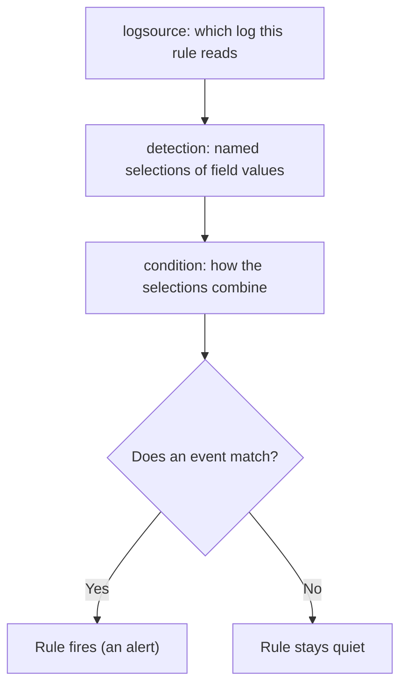

# Lab 9.2: Five Sigma Rules

**Month:** 9 (Defensive Operations)
**Pattern family:** Detection and response
**Time budget:** 15 to 17 hours (across multiple sessions)
**Lab attempt floor:** 90 minutes
**AI guidance:** This is the worked example of the detection-rule drafting pattern. You decide what to detect and identify the real fields; AI may draft the Sigma; you validate, test against negatives, tune for volume, and write the false-positive analysis. AI Provenance log mandatory, including a false-positive analysis for every AI-drafted rule. See "AI guidance for this lab" below.
**Prerequisites:** Lab 9.1 complete (a running SIEM ingesting your Windows and web logs, and you know the actual field names your SIEM produces). Month 6 (Sysmon, the suspicious-activity events you generated). `AI-ETHICS.md` read.

## Why this lab exists

This is the detection-engineering core of the month. A SIEM full of logs catches nothing on its own. The detections are what someone wrote. Here you become that someone. You will author five rules in **Sigma** (a vendor-neutral format for writing detection rules as plain YAML), convert at least two to your running SIEM's query language, and prove each one fires on the activity it targets and stays quiet otherwise.

The format is the small part. The craft is in two questions that separate a real detection from a rule that merely parses. First: does this fire on the actual data my environment produces, with the field names my SIEM actually uses? Second, and harder: what else does it fire on? A rule that flags the attack and also the nightly backup job, the vulnerability scanner, and every administrator's normal work is not a detection. It is a pager everyone learns to ignore. Learning to ask and answer the second question is the senior judgment this lab exists to build. It is exactly the judgment your AI assistant does not have.

**Recall first, from memory, before you read on:** in Lab 9.1 you ingested Sysmon events and saw their parsed field names. What were the actual field names your SIEM showed for a process-creation event, and were they the same as the raw Windows channel names? (Hold your answer. A Sigma rule that targets a field your SIEM does not emit parses cleanly and never fires, which is this lab's most dangerous trap.)

## The scope rule

Every rule you write targets the data from your own systems, ingested in Lab 9.1. You generate the attack activity that tests your rules on your own VMs (re-running the suspicious Sysmon activity from Month 6, replaying your own Month 7 web attacks). You do not test detections against data from any system you do not own. Generating malicious-looking activity is fine when it is your own lab. Doing it anywhere else is not.

## Learning objectives

By the end of this lab, you can:

- **Author** a detection rule in Sigma whose `logsource` and `detection` fields map to a log source you actually ingest.
- **Analyze** each rule's place on the MITRE ATT&CK map (tactic and technique) and justify the placement.
- **Build** a converted query from a Sigma rule with the Sigma converter and confirm it targets the right fields.
- **Demonstrate**, with evidence, that a rule fires on the intended activity (a true positive) and stays quiet on benign activity that resembles it (a true negative).
- **Reconcile** a rule against realistic data volume: estimate its alert rate and tune it so it would survive production.
- **Defend**, for every AI-drafted rule, a written analysis of what would make it fire when it should not, and act on it.
- **Produce**, for every rule, a short response runbook so the analyst who receives the alert knows how to triage, act, and close it.

## Recognition cue

When you notice an attacker behavior and want your environment to catch it next time, you reach for a detection rule. Before you trust the rule, you ask what else it would fire on. When an AI hands you a rule that matches the attack perfectly, the question "what legitimate activity also matches this?" fires in your head on its own. This lab is where that second question becomes a reflex.

## How a Sigma rule is shaped

Hold this structure in your head. A Sigma rule is YAML with three load-bearing parts:


*Notice: the `condition` line is where the judgment lives. It decides which selections must be true together, and that is what separates a precise rule from a noisy one.*

## AI guidance for this lab

Follow this exactly. The months after this one assume you have internalized it.

**Allowed:** After you have (a) chosen the behavior to detect and stated why it matters, (b) identified the log source and the actual field names it produces in your SIEM (from Lab 9.1, not from the model's guess), and (c) sketched the logic in plain language, you may ask AI to draft the Sigma rule. You then validate it against your real events, test it against benign cases, and tune it.

**Required (the addition for detection work):** Every AI-drafted rule you keep gets a written false-positive analysis: what legitimate activity could match this rule, how often, and what you changed (or would change) to handle it. The model will not volunteer this. Producing it is the point of the lab.

**Not allowed:** Asking AI what to detect. Pasting a rule into your SIEM because it parsed, without testing it against real events and negatives. Trusting a field name the model produced without confirming your log source actually emits it (Lab 9.1 warned you that field naming differs between the raw channel and the SIEM's normalization; this is where that bites). Keeping any rule you cannot explain line by line.

**Logged:** Every interaction in your AI Provenance section, with the discards called out. The most valuable provenance entries this lab are the ones where the model produced a rule that fired on the attack and also on half your benign traffic, and you caught it.

## Tasks

### Task 1: Choose five behaviors and place them on ATT&CK, before any AI (90 minutes)

With no AI, choose five distinct behaviors to detect across your data. Spread them: at least three from your Windows and Sysmon data, at least one from your web logs. For each, write down the behavior in plain language, why it has detection value, the log source and the actual field names that would carry it (check your SIEM from Lab 9.1), and the MITRE ATT&CK tactic and technique it represents.

Examples of the kind of behavior worth detecting (choose your own; do not just take these): an office application spawning a command interpreter; an encoded or obfuscated command line; a new scheduled task created outside a maintenance window; repeated authentication failures followed by a success from one source; a web request carrying a SQL-injection or path-traversal signature. The floor applies: sit with the selection and the ATT&CK mapping for the full 90 minutes.

**Checkpoint:** you have a `detection-plan.md` in this lab's directory listing five behaviors, each with a plain-language description, a detection rationale, the log source and real field names, and an ATT&CK tactic plus technique ID. Written before you involve AI.
**If not:** if you cannot name the real field for a behavior, you skipped a step in Lab 9.1; open your SIEM, find one matching event, and read its parsed fields before you write the plan. If you are tempted to ask AI to pick the behaviors, stop; the floor applies, and a plan you wrote is what lets you judge AI's draft later.

### Task 2: Learn the rule-drafting loop (gradual release)

The new skill this lab is not "write a Sigma rule." It is "draft a detection with AI, then prove it works and prove what else it fires on, until you can defend it." You will learn that loop in three stages. The first two use a throwaway teaching rule so you can focus on the method. The five graded rules are yours alone, in Stage 3.

#### Stage 1 - Worked example (I do)

Study this complete worked example on a teaching rule that is not one of your five: detecting `whoami.exe` run as a child of a web server process, a classic sign that a web shell is running commands. Read every line; you are not inventing anything yet.

```yaml
title: Whoami executed by a web server process
id: 8f1c0a64-teaching-example-only
status: experimental
logsource:
  product: windows
  category: process_creation
detection:
  selection:
    ParentImage|endswith:
      - '\w3wp.exe'
      - '\httpd.exe'
    Image|endswith: '\whoami.exe'
  condition: selection
falsepositives:
  - A web server legitimately running an inventory script that calls whoami
level: high
```

Line by line. `logsource` says this rule reads Windows process-creation events (your Sysmon Event ID 1 data). `detection` defines a named block called `selection`: it matches when the parent image ends with a web server binary AND the child image is `whoami.exe`. The `|endswith` part is a Sigma **modifier** that matches the end of the field, so a full path still matches. `condition: selection` says "fire when the selection matches." `falsepositives` is your honest note about benign activity that would also match. `level` is the severity.

Now walk the loop you will run on every real rule:

1. **You spec it:** "web server process spawning whoami, on Sysmon process-creation, fields ParentImage and Image."
2. **You confirm the fields exist:** you check your Lab 9.1 SIEM and see that your data really does have `ParentImage` and `Image`. (If your SIEM normalized these to other names, you would use those instead. This is the step AI cannot do for you.)
3. **You get a draft** (by hand here, with AI on the real rules).
4. **You prove a true positive:** on your own VM, run `whoami` from a shell launched under a test "web server" process, and confirm the rule matches.
5. **You prove a true negative and analyze false positives:** run `whoami` normally from your own terminal and confirm the rule stays quiet, then write down the benign case that *would* match (an inventory script) and how you would handle it.

Then write the part a deployed detection cannot ship without: the response runbook. A **runbook** is the short set of steps the analyst follows when the rule fires, so the person paged at 2 AM is not starting from zero. Here is the runbook for this teaching rule, in three to five lines:

```
Runbook: Whoami executed by a web server process
1. Triage question: did a web-facing process (w3wp.exe, httpd.exe) really spawn whoami,
   or is this an inventory script? Open the event and read ParentImage and the user.
2. Confirm true vs false: pivot to the same host's process-creation events around that
   time. A web shell rarely runs whoami alone; look for a chain (whoami, then ipconfig,
   net, or an outbound connection). An inventory script runs on a schedule and alone.
3. Action: if the chain looks like reconnaissance, this is a likely web shell. Isolate the
   host for investigation and escalate to incident response. If it is the known inventory
   script, close as benign and note the script name.
4. Owner / severity: web-team on-call; severity high (web shell suspected) until ruled out.
```

Notice the shape: one triage question to answer first, the pivots that separate a true positive from a false positive, the containment-or-close action, and who owns it at what severity. The false-positive analysis tells you what else fires; the runbook tells the analyst what to do about it. A rule ships with both.

**Checkpoint:** you can state the loop in order from memory: spec, confirm fields, draft, prove true positive, prove true negative plus false-positive analysis, write the response runbook.
**If not:** re-read the five numbered steps and write them in your notebook before moving on. You will run this exact loop on all five graded rules, so the loop must be solid first.

#### Stage 2 - Faded practice (we do)

Now you fill in a rule, still on a teaching behavior that is not one of your five: detecting a process launched from a user's temporary folder, a common malware staging trick. The skeleton and the goal are below. You supply the two field values and the condition, using the real field names from your SIEM.

```yaml
title: Process launched from a user temp directory
id: 2b7e-faded-practice-only
status: experimental
logsource:
  product: windows
  category: process_creation
detection:
  selection:
    Image|contains: '___'        # TODO: the path fragment for a user temp folder (e.g. \AppData\Local\Temp\)
  filter:
    Image|endswith: '___'        # TODO: one known-good installer you do NOT want to alert on
  condition: ___                  # TODO: fire on selection but NOT the filter (hint: "selection and not filter")
falsepositives:
  - Software installers that legitimately unpack and run from a temp directory
level: medium
```

You already know the shape from Stage 1. The new idea here is the **filter** block and a `condition` that subtracts it. `selection and not filter` means "match the suspicious pattern, except when the known-good case applies." That subtraction is how you cut false positives, and you will use it constantly.

**Checkpoint:** your rule parses with the Sigma tooling, the `condition` reads `selection and not filter`, and you can explain in one sentence what the filter removes and why.
**If not:** if the tooling reports a parse error, the most common cause is indentation (YAML is whitespace-sensitive: selections sit under `detection`, two spaces in). If you are unsure what fragment names a temp folder, look at a real process-creation event in your SIEM and read an `Image` path; do not guess.

#### Stage 3 - Independent (you do)

No scaffolding now. Your five graded rules must be your own from the `detection-plan.md` you wrote in Task 1; the teaching rules above (whoami-under-web-server, process-from-temp-folder) do not count toward the five. Author your five rules. For each, run the full loop from Stage 1 on your own. Use the drafting pattern: you specified each behavior, so you may ask AI to draft the Sigma, then you validate every field against your SIEM, read every line, and own it. Write the rule so its `logsource` and `detection` fields reference the real fields you identified, not invented ones. A rule that parses is not yet a rule that fires; do not trust any of them until Task 4.

**Checkpoint:** five Sigma rule files exist in this lab's directory, each parses with the Sigma tooling, and each targets a real log source and field set from your plan. For each AI-drafted rule, the prompt and the raw draft are captured for your provenance log.
**If not:** if a rule will not parse, check indentation and that every modifier (`|endswith`, `|contains`) is spelled correctly. If you cannot explain a line AI produced, delete that line and rebuild it from the Stage 1 pattern until you can.

### Task 3: Convert at least two to your SIEM backend (2 hours)

Using the Sigma converter (`sigma convert` from the modern `sigma-cli`, or the legacy `sigmac`), convert at least two of your rules to your SIEM's query language (the Wazuh or the Elastic/Security Onion backend, as appropriate). Read the converted query. Confirm it targets the fields your SIEM actually indexes. Conversion is mechanical and will happily produce a query against a field name that does not exist in your data.

**Checkpoint:** at least two converted queries are saved alongside their Sigma sources, and you have read each one and confirmed (by eye) that it targets real fields in your SIEM.
**If not:** if the converter errors on a backend name, you are likely following an old tutorial; check the current `sigma-cli` documentation for the backend's current name. If the converted query names a field you do not recognize, compare it to a real event in your SIEM; a field mismatch here is exactly what makes a rule silently never fire.

### Task 4: Prove true positives and true negatives (3 to 4 hours)

For each converted rule, do two things. First, generate the activity the rule targets on your own VM and show the rule fires (a **true positive**): capture the alert or the matching search result. Second, generate or identify benign activity that resembles the attack and show the rule stays quiet (a **true negative**): for an office-spawns-shell rule, that might be an administrator legitimately running PowerShell directly; for a failed-logins rule, a user fat-fingering their password twice then succeeding. The negative case is the harder and more important half.

**Checkpoint:** for each of the at least two converted rules, you have evidence of a true positive (the rule fired on real attack activity you generated) and a true negative (it stayed quiet on a benign case you constructed). Screenshots or saved results, captioned with what you did.
**If not:** if a rule does not fire on activity you are sure happened, check the field names first (the rule may target a field your SIEM does not emit) and the time range second. If it fires on your benign case too, your `condition` is too loose; add a filter block as you practiced in Stage 2.

### Task 5: Volume and the false-positive analysis (3 hours)

This is the heart of the lab. For every rule (all five, not just the converted two), write a **false-positive analysis**: what legitimate activity in a real, busy environment could match this rule? Backup agents, vulnerability scanners, software deployment tools, monitoring systems, administrators, and automated jobs are the usual culprits. Estimate, even roughly, how often the rule would fire in a production-scale environment, and decide whether it is usable as written. For at least two rules, tune them (tighten a condition, add an exclusion, require a combination of signals) to cut the false-positive rate, and document what you changed and why. A rule that fires fifty thousand times an hour is not a detection; show that yours would not.

Your own lab generates almost no benign volume, so the estimate cannot come from watching your SIEM idle. Anchor it on a **base rate**: how often the underlying event happens per host per unit time, scaled to a real environment. The method:

> **Estimating alert volume.** volume ~= (events of this type per host per day) x (hosts in a hypothetical environment) x (the fraction your rule's selection matches). Get the first number from your own Lab 9.1 SIEM where you can (count the matching events over a day, the Lab 9.1 stretch goal), or state a defensible assumption. Pick an environment size and name it (for example 500 hosts for a mid-size company, 5000 for a large one). Then estimate what fraction of those events your condition actually keeps.

Two worked anchors so you calibrate against a number, not a feeling:

- A rule on any successful logon (4624, logon type 3) matches roughly once per workstation per network session. In 1000 hosts that is tens of thousands of events per hour, which is exactly why "a logon happened" is not a detection.
- Scheduled-task creations (4698) are rare on a normal workstation, perhaps a handful per host per week. The same rule that is hopeless on logons is workable here, because the base rate is low. Same rule shape, different base rate, opposite verdict.

The lesson: a rule's usability is decided as much by the base rate of the event it targets as by how the rule is written. State your base-rate assumptions so a reader can check your arithmetic.

**Checkpoint:** you have a `false-positive-analysis.md` covering all five rules: for each, the benign activity that could trigger it, a rough production alert-volume estimate derived from a stated base rate (events per host per day, environment size, match fraction), and a usable or not-usable verdict. For at least two rules, a documented tuning change with before-and-after reasoning.
**If not:** if you cannot think of a single false positive for a rule, your rule is probably too broad to see the problem, or you have not pictured a real network; ask "what runs this same program or touches this same field as part of normal operations?" If your volume estimate is just a feeling, you skipped the base rate; pick the events-per-host-per-day number (from your SIEM or a stated assumption), multiply by a named environment size and your match fraction, and show the arithmetic. If your tuning made the rule stop firing on the real attack too, you cut too far; re-prove the true positive after every change.

### Task 6: Write a response runbook for each rule (90 minutes)

A detection is half a product. A rule that fires but ships with no instructions wakes an analyst at 2 AM who then has to reverse-engineer what the alert even means and what to do about it. That is the alert-fatigue failure this month exists to prevent, reproduced one layer up. So for every rule (all five), write a short **response runbook**: the three to five lines the analyst follows when this rule fires. You modeled the shape on the teaching rule in Stage 1; now write your own for your own five.

Each runbook has four moves, kept short:

1. **Triage question.** The one thing the analyst confirms first by reading the event (which field, which value tells them this is real).
2. **Confirm true vs false.** The two or three pivots that separate a true positive from the benign case in your false-positive analysis (what to check, where to look next).
3. **Action.** What to do on a true positive (isolate, escalate, collect) and how to close a false positive (the reason you write down).
4. **Owner and severity.** Who handles it and how urgent it is.

This is not a formality. Writing it forces you to prove your detection is usable by a human under pressure, not just syntactically valid. A rule whose runbook you cannot write is a rule you do not yet understand well enough to deploy.

**Checkpoint:** you have a `triage-runbook.md` in this lab's directory (or a runbook section inside `false-positive-analysis.md`) with a three-to-five-line runbook for each of the five rules, each covering the triage question, the confirm-true-vs-false pivots, the action, and the owner and severity.
**If not:** if a runbook says only "investigate the alert," it is empty; name the exact field the analyst reads first and the exact pivot that decides true versus false. If the action is the same for every rule, you are not thinking about the specific behavior; a web-shell rule isolates a server, a brute-force rule checks whether the source is known and whether the account is privileged.

### Task 7: Notebook entry with AI Provenance (90 minutes)

Write `.tutor/notebook/lab-02-five-sigma-rules.md`. Required sections:

- **Pre-flight check** for the Sigma tooling: what the converter does (it translates a vendor-neutral rule into a specific backend's query language), what it does not do (it does not know your environment or check that your fields exist), what could go wrong (a clean conversion against a nonexistent field that silently never fires), and the authorization scope.
- **Concept naming.**
- **Evidence:** the detection plan, the rule files, the converted queries, the true-positive and true-negative captures, the false-positive analysis, and the response runbooks.
- **Five-question debrief.** Question 3 (what would dominate at scale) is the center of gravity this lab; answer it with your volume estimates.
- **AI Provenance:** which AI tool, what you asked, what each rule draft contained, how you validated each against real events and negatives, and what you discarded. For every AI-drafted rule, include or reference its false-positive analysis. A real provenance entry reads like: "Asked for a rule detecting scheduled-task creation; the draft matched on every Event ID 4698, which fires for legitimate software installs and Windows' own maintenance tasks; I added a condition excluding the known maintenance accounts and noted the residual risk." A non-entry reads "used AI to write the rules."

**Checkpoint:** the entry is committed with all sections, including a false-positive analysis for every AI-drafted rule.
**If not:** if your provenance section is one line, the tutor will reject it. The test is whether a reader could redo your AI conversation and your verification from your notes.

## Definition of Done

You are done when all of these are true:

- `detection-plan.md` lists five behaviors with real field names and ATT&CK mappings, written before AI.
- Five Sigma rules exist and parse, each targeting a real log source and field set.
- At least two rules are converted, and each is demonstrated firing on the real attack (true positive) and staying quiet on a benign case (true negative).
- `false-positive-analysis.md` covers all five rules with volume estimates (each derived from a stated base rate) and verdicts, and at least two rules are tuned with documented before-and-after reasoning.
- A response runbook (three to five lines: triage question, confirm true vs false, action, owner and severity) exists for every rule, in `triage-runbook.md` or as a section of `false-positive-analysis.md`.
- The notebook entry is committed with a real AI Provenance section and a false-positive analysis for every AI-drafted rule.

Self-verify that your rule files are at least syntactically valid (run from this lab's directory; it should list your rules without a parse error):

```zsh
sigma check *.yml
```

**Self-explain:** in one sentence, why can a Sigma rule parse and convert cleanly yet never fire on a real attack?

## Stretch goals

1. Take one of your tuned rules and write its false-positive analysis as a short test plan: list three benign scenarios and confirm the tuned rule stays quiet on each.
2. Convert the same Sigma rule to two different backends and compare the queries; note where the field mapping or the operators differ.
3. Map your five rules onto the MITRE ATT&CK Navigator (the free web layer tool) to see your coverage as a colored matrix, and name one tactic you have no detection for.
4. Add a Sigma `filter` to a rule using a list of your own known-good accounts or hosts, and explain the maintenance cost of keeping such a list accurate over time.

## Troubleshooting

- **The rule will not parse.** YAML is whitespace-sensitive. Selections sit under `detection` indented two spaces; list items align under their key. Re-indent and re-run `sigma check`.
- **The converted query targets a field that is not in my SIEM.** Conversion is mechanical and does not know your schema. Compare the field to a real event in your SIEM (from Lab 9.1) and adjust the Sigma `logsource` or use a backend pipeline that maps the field correctly.
- **The rule never fires even on activity I generated.** Check field names first, time range second, and that the converted query actually deployed third. A detection you have not watched fire is not a detection.
- **The rule fires on my benign case too.** The `condition` is too loose. Add a `filter` block and subtract it (`selection and not filter`), exactly as in Stage 2.
- **A 2021 tutorial's `sigmac` command does not exist.** The tooling moved to `sigma-cli` with `sigma convert`. Follow the current documentation, not the old blog post.

## Time budget breakdown

- Task 1: 90 minutes
- Task 2: 4 to 5 hours (Stage 1 about 45 min, Stage 2 about 90 min, Stage 3 the rest)
- Task 3: 2 hours
- Task 4: 3 to 4 hours
- Tasks 5 and 6: 4 hours (the false-positive analysis, then the runbooks in the same session; the runbooks are faster once the analysis is written)
- Task 7: 90 minutes

Total: 15 to 17 hours. Tasks 4, 5, and 6 are where the judgment is (prove it works, prove what else it fires on, say what the analyst does about it); do not let the earlier tasks crowd them out.

## Resources

- The Sigma project documentation and the official rule specification (the `logsource`, `detection`, and `condition` semantics). Primary source; the spec is short and worth reading in full.
- The `sigma-cli` documentation for `sigma convert` and the available backends and pipelines.
- The MITRE ATT&CK website, for placing each behavior on a tactic and technique. Use the technique pages to confirm your mapping and to see what data sources ATT&CK says each technique touches.
- The Microsoft and Sysmon documentation for the exact event IDs and field names your Windows rules target (reinforcing Lab 9.1 and Month 6).
- Your own Lab 9.1 notes on the actual field names your SIEM produces. This is the document that keeps your rules from targeting fields that do not exist.
