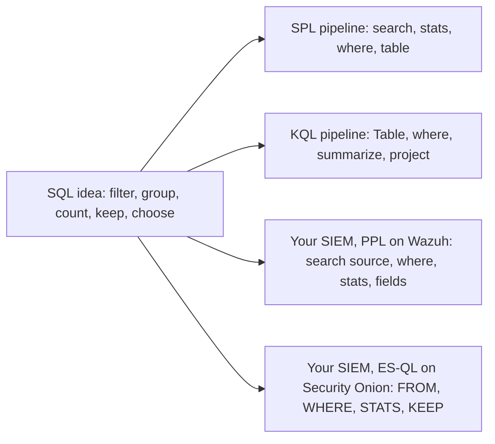

# Lab 9.3: SPL and KQL Drills

**Month:** 9 (Defensive Operations)
**Pattern family:** Detection and response
**Time budget:** 10 to 12 hours (across multiple sessions)
**Lab attempt floor:** 90 minutes
**AI guidance:** Detection-rule drafting pattern applies, scoped to query translation: you author the SQL-shaped logic, AI may help translate it into a dialect, you verify the translation returns the right events. AI Provenance log mandatory, with a false-positive analysis for any detection you tune here. See "AI guidance for this lab" below.
**Prerequisites:** Lab 9.2 complete (you have at least three detections you understand and can defend). Month 7, Week 1 (SQL: SELECT, WHERE, JOIN, GROUP BY, HAVING, subqueries). `AI-ETHICS.md` read.

## Why this lab exists

You learned SQL in Month 7 and may have filed it under "web stuff." It is not. The two dominant SIEM query languages, Splunk's **SPL** (Search Processing Language) and Microsoft's **KQL** (Kusto Query Language), are SQL dialects wearing pipeline syntax. Every search you write in either one is the same set of relational operations you already know: filter the rows, group them, aggregate within groups, keep the groups that matter, choose the columns you want, sometimes join to another table. This lab makes that mapping explicit, then drills it by having you express three of your Lab 9.2 detections in both SPL and KQL.

The payoff is leverage. SIEM vendors come and go, and every job uses a different one. If you internalize that these are dialects of a language you already speak, learning the next SIEM's query language costs you a week of syntax, not a month of confusion. You stop memorizing incantations and start translating intent. That is the difference between an analyst who can only run saved searches and one who can ask the data a question nobody has asked before.

**Recall first, from memory, before you read on:** from Month 7, write the SQL that counts how many login attempts came from each source address and keeps only the sources with more than ten. Which clause groups, which counts, and which filters the groups? (Hold your answer. You will write this same logic three ways this lab, and the SQL shape is the spine you translate from.)

## The SQL spine, stated plainly

Hold this mapping in your head for the whole lab. The exact keywords are in the documentation; the point here is the correspondence, not the copy. A fourth column is here on purpose: the SIEM you built in Lab 9.1 has its own pipe language, and which one depends on which SIEM you chose. **Wazuh's indexer is an OpenSearch fork**, so its pipe language is **PPL** (Piped Processing Language) in the OpenSearch Query Workbench, with Lucene query-string syntax and DQL (Dashboards Query Language) in the search bar for the filter-only case. **Security Onion 2.4 is built on Elasticsearch**, so its pipe language is **ES|QL** (the Elasticsearch Query Language) in Kibana, with Kibana Query Language (a Lucene-style filter syntax, not the Kusto KQL in the Sentinel column, which shares the acronym and nothing else) or Lucene in the search bar. Drilling the two dialects you did not deploy and ignoring the one you did would be a strange gap, so the spine maps your own stack too. Read the column for the SIEM you actually built.

| Relational operation | SQL | SPL (Splunk) | KQL (Sentinel) | Your own SIEM: PPL (Wazuh) or ES&#124;QL (Security Onion) |
| --- | --- | --- | --- | --- |
| Filter rows | `WHERE` | base-search terms, `where`, `search` | `where` | `where` (PPL and ES&#124;QL alike; or a Lucene/DQL/KQL-Kibana term in the search bar) |
| Aggregate within groups | `GROUP BY` + `COUNT`/`SUM`/`AVG` | `stats count by <field>` | `summarize count() by <field>` | `stats count() by <field>` (PPL); `STATS COUNT(*) BY <field>` (ES&#124;QL) |
| Keep groups meeting a condition | `HAVING` | a `where` after `stats` | a `where` after `summarize` | a `where` after `stats` (both) |
| Choose columns | `SELECT` | `fields` or `table` | `project` | `fields` (PPL); `keep` (ES&#124;QL) |
| Order and limit | `ORDER BY`, `LIMIT` | `sort`, `head` | `sort by`, `take`/`top` | `sort`, `head` (PPL); `sort`, `limit` (ES&#124;QL) |
| Combine tables | `JOIN` | `join` (often `stats` over a combined source) | `join` | `join` on the newer engines; confirm your build, or restructure as a `stats` over a combined source (both) |

The deep difference is direction. SQL is **declarative** and largely unordered: you describe the result and the engine plans it. SPL, KQL, PPL, and ES|QL are **pipelines**: data flows left to right through stages, each transforming the stream the previous stage produced. Same relational algebra underneath; different way of writing it down. Noticing exactly where that difference bites is one of this lab's deliverables. (The cross-vendor trap to keep front of mind: OpenSearch PPL and Elastic's ES|QL are different languages even though both front a search engine in the same family, so the column you do not own does not transfer to the one you do. Confirm which one your stack speaks before you copy a query from a blog.)


*Notice: every dialect starts from the same SQL idea on the left. You are not learning new languages; you are spelling one idea in your own stack's accent. Read the bottom branch that matches the SIEM you built.*

## The scope rule

You run SPL against your own data in Splunk Free (a local install ingesting logs you own) and KQL against your own data in a Microsoft Sentinel free trial (your own Azure tenant, ingesting your own sample logs). You do not query any tenant, workspace, or data set you are not authorized to access. The free trial is provisioned under your own account; keep it that way, and mind the trial's ingestion limits so you do not generate a surprise bill when it ends.

## Learning objectives

By the end of this lab, you can:

- **Reconcile** every clause of a SQL query with its SPL, its KQL, and your own SIEM's equivalent (PPL on Wazuh or ES|QL on Security Onion), and explain the declarative-versus-pipeline difference.
- **Build** a detection as an SPL search against data in Splunk Free and retrieve the intended events.
- **Build** the same detection as a KQL query against data in a Sentinel free-trial workspace and retrieve the intended events.
- **Build** at least one detection in your own Lab 9.1 SIEM's query language (PPL or Lucene/DQL on Wazuh, ES|QL or Kibana Query Language/Lucene on Security Onion) and confirm it returns the right events.
- **Defend** differences between the dialects (and between each and your original Sigma rule) with explanations.
- **Produce** a working Splunk Free install and a Sentinel trial, ingest your own sample data, and clean up the trial responsibly.

## Recognition cue

When you sit down in front of an unfamiliar SIEM's query bar, you do not panic. You ask "what is the `WHERE`, what is the `GROUP BY`, how does this dialect spell them," because you recognize a SQL dialect underneath. When a query returns zero rows, you treat it as a hypothesis to check, not a verdict of "nothing here." This lab is where SIEM query languages stop being incantations and become a language you already speak.

## AI guidance for this lab

The drafting pattern applies, scoped tightly to translation.

**Allowed:** You write the SQL-shaped logic for each detection yourself first (Task 1), in plain relational terms. Then, for the dialect translation, you may ask AI to help convert your stated logic into SPL or KQL, for example "express this as an SPL search: count authentication failures by source IP over a 10-minute window, keep sources with more than 10, against an index of Windows security events with fields src_ip and EventCode." You then run it against your own data and confirm it returns the events you expect.

**Not allowed:** Asking AI what to detect or to invent the query from nothing. Accepting a query that runs without confirming it returns the right events (a query against the wrong field returns zero rows and looks like a clean negative). Trusting a function name or field the model produced without checking it against the dialect's documentation and your own schema; both SPL and KQL have large function libraries and the model will confidently invent plausible ones that do not exist.

**Required:** If you tune any detection here to reduce false positives (for instance, the threshold on a brute-force search), carry the false-positive analysis as in Lab 9.2.

**Logged:** Every interaction in your AI Provenance section, with discards. "Asked for the KQL; it used a `summarize` with a function that does not exist in KQL; I replaced it with the documented one and verified the row count" is a real entry.

## Tasks

### Task 1: Write the SQL spine for three detections, before any AI (90 minutes)

Pick three of your Lab 9.2 detections that have interesting structure (at least one should involve aggregation and a threshold, for example a brute-force or beaconing pattern, because those exercise `GROUP BY` and `HAVING` and are where the dialects diverge most). For each, with no AI and no SIEM, write the detection as a SQL-shaped query in plain pseudo-SQL: the `SELECT`, `FROM` (which log source), `WHERE`, `GROUP BY`, `HAVING`, `ORDER BY` as applicable. This forces you to express the detection in the language you already own before you translate it. The floor applies.

**Checkpoint:** a `sql-spine.md` in this lab's directory has three detections written as pseudo-SQL, each annotated with which relational operation each clause performs. Written before any tooling.
**If not:** if a detection has no `GROUP BY`, you may have picked three simple filters; swap one for an aggregation-and-threshold detection so the harder dialect differences show up. If you cannot say what a clause does, you do not yet own the detection; revisit it in Lab 9.2 before translating it.

### Task 2: Stand up Splunk Free and ingest your data (2 hours)

Install Splunk Free locally. Note its limits: a daily ingestion cap, and no authentication or alerting in the free tier. It is for search and learning, which is exactly what you need. Ingest a sample of your own logs (export a slice of the Windows or web events from your Lab 9.1 SIEM, or feed Splunk the raw logs directly). Confirm the data is searchable.

**Checkpoint:** Splunk Free is running locally with your own sample data ingested and searchable, and you have a screenshot of a basic search returning your events.
**If not:** if a search returns nothing, confirm the data actually indexed (check the index's event count) and widen the time range; fresh Splunk installs often default to a narrow "last 15 minutes" window that hides older imported events.

### Task 3: Learn dialect translation (gradual release)

The new skill is translating a SQL idea into a SIEM dialect and confirming it returns the right rows. You will learn it on a throwaway teaching query first, then translate your own three detections.

#### Stage 1 - Worked example (I do)

Study this complete translation of a teaching query that is not one of your three detections: "count how many events came from each host, and keep only the hosts with more than 100 events." Watch how one SQL idea becomes two pipelines.

The SQL idea:

```sql
SELECT host, COUNT(*) AS n
FROM events
GROUP BY host
HAVING COUNT(*) > 100
ORDER BY n DESC
```

The same idea in SPL (run this against your Splunk data, adjusting the index and the field name `host` to yours):

```
search index=main | stats count as n by host | where n > 100 | sort - n
```

The same idea in KQL (you will run the KQL in Task 5; read it now):

```
events | summarize n = count() by host | where n > 100 | sort by n desc
```

Map them clause by clause. SQL `GROUP BY host` with `COUNT(*)` becomes SPL `stats count by host` and KQL `summarize count() by host`. SQL `HAVING > 100` becomes a `where` placed *after* the aggregation in both dialects (this is the key move: filtering groups happens after `stats`/`summarize`, not before). SQL `ORDER BY ... DESC` becomes `sort - n` in SPL and `sort by n desc` in KQL. Same algebra, three spellings.

Notice the SPL names the index: `index=main`, not `index=*`. Name the index you mean. `index=*` scans every index you can see, which is slow and burns license and compute; it is the query-time version of collecting everything, the habit this month exists to break.

**Checkpoint:** you ran the SPL version against your Splunk data and got a per-host count back, and you can point to which command performs the `GROUP BY`, which performs the `HAVING`, and which performs the `ORDER BY`.
**If not:** if the SPL returns one row or an error, check that your field is really named `host` (open one raw event and read it); if `where n > 100` errors, confirm it sits after `stats`, because filtering a group must follow the aggregation that creates it.

#### Stage 2 - Faded practice (we do)

Now translate a second teaching query yourself, still not one of your three detections. This one uses a different aggregate, a distinct count, so you drill a second shape: "for each destination port, count how many distinct source hosts connected, and keep the ports touched by more than twenty hosts." A port suddenly contacted by many hosts can signal scanning or a worm spreading. The SQL spine and the skeleton are given; you fill the blanks against your real field names.

The SQL idea:

```sql
SELECT dest_port, COUNT(DISTINCT src_host) AS hosts
FROM network_events
GROUP BY dest_port
HAVING COUNT(DISTINCT src_host) > 20
```

The SPL skeleton (fill the TODOs with your real field names; use your real index, not `index=*`):

```
search index=main
| stats dc(___) as hosts by ___    # TODO: dc() is distinct-count; count distinct SOURCE HOSTS, grouped by DEST PORT
| where ___                        # TODO: keep only ports touched by more than 20 distinct hosts
```

The new idea here is the distinct-count aggregate: SQL `COUNT(DISTINCT src_host)` becomes SPL `dc(src_host)` and KQL `dcount(src_host)`. It still groups and still filters after the aggregate; only the function inside the `stats` changed.

**Checkpoint:** your SPL returns a per-port count of distinct source hosts and keeps only ports above the threshold, and the row count matches what you expect from data you generated.
**If not:** if it returns zero rows, the most common cause is the field name in the `by` clause; open a raw network event in Splunk and copy the exact field name. If a count looks too high, you may be using `count` instead of `dc` (distinct count); `dc` counts unique values, `count` counts every row.

#### Stage 3 - Independent (you do)

No scaffolding now. Your three graded detections must be your own from Lab 9.2; the teaching queries above (count-by-host, distinct-hosts-per-port) do not count toward the three. Translate your three Task 1 detections into working SPL against your Splunk data. For each, run it, confirm it returns the events you expect (verify against an event you generated and know is present), and annotate which SPL command corresponds to which clause of your pseudo-SQL. Save each search as a `.spl` file in this lab's directory.

**Checkpoint:** three working SPL searches are saved as `.spl` files in this lab's directory, each returns the intended events from your Splunk data, and each is annotated with the SQL-to-SPL clause mapping. You have a screenshot of at least one returning a true-positive event you generated.
**If not:** if a search returns zero rows, treat it as a hypothesis, not a verdict: check the field, the index, and the time range against an event you know is there. If a translation feels like memorization, go back to your Task 1 pseudo-SQL and translate from intent.

### Task 4: Stand up a Sentinel trial and ingest your data (2 hours)

Provision a Microsoft Sentinel free trial in your own Azure tenant. The trial waives ingestion and analysis charges up to a daily cap for a limited window; read the current terms before you start, and set a reminder to tear it down. Onboard Sentinel onto a Log Analytics workspace and get a sample of your own data in (a built-in connector for sample data, or your own exported logs). Confirm it is queryable with KQL.

**Checkpoint:** a Sentinel trial workspace has your own sample data, queryable, and you have a screenshot of a basic KQL query returning rows, plus a note of the trial's ingestion cap and your planned teardown date.
**If not:** if data does not appear, ingestion into Log Analytics can lag several minutes; wait and re-run before debugging. If you cannot find a free data source, use a built-in sample-data connector rather than ingesting more than the cap allows.

### Task 5: Translate the same three detections to KQL, express one in your own SIEM, and reconcile (2 hours)

Write the KQL for the same three detections and run them in Sentinel. Confirm each returns the intended events. Then close the loop to the SIEM you actually built, using the query path your stack actually has:

- **If you built Wazuh,** express at least one of the three detections in **PPL** in the OpenSearch Query Workbench, or as a **Lucene/DQL** search in the Dashboards search bar for the filter-only ones, and run it against your own data.
- **If you built Security Onion,** express at least one of the three detections in **ES|QL** in Kibana, or as a **Kibana Query Language / Lucene** search in the search bar for the filter-only ones, and run it against your own data. There is no PPL and no OpenSearch Query Workbench on Security Onion; do not reach for them.

You drilled the two dialects you did not deploy; this is the one you did. Then reconcile: for each detection, compare the SQL pseudo-query, the SPL, and the KQL side by side, and write down where they differ and why. Note at least one place where the declarative-versus-pipeline difference forced a genuinely different construction, not just different keywords.

**Checkpoint:** three working KQL queries are saved as `.kql` files alongside the SPL, each returns the intended events; at least one detection is also expressed in your own SIEM's query language (saved as `own-siem-query.ppl` for a Wazuh PPL query, `own-siem-query.esql` for a Security Onion ES|QL query, or `.txt` for a Lucene/DQL/Kibana-KQL search) and confirmed to return the right events; and a `dialect-reconciliation.md` compares SQL, SPL, and KQL for each detection, identifying at least one substantive (not merely syntactic) difference and explaining it.
**If not:** if a KQL function errors, the model likely invented it; check the function against the Kusto documentation and replace it with the documented one. If your own-SIEM query errors on a pipe command, confirm you are using the right language for your stack: PPL on Wazuh (OpenSearch), ES|QL on Security Onion (Elasticsearch). They are not interchangeable, and a PPL query pasted into Kibana, or an ES|QL query pasted into the OpenSearch Query Workbench, will not run. If you cannot find any substantive difference, look at how each dialect orders operations and handles time windows, which is where declarative and pipeline thinking actually diverge.

### Task 6: Notebook entry with AI Provenance (90 minutes)

Write `.tutor/notebook/lab-03-spl-kql-drills.md`. Required sections:

- **Pre-flight check** for Splunk Free and the Sentinel trial: what each is, the free-tier limits (Splunk's daily cap and lack of alerting; Sentinel's trial cap and teardown), what data you put in them, what could go wrong (a surprise bill if the Sentinel trial is left ingesting; pasting sensitive logs into a cloud service), and the authorization scope.
- **Concept naming.** The concept is not "SPL and KQL syntax." It is closer to "SIEM query languages are SQL dialects, and intent translates even when keywords do not."
- **Evidence:** the SQL spine, the SPL and KQL queries, the dialect reconciliation, screenshots of true positives in each tool.
- **Five-question debrief.**
- **AI Provenance:** which AI tool, what you asked it to translate, how you verified each translation returned the right events (the row count, the specific event you confirmed), and what you discarded (the invented function, the wrong field). If you tuned a detection, reference its false-positive analysis.

**Checkpoint:** the entry is committed with all sections and substantive provenance.
**If not:** if your provenance section is one line, the tutor will reject it. The test is whether a reader could redo your translations and your verification from your notes.

## Definition of Done

You are done when all of these are true:

- `sql-spine.md` expresses three detections as pseudo-SQL, written before AI.
- Three detections work in SPL (in Splunk Free) and in KQL (in a Sentinel trial), each verified against a real event you generated.
- At least one of the three is also expressed in your own Lab 9.1 SIEM's query language (PPL or Lucene/DQL on Wazuh; ES|QL or Kibana Query Language/Lucene on Security Onion) and verified against your own data.
- `dialect-reconciliation.md` compares SQL, SPL, and KQL for each detection and names at least one substantive difference.
- The Sentinel trial has a teardown plan (and you honor it).
- The notebook entry is committed with a real AI Provenance section.

Self-verify your saved query files exist and are non-empty (run from this lab's directory; it should print `OK`). Save your own-stack query under the name that matches what you built: `own-siem-query.ppl` for a Wazuh PPL query, `own-siem-query.esql` for a Security Onion ES|QL query, or `own-siem-query.txt` for a Lucene/DQL/Kibana-KQL search. The check below accepts any of these:

```zsh
test -s sql-spine.md && ls *.spl >/dev/null 2>&1 && ls *.kql >/dev/null 2>&1 && ls own-siem-query.* >/dev/null 2>&1 && echo OK
```

**Self-explain:** in one sentence, why does SQL `HAVING` become a `where` placed *after* `stats` or `summarize`, rather than before?

## Stretch goals

1. Take a detection that uses a `JOIN` in SQL and express it both with a real `join` and with a single `stats`/`summarize` over a combined source; explain which is clearer and which is faster.
2. Add a time window to one detection (events within a rolling 10 minutes) in both SPL and KQL, and note how each dialect expresses windowing.
3. Translate one detection into a dialect you have not touched yet (for a Wazuh learner, Elastic's ES|QL, which differs from your OpenSearch PPL; for a Security Onion learner, OpenSearch PPL, which differs from your ES|QL; or a third vendor's language) using only the SQL spine, and time how long it takes; that time is the leverage this lab buys you.
4. Write a one-page "Rosetta table" of SQL to SPL to KQL for the six operations in the SQL spine, in your own words, for your notebook.

## Troubleshooting

- **A query runs cleanly and returns zero rows.** Far more often this means the query targets the wrong field or index, or the time range excludes your test event, than "no malicious activity." A zero-row result is a hypothesis to check; confirm against an event you generated and know is present.
- **The model invents an SPL or KQL function.** Both dialects have large function libraries, and the model fills gaps with plausible-sounding names. Verify every function against the dialect's own documentation. This is the SIEM-query version of the Month 5 lesson about invented standard-library methods.
- **`where` before `stats` (or `summarize`) does not filter the groups.** Filtering groups must come after the aggregation that creates them. Move the group filter to after `stats`/`summarize`.
- **The Sentinel trial keeps ingesting after the lab.** Set the teardown reminder in Task 4 and honor it. Managing the cost of a cloud SIEM is part of the lab, not an afterthought.
- **Translation feels like rote memorization.** Go back to your Task 1 pseudo-SQL and translate from intent. If you cannot feel the shared SQL spine, the lab has not done its job yet.

## Time budget breakdown

- Task 1: 90 minutes
- Task 2: 2 hours
- Task 3: 2 to 3 hours (Stage 1 about 30 min, Stage 2 about 45 min, Stage 3 the rest)
- Task 4: 2 hours
- Task 5: 2 hours
- Task 6: 90 minutes

Total: 10 to 12 hours. Cloud provisioning (Task 4) is the variable; budget extra if it is your first time in the Azure portal.

## Resources

- The Splunk Search Reference and the SPL documentation (the `search`, `stats`, `where`, `table`, `sort` commands). Primary source.
- The Splunk Free documentation, for the daily ingestion cap and what the free tier does and does not include.
- The Kusto Query Language (KQL) documentation from Microsoft Learn (the `where`, `summarize`, `project`, `join`, `sort` operators). Primary source.
- The Microsoft Sentinel documentation: onboarding, the free trial terms and ingestion limits, and how to remove the workspace when you are done.
- Your own Month 7 SQL notes, so the mapping is a translation from something you already hold, not a fresh memorization.
