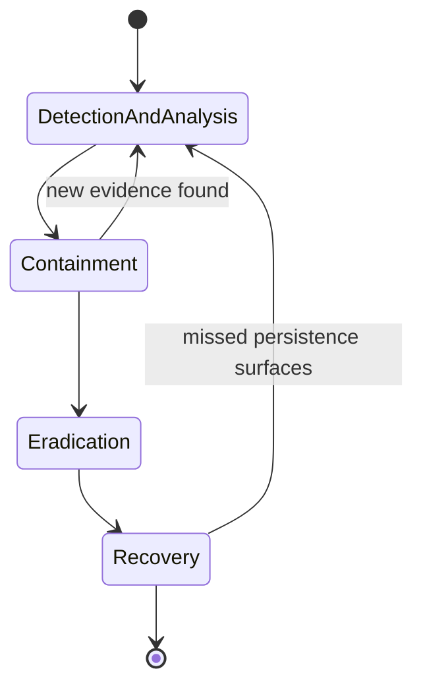

# Lab 9.4: Investigation

**Month:** 9 (Defensive Operations)
**Pattern family:** Detection and response
**Time budget:** 12 to 14 hours (across multiple sessions; the report is a third of it)
**Lab attempt floor:** multi-hour (3 hours of unaided investigation before any hint or walkthrough)
**AI guidance:** Restricted. This lab is alert-consumer judgment, not rule drafting; the drafting pattern does not apply to the investigation. AI is permitted only for concept orientation (explaining an unfamiliar artifact or log field) and, after the investigation is done, for the synthesis pattern in drafting the report. See "AI guidance for this lab" below. AI Provenance log mandatory.
**Prerequisites:** Labs 9.1 to 9.3 complete. You can read Windows and web logs, recognize attack signatures, and navigate ATT&CK. A free account on Blue Team Labs Online or LetsDefend. `SAFETY.md` and `AI-ETHICS.md` re-read.

## Why this lab exists

Until now you have been the detection engineer: you built the SIEM and authored the rules. Now you switch chairs and become the **alert consumer**, the SOC analyst who receives what a detection raised and has to decide, under time pressure, what actually happened. This is the role most defensive jobs hire for first, and it is a different skill from authoring rules. The engineer asks "what would make this fire when it should not?" The analyst asks "given that this fired, what is the story?"

The lab has two products. The first is the investigation itself: working a simulated incident on a training platform until you understand the attack from initial access to impact. The second, and the one that goes in your portfolio, is the writeup: a professional **incident-response report** (a structured document that tells an executive and an engineer what happened and what to do). The investigation teaches you to find the story; the report teaches you to tell it to people who were not there. Both are the job, and the report is the artifact a hiring manager will actually read.

You will use the **NIST SP 800-61** phases to structure the work, but as a framework for judgment, not a checklist to march through. Real incidents loop and double back; you will too.

**Recall first, from memory, before you read on:** name the four NIST SP 800-61 (Revision 2) phases in order, and then say in one sentence why a real incident rarely runs through them in that order. (Hold your answer. This lab is where you feel the difference between knowing the phases and using them as judgment.)

## The scope rule

You investigate on Blue Team Labs Online (free tier) or LetsDefend, platforms built and authorized for exactly this. The artifacts, logs, and captures they give you are theirs to give and are safe to analyze. You do not investigate, scan, or pull data from any real system, your own employer's included, under the framing of "practicing for this lab." The platform is the lab. If something in your own environment looks like a real incident while you are doing this month, that is a `SAFETY.md` matter (report it through the right channel), not a lab exercise.

## On flags, because these platforms use them

Blue Team Labs Online and LetsDefend gate progress with questions and, in places, flag-style answers. The no-flag rule holds exactly as in every other month: the tutor never confirms a flag or an answer. Submit your answers on the platform; the platform tells you if you are right. If you are stuck, the tutor will work the hint ladder with you on the investigation method, but it will not tell you whether your answer is correct, and you should never paste a flag or an expected answer to it. The investigation skill is the point; the platform's checkmark is just feedback.

## Learning objectives

By the end of this lab, you can:

- **Triage** a queue of alerts to fast verdicts: prioritize, disposition each as escalate or close, and record a one-line reason for a close.
- **Analyze** a simulated incident from alert to root cause, reconstructing what an attacker did across the available data.
- **Build** a defensible incident timeline from log evidence, with timestamps, sources, and the reasoning that connects events.
- **Produce** an indicators-of-compromise list and distinguish a real indicator from incidental noise.
- **Analyze** the observed attacker behavior against MITRE ATT&CK tactics and techniques.
- **Apply** the NIST SP 800-61 phases as a judgment framework: recognize which phase you are in, decide when to move, and explain a deliberate departure from the sequence.
- **Explain**, when the containment call is to observe and collect, how to preserve evidence defensibly: order of volatility, hashing each acquired artifact, and a simple chain-of-custody note.
- **Produce** a professional IR report (confidentiality notice, executive summary, scope and limitations, timeline, IOCs, recommendations) that serves both a non-technical decision-maker and a technical responder.

## Recognition cue

When an alert fires and you do not yet know the story, you reach for the IR phases to structure your thinking instead of thrashing, and you watch yourself for the first plausible theory that you might cling to past the evidence. When you have to explain what happened to someone who was not there, you reach for a timeline and an executive summary, not a log dump. This lab is where you build the analyst's discipline and the responder's voice.

## AI guidance for this lab

This lab is judgment under uncertainty, which is precisely what cannot be delegated. The restrictions are tighter than the rest of the month.

**Allowed, during the investigation:** Concept orientation only. If you hit an artifact or a log field you do not recognize (a Windows event ID you have not seen, a registry key, a particular log format), you may ask AI what it is, then verify against the authoritative documentation. This is the same narrow allowance as Month 6.

**Allowed, after the investigation is complete:** The synthesis pattern, for the report only. Once you have done the investigation yourself and reached your own conclusions, you may use AI to help draft and tighten the prose of the report, the way you would ask a junior to clean up a draft. You verify every factual claim against your own evidence; AI does not get to introduce a finding, an indicator, or a conclusion you did not establish yourself.

**Not allowed:** Asking AI to analyze the incident, identify the attack, or tell you what happened. Pasting the platform's artifacts, logs, or captures into a public AI service (this is the data-handling rule from `AI-ETHICS.md`, and lab data with indicators counts). Letting AI write a finding into your report that your evidence does not support. Asking AI whether your flag or answer is correct.

**Logged:** Your AI Provenance section records the concept-orientation lookups during the investigation and the synthesis use during the writeup, with the same discipline as always. Crucially, it records the line you held: that the analysis and every finding are yours, and AI touched only vocabulary and prose.

## How an investigation moves through the phases

You will move through the NIST phases, but not in a straight line. Picture it as a loop you re-enter, not a checklist you tick:


*Notice: the back-arrows are the point. Containment turns up new evidence; recovery exposes a persistence mechanism you missed. The phases tell you where you are so you can move deliberately, not march in order.*

## Tasks

### Task 1: Triage the queue, then select your incident (90 minutes)

Most defensive hires start in a **Tier-1** seat: a queue of alerts, an SLA clock, and a stream that is mostly benign or false. The skill there is not the deep dive; it is fast, disciplined verdicts and knowing what to escalate. You rehearse that here before you go deep on one case.

First, work a queue. On your platform's alert queue (the LetsDefend monitoring queue is built for exactly this; on Blue Team Labs Online use the available alert or investigation list), triage five to ten alerts to a verdict. For each, spend only a few minutes: read it, find the one pivot that decides it, and **disposition** it as either "true positive, escalate" or "false positive, close." Write one line per alert: the alert, the verdict, the single pivot that decided it, and, for a close, the reason you would record so the next analyst trusts the call. This is the close-as-benign discipline a real SOC lives by; a verdict with no recorded reason is not a verdict.

Then pick one alert that you dispositioned as a true positive (or the richest scenario available) to become your deep investigation for the rest of the lab.

Now write the pre-flight entry for that chosen case: what kinds of artifacts the scenario provides, what tools you will use to examine them, what could go wrong in your reasoning (confirmation bias toward the first plausible story is the classic analyst failure), and the authorization scope (the platform authorizes this). Skim the NIST SP 800-61 phase descriptions so the framework is fresh.

**Checkpoint:** you have a `queue-triage.md` (or a section in your notebook) with five to ten alerts, each dispositioned in one line (alert, verdict, deciding pivot, close reason where applicable), and a pre-flight section that names your chosen incident, the artifact types, your toolset, the reasoning failure modes you will watch for, and the scope. The NIST phases are reviewed.
**If not:** if every alert in your triage is a deep dive, you are not triaging; the point is a fast verdict and one deciding pivot per alert, not a full investigation of each. If you cannot name the artifact types for your chosen case, you have not opened the scenario yet; open it and skim what it provides before writing the pre-flight. If you skipped the failure-modes line, add it now, because Task 2 depends on you watching for confirmation bias.

### Task 2: Learn the investigation method (gradual release)

The new skill is reconstructing a story from evidence: turning raw log lines into a sourced timeline entry, and an entry into a working theory you keep testing. You will practice the method on a tiny invented snippet first, so you can see the technique without touching your graded scenario. The graded incident is Stage 3, and you must not look at its walkthrough.

#### Stage 1 - Worked example (I do)

Study how three raw log lines become one defensible timeline entry. These lines are an invented teaching snippet, not from any platform scenario:

```
2026-05-20 14:02:11  auth   user=jdoe  src=203.0.113.9  result=FAILURE
2026-05-20 14:02:19  auth   user=jdoe  src=203.0.113.9  result=FAILURE
2026-05-20 14:02:31  auth   user=jdoe  src=203.0.113.9  result=SUCCESS
```

Here is the reasoning, step by step:

1. **Read the raw evidence.** Two failures then a success for one account, all from one source address, inside twenty seconds.
2. **Form a careful claim, not a conclusion.** This *pattern* is consistent with a password-guessing attempt that succeeded. It is not proof; a tired user fat-fingering a password twice also fits.
3. **Look for what would tell the two apart.** Was the source address one `jdoe` normally uses? Were there failures against other accounts from the same source (spraying)? What happened in the session right after the success?
4. **Write the timeline entry with its source and its uncertainty stated:**
   `2026-05-20 14:02:31  Successful logon for jdoe from 203.0.113.9, immediately preceded by two failures from the same source (auth log). Significance: possible successful brute force; confidence raised or lowered by [the follow-up evidence you checked].`
5. **Map it to ATT&CK** as a hypothesis: this looks like T1110 (Brute Force), to confirm or drop as more evidence arrives.

Notice the discipline: every entry names its evidence source, states what it shows, and is honest about inference versus fact.

**Checkpoint:** you can explain, from the snippet, why "successful brute force" is a hypothesis to test rather than a fact, and you can name one piece of evidence that would raise your confidence and one that would lower it.
**If not:** re-read steps 2 and 3. The habit that matters is separating "this pattern is consistent with X" from "X happened." If you jumped straight to a conclusion, that is confirmation bias, and naming it now is the whole point.

#### Stage 2 - Faded practice (we do)

Now you build one timeline entry from a second invented snippet, still not your graded scenario. Here are four lines from a web access log:

```
2026-05-20 15:10:02  GET /index.php          200  src=198.51.100.7
2026-05-20 15:10:48  GET /admin              403  src=198.51.100.7
2026-05-20 15:11:30  GET /index.php?id=1'--  500  src=198.51.100.7
2026-05-20 15:12:05  GET /index.php?id=1     200  src=198.51.100.7
```

Fill in the method:

- TODO: which line is the suspicious one, and what attack does the `'--` payload suggest?
- TODO: write the timeline entry in the Stage 1 format (timestamp, event, source, significance), stating the inference honestly.
- TODO: name the ATT&CK technique you would map it to as a hypothesis.
- TODO: name one follow-up question whose answer would tell you whether the attempt worked.

**Checkpoint:** your single timeline entry names the 15:11:30 request, identifies it as a probable SQL-injection probe (the `'--` and the 500 error), states the significance with its uncertainty, and maps to a plausible technique, plus one follow-up question.
**If not:** if you cannot tell which line matters, compare the status codes and the URLs; the 500 on a quote-and-comment payload is the tell. If your entry states the attack as a fact, soften it to a sourced hypothesis, exactly as in Stage 1.

#### Stage 3 - Independent (you do)

No scaffolding, and the teaching snippets above do not count. Work your chosen platform incident to root cause yourself. The multi-hour floor (3 hours) applies in full: investigate unaided for at least three hours before any hint or walkthrough, and do not look up a writeup of the scenario. Reconstruct how the attacker got in, what they did, what they touched, and what they took or broke. Keep contemporaneous notes (timestamps, the event that prompted each step, what you found). Map behaviors to ATT&CK as you go. Note which NIST phase you are operating in and when you consciously move between them.

This is hard and it is meant to be. You will go down wrong paths; that is investigation. The notes you keep here are the raw material for the timeline and the report, so keep them well.

**Checkpoint:** you have a working set of investigation notes: a rough chronological reconstruction of the attack, the evidence behind each step, ATT&CK mappings, and your running sense of which NIST phase each part of your work fell in. You can show you worked the case yourself for the full floor before any assistance.
**If not:** if you are stuck before the floor is up, do not reach for a walkthrough; re-read your own notes for an event you have not yet followed, and pull that thread. If you formed a theory early and everything seems to confirm it, deliberately look for one piece of evidence that would *disprove* it; that is the cure for confirmation bias.

### Task 3: Build the timeline and extract IOCs (2 hours)

From your notes, build two structured artifacts. First, a clean incident timeline: each entry a timestamp, the event, the source (which log or artifact), and a one-line significance. Order it and make it readable by someone who was not there. Second, an **IOC list** (indicators of compromise: the hashes, IP addresses, domains, file paths, and account names that are genuine signs of this incident), each labeled with what it indicates. Be ruthless about the difference between an indicator and incidental noise; a list padded with every IP that appears in the logs is not an IOC list.

**Checkpoint:** you have a structured timeline (timestamp, event, source, significance) and an IOC list (indicator, type, what it indicates), both clean enough to drop into the report. Both built from your own investigation, not from a platform answer key.
**If not:** if your timeline reads as a log dump, add the "significance" column and cut entries that carry no meaning. If your IOC list is long, ask of each entry "would a responder act on this, and would acting break something benign?"; if it indicates nothing specific to this incident, cut it.

### Task 4: Write the IR report (3 to 4 hours)

Write the incident-response report. This is the month's deliverable; the full specification is in `../../deliverable.md`, and you should follow it precisely. In brief, the report has an executive summary (for a decision-maker who will not read the rest), a narrative and timeline of the incident, the IOCs, and recommendations (both immediate containment, eradication, and recovery, and longer-term, including the detections you would add, tied to your Lab 9.2 work). Write the report yourself; the synthesis pattern is permitted only to tighten prose, and every claim must trace to your own evidence.

Before you write the recommendations, reason through the live-response tradeoff the analysis side does not force you to face. At the moment you first confirmed the attacker's foothold, would you have isolated the host immediately or kept watching and collecting? Write a short reflection (a few sentences in your notebook, and a containment-timing line in the report's recommendations) that weighs what you gain and lose each way: isolating now stops the attacker but destroys volatile evidence (memory, live connections) and disrupts whatever the host runs for the business; watching longer preserves evidence and reveals scope but leaves the attacker active. Factor in business impact (is this a domain controller or a test box?) and the cost of acting on a theory you have not yet confirmed (isolating the wrong host, or blocking on a weak indicator, has its own price). There is rarely a clean answer; the judgment is naming the tradeoff and justifying your call, not finding a rule that removes it.

If your call is "observe and collect," say briefly how you would collect so the evidence holds up later: capture in order of volatility (memory and live connections before disk before logs), hash each artifact you acquire and record the hash (the Month 4 `shasum` habit, now applied to evidence), and keep a one-line chain-of-custody note per item. This is the collection half of the containment call, covered in the README concept chunk and required by `deliverable.md`.

Two more things the deliverable now requires, so build them in as you write: a one-line confidentiality and handling notice at the top of the report, and a short scope-and-limitations note in the overview (the log sources you had, the time window, and the blind spots, so the report does not imply it saw everything). And add one sentence of escalation-and-notification judgment: whether this incident, as scoped, would plausibly trigger a regulatory or contractual notification obligation, and which non-technical stakeholders (legal, communications, leadership) you would escalate to and when. That is a judgment prompt about the reporting clock, not legal advice.

**Checkpoint:** a complete IR report meets the structure in `deliverable.md`: a confidentiality notice at the top, a scope section that states its limitations, an executive summary genuinely readable by a non-technical decision-maker, a technical body actionable by a responder, every IOC and finding traced to evidence in your investigation, and recommendations that include a containment-timing call (isolate now versus observe) with its tradeoff stated, the collection discipline if the call was to collect, and a one-sentence escalation-and-notification judgment.
**If not:** if your executive summary uses terms a non-technical relative would not know, rewrite it for them (the same test as the Month 1 deliverable). If a recommendation is generic ("improve monitoring"), tie it to a concrete detection you could author for a specific technique on a specific log source. If your containment call has no downside stated, you have not engaged the tradeoff; name what isolating now would have cost. If your scope section implies you saw everything, add the blind spots; a real investigation names what it could not establish.

### Task 5: Notebook entry with AI Provenance (90 minutes)

Write `.tutor/notebook/lab-04-investigation.md`. Required sections:

- **Pre-flight check** (from Task 1).
- **Concept naming.** What did this lab teach? It is the alert-consumer's skill: reconstructing a story from evidence under uncertainty, and the judgment of when the NIST phases help and when they constrain.
- **Evidence:** your investigation notes, the timeline, the IOC list, and a link or reference to the report. Honor the no-flag rule; document your method and findings, not the platform's answer key, and do not paste flags here either.
- **Five-question debrief.** Question 4 (the failure mode that would have broken your first attempt) maps directly onto the wrong investigative paths you took; answer it honestly.
- **AI Provenance:** the concept-orientation lookups during the investigation (what you did not recognize, how you verified it), the synthesis use during the writeup (what prose help you took), and an explicit statement that the analysis and every finding are yours. If you used no AI, say so and why.

**Checkpoint:** the entry is committed with all sections and honest provenance.
**If not:** missing or shallow provenance means the entry is rejected. If you used AI only to clean prose, say exactly that and confirm in writing that no finding came from it.

## Definition of Done

You are done when all of these are true:

- You triaged a queue of five to ten alerts to one-line dispositions before going deep on one case.
- You investigated the incident to root cause yourself, with evidence that you worked the full floor before any assistance.
- A clean, sourced timeline and a disciplined IOC list exist, both built from your own investigation.
- The IR report meets the `deliverable.md` structure (including the confidentiality notice and the scope-and-limitations note), the executive summary is genuinely non-technical, and every finding traces to your evidence.
- At least one recommendation ties to a concrete detection you could author (referencing your Lab 9.2 work), and the recommendations state a containment-timing call with its tradeoff, the collection discipline if the call was to collect, and a one-sentence escalation-and-notification judgment.
- The notebook entry is committed with an honest AI Provenance section.

There is no self-verify command for this lab; the proof is that you can defend every finding from the evidence. The tutor will run the verification ritual on the report (an AI-touched artifact): it picks one finding or one timeline entry and asks you to walk through the evidence that establishes it, from memory, with no AI and no platform answer key open. This is the interview question "talk me through how you know the attacker did this." If every finding is one you can defend, you own the investigation. If one turns out to be borrowed from a walkthrough or smoothed in by AI, the report returns until it is yours.

**Self-explain:** in one sentence, why is "successful brute force" a hypothesis you keep testing rather than a fact you record, until the follow-up evidence is in?

## Stretch goals

1. After you finish and submit, read a published writeup of the scenario and compare it to your own reconstruction; note where you were right, where you missed, and why.
2. Write the Sigma rule (the Lab 9.2 skill) that would have caught this incident at initial access, and add it to your recommendations as a concrete detection.
3. Re-do your timeline as a one-page visual (a simple left-to-right sequence of the attack stages) suitable for the executive summary.
4. Apply the Pyramid of Pain to your IOC list: rank your indicators by how costly each would be for the attacker to change, and explain which ones are worth alerting on long-term.

## Troubleshooting

- **Confirmation bias.** You form a theory early and read every later piece of evidence as confirming it. This is the dominant analyst failure. When evidence does not fit your theory, suspect the theory, not the evidence.
- **A padded IOC list.** Dumping every IP, hash, and domain in the logs. An IOC is an indicator of this compromise, not an inventory of the environment. A responder who blocks your padded list breaks production and learns to distrust your reports.
- **Treating the NIST phases as a checklist.** Marching the phases in order regardless of what the incident is doing. Use them to know where you are, then move deliberately; real incidents loop.
- **An executive summary written for engineers.** The summary is the only part a decision-maker reads. If it assumes they know what Kerberos is, it has failed. Write it for your smartest non-technical relative.
- **Reaching for a walkthrough before the floor is up.** These scenarios have writeups online. Reading one before your three hours are done turns investigation practice into reading comprehension, and the verification ritual will expose it.

## Time budget breakdown

- Task 1: 90 minutes (about 45 min of queue triage, then the pre-flight and incident selection)
- Task 2: 90 minutes (Stage 1 about 30 min, Stage 2 about 60 min; this folds into the start of Task 2's investigation)
- Task 3: 2 hours
- Task 4: 3 to 4 hours
- Task 5: 90 minutes
- The investigation itself (Stage 3): 4 to 6 hours

Total: 12 to 14 hours. The investigation (Stage 3) and the report (Task 4) are the substance; protect their time. The queue triage in Task 1 is meant to be fast: a few minutes per alert, not a deep dive.

## Resources

- NIST Special Publication 800-61 (Revision 2 for the four-phase incident-handling lifecycle that most reports are still structured around; Revision 3, 2025, for the reframing of incident response as risk management aligned to CSF 2.0). Read both lenses; the tension is the lesson.
- The MITRE ATT&CK website, for mapping attacker behavior to tactics and techniques as you investigate.
- Your chosen platform's own guidance: Blue Team Labs Online's investigation framework, or LetsDefend's analyst workflow documentation.
- A published, professional IR report template or a real public incident report (a vendor's or a CERT's post-incident report) to model the structure and register of your writeup. See `deliverable.md` for what the structure must contain.
- Your own Lab 9.2 detections, which your recommendations section will reference: "a detection for this technique would have caught this earlier" is the strongest kind of recommendation.
