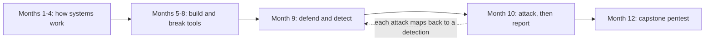
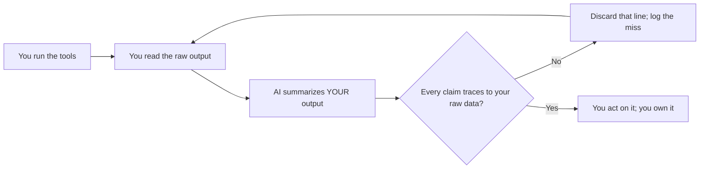

# Month 10: Offensive Operations (Red Team Intro)

**Pattern family:** Offensive operations and reporting
**Time budget:** 74 hours. This is the heaviest offensive month and it runs long. Plan it as a longer calendar month, the way the Month 12 capstone is paced, rather than forcing it into four standard weeks. At the course's 10 to 15 hours per week, 74 hours is closer to six weeks than four. Do not crunch it into four; the floor and the discipline matter more here than the calendar.
**AI guidance:** AI help is limited to one pattern this month: **recon synthesis**. AI may summarize evidence you gathered yourself. It may never find things for you. Read "AI augmentation this month" before your first lab. The hard rules below are absolute. The AI Provenance log stays mandatory in every notebook entry.
**Prerequisites:** Months 1 to 9 complete. You can read a packet capture (Month 4), reason about ports, services, and protocols (Months 3 and 4), script in Python and Bash (Months 2 and 5), navigate Windows and Active Directory at a conceptual level (Month 6), exploit a web application in a lab (Month 7), and write a professional incident report (Month 9). This month flips the Month 9 lens. You attack so you can defend better, and you write up the attack the way a paid consultant would.

## Read this before anything else: the mandatory ethics talk

Stop. Before you read another line of this month, open `SAFETY.md` at the repo root and read it end to end. Then open `AI-ETHICS.md` and read it end to end. This is not a formality. This is the month where the gap between a legal action and a federal felony is, as `SAFETY.md` puts it, sometimes one click.

Here is the rule, stated again so you cannot say you missed it:

**You may only scan, enumerate, exploit, or otherwise touch systems you clearly own or have explicit written permission to test. There are no exceptions.**

For this month, that means your legal targets are exactly three kinds, and nothing else:

- **HackTheBox machines** reached over HackTheBox's own VPN. HTB authorizes the activity through its terms of use. That authorization covers the boxes on HTB infrastructure, reached through the HTB VPN. It covers nothing on the wider internet that you happen to route to while connected.
- **TryHackMe rooms** you access through the TryHackMe platform. The room is the authorized target. TryHackMe's terms authorize the activity inside the room.
- **Lab infrastructure you own and run on your own hardware**, on a host-only or NAT network you control. This is two things, both resting on the same authorization basis (you own the metal it runs on): **VulnHub virtual machines** you downloaded, and **the small Active Directory domain you built in Month 6**, which you attack in Lab 10.2. The VM and the domain are yours. They run on your metal. You may do anything to them.

That is the complete list. Read what it leaves out, in `SAFETY.md`'s own words: not your employer, not your school, not a friend's machine with spoken permission, not a public website "just to see if it has SQLi," not the coffee-shop network, not anything you do not own and cannot point to written permission for. The tutor will refuse to help with any work that touches a target outside the three kinds above, and it will keep refusing if you push. That refusal protects you from a criminal charge. It is not the tutor being precious.

One more rule becomes real this month for the first time: **you will see things that are out of scope.** A scan set wrong by one CIDR digit hits a host you did not mean to touch. A box turns out to be built on a real product with a real CVE. Your VPN routes somewhere you did not expect. `SAFETY.md` has a decision tree for exactly this. You will practice it in Lab 1, and you will be expected to follow it for the rest of your career. When in doubt, do less, not more. Doing nothing has rarely been a crime. Over-eager testing often has been.

If you have not re-read `SAFETY.md` in the last hour, do it now. The rest of this month assumes you have.

## Overview

You have spent nine months learning to build, configure, and defend. This month you learn to attack, for one reason: you cannot defend a system whose attack paths you have never walked. A blue-team analyst who has never enumerated a host, never chained a misconfiguration into a shell, never escalated from a low-privilege user to root, is guessing at what the red team did. After this month you will not be guessing.

The goal is not to make you a penetration tester in four labs. It is to give you the attacker's mental model: reconnaissance, enumeration, exploitation, post-exploitation, and the discipline to write all of it up as if a client were paying for the report. That model makes your defensive work sharper. The three reports you produce are the artifact a hiring manager will read to decide whether you can think like an attacker.

> **An honest boundary: this is penetration testing, not full red teaming.** The subtitle says "Red Team Intro," and the word "red team" gets used loosely, so be precise about what this month is and is not. This month teaches **penetration-testing methodology** (the engagement workflow you will learn below) and the **basics of Active Directory attacks**. You will run the full entry-level internal-engagement arc against authorized lab targets and the domain you built and own in Month 6: **network-level credential bootstrapping** (Responder/LLMNR poisoning to capture a NetNTLMv2 hash, NTLM relay as a concept, password spraying with NetExec, and AS-REP roasting), then **kerberoasting, pass-the-hash, and lateral movement**, and the **pivoting and tunneling** that lets you reach a network segment your foothold cannot touch directly. Those are taught here, not silently skipped. What a real **red-team engagement** layers on top, and what this month deliberately leaves out, is a different discipline: **OPSEC** (operating quietly so a defender does not notice you), **EDR and antivirus evasion** (getting past the endpoint defenses a real network runs), **C2** (command-and-control infrastructure to manage access), payload delivery, and **assumed-breach** operating (starting as if already inside). Those are out of scope for two reasons: they are a separate skill set, and teaching evasion against the EDR-free training boxes this month uses would teach the wrong lesson. Knowing this boundary is itself a tradecraft lesson. If you put "red team" on a resume off this month alone, the first OPSEC or EDR-evasion question in an interview will expose the gap. Say instead, truthfully, that you can run a penetration test end to end, bootstrap a first credential from raw network access, execute the AD attack basics, and pivot through a foothold, and treat real red-team tradecraft as a deliberate next step after this course.

Here is where this month sits in your year, and why its place matters:

*Notice: the dotted arrow. Everything you do offensively this month points back at a defense from Month 9. You learn offense inside a defender's course on purpose.*

This is also where tool selection and **tradecraft** (the craft of doing the work well, quietly, and on purpose) matter more than any single tool. The course is not teaching you to press the buttons on Metasploit. It is teaching you to know which tool fits a situation, which tool is wrong for it, and when the right move is to use no automated tool at all and read the service by hand. That judgment is the difference between someone who ran a scanner and someone who ran an engagement.

## Warm-Up: Retrieve Before You Begin

Answer these from memory, no peeking at earlier months, before you read on. This pulls forward the prior-month skills this month leans on.

1. From Month 4: what are the three packets of the TCP handshake, and what does it mean when a connection attempt gets no reply at all?
2. From Month 9: what is a detection rule, and what kind of log evidence does one usually match on?
3. From Month 2: what is a SUID binary, and why is one that runs a shell dangerous?
4. From Month 7: name two web vulnerability classes you exploited in a lab, and how you confirmed each.

Check your recall

1. SYN (client to server), SYN-ACK (server to client), ACK (client to server). No reply at all usually means a firewall is silently dropping the probe, which a scanner reports as "filtered." From Month 4 packet analysis.
2. A detection rule matches a pattern in evidence (log lines, process events, network flows) and raises an alert. You wrote these against SIEM data in Month 9.
3. A SUID binary runs with the file owner's privileges, not the caller's. One that can spawn a shell lets a normal user run that shell as the owner (often root). From Month 2 Linux permissions and your GTFOBins work.
4. Examples: SQL injection (confirmed by a payload that changes the query's logic, like an always-true clause), IDOR (confirmed by changing an ID and reaching another user's data), file upload, broken authentication. From Month 7.

## Learning objectives

By the end of this month, you can:

- **Explain** the phases of a penetration test (scoping, reconnaissance, enumeration, exploitation, post-exploitation, privilege escalation, reporting) and name the artifact each phase produces.
- **Reconcile** the rules of engagement of a simulated assessment and defend why a given action is in scope or out of scope.
- **Analyze** the output of an enumeration tool and decide what is signal, what is noise, and what to investigate next, with no walkthrough.
- **Defend**, in writing, when a recon or enumeration technique should not be used (too noisy, too fragile, out of scope, too easy to detect), and pick the right tool for the task.
- **Build** a manual exploitation path when an automated tool is the wrong choice, and explain why the manual path was correct.
- **Deliver and stabilize a foothold:** explain reverse versus bind shells and why the network decides, and upgrade a raw shell into a usable terminal, practiced on a VM you own.
- **Explain** how a tester with no credentials bootstraps the first one from raw network access (Responder capturing a NetNTLMv2 hash, NTLM relay, a NetExec password spray, AS-REP roasting), what each does on the wire and what it leaves behind, and practice the safe ones against the Month 6 domain you own.
- **Execute** the basic Active Directory attacks (kerberoasting with an offline crack, pass-the-hash, and lateral movement) against an authorized lab room and the Month 6 domain you own, and tie each to the Month 6 defender's view.
- **Build** a pivot through a foothold to reach a host on a network segment you cannot route to directly, using SSH dynamic port-forwarding with proxychains, and name the modern purpose-built tools (ligolo-ng, chisel).
- **Produce** a professional penetration-test report with scope, methodology, findings rated by severity, and remediation advice, containing no flags.
- **Apply** the recon-synthesis AI pattern: summarize evidence you gathered yourself, check every summarized claim against your raw output, and reject any AI use that crosses the hard rules.
- **Reconcile** your own attack path against the detections you wrote in Month 9: what would have caught you, and what would not.

## Recognition cue

When you are looking at a host and do not know what to do next, the gap is almost always too little enumeration, not too little exploitation. This month trains the reflex: when stuck, enumerate more, not harder. When you reach for an exploit before you can name three things about the service, that is the cue to slow down and go back to recon.

The second cue is ethical. The moment you think "I could just point this at a real target to see," that is the cue to stop and re-read `SAFETY.md`. Your lab targets are real targets, and they are yours.

## Core concepts to internalize

Read these to understand the labs, not to memorize them. Each chunk is one idea. New terms are bold and defined on first use.

### The engagement workflow

An **engagement** is a single authorized test of a system, start to finish. It runs in the same order every time, whether it lasts a day or a month: **scoping** (agree on what is in and out of bounds), **reconnaissance** (learn about the target), **enumeration** (dig into each service in detail), **exploitation** (use a weakness to get in), **post-exploitation** (look around once inside), **privilege escalation** (gain more power on the host), and **reporting** (write up what you found). Each phase produces an artifact: scoping produces the rules of engagement, recon and enumeration produce notes, exploitation produces a foothold, and reporting produces the document a client pays for.

> **Common misconception.** "Exploitation is the main event; recon and enumeration are warm-up."
> **Reality.** Enumeration is where engagements are won. Most stuck moments are an enumeration gap, not an exploit gap. The exploit is usually short and obvious once you have enumerated enough to see the way in. The belief is tempting because exploitation is the dramatic part, so beginners rush to it.

### Kali Linux and "it is on Kali" is not a reason

**Kali Linux** is a Debian-based Linux distribution that ships with offensive tools already installed. Operators use it because it saves setup time. But "it is on Kali" is not a reason to run a tool you cannot explain. The tool leaves traces, takes actions, and can break a target. You own every command you run.

### Reconnaissance: passive versus active

**Reconnaissance** (recon) is learning about a target. It comes in two kinds. **Passive recon** (also called **OSINT**, open-source intelligence) is what you can learn without touching the target at all: public records, search results, leaked data. **Active recon** is what you learn by sending packets to the target, like a port scan. The tradeoff is detectability against completeness. Passive recon is invisible but shallow. Active recon is thorough but noisy, because every packet can be logged.

The standard passive-recon toolkit, so you can name a tool and not just the concept: **whois** (registration and ownership records for a domain or IP); **dnsrecon** and **dnsenum** (pull DNS records and probe for host names); **amass** and **subfinder** (enumerate a domain's subdomains from public sources); **theHarvester** (gather email addresses, host names, and employee names from public search data); and **Shodan** (a search engine for internet-exposed services, so you can see what a target already advertises without scanning it). These read public sources, but read this caveat carefully: **a target being publicly searchable does not make it authorized.** OSINT against a domain or organization you do not own and have no written permission to assess is still out of scope, exactly as a port scan would be. Passive does not mean permitted. Point these tools only at a target you own or are explicitly authorized to research.

Naming the tools is the easy half. The tradecraft is knowing **when passive, when active, and why**, because passive recon is the phase where a real engagement decides whether to go loud at all. You start passive when the target is large, when stealth matters, or when you do not yet know enough to scan efficiently. You go active once passive intelligence has told you where to point a scan. The point of OSINT is not the tools; it is that each finding feeds a concrete next move:

- **Subdomains** from `amass` or `subfinder` become the scope for active content discovery. You do not scan a `/16` blind; you scan the `dev` and `staging` hosts OSINT just handed you.
- **Employee names** from `theHarvester` become a **username list**, which is the input to a password spray and to AS-REP roasting (both in the credential-bootstrapping section below). This is the OSINT-to-spray-list pipeline that connects passive recon directly to your first credential.
- **Exposed services** from Shodan tell you which active scan is worth the noise, so your first loud packet is aimed, not random.

A passive pass that ends in a tool inventory is half-done. A passive pass that ends in "here is the one finding I will act on first, and the active move it justifies" is recon. Lab 10.2 Task 1 asks you to name that one finding, not just list what you ran.

### Enumeration: the phase that wins engagements

> **Heavy concept ahead.** Slow down here. This is the load-bearing idea of the month.

**Enumeration** is the slow, careful, service-by-service investigation of a target. For each open service you ask: what version is it, how is it configured, what users exist, what shares are exposed, what endpoints are reachable. This is the most undervalued phase and the one that separates operators from button-pushers. Current tooling matters here. Prefer **enum4linux-ng** (the maintained successor) over the older `enum4linux`. Use **NetExec** (the maintained successor to CrackMapExec) for SMB and Active Directory enumeration. Use **ffuf** or **feroxbuster** for content discovery (finding hidden web pages and directories).

A point about tool selection that comes up immediately: **nikto** is a web scanner that is loud, dated, and a poor first instrument. It announces itself in every log. Reach for it knowingly, late, and never as your opening move. Knowing when *not* to use a tool is as much a skill as knowing how to use one.

> **Common misconception.** "More scanners equals more findings, so run all of them."
> **Reality.** Most findings come from reading a few services carefully, not from spraying every tool at a host. Extra scanners add noise to your own notes and to the target's logs, and they get you detected. The belief is tempting because running a tool feels like progress; reading output patiently does not, yet it is the work.

### Exploitation: choosing between Metasploit and manual

**Metasploit** is a framework of ready-made exploit modules. It is excellent when a module fits your target exactly. **Manual exploitation** means doing the attack by hand, without a module. You go manual when Metasploit is wrong: the module does not support a tweak you need, the module crashes the target, or you need to understand the exploit well enough to adapt it. The skill is choosing, not button-pressing. A module that fires in one command teaches you nothing if you cannot say what it did.

### Foothold delivery: shells, listeners, and stabilizing a session

Exploitation usually ends in **code execution**: you can run a command on the target. The next problem is turning that into a usable **shell** (an interactive command session you control). Beginners get stuck here more than anywhere else, so learn the mechanics as concepts before a box forces them on you.

A **reverse shell** has the target connect back to you: the target runs code that opens a connection to your machine, where a **listener** is waiting to catch it. A **bind shell** is the opposite: the target opens a port and waits, and you connect to it. The network usually decides which one works. Most targets sit behind a firewall or NAT that blocks new inbound connections, so a bind shell (you connecting in) often fails, while a reverse shell (the target connecting out) often succeeds. That is why reverse shells are the common default: outbound is usually allowed, inbound usually is not.

A **listener** is just a program waiting on a port for that incoming connection (`nc -lvnp <port>` is the classic; a Metasploit handler is the heavier version). The reverse-shell payload is the small piece of code the target runs to call home; you understand its shape (connect to my IP and port, attach a shell to the connection) rather than memorizing a copy-paste one-liner.

The shell you first catch is usually a **raw, non-interactive shell**: it has no job control, no tab completion, no command history, and it dies if you press Ctrl-C. Making it usable is **stabilizing** (also called a **PTY upgrade**, after the pseudo-terminal it gives you). The standard workflow is: spawn a proper terminal on the target (commonly with a Python one-liner such as `python3 -c 'import pty; pty.spawn("/bin/bash")'`), then adjust your own terminal so signals and sizing pass through correctly (the `stty raw -echo` step, plus exporting a `TERM`). You do not need to memorize the incantation; you need to know that a fresh shell is fragile and that stabilizing it is a known, ordinary step, not a sign something is wrong.

> **Common misconception.** "Once the exploit runs, I have a normal terminal on the target."
> **Reality.** You usually have a brittle, half-broken shell that dies on Ctrl-C and cannot run an interactive program. That is expected. Stabilizing it (a PTY upgrade) is a routine step, and not knowing it exists is what sends new operators to a walkthrough at the exact moment they got in.

### Post-exploitation and privilege escalation

**Post-exploitation** is what you do once you have a foothold (any access on the target): get situational awareness, hunt for credentials, look for a way up. **Privilege escalation** (privesc) is gaining more power on the host, usually from a low-privilege user to root (Linux) or SYSTEM (Windows). On Linux the common surfaces are **SUID binaries** (files that run as their owner), **sudo misconfigurations**, **cron jobs**, and **capabilities**; **GTFOBins** is a reference catalog of Unix binaries with privileged uses. On Windows the surfaces are service misconfigurations, token privileges, and unquoted service paths; **LOLBAS** is the Windows equivalent reference. Enumeration scripts (**linpeas**, **winpeas**, **pspy**) surface candidates. You decide which are real.

### Pivoting and tunneling: reaching what your foothold cannot

Internal engagements are won and lost on **network positioning**. Once you have a foothold, the interesting hosts (the domain controller, the database tier) often sit on a network segment your own machine cannot route to. Your foothold can reach them; you cannot reach them directly. **Pivoting** is using that foothold as a route: you send your traffic through the compromised host so it arrives from a place that can reach the target. **Tunneling** is the mechanism that carries it.

The scenario, stated plainly: the target is on a segment you cannot reach directly, and you have a shell on a host that can reach both you and the target. How do you route through the foothold? The intro-level baseline is two tools you already half-know:

- **SSH dynamic port-forwarding.** If your foothold runs SSH (or you can reach an SSH service from it), `ssh -D 1080 user@foothold` opens a local **SOCKS proxy** on your machine. Traffic you send into port 1080 comes out of the foothold, on the foothold's network, where it can reach the segment you could not. One SSH flag turns a foothold into a router.
- **proxychains.** Most tools do not speak SOCKS on their own. **proxychains** wraps a command and forces its connections through your SOCKS proxy, so `proxychains nmap ...` or `proxychains nxc ...` runs from your machine but arrives from the foothold. SSH dynamic forwarding plus proxychains is the baseline pivot, and it is enough for this course.

When SSH is not available or the topology is harder, operators reach for purpose-built tools. Name them so the vocabulary is yours: **ligolo-ng** and **chisel** are the current, maintained tunneling tools that build a routed pivot without needing SSH on the foothold. You do not have to master them this month; you have to know what problem they solve, and to have reached one host through another at least once before the capstone asks you to.

> **Common misconception.** "If I cannot reach a host from my machine, it is out of reach."
> **Reality.** A host you cannot route to directly is often one SSH tunnel away through a foothold that can. A single directly-reachable target is the lab simplification; a real network is segments, and reaching the next one through the last is the core internal-engagement skill.

You practice this against your own isolated lab in Lab 10.4: a foothold VM with a second interface onto a segment carrying a host you cannot reach directly, then route through the foothold to it. The scope is the same cleanest authorization as the rest of your owned lab: your VMs, your hardware, an isolated network you control, no third party.

### Network-level credential bootstrapping: the first move on an internal network

> **Heavy concept ahead.** This is the opening move of an internal penetration test, and the question an entry-level interview opens with. Slow down here.

The Active Directory attacks below all start from a position you do not have yet: they assume you already hold a domain credential. So pose the question that comes first. **You are plugged into a client's internal network. You have no credentials. Nothing is popped. What is your first move?** The answer is **credential bootstrapping**: turning raw network access into your first credential. On most flat internal networks this is faster than first compromising a host. Learn it concept-first, what each technique does on the wire and what it leaves behind, then practice the safe ones against the Month 6 domain you own.

- **Responder and LLMNR/NBT-NS poisoning.** When a Windows machine cannot resolve a name through DNS, it falls back to **LLMNR** and **NBT-NS**, two legacy link-local name-resolution protocols that ask the whole local segment "does anyone know this name?" These are trusting by design: any host can answer. **Responder** answers, claiming to be the host the victim was looking for. The victim then tries to authenticate to Responder, and in doing so hands over a **NetNTLMv2** hash, a challenge-response value derived from the user's password. On the wire it is a poisoned name-resolution reply followed by an authentication attempt aimed at you. What it leaves: the victim logged a failed or redirected authentication, and you now hold a hash you can crack offline or relay.
- **NTLM relay.** Instead of cracking the captured NetNTLMv2 hash, you can **relay** it: forward the victim's authentication, live, to a third machine that will accept it, and you authenticate as the victim without ever knowing the password. The standard tool is `ntlmrelayx` from Impacket; NetExec can drive related steps. Relay is concept-first here for a real reason: a domain controller with SMB signing required (the modern default) refuses a relayed SMB session, and a two-host lab gives you almost no valid relay target, so you learn what relay is on the wire rather than staging it. The defense is the lesson: **SMB signing** and disabling LLMNR/NBT-NS shut this down.
- **Password spraying.** Rather than many passwords against one account (which locks it out), you try **one likely password against many accounts** (`Spring2026!` against every name on your list), staying under the lockout threshold. The username list comes from the OSINT step above. **NetExec** sprays a credential across hosts and accounts and tells you where it works. On the wire it is a low, slow trickle of authentication attempts; what it leaves is a scatter of failed logons that a defender who is watching can catch.
- **AS-REP roasting.** Some accounts are configured with Kerberos pre-authentication disabled. For any such account, the domain controller will hand out an **AS-REP** message encrypted with the account's password hash, **to anyone who asks, with no credential required**. You request it, take it offline, and crack it, exactly like kerberoasting but needing only a username, not a prior login. It is the direct sibling of the kerberoasting you learn below: both are offline Kerberos credential attacks, both entry-level. The difference is that AS-REP roasting needs no credential at all, which is why it belongs in the bootstrapping phase.

> **Common misconception.** "You need a credential before you can do anything on a domain."
> **Reality.** AS-REP roasting needs only a username list, and Responder needs only to be on the segment when a machine mistypes a name. Both can hand you a crackable secret from a position of zero credentials. The chain does not start at kerberoasting; it starts one step earlier, here.

The authorization is clean, and it is the cleanest you have: you run these against **the Month 6 domain you built, on its own isolated network, on hardware you own.** This is **wired link-local** poisoning of your own VMs on a segment you control. It is not Wi-Fi: the wireless attacks `SAFETY.md` excludes (line 97) are a separate matter, and nothing here touches them. There is no third party on an isolated owned lab, so the `AI-ETHICS.md` rule-4 concern about capturing someone else's authentication never arises. The safe, self-contained practice on your own domain is: Responder capturing a NetNTLMv2 hash, a NetExec password spray, and AS-REP roasting (which needs only a username list, ideal on your own domain). Relay stays a wire-level concept. And the absolute rule stands: a captured NetNTLMv2 hash or a Kerberos ticket is exactly the kind of recovered secret you **never** paste into a public AI service (`AI-ETHICS.md` rule 4).

### Active Directory attacks: the core of internal pentesting

In Month 6 you built a small **Active Directory** (AD) domain, learned the **Kerberos** ticket flow, and studied four attacks (pass-the-hash, kerberoasting, golden ticket, lateral movement) at the conceptual level. This month you run three of them, against authorized lab targets and against the domain you own. AD is where most real internal-pentest and entry-level red-team work lives, so this is not a side topic. It is the part of the month most likely to come up in an interview for those roles.

Three attacks you will execute, each tied back to the Month 6 model:

- **Kerberoasting.** Any authenticated domain user can request a **service ticket** for a service account, and part of that ticket is encrypted with the service account's password hash. You request the ticket, take it offline, and crack the hash without ever touching the domain again. The signal is a service account with a weak password; the offline crack is why it works.
- **Pass-the-hash.** **NTLM** lets a password hash be replayed directly: if you steal a user's NTLM hash, you can authenticate as that user without ever cracking it. You do not need the plaintext, only the hash.
- **Lateral movement.** Once you hold a credential or a hash for an account that is valid on another host, you move host to host with it, repeating enumeration and credential-gathering on each, working toward the domain controller.

The tooling, all current and maintained: **BloodHound** (with the **SharpHound** collector) maps the domain and shows you attack paths as a graph, so you see which accounts reach which hosts; **NetExec** (the maintained successor to CrackMapExec) enumerates SMB and AD and sprays a hash or credential across hosts; the **Impacket** suite gives you the execution tools (`secretsdump` to pull hashes, `wmiexec` or `psexec` to run commands on a remote host with a credential or hash); and a hash you recover is cracked offline with **hashcat** or **John the Ripper**. You will run these against the Month 6 domain you own (the required, always-available target: you built it, it runs on your hardware, it is yours to attack) and, if the TryHackMe path's AD rooms are in the free tier, against a TryHackMe AD room as a second run.

> **Common misconception.** "Active Directory attacks are advanced red-team material, beyond an intro."
> **Reality.** The basics (enumerate the domain, kerberoast a weak service account, reuse a hash to move laterally) are core entry-level internal-pentest work, and you already have the mental model from Month 6. What is genuinely advanced, and out of scope here, is doing all of it quietly against a domain defended by EDR. See the honest boundary in the Overview.

### Reporting: the artifact that gets you paid

The **report** is the deliverable that gets you paid in the real world. It has four parts a defender can act on: scope, methodology, findings with a severity rating, and recommendations. The report contains methodology, never flags. A **flag** is a token a CTF platform uses to confirm you solved a box; it proves nothing to a client and has no place in a professional report.

## AI augmentation this month: recon synthesis only

This month's AI pattern is the narrowest in the course. Read this section twice.

**The recon-synthesis pattern.** You gather reconnaissance and enumeration output yourself, by running the tools and reading the results. Once you have the raw output in front of you, you may ask AI to **summarize and organize what you already found**: "here are 60 lines of `nmap` and `enum4linux-ng` output that I collected; summarize the attack surface and group the services." AI acts as a junior who tidies your notes. You check every line of the summary against your raw output, because the junior will confidently invent a service that is not there.

The loop is small and strict:

*Notice: AI never appears before you have already run the tools and read the results. It only tidies what you found. It never finds.*

**What this pattern is not, and the hard rules.** These are absolute. They are not softened for "lab purposes," and the tutor enforces them strictly:

- AI is **never** used to *find* things for you. It does not choose your target, suggest what to scan, decide your next move, or tell you which port is interesting. You find. AI summarizes what you found.
- AI is **never** used to generate exploit code, payloads, or commands targeting any system you do not own. Not for an HTB box, not for a TryHackMe room, not "just to see the structure." The HTB box is authorized for you to attack by hand. It is not authorized for you to have an AI write the attack. Re-read `AI-ETHICS.md` rule 5 and decision-tree question Q3.
- AI is **never** used to bypass a safety filter, jailbreak a model, or coax offensive content out of a model that declines to produce it. If a model refuses, that is the end of it. Studying jailbreak technique is a Month 11 topic, against authorized targets only.
- You do not paste box content that includes credentials, hashes, tokens, or keys into a public AI service, even from a deliberately vulnerable VM (`AI-ETHICS.md` rule 4).

> **Common misconception.** "On a deliberately vulnerable box that I am allowed to attack, having AI write the exploit is fine, because the target is a lab."
> **Reality.** The box's authorization covers *you* attacking it by hand. It does not extend to an AI writing the attack, and the habit you build on a lab box is the habit you carry to a real one. The rule protects the habit, not the box. The belief is tempting because the box "does not matter," but the discipline is exactly what matters.

If you ever catch yourself thinking "this would be easier if I just asked AI to write the exploit," that is the trap `AI-ETHICS.md` names. The friction is the curriculum. Stop, close the AI session, and do the work. The junior's job this month is the smallest it has been: read your own notes back to you, more neatly. That is all.

## The AI Provenance log (mandatory, as since Month 5)

Every lab notebook entry this month includes an "AI Provenance" section. Without it, the lab notebook gate rejects the entry. The section documents:

- **Which AI tool** you used (model and interface).
- **What you asked** (the prompts, word for word for anything substantive). For this month, the prompt should make clear you supplied the raw data and asked only for synthesis.
- **What was generated** (the summary and its length).
- **What verification you ran** (the specific check: "compared each service in the summary against my `nmap` output line by line; the summary claimed an SMTP service on port 25 that my scan did not show, so I discarded that line").
- **What you discarded** as wrong. In recon synthesis, the discards are where the value is. AI inventing a service that is not in your output is exactly the failure the verification habit is built to catch.

## The verification ritual

For any AI-assisted artifact in your notebook (here, a recon summary), the tutor picks one claim from it and asks you to point to the raw output that supports it, from memory, with your AI session closed. If you cannot show where the summary's claim came from in your own data, the summary returns. This is the in-course version of the engagement reality: you sign the report, so every sentence in it must trace to evidence you can produce.

## Labs

Four labs, building from guided platform tracks to full independent boxes to a focused privilege-escalation drill. Complete in order. Each assumes the tradecraft the previous one built. Full specs in each lab's directory. The platforms and the scope rationale are in `ctf-set/README.md`.

| Lab | Directory | Time | What you build |
| --- | --------- | ---- | -------------- |
| 10.1 HackTheBox Starting Point | `labs/lab-01-htb-starting-point/` | 14 to 16 h | The enumeration reflex, the engagement workflow on rails, and shell handling |
| 10.2 TryHackMe Jr Penetration Tester | `labs/lab-02-tryhackme-jr-pentester/` | 22 to 26 h | A technique vocabulary (recon, enumeration, web, Metasploit), credential bootstrapping, plus Active Directory attack execution |
| 10.3 Three Full Boxes | `labs/lab-03-three-full-boxes/` | 20 to 24 h | Three professional pentest reports (the deliverable) |
| 10.4 Privilege Escalation Paths | `labs/lab-04-privesc-paths/` | 12 to 14 h | Privilege escalation as a methodology, Linux and Windows, plus a pivot through a foothold |

Every lab carries a hard scope rule baked into its text. Re-read each lab's "scope rule, first" section before you run anything. No lab records flags, in notes or in reports. The tutor never confirms a flag.

## Weekly rhythm and the warm-start

This is the heaviest offensive month, and at 74 hours it runs longer than a standard four-week month: at 10 to 15 hours per week that is roughly six weeks, not four. Treat it like the capstone, a longer calendar block, and work the four labs in order, with the deliverable taking shape in Lab 10.3. Do not compress it into four weeks; the per-week cadence you have held all year should hold here too, the month is simply longer. **The first week opens with a warm-start that keeps a prior skill alive:** before any new offensive work, re-run your Month 5 port scanner against your own VulnHub VM and re-read one Month 9 detection rule. Then write one sentence on what your scanner traffic would look like to that rule. This wakes up both halves of your brain, the attacker and the defender, before you start.

## The cold-revisit week

The midpoint of this longer month is a cold revisit, and it reaches across the whole course. The tutor pulls a Month 4 PCAP and asks which of your Month 10 scans would have produced traffic like it; pulls a Month 9 detection rule and asks whether your own enumeration in Lab 1 would have tripped it; pulls a Month 7 web finding and asks you to re-exploit it cold against your own lab app. This is by design. The offensive labs teach attack. The cold revisit forces you to hold attack and defense in the same head at once, which is the whole point of learning offense in a defender's curriculum.

## Notebook entry requirements

Each lab produces a notebook entry at `.tutor/notebook/lab-NN-<slug>.md` with the standard sections, **plus** the mandatory AI Provenance section:

- **Pre-flight check** for any new tool: what it does at a packet, syscall, or filesystem level; what artifacts it leaves on the target and on your own system; what could go wrong; and the legal authorization scope (which of the three legal target kinds this run falls under).
- **Concept naming.** Name what the lab taught, in your own words.
- **Evidence:** command output, screenshots, methodology notes. Never a flag. If you record a flag in your notebook, redact it. The notebook is a methodology record, not a flag store.
- **Five-question debrief:**
  1. What did this lab teach? Name the concept or technique.
  2. What system behavior or input shape tells you to reach for it?
  3. What artifact did you produce, and what would dominate at scale?
  4. What edge case or failure would have broken your first attempt?
  5. What would you do differently in three weeks when you redo it cold?
- **AI Provenance** (see above). Mandatory. Missing or shallow provenance means the entry is rejected.

A standing rule for this month, restated because it matters: **do not paste flags to the tutor, and do not expect the tutor to confirm them.** The tutor never confirms a flag, on any platform, at any hint rung. If your flag is wrong and you are stuck, that is a hint-ladder conversation about methodology, not a flag-checking conversation. Submit flags on the platform. The platform tells you.

## Reflect

Spend ten minutes on these in your notebook (writing, not just thinking):

- **Explain it back:** in two or three sentences, explain to a peer who finished Month 9 why enumeration, not exploitation, is the phase that wins engagements.
- **Connect:** how does walking an attack path this month change how you would write a detection rule like the ones you built in Month 9?
- **Monitor:** which concept this month is still fuzzy? Name it exactly, and write the one question that would clear it up.

## End-of-month deliverable

A `pentest-portfolio/` directory containing **three penetration-test reports**, each formatted as a professional engagement report: scope, methodology, findings rated by severity, and recommendations, plus an AI Provenance appendix. The reports contain methodology only and **no flags**. Public HackTheBox writeups are permitted only for **retired** boxes; VulnHub VMs carry no such restriction. Full specification in `deliverable.md`. The three reports are produced primarily in Lab 10.3, and that lab's time budget reflects it.

## Common pitfalls

- **Reaching for an exploit before enumerating.** This is the defining beginner failure. When stuck, the answer is almost always more enumeration, not another exploit. The per-box floor exists to break this habit.
- **Recording flags in your notes.** The habit of pasting the flag into a log is the habit that ends up in a published report. Keep every log flag-free from the first keystroke.
- **Severity by feel.** "This feels critical" is not a rating. Pick one explicit scheme (impact times exploitability, or a published rubric like CVSS) and apply it the same way across all three reports.
- **Reaching for a walkthrough during the floor.** The boxes have countless public walkthroughs. Reading one during the floor leaves the curriculum, and for a box you intend to publish, it makes the report no longer yours.
- **Letting AI find instead of summarize.** Pasting full enumeration output and asking "how do I get in" crosses from synthesis into finding. AI groups what you found. You find the way in.

## Knowledge Check

Answer from memory first, then check. Items marked ⟲ are spaced callbacks to earlier months and are supposed to feel like a stretch.

1. Put these engagement phases in order: enumeration, reporting, reconnaissance, exploitation, scoping, privilege escalation.
2. You are stuck on a box with no obvious way in. What does this month tell you the gap almost always is, and what is your next move?
3. Name two situations where manual exploitation is the right choice over a Metasploit module, and why.
4. Why is `nikto` a poor opening move, and what does that tell you about tool selection in general?
5. In the recon-synthesis pattern, what is AI allowed to do, and what is it never allowed to do? Give one example of each.
6. A report uses the words "High severity" with no other explanation. Why is that not a defensible rating?
7. You are plugged into an internal network with no credentials and nothing popped. Name two techniques that can hand you a first credential or a crackable secret from that position, and say what each needs to work.
8. Your foothold can reach the database server, but your own machine cannot route to it. Name the baseline two-tool pivot that lets your tools reach it through the foothold, and name one modern purpose-built tool that does the same job.
9. ⟲ From Month 4: when your scan reports a port as "filtered," what most likely happened on the wire, and how does that differ from "closed"?
10. ⟲ From Month 9: you exploited a service this month. What kind of log evidence would a detection rule need to catch that action, and would your rule have fired?
11. ⟲ From Month 2: you find a SUID binary on a box during privesc. Why might that be your way to root, and what reference would you check to confirm it?
12. ⟲ From Month 8: you captured a NetNTLMv2 hash with Responder and cracked it offline in minutes, but the database password you found stored with a slow password-hashing function would not crack in any reasonable time. Why does one fall fast and the other resist, and what is the name for the property that makes the difference?

Answer key

1. Scoping, reconnaissance, enumeration, exploitation, privilege escalation, reporting. (Post-exploitation sits between exploitation and privilege escalation in the full workflow.)
2. The gap is almost always insufficient enumeration, not insufficient exploitation. The next move is to enumerate more: another service, another version, another directory, another configuration you have not looked at yet.
3. Examples: the module does not support a tweak the target needs; the module is unstable and risks crashing the target; you need to understand the exploit to adapt it to a slightly different version. Going manual gives you control and understanding the module cannot.
4. `nikto` is loud and dated; it announces itself in every log, so it gets you detected and rarely earns its noise as a first instrument. The general lesson: knowing when not to use a tool is part of tool selection. Pick the quietest tool that answers the question.
5. Allowed: summarizing recon output you gathered yourself, for example grouping services from your own `nmap` output. Never allowed: finding things for you (choosing a target, picking the next move, writing an exploit), or bypassing a model's refusal. AI tidies; it does not decide.
6. A severity is defensible only with a rationale tied to impact and exploitability. "High because the service is reachable pre-authentication and grants code execution" can be defended. "High" alone cannot, and inconsistent labels across reports are an amateur tell.
7. Examples: Responder poisoning LLMNR/NBT-NS to capture a NetNTLMv2 hash (needs only to be on the local segment when a machine mistypes a name); AS-REP roasting (needs only a username list, no credential, against an account with Kerberos pre-authentication disabled); a NetExec password spray (needs a username list and one likely password, staying under the lockout threshold). Each turns raw network access into a credential or a crackable secret without a prior login.
8. The baseline is SSH dynamic port-forwarding (`ssh -D` opens a SOCKS proxy out of the foothold) plus proxychains (which forces a tool's connections through that proxy). A modern purpose-built tool that does the same job without SSH is ligolo-ng or chisel.
9. "Filtered" means the probe got no reply at all, usually a firewall silently dropping the packet. "Closed" means the host actively replied and refused the connection. The difference is a reply versus silence.
10. The rule would need evidence such as connection logs, authentication failures, new process creation, or unusual network flows from your action. Whether your rule fires depends on whether it matched the specific evidence your technique produced; the honest answer often is "it would not have, and here is what I would change."
11. A SUID binary runs with its owner's privileges. If that owner is root and the binary can be made to run a shell or arbitrary command, it escalates you to root. GTFOBins is the reference catalog that tells you which binaries can be abused and how.
12. A NetNTLMv2 hash and a Kerberos ticket are built on fast cryptographic hashing, so an offline cracker can test billions of guesses per second and a weak password falls in minutes. A slow password-hashing function (bcrypt, scrypt, Argon2) is deliberately slow, so the same hardware manages only thousands of guesses per second and the password resists. The property that makes the difference is the deliberate slowness, the work factor, of a password-hashing function, the Month 8 distinction between a fast hash and a slow password hash.

## How to know you are done with this month

- Four lab notebook entries committed, each with a complete AI Provenance section and none containing a flag.
- The `pentest-portfolio/` directory holds three professional reports, each with scope, methodology, severity-rated findings, recommendations, and an AI Provenance appendix.
- The cold-revisit week's cross-month sub-tasks completed and logged.
- You can pass the verification ritual on any recon summary in your notebooks.
- You can state, for each report, the exact authorization basis for its target (which legal kind, and why).
- `.tutor/progress.md` updated to "Month 10 complete; ready for Month 11."

If any report contains a flag, or any provenance section is missing, the month is not done. The discipline is the curriculum.

## Resources

Curated free resources, primary sources first, in `reading.md`. The methodology and reporting backbone comes from NIST SP 800-115, the Penetration Testing Execution Standard, the OWASP Web Security Testing Guide, and MITRE ATT&CK. Per-box walkthroughs and blog writeups are deliberately excluded. If you find yourself reading one during a lab's floor, you have left the curriculum.
