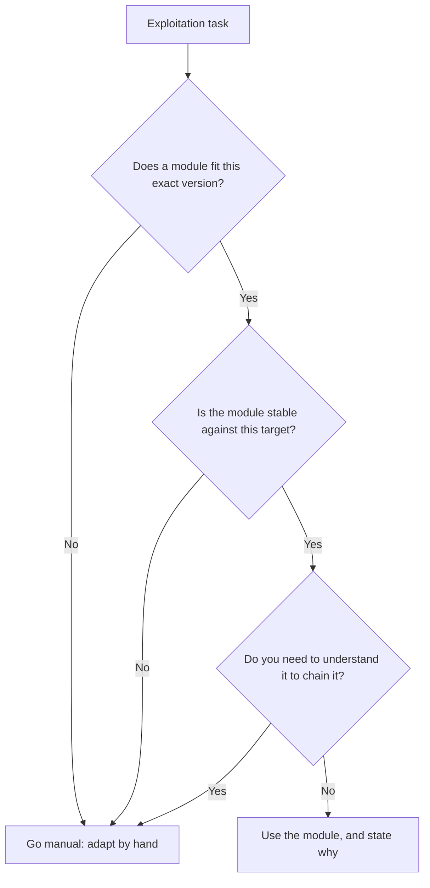
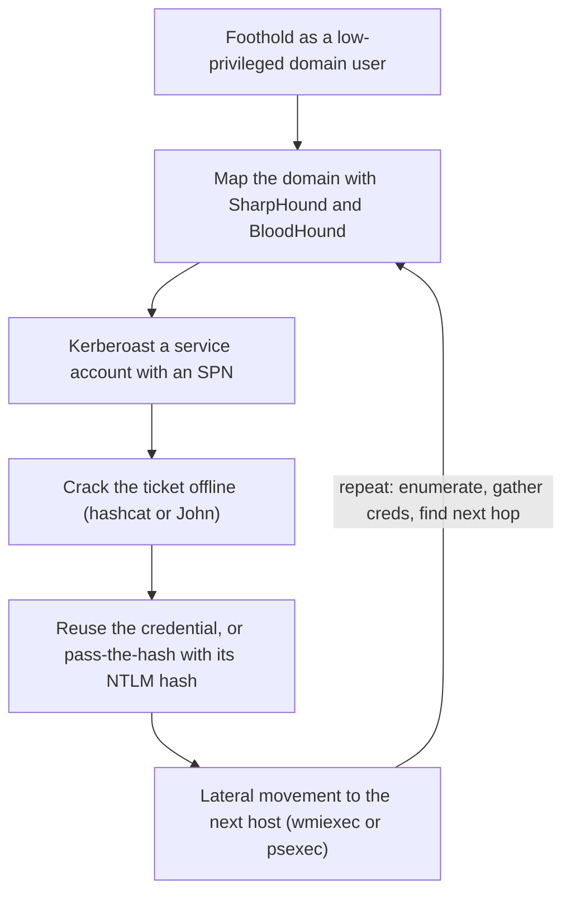

# Lab 10.2: TryHackMe Jr Penetration Tester Path

**Month:** 10 (Offensive Operations)
**Pattern family:** Offensive operations and reporting
**Time budget:** 22 to 26 hours (across many sessions; this lab now carries network-level credential bootstrapping and the Active Directory execution the month is built toward)
**Lab attempt floor:** 90 minutes per room you are stuck on. This is a medium lab worked one room at a time; the floor resets per room. Some rooms are short concept rooms (sit the floor on the practical challenge, not the reading); the harder rooms carry the full 90 minutes.
**AI guidance:** Recon synthesis only, on data you gathered yourself. AI never finds, chooses, or exploits. See "AI guidance for this lab" below. AI Provenance log mandatory.
**Prerequisites:** Lab 10.1 complete (you have the enumeration reflex and the engagement workflow on rails). Month 7 (web exploitation in a lab) is heavily reused here. `SAFETY.md` and `AI-ETHICS.md` re-read.

**Recall first, from memory, before you read on:** in Lab 10.1 you built the "list, rank by signal, pick the first dig" reflex. What is the rule for what to do when you are stuck on a box? (Hold your answer. This lab adds the next judgment skill: which tool fits, and when a tool is the wrong choice.)

## The scope rule, first, because it is not optional

You attack **only** the TryHackMe room you have deployed, through the TryHackMe platform. The deployed room's machine is the authorized target because TryHackMe's terms of use say so. That is the written authorization `SAFETY.md` requires, and it covers the room and nothing else. Do not point any tool at TryHackMe infrastructure that is not your deployed room, and do not point anything at the wider internet while connected. Confirm the room's target IP before every scan.

One target is added for the Active Directory work in Task 4: the **small AD domain you built and own in Month 6**, running on your own hardware on an isolated network you control. That domain is yours, the same cleanest-possible authorization as a VulnHub VM (you own the metal it runs on), and it is the required, always-available AD target for the task. The only other permitted AD target is a TryHackMe AD room you deploy, and only if the path's AD rooms are in the free tier; if they are paywalled, you use your own domain and nothing else. You do not point any AD tool, ever, at a domain you do not own: not your employer's, not your school's, not a friend's. A domain controller you do not own is the single most serious thing on this list to touch without authorization.

If a room's task ever appears to ask you to attack something outside the deployed machine, that is a misread on your part or a bug in the room. Either way, stop and confirm the target is the room's own machine before proceeding.

## Why this lab exists

Lab 10.1 gave you the workflow against boxes that were deliberately gentle. This lab gives you structured, concept-first coverage of the techniques the workflow relies on, in the order a junior pentester learns them. TryHackMe's Jr Penetration Tester path pairs an explanation with a deployable target for each technique, which is exactly the "concept first, command second" rhythm the course is built on. You read what a technique does, then you do it against a target built to teach it.

Where Lab 10.1 was breadth (many boxes, one shallow path each), this lab is the systematic build: reconnaissance methodology, deep enumeration per service, the common web vulnerabilities seen offensively (reinforcing Month 7 from the attacker's chair), and the Metasploit fundamentals, including where Metasploit is the wrong tool. By the end you have a coherent technique vocabulary, not just a handful of solved boxes.

This is also the lab where tool selection becomes explicit. You will use a content-discovery tool, an SMB enumerator, a web proxy, and Metasploit, and for each you will be expected to say not just how it works but when it is the wrong choice.

## Learning objectives

By the end of this lab, you can:

- **Explain** a structured reconnaissance methodology (passive then active) and produce the enumeration output it calls for, including a benign passive footprint with named OSINT tools against a target you own or are authorized to research, ending in the one finding you would act on first and the active move it justifies.
- **Explain** how a tester bootstraps a first credential from raw network access (Responder capturing a NetNTLMv2 hash, NTLM relay as a wire-level concept, a NetExec password spray, AS-REP roasting), what each does on the wire and leaves behind, and run the safe ones against the Month 6 domain you own.
- **Analyze** a discovered service deeply: version, configuration, exposed content, and what each finding implies for an attack path.
- **Build** a web exploitation path against a room's target using the Month 7 vulnerability classes, from the attacker's perspective.
- **Defend** the choice between Metasploit and a manual approach for a given task, including when Metasploit is the wrong tool (no module fits, the module is unstable against the target, or you need to understand the exploit to adapt it).
- **Execute** the basic Active Directory attacks (enumerate a domain, kerberoast a service account and crack the ticket offline, reuse a hash with pass-the-hash, and move laterally) against the Month 6 domain you own, and against a free TryHackMe AD room if the path provides one, tying each back to the Month 6 model.
- **Produce** per-room methodology notes that trace each step to evidence, with no flags recorded.
- **Reconcile** a technique you used offensively against the Month 9 detection that would have caught it.

## Recognition cue

When a room hands you a Metasploit module and the box falls in one command, the cue is to ask what just happened: what did the module do, and could you have done it by hand? If you cannot answer, you have learned the platform, not the technique, and the gap will show the first time a module does not fit. The reflex this lab builds: the tool is never the lesson; the technique under the tool is.

The second cue is the paywall. When a room is subscription-only and you feel the pull to find the technique "on a real target," that pull is the cue to stop. Substitute a free room or record the gap. The pull itself is the thing `SAFETY.md` exists to interrupt.

## AI guidance for this lab

Recon synthesis only, identical in spirit to Lab 10.1. The room is authorized for you to attack. That authorization does not extend to an AI.

**Allowed:** Summarizing your own gathered enumeration output. After you have run your recon against a room and have the raw results, you may ask AI to organize them: "here is my enumeration output for this room's target; group the services and flag which warrant deeper enumeration." Check every claim against your raw output.

**Not allowed, hard rules:** AI does not choose your next move, identify the vulnerability for you, generate exploit code or payloads against the room, or bypass any model's refusal. You do not paste recovered credentials, hashes, or keys into a public AI service. These are the same absolute rules as the month README; they do not relax for a guided platform.

**Logged:** Every interaction, including discards, in the AI Provenance section.

## Tasks

The Jr Penetration Tester path is organized into modules. Work the free portions in order. Some rooms in the path require a subscription; where a room is paywalled, note it and substitute a free room covering the same technique, or skip and record the gap. Do not let a paywall become an excuse to leave the platform for an unauthorized target.

### Task 1: Reconnaissance and enumeration modules, plus a passive footprint (5 to 6 hours)

Work the path's reconnaissance and enumeration content. For each room, do the practical challenge yourself after reading the concept material. Keep a methodology note per room: the technique it taught, the tool you used, the output you got, and one sentence on when that tool would be the wrong choice.

The path covers active recon heavily but gives you little practice at the **passive** half (OSINT), so add one short passive footprint of your own. Read the passive-recon toolkit in the month README first, including the "when passive, when active, and why" tradecraft, because the point of this footprint is not to list tools, it is to produce intelligence that drives your next move. Then pick a target you are clearly authorized to research, and run a benign, passive pass on it:

- The cleanest authorized target is **a domain you own** (your own personal domain, if you have one). If you do not own a domain, use a target that exists expressly for this kind of practice (`scanme.nmap.org`, which Nmap publishes for legitimate scanning practice, or a domain a training platform tells you to enumerate). Do not point OSINT tools at an organization you do not own and have no permission to research; public records being readable does not make the target authorized.
- Run a small, named set: `whois` on the domain, a DNS pass with `dnsrecon` or `dnsenum`, a subdomain sweep with `subfinder` or `amass`, and (if you have a domain with people attached) `theHarvester` for public names and addresses. Optionally look the target up in `Shodan` to see what it already advertises.
- Write a one-page `passive-footprint.md` in this lab's directory: the target, why you are authorized to research it, each tool you ran, and what it returned. Then close it the way recon actually closes: **name at least one finding you would act on, and the concrete active move it justifies.** Not "this would shape my first move," but the specific link, for example "the `dev.` subdomain `subfinder` found is where I would point active content discovery first," or "these three employee names become my password-spray and AS-REP username list," or "this Shodan-exposed service is the one active scan worth the noise." No exploitation; this is the invisible, look-only phase. The named finding is the deliverable, not the tool list.

**Checkpoint:** each reconnaissance and enumeration room in the free portion is completed, with a methodology note per room in `room-notes/` in this lab's directory (each note includes the "when this tool is wrong" sentence), and `passive-footprint.md` records a benign passive pass against an authorized target with the tools named above and names at least one finding it would act on with the active move that finding justifies. No flags recorded.
**If not:** if you cannot write the "when this tool is wrong" sentence, you have used the tool without understanding its cost (noise, fragility, detectability); re-read the tool's docs and the month README on tool selection, then add the sentence. If you are unsure whether a passive target is authorized, that uncertainty is the answer: pick your own domain or `scanme.nmap.org`, where authorization is not in doubt.

### Task 2: Web exploitation modules, from the attacker's chair (5 to 6 hours)

Work the path's web exploitation content. This reuses the Month 7 vulnerability classes (injection, broken authentication, IDOR, file upload, and the rest) but from the offensive side: not "how do I fix this" but "how do I find and exploit this against a target built to teach it." For each room, record the vulnerability class, how you confirmed it, and how you exploited it, in methodology terms.

**Checkpoint:** each web exploitation room in the free portion is completed, with a methodology note per room. Each note names the vulnerability class and the confirmation step. No flags recorded.
**If not:** if the rooms feel like review and you are skimming, slow down. Finding a vulnerability is a different muscle from fixing one. If your note cannot name the confirmation step, you guessed the class instead of confirming it; go back and confirm.

### Task 3: Tool selection, Metasploit versus manual (gradual release)

The new skill of this lab is **tool selection**: deciding when an automated tool is right and when it is the wrong choice. The sharpest case is Metasploit versus a manual approach. You will learn the decision in three stages. The first two reason about a small made-up teaching scenario, so you practice the judgment with no box at risk. The third is your real Metasploit work in the path.

#### Stage 1 - Worked example (I do)

Study this. The scenario is invented for teaching; it is not a room and not your deliverable. Suppose a teaching target runs an old web application with a known remote-code-execution weakness, and a Metasploit module exists for it.

Here is the reasoning an operator runs:

1. **Default to the module when it fits cleanly.** If the module targets exactly this version and the target is stable, the module is the fast, reliable choice. Running it by hand would just be slower with no gain.
2. **Name what the module actually does.** It sends a crafted request that triggers the weakness, then delivers a **payload** (the code that runs on success, such as a reverse shell). If you cannot say that much, the module taught you nothing.
3. **Spot the cases where the module is wrong.** Go manual when: (a) the module supports only one target version and yours is slightly different, so you must adjust the request; (b) the module is unstable and risks crashing the service, which is unacceptable in scope; or (c) you need to understand the exploit to chain it with something else.
4. **State the tradeoff out loud.** "I used the module because it fit the version and the target is a throwaway lab; on a fragile production host I would have done the request by hand to control the risk." That sentence is the skill.

The decision is not "modules are good" or "manual is pure." It is a judgment about fit, stability, and understanding, made on purpose and written down.


*Notice: three different reasons can send you to "manual." Tool choice is a decision with conditions, not a preference.*

**Checkpoint:** you can name the three conditions that send an operator from a Metasploit module to a manual approach.
**If not:** re-read step 3 and the diagram. The three are: version mismatch, instability risk, and the need to understand the exploit to adapt or chain it.

#### Stage 2 - Faded practice (we do)

Now you do the reasoning, on a different teaching scenario, with the steps faded to prompts. This scenario is also invented; it is not a room. Suppose a teaching target runs a network service with a buffer-overflow weakness. A Metasploit module exists, but the target is described as "fragile, used in a simulated production environment, do not crash it," and the module's notes say it is "unreliable against this exact build."

Write this out in a file `tool-selection-practice.md` in this lab's directory:

```
# 1. What does the module do, in one sentence (the trigger plus the payload)?
#    TODO

# 2. Walk the decision diagram for THIS scenario:
#    - Does a module fit this exact build?  TODO (the notes say what?)
#    - Is the module stable here?           TODO
#    - Result of the diagram:               TODO (module or manual?)

# 3. Write the one-sentence tradeoff statement an operator would record here.
#    TODO

# 4. Name one piece of evidence you would capture either way, so the report can reproduce the step.
#    TODO
```

There is no single "answer key." The point is that your choice follows the diagram and ties to the scenario's facts (fragile target, unreliable module), not to a preference.

**Checkpoint:** your Stage 2 reasoning lands on "manual" for this scenario and ties the choice to the fragile target and the unreliable module, not to a general dislike of Metasploit.
**If not:** if you chose the module, re-read the scenario: a fragile target plus an unstable module is exactly the case the diagram routes to manual. If you chose manual but could not say why, your tradeoff sentence is missing the two facts that decide it.

#### Stage 3 - Independent (you do)

No scaffolding now, and now it is real. Work the path's Metasploit content. Learn the framework's structure (modules, options, sessions, the difference between a payload and an exploit). Then, for a vulnerability you actually exploited with a module in the path, write the real version of the Stage 2 reasoning: what the module did, what the manual exploitation would look like, and in what situation the manual path would be the correct choice over the module. You do not have to perform the manual exploitation. You have to reason about the tradeoff with the same rigor you practiced.

**Checkpoint:** each Metasploit room in the free portion is completed, plus a `metasploit-tradeoffs.md` in this lab's directory naming at least two situations where a manual approach beats the module, with the reasoning. No flags recorded.
**If not:** if you can only say "the module worked," you learned the platform, not the technique. Open the module's source or docs, name the trigger and the payload, and then you can reason about when the module would fail you.

### Task 4: Credential bootstrapping and Active Directory attacks (gradual release)

This is the task Month 6 pointed you toward. There you built a small AD domain, learned the Kerberos flow, and studied four attacks at the conceptual level. Here you run the entry-level internal-engagement arc end to end. It has two halves, and they go in the order a real engagement does. First, **credential bootstrapping**: how a tester with no credentials gets the first one from raw network access. Second, the **Active Directory attacks** that the first credential unlocks: kerberoasting, pass-the-hash, and lateral movement. Active Directory is the core of real internal-pentest and entry-level red-team work, so this is the most job-relevant task in the month. Read the "Network-level credential bootstrapping" and "Active Directory attacks" concepts in the month README first.

Stage 0 below is the bootstrapping half, taught concept-first and then practiced on your own domain. Stages 1 to 3 are the AD-attack half, which assumes you already hold a domain credential (Stage 0 is how you got it). You learn the AD method in three stages: the first reasons about a small invented teaching scenario, so you see the shape with nothing at stake; the second has you read the structure of an AD target you can reach and plan the attack path, without yet running it; the third is execution. Your **guaranteed** AD target is the Month 6 domain you own, which carries the whole task on its own; a TryHackMe AD room is a useful second target **if** the path's Active Directory rooms are in the free tier when you reach them. Some TryHackMe AD content is subscription-only; if it is paywalled, do not leave the platform for an unauthorized domain, just run the staging against your own Month 6 domain, which is sufficient. The staging models the method; it is never a walkthrough of a graded box, and it never records a flag.

A scope reminder, because this task touches a domain controller: the only two AD targets you may touch are a free TryHackMe AD room you deploy and your own Month 6 domain on its isolated network (the required one). Nothing else. A domain controller you do not own is the most serious thing in this course to touch without authorization. The same AI rules apply unchanged: AI summarizes enumeration output you gathered yourself; it never finds the path, chooses the account, or writes the attack, and you never paste a recovered hash, ticket, or credential into a public AI service.

#### Stage 0 - Bootstrap the first credential (concept first, then your own domain)

Before the AD chain can start, you need that first credential. The chain below opens with "you have a foothold as `jdoe`," so answer the question that comes before it: how did you become `jdoe`? This stage is concept-first, by design and not as a graded-box walkthrough. You learn what each technique does on the wire, then you practice the safe, self-contained ones against the **Month 6 domain you own**, never against a graded room.

**The scope, stated precisely, because this is poisoning a network.** You run these only against your Month 6 domain (one domain controller, one joined workstation) on an **isolated network you control, on hardware you own.** This is **wired link-local** poisoning of your own VMs. It is not Wi-Fi: the wireless attacks `SAFETY.md` excludes (line 97) are a different matter and nothing here touches them. Because the segment is yours and isolated, there is no third party whose authentication you could capture, so the `AI-ETHICS.md` rule-4 concern does not arise. You do not run Responder, a spray, or AS-REP roasting against a TryHackMe room or any network you do not own; on a shared or client network these touch other people's authentication and the authorization is a different and far more serious question. Here, the target is yours.

Read the month README's "Network-level credential bootstrapping" concept, then do this:

1. **Name what each technique does on the wire and what it leaves**, in a short `credential-bootstrapping.md` in this lab's directory. One or two sentences each, in your own words: Responder poisoning LLMNR/NBT-NS to capture a NetNTLMv2 hash; NTLM relay forwarding that authentication to a third host instead of cracking it; a NetExec password spray (one password against many accounts, under the lockout threshold); AS-REP roasting (a hash handed out for an account with Kerberos pre-authentication disabled, no credential required). For each, name the artifact a defender would see.
2. **Practice the safe ones on your own Month 6 domain.** On your isolated lab:
   - Run **Responder** on your attack VM and, from the joined workstation, trigger a name lookup that fails through DNS (mistype a share path) so Responder answers and captures a **NetNTLMv2** hash. Record what you captured (redact the hash itself; record that you captured it and from which account).
   - Crack that captured NetNTLMv2 hash offline with **hashcat** or **John** against a small wordlist that contains the account's weak password. This is the hands-on link to Knowledge Check item 12: a NetNTLMv2 hash is fast to crack because it rests on fast hashing, which is exactly why the Month 8 distinction between a fast hash and a slow password-hashing function matters.
   - Run a **NetExec** password spray of one likely password across your domain's accounts and read where it succeeds or fails.
   - Run **AS-REP roasting** against an account you configure with pre-authentication disabled, and crack the result offline. Note that this needed no prior credential, only a username, which is why it lives in the bootstrapping phase.
   - Leave **NTLM relay** as a wire-level concept only. With SMB signing required on a modern domain controller and only two hosts on your lab, a relay has no valid target to land on; you have described what it does on the wire in step 1, and that is the right depth for an intro. Naming why it would not work on your own lab (signing, no third target) is itself the lesson.
3. **Tie it to the defender.** Go back to your Month 6 logging and find what your capture and spray left behind (the failed and redirected authentications, the scatter of failed logons). This seeds Task 5.

Record this in `credential-bootstrapping.md`: the wire-level description of each technique, what you captured and cracked on your own domain (no raw secrets pasted, and never into a public AI service per `AI-ETHICS.md` rule 4), and the artifacts each left in your Month 6 logs. The credential you recover here is the realistic stand-in for the "you have a foothold as `jdoe`" that the next stages assume.

**Checkpoint:** `credential-bootstrapping.md` describes, on the wire, what Responder, NTLM relay, a password spray, and AS-REP roasting each do, and records a NetNTLMv2 capture cracked offline plus an AS-REP roast against your own Month 6 domain, with the log artifacts each produced. Relay is described, not staged. No secrets pasted; no flags.
**If not:** if Responder captured nothing, confirm you triggered a name lookup that misses DNS (so the host falls back to LLMNR/NBT-NS) and that Responder is listening on the right interface of your isolated segment. If AS-REP roasting returns nothing, confirm the target account actually has Kerberos pre-authentication disabled. If you cannot say what each technique leaves in a log, re-read the README concept; the artifact is the half that makes you a better defender.

#### Stage 1 - Worked example (I do)

Study this. The domain below is invented for teaching; it is not a room and not your own domain. Suppose you have a foothold as a low-privileged domain user `jdoe` on a domain `corp.local`, and you want to reach the domain controller. Here is the method an operator runs, tied to the Month 6 model:

1. **Map the domain first; do not guess.** You run a collector (**SharpHound**) and load the result into **BloodHound**, which draws the domain as a graph: users, groups, computers, and who can reach what. The graph shows that a service account, `svc_sql`, has a **Service Principal Name (SPN)** registered, and that the account is a member of a group with rights on another host. The graph is your map; it replaces guessing with seeing.
2. **Kerberoast the service account.** Because any authenticated user can request a service ticket for any SPN (the Month 6 fact), `jdoe` requests a ticket for `svc_sql`. Part of that ticket is encrypted with `svc_sql`'s password hash. You request it with an Impacket tool or NetExec, take the ticket offline, and crack it with **hashcat** or **John**. If `svc_sql` has a weak password, you recover the plaintext. Nothing else on the domain had to break; the protocol handed you a crackable secret.
3. **Reuse the credential (or its hash) to move.** Now you hold `svc_sql`'s password. If instead you had only its NTLM hash (say from a `secretsdump` on a host you already control), you would not even need to crack it: **pass-the-hash** lets you authenticate with the hash directly. Either way, you use **NetExec** to check where that credential or hash is valid across the domain's hosts.
4. **Lateral movement to the next host.** The credential is valid on the host BloodHound flagged. You use an Impacket execution tool (`wmiexec` or `psexec`) to get a shell on that host with `svc_sql`'s credential. There you repeat: enumerate, gather any new credentials (`secretsdump`), and check the graph for the next hop toward the domain controller.

The shape is the lesson: **map, kerberoast a weak service account, crack offline, reuse the credential or its hash, move to the next host, repeat toward the domain controller.** Each step is one of the Month 6 attacks made real, and each leaves an artifact a defender could catch (which is Task 5's payoff).


*Notice: the loop returns to mapping after each hop. AD attack is iterative enumeration toward the domain controller, not a single exploit.*

**Checkpoint:** you can state, in one sentence each, what kerberoasting recovers and why pass-the-hash does not require cracking anything.
**If not:** re-read steps 2 and 3 and your Month 6 notes. Kerberoasting recovers a service account's password by cracking a ticket offline; pass-the-hash reuses an NTLM hash directly to authenticate, so no cracking is needed.

#### Stage 2 - Faded practice (we do)

Now you plan the path on a **real AD target you can reach**, reading its structure but not yet executing the attack. Use whichever you have: a free TryHackMe AD room from the path, or your own Month 6 domain (the guaranteed option). Enumerate the domain first (run your own enumeration; if you summarize the output with AI, verify every line against your raw data). Then, before you exploit anything, fill in this plan as `ad-attack-plan.md` in this lab's directory:

```
# 1. Domain map: from your own enumeration (and BloodHound if the room supports it),
#    list the users, the service accounts with SPNs, and the hosts you can see.
#    TODO

# 2. Kerberoast candidate: which service account would you target, and why
#    (what makes it a candidate)?
#    TODO

# 3. Path to the goal: write the ordered hops you expect (map -> kerberoast ->
#    crack -> reuse/pass-the-hash -> lateral move), naming the tool for each step.
#    TODO

# 4. Evidence to capture at each step, so a report could reproduce it (no flags):
#    TODO

# 5. Detection: for one step, what artifact would a defender see in logs?
#    (this seeds Task 5)
#    TODO
```

There is no single answer key; the test is that your plan is drawn from your own enumeration of the target, names a tool per step, and ties the kerberoast candidate to a stated reason.

**Checkpoint:** `ad-attack-plan.md` names a service-account candidate from your own enumeration of the AD target you used, lays out the ordered hops with a tool per step, and names one detectable artifact.
**If not:** if you cannot name a kerberoast candidate, you have not enumerated the domain enough; run the enumeration again and look for accounts with an SPN. If your hops have no tools attached, re-read Stage 1 and the README AD-tooling list.

#### Stage 3 - Independent (you do)

No scaffolding now, and now it is real. The required target is the domain you own; a free TryHackMe AD room is an optional second run.

**Run the attacks against the Month 6 domain you own (required).** This is the part Month 6 promised, and it does not depend on any platform's paywall. Your Month 6 domain is one domain controller and one joined member workstation on an isolated network, which is enough to run every attack here, and it is the cleanest authorization story you have. Attacking it closes the loop between the defender's view you built there and the attacker's view you build here. On your domain: set up a service account with a registered SPN and a deliberately weak password (so the offline crack is feasible), enumerate the domain with NetExec and BloodHound as a normal domain user, kerberoast that account, and crack the ticket offline. Then practice the reuse step: from the member workstation, use a recovered credential or hash with an Impacket tool to authenticate to the domain controller, which is the lateral move from one host to the other. Record what each step did and, crucially, **go back to your Month 6 logging (the Event Log and Sysmon you set up) and see what each attack left behind** (the Kerberos service-ticket request event, the logon events from the lateral move). That reconciliation is the whole reason a defender's course teaches you offense.

**Then, if the path's Active Directory rooms are in the free tier, execute the same attacks on a TryHackMe AD room (optional second run).** Run your `ad-attack-plan.md` against the room: enumerate with NetExec and BloodHound, kerberoast, crack offline, reuse or pass-the-hash, and move laterally toward the goal the room sets. Apply the floor: when stuck, enumerate more, do not try random exploits. Keep a methodology note (no flags). If the AD rooms are paywalled, note the gap and rely on your own-domain run; do not substitute an unauthorized target.

**Checkpoint:** `own-domain-ad.md` in this lab's directory records, against your Month 6 domain, a successful enumeration, a kerberoast with an offline crack, a pass-the-hash or credential-reuse lateral move from the workstation to the domain controller, and the log artifacts each attack produced. If you also ran a free TryHackMe AD room, a methodology note for it exists (no flags). No flags anywhere.
**If not:** if kerberoasting returns nothing on your own domain, confirm the target account actually has an SPN registered and that you are authenticating as a valid domain user. If a hash will not pass, confirm you captured the NTLM hash (not a different format) and that the account is local-admin-equivalent on the destination host. If lateral movement fails, re-check in BloodHound which accounts actually have rights on the target host; the graph, not a guess, tells you.

### Task 5: One reconciliation against your Month 9 detections (60 minutes)

Pick one technique you used in this lab that you also wrote a detection for in Month 9 (or could have). Write a short `detection-reconciliation.md`: what offensive action you took, what it would have looked like in logs, and whether your Month 9 detection rule would have fired on it. If it would not have, say what you would change about the rule. This is the defender's payoff for learning offense.

**Checkpoint:** `detection-reconciliation.md` connects one offensive technique from this lab to a Month 9 detection, with an honest assessment of whether the detection would catch it.
**If not:** if you cannot say what the action looked like in logs, you do not yet understand the artifact your technique leaves. Re-read the tool's pre-flight notes on what traces it produces, then describe the log evidence.

### Task 6: Notebook entry with AI Provenance (60 minutes)

Complete `.tutor/notebook/lab-02-tryhackme-jr-pentester.md`. Required sections:

- **Pre-flight check** for any new tool the path introduced that you had not run before (a web proxy, a specific enumerator, the Metasploit console, the bootstrapping tool **Responder**, and the AD tools: NetExec, BloodHound and SharpHound, an Impacket tool, hashcat or John): what it does at the packet or filesystem level, what artifacts it leaves on the target and on your host, what could go wrong, and the authorization scope. For Responder, be explicit that its scope is your own isolated Month 6 segment only, because it poisons name resolution for everything on the segment; for the AD work, the authorized scope is the deployed THM room and your own Month 6 domain only.
- **Concept naming.**
- **Evidence:** references to your room notes, `passive-footprint.md`, `metasploit-tradeoffs.md`, `credential-bootstrapping.md`, `ad-attack-plan.md`, `own-domain-ad.md`, and `detection-reconciliation.md`, with key findings summarized. No flags.
- **Five-question debrief.**
- **AI Provenance:** which AI tool, what raw data you supplied, what summary it produced, how you verified it, what you discarded. An honest "not used here" note is valid if you did not use AI.

**Checkpoint:** the entry is committed with all sections, no flags, and a substantive AI Provenance section.
**If not:** a one-line provenance section is rejected. The test is whether a reader could redo your AI conversation from your notes.

## Definition of Done

The lab is complete when:

- The free portions of the path's reconnaissance, enumeration, web exploitation, and Metasploit modules are worked (and the path's AD rooms if they are free), with a methodology note per room and no flags in any note.
- `passive-footprint.md` records a benign passive pass against an authorized target with the named OSINT tools, and names at least one finding it would act on with the active move that finding justifies.
- `metasploit-tradeoffs.md` names at least two situations where manual beats the module, with reasoning.
- `credential-bootstrapping.md` exists: it describes on the wire what Responder, NTLM relay, a password spray, and AS-REP roasting each do, and records a NetNTLMv2 capture cracked offline and an AS-REP roast against your own Month 6 domain, with the log artifacts each produced. Relay is described, not staged. No secrets, no flags.
- `ad-attack-plan.md` and `own-domain-ad.md` exist: you planned the attack path and executed kerberoasting, an offline crack, and a pass-the-hash or credential-reuse lateral move against the Month 6 domain you own, with the log artifacts each attack produced. (A free TryHackMe AD room is an optional second run.)
- `detection-reconciliation.md` connects one offensive technique to a Month 9 detection.
- The notebook entry is committed with a complete AI Provenance section.

The tutor will run the verification ritual: it picks one room from your notes and asks you to explain, from memory, the technique and one situation where the tool you used would be the wrong choice. It may also ask you to walk the manual equivalent of a Metasploit module you used; to explain, from memory, how kerberoasting recovers a credential and what artifact it left in your Month 6 logs; or to explain how Responder captured a NetNTLMv2 hash on your own segment, why AS-REP roasting needs no prior credential, and why a NetNTLMv2 hash cracks faster than a password stored with a slow password-hashing function. The tutor will not confirm any flag.

**Self-explain:** in one sentence, why does naming what a Metasploit module actually does (the trigger and the payload) let you decide when not to use it?

## Stretch goals

1. For one web room, exploit the vulnerability once with an automated tool and once by hand with a web proxy, and write which you would put in a report and why.
2. Take your `metasploit-tradeoffs.md` and add a third situation drawn from a real module's documented limitations (read one module's docs and find a stated constraint).
3. Extend `detection-reconciliation.md` to two techniques instead of one, and note which was easier to detect and why.
4. Map every technique in your room notes to its MITRE ATT&CK identifier; this makes Task 5's detection reconciliation and your future reports sharper.
5. After the AD work, open BloodHound on your own Month 6 domain and find the shortest path from a low-privileged user to Domain Admins, then write the one hardening change that would break that path.

## Troubleshooting

- **A room is paywalled.** Note it, substitute a free room covering the same technique, or record the gap. Never leave the platform for an unauthorized target to fill the gap.
- **The Metasploit module fails or hangs.** Confirm the target IP and the module options first; a wrong `RHOSTS` is the usual cause. If the module is genuinely unstable, that is the Stage 2 scenario becoming real, and the manual path is the answer.
- **A web room feels like Month 7 review.** The offensive framing is the new skill. Finding a vulnerability is a different muscle from fixing one. Treat it as new and write the confirmation step.
- **You read the concept and skipped the practical.** The floor applies to the hands-on challenge, not the reading. Do the challenge; that is where the skill lives.
- **Responder captured nothing on your own domain.** Responder only answers when a host falls back to LLMNR or NBT-NS, which happens when DNS resolution fails. Trigger that on the workstation (mistype a share path such as `\\fileserver01`), and confirm Responder is listening on the interface attached to your isolated segment. If nothing comes, DNS may be resolving the name you tried; pick a name that does not exist.
- **AS-REP roasting returns nothing on your own domain.** AS-REP roasting only works against accounts with Kerberos pre-authentication disabled. On your Month 6 domain you must set that flag on a test account first; without it, the domain controller will not hand out the encrypted AS-REP. This is the point: pre-authentication is the defense, and most accounts have it on.
- **Kerberoasting returns no tickets on your own domain.** The target account must have a Service Principal Name registered, and you must request as a valid domain user. Confirm the SPN exists; on your own Month 6 domain you may need to register one on the service account you created for this.
- **BloodHound shows no path, or SharpHound collects nothing.** Confirm you are collecting as a domain user with network reach to the domain controller, and that DNS resolves the domain (the Month 6 lesson: AD breaks when DNS is wrong). The graph is only as good as the collection.
- **A hash will not pass (pass-the-hash fails).** Confirm you captured the NTLM hash (not a Kerberos ticket or a different format) and that the account is administrator-equivalent on the destination host; pass-the-hash needs the credential to be valid there.
- **The tutor will not confirm your flag.** It never will. Submit flags on the platform.

## Time budget breakdown

- Task 1: 5 to 6 hours (recon and enumeration rooms, plus the passive footprint)
- Task 2: 5 to 6 hours
- Task 3: Stage 1 about 30 minutes, Stage 2 about 30 minutes, Stage 3 the Metasploit rooms plus the tradeoffs writeup (about 3 to 4 hours)
- Task 4: Stage 0 the credential-bootstrapping concept plus the safe practice on your own domain (about 2 to 3 hours), Stage 1 about 30 minutes, Stage 2 about 60 minutes (plan from your enumeration of the AD target), Stage 3 the attacks against your own Month 6 domain, plus a free TryHackMe AD room if available (about 4 to 5 hours)
- Task 5: 60 minutes
- Task 6: 60 minutes

Total: 22 to 26 hours across many sessions. This lab now carries network-level credential bootstrapping and the Active Directory execution the month is built toward, so it is heavier than a single platform path; spread it across sessions.

## Resources

Primary sources only. Per-room walkthroughs are excluded; the path's own concept material is the teaching text and is sufficient.

- The TryHackMe Jr Penetration Tester path's own room material (the concept text in each room is primary; the walkthroughs others publish are not).
- The official Metasploit Framework documentation (module types, payloads, sessions).
- The OWASP Web Security Testing Guide, for the web exploitation methodology behind Task 2.
- `man` pages and official docs for each enumeration tool you run (`enum4linux-ng`, `ffuf` or `feroxbuster`, your web proxy).
- The passive-recon and OSINT tool docs for Task 1's footprint: `whois`, `dnsrecon` or `dnsenum`, `amass` or `subfinder`, `theHarvester`, and Shodan.
- The credential-bootstrapping tooling docs for Task 4 Stage 0: the **Responder** documentation (LLMNR/NBT-NS poisoning and NetNTLMv2 capture); the **Impacket** `ntlmrelayx` documentation (read it for the relay concept even though you do not stage relay here); and the **NetExec** documentation for password spraying and AS-REP roasting. Read the docs; do not run a tool you cannot explain, and run these only against your own isolated Month 6 segment.
- The Active Directory tooling docs for Task 4: the official **NetExec** documentation; the **BloodHound** and **SharpHound** documentation (domain mapping and path analysis); the **Impacket** project documentation (`secretsdump`, `wmiexec`, `psexec`); and the **hashcat** or **John the Ripper** documentation for offline ticket cracking. Read the docs; do not run a tool you cannot explain.
- The MITRE ATT&CK Credential Access and Lateral Movement tactics, for naming the techniques by identifier (LLMNR/NBT-NS poisoning T1557.001, password spraying T1110.003, AS-REP roasting T1558.004, Kerberoasting T1558.003, pass-the-hash T1550.002).
- MITRE ATT&CK, to name the techniques you use by their ATT&CK identifiers (useful for Task 5's detection reconciliation).
- Your own Month 6 Active Directory build and Windows hardening writeup, Month 7 web-security portfolio, and Month 9 detection rules.
