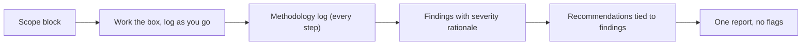

# Lab 10.3: Three Full Boxes

**Month:** 10 (Offensive Operations)
**Pattern family:** Offensive operations and reporting
**Time budget:** 20 to 24 hours (across many sessions; this lab produces the month's deliverable)
**Lab attempt floor:** Multi-hour. This is the hard lab of the month. A full box is expected to take several hours of independent work; the floor is the whole independent attempt on each box before any hint. Do not start a hint-ladder conversation on a box you have worked for less than a few hours, and never read a walkthrough of a box you intend to write up.
**AI guidance:** Recon synthesis only, on data you gathered yourself. AI never finds, chooses, or exploits, and never writes any part of the report's findings for you. See "AI guidance for this lab" below. AI Provenance log and appendix mandatory.
**Prerequisites:** Labs 10.1 and 10.2 complete. Month 9 (you can write a professional report). `SAFETY.md` and `AI-ETHICS.md` re-read. This lab assumes you have the enumeration reflex, the engagement workflow, and a technique vocabulary; it does not teach those, it exercises them independently.

**Recall first, from memory, before you read on:** in Month 9 you wrote a professional incident report. What were its main sections, and who was the audience for the first paragraph? (Hold your answer. This lab writes a report of a different shape, but the same standard of clarity, and the audience question is the same.)

## The scope rule, first, because it is not optional

Your three boxes come from exactly two sources, both authorized:

- **Retired HackTheBox machines**, attacked over the HTB VPN. Retired machines are authorized for attack and, importantly, for **public writeups**. Active machines are not; do not write up an active box.
- **VulnHub virtual machines** you downloaded and run on an isolated host-only or NAT network on your own hardware. The VM is yours; it carries no writeup restriction.

That is the entire list of allowed targets for this lab. Nothing else qualifies, under any framing, per `SAFETY.md`. Because two of these reports may become public portfolio pieces, the writeup-permission rule is load-bearing: a public report must be of a **retired** HTB box or a VulnHub VM, never an active HTB machine. Confirm the target's status before you commit to writing it up.

While on the HTB VPN, keep your tooling pointed at the single box. While running a VulnHub VM, keep it on an isolated network so nothing escapes to hosts you did not intend to touch. If you discover anything out of scope, apply the `SAFETY.md` decision tree.

## Why this lab exists

This is the lab where the training wheels come off and the deliverable gets made. In Labs 10.1 and 10.2 the platforms structured your path. Here you take three boxes end to end with no structure: scope, recon, enumeration, exploitation, foothold, privilege escalation, and a professional report for each. This is as close as the course comes to a real engagement before the Month 12 capstone, and the three reports are the portfolio artifact a hiring manager will actually read.

The report is the point as much as the box. A pentester who can root a box but cannot write a report a client understands is not employable as a pentester. The skill being built here is the full loop: do the technical work, then translate it into scope, methodology, severity-rated findings, and remediation a defender can act on. The box is the input; the report is the output; and the report contains methodology, never flags.

## Learning objectives

By the end of this lab, you can:

- **Build** a path from scope to root on a box with no walkthrough, documenting each phase as you go.
- **Produce** a professional penetration-test report with scope, methodology, findings rated by a defensible severity scheme, and actionable recommendations.
- **Defend** a severity rating: explain why a finding is critical, high, medium, or low using an explicit, consistent rationale (impact and exploitability), not a gut feeling.
- **Produce** remediation recommendations a defender can act on, tied to each finding.
- **Produce** a report that contains no flags and traces every finding to reproducible methodology.
- **Reconcile** the authorization basis of each box you wrote up against the `SAFETY.md` rules, in writing.

## Recognition cue

When you finish a box and sit down to write the report, the cue that you logged well is that the report almost writes itself from your methodology log. The cue that you logged badly is that you are reconstructing the path from memory and it feels plausible rather than precise. The reflex this lab builds: the report is written while you work, in the log, not afterward from recall.

The second cue is severity. When you label a finding and cannot immediately say why it is that severity and not the one above or below, that hesitation is the cue that you are rating by feel. Reach for your stated scheme and rate from impact and exploitability, not from how dramatic the finding seems.

## AI guidance for this lab

Recon synthesis only, and **the report's findings are yours alone**. The narrowest application of the pattern in the course, because the stakes (a public artifact) are the highest.

**Allowed:** Summarizing your own enumeration output, exactly as in Labs 10.1 and 10.2: paste your own non-sensitive scan and enumeration output, ask AI to organize the attack surface, check every claim against your raw data. That is the whole of the allowance. The report itself, every word of it, you write.

**Not allowed, hard rules:**

- AI does not find the vulnerability, choose the exploit, generate exploit code or payloads, or tell you the path through the box. The box is authorized for *you* to attack; that does not extend to an AI.
- AI does not write your findings, assign your severities, or author your recommendations. Those are the demonstration of skill the report exists to show; outsourcing them is the one thing that makes the artifact worthless.
- AI is not used to bypass any model's refusal.
- You do not paste recovered credentials, hashes, keys, or any box content beyond your own non-sensitive scan output into a public AI service (`AI-ETHICS.md` rule 4). A self-hosted model is the option if you need AI help with sensitive content.

**Logged:** Every interaction in the AI Provenance section of your notebook, and summarized in the AI Provenance appendix of each report (the appendix is required; see `deliverable.md`).

## From box to report

Here is the flow this lab produces, three times. Notice where the report is written.


*Notice: the report is built from the log you keep while working, not written from memory afterward. The log is the report's first draft.*

## Tasks

You will take three boxes. The recommended composition is at least one retired HTB box and at least one VulnHub VM, so the report you publish rests on a target with no writeup restriction. Work each box fully before writing its report; write the report while the box is fresh.

### Task 1: Box selection and scope documentation (60 minutes)

Choose your three boxes. For each, write a scope block before you touch it: the target (box name and source), the authorization basis (retired HTB over VPN, or VulnHub VM on isolated network), what is in scope (the box) and explicitly out of scope (everything else), and the rules of engagement you are setting for yourself (for example, no destructive actions, document before exploiting). This scope block becomes the Scope section of each report.

**Checkpoint:** a `scope-blocks.md` exists in this lab's directory with a complete scope block for each of the three boxes, each naming the authorization basis and writeup permission (retired or VulnHub).
**If not:** if you cannot state a box's authorization basis in one sentence, do not touch that box. Pick a target whose authorization you can name: a retired HTB box, or a VulnHub VM on your own isolated network.

### Task 2: Write a professional finding (gradual release)

The new skill of this lab is **writing a finding**: turning one exploited weakness into a report entry with a methodology, a defensible severity, and a remediation. You will learn it in three stages. The first two use a small made-up teaching service, so you practice the writing on something that is not a real box and not your deliverable. The third is your three real reports. (The boxes themselves you work independently, per the floor; this staging is about the writing skill, never a walkthrough of a graded box.)

#### Stage 1 - Worked example (I do)

Study this complete finding. The service is invented for teaching: a made-up host running an outdated FTP service that allows anonymous login and exposes a config file with a reused password. This is not a real box; it is a clean example of the form.

> **Finding F-1: Anonymous FTP exposes a reused credential**
>
> **Severity: High.**
> **Rationale:** Exploitability is high because the FTP service allows anonymous login with no authentication, reachable pre-auth from the network. Impact is high because the exposed config file contained a password reused for an administrative account, leading directly to a foothold. High impact times high exploitability gives High. It is not Critical because reaching full system control still required a second step (privilege escalation), not this finding alone.
>
> **Affected component:** FTP service on port 21 (vsftpd, anonymous login enabled).
>
> **Methodology (reproducible, no flags):** An `nmap` service scan showed FTP open on port 21 with anonymous login advertised. Connecting with `ftp <host>` and the `anonymous` user (empty password) succeeded. Listing the directory revealed a `backup.conf` file; downloading and reading it disclosed a plaintext password. That password authenticated to the administrative web panel found earlier, granting an initial foothold.
>
> **Impact:** An unauthenticated attacker on the network can read exposed files and recover a credential reused for privileged access, bypassing the application's authentication entirely.
>
> **Recommendation:** Disable anonymous FTP access on the server. Remove the credential-bearing config file from any anonymously readable path. Rotate the disclosed password and enforce unique credentials per account so one disclosure does not grant administrative access. Tie this remediation to F-1 specifically.

Walk what makes this a professional finding, not a CTF note:

1. **The severity has a rationale, not just a label.** It names impact and exploitability and says why it is High and not Critical. That is what "defensible" means.
2. **The methodology is reproducible and flag-free.** A competent reader could redo every step. There is no flag anywhere; the proof is the method, not a token.
3. **The recommendation is specific and tied to the finding.** Not "secure the server" but "disable anonymous FTP, remove the file, rotate and unique the password." A defender can act on each clause.

**Checkpoint:** you can state why finding F-1 is rated High and not Critical, in one sentence, using the words impact and exploitability.
**If not:** re-read the rationale. The rule: severity is impact times exploitability, and a finding that needs a second step to reach full control is usually one rung below the finding that grants full control by itself.

#### Stage 2 - Faded practice (we do)

Now you write a finding, on a different made-up teaching service, with the structure faded to a skeleton. This service is also invented; it is not a box. The teaching facts you are writing up:

- A teaching host runs a web application with a file-upload feature that accepts any file type.
- You uploaded a script file and the server executed it, giving you command execution as the web-server user.
- Reaching root still required a separate sudo misconfiguration (a different finding, not this one).

Fill in this skeleton in a file `finding-practice.md` in this lab's directory:

```
# Finding F-?: <title naming the weakness>
#
# Severity: <pick one>
# Rationale: <impact ___, exploitability ___, why this rung and not the one above/below>
#
# Affected component: <what and where>
#
# Methodology (reproducible, NO flags):
#   TODO: the steps that confirm and exploit the upload, in order, no flag
#
# Impact: <what an attacker gains>
#
# Recommendation: <specific, tied to THIS finding>
```

Use the same severity logic you studied. Command execution as the web-server user, reachable by anyone who can upload, is serious; but if full system control needed a second finding, weigh that the way F-1 did. There is no single answer key; the test is that your rationale ties to impact and exploitability and your recommendation is specific.

**Checkpoint:** your `finding-practice.md` has a severity with a two-factor rationale, a flag-free reproducible methodology, and a recommendation specific to the upload weakness (for example, validate file type and store uploads outside the web root).
**If not:** if your recommendation says "fix the upload," it is too vague; name the control (restrict allowed types, store outside the web root, run uploads through no-execute storage). If your severity has no rationale, add the impact and exploitability sentence.

#### Stage 3 - Independent (you do)

No scaffolding now, and now it is real. Take three boxes end to end, independently, applying the full-attempt floor (you work the boxes yourself; this file gives you no path through any box). As you work each box, keep a running methodology log: every scan, every enumeration step, every finding, every exploitation step, in enough detail to reproduce. When each box is done, write its full report from your log, following `deliverable.md`: executive summary, scope (from Task 1), methodology, findings each written in the form you just practiced (severity with rationale, reproducible method, specific recommendation), and an AI Provenance appendix. No flags in any report.

For at least one of your three boxes, your report's methodology must include a point where you chose a **manual** exploitation path over an automated tool, with the reasoning (the Lab 10.2 skill, now in a report). If all three fell to automated tooling, find a step you could have done manually and document the tradeoff.

**Checkpoint:** three boxes are complete; three reports live in `pentest-portfolio/` following `deliverable.md`, each with severity-rated findings (rationale per finding), recommendations tied to findings, methodology only, and no flags. At least one report documents a manual-versus-automated decision with reasoning. The severity scheme is identical across all three.
**If not:** if a report reads as a plausible story rather than a precise method, you wrote it from memory; rebuild it from your log, and next box, log as you go. If your severities drift between reports, pick one scheme (impact times exploitability, or CVSS) and apply it the same way to all three.

### Task 3: Report review pass and AI Provenance appendices (90 minutes)

Review all three reports as a set. Confirm: consistent severity scheme across all three, no flags anywhere, every finding traced to reproducible methodology, recommendations that a defender could act on. Add the required AI Provenance appendix to each report (the same format as your notebook provenance: tool, what you asked, what was generated, verification, discards). Confirm the public reports are of retired HTB boxes or VulnHub VMs.

**Checkpoint:** three reports are reviewed for consistency, each carries an AI Provenance appendix, none contains a flag, and public ones are cleared for writeup permission.
**If not:** if you find a flag in any report or its history, remove it and check the git history too; a flag anywhere fails the deliverable. If the severity scheme differs across reports, normalize it now.

### Task 4: Notebook entry with AI Provenance (60 minutes)

Complete `.tutor/notebook/lab-03-three-full-boxes.md`. Required sections:

- **Pre-flight check** for any new tool used on the boxes: packet or filesystem-level behavior, artifacts left, what could go wrong, authorization scope.
- **Concept naming.**
- **Evidence:** references to the three reports and your methodology logs, with the severity scheme you used summarized. No flags.
- **Five-question debrief.**
- **AI Provenance:** which AI tool, what raw data you supplied for synthesis, what it produced, how you verified it, what you discarded; plus a note confirming the findings and severities are entirely your own work.

**Checkpoint:** the entry is committed with all sections, no flags, and a substantive AI Provenance section that confirms the findings are your own.
**If not:** if your provenance cannot show that the findings and severities are your own work, the entry is rejected; the report's value is that you wrote it, so the provenance must make that explicit.

## Definition of Done

The lab is complete when:

- Three boxes are taken end to end, each from an authorized source, each with writeup permission confirmed for any report intended to be public.
- Three professional reports live in `pentest-portfolio/`, each with scope, methodology, severity-rated findings, recommendations, and an AI Provenance appendix.
- No report contains a flag.
- At least one report documents a manual-versus-automated tool-selection decision.
- The notebook entry is committed with a complete AI Provenance section.

The tutor will run the verification ritual on the reports: it picks one finding from one report and asks you to explain the severity rating from memory and reproduce the methodology that found it, with your AI session closed. It will also ask you to state the authorization basis for one of the boxes. If you cannot defend a severity or trace a finding to your own work, that report returns. The tutor will not confirm any flag, and you should not record one in a report or paste one to the tutor.

**Self-explain:** in one sentence, why does a methodology log written while you work make the final report more defensible than one written from memory?

## Stretch goals

1. Write the executive summary of one report for a non-technical manager, then have a friend who is not in security read it and tell you the headline risk back. If they cannot, rewrite it.
2. Add a CVSS vector string to each finding alongside your severity label, and check whether the CVSS score agrees with your impact-times-exploitability rating; explain any gap.
3. Build a reusable report template from your three reports so the Month 12 capstone is an expansion, not a first attempt.
4. For one box, write a short "blue-team appendix" listing the detections that would have caught each phase, connecting this lab to your Month 9 work.

## Troubleshooting

- **The report reads like a story, not a method.** You wrote it from memory. Rebuild from your methodology log, and on the next box, log every step as you take it.
- **Severity drifts between reports.** Pick one scheme and apply it identically. Inconsistent severity is the most common amateur tell in a real report.
- **A flag slipped into a report.** Remove it, and check the git history (`git log -p`) so it is not preserved in an old commit. A flag anywhere fails the deliverable.
- **You are about to publish a report of an active HTB box.** Stop. Public reports must be retired HTB boxes or VulnHub VMs. Confirm retired status before publishing.
- **You are tempted to let AI write a finding.** That is the one shortcut that destroys the artifact's value. The report proves you can think like an attacker and write like a consultant; an AI-authored finding proves neither.

## Time budget breakdown

- Task 1: 60 minutes
- Task 2: Stage 1 about 30 minutes, Stage 2 about 45 minutes, Stage 3 the three boxes and reports (about 18 to 21 hours across sessions)
- Task 3: 90 minutes
- Task 4: 60 minutes

Total: 20 to 24 hours across many sessions. This is the heaviest lab of the month because it produces the deliverable.

## Resources

Primary sources only. Per-box walkthroughs are excluded, and for boxes you intend to write up, reading a walkthrough invalidates the writeup as your own work.

- NIST SP 800-115, the Technical Guide to Information Security Testing and Assessment, for the engagement phases and the methodology backbone.
- The Penetration Testing Execution Standard (PTES), for the structure of a professional engagement and report.
- The OWASP Web Security Testing Guide, where a box's path goes through a web service.
- A published, vendor-neutral severity rubric (for example, the CVSS specification) as the basis for your severity scheme; cite which you used and apply it consistently.
- MITRE ATT&CK, to map the techniques in your methodology to ATT&CK identifiers in the reports.
- `man` pages and official documentation for every tool you run.
- Your own Month 9 IR report, as a model for professional report structure (the offensive report has different sections, but the standard of clarity is the same).
