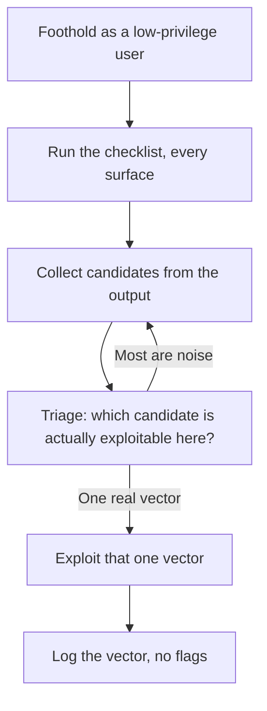
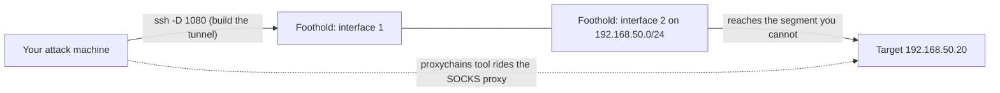

# Lab 10.4: Privilege Escalation Paths

**Month:** 10 (Offensive Operations)
**Pattern family:** Offensive operations and reporting
**Time budget:** 12 to 14 hours (across several sessions; this lab now also carries a pivot through a foothold on your own lab)
**Lab attempt floor:** 90 minutes per privilege-escalation challenge you are stuck on. This is a medium lab; the floor resets per challenge. Privilege escalation rewards patient enumeration, so the floor is time spent enumerating the host, not time spent trying random exploits.
**AI guidance:** Recon synthesis only, on data you gathered yourself. AI never finds the escalation vector, chooses it, or generates the exploit. See "AI guidance for this lab" below. AI Provenance log mandatory.
**Prerequisites:** Labs 10.1 to 10.3 complete. Month 2 (Linux permissions, SUID, GTFOBins exploration) and Month 6 (Windows services, scheduled tasks, tokens) are the conceptual foundation. `SAFETY.md` and `AI-ETHICS.md` re-read.

**Recall first, from memory, before you read on:** in Month 2 you explored GTFOBins. What is GTFOBins, and what kind of misconfiguration makes one of its entries usable? (Hold your answer. This lab turns that one-off knowledge into a systematic checklist.)

## The scope rule, first, because it is not optional

This lab has two kinds of authorized target, and nothing else. For the privilege-escalation work (Tasks 1 to 3) you work **only** the deployed TryHackMe rooms, attacking **only** the room's own machine, which TryHackMe's terms authorize. The room is the target; nothing else is. Confirm the room's target before every action. Privilege escalation runs on a machine you already have a foothold on; that foothold is on the room's machine and the escalation stays there. For the pivoting work (Task 4) the target is the **isolated lab you own and run on your own hardware**: your own VMs on a host-only or NAT network you control, the same cleanest authorization basis as a VulnHub VM or your Month 6 domain. You build the pivot topology yourself out of your own machines; you point nothing at a network you do not own. Do not use a technique you learn here, escalation or pivoting, against any host outside one of those two authorized kinds, ever. The same SUID misconfiguration or the same tunnel that is a lesson on your own lab is a federal matter on a host you do not own.

## Why this lab exists

You have gotten footholds on boxes in Labs 10.1 to 10.3, and on several of them the escalation from a low-privilege user to root or SYSTEM was the part that stumped you. This lab makes privilege escalation a methodology instead of a lucky find. The difference between a beginner and an operator on privilege escalation is entirely about enumeration discipline: the operator runs a systematic check of the standard escalation surfaces and reads the results, while the beginner tries exploits at random and gets stuck.

Privilege escalation is also where the offensive and defensive halves of the course meet most directly. Every escalation vector you learn here is a misconfiguration a defender should have caught: a writable service binary, an over-permissive sudo rule, a scheduled task running as a privileged user. Learning to find them offensively is learning what to harden defensively, which is why the Month 6 Windows hardening and the Month 9 detections are prerequisites in spirit.

## Learning objectives

By the end of this lab, you can:

- **Build** and run a systematic Linux privilege-escalation enumeration (SUID and SGID binaries, sudo rules, cron jobs, capabilities, writable files in privileged paths, kernel version, and credentials or secrets left at rest) and read the results.
- **Build** and run a systematic Windows privilege-escalation enumeration (service permissions, unquoted service paths, token privileges, scheduled tasks, registry autoruns, stored credentials) and read the results.
- **Analyze** the output of an enumeration script (`linpeas`, `winpeas`, `pspy`) and tell a real escalation candidate from noise, rather than trying every flagged item.
- **Defend** the choice of one escalation vector by explaining why the others you saw were dead ends.
- **Reconcile** each escalation vector with the defensive control that would have prevented it (a hardening step from Month 6, a detection from Month 9).
- **Build** a pivot through a foothold to reach a host on a network segment you cannot route to directly, using SSH dynamic port-forwarding with proxychains, against your own isolated lab, and name the modern purpose-built tools (ligolo-ng, chisel).
- **Produce** methodology notes for each escalation and for the pivot, with no flags recorded.

## Recognition cue

When you have a foothold and cannot escalate, and your instinct is to try the exploit that worked on the last box, that instinct is the cue that you are pattern-matching instead of enumerating this host. Each machine has its own misconfiguration; the one that escalates is found by running the checklist, not by recalling the previous answer. The reflex this lab builds: escalation is a systematic sweep of known surfaces, not a guess.

The second cue is a wall of `linpeas` output with a dozen highlighted findings. The cue is that most of them are not your path. Reading the output to reason about which single finding is actually exploitable on this host is the skill; trying each highlight in turn is the failure.

## AI guidance for this lab

Recon synthesis only. The room is authorized for you to escalate on; that authorization does not extend to an AI finding the vector for you.

**Allowed:** Summarizing your own enumeration output. After you have run your privilege-escalation enumeration and have the raw output (a `linpeas` report, a `sudo -l` listing, a service-permissions dump), you may ask AI to organize it: "here is my Linux enumeration output; group the findings by escalation surface and note which look like candidates." You then check every claim against the raw output, because the junior will flag a candidate that is not really there or miss one that is.

**Not allowed, hard rules:** AI does not find the escalation vector, tell you which candidate is the real one, generate the escalation exploit or commands, or bypass any model's refusal. You do not paste recovered credentials, hashes, or keys into a public AI service. Same absolute rules as the month README.

A specific trap for this lab: it is tempting to paste a full `linpeas` output and ask "how do I escalate from here." That crosses the line from synthesis (organize what I found) into finding (tell me the answer). The allowed prompt asks AI to group your findings; it does not ask AI to solve the box. Keep the distinction sharp, and log it honestly.

**Logged:** Every interaction, including discards, in the AI Provenance section.

## The privilege-escalation loop

Here is the loop you run on every host. Notice that triage, not trying, is the work.


*Notice: the loop spends its time triaging candidates, not trying each highlighted item. Reading is the skill; trying everything is the beginner trap.*

## Tasks

Work the TryHackMe Linux and Windows privilege-escalation rooms. These rooms present a host you have access to and ask you to escalate; each teaches a family of vectors.

### Task 1: Both checklists, on paper (90 minutes)

Before the rooms, write two checklists from memory and from your prior work, so you have a methodology to test against the rooms and revise.

First, the **Linux** checklist, from your Month 2 GTFOBins work: the surfaces you will always check, in order, and what each one looks like when it is exploitable. The Linux surfaces are SUID and SGID binaries, sudo rules, cron jobs, capabilities, writable files in privileged paths, the kernel version, and **credentials and secrets at rest**.

That last surface is the one beginners skip and the one that, in the real world, roots more Linux hosts than kernel exploits do, so name it explicitly. **Credentials and secrets at rest** means: world-readable configuration files that hold a database or service password (a `.conf`, a `.env`, a web-app `config.php`, a backup file); private SSH keys in home directories with loose permissions, or an `authorized_keys` you can write; credentials sitting in shell history (`~/.bash_history`, `~/.zsh_history`) or in environment variables and process arguments; and password reuse, where a credential you read in one place authenticates somewhere more privileged (the local root account, `sudo`, another service, another host). An exploitable instance looks like a foothold user who can read a file or a history entry that hands them a higher-privileged credential, with no exploit required at all. The foothold-stage finding you studied in Lab 10.3 (an exposed config file with a reused password) is exactly this surface; here it becomes a standing checklist item, not a lucky find.

Second, the **Windows** checklist, building on Month 6: the surfaces you will always check, and what an exploitable instance of each looks like. The Windows surfaces are service permissions, unquoted service paths, token privileges, scheduled tasks, registry autoruns, and stored credentials.

**Checkpoint:** both `linux-privesc-checklist.md` and `windows-privesc-checklist.md` exist in this lab's directory, each listing its escalation surfaces and what an exploitable instance of each looks like, written before the rooms.
**If not:** if you cannot say what an exploitable instance of a surface looks like (for example, what a dangerous `sudo -l` line shows on Linux, or an unquoted service path on Windows), revisit Month 2 and your GTFOBins work for Linux, and Month 6 for Windows, then write it.

### Task 2: Reading enumeration output (gradual release)

The new skill of this lab is **triage**: reading enumeration output and telling the one real escalation vector from the noise. You will learn it in three stages. The first two read small made-up teaching output, so you practice the judgment with no box at risk. The third is the real rooms. (You work the rooms independently, per the floor; this staging is about reading output, never a walkthrough of a graded box.)

#### Stage 1 - Worked example (I do)

Study this. The output below is invented for teaching; it is not from a real room and not your deliverable. Suppose, after getting a foothold on a teaching host, you run `sudo -l` and a quick SUID search, and you see:

```
$ sudo -l
User www-data may run the following commands on this host:
    (root) NOPASSWD: /usr/bin/find

$ find / -perm -4000 -type f 2>/dev/null
/usr/bin/passwd
/usr/bin/sudo
/usr/bin/find
/usr/bin/mount
```

Here is the triage an operator runs:

1. **Read every candidate, do not act yet.** There are several SUID binaries and one sudo rule. Most SUID binaries here (`passwd`, `sudo`, `mount`) are normal on a Linux system; they are noise, not vectors.
2. **Cross-reference the reference catalog.** `find` appears in both the SUID list and the sudo rule, and `find` is a known GTFOBins entry: it can run arbitrary commands. A `(root) NOPASSWD` rule on `find` means you can run `find` as root with no password.
3. **Pick the one real vector and say why the others are dead ends.** The vector is the sudo rule on `find`, because it lets `find` execute a command as root and `find` can spawn a command. `passwd` and `mount` being SUID is expected and not exploitable here; the kernel was current, so no kernel exploit. One vector, three dead ends, each named.
4. **Confirm against the catalog before running anything.** GTFOBins tells you the exact form `find` uses to execute a command; you read it there rather than guessing. (You read the catalog; you do not paste the output to an AI and ask it to solve the host.)

The skill is steps 1 to 3: read all candidates, cross-reference, pick the one real vector, and be able to say why each other candidate is noise.

**Checkpoint:** you can say, in one sentence, why the sudo rule on `find` is the vector and why the SUID `passwd` is not.
**If not:** re-read step 1 and 2. Normal system binaries being SUID (`passwd`, `mount`, `sudo`) is expected and not a vector. The signal here is a non-standard privilege (a `NOPASSWD` sudo rule) on a binary that GTFOBins says can execute commands.

#### Stage 2 - Faded practice (we do)

Now you triage, on different made-up teaching output, with the steps faded to prompts. This output is also invented; it is not a room. Suppose your enumeration on a teaching host returns:

```
$ sudo -l
(no sudo rights for this user)

$ getcap -r / 2>/dev/null
/usr/bin/python3.8 = cap_setuid+ep

$ find / -perm -4000 -type f 2>/dev/null
/usr/bin/passwd
/usr/bin/chsh
/usr/bin/newgrp

$ uname -r
5.4.0-42-generic   # (a current, patched kernel for this teaching scenario)
```

Fill in this triage in a file `triage-practice.md` in this lab's directory:

```
# 1. List every candidate the output shows:
#    TODO

# 2. Mark each as noise or possible vector, with one reason:
#    SUID passwd / chsh / newgrp -> TODO (normal or not?)
#    python3.8 with cap_setuid+ep -> TODO (what does that capability allow?)
#    kernel 5.4.0-42 -> TODO (a path here?)
#    no sudo rights -> TODO (does that close a surface?)

# 3. Which single candidate is the real vector, and why are the others dead ends?
#    TODO

# 4. What reference catalog would you check to confirm the exact technique, before running anything?
#    TODO
```

There is no single answer key. The point is that you read every candidate, name the noise, and land on the one vector with a reason. A capability that allows setting the user ID on an interpreter is a strong signal; standard SUID binaries and a patched kernel are not.

**Checkpoint:** your `triage-practice.md` identifies the `python3.8` capability as the vector, names the standard SUID binaries and the patched kernel as dead ends, and points to a reference catalog (GTFOBins) for confirmation.
**If not:** if you flagged `passwd` or `chsh` as the vector, those are standard SUID binaries and are noise here. If you missed the capability, re-read what `cap_setuid+ep` on an interpreter allows: it lets that interpreter change its user ID to root.

#### Stage 3 - Independent (you do)

No scaffolding now, and now it is real. Work the TryHackMe Linux privilege-escalation rooms, then the Windows ones, in the free portion (this file gives you no path through any room). For each host: run your checklist, enumerate systematically, collect candidates, triage them the way you just practiced, pick the real vector, and escalate. Use `linpeas` and `winpeas` as enumeration aids and read their output critically rather than trying every finding. For each escalation, record in methodology terms what the vector was, how you found it, why the other candidates were dead ends, and how you exploited it. Revise your checklists where a room surfaces a surface you missed. Apply the floor: when stuck, the answer is more enumeration, not more exploits.

**Checkpoint:** the Linux and Windows privilege-escalation rooms in the free portion are completed, with a methodology note per escalation in `room-notes/`, and revised `linux-privesc-checklist.md` and `windows-privesc-checklist.md`. No flags recorded. Each note names the vector and why the other candidates were dead ends.
**If not:** if you are stuck past the floor, you are likely trying flagged items at random; stop and triage instead, reading each candidate against its reference catalog (GTFOBins for Linux, LOLBAS for Windows). If a checklist surface produced nothing, that is fine; note it as checked, do not invent a vector.

### Task 3: Reconcile each vector with a defensive control (60 minutes)

For three escalation vectors you used across the Linux and Windows rooms, write a `defensive-reconciliation.md`: for each vector, name the specific hardening step (from Month 6 or general practice) that would have prevented it and the detection (from Month 9 or general practice) that would have caught the exploitation. This is the defender's payoff and it is what makes you better at hardening, which is the reason a defender's curriculum teaches offense.

**Checkpoint:** `defensive-reconciliation.md` covers three vectors, each with a prevention and a detection.
**If not:** if you cannot name a prevention for a vector, you do not yet fully understand the misconfiguration; a sudo rule on a shell-spawning binary is prevented by restricting the rule, and so on. Re-read the surface and name the control.

### Task 4: Pivot through a foothold on your own lab (gradual release)

**Why this is here.** Privilege escalation gets you more power on the host you are on. Pivoting gets you to a host you could not reach at all. They are the two halves of "what do I do with a foothold," so this lab, the lab about turning a foothold into more, is where the pivot belongs. Escalating on a host you cannot leave is only half the job; the other half is reaching the segment your foothold can see and you cannot. Read the month README's "Pivoting and tunneling" concept first.

The scenario, restated: the target is on a network segment you cannot route to from your own machine, and you have a foothold on a host that can reach both you and the target. You route through the foothold. You learn it in two stages, and the practice runs on your own isolated lab, never on a graded room.

#### Stage 1 - Worked example (I do)

Study this. The topology is invented for teaching; it is not a room. Suppose you hold a shell on a Linux host `10.10.0.5`. It has a second interface on `192.168.50.0/24`, a segment your own machine cannot reach. A database server sits at `192.168.50.20`, reachable from the foothold but not from you. Here is the reasoning an operator runs:

1. **Confirm the foothold can reach what you cannot.** From the foothold, you check that `192.168.50.20` answers (a ping, a port check). Your own machine cannot; that gap is the whole reason to pivot.
2. **Open a route through the foothold.** If the foothold runs SSH and you have a credential for it, `ssh -D 1080 user@10.10.0.5` opens a SOCKS proxy on your machine on port 1080. Traffic into 1080 leaves from the foothold, on the `192.168.50.0/24` segment.
3. **Force your tools through the route.** `proxychains nmap -sT -Pn 192.168.50.20` (or `proxychains nxc smb 192.168.50.20`) runs from your machine but arrives from the foothold, so it reaches the host you could not. SOCKS carries TCP connect scans, so you use `-sT`, not a SYN scan.
4. **State what you would reach for if SSH were not there.** "The foothold had SSH and a credential, so dynamic forwarding plus proxychains was enough; with no SSH or a harder topology I would build the tunnel with ligolo-ng or chisel." Naming the modern tool is the tradecraft, even though you do not need it here.

The shape is the lesson: **confirm the unreachable host through the foothold, open a SOCKS route, force your tools through it, and name the better tool for when SSH is not available.**


*Notice: the foothold straddles two segments; the dotted line is your tool's traffic riding the tunnel through it to a host your own machine could not reach directly.*

**Checkpoint:** you can state, in one sentence, what `ssh -D 1080` gives you and why `proxychains` is needed on top of it.
**If not:** re-read steps 2 and 3. `ssh -D` opens a SOCKS proxy that exits on the foothold's network; `proxychains` forces a tool that does not speak SOCKS to send its connections through that proxy.

#### Stage 2 - Independent (you do)

No scaffolding now, and now it is real, on your own lab. Build a small pivot topology out of your own VMs on an isolated network you control: a foothold VM with two interfaces, one you can reach and one on a second isolated segment, and a third VM on that second segment that your attack machine cannot reach directly. (Your Month 6 domain reshaped with one extra host works, or any two of your own VMs plus the foothold.) Confirm first that your attack machine cannot reach the third VM and that the foothold can. Then open an SSH dynamic-port-forward through the foothold, set up `proxychains`, and reach the third VM through the tunnel: a port scan or an SMB check that arrives from the foothold. Record it in a `pivot-notes.md` in this lab's directory: the topology (which interface is on which segment), the proof your attack machine could not reach the third VM directly, the exact tunnel you opened, the proxychained command that reached it, and one sentence naming when you would use ligolo-ng or chisel instead. No exploitation of the third VM is required; reaching it through the foothold is the deliverable.

**Checkpoint:** `pivot-notes.md` shows a host on a second isolated segment that your attack machine could not reach directly, then reached through an SSH dynamic-port-forward and proxychains via a foothold you own, with the topology and commands recorded and the modern tools named. No flags.
**If not:** if the proxychained tool reaches nothing, confirm the foothold itself can reach the third VM (pivot through it, not around it), that your SOCKS port matches between `ssh -D` and your `proxychains` config, and that you are using a TCP connect scan (`-sT`), since SOCKS does not carry a raw SYN scan. If your attack machine can reach the third VM without the tunnel, your segments are not actually isolated; fix the topology so the pivot is real.

### Task 5: Notebook entry with AI Provenance (60 minutes)

Complete `.tutor/notebook/lab-04-privesc-paths.md`. Required sections:

- **Pre-flight check** for any new tool (`linpeas`, `winpeas`, `pspy`, and the pivoting tools `ssh -D` dynamic forwarding and `proxychains`): what it does at the filesystem, process, or network level, what artifacts it leaves on the target and on the network (a pivot routes traffic through the foothold, which is itself an artifact a defender can see), what could go wrong (these enumeration tools are noisy and a defender will see them), and the authorization scope (the rooms for escalation, your own isolated lab for the pivot).
- **Concept naming.**
- **Evidence:** references to your checklists, room notes, `defensive-reconciliation.md`, and `pivot-notes.md`, with the escalation vectors and the pivot summarized. No flags.
- **Five-question debrief.**
- **AI Provenance:** which AI tool, what raw enumeration output you supplied, what summary it produced, how you verified each grouped candidate against the raw output, what you discarded. Note explicitly that you did not ask AI to find the vector.

**Checkpoint:** the entry is committed with all sections, no flags, and a substantive AI Provenance section.
**If not:** a one-line provenance section is rejected. If you did not use AI, an honest "not used here, because" note is valid; a hollow entry is not.

## Definition of Done

The lab is complete when:

- Both checklists exist, were written before the rooms, and show revisions.
- The Linux and Windows privilege-escalation rooms in the free portion are completed, with a methodology note per escalation and no flags.
- `defensive-reconciliation.md` covers three vectors with a prevention and a detection each.
- `pivot-notes.md` records a host on a second isolated segment, reached through an SSH dynamic-port-forward and proxychains via a foothold you own, with the topology and commands and the modern tools named.
- The notebook entry is committed with a complete AI Provenance section.

The tutor will run the verification ritual: it picks one escalation from your notes and asks you to explain, from memory, how you found the vector and why the other candidates you saw were dead ends. It may also ask you to name the hardening step that would have closed it, or to explain, from memory, how you reached a host your attack machine could not route to directly and what `ssh -D` plus proxychains each did in that pivot. The tutor will not confirm any flag.

**Self-explain:** in one sentence, why does triaging candidates against a reference catalog beat trying each flagged `linpeas` finding in turn?

## Stretch goals

1. For one Linux room, find the vector twice: once by hand with your checklist and once by reading `linpeas`. Note which was faster and what each missed.
2. Extend `defensive-reconciliation.md` to cover five vectors, and group them by the single hardening principle that would have closed several at once (for example, least privilege).
3. Write a short "what `linpeas` would look like in a defender's logs" note, connecting the tool's noise to a Month 9 detection.
4. Take your two checklists and merge the cross-platform ideas (least privilege, no writable privileged paths) into a one-page hardening guide.

## Troubleshooting

- **You are trying flagged findings at random.** Stop and triage. Most `linpeas` and `winpeas` highlights are noise. Read each candidate against GTFOBins or LOLBAS and reason about which one is exploitable on this host.
- **You are pattern-matching to the last room.** Each host is different. Run the checklist on this host; do not assume "last time it was SUID."
- **You forgot the tools are loud.** `linpeas` and `winpeas` are extremely noisy and a defender would see them immediately. Capture that in your pre-flight; in a real engagement the noise is a deliberate tradeoff.
- **You pasted full enumeration output to AI and asked for the answer.** That is the line between synthesis and finding. AI groups your findings; you find the vector. Log the distinction honestly.
- **Your pivot reaches nothing through the tunnel.** Confirm the foothold itself can reach the third VM (you pivot through it, not around it), that the SOCKS port matches between `ssh -D` and your proxychains config, and that you are running a TCP connect scan (`-sT`); SOCKS cannot carry a raw SYN scan. If your attack machine reaches the third VM without the tunnel at all, the segments are not isolated and the pivot is not real; fix the topology.
- **The tutor will not confirm your flag.** It never will. Submit flags on the platform.

## Time budget breakdown

- Task 1: 90 minutes (both checklists)
- Task 2: Stage 1 about 30 minutes, Stage 2 about 30 minutes, Stage 3 the rooms (about 6 to 8 hours across sessions, Linux then Windows)
- Task 3: 60 minutes
- Task 4: Stage 1 about 30 minutes, Stage 2 building the topology and pivoting through it on your own lab (about 90 minutes)
- Task 5: 60 minutes

Total: 12 to 14 hours across several sessions.

## Resources

Primary sources only. Per-room walkthroughs are excluded; the rooms' own material plus the reference catalogs below are sufficient.

- GTFOBins (the reference catalog of Unix binaries with privileged uses; reinforcing Month 2).
- LOLBAS (the equivalent catalog for Windows living-off-the-land binaries).
- The `linpeas` and `winpeas` project documentation (what they check and why), and the `pspy` documentation for unprivileged process monitoring.
- `man` pages for the Linux surfaces: `sudo` (and `sudoers`), `find` (for SUID enumeration), `capabilities(7)`, `crontab`.
- Microsoft documentation for the Windows surfaces: service permissions, scheduled tasks, and privilege constants (token privileges).
- MITRE ATT&CK's Privilege Escalation tactic, to name each vector by its technique identifier (useful for Task 3), and the Lateral Movement and Command and Control tactics for the pivot (proxy and tunneling, T1090).
- The OpenSSH `ssh` manual (the `-D` dynamic port-forward) and the `proxychains` documentation, for Task 4's baseline pivot; and the ligolo-ng and chisel project pages, to know what the modern purpose-built tunneling tools do.
- Your own Month 2 GTFOBins notebook entry and Month 6 Windows hardening writeup.
